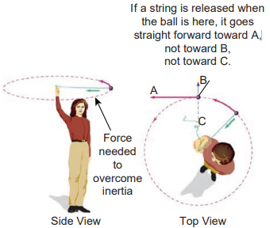
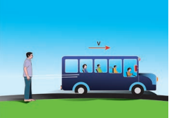
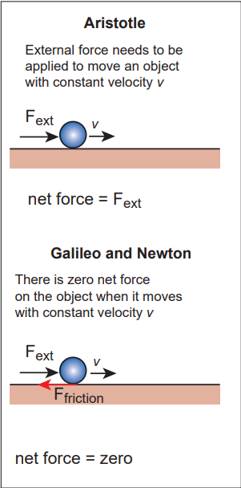
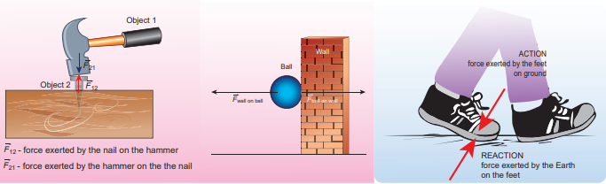
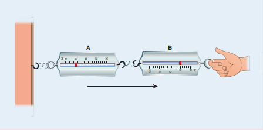
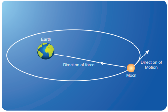
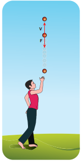
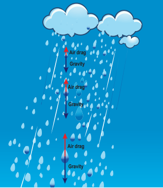
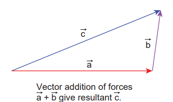
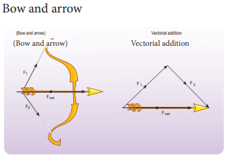

[comment]: <> (katex Header)


# NEWTON’S LAWS

>Newton analysed the views of Galileo, and 
other scientist like Kepler and Copernicus 
on motion and provided much deeper 
insights in the form of three laws.

## Newton’s First Law

>*Every object continues to be in the state 
of rest or of uniform motion (constant 
velocity) unless there is external force acting 
on it.*

>This inability of objects to move on its 
own or change its state of motion is called 
inertia. Inertia means resistance to change 
its state. Depending on the circumstances, 
there can be three types of inertia.

>1. **Inertia of rest:** When a stationary bus 
starts to move, the passengers experience 
a sudden backward push. Due to inertia, 
the body (of a passenger) will try to

>**Figure 3.2** Passengers experience a 
backward push due to inertia of rest

>continue in the state of rest, while the 
bus moves forward. This appears as a 
backward push as shown in Figure 3.2. 
*The inability of an object to change its 
state of rest is called inertia of rest.*

>2. **Inertia of motion:** When the bus is 
in motion, and if the brake is applied 
suddenly, passengers move forward 
and hit against the front seat. In this 
case, the bus comes to a stop, while the 
body (of a passenger) continues to move 
forward due to the property of inertia 
as shown in Figure 3.3. *The inability of 
an object to change its state of uniform 
speed (constant speed) on its own is called
inertia of motion.*

>3. **Inertia of direction:** When a stone 
attached to a string is in whirling

>**Figure 3.3** Passengers experience a 
forward push due to inertia of motion 
motion, and if the string is cut suddenly, 
the stone will not continue to move in 
circular motion but moves tangential 
to the circle as illustrated in Figure 3.4. 
This is because the body cannot change 
its direction of motion without any force 
acting on it. *The inability of an object to 
change its direction of motion on its own 
is called inertia of direction.*

>When we say that an object is at rest or 
in motion with constant velocity, it has a 
meaning only if it is specified with respect to 
some reference frames. In physics, any motion 
has to be stated with respect to a reference 
frame. It is to be noted that Newton’s first law is 
valid only in certain special reference frames 
called inertial frames. In fact, Newton’s first 
law defines an inertial frame.

>**Figure 3.4** A stone moves tangential to 
circle due to inertia of direction

>*Inertial Frames*
>If an object is free from all forces, then it 
moves with constant velocity or remains at 
rest when seen from inertial frames. Thus, 
there exists some special set of frames in 
which, if an object experiences no force, it 
moves with constant velocity or remains at 
rest. But how do we know whether an object 
is experiencing a force or not? All the objects 
in the Earth experience Earth’s gravitational 
force. In the ideal case, if an object is in deep 
space (very far away from any other object), 
then Newton’s first law will be certainly valid. 
Such deep space can be treated as an inertial 
frame. But practically it is not possible to reach 
such deep space and verify Newton’s first law.

>For all practical purposes, we can treat 
Earth as an inertial frame because an object on 
the table in the laboratory appears to be at rest 
always. This object never picks up acceleration 
in the horizontal direction since no force 
acts on it in the horizontal direction. So the 
laboratory can be taken as an inertial frame for 
all physics experiments and calculations. For 
making these conclusions, we analyse only the 
horizontal motion of the object as there is no 
horizontal force that acts on it. We should not 
analyse the motion in vertical direction as the 
two forces (gravitational force in the downward 
direction and normal force in upward 
direction) that act on it makes the net force is 
zero in vertical direction. Newton’s first law 
deals with the motion of objects in the absence 
of any force and not the motion under zero net 
force. Suppose a train is moving with constant 
velocity with respect to an inertial frame, then 
an object at rest in the inertial frame (outside 
the train) appears to move with constant 
velocity with respect to the train (viewed from 
within the train). So the train can be treated as 
an inertial frame. All inertial frames are moving 
with constant velocity relative to each other. If 
an object appears to be at rest in one inertial 
frame, it may appear to move with constant 
velocity with respect to another inertial frame. 
For example, in Figure 3.5, the car is moving 
with uniform velocity v with respect to a person 
standing (at rest) on the ground. As the car is 
moving with constant velocity with respect to 
the person at rest on the ground, both frames 
(with respect to the car and to the ground) are 
inertial frames.

>**Figure 3.5** The person and 
vehicle are inertial frames

>Suppose an object remains at rest on a 
smooth table kept inside the train, and if the 
train suddenly accelerates (which we may 
not sense), the object appears to accelerate 
backwards even without any force acting on 
it. It is a clear violation of Newton’s first law 
as the object gets accelerated without being 
acted upon by a force. It implies that the train 
is not an inertial frame when it is accelerated. 
For example, Figure 3.6 shows that car 2 is 
a non-inertial frame since it moves with 
acceleration $ \vec{a} $ with respect to the ground.

>**Figure 3.6** Car 2 is a non-inertial 
frame

>These kinds of accelerated frames are called 
non-inertial frames. A rotating frame is also 
a non inertial frame since rotation requires 
acceleration. In this sense, Earth is not really 
an inertial frame since it has self-rotation 
and orbital motion. But these rotational 
effects of Earth can be ignored for the motion 
involved in our day-to-day life. For example, 
when an object is thrown, or the time 
period of a simple pendulum is measured 
in the physics laboratory, the Earth’s selfrotation has very negligible effect on it. In 
this sense, Earth can be treated as an inertial 
frame. But at the same time, to analyse 
the motion of satellites and wind patterns 
around the Earth, we cannot treat Earth as 
an inertial frame since its self-rotation has 
a strong influence on wind patterns and 
satellite motion.

##  Newton’s Second Law

>This law states that

>*The force acting on an object is equal to 
the rate of change of its momentum*

> $$ \vec{F} = d \vec{p} / dt (3.1) $$

>In simple words, whenever the momentum 
of the body changes, there must be a force 
acting on it. The momentum of the object is 
defined as $ \vec{p} = m \vec{v} $. In most cases, the mass 
of the object remains constant during the 
motion. In such cases, the above equation 
gets modified into a simpler form

>$$ \vec{F} = d(m \vec{v})/dt = m d \vec{v} / dt = m \vec{a}. $$
>$$ \vec{F} = m \vec{a}  (3.2) $$ 

>The above equation conveys the fact that 
if there is an acceleration $ \vec{a} $
on the body, 
then there must be a force acting on it. This 
implies that if there is a change in velocity, 
then there must be a force acting on the 
body. The force and acceleration are always 
in the same direction. Newton’s second law 
was a paradigm shift from Aristotle’s idea 
of motion. According to Newton, the force 
need not cause the motion but only a change 
in motion. It is to be noted that
*Newton’s second law is valid only in inertial frames.*
In non-inertial frames Newton’s second law 
cannot be used in this form. It requires some 
modification.

>In the SI system of units, the unit of force 
is measured in newtons and it is denoted by 
symbol ‘N’.

>*One Newton is defined as the force which 
acts on 1 kg of mass to give an acceleration 
1 ms -2 in the direction of the force.*

>**Aristotle vs. Newton’s approach on 
sliding object**

>Newton’s second law gives the correct 
explanation for the experiment on the 
inclined plane that was discussed in 
section 3.1. In normal cases, where friction 
is not negligible, once the object reaches the 
bottom of the inclined plane (Figure 3.1), 
it travels some distance and stops. Note 
that it stops because there is a frictional 
force acting in the direction opposite to 
its velocity. It is this frictional force that 
reduces the velocity of the object to zero and 
brings it to rest. As per Aristotle’s idea, as 
soon as the body reaches the bottom of the 
plane, it can travel only a small distance and 
stops because there is no force acting on the 
object. Essentially, he did not consider the 
frictional force acting on the object.

>**Figure 3.7** Aristotle, Galileo and 
Newton’s approach

##  Newton’s Third Law

>Consider Figure 3.8(a) whenever an 
object 1 exerts a force on the object 2 ($ \vec{F}_{21} $), 
then object 2 must also exert equal and 
opposite force on the object 1 ( $ \vec{F}_{12} $). These 
forces must lie along the line joining the 
two objects.

>$$ \vec{F}_{12} = -\vec{F}_{21} $$

>Newton’s third law assures that the 
forces occur as equal and opposite pairs. 
An isolated force or a single force cannot 
exist in nature. 
*Newton’s third law states 
that for every action there is an equal and 
opposite reaction.*
Here, action and reaction 
pair of forces do not act on the same body 
but on two different bodies. Any one of the 
forces can be called as an action force and 
the other the reaction force. Newton’s third 
law is valid in both inertial and non-inertial 
frames.

>These action-reaction forces are not 
cause and effect forces. It means that when 
the object 1 exerts force on the object 2, the 
object 2 exerts equal and opposite force on 
the body 1 at the same instant.

>**Figure 3.8** Demonstration of Newton’s third law (a) Hammer and the nail (b) Ball 
bouncing off the wall (c) Walking on the floor with friction

**ACTIVITY**

>Verification of Newton’s third law

>Attach two spring balances as shown in the figure. Fix one end with rigid support and 
leave the other end free, which can be pulled with the hand.

>Pull one end with some 
force and note the reading 
on both the balances.

>Repeat the exercise a 
number of times.

**Note**
>The reading in the spring 
balance A is due to the force 
given by spring balance B. The 
reading in the spring balance 
B is due to the reaction force given by 
spring balance A. Note that according to 
Newton’s third law, both readings (force) 
are equal.

## Discussion on Newton’s Laws

>1. Newton’s laws are vector laws. The 
equation $ \vec{F} = m \vec{a} $ is a vector equation 
and essentially it is equivalent to 
three scalar equations. In Cartesian 
coordinates, this equation can be written 
as 
$$ F_x \mathbf{i} + F_y \mathbf{j} + F_z \mathbf{k} = ma_x \mathbf{i} + ma_y \mathbf{j} + ma_z \mathbf{k} $$
By comparing both sides, the three scalar 
equations are

$$ F_x = ma_x $$
The acceleration along the x 
direction depends only on the component 
of force acting along the x-direction.

$$ F_y = ma_y $$
 The acceleration along the y 
direction depends only on the component 
of force acting along the y-direction.

$$ F_z = ma_z $$
The acceleration along the z 
direction depends only on the component 
of force acting along the z-direction.

>From the above equations, we can infer 
that the force acting along y direction 
cannot alter the acceleration along x 
direction. In the same way, *$F_z$* cannot 
affect *$a_y$* and *$a_x$* . This understanding is 
essential for solving problems.

>2. The acceleration experienced by the 
body at time t depends on the force 
which acts on the body at that instant 
of time. It does not depend on the force 
which acted on the body before the time 
t. This can be expressed as

>$$ \vec{F}(t) = m \vec{a}(t) $$

>Acceleration of the object does not 
depend on the previous history of 
the force. For example, when a spin 
bowler or a fast bowler throws the ball 
to the batsman, once the ball leaves 
the hand of the bowler, it experiences 
only gravitational force and air 
frictional force. The acceleration of 
the ball is independent of how the ball 
was bowled (with a lower or a higher 
speed).

>3. In general, the direction of a force 
may be different from the direction 
of motion. Though in some cases, the 
object may move in the same direction 
as the direction of the force, it is not 
always true. A few examples are given 
below.

>**Case 1: Force and motion in the same 
direction**

>When an apple falls towards the Earth, 
the direction of motion (direction of 
velocity) of the apple and that of force 
are in the same downward direction as 
shown in the Figure 3.9 (a).

>**Case 2: Force and motion not in the 
same direction**

>The Moon experiences a force towards 
the Earth. But it actually moves in 
elliptical orbit. In this case, the direction 
of the force is different from the direction 
of motion as shown in Figure 3.9 (b).

>**Figure 3.9** (b) Moon orbiting in elliptical 
orbit around the Earth

>**Case 3: Force and motion in opposite 
direction**

>If an object is thrown vertically upward, 
the direction of motion is upward, 
but gravitational force is downward as 
shown in the Figure 3.9 (c).

>**Figure 3.9** (c) Force and 
direction of motion are in 
opposite directions

>**Case 4: Zero net force, but there is 
motion**

>When a raindrop gets detached from 
the cloud it experiences both downward 
gravitational force and upward air drag 
force. As it descends towards the Earth, 
the upward air drag force increases and 
after a certain time, the upward air drag 
force cancels the downward gravity. From 
then on the raindrop moves at constant 
velocity till it touches the surface of 
the Earth. Hence the raindrop comes 
with zero net force, therefore with zero 
acceleration but with non-zero terminal 
velocity. It is shown in the Figure 3.9 (d).

>**Figure 3.9** (d) Zero net force and non 
zero terminal velocity

4. If multiple forces
 $$ \vec{F}_{1}, \vec{F}_{2}, \vec{F}_{3}... \vec{F}_{n} $$ 
 act on 
the same body, then the total force 
($ \vec{F}_{net} $)
 is equivalent to the vectorial sum 
of the individual forces. Their net force 
provides the acceleration.

$$ \vec{F}_{net} =\vec{F}_{1}+ \vec{F}_{2}+ \vec{F}_{3}+... +\vec{F}_{n} $$

>**Figure 3.10** Vector addition of forces

>Newton’s second law for this case is

>$$ \vec{F}_{net} = m\vec{a} $$

>In this case the direction of acceleration 
is in the direction of net force.

>**Example**

>**Figure 3.11** Bow and arrow – Net force 
is on the arrow

>5. Newton’s second law can also be written 
in the following form.
Since the acceleration is the second 
derivative of position vector of the body 
$$ \vec{a} = \frac{d^2\vec{r}}{dt^2} $$
, the force on the body is

>$$ \vec{F} = m\frac{d^2\vec{r}}{dt^2} $$

>From this expression, we can infer that 
Newton’s second law is basically a second 
order ordinary differential equation 
and whenever the second derivative of 
position vector is not zero, there must be 
a force acting on the body. 

>6. If no force acts on the body then Newton’s 
second law, 
$$ m\frac{du}{dv} = 0 $$

>It implies that 
v c = onstant. It is 
essentially Newton’s first law. It implies 
that the second law is consistent with 
the first law. However, it should not be 
thought of as the reduction of second 
law to the first when no force acts on the 
object. Newton’s first and second laws are 
independent laws. They can internally 
be consistent with each other but cannot 
be derived from each other.

>7. Newton’s second law is cause and 
effect relation. Force is the cause and 
acceleration is the effect. Conventionally, 
the effect should be written on the left 
and cause on the right hand side of the 
equation. So the correct way of writing 
Newton’s second law is 
$$ m\mathbf{a} = \mathbf{F} \quad \text{or} \quad \frac{d\mathbf{p}}{dt} = \mathbf{F} $$

