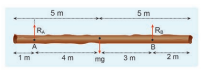
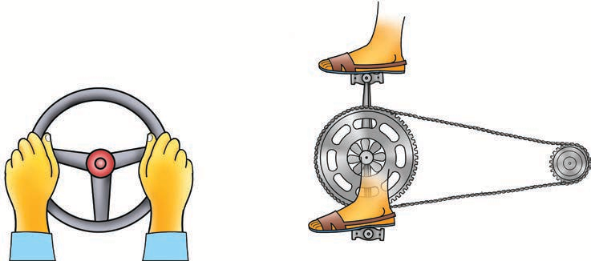
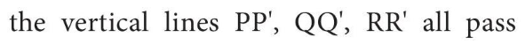
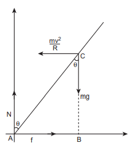

# EQUILIBRIUM OF RIGID BODIES

When a body is at rest without any motion on a table, we say that there is no force acting on the body. Actually it is wrong because, there is gravitational force acting on the body downward and also the normal force exerted by table on the body upward. These two forces cancel each other and thus there is no net force acting on the body. There is a lot of difference between the terms "no force" and "no net force" acting on a body. The same argument holds good for rotational conditions in terms of torque or moment of force.

$A$ rigid body is said to be in mechanical equilibrium when both its linear momentum and angular momentum remain constant.

When the linear momentum remains constant, the net force acting on the body is zero.

$$
\overrightarrow{\mathrm{F}}_{\mathrm{net}}=0
$$

In this condition, the body is said to be in translational equilibrium. This implies that the vector sum of different forces $\overrightarrow{\mathrm{F}}_{1}, \overrightarrow{\mathrm{F}}_{2}, \overrightarrow{\mathrm{F}}_{3} \ldots$ acting in different directions on the body is zero.

$$
\overrightarrow{\mathrm{F}}_{1}+\overrightarrow{\mathrm{F}}_{2}+\overrightarrow{\mathrm{F}}_{3}+\cdots+\overrightarrow{\mathrm{F}}_{\mathrm{n}}=0
$$

If the forces $\overrightarrow{\mathrm{F}}_{1}, \overrightarrow{\mathrm{F}}_{2}, \overrightarrow{\mathrm{F}}_{3} \ldots$ act in different directions on the body, we can resolve them into horizontal and vertical components and then take the resultant in the respective directions. In this case there will be horizontal as well as vertical equilibria possible.

Similarly, when the angular momentum remains constant, the net torque acting on the body is zero.

$$
\vec{\tau}_{\text {net }}=0
$$

Under this condition, the body is said to be in rotational equilibrium. The vector sum of different torques $\vec{\tau}_{1}, \vec{\tau}_{2}, \vec{\tau}_{3} \ldots$ producing different senses of rotation on the body is zero.

$$
\vec{\tau}_{1}+\vec{\tau}_{2}+\vec{\tau}_{3}+\cdots+\vec{\tau}_{n}=0
$$

Thus, we can also conclude that a rigid body is in mechanical equilibrium when the net force and net torque acts on the body is zero.

$$
\overrightarrow{\mathrm{F}}_{\text {net }}=0 \text { and } \vec{\tau}_{\text {net }}=0
$$

As the forces and torques are vector quantities, the directions are to be taken with proper sign conventions.

## Types of Equilibrium

Based on the above discussions, we come to a conclusion that different types of equilibrium are possible based on the different conditions. They are consolidated in Table 5.2.

| Type of   equilibrium | Conditions |
| :---: | :---: |
| Translational   equilibrium | - Linear momentum is constant.   - Net force is zero. |
| Rotational   equilibrium | - Angular momentum is constant.   - Net torque is zero. |
| Static   equilibrium | - Linear momentum and angular momentum are zero.   - Net force and net torque are zero. |
| Dynamic   equilibrium | - Linear momentum and angular momentum are constant.   - Net force and net torque are zero. |
| Stable   equilibrium | - Linear momentum and angular momentum are zero.   - The body tries to come back to equilibrium if slightly disturbed and   released.   - The centre of mass of the body shifts slightly higher if disturbed from   equilibrium. |
| Unstable   equilibrium | - Linear momentum and angular momentum are zero.   - The body cannot come back to equilibrium if slightly disturbed and   released.   - The centre of mass of the body shifts slightly lower if disturbed from   equilibrium. |
| Neutral   equilibrium | - Linear momentum and angular momentum are zero.   - The body remains at the same equilibrium if slightly disturbed and   released.   - The centre of mass of the body does not shift higher or lower if disturbed   from equilibrium.   - Potential energy remains same even if disturbed. |

## Table 5.2 Different types of Equilibrium and their Conditions.

**EXAMPLE 5.12**

Arun and Babu carry a wooden log of mass $28 \mathrm{~kg}$ and length $10 \mathrm{~m}$ which has almost uniform thickness. They hold it at $1 \mathrm{~m}$ and $2 \mathrm{~m}$ from the ends respectively. Who will bear more weight of the log? $\quad\left[\mathrm{g}=10 \mathrm{~ms}^{-2}\right]$

**Solution**

Let us consider the $\log$ is in mechanical equilibrium. Hence, the netforceand net torque on the log must be zero. The gravitational force acts at the centre of mass of the log downwards. It is cancelled by the normal reaction forces $\mathrm{R}_{\mathrm{A}}$ and $\mathrm{R}_{\mathrm{B}}$ applied upwards by Arun and Babu at points $A$ and $B$ respectively. These reaction forces are the weights borne by them.

The total weight, $\mathrm{W}=\mathrm{mg}=28 \times 10=$ $280 \mathrm{~N}$, has to be borne by them together. The reaction forces are the weights borne by each of them separately. Let us show all the forces acting on the log by drawing a free body diagram of the log.

## For translational equilibrium:

The net force acting on the log must be zero.

Here, the forces $R_{A}$ an $R_{B}$ are taken positive as they act upward. The gravitational force acting downward is taken negative.

$$
\mathrm{R}_{\mathrm{A}}+\mathrm{R}_{\mathrm{B}}=\mathrm{mg}
$$

## For rotational equilibrium:

The net torque acting on the log must be zero. For ease of calculation, we can take the torque caused by all the forces about the point $\mathrm{A}$ on the log. The forces are perpendicular to the distances. Hence,

$$
\left(0 \mathrm{R}_{\mathrm{A}}\right)+(-4 \mathrm{mg})+\left(7 \mathrm{R}_{\mathrm{B}}\right)=0 .
$$

Here, the reaction force $\mathrm{R}_{\mathrm{A}}$ cannot produce any torque as the reaction forces pass through the point of reference A. The torque of force mg produces a clockwise turn about the point A which is taken negative and torque of force $R_{B}$ causes anticlockwise turn about A which is taken positive.

$$
\begin{gathered}
7 \mathrm{R}_{\mathrm{B}}=4 \mathrm{mg} \\
\mathrm{R}_{\mathrm{B}}=\frac{4}{7} \mathrm{mg} \\
\mathrm{R}_{\mathrm{B}}=\frac{4}{7} \times 28 \times 10=160 \mathrm{~N}
\end{gathered}
$$

By substituting for $\mathrm{R}_{\mathrm{B}}$ we get,

$$
\begin{gathered}
\mathrm{R}_{\mathrm{A}}=\mathrm{mg}-\mathrm{R}_{\mathrm{B}} \\
\mathrm{R}_{\mathrm{A}}=28 \times 10-160=280-160=120 \mathrm{~N}
\end{gathered}
$$

As $R_{B}$ is greater than $R_{A}$, it is concluded that Babu bears more weight than Arun. The one closer to centre of mass of the log bears more weight.

## Couple

Consider a thin uniform rod $\mathrm{AB}$. Its centre of mass is at its midpoint C. Let two forces which are equal in magnitude and opposite in direction be applied at the two ends $A$ and $B$ of the rod perpendicular to it. The two forces are separated by a distance of $2 \mathrm{r}$ as shown in Figure 5.13.

Figure 5.13 Couple

As the two equal forces are opposite in direction, they cancel each other and the net force acting on the rod is zero. Now the rod is in translational equilibrium. But, the rod is not in rotational equilibrium. Let us see how it is not in rotational equilibrium. The moment of the force applied at the end A taken with respect to the centre point C, produces an anticlockwise rotation. Similarly, the moment of the force applied at the end B also produces an anticlockwise rotation. The moments of both the forces cause the same sense of rotation in the rod. Thus, the rod undergoes a rotational motion or turning even though the rod is in translational equilibrium.

A pair of forces which are equal in magnitude but opposite in direction and separated by a perpendicular distance so that their lines of action do not coincide that causes a turning effect is called a couple. We come across couple in many of our daily activities as shown in Figure 5.14.

## Principle of Moments

Consider a light rod of negligible mass which is pivoted at a point along its length. Let two parallel forces $\mathrm{F}_{1}$ and $\mathrm{F}_{2}$ act at the two ends at distances $d_{1}$ and $d_{2}$ from the point of pivot and the normal reaction force $\mathrm{N}$ at

Figure 5.14 Turning effect of Couple
the point of pivot as shown in Figure 5.15. If the rod has to remain stationary in horizontal position, it should be in translational and rotational equilibrium. Then, both the net force and net torque must be zero.

Figure 5.15 Principle of Moments

For translational equilibrium, net force has to be zero, $-\mathrm{F}_{1}+\mathrm{N}-\mathrm{F}_{2}=0$

$$
\mathrm{N}=\mathrm{F}_{1}+\mathrm{F}_{2}
$$

For rotational equilibrium, net torque has to be zero, $\mathrm{d}_{1} \mathrm{~F}_{1}-\mathrm{d}_{2} \mathrm{~F}_{2}=0$

$$
\mathrm{d}_{1} \mathrm{~F}_{1}=\mathrm{d}_{2} \mathrm{~F}_{2}
$$

The above equation represents the principle of moments. This forms the principle for beam balance used for weighing goods with the condition $\mathrm{d}_{1}=\mathrm{d}_{2} ; \mathrm{F}_{1}=\mathrm{F}_{2}$. We can rewrite the equation 5.33 as,

$$
\frac{\mathrm{F}_{1}}{\mathrm{~F}_{2}}=\frac{\mathrm{d}_{2}}{\mathrm{~d}_{1}}
$$

If $\mathrm{F}_{1}$ is the load and $\mathrm{F}_{2}$ is our effort, we get advantage when, $\mathrm{d}_{1}<\mathrm{d}_{2}$. This implies that $\mathrm{F}_{1}>\mathrm{F}_{2}$. Hence, we could lift a large load with small effort. The ratio $\left(\frac{\mathrm{d}_{2}}{\mathrm{~d}_{1}}\right)$ is called mechanical advantage of the simple lever. The pivoted point is called fulcrum.

$$
\text { Mechanical Advantage }(M A)=\frac{d_{2}}{d_{1}}
$$

There are many simple machines that work on the above mentioned principle.

## Centre of Gravity

Each rigid body is made up of several point masses. Such point masses experience gravitational force towards the centre of Earth. As the size of Earth is very large compared to any practical rigid body we come across in daily life, these forces appear to be acting parallelly downwards as shown in Figure 5.16.

Figure 5.16. Centre of gravity

The resultant of these parallel forces always acts through a point. This point is called centre of gravity of the body (with respect to Earth). The centre of gravity of a body is the point at which the entire weight of the body acts irrespective of the position and orientation of the $b o d y$. The centre of gravity and centre of mass of a rigid body coincide when the gravitational field is uniform across the body. The concept of gravitational field is dealt in Unit 6.

We can also determine the centre of gravity of a uniform lamina of even an irregular shape by pivoting it at various points by trial and error. The lamina remains horizontal when pivoted at the point where the net gravitational force acts, which is the centre of gravity as shown in Figure 5.17. When a body is supported at the centre of gravity, the sum of the torques acting on all the point masses of the rigid body becomes zero. Moreover the weight is compensated by the normal reaction force exerted by the pivot. The body is in static equilibrium and hence it remains horizontal.

Figure 5.17. Determination of centre of gravity of plane lamina by pivoting

There is also another way to determine the centre of gravity of an irregular lamina. If we suspend the lamina from different

Figure 5.18 Determination of centre of gravity of plane lamina by suspending points like P, Q, R as shown in Figure 5.18,

through the centre of gravity. Here, reaction force acting at the point of suspension and the gravitational force acting at the centre of gravity cancel each other and the torques caused by them also cancel each other.

## Bending of Cyclist in Curves

Let us consider a cyclist negotiating a circular level road (not banked) of radius $\mathrm{r}$ with a speed $\mathrm{v}$. The cycle and the cyclist are considered as one system with mass $\mathrm{m}$. The centre gravity of the system is $\mathrm{C}$ and it goes in a circle of radius $r$ with centre at $\mathrm{O}$. Let us choose the line OC as $\mathrm{X}$-axis and the vertical line through $\mathrm{O}$ as $\mathrm{Z}$-axis as shown in Figure 5.19.

Figure 5.19 Bending of cyclist

The system as a frame is rotating about $\mathrm{Z}$-axis. The system is at rest in this rotating frame. To solve problems in rotating frame of reference, we have to apply a centrifugal force (pseudo force) on the system which will be $\frac{\mathrm{mv}^{2}}{\mathrm{r}}$. This force will act through the centre of gravity. The forces acting on the system are, (i) gravitational force (mg), (ii) normal force $(\mathrm{N})$, (iii) frictional force (f) and (iv) centrifugal force $\left(\frac{m v^{2}}{r}\right)$. As the system is in equilibrium in the rotational frame of reference, the net external force and net external torque must be zero. Let us consider all torques about the point $A$ in Figure 5.20.

Figure 5.20 Force diagrams for the cyclist in turns

For rotational equilibrium,

$$
\vec{\tau}_{\text {net }}=0
$$

The torque due to the gravitational force about point $\mathrm{A}$ is $(\mathrm{mg} \mathrm{AB})$ which causes a clockwise turn that is taken as negative. The torque due to the centrifugal force is $\left(\frac{\mathrm{mv}^{2}}{\mathrm{r}} \mathrm{BC}\right)$ which causes an anticlockwise turn that is taken as positive.

$$
\begin{gathered}
-\mathrm{mg} \mathrm{AB}+\frac{m v^{2}}{r} \mathrm{BC}=0 \\
\mathrm{mg} \mathrm{AB}=\frac{m v^{2}}{r} \mathrm{BC}
\end{gathered}
$$

From $\triangle \mathrm{ABC}$,

$\mathrm{AB}=\mathrm{AC} \sin \theta$ and $\mathrm{BC}=\mathrm{AC} \cos \theta$

$$
\begin{aligned}
\mathrm{mg} \mathrm{AC} \sin \theta & =\frac{\mathrm{mv}^{2}}{\mathrm{r}} \mathrm{AC} \cos \theta \\
\tan \theta & =\frac{\mathrm{v}^{2}}{\mathrm{rg}} \\
\theta & =\tan ^{-1}\left(\frac{\mathrm{v}^{2}}{\mathrm{rg}}\right)
\end{aligned}
$$

While negotiating a circular level road of radius $r$ at velocity $v$, a cyclist has to bend by an angle $\theta$ from vertical given by the above expression to stay in equilibrium (i.e. to avoid a fall).

## EXAMPLE 5.13

A cyclist while negotiating a circular path with speed $20 \mathrm{~m} \mathrm{~s}^{-1}$ is found to bend an angle by $30^{\circ}$ with vertical. What is the radius of the circular path? (given, $\mathrm{g}=10 \mathrm{~m} \mathrm{~s}^{-2}$ )

## Solution

Speed of the cyclist, $\mathrm{v}=20 \mathrm{~m} \mathrm{~s}^{-1}$

Angle of bending with vertical, $\theta=30^{\circ}$

Equation for angle of bending, $\tan \theta=\frac{\mathrm{v}^{2}}{\mathrm{rg}}$

Rewriting the above equation for radius

$r=\frac{v^{2}}{\tan \theta g}$

Substituting,

$$
\begin{aligned}
r & =\frac{(20)^{2}}{\left(\tan 30^{\circ}\right) \times 10}=\frac{20 \times 20}{\left(\tan 30^{\circ}\right) \times 10} \\
& =\frac{400}{\left(\frac{1}{\sqrt{3}}\right) \times 10} \\
r & =(\sqrt{3}) \times 40=1.732 \times 40 \\
r & =69.28 \mathrm{~m}
\end{aligned}
$$