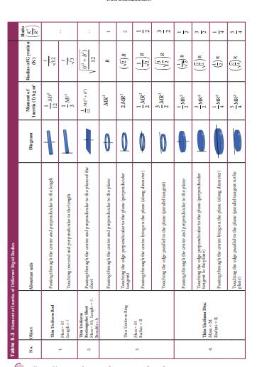
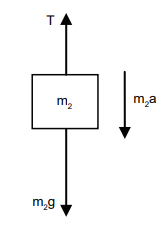
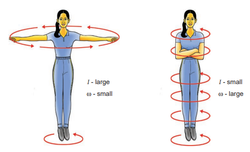

# ROTATIONAL DYNAMICS

The relations among torque, angular acceleration, angular momentum, angular velocity and moment of inertia were seen in Section 5.2. In continuation to that, in this section, we will learn the relations among the other dynamical quantities like work, kinetic energy in rotational motion of rigid bodies. Finally a comparison between the translational and rotational quantities is made with a tabulation.

## Effect of Torque on Rigid Bodies

A rigid body which has non zero external torque $(\tau)$ about the axis of rotation would have an angular acceleration $(\alpha)$ about that axis. The scalar relation between the torque and angular acceleration is,

$$
\tau=\mathrm{I} \alpha
$$

where, I is the moment of inertia of the rigid body. The torque in rotational motion is equivalent to the force in linear motion.

**EXAMPLE 5.18**

A disc of mass $500 \mathrm{~g}$ and radius $10 \mathrm{~cm}$ can freely rotate about a fixed axis as shown in figure. light and inextensible string is wound several turns around it and $100 \mathrm{~g}$ body is suspended at its free end. Find the acceleration of this mass. [Given: The string makes the disc to rotate and does not slip over it. $\mathrm{g}=10 \mathrm{~m} \mathrm{~s}^{-2}$.]

**Solution**

Let the mass of the disc be $m_{1}$ and its radius $R$. The mass of the suspended body is $\mathrm{m}_{2}$.

$$
\begin{aligned}
\mathrm{m}_{1} & =500 \mathrm{~g}=500 \times 10^{-3} \mathrm{~kg}=0.5 \mathrm{~kg} \\
\mathrm{~m}_{2} & =100 \mathrm{~g}=100 \times 10^{-3} \mathrm{~kg}=0.1 \mathrm{~kg} \\
\mathrm{R} & =10 \mathrm{~cm}=10 \times 10^{-2} \mathrm{~m}=0.1 \mathrm{~m}
\end{aligned}
$$

As the light inextensible string is wound around the disc several times it makes the disc rotate without slipping over it. The translational acceleration of $\mathrm{m}_{2}$ and tangential acceleration of $m_{1}$ will be the same. Let us draw the free body diagram $(F B D)$ of $\mathrm{m}_{1}$ and $\mathrm{m}_{2}$ separately.

FBD of the disc:

Its gravitational force $\left(m_{1} g\right)$ acts downward and normal force $\mathrm{N}$ exerted by the fixed support at the centre acts upward. The tension $\mathrm{T}$ acts downward at the edge. The gravitational force $\left(\mathrm{m}_{1} \mathrm{~g}\right)$ and the normal force $(\mathrm{N})$ cancel each other. $\mathrm{m}_{1} \mathrm{~g}=\mathrm{N}$

The tension $\mathrm{T}$ produces a torque $(\mathrm{R} \mathrm{T})$, which produces a rotational motion in the disc with angular acceleration, $\left(\alpha=\frac{\mathrm{a}}{\mathrm{R}}\right)$. Here, $a$ is the linear acceleration of a point at the edge of the disc. If the moment of inertia of the disc is I and its radius of gyration is $\mathrm{K}$, then

$$
\begin{gathered}
\mathrm{RT}=\mathrm{I} \alpha ; \quad \mathrm{R} \mathrm{T}=\left(\mathrm{m}_{1} \mathrm{~K}^{2}\right) \frac{\mathrm{a}}{\mathrm{R}} \\
\mathrm{T}=\left(\mathrm{m}_{1} \mathrm{~K}^{2}\right) \frac{\mathrm{a}}{\mathrm{R}^{2}}
\end{gathered}
$$

**FBD of the body:**

Its gravitational force $\left(\mathrm{m}_{2} \mathrm{~g}\right)$ acts downward and the tension $\mathrm{T}$ acts upward. As $\left(\mathrm{T}<\mathrm{m}_{2} \mathrm{~g}\right)$, there is a resultant force $\left(\mathrm{m}_{2} \mathrm{a}\right)$ acting on it downward.

$$
\mathrm{m}_{2} \mathrm{~g}-\mathrm{T}=\mathrm{m}_{2} \mathrm{a}
$$

Substituting for $\mathrm{T}$ from the equation for disc,

$$
\begin{aligned}
& \mathrm{m}_{2} \mathrm{~g}-\left(\mathrm{m}_{1} \mathrm{~K}^{2}\right) \frac{\mathrm{a}}{\mathrm{R}^{2}}=\mathrm{m}_{2} \mathrm{a} \\
& \mathrm{m}_{2} \mathrm{~g}=\left(\mathrm{m}_{1} \mathrm{~K}^{2}\right) \frac{\mathrm{a}}{\mathrm{R}^{2}}+\mathrm{m}_{2} \mathrm{a} \\
& \mathrm{m}_{2} \mathrm{~g}=\left[\left(\mathrm{m}_{1} \frac{\mathrm{K}^{2}}{\mathrm{R}^{2}}\right)+\mathrm{m}_{2}\right] \mathrm{a} \\
& \mathrm{a}=\frac{\mathrm{m}_{2}}{\left[\left(\mathrm{~m}_{1} \frac{\mathrm{K}^{2}}{\mathrm{R}^{2}}\right)+\mathrm{m}_{2}\right]} \mathrm{g}
\end{aligned}
$$

The expression $\left(\frac{\mathrm{K}^{2}}{\mathrm{R}^{2}}\right)$ for a disc rotating about an axis passing through the centre and perpendicular to the plane is, $\frac{\mathrm{K}^{2}}{\mathrm{R}^{2}}=\frac{1}{2}$. (Ref Table 5.3) Now the expression for acceleration further simplifies as,

$$
a=\frac{m_{2}}{\left[\left(\frac{m_{1}}{2}\right)+m_{2}\right]} g ; \quad a=\frac{2 m_{2}}{\left[m_{1}+2 m_{2}\right]} g
$$

substituting the values,

$$
\begin{gathered}
a=\frac{2 \times 0.1}{[0.5+0.2]} \times 10=\frac{0.2}{0.7} \times 10 \\
a=2.857 \mathrm{~m} \mathrm{~s}^{-2}
\end{gathered}
$$

## Conservation of Angular Momentum

When no external torque acts on the body, the net angular momentum of a rotating rigid body remains constant. This is known as law of conservation of angular momentum.

$$
\begin{aligned}
& \tau=\frac{\mathrm{dL}}{\mathrm{dt}} \\
& \text { If } \tau=0 \text { then, } \mathrm{L}=\mathrm{constant}
\end{aligned}
$$

As the angular momentum is $\mathrm{L}=\mathrm{I} \omega$, the conservation of angular momentum could further be written for initial and final situations as,

$$
\mathrm{I}_{i} \omega_{i}=\mathrm{I}_{f} \omega_{f} \text { (or) } \mathrm{I} \omega=\mathrm{constant}
$$

The above equations say that if I increases $\omega$ will decrease and vice-versa to keep the angular momentum constant.

There are several situations where the principle of conservation of angular momentum is applicable. One striking example is an ice dancer as shown in Figure 5.27. The dancer spins slowly when the hands are stretched out and spins faster when the hands are brought close to the body. Stretching of hands away from body increases moment of inertia, thus the angular velocity decreases resulting in slower spin. When the hands are brought close to the body, the moment of inertia decreases, and thus the angular velocity increases resulting in faster spin.

A diver while in air as in Figure 5.28 curls the body close to decrease the moment of inertia, which in turn helps to increase the number of somersaults in air.

Figure 5.28 Conservation of angular momentum for a diver

Figure 5.27 Conservation of angular momentum for ice dancer

**EXAMPLE 5.19**

A jester in a circus is standing with his arms extended on a turn table rotating with angular velocity $\omega$. He brings his arms closer to his body so that his moment of inertia is reduced to one third of the original value. Find his new angular velocity. [Given: There is no external torque on the turn table in the given situation.]

**Solution**

Let the moment of inertia of the jester with his arms extended be I. As there is no external torque acting on the jester and the turn table, his total angular momentum is conserved. We can write the equation,

$$
\begin{aligned}
\mathrm{I}_{i} \omega_{i} & =\mathrm{I}_{f} \omega_{f} \\
\mathrm{I}_{\mathrm{i}} \omega_{\mathrm{i}} & =\frac{1}{3} \mathrm{I}_{\mathrm{i}} \omega_{f} \quad\left(\because \mathrm{I}_{f}=\frac{1}{3} \mathrm{I}_{i}\right) \\
\omega_{f} & =3 \omega_{i}
\end{aligned}
$$

The above result tells that the final angular velocity is three times that of initial angular velocity.

## Work done by Torque

Let us consider a rigid body rotating about a fixed axis. Figure 5.29 shows a point $\mathrm{P}$ on the body rotating about an axis perpendicular to the plane of the page. A tangential force $\mathrm{F}$ is applied on the body.

It produces a small displacement ds on the body. The work done (dw) by the force is,

Figure 5.29 Work done by torque

$$
\mathrm{dw}=\mathrm{Fds}
$$

As the distance ds, the angle of rotation $\mathrm{d} \theta$ and radius $r$ are related by the expression,

$$
\mathrm{ds}=\mathrm{rd} \theta
$$

The expression for work done now becomes,

$$
\mathrm{dw}=\mathrm{Fds} ; \quad \mathrm{dw}=\mathrm{Frd} \theta
$$

The term (Fr) is the torque $\tau$ produced by the force on the body.

$$
\mathrm{dw}=\tau \mathrm{d} \theta
$$

This expression gives the work done by the external torque $\tau$, which acts on the body rotating about a fixed axis through an angle $\mathrm{d} \theta$.

The corresponding expression for work done in translational motion is,

$$
\mathrm{dw}=\mathrm{Fds}
$$

## Kinetic Energy in Rotation

Let us consider a rigid body rotating with angular velocity $\omega$ about an axis as shown in Figure 5.30. Every particle of the body will have the same angular velocity $\omega$ and different tangential velocities $\mathrm{v}$ based on its positions from the axis of rotation.

Figure 5.30 Kinetic energy in rotation

Let us choose a particle of mass $\mathrm{m}_{\mathrm{i}}$ situated at distance $r_{i}$ from the axis of rotation. It has a tangential velocity $\mathrm{v}_{\mathrm{i}}$ given by the relation, $\mathrm{v}_{\mathrm{i}}=\mathrm{r}_{\mathrm{i}} \omega$. The kinetic energy $\mathrm{KE}_{\mathrm{i}}$ of the particle is,

$$
\mathrm{KE}_{i}=\frac{1}{2} \mathrm{~m}_{i} \mathrm{v}_{i}^{2}
$$

Writing the expression with the angular velocity,

$$
\mathrm{KE}_{i}=\frac{1}{2} \mathrm{~m}_{i}\left(\mathrm{r}_{i} \omega\right)^{2}=\frac{1}{2}\left(\mathrm{~m}_{i} \mathrm{r}_{i}^{2}\right) \omega^{2}
$$

For the kinetic energy of the whole body, which is made up of large number of such particles, the equation is written with summation as,

$$
\mathrm{KE}=\frac{1}{2}\left(\sum \mathrm{m}_{i} \mathrm{r}_{i}^{2}\right) \omega^{2}
$$

where, the term $\sum \mathrm{m}_{\mathrm{i}} \mathrm{r}_{\mathrm{i}}^{2}$ is the moment of inertia I of the whole body. $I=\sum \mathrm{m}_{\mathrm{i}} \mathrm{r}_{\mathrm{i}}^{2}$

Hence, the expression for $\mathrm{KE}$ of the rigid body in rotational motion is,

$$
\mathrm{KE}=\frac{1}{2} \mathrm{I} \omega^{2}
$$

This is analogous to the expression for kinetic energy in translational motion.

$$
\mathrm{KE}=\frac{1}{2} \mathrm{Mv}^{2}
$$

## Relation between rotational kinetic energy and angular momentum

Let a rigid body of moment of inertia I rotate with angular velocity $\omega$.

The angular momentum of a rigid body is, $\mathrm{L}=\mathrm{I} \omega$

The rotational kinetic energy of the rigid body is, $\mathrm{KE}=\frac{1}{2} \mathrm{I} \omega^{2}$

By multiplying the numerator and denominator of the above equation with I, we get a relation between $\mathrm{L}$ and $\mathrm{KE}$ as,

$$
\begin{aligned}
\mathrm{KE} & =\frac{1}{2} \frac{\mathrm{I}^{2} \omega^{2}}{\mathrm{I}}=\frac{1}{2} \frac{(\mathrm{I} \omega)^{2}}{\mathrm{I}} \\
\mathrm{KE} & =\frac{\mathrm{L}^{2}}{2 \mathrm{I}}
\end{aligned}
$$

**EXAMPLE 5.20**

Find the rotational kinetic energy of a ring of mass $9 \mathrm{~kg}$ and radius $3 \mathrm{~m}$ rotating with $240 \mathrm{rpm}$ about an axis passing through its centre and perpendicular to its plane. (rpm is a unit of speed of rotation which means revolutions per minute)

**Solution**

The rotational kinetic energy is, $\mathrm{KE}=\frac{1}{2} \mathrm{I} \omega^{2}$ The moment of inertia of the ring is, $\mathrm{I}=M R^{2}$

$$
\mathrm{I}=9 \times 3^{2}=9 \times 9=81 \mathrm{~kg} \mathrm{~m}^{2}
$$

The angular speed of the ring is,

$$
\begin{aligned}
\omega= & 240 \mathrm{rpm}=\frac{240 \times 2 \pi}{60} \mathrm{rad} \mathrm{s}^{-1} \\
\mathrm{KE}= & \frac{1}{2} \times 81 \times\left(\frac{240 \times 2 \pi}{60}\right)^{2}=\frac{1}{2} \times 81 \times(8 \pi)^{2} \\
\mathrm{KE}= & \frac{1}{2} \times 81 \times 64 \times(\pi)^{2}=2592 \times(\pi)^{2} \\
& \mathrm{KE} \approx 25920 \mathrm{~J} \quad \because(\pi)^{2} \approx 10 \\
& \mathrm{KE}=25.920 \mathrm{~kJ}
\end{aligned}
$$

## Power Delivered by Torque

Power delivered is the work done per unit time. If we differentiate the expression for work done with respect to time, we get the instantaneous power $(\mathrm{P})$.

$$
\begin{aligned}
& P=\frac{d w}{d t}=\tau \frac{d \theta}{d t} \quad \because(\mathrm{dw}=\tau \mathrm{d} \theta) \\
& P=\tau \omega
\end{aligned}
$$

The analogous expression for instantaneous power delivered in translational motion is,

$\mathrm{P}=\vec{F} \cdot \vec{v}$

## Comparison of Translational and Rotational Quantities

Many quantities in rotational motion have expressions similar to that of translational motion. The rotational terms are compared with the translational equivalents in Table 5.4.

