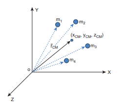
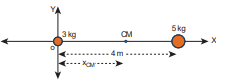
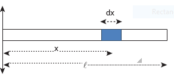
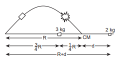

[comment]: <> (katex Header)


## Centre of Mass
When a rigid body moves, all particles that
constitute the body need not take the same
path. Depending on the type of motion,
different particles of the body may take
different paths. For example, when a wheel
rolls on a surface, the path of the centre point
of the wheel and the paths of other points
of the wheel are different. In this Unit, we
study about the translation, rotation and
the combination of these motions of rigid
bodies in detail.

## Centre of Mass of a Rigid Body

When a bulk object (say a bat) is thrown at an angle in air as shown in Figure 5.1; do all the points of the body take a parabolic path? Actually, only one point takes the parabolic path and all the other points take different paths.

**Figure 5.1** Centre of mass tracing the path of a parabola

The one point that takes the parabolic path is a very special point called _centre of mass_ (CM) of the body. Its motion is like the motion of a single point that is thrown. The _centre of mass of a body is defined as a point where the entire mass of the body appears to be concentrated. Therefore, this point can_ represent the entire body.  

For bodies of regular shape and uniform mass distribution, the centre of mass is at the geometric centre of the body. As examples, for a circle and sphere, the centre of mass is at their centres; for square and rectangle, at the point their diagonals meet; for cube and cuboid, it is at the point where their body diagonals meet. For other bodies, the centre of mass has to be determined using some methods. The centre of mass could be well within the body and in some cases outside the body as well.

## Centre of Mass for Distributed Point Masses
_A point mass is a hypothetical point particle which has nonzero mass and no size or shape_. To find the centre of mass for a collection of n point masses, say, m1, m2, m3 . . . mn we have to first choose an origin and an appropriate coordinate system as shown in Figure 5.2. Let, x1, x2, x3 . . . xn be the X-coordinates of the positions of these point masses in the X direction from the origin.

**Figure 5.2** Centre of mass for distributed point masses

The equation for the x coordinate of the centre of mass is,

\\( [ x_{\text{CM}} = \frac{\sum_{i} m_i x_i}{\sum_{i} m_i} ] \\)

where ( sum m_i) is the total mass ( M ) of all the particles,


[ x_{\text{CM}} = \frac{\sum_{i} x_i m_i}{M} \quad (5.1) ]

Similarly, we can also find y and z coordinates of the centre of mass for these distributed point masses as indicated in Figure (5.2).

[ y_{\text{CM}} = \frac{\sum_{i} y_i m_i}{M} \quad (5.2) ]

[ z_{\text{CM}} = \frac{\sum_{i} z_i m_i}{M} \quad (5.3) ]


Hence, the position of centre of mass of these point masses in a Cartesian coordinate system is \\( (x_{CM}, y_{CM}, z_{CM}) \\). In general, the position of centre of mass can be written in a vector form as,


[ \vec{r}_{\text{CM}} = \sum_{i} \frac{m_i \vec{r}_i}{M} \quad (5.4) ]


where, \( \vec{r}_{\text{CM}} = \sum_{i} \frac{m_i \vec{r}_i}{M} \) is the position vector of the center of mass and \( \vec{r}_i = x_i \hat{i} + y_i \hat{j} + z_i \hat{k} \) is the position vector of the distributed point mass. Here, \(\hat{i}, \hat{j},\) and \(\hat{k}\) are the unit vectors along X, Y, and Z-axes respectively.

## Centre of Mass of Two Point Masses

With the equations for centre of mass, let us find the centre of mass of two point masses m1 and m2, which are at positions x1 and x2 respectively on the X-axis. For this case, we can express the position of centre of mass in the following three ways based on the choice of the coordinate system.

_(i) When the masses are on positive X-axis:_ The origin is taken arbitrarily so that the masses m1 and m2 are at positions x1 and x2 on the positive X-axis as shown in Figure 5.3(a). The centre of mass will also be on the positive X-axis at xCM as given by the equation,


[ x_{1} m_{1} x_{2} m_{2} x_{\text{CM}} ]


_(ii) When the origin coincides with any one of the masses:_ The calculation could be minimised if the origin of the coordinate system is made to coincide with any one of the masses as shown in Figure 5.3(b). When the origin coincides with the point mass m1, its position x1 is zero, (i.e. x1 = 0). Then,


[ x_{1} m_{1} x_{2} m_{2} x_{\text{CM}} ]


The equation further simplifies as,

[ x_{1} m_{1} x_{2} m_{2} m_{\text{CM}} ]


Where:
-( x_{1} ), ( m_{1}), ( x_{2} ), ( m_{2} ), ( m_{\text{CM}} ) represent the respective variables,
- Subscripts "1 2 2" and "1 2" represent specific values for the variables.

_(iii) When the origin coincides with the centre of mass itself:_ If the origin of the coordinate system is made to coincide with the centre of mass,then, xCM = 0 and the mass m1 is found to be on the negative X-axis as shown in Figure 5.3(c). Hence, its position x1 is negative, (i.e. -x1).

The equation given above is known as _principle of moments._ We will learn more about this in Section 5.3.3.

**Figure 5.3** Centre of mass of two point masses determined by shifting the origin
  

**EXAMPLE 5.1**

Two point masses 3 kg and 5 kg are at 4 m and 8 m from the origin on X-axis. Locate the position of centre of mass of the two point masses (i) from the origin and (ii) from 3 kg mass.

**_Solution_**

Let us take, m1 = 3 kg and m2= 5 kg

_(i) To find centre of mass from the origin:_ The point masses are at positions, x1 = 4 m, x2 = 8 m from the origin along X axis.

The centre of mass xCM can be obtained using equation 5.4.


[ x_{\text{CM}} = \frac{(x_{1} m_{1} + x_{2} m_{2})}{(m_{1} + m_{2})} ]

[ x_{\text{CM}} = \frac{(3x_{1} + 5x_{2})}{8} ]

[ x_{\text{CM}} = \frac{3x_{1} + 5x_{2}}{8} ]

[ x_{\text{CM}} = \frac{12x_{1} + 40x_{2}}{52} ]

[ x_{\text{CM}} = \frac{6x_{1} + 20x_{2}}{26} = 6.5 ]



The centre of mass is located 6.5 m from the origin on X-axis.

_(ii) To find the centre of mass from 3 kg mass:_ The origin is shifted to 3 kg mass along X-axis. The position of 3 kg point mass is zero (x1 = 0) and the position of 5 kg point mass is 4 m from the shifted origin (x2 = 4 m).

  
[ x_{\text{CM}} = \frac{(3 \times 0 + 5 \times 4)}{(3 + 5)} ]

[ x_{\text{CM}} = \frac{(0 + 20)}{8} ]

[ x_{\text{CM}} = \frac{20}{8} ]

[ x_{\text{CM}} = \frac{5}{2} ]
[ x_{\text{CM}} = 2.5 ]


The centre of mass is located 2.5 m from 3 kg point mass, (and 1.5 m from the 5 kg point mass) on X-axis.

„ This result shows that the centre of mass is located closer to larger mass.

„ If the origin is shifted to the centre of mass, then the principle of moments holds good. m x m x1 1 2 2= ; 3 2 5 5 1 5  . . ; 7 5 7 5. .=

When we compare case (i) with case (ii), the x mCM = 2 5. from 3 kg mass could also be obtained by subtracting 4 m (the position of 3 kg mass) from 6.5 m, where the centre of mass was located in case (i)

**EXAMPLE 5.2**

From a uniform disc of radius R, a small disc of radius R2 is cut and removed as shown in the diagram. Find the centre of mass of the remaining portion of the disc.

**_Solution_**

Let the mass of the small disc cut and removed be m and its centre of mass is at a position \frac{R}{2} to the right of the origin as shown in the figure.  

Hence, the remaining portion of the disc should have its centre of mass to the left of the origin; say, at a distance x. We can write from the principle of moments,

[ m \cdot \frac{x}{m} \cdot R - \left(\frac{M}{m}\right)^2 ]

 If σ is the surface mass density (i.e. mass per unit surface area), [ σ = \frac{M}{\pi R^2} ] 
 ; then, the mass m of small disc is, m surface mass density surfacearea= × [ m \cdot s = \frac{M}{\pi R^2} ] 

Substituting m in the expression for x:


[ x = \frac{M - \sqrt{M(M-4mR)}}{2m} ]

[ x = \frac{M + \sqrt{M(M-4mR)}}{2m} ]



The centre of mass of the remaining portion is at a distance  \frac{R}{6} 
 to the left from the centre of the disc.

---
- If, the small disc is removed concentrically from the large disc, what will be the position of the centre of mass of the remaining portion of disc?

---
**EXAMPLE 5.3**

The position vectors of two point masses 10kg and 5kg are (-3 \hat{i}+2 \hat{j}+4 \hat{k}) \mathrm{m} and (3 \hat{i}+6 \hat{j}+5 \hat{k}) \mathrm{m} respectively. Locate the position of centre of mass.

**_Solution_**


\begin{aligned}
m_{1} & =10 k g \\
m_{2} & =5 k g \\
\vec{r}_{1} & =(-3 \hat{i}+2 \hat{j}+4 \hat{k}) m \\
\vec{r}_{2} & =(3 \hat{i}+6 \hat{j}+5 \hat{k}) m \\
\vec{r} & =\frac{m_{1} \vec{r}_{1}+m_{2} \vec{r}_{2}}{m_{1}+m_{2}} \\
\therefore \vec{r} & =\frac{10(-3 \hat{i}+2 \hat{j}+4 \hat{k})+5(3 \hat{i}+6 \hat{j}+5 \hat{k})}{10+5} \\
& =\frac{-30 \hat{i}+20 \hat{j}+40 \hat{k}+15 \hat{i}+30 \hat{j}+25 \hat{k}}{15} \\
\vec{r} & =\left(-\hat{i}+\frac{10}{3} \hat{j}+\frac{13}{3} \hat{k}\right) m
\end{aligned}

The centre of mass is located at position $\vec{r}$.

# Centre of mass for uniform distribution of mass

If the mass is uniformly distributed in a bulk object, then a small mass (\Delta \mathrm{m}) of the body can be treated as a point mass and the summations can be done to obtain the expressions for the coordinates of centre of mass.


\begin{aligned}
& \mathrm{x}_{\mathrm{CM}}=\frac{\sum\left(\Delta \mathrm{m}_{\mathrm{i}}\right) \mathrm{x}_{\mathrm{i}}}{\sum \Delta \mathrm{m}_{\mathrm{i}}} \\
& \mathrm{y}_{\mathrm{CM}}=\frac{\sum\left(\Delta \mathrm{m}_{\mathrm{i}}\right) \mathrm{y}_{\mathrm{i}}}{\sum \Delta \mathrm{m}_{\mathrm{i}}} \\
& \mathrm{z}_{\mathrm{CM}}=\frac{\sum\left(\Delta \mathrm{m}_{\mathrm{i}}\right) \mathrm{z}_{\mathrm{i}}}{\sum \Delta \mathrm{m}_{\mathrm{i}}}
\end{aligned}


On the other hand, if the small mass taken is infinitesimally* small ( $\mathrm{dm})$ then, the summations can be replaced by integrations as given below.


\begin{aligned}
& \mathrm{x}_{\mathrm{cm}}=\frac{\int \mathrm{xdm}}{\int \mathrm{dm}} \\
& \mathrm{y}_{\mathrm{cm}}=\frac{\int \mathrm{ydm}}{\int \mathrm{dm}} \\
& \mathrm{z}_{\mathrm{cm}}=\frac{\int \mathrm{zdm}}{\int \mathrm{dm}}
\end{aligned}


 **EXAMPLE 5.4**

Locate the centre of mass of a uniform rod of mass $M$ and length $\ell$.

**_Solution_**

Consider a uniform rod of mass $M$ and length $\ell$ whose one end coincides with the origin as shown in Figure. The rod is kept along the x axis. To find the centre of mass * Infinitesimal quantity is an extremely small quantity.

of this rod, we choose an infinitesimally small mass dm of elemental length dx at a distance x from the origin.

\lambda is the linear mass density (i.e. mass per unit length) of the rod. \lambda=\frac{M}{\ell}

The mass of small element dm is, \mathrm{dm}=\frac{\mathrm{M}}{\ell} \mathrm{dx}

Now, we can write the centre of mass equation for this mass distribution as,


\begin{aligned}
\mathrm{x}_{\mathrm{CM}} & =\frac{\int \mathrm{xdm}}{\int \mathrm{dm}} \\
\mathrm{x}_{\mathrm{CM}} & =\frac{\int_{0}^{\ell} \mathrm{x}\left(\frac{\mathrm{M}}{\ell} \mathrm{dx}\right)}{\mathrm{M}}=\frac{1}{\ell} \int_{0}^{\ell} \mathrm{xdx} \\
& =\frac{1}{\ell}\left[\frac{\mathrm{x}^{2}}{2}\right]_{0}^{1}=\frac{1}{\ell}\left(\frac{\ell^{2}}{2}\right) \\
\mathrm{x}_{\mathrm{CM}} & =\frac{\ell}{2}
\end{aligned}


As the position \frac{\ell}{2} is the geometric centre of the rod, it is concluded that the centre of mass of the uniform rod is located at its geometric centre itself.

# Motion of Centre of Mass

When a rigid body moves, its centre of mass will also move along with the body. For kinematic quantities like velocity \left(\mathrm{v}_{\mathrm{CM}}\right. ) and acceleration \left(\mathrm{a}_{\mathrm{CM}}\right) of the centre of mass, we can differentiate the expression for position of centre of mass with respect to time once and twice respectively. For simplicity, let us take the motion along X direction only.


\begin{gathered}
\overrightarrow{\mathrm{v}}_{\mathrm{CM}}=\frac{\mathrm{d} \overrightarrow{\mathrm{x}}_{\mathrm{CM}}}{\mathrm{dt}}=\frac{\sum \mathrm{m}_{\mathrm{i}}\left(\frac{\mathrm{d} \overrightarrow{\mathrm{x}}_{\mathrm{i}}}{\mathrm{dt}}\right)}{\sum \mathrm{m}_{\mathrm{i}}} \\
\overrightarrow{\mathrm{v}}_{\mathrm{CM}}=\frac{\sum \mathrm{m}_{\mathrm{i}} \overrightarrow{\mathrm{v}}_{\mathrm{i}}}{\sum \mathrm{m}_{\mathrm{i}}} \\
\overrightarrow{\mathrm{a}}_{\mathrm{CM}}=\frac{\mathrm{d}}{\mathrm{dt}}\left(\frac{\mathrm{d} \overrightarrow{\mathrm{x}}_{\mathrm{CM}}}{\mathrm{dt}}\right)=\left(\frac{\mathrm{d} \overrightarrow{\mathrm{v}}_{\mathrm{CM}}}{\mathrm{dt}}\right)=\frac{\sum \mathrm{m}_{\mathrm{i}}\left(\frac{\mathrm{d} \overrightarrow{\mathrm{v}}_{\mathrm{i}}}{\mathrm{dt}}\right)}{\sum \mathrm{m}_{\mathrm{i}}} \\
\overrightarrow{\mathrm{a}}_{\mathrm{CM}}=\frac{\sum \mathrm{m}_{\mathrm{i}} \overrightarrow{\mathrm{a}}_{\mathrm{i}}}{\sum \mathrm{m}_{\mathrm{i}}}
\end{gathered}


In the absence of external force, i.e. \vec{F}_{e x t}=0, the individual rigid bodies of a system can move or shift only due to the internal forces. This will not affect the position of the centre of mass. This means that the centre of mass will be in a state of rest or uniform motion. Hence, \overrightarrow{\mathrm{v}}_{\mathrm{CM}} will be zero when centre of mass is at rest and constant when centre of mass has uniform motion \left(\overrightarrow{\mathrm{v}}_{\mathrm{CM}}=0\right. or \overrightarrow{\mathrm{v}}_{\mathrm{CM}}=$ constant $). There will be no acceleration of centre of mass, \left(\vec{a}_{\mathrm{CM}}=0\right).

From equation (5.7) and 5.8,


\vec{v}_{C M}=\frac{\sum m_{i} \vec{v}_{i}}{\sum m_{i}}=0 \text { (or) } \vec{v}_{C M}=\text { constant }


It implies


\vec{a}_{C M}=\frac{\sum m_{i} \vec{a}_{i}}{\sum m_{i}}=0


Here, the individual particles may still move with their respective velocities and accelerations due to internal forces.

In the presence of external force, (i.e. \vec{F}_{\text {ext }} \neq 0 ), the centre of mass of the system will accelerate as given by the following equation.


\overrightarrow{\mathrm{F}}_{\mathrm{ext}}=\left(\sum \mathrm{m}_{\mathrm{i}}\right) \overrightarrow{\mathrm{a}}_{\mathrm{CM}} ; \quad \overrightarrow{\mathrm{F}}_{\mathrm{ext}}=\mathrm{M} \overrightarrow{\mathrm{a}}_{\mathrm{CM}} ; \quad \overrightarrow{\mathrm{a}}_{\mathrm{CM}}=\frac{\overrightarrow{\mathrm{F}}_{\mathrm{ext}}}{\mathrm{M}}


**EXAMPLE 5.5**

A man of mass 50kg is standing at one end of a boat of mass 300kg floating on still water. He walks towards the other end of the boat with a constant velocity of 2 \mathrm{~m} \mathrm{~s}^{-1} with respect to a stationary observer on land. What will be the velocity of the boat, (a) with respect to the stationary observer on land? (b) with respect to the man walking in the boat?

[Given: There is friction between the man and the boat and no friction between the boat and water.]

**_Solution_**

Mass of the man m1=50kg

Mass of the boat m2=300kg

With respect to a stationary observer:

The man moves with a velocity, \mathrm{v}_{1}= 2 \mathrm{~m} \mathrm{~s}^{-1} and the boat moves with a velocity \mathrm{v}_{2} (which is to be found)

(i) To determine the velocity of the boat with

 respect to a stationary observer on land: As there is no external force acting on the system, the man and boat move due to the friction, which is an internal force in the boat-man system. Hence, the velocity of the centre of mass is zero \left(\mathrm{v}_{\mathrm{CM}}=0\right).Using equation 5.7,


\begin{aligned}
0 & =\frac{\sum \mathrm{m}_{\mathrm{i}} \mathrm{v}_{\mathrm{i}}}{\sum \mathrm{m}_{\mathrm{i}}}=\frac{\mathrm{m}_{1} \mathrm{v}_{1}+\mathrm{m}_{2} \mathrm{v}_{2}}{\mathrm{~m}_{1}+\mathrm{m}_{2}} \\
0 & =\mathrm{m}_{1} \mathrm{v}_{1}+\mathrm{m}_{2} \mathrm{v}_{2} \\
& -\mathrm{m}_{2} \mathrm{v}_{2}=\mathrm{m}_{1} \mathrm{v}_{1} \\
\mathrm{v}_{2} & =-\frac{\mathrm{m}_{1}}{\mathrm{~m}_{2}} \mathrm{v}_{1} \\
\mathrm{v}_{2} & =-\frac{50}{300} \times 2=-\frac{100}{300} \\
\mathrm{v}_{2} & =-0.33 \mathrm{~m} \mathrm{~s}^{-1}
\end{aligned}


The negative sign in the answer implies that the boat moves in a direction opposite to that of the walking man on the boat to a stationary observer on land.

(ii) To determine the velocity of the boat with respect to the walking man:

We can find the relative velocity as,


\mathrm{v}_{21}=\mathrm{v}_{2}-\mathrm{v}_{1}


where, \mathrm{v}_{21} is the relative velocity of the boat with respect to the walking man.


\begin{aligned}
& \mathrm{v}_{21}=(-0.33)-(2) \\
& \mathrm{v}_{21}=-2.33 \mathrm{~ms}^{-1}
\end{aligned}


The negative sign in the answer implies that the boat appears to move in the opposite direction to the man walking in the boat.

---
The magnitude of the relative velocity of the boat with respect to the walking man is greater than the magnitude of the relative velocity of the boat with respect to the stationary observer.

The negative signs in the two answers indicate the opposite direction of the boat with respect to the stationary observer and the walking man on the boat.
the walking man is greater than the magnitude of the relative velocity of the boat with respect to the stationary observer.

---

- The negative signs in the two answers indicate the opposite direction of the boat with respect to the stationary observer and the walking man on the boat.

# Centre of mass in explosions:

Many a times rigid bodies are broken in to fragments. If an explosion is caused by the internal forces in a body which is at rest or in motion, the state of the centre of mass is not affected. It continues to be in the same state of rest or motion. But, the kinematic quantities of the fragments get affected. If the explosion is caused by an external agency, then the kinematic quantities of the centre of mass as well as the fragments get affected.

**EXAMPLE 5.6**

A projectile of mass 5kg, in its course of motion explodes on its own into two fragments. One fragment of mass 3kg falls at three fourth of the range R of the projectile. Where will the other fragment fall?

**_Solution_**

It is an explosion of its own without any external influence. After the explosion, the centre of mass of the projectile will continue to complete the parabolic path even though the fragments are not following the same parabolic path. After the fragments have fallen on the ground, the centre of mass rests at a distance $\mathrm{R}$ (the range) from the point of projection as shown in the diagram.

If the origin is fixed to the final position of the centre of mass, the principle of moments holds good.


\mathrm{m}_{1} \mathrm{x}_{1}=\mathrm{m}_{2} \mathrm{x}_{2}


where, m1=3kg, m2=2kg,\mathrm{x}_{1}=\frac{1}{4} \mathrm{R}. The value of \mathrm{x}_{2}=\mathrm{d}


\begin{aligned}
3 \times \frac{1}{4} \mathrm{R} & =2 \times \mathrm{d} ; \\
\mathrm{d} & =\frac{3}{8} \mathrm{R}
\end{aligned}


The distance between the point of launching and the position of 2kg mass is R+d.


\mathrm{R}+\mathrm{d}=\mathrm{R}+\frac{3}{8} \mathrm{R}=\frac{11}{8} \mathrm{R}=1.375 \mathrm{R}


The other fragment falls at a distance of 1.375R from the point of launching. (Here R is the range of the projectile.)

