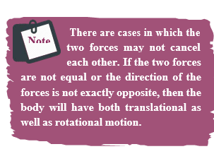

[comment]: <> (katex Header)


# EQUILIBRIUM OF RIGID BODIES

When a body is at rest without any motion on a table, we say that there is no force acting on the body. Actually it is wrong because, there is gravitational force acting on the body downward and also the normal force exerted by table on the body upward. These two forces cancel each other and thus there is no net force acting on the body. There is a lot of difference between the terms "no force" and "no net force" acting on a body. The same argument holds good for rotational conditions in terms of torque or moment of force.

$A$ rigid body is said to be in mechanical equilibrium when both its linear momentum and angular momentum remain constant.

When the linear momentum remains constant, the net force acting on the body is zero.


\overrightarrow{\mathrm{F}}_{\mathrm{net}}=0


In this condition, the body is said to be in translational equilibrium. This implies that the vector sum of different forces \overrightarrow{\mathrm{F}}_{1}, \overrightarrow{\mathrm{F}}_{2}, \overrightarrow{\mathrm{F}}_{3} \ldotsacting in different directions on the body is zero.


\overrightarrow{\mathrm{F}}_{1}+\overrightarrow{\mathrm{F}}_{2}+\overrightarrow{\mathrm{F}}_{3}+\cdots+\overrightarrow{\mathrm{F}}_{\mathrm{n}}=0


If the forces \overrightarrow{\mathrm{F}}_{1}, \overrightarrow{\mathrm{F}}_{2}, \overrightarrow{\mathrm{F}}_{3} \ldots act in different directions on the body, we can resolve them into horizontal and vertical components and then take the resultant in the respective directions. In this case there will be horizontal as well as vertical equilibria possible.

Similarly, when the angular momentum remains constant, the net torque acting on the body is zero.


\vec{\tau}_{\text {net }}=0


Under this condition, the body is said to be in rotational equilibrium. The vector sum of different torques\vec{\tau}_{1}, \vec{\tau}_{2}, \vec{\tau}_{3} \ldots producing different senses of rotation on the body is zero.


\vec{\tau}_{1}+\vec{\tau}_{2}+\vec{\tau}_{3}+\cdots+\vec{\tau}_{n}=0


Thus, we can also conclude that a rigid body is in mechanical equilibrium when the net force and net torque acts on the body is zero.


\overrightarrow{\mathrm{F}}_{\text {net }}=0 \text { and } \vec{\tau}_{\text {net }}=0


As the forces and torques are vector quantities, the directions are to be taken with proper sign conventions.

## Types of Equilibrium

Based on the above discussions, we come to a conclusion that different types of equilibrium are possible based on the different conditions. They are consolidated in Table 5.2.

| Type of   equilibrium | Conditions |
| :---: | :---: |
| Translational   equilibrium | - Linear momentum is constant.   - Net force is zero. |
| Rotational   equilibrium | - Angular momentum is constant.   - Net torque is zero. |
| Static   equilibrium | - Linear momentum and angular momentum are zero.   - Net force and net torque are zero. |
| Dynamic   equilibrium | - Linear momentum and angular momentum are constant.   - Net force and net torque are zero. |
| Stable   equilibrium | - Linear momentum and angular momentum are zero.   - The body tries to come back to equilibrium if slightly disturbed and   released.   - The centre of mass of the body shifts slightly higher if disturbed from   equilibrium. |
| Unstable   equilibrium | - Linear momentum and angular momentum are zero.   - The body cannot come back to equilibrium if slightly disturbed and   released.   - The centre of mass of the body shifts slightly lower if disturbed from   equilibrium. |
| Neutral   equilibrium | - Linear momentum and angular momentum are zero.   - The body remains at the same equilibrium if slightly disturbed and   released.   - The centre of mass of the body does not shift higher or lower if disturbed   from equilibrium.   - Potential energy remains same even if disturbed. |

## Table 5.2 Different types of Equilibrium and their Conditions.

**EXAMPLE 5.12**

Arun and Babu carry a wooden log of mass 28 \mathrm{~kg} and length 10 \mathrm{~m} which has almost uniform thickness. They hold it at1 \mathrm{~m} and 2 \mathrm{~m}from the ends respectively. Who will bear more weight of the log?\quad\left[\mathrm{g}=10 \mathrm{~ms}^{-2}\right]

**Solution**

Let us consider the $\log$ is in mechanical equilibrium. Hence, the netforceand net torque on the log must be zero. The gravitational force acts at the centre of mass of the log downwards. It is cancelled by the normal reaction forces \mathrm{R}_{\mathrm{A}} and \mathrm{R}_{\mathrm{B}} applied upwards by Arun and Babu at points $A$ and $B$ respectively. These reaction forces are the weights borne by them.

The total weight, \mathrm{W}=\mathrm{mg}=28 \times 10=$ $280 \mathrm{~N}, has to be borne by them together. The reaction forces are the weights borne by each of them separately. Let us show all the forces acting on the log by drawing a free body diagram of the log.

## For translational equilibrium:

The net force acting on the log must be zero.

Here, the forces $R_{A}$ an $R_{B}$ are taken positive as they act upward. The gravitational force acting downward is taken negative.


\mathrm{R}_{\mathrm{A}}+\mathrm{R}_{\mathrm{B}}=\mathrm{mg}


## For rotational equilibrium:

The net torque acting on the log must be zero. For ease of calculation, we can take the torque caused by all the forces about the point \mathrm{A} on the log. The forces are perpendicular to the distances. Hence,


\left(0 \mathrm{R}_{\mathrm{A}}\right)+(-4 \mathrm{mg})+\left(7 \mathrm{R}_{\mathrm{B}}\right)=0 .


Here, the reaction force \mathrm{R}_{\mathrm{A}} cannot produce any torque as the reaction forces pass through the point of reference A. The torque of force mg produces a clockwise turn about the point A which is taken negative and torque of force R_{B} causes anticlockwise turn about A which is taken positive.


\begin{gathered}
7 \mathrm{R}_{\mathrm{B}}=4 \mathrm{mg} \\
\mathrm{R}_{\mathrm{B}}=\frac{4}{7} \mathrm{mg} \\
\mathrm{R}_{\mathrm{B}}=\frac{4}{7} \times 28 \times 10=160 \mathrm{~N}
\end{gathered}


By substituting for \mathrm{R}_{\mathrm{B}} we get,


\begin{gathered}
\mathrm{R}_{\mathrm{A}}=\mathrm{mg}-\mathrm{R}_{\mathrm{B}} \\
\mathrm{R}_{\mathrm{A}}=28 \times 10-160=280-160=120 \mathrm{~N}
\end{gathered}


As  R_{B}$ is greater than R_{A} , it is concluded that Babu bears more weight than Arun. The one closer to centre of mass of the log bears more weight.

## Couple

Consider a thin uniform rod \mathrm{AB} . Its centre of mass is at its midpoint C. Let two forces which are equal in magnitude and opposite in direction be applied at the two ends $A$ and $B$ of the rod perpendicular to it. The two forces are separated by a distance of  2 \mathrm{r}  as shown in Figure 5.13.

Figure 5.13 Couple

As the two equal forces are opposite in direction, they cancel each other and the net force acting on the rod is zero. Now the rod is in translational equilibrium. But, the rod is not in rotational equilibrium. Let us see how it is not in rotational equilibrium. The moment of the force applied at the end A taken with respect to the centre point C, produces an anticlockwise rotation. Similarly, the moment of the force applied at the end B also produces an anticlockwise rotation. The moments of both the forces cause the same sense of rotation in the rod. Thus, the rod undergoes a rotational motion or turning even though the rod is in translational equilibrium.

A pair of forces which are equal in magnitude but opposite in direction and separated by a perpendicular distance so that their lines of action do not coincide that causes a turning effect is called a couple. We come across couple in many of our daily activities as shown in Figure 5.14.

## Principle of Moments

Consider a light rod of negligible mass which is pivoted at a point along its length. Let two parallel forces \mathrm{F}_{1} and \mathrm{F}_{2}  act at the two ends at distances d_{1} and d_{2} from the point of pivot and the normal reaction force \mathrm{N} at

Figure 5.14 Turning effect of Couple
the point of pivot as shown in Figure 5.15. If the rod has to remain stationary in horizontal position, it should be in translational and rotational equilibrium. Then, both the net force and net torque must be zero.

Figure 5.15 Principle of Moments

For translational equilibrium, net force has to be zero, -\mathrm{F}_{1}+\mathrm{N}-\mathrm{F}_{2}=0


\mathrm{N}=\mathrm{F}_{1}+\mathrm{F}_{2}


For rotational equilibrium, net torque has to be zero, \mathrm{d}_{1} \mathrm{~F}_{1}-\mathrm{d}_{2} \mathrm{~F}_{2}=0


\mathrm{d}_{1} \mathrm{~F}_{1}=\mathrm{d}_{2} \mathrm{~F}_{2}


The above equation represents the principle of moments. This forms the principle for beam balance used for weighing goods with the condition  \mathrm{d}_{1}=\mathrm{d}_{2} ; \mathrm{F}_{1}=\mathrm{F}_{2}. We can rewrite the equation 5.33 as,


\frac{\mathrm{F}_{1}}{\mathrm{~F}_{2}}=\frac{\mathrm{d}_{2}}{\mathrm{~d}_{1}}


If \mathrm{F}_{1} is the load and \mathrm{F}_{2} is our effort, we get advantage when, \mathrm{d}_{1}<\mathrm{d}_{2}. This implies that \mathrm{F}_{1}>\mathrm{F}_{2}. Hence, we could lift a large load with small effort. The ratio \left(\frac{\mathrm{d}_{2}}{\mathrm{~d}_{1}}\right) is called mechanical advantage of the simple lever. The pivoted point is called fulcrum.


\text { Mechanical Advantage }(M A)=\frac{d_{2}}{d_{1}}


There are many simple machines that work on the above mentioned principle.

## Centre of Gravity

Each rigid body is made up of several point masses. Such point masses experience gravitational force towards the centre of Earth. As the size of Earth is very large compared to any practical rigid body we come across in daily life, these forces appear to be acting parallelly downwards as shown in Figure 5.16.

Figure 5.16. Centre of gravity

The resultant of these parallel forces always acts through a point. This point is called centre of gravity of the body (with respect to Earth). The centre of gravity of a body is the point at which the entire weight of the body acts irrespective of the position and orientation of the $b o d y$. The centre of gravity and centre of mass of a rigid body coincide when the gravitational field is uniform across the body. The concept of gravitational field is dealt in Unit 6.

We can also determine the centre of gravity of a uniform lamina of even an irregular shape by pivoting it at various points by trial and error. The lamina remains horizontal when pivoted at the point where the net gravitational force acts, which is the centre of gravity as shown in Figure 5.17. When a body is supported at the centre of gravity, the sum of the torques acting on all the point masses of the rigid body becomes zero. Moreover the weight is compensated by the normal reaction force exerted by the pivot. The body is in static equilibrium and hence it remains horizontal.

Figure 5.17. Determination of centre of gravity of plane lamina by pivoting

There is also another way to determine the centre of gravity of an irregular lamina. If we suspend the lamina from different

Figure 5.18 Determination of centre of gravity of plane lamina by suspending points like P, Q, R as shown in Figure 5.18,

through the centre of gravity. Here, reaction force acting at the point of suspension and the gravitational force acting at the centre of gravity cancel each other and the torques caused by them also cancel each other.

## Bending of Cyclist in Curves

Let us consider a cyclist negotiating a circular level road (not banked) of radius r with a speed v. The cycle and the cyclist are considered as one system with mass m. The centre gravity of the system is C and it goes in a circle of radius r with centre at O. Let us choose the line C as X-axis and the vertical line through O as Z-axis as shown in Figure 5.19.

Figure 5.19 Bending of cyclist

The system as a frame is rotating about Z-axis. The system is at rest in this rotating frame. To solve problems in rotating frame of reference, we have to apply a centrifugal force (pseudo force) on the system which will be
 
\frac{\mathrm{mv}^{2}}{\mathrm{r}}. 
This force will act through the centre of gravity. The forces acting on the system are, (i) gravitational force (mg), (ii) normal force N, (iii) frictional force (f) and (iv) centrifugal force 
\left(\frac{m v^{2}}{r}\right). As the system is in equilibrium in the rotational frame of reference, the net external force and net external torque must be zero. Let us consider all torques about the point A in Figure 5.20.

Figure 5.20 Force diagrams for the cyclist in turns

For rotational equilibrium,


\vec{\tau}_{\text {net }}=0


The torque due to the gravitational force about point A is mg AB which causes a clockwise turn that is taken as negative. The torque due to the centrifugal force is \left(\frac{\mathrm{mv}^{2}}{\mathrm{r}} \mathrm{BC}\right)which causes an anticlockwise turn that is taken as positive.


\begin{gathered}
-\mathrm{mg} \mathrm{AB}+\frac{m v^{2}}{r} \mathrm{BC}=0 \\
\mathrm{mg} \mathrm{AB}=\frac{m v^{2}}{r} \mathrm{BC}
\end{gathered}


From triangle ABC,

\mathrm{AB}=\mathrm{AC} \sin \theta and \mathrm{BC}=\mathrm{AC} \cos \theta


\begin{aligned}
\mathrm{mg} \mathrm{AC} \sin \theta & =\frac{\mathrm{mv}^{2}}{\mathrm{r}} \mathrm{AC} \cos \theta \\
\tan \theta & =\frac{\mathrm{v}^{2}}{\mathrm{rg}} \\
\theta & =\tan ^{-1}\left(\frac{\mathrm{v}^{2}}{\mathrm{rg}}\right)
\end{aligned}


While negotiating a circular level road of radius $r$ at velocity $v$, a cyclist has to bend by an angle $\theta$ from vertical given by the above expression to stay in equilibrium (i.e. to avoid a fall).

## EXAMPLE 5.13

A cyclist while negotiating a circular path with speed 20 \mathrm{~m} \mathrm{~s}^{-1} is found to bend an angle by 30^{\circ} with vertical. What is the radius of the circular path? (given, \mathrm{g}=10 \mathrm{~m} \mathrm{~s}^{-2} )

## Solution

Speed of the cyclist, \mathrm{v}=20 \mathrm{~m} \mathrm{~s}^{-1}

Angle of bending with vertical, \theta=30^{\circ}

Equation for angle of bending, \tan \theta=\frac{\mathrm{v}^{2}}{\mathrm{rg}}

Rewriting the above equation for radius

r=\frac{v^{2}}{\tan \theta g}

Substituting,


\begin{aligned}
r & =\frac{(20)^{2}}{\left(\tan 30^{\circ}\right) \times 10}=\frac{20 \times 20}{\left(\tan 30^{\circ}\right) \times 10} \\
& =\frac{400}{\left(\frac{1}{\sqrt{3}}\right) \times 10} \\
r & =(\sqrt{3}) \times 40=1.732 \times 40 \\
r & =69.28 \mathrm{~m}
\end{aligned}

## MOMENT OF INERTIA

In the expressions for torque and angular
momentum for rigid bodies (which are
considered as bulk objects), we have come
across a term \frac{\mathrm {Σmi}}{\mathrm{ri}}^{2}. This quantity is called
moment of inertia \frac{\mathrm {(I)}} of the bulk object. For
point mass \frac{\mathrm {(mi)}} at a distance \frac{\mathrm{ri}} from the fixed axis, the moment of inertia is given as, \frac {\mathrm {m}} {ri} {i}^{2}

Moment of inertia for point mass,
-\mathrm{I}=\mathrm{mi}_{ri}^{2}\mathrm


Moment of inertia for bulk object,
-\mathrm{I}=mathrm{(Σ)}_{mi}{ri}^{2}\mathrm
In translational motion, mass is a measure
of inertia; in the same way, for rotational 
motion, moment of inertia is a measure
of rotational inertia. The unit of moment
of inertia is,-\mathrm{kg} {m}^{2}
. Its dimension is {{katex display>}}-\mathrm{ML}{2}
.
In general, mass is an invariable quantity
of matter (except for motion comparable
to that of light). But, the moment of inertia
of a body is not an invariable quantity. It
depends not only on the mass of the body,
but also on the way the mass is distributed
around the axis of rotation

To find the moment of inertia of a
uniformly distributed mass; we have to
consider an infinitesimally small mass -\mathrm{(dm)}
as a point mass and take its position -\mathrm{(r)} with
respect to an axis. The moment of inertia of
this point mass can now be written as,

-\mathrm{dl}=\mathrm{(dm)}{r}^{2} {(5.39)}
We get the moment of inertia of the entire
bulk object by integrating the above
expression. 
-\mathrm{i}=\mathrm{()}{(d)}{(I)}=/mathrm{< /katex>}
We can use the above expression for
determining the moment of inertia of some
of the common bulk objects of interest like
rod, ring, disc, sphere etc.


## Moment of Inertia of a Uniform Rod
Let us consider a uniform rod of mass (M)
and length \\(l\\) as shown in Figure \\(5.21.\\) Let
us find an expression for moment of inertia
of this rod about an axis that passes through
the centre of mass and perpendicular to
 
 Figure 5.21 Moment of inertia of
uniform rod

the rod. First an origin is to be fixed for
the coordinate system so that it coincides
with the centre of mass, which is also the
geometric centre of the rod. The rod is now
along the x axis. We take an infinitesimally
small mass \\(dm\\) at a distance \\(x\\) from the
origin. The moment of inertia \\(dI\\) of this
mass \\(dm\\) about the axis is, 

\\(dI=(dm x)^x^2\\)

As the mass is uniformly distributed, the
mass per unit length \\(λ\\) of the rod is, \\(λ = {M} {l}\\)

The \\(dm\\) mass of the infinitesimally
small length as, \\(dm = λ dx = {M}{l} dx\\)
The moment of inertia {(I)} of the entire
rod can be found by integrating \\(dI,
I dI dm x\\)

\\(I= {M}{l}{f} {dm}x^2={f}{M}{l}{dx} x^2\\)
\\(I={M}{l}fx^2dx\\)
As the mass is distributed on either side
of the origin, the limits for integration are
taken from \\(−l/2 \\)to \\( l2\\)

## Example 5.14
Find the moment of inertia of a uniform
rod about an axis which is perpendicular
to the rod and touches any one end of
the rod.
Solution
The concepts to form the integrand to find
the moment of inertia could be borrowed
from the earlier derivation. Now, the origin
is fixed to the left end of the rod and the
limits are to be taken from \\(0\\) to \\(ℓ.\\)

## Moment of Inertia of a Uniform Ring
Let us consider a uniform ring of mass \\(M\\)
and radius \\(R\\). To find the moment of inertia
of the ring about an axis passing through its
centre and perpendicular to the plane, let us
take an infinitesimally small mass \\(dm\\) of
length \\(dx\\) of the ring. This \\(dm\\) is located
at a distance \\(R\\), which is the radius of the
ring from the axis as shown in Figure \\(5.22\\)

## Figure 5.22 Moment of inertia of a uniform ring 
The moment of inertia \\(dI\\) of this small
mass \\(dm\\) is, 
\\(dI =(dm)^R^2\\)

The length of the ring is its circumference
\\(2^R\\) . As the mass is uniformly
distributed, the mass per unit length \\(λ\\) is,
         \\(λ=(mass)^length=M^2\\)

The mass (dm) of the infinitesimally
small length is, dm = λ dx = M
\\(R\\)
\\(dx\\)
\\(2p\\)
Now, the moment of inertia (I) of the
entire ring is,
\\(I=fdl=f(dm)R^2=f(M^2^R^dx)^R^2\\)
\\(I=MR^2^fdx\\)
To cover the entire length of the ring, the
limits of integration are taken from \\(0\\) to \\(2pR\\)

## Moment of Inertia of a Uniform Disc
Consider a disc of mass \\(M\\) and radius \\(R\\). This
disc is made up of many infinitesimally small
rings as shown in

Figure 5.23.

 Consider one
such ring of mass \\(dm\\) and thickness \\(dr\\)
and radius \\(r\\). The moment of inertia \\(dI\\)
of this small ring is,
\\(dl=(dm)^r^2\\)
As the mass is uniformly distributed, the
mass per unit area \\((σ)\\) is, \\(σ mass^area=M^R^2\\)

Figure 5.23 Moment of inertia of a uniform disc
The mass of the infinitally small ring is,
\\(dm=2rdr=M^R^2rdr\\)
where, the term \\(2dr\\) dr is the area of this
elemental ring \\(2pr \\)is the length and \\(dr\\) is
the thickness.\\(dm M
R = rdr\\)
The moment of inertia \\(I\\) of the entire
disc is,
\\(I=fdI
 I=f^r^0^2M^R^2f^R^0r^3^dr\\)

## Ridus of Gyration

For bulk objects of regular shape with
uniform mass distribution, the expression
for moment of inertia about an axis involves
their total mass and geometrical features
like radius, length, breadth, which take care
of the shape and the size of the objects. But,
we need an expression for the moment of
inertia which could take care of not only
the mass, shape and size of objects, but also
its orientation to the axis of rotation. Such
an expression should be general so that it is
applicable even for objects of irregular shape
and non-uniform distribution of mass. The
general expression for moment of inertia is
given as,
\\(I=MK^2\\)
where, \\(M\\) is the total mass of the object and
\\(K\\) is called the radius of gyration. 
The radius of gyration of an object is
the perpendicular distance from the axis of
rotation to an equivalent point mass, which
would have the same mass as well as the same
moment of inertia of the object.
As the radius of gyration is distance, its
unit is \\(m\\). Its dimension is \\([L]\\).
A rotating rigid body with respect to any
axis, is considered to be made up of point
masses \\(m1
, m2
, m3
, . . .mn
 at perpendicular
distances (or positions) r1
, r2
, r3
 . . . rn\\)
respectively as shown in 
Figure 5.24.
The moment of inertia of that object can
be written as, 
\\(I i i n n i
n
= m r m r m r m r m r =
∑ = + + + + 2
1 1
2
2 2
2
3 3
2 2\\)
\\(I i i n n i
n
= m r m r m r m r m r =
∑ = + + + + 2
1 1
2
2 2
2
3 3
2 2 \\)
If we take all the n number of individual
masses to be equal, 

Figure 5.24 Radius of gyration
\\(m=m^1 =m^2 =m^3=...m^n\\)
then,
\\(I=mr^2+mr^2+mr^3+...+mr^n^2\\)
\\(nm r^2^1+r^2^2+...+r^n^2^n\\)
I=MK^2

where, nm is the total mass M of the body
and K is the radius of gyration.

The expression for radius of gyration
indicates that it is the root mean square (rms)
distance of the particles of the body from the
axis of rotation. 
In fact, the moment of inertia of any object
could be expressed in the form, I = MK2
.
For example, let us take the moment
of inertia of a uniform rod of mass M and
length l. Its moment of inertia with respect
to a perpendicular axis passing through the
centre of mass is, \\(I M = 1
12
2
\\)
EXAMPLE 5.15
Find the radius of gyration of a disc of
mass M and radius R rotating about an axis
passing through the centre of mass and
perpendicular to the plane of the disc.
 
 Solution

The moment of inertia of a disc about an
axis passing through the centre of mass
and perpendicular to the disc is, \\(I M = R 1
2
2\\)
In terms of radius of gyration, I M= K2
Hence,\\(
 MK MR 2 2 1
2 = ; K R 2 2 1
2 =
 K l = R
2
 or K l = R
1.414
 K or R  0.707R//)
From the case of a rod and also a disc, we
can conclude that the radius of gyration
of the rigid body is always a geometrical
feature like length, breadth, radius or their
combinations with a positive numerical
value multiplied to it.

Obesity, torque and
Moment of Inertia!

Obesity and associated ailments like back
pain, joint pain etc. are due to the shift
in centre of mass of the body. Due to this
shift in centre of mass, unbalanced torque
acting on the body leads to ailments. As
the mass is spread away from centre of the
body the moment of inertia is more and
turning will also be difficul

## Theorems of Moment of Inertia

As the moment of inertia depends on the
axis of rotation and also the orientation
of the body about that axis, it is different
for the same body with different axes of
rotation. We have two important theorems
to handle the case of shifting the axis of
rotation.
(i) Parallel axis theorem:
Parallel axis theorem states that the moment
of inertia of a body about any axis is equal
to the sum of its moment of inertia about a
parallel axis through its centre of mass and
the product of the mass of the body and the
square of the perpendicular distance between
the two axes.
If IC is the moment of inertia of the body
of mass M about an axis passing through the
centre of mass, then the moment of inertia I
about a parallel axis at a distance d from it is
given by the relation,
\\(I=I^C+mD^2\\)

Let us consider a rigid body as shown in

Figure 5.25. 

Its moment of inertia about an
axis AB passing through the centre of mass
is IC. DE is another axis parallel to AB at
a perpendicular distance d from AB. The
moment of inertia of the body about DE is
I. We attempt to get an expression for I in
terms of IC. For this, let us consider a point
mass m on the body at position \\(x\\) from its
centre of mass

Figure 5.25 Parallel axis theorem

The moment of inertia of the point mass
about the axis DE is, \\(m x +d^2 d 2\\)
.
The moment of inertia I of the whole
body about DE is the summation of the
above expression

 -\mathrm{i}=\mathrm{(Σ)}{(d)}{(I)}=/mathrm
-\mathrm{i}=\mathrm{()}{(d)}{(I)}=/mathrm
\\(I=Σm(x+d^2)\\)

This equation could further be written as, 
-\mathrm{i}=\mathrm{(Σ)}{(d)}{(I)}=/mathrm
\\(I=Σm(x^2+d^2+2xd)\\)

Here,Σmx^3 is the moment of inertia of the body about the center of mass . Hence, I^c=Σm is the entire mass M of the object (Σm-M)
\\(I=I^C +Md^2\\)
Hence, then parallel axis therom is proived

(ii) Perpendicular axis theorum :
This perpendicular axis theorum holds good only for plane laminar objects.
The theorem states that the moment of
inertia of a plane laminar body about an
axis perpendicular to its plane is equal to
the sum of moments of inertia about two
perpendicular axes lying in the plane of the
body such that all the three axes are mutually
perpendicular and have a common point.
Let the X and Y-axes lie in the plane and
Z-axis perpendicular to the plane of the
laminar object. If the moments of inertia ofthe body about X and Y-axes are IX and IY
respectively and IZ is the moment of inertia
about Z-axis, then the perpendicular axis
theorem could be expressed as,

\\(I^z=I^x+I^Y\\)

To prove this theorem, let us consider a plane
laminar object of negligible thickness on
which lies the origin (O). The X and Y-axes
lie on the plane and Z-axis is perpendicular
to it as shown in 
Figure 5.26. 
The lamina is
considered to be made up of a large number
of particles of mass m. Let us choose one such
particle at a point P which has coordinates
(x, y) at a distance r from O. 

Figre 5.26 Perpendicular axis theorem

The moment of inertia of the particle
about Z-axis is, mr2
The summation of the above expression
gives the moment of inertia of the entire
lamina about Z-axis as, I mr Z-axisΣ mr 2
Here, \\(r^2=x^2+y^2\\)
Then,\\(Iz=Σmx^2+Σmy^2\\)
In the above expression, the term \\(Σmx2\\)
 is
the moment of inertia of the body about the Y-axis and similarly the term\\( Σmy 2\\)
 is the
moment of inertia about X-axis. 
Thus, 
\\(I^z=i^x+i^y\\)
Thus, the perpendicular axis therom is poved.

## Example 5.16

Find the moment of inertia of a disc of mass
3 kg and radius 50 cm about the following
axes.
 (i) axis passing through the centre
and perpendicular to the plane of
the disc,
 (ii) axis touching the edge and
perpendicular to the plane of the disc
and
(iii) axis passing through the centre
and lying on the plane of the
disc.
## Solution
The mass, M = 3 kg, radius R = 50 cm =
50 × 10-2
 m = 0.5 m
(i) The moment of inertia (I) about an
axis passing through the centre and
perpendicular to the plane of the
disc is,

\\(I=1^2MR^2\\)
\\(I=1^2\\)
(ii) The moment of inertia (I) about an axis
touching the edge and perpendicular
to the plane of the disc by parallel axis
theorem is
\\(I=I^c+Md^2\\)
where,\\(I^c=1^2MR^2=3^2MR^2\\)
\\(i=3^2\\)
(iii) The moment of inertia (I) about an
axis passing through the centre and
lying on the plane of the disc is,
\\(I^z= I^x+ I^y\\)
where,\\(I^x=i^y=I and I^z=1^2MR^2\\)

 About which of the above axis it is
easier to rotate the disc?
„ It is easier to rotate the disc about
an axis about which the moment of
inertia is the least. Hence, it is case (iii)

## Example 5.17
Find the moment of inertia about the
geometric centre of the given structure made
up of one thin rod connecting two similar
solid spheres as shown in Figure
Find the moment of inertia about the
geometric centre of the given structure made
up of one thin rod connecting two similar
solid spheres as shown in Figure

