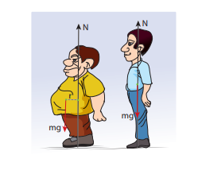
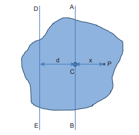

[comment]: <> (katex Header)

# MOMENT OF INERTIA

In the expressions for torque and angular momentum for rigid bodies (which are considered as bulk objects), we have come across a term \sum \mathrm{m}_{\mathrm{i}} \mathrm{r}_{\mathrm{i}}^{2}. This quantity is called moment of inertia (I) of the bulk object. For point mass m_{i} \ at  \ a  \ distance  \ r_{i}   from the fixed axis, the moment of inertia is given as, \mathrm{m}_{\mathrm{i}} \mathrm{r}_{\mathrm{i}}^{2}.

Moment of inertia for point mass,


\mathrm{I}=\mathrm{m}_{\mathrm{i}} \mathrm{r}_{\mathrm{i}}^{2}


Moment of inertia for bulk object,


\mathrm{I}=\sum \mathrm{m}_{\mathrm{i}} \mathrm{r}_{\mathrm{i}}^{2}


In translational motion, mass is a measure of inertia; in the same way, for rotational motion, moment of inertia is a measure of rotational inertia. The unit of moment of inertia is, \mathrm{kg} \mathrm{m}^{2}. Its dimension is \mathrm{ML}^{2}. In general, mass is an invariable quantity of matter (except for motion comparable to that of light). But, the moment of inertia of a body is not an invariable quantity. It depends not only on the mass of the body, but also on the way the mass is distributed around the axis of rotation.

To find the moment of inertia of a uniformly distributed mass; we have to consider an infinitesimally small mass (dm) as a point mass and take its position (r) with respect to an axis. The moment of inertia of this point mass can now be written as,


\mathrm{dI}=(\mathrm{dm}) \mathrm{r}^{2}


We get the moment of inertia of the entire bulk object by integrating the above expression.


\begin{aligned}
& I=\int d I=\int(d m) r^{2} \\
& I=\int r^{2} d m
\end{aligned}


We can use the above expression for determining the moment of inertia of some of the common bulk objects of interest like rod, ring, disc, sphere etc.

## Moment of Inertia of a Uniform Rod

Let us consider a uniform rod of mass (M) and length l as shown in Figure 5.21. Let us find an expression for moment of inertia of this rod about an axis that passes through the centre of mass and perpendicular to

Figure 5.21 Moment of inertia of uniform rod

the rod. First an origin is to be fixed for the coordinate system so that it coincides with the centre of mass, which is also the geometric centre of the rod. The rod is now along the x axis. We take an infinitesimally small mass (dm) at a distance (x) from the origin. The moment of inertia (dI) of this mass dm about the axis is,

 
\mathrm{dI}=(\mathrm{dm}) \mathrm{x}^{2}


As the mass is uniformly distributed, the mass per unit length  (\lambda) of the rod is,   \lambda=\frac{M}{\ell}

The dm mass of the infinitesimally small length as,  \mathrm{dm}=\lambda \mathrm{dx}=\frac{M}{\ell} \mathrm{dx}

The moment of inertia (I) of the entire rod can be found by integrating dI,


\begin{aligned}
& I=\int d I=\int(d m) x^{2}=\int\left(\frac{M}{\ell} d x\right) x^{2} \\
& I=\frac{M}{\ell} \int x^{2} d x
\end{aligned}


As the mass is distributed on either side of the origin, the limits for integration are taken from   -\ell / 2  \ to  \ \ell / 2. 


\begin{aligned}
& \mathrm{I}=\frac{\mathrm{M}}{\ell} \int_{-\ell / 2}^{\ell / 2} \mathrm{x}^{2} \mathrm{dx}=\frac{\mathrm{M}}{\ell}\left[\frac{\mathrm{x}^{3}}{3}\right]_{-\ell / 2}^{\ell / 2} \\
& \mathrm{I}=\frac{\mathrm{M}}{\ell}\left[\frac{\ell^{3}}{24}-\left(-\frac{\ell^{3}}{24}\right)\right]=\frac{\mathrm{M}}{\ell}\left[\frac{\ell^{3}}{24}+\frac{\ell^{3}}{24}\right] \\
& \mathrm{I}=\frac{\mathrm{M}}{\ell}\left[2\left(\frac{\ell^{3}}{24}\right)\right] \\
& \mathrm{I}=\frac{1}{12} \mathrm{M} \ell^{2}
\end{aligned}


**EXAMPLE 5.14**

Find the moment of inertia of a uniform rod about an axis which is perpendicular to the rod and touches any one end of the rod.

**Solution**

The concepts to form the integrand to find the moment of inertia could be borrowed from the earlier derivation. Now, the origin is fixed to the left end of the rod and the limits are to be taken from 0 to l.


\begin{aligned}
& \mathrm{I}=\frac{\mathrm{M}}{\ell} \int_{0}^{\ell} \mathrm{x}^{2} \mathrm{dx}=\frac{\mathrm{M}}{\ell}\left[\frac{\mathrm{x}^{3}}{3}\right]_{0}^{\ell}=\frac{\mathrm{M}}{\ell}\left[\frac{\ell^{3}}{3}\right] \\
& \mathrm{I}=\frac{1}{3} \mathrm{M} \ell^{2}
\end{aligned}


**Note**
`The moment of inertia of
the same uniform rod is
different about different axes
of reference. The reference axes could
be even outside the object. We have two
useful theorems to calculate the moments
of inertia about different axes. We shall
see these theorems in Section 5.4.5.`

The moment of inertia of

the same uniform rod is different about different axes

of reference. The reference axes could be even outside the object. We have two useful theorems to calculate the moments of inertia about different axes. We shall see these theorems in Section 5.4.5.

## Moment of Inertia of a Uniform Ring

Let us consider a uniform ring of mass $M$ and radius R. To find the moment of inertia of the ring about an axis passing through its centre and perpendicular to the plane, let us take an infinitesimally small mass (dm) of length dx of the ring. This dm is located at a distance R, which is the radius of the ring from the axis as shown in Figure 5.22.

Figure 5.22 Moment of inertia of a uniform ring

The moment of inertia (dI) of this small mass dm is,


\mathrm{dI}=(\mathrm{dm}) \mathrm{R}^{2}


The length of the ring is its circumference (2 \pi R). As the mass is uniformly distributed, the mass per unit length (\lambda) is,


\lambda=\frac{\text { mass }}{\text { length }}=\frac{M}{2 \pi R}


The mass (dm) of the infinitesimally small length is, \mathrm{dm}=\lambda \mathrm{dx}=\frac{\mathrm{M}}{2 \pi \mathrm{R}} \mathrm{dx} 

Now, the moment of inertia (I) of the entire ring is,


\begin{aligned}
& I=\int d I=\int(d m) R^{2}=\int\left(\frac{M}{2 \pi R} d x\right) R^{2} \\
& I=\frac{M R}{2 \pi} \int d x
\end{aligned}


To cover the entire length of the ring, the limits of integration are taken from 0 to $2 \pi R$.


\begin{aligned}
& I=\frac{M R}{2 \pi} \int_{0}^{2 \pi R} d x \\
& I=\frac{M R}{2 \pi}[x]_{0}^{2 \pi R}=\frac{M R}{2 \pi}[2 \pi R-0] \\
& I=M R^{2}
\end{aligned}


## Moment of Inertia of a Uniform Disc

Consider a disc of mass M and radius R. This disc is made up of many infinitesimally small rings as shown in Figure 5.23. Consider one such ring of mass dm and thickness dr and radius (r). The moment of inertia (dI) of this small ring is,


\mathrm{dI}=(\mathrm{dm}) \mathrm{r}^{2}


As the mass is uniformly distributed, the mass per unit area (\sigma)$ is, $\sigma=\frac{\text { mass }}{\text { area }}=\frac{M}{\pi R^{2}}

Figure 5.23 Moment of inertia of a uniform disc

The mass of the infinitesimally small ring is,


\mathrm{dm}=\sigma 2 \pi \mathrm{rdr}=\frac{\mathrm{M}}{\pi \mathrm{R}^{2}} 2 \pi \mathrm{rdr}


where, the term 2 \pi \mathrm{rdr} is the area of this elemental ring  2 \pi r is the length and d r is the thickness. \mathrm{dm}=\frac{2 \mathrm{M}}{\mathrm{R}^{2}} \mathrm{rdr}


\mathrm{dI}=\frac{2 \mathrm{M}}{\mathrm{R}^{2}} \mathrm{r}^{3} \mathrm{dr}


The moment of inertia (I) of the entire disc is,


\begin{aligned}
& \mathrm{I}=\int \mathrm{dI} \\
& \mathrm{I}=\int_{0}^{\mathrm{R}} \frac{2 \mathrm{M}}{\mathrm{R}^{2}} r^{3} \mathrm{dr}=\frac{2 \mathrm{M}}{\mathrm{R}^{2}} \int_{0}^{\mathrm{R}} r^{3} \mathrm{dr} \\
& \mathrm{I}=\frac{2 \mathrm{M}}{\mathrm{R}^{2}}\left[\frac{r^{4}}{4}\right]_{0}^{R}=\frac{2 \mathrm{M}}{\mathrm{R}^{2}}\left[\frac{R^{4}}{4}-0\right] \\
& \mathrm{I}=\frac{1}{2} \mathrm{MR}^{2}
\end{aligned}


## Radius of Gyration

For bulk objects of regular shape with uniform mass distribution, the expression for moment of inertia about an axis involves their total mass and geometrical features like radius, length, breadth, which take care of the shape and the size of the objects. But, we need an expression for the moment of inertia which could take care of not only the mass, shape and size of objects, but also its orientation to the axis of rotation. Such an expression should be general so that it is applicable even for objects of irregular shape and non-uniform distribution of mass. The general expression for moment of inertia is given as,


\mathrm{I}=\mathrm{MK}^{2}


where, M is the total mass of the object and K is called the radius of gyration.

The radius of gyration of an object is the perpendicular distance from the axis of rotation to an equivalent point mass, which would have the same mass as well as the same moment of inertia of the object.

As the radius of gyration is distance, its unit is m. Its dimension is [L].

A rotating rigid body with respect to any axis, is considered to be made up of point masses \mathrm{m}_{1}, \mathrm{~m}_{2}, \mathrm{~m}_{3}, \ldots \mathrm{m}_{\mathrm{n}} at perpendicular distances (or positions) r_{1}, r_{2}, r_{3} \ldots r_{n} respectively as shown in Figure 5.24.

The moment of inertia of that object can be written as,


\mathrm{I}=\sum_{\mathrm{i}=1}^{\mathrm{n}} \mathrm{m}_{\mathrm{i}} \mathrm{r}_{\mathrm{i}}^{2}=\mathrm{m}_{1} \mathrm{r}_{1}^{2}+\mathrm{m}_{2} \mathrm{r}_{2}^{2}+\mathrm{m}_{3} \mathrm{r}_{3}^{2}+\cdots+\mathrm{m}_{\mathrm{n}} \mathrm{r}_{\mathrm{n}}^{2}


If we take all the $\mathrm{n}$ number of individual masses to be equal,

Figure 5.24 Radius of gyration

\mathrm{m}=\mathrm{m}_{1}=\mathrm{m}_{2}=\mathrm{m}_{3}=\ldots=\mathrm{m}_{\mathrm{n}}

then,


\begin{aligned}
\mathrm{I} & =\mathrm{mr}_{1}^{2}+\mathrm{mr}_{2}^{2}+\mathrm{mr}_{3}^{2}+\cdots+\mathrm{mr}_{\mathrm{n}}^{2} \\
& =\mathrm{m}\left(\mathrm{r}_{1}^{2}+\mathrm{r}_{2}^{2}+\mathrm{r}_{3}^{2}+\cdots+\mathrm{r}_{\mathrm{n}}^{2}\right) \\
& =\mathrm{nm}\left(\frac{\mathrm{r}_{1}^{2}+\mathrm{r}_{2}^{2}+\mathrm{r}_{3}^{2}+\cdots+\mathrm{r}_{\mathrm{n}}^{2}}{\mathrm{n}}\right) \\
\mathrm{I} & =\mathrm{MK}^{2}
\end{aligned}


where, nm is the total mass m of the body and K is the radius of gyration.


\mathrm{K}=\sqrt{\frac{\mathrm{r}_{1}^{2}+\mathrm{r}_{2}^{2}+\mathrm{r}_{3}^{2}+\cdots+\mathrm{r}_{\mathrm{n}}^{2}}{\mathrm{n}}}

The expression for radius of gyration indicates that it is the root mean square (rms) distance of the particles of the body from the axis of rotation.
In fact, the moment of inertia of any object could be expressed in the form, \mathrm{I}=\mathrm{MK}^{2}.

For example, let us take the moment of inertia of a uniform rod of mass \mathrm{M}$ and length $\ell. Its moment of inertia with respect to a perpendicular axis passing through the centre of mass is, \mathrm{I}=\frac{1}{12} \mathrm{M} \ell^{2}

In terms of radius of gyration, \mathrm{I}=\mathrm{MK}^{2}

Hence, \mathrm{MK}^{2}=\frac{1}{12} \mathrm{M} \ell^{2}


\mathrm{K}^{2}=\frac{1}{12} \ell^{2}


\mathrm{K}=\frac{1}{\sqrt{12}} \ell or \mathrm{K}=\frac{1}{2 \sqrt{3}} \ell or \mathrm{K}=(0.289) \ell

**EXAMPLE 5.15**

Find the radius of gyration of a disc of mass M and radius R rotating about an axis passing through the centre of mass and perpendicular to the plane of the disc.

**Solution**

The moment of inertia of a disc about an axis passing through the centre of mass and perpendicular to the disc is, \mathrm{I}=\frac{1}{2} \mathrm{MR}^{2}

In terms of radius of gyration,\mathrm{I}=\mathrm{MK}^{2}

Hence, \mathrm{MK}^{2}=\frac{1}{2} \mathrm{MR}^{2} ; \quad \mathrm{K}^{2}=\frac{1}{2} \mathrm{R}^{2}

\mathrm{K}=\frac{\mathrm{l}}{\sqrt{2}} \mathrm{R} or \mathrm{K}=\frac{\mathrm{l}}{1.414} \mathrm{R} or \mathrm{K}=(0.707) \mathrm{R}

From the case of a rod and also a disc, we can conclude that the radius of gyration of the rigid body is always a geometrical feature like length, breadth, radius or their combinations with a positive numerical value multiplied to it.

**Obesity, torque and Moment of Inertia!**

 

Obesity and associated ailments like back pain, joint pain etc. are due to the shift in centre of mass of the body. Due to this shift in centre of mass, unbalanced torque acting on the body leads to ailments. As the mass is spread away from centre of the body the moment of inertia is more and turning will also be difficult.

## Theorems of Moment of Inertia

As the moment of inertia depends on the axis of rotation and also the orientation of the body about that axis, it is different for the same body with different axes of rotation. We have two important theorems to handle the case of shifting the axis of rotation.

### (i) Parallel axis theorem:

Parallel axis theorem states that the moment of inertia of a body about any axis is equal to the sum of its moment of inertia about a parallel axis through its centre of mass and the product of the mass of the body and the square of the perpendicular distance between the two axes.
If \mathrm{I}_{\mathrm{C}} is the moment of inertia of the body of mass M about an axis passing through the centre of mass, then the moment of inertia I about a parallel axis at a distance d from it is given by the relation,

$$
\mathrm{I}=\mathrm{I}_{\mathrm{C}}+\mathrm{Md}^{2}
$$

Let us consider a rigid body as shown in Figure 5.25. Its moment of inertia about an axis AB passing through the centre of mass is \mathrm{I}_{\mathrm{C}} \cdot \mathrm{DE} is another axis parallel to AB at a perpendicular distance d from AB. The moment of inertia of the body about DE is I. We attempt to get an expression for I in terms of \mathrm{I}_{\mathrm{C}}. For this, let us consider a point mass m on the body at position x from its centre of mass.

Figure 5.25 Parallel axis theorem

The moment of inertia of the point mass about the axis \mathrm{DE} is, \mathrm{m}(\mathrm{x}+\mathrm{d})^{2}.

The moment of inertia I of the whole body about DE is the summation of the above expression.


\mathrm{I}=\sum \mathrm{m}(\mathrm{x}+\mathrm{d})^{2}


This equation could further be written as,


\begin{aligned}
& I=\sum m\left(x^{2}+d^{2}+2 x d\right) \\
& I=\sum\left(m x^{2}+m d^{2}+2 d m x\right) \\
& I=\sum m x^{2}+\sum m d^{2}+2 d \sum m x
\end{aligned}


Here, \sum m x^{2} is the moment of inertia of the body about the centre of mass. Hence, \mathrm{I}_{\mathrm{C}}=\sum \mathrm{mx}^{2}

The term, \sum \mathrm{mx}=0 because, x can take positive and negative values with respect to the axis AB. The summation mx will be zero.


\text { Thus, } \mathrm{I}=\mathrm{I}_{\mathrm{C}}+\sum \mathrm{md}^{2}=\mathrm{I}_{\mathrm{C}}+\left(\sum \mathrm{m}\right) \mathrm{d}^{2}


Here, \Sigma \mathrm{m} is the entire mass M of the \operatorname{object}\left(\sum \mathrm{m}=\mathrm{M}\right)


\mathrm{I}=\mathrm{I}_{\mathrm{C}}+\mathrm{Md}^{2}


Hence, the parallel axis theorem is proved.

### (ii) Perpendicular axis theorem:

This perpendicular axis theorem holds good only for plane laminar objects.

The theorem states that the moment of inertia of a plane laminar body about an axis perpendicular to its plane is equal to the sum of moments of inertia about two perpendicular axes lying in the plane of the body such that all the three axes are mutually perpendicular and have a common point.

Let the X and Y-axes lie in the plane and Z-axis perpendicular to the plane of the laminar object. If the moments of inertia of the body about X and Y-axes are \mathrm{I}_{X} and \mathrm{I}_{Y} respectively and I_{Z} is the moment of inertia about Z-axis, then the perpendicular axis theorem could be expressed as,


\mathrm{I}_{\mathrm{Z}}=\mathrm{I}_{\mathrm{X}}+\mathrm{I}_{\mathrm{Y}}


To prove this theorem, let us consider a plane laminar object of negligible thickness on which lies the origin $(\mathrm{O})$. TheX and Y-axes lie on the plane and Z-axis is perpendicular to it as shown in Figure 5.26. The lamina is considered to be made up of a large number of particles of mass m. Let us choose one such particle at a point P which has coordinates X,Y at a distance r from O.

Figure 5.26 Perpendicular axis theorem

The moment of inertia of the particle about \mathrm{Z}$-axis is, $\mathrm{mr}^{2}

The summation of the above expression gives the moment of inertia of the entire lamina about Z-axis as, \mathrm{I}_{Z}=\sum \mathrm{mr}^{2}

Here, \mathrm{r}^{2}=\mathrm{x}^{2}+\mathrm{y}^{2}

Then, \mathrm{I}_{z}=\sum \mathrm{m}\left(\mathrm{x}^{2}+\mathrm{y}^{2}\right)


\mathrm{I}_{z}=\sum \mathrm{mx}^{2}+\sum \mathrm{my}^{2}


In the above expression, the term \sum \mathrm{mx}^{2} is the moment of inertia of the body about the
Y-axis and similarly the term \sum m y^{2} is the moment of inertia about X-axis. Thus,


\mathrm{I}_{\mathrm{X}}=\sum \mathrm{my}^{2} \quad \text { and } \quad \mathrm{I}_{\mathrm{Y}}=\sum \mathrm{mx}^{2}


Substituting in the equation for \mathrm{I}_{\mathrm{z}} gives,


\mathrm{I}_{Z}=\mathrm{I}_{X}+\mathrm{I}_{Y}


Thus, the perpendicular axis theorem is proved.

**EXAMPLE 5.16**

Find the moment of inertia of a disc of mass 3kg and radius 50cm about the following axes.

(i) axis passing through the centre and perpendicular to the plane of the disc,

(ii) axis touching the edge and perpendicular to the plane of the disc and

(iii) axis passing through the centre and lying on the plane of the disc.

**Solution**

The mass,M=3kg, radius R=50 cm=50 \times 10^{-2} \mathrm{~m}=0.5 \mathrm{~m}

(i) The moment of inertia (I) about an axis passing through the centre and perpendicular to the plane of the disc is,


\begin{aligned}
& \mathrm{I}=\frac{1}{2} \mathrm{MR}^{2} \\
& \mathrm{I}=\frac{1}{2} \times 3 \times(0.5)^{2}=0.5 \times 3 \times 0.5 \times 0.5 \\
& I=0.375 \mathrm{~kg} \mathrm{~m}^{2}
\end{aligned}


(ii) The moment of inertia (I) about an axis touching the edge and perpendicular to the plane of the disc by parallel axis theorem is,


\mathrm{I}=\mathrm{I}_{\mathrm{C}}+\mathrm{Md}^{2}


where, \mathrm{I}_{\mathrm{C}}=\frac{1}{2} \mathrm{MR}^{2}$ and $\mathrm{d}=\mathrm{R}


\begin{aligned}
& \mathrm{I}=\frac{1}{2} \mathrm{MR}^{2}+\mathrm{MR}^{2}=\frac{3}{2} \mathrm{MR}^{2} \\
& \mathrm{I}=\frac{3}{2} \times 3 \times(0.5)^{2}=1.5 \times 3 \times 0.5 \times 0.5 \\
& \mathrm{I}=1.125 \mathrm{~kg} \mathrm{~m}^{2}
\end{aligned}


(iii) The moment of inertia (I) about an axis passing through the centre and lying on the plane of the disc is,


\mathrm{I}_{Z}=\mathrm{I}_{X}+\mathrm{I}_{Y}


where, \mathrm{I}_{X}=\mathrm{I}_{Y}=\mathrm{I} and \mathrm{I}_{Z}=\frac{1}{2} \mathrm{MR}^{2}


\begin{aligned}
\mathrm{I}_{Z} & =2 \mathrm{I} ; \mathrm{I}=\frac{1}{2} \mathrm{I}_{Z} \\
\mathrm{I} & =\frac{1}{2} \times \frac{1}{2} \mathrm{MR}^{2}=\frac{1}{4} \mathrm{MR}^{2} \\
I & =\frac{1}{4} \times 3 \times(0.5)^{2}=0.25 \times 3 \times 0.5 \times 0.5 \\
I & =0.1875 \mathrm{~kg} \mathrm{~m}^{2}
\end{aligned}


- About which of the above axis it is easier to rotate the disc?
- It is easier to rotate the disc about an axis about which the moment of inertia is the least. Hence, it is case (iii).

**EXAMPLE 5.17**

Find the moment of inertia about the geometric centre of the given structure made up of one thin rod connecting two similar solid spheres as shown in Figure.

**Solution**

The structure is made up of three objects; one thin rod and two solid spheres.

The mass of the rod, M=3kg and the total length of the rod, \ell=80 \mathrm{~cm}=0.8 \mathrm{~m}

The moment of inertia of the rod about its centre of mass is, \mathrm{I}_{\mathrm{rod}}=\frac{1}{12} \mathrm{M} \ell^{2} \mathrm{I}_{\mathrm{rod}}=\frac{1}{12} \times 3 \times(0.8)^{2}=\frac{1}{4} \times 0.64


I_{\text {rod }}=0.16 \mathrm{~kg} \mathrm{~m}^{2}


The mass of the sphere, M=5kg and the radius of the sphere, R=10 \mathrm{~cm}=0.1 \mathrm{~m}

The moment of inertia of the sphere about its centre of mass is, \mathrm{I}_{\mathrm{C}}=\frac{2}{5} \mathrm{MR}^{2}

The moment of inertia of the sphere about geometric centre of the structure is, \mathrm{I}_{\text {sph }}=\mathrm{I}_{\mathrm{C}}+\mathrm{Md}^{2}

Where, d=40 \mathrm{~cm}+10 \mathrm{~cm}=50 \mathrm{~cm}=0.5 \mathrm{~m}


\begin{aligned}
I_{\text {sph }} & =\frac{2}{5} M^{2}+M^{2} \\
I_{\text {sph }} & =\frac{2}{5} \times 5 \times(0.1)^{2}+5 \times(0.5)^{2} \\
I_{\text {sph }} & =(2 \times 0.01)+(5 \times 0.25)=0.02+1.25 \\
I_{\text {sph }} & =1.27 \mathrm{~kg} \mathrm{~m}^{2}
\end{aligned}


As there are one rod and two similar solid spheres we can write the total moment of inertia (I) of the given geometric structure as, I=I_{\text {rod }}+\left(2 \times I_{\text {sph }}\right)


\begin{aligned}
& \mathrm{I}=(0.16)+(2 \times 1.27)=0.16+2.54 \\
& \mathrm{I}=2.7 \mathrm{~kg} \mathrm{~m}^{2}
\end{aligned}


## Moment of Inertia of Different Rigid Bodies

The moment of inertia of different objects about different axes is given in the Table 5.3.

