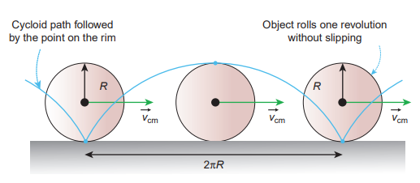
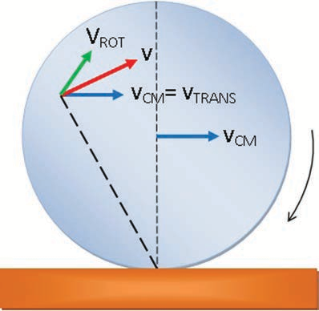
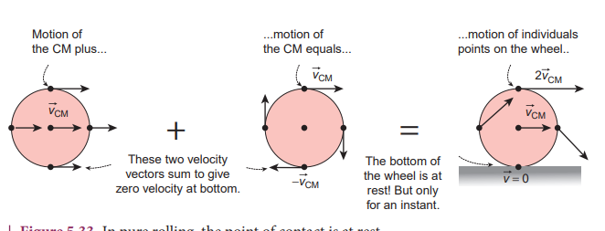
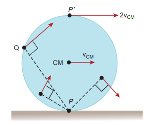
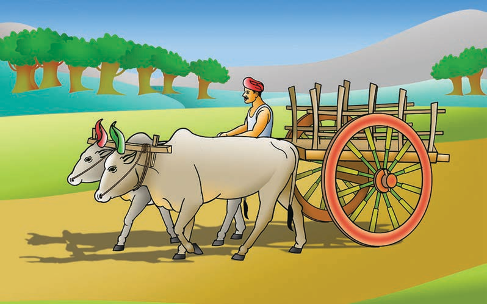
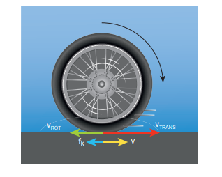
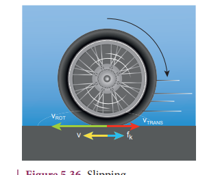
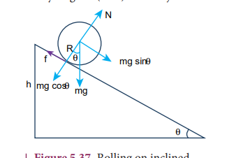
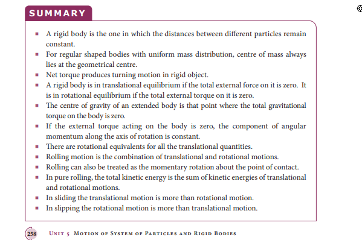

[comment]: <> (katex Header)


# ROLLING MOTION

The rolling motion is the most commonly observed motion in daily life. The motion of wheel is an example of rolling motion. Round objects like ring, disc, sphere etc. are most suitable for rolling .

Let us study the rolling of a disc on a horizontal surface. Consider a point P on the edge of the disc. While rolling, the point undergoes translational motion along with its centre of mass and rotational motion with respect to its centre of mass.

## Combination of Translation and Rotation

We will now see how these translational and rotational motions are related in rolling. If the radius of the rolling object is R, in one full rotation, the centre of mass is displaced by 2 \pi \mathrm{R} (its circumference). One would agree that not only the centre of mass, but all the points on the disc are displaced by the same 2 \pi R after one full rotation. The only difference is that the centre of mass takes a straight path; but, all the other points undergo a path which has a combination of the translational and rotational motion. Especially the point on the edge undergoes a path of a cycloid as shown in the Figure 5.31.

As the centre of mass takes only a straight line path, its velocity \mathrm{v}_{\mathrm{CM}} is only translational velocity \mathrm{v}_{\text {TRANS }}\left(\mathrm{v}_{\mathrm{CM}}=\mathrm{v}_{\text {TRANS }}\right). All the other points have two velocities. One is the translational velocity \mathrm{v}_{\text {TRANS }}, (which is also the velocity of centre of mass) and the other is the rotational velocity \mathrm{v}_{\text {ROT }}\left(\mathrm{v}_{\text {ROT }}=\mathrm{r} \omega\right). Here, r is the distance of the point from the centre of mass and \omega is the angular velocity. The rotational velocity \mathrm{v}_{\mathrm{ROT}}  is perpendicular to the instantaneous position vector from the centre of mass as shown in Figure 5.32(a). The resultant of these two velocities is v. This resultant velocity v is perpendicular to the position vector from the point of contact of the rolling object

Figure 5.31 Rolling is combination of translation and rotation

(a) with respect to centre of mass

(b) with respect to point of contact

Figure 5.32 Resultant velocity at a point with the surface on which it is rolling as shown in Figure 5.32(b).

We shall now give importance to the point of contact. In pure rolling, the point of the rolling object which comes in contact with the surface is at momentary rest. This is the case with every point that is on the edge of the rolling object. As the rolling proceeds, all the points on the edge, one by one come in contact with the surface; remain at momentary rest at the time of contact and then take the path of the cycloid as already mentioned.

Hence, we can consider the pure rolling in two different ways.

(i) The combination of translational motion and rotational motion about the centre of mass.


\text { (or) }
 

(ii) The momentary rotational motion about the point of contact.

As the point of contact is at momentary rest in pure rolling, its resultant velocity v is zero (v=0). For example, in Figure 5.33, at the point of contact, \mathrm{v}_{\text {TRANS }}  is forward (to right) and \mathrm{v}_{\mathrm{ROT}}  is backwards (to the left).

Figure 5.33 In pure rolling, the point of contact is at rest

That implies that, \mathrm{v}_{\text {TRANS }}  and \mathrm{v}_{\mathrm{ROT}}$ are equal in magnitude and opposite in direction $\left(\mathrm{v}=\mathrm{v}_{\text {TRANS }}-\mathrm{v}_{\text {ROT }}=0\right). Hence, we conclude that in pure rolling, for all the points on the edge, the magnitudes of \mathrm{v}_{\text {TRANS }} and $\mathrm{v}_{\mathrm{ROT}}$ are equal \left(\mathrm{v}_{\text {TRANS }}=\mathrm{v}_{\text {ROT }}\right. ). As \mathrm{v}_{\text {TRANS }}=\mathrm{v}_{\mathrm{CM}}  and \mathrm{v}_{\mathrm{ROT}}=\mathrm{R} \omega , in pure rolling we have,


\mathrm{v}_{\mathrm{CM}}=\mathrm{R} \omega
 

We should remember the special feature of the equation 5.55. In rotational motion, as per the relation v=r\omega$, the centre point will not have any velocity as $r$ is zero. But in rolling motion, it suggests that the centre point has a velocity \mathrm{v}_{\mathrm{CM}}  given by equation 5.55.

For the topmost point, the two velocities \mathrm{v}_{\text {TRANS }}  and \mathrm{v}_{\text {ROT }}  are equal in magnitude and in the same direction (to the right). Thus, the resultant velocity v is the sum of these two velocities, \mathrm{v}=\mathrm{v}_{\text {TRANS }}+\mathrm{v}_{\text {ROT }} . In other form, \mathrm{v}=2 \mathrm{v}_{\mathrm{CM}}  as shown in Figure 5.34.

Figure 5.34 Velocity of different point in pure rolling

## Slipping and Sliding

When the round object moves, it always tends to roll on any surface which has a coefficient of friction any value greater than zero mu>0. The friction that enabling the rolling motion is called rolling friction. In pure rolling, there is no relative motion of the point of contact with the surface. When the rolling object speeds up or slows down,

it must accelerate or decelerate respectively. If this suddenly happens it makes the rolling object to slip or slide.

### Sliding

Sliding is the case when \mathrm{v}_{\mathrm{CM}}>\mathrm{R} \omega  (or \mathrm{v}_{\text {TRANS }}>\mathrm{v}_{\text {ROT }}$ ). The translation is more than the rotation. This kind of motion happens when sudden break is applied in a moving vehicles, or when the vehicle enters into a slippery road. In this case, the point of contact has more of \mathrm{v}_{\text {TRANS }}
than $\mathrm{v}_{\text {ROT }} Hence, it has a resultant velocity \mathrm{v}
 in the forward direction as shown in Figure 5.35. The kinetic frictional force \left(\mathrm{f}_{\mathrm{k}}\right)opposes the relative motion. Hence, it acts in the opposite direction of the relative velocity. This frictional force reduces the translational velocity and increases the rotational velocity till they become equal and the object sets on pure rolling. Sliding is also referred as forward slipping.

Figure 5.35 Sliding

### Slipping

Slipping is the case when \mathrm{v}_{\mathrm{CM}}<\mathrm{R} \omega  (or \mathrm{v}_{\text {TRANS }}<\mathrm{v}_{\text {ROT }}  ). The rotation is more than the translation. This kind of motion happens when we suddenly start the vehicle from rest or the vehicle is stuck in mud. In this case, the point of contact has more of \mathrm{v}_{\text {ROT }} than \mathrm{v}_{\text {TRANS }}. It has a resultant velocity v in the backward direction as shown in Figure 5.36. The kinetic frictional force  \left(f_{k}\right) opposes the relative motion. Hence it acts in the opposite direction of the relative velocity. This frictional force reduces the rotational velocity and increases the translational velocity till they become equal and the object sets pure rolling. Slipping is sometimes empahasised as backward slipping.

Figure 5.36 Slipping

**EXAMPLE 5.21**

A rolling wheel has velocity of its centre of mass as 5 \mathrm{~m} \mathrm{~s}^{-1}. If its radius is 1.5 \mathrm{~m} and angular velocity is 3 \mathrm{rad} \mathrm{s}^{-1}, then check whether it is in pure rolling or not.

**Solution**

Translational velocity  \mathrm{v}_{\text {TRANS }} or velocity of centre of mass, \mathrm{v}_{\mathrm{CM}}=5 \mathrm{~m} \mathrm{~s}^{-1}

The radius is, \mathrm{R}=1.5 \mathrm{~m} and the angular velocity is, \omega=3 \mathrm{rad} \mathrm{s}^{-1}

Rotational velocity, \mathrm{v}_{\mathrm{ROT}}=\mathrm{R} \omega


\begin{gathered}
\mathrm{v}_{\mathrm{ROT}}=1.5 \times 3 \\
\mathrm{v}_{\mathrm{ROT}}=4.5 \mathrm{~m} \mathrm{~s}^{-1}
\end{gathered}


As \mathrm{v}_{\mathrm{CM}}>\mathrm{R} \omega (or) \mathrm{v}_{\text {TRANS }}>\mathrm{R} \omega, It is not in pure rolling, but sliding.

## Kinetic Energy in Pure Rolling

In genreal pure rolling is the combination of translational and rotational motion, we can write the total kinetic energy (KE) as the sum of kinetic energy due to translational motion \mathrm{KE}_{\text {TRANS }}  and kinetic energy due to rotational motion \left \mathrm{KE}_{\mathrm{ROT}}\right.


\mathrm{KE}=\mathrm{KE}_{\mathrm{TRANS}}+\mathrm{KE}_{\mathrm{ROT}}


If the mass of the rolling object is M, the velocity of centre of mass is \mathrm{v}_{\mathrm{CM}}, its moment of inertia about centre of mass is   \mathrm{I}_{\mathrm{CM}}   and angular velocity is   \omega , then


\mathrm{KE}=\frac{1}{2} \mathrm{Mv}_{\mathrm{CM}}^{2}+\frac{1}{2} \mathrm{I}_{\mathrm{CM}} \omega^{2}


### With centre of mass as reference:

The moment of inertia \left(\mathrm{I}_{\mathrm{CM}}\right. ) of a rolling object about the centre of mass is, \mathrm{I}_{\mathrm{CM}}=\mathrm{MK}^{2} and \mathrm{v}_{\mathrm{CM}}=\mathrm{R} \omega. Here, K is radius of gyration.


\begin{aligned}
& \mathrm{KE}=\frac{1}{2} \mathrm{Mv}_{C M}^{2}+\frac{1}{2}\left(\mathrm{MK}^{2}\right) \frac{\mathrm{v}_{C M}^{2}}{R^{2}} \\
& \mathrm{KE}=\frac{1}{2} \mathrm{Mv}_{C M}^{2}+\frac{1}{2} \mathrm{Mv}_{C M}^{2}\left(\frac{\mathrm{K}^{2}}{R^{2}}\right) \\
& \mathrm{KE}=\frac{1}{2} \mathrm{Mv}_{C M}^{2}\left(1+\frac{\mathrm{K}^{2}}{\mathrm{R}^{2}}\right)
\end{aligned}


### With point of contact as reference:

We can also arrive at the same expression by taking the momentary rotation happening with respect to the point of contact (another approach to rolling). If we take the point of contact as O, then,


\mathrm{KE}=\frac{1}{2} \mathrm{I}_{\mathrm{o}} \omega^{2}


Here,\mathrm{I}_{\mathrm{o}} is the moment of inertia of the object about the point of contact. By parallel axis theorem, \mathrm{I}_{o}=\mathrm{I}_{\mathrm{CM}}+\mathrm{MR}^{2}. Further we can write, \mathrm{I}_{o}=\mathrm{MK}^{2}+\mathrm{MR}^{2}. With \mathrm{v}_{\mathrm{CM}}=\mathrm{R} \omega or \omega=\frac{\mathrm{v}_{\mathrm{CM}}}{\mathrm{R}}


\begin{gathered}
\mathrm{KE}=\frac{1}{2}\left(\mathrm{MK}^{2}+\mathrm{MR}^{2}\right) \frac{\mathrm{v}_{C M}^{2}}{R^{2}} \\
\mathrm{KE}=\frac{1}{2} \mathrm{Mv}_{C M}^{2}\left(1+\frac{\mathrm{K}^{2}}{\mathrm{R}^{2}}\right)
\end{gathered}


As the two equations 5.59 and 5.60 are the same, it is once again confirmed that the
pure rolling problems could be solved by considering the motion as any one of the following two cases.

(i) The combination of translational motion and rotational motion about the centre of mass. (or)

(ii) The momentary rotational motion about the point of contact.

**EXAMPLE 5.22**

A solid sphere is undergoing pure rolling. What is the ratio of its translational kinetic energy to rotational kinetic energy?

**Solution**

The expression for total kinetic energy in pure rolling is,


\mathrm{KE}=\mathrm{KE}_{\mathrm{TRANS}}+\mathrm{KE}_{\mathrm{ROT}}


For any object the total kinetic energy as per equation 5.58 and 5.59 is,


\begin{gathered}
\mathrm{KE}=\frac{1}{2} \mathrm{Mv}_{C M}^{2}+\frac{1}{2} \mathrm{Mv}_{C M}^{2}\left(\frac{\mathrm{K}^{2}}{R^{2}}\right) \\
\mathrm{KE}=\frac{1}{2} \mathrm{Mv}_{C M}^{2}\left(1+\frac{\mathrm{K}^{2}}{\mathrm{R}^{2}}\right)
\end{gathered}


Then,


\frac{1}{2} \mathrm{Mv}_{C M}^{2}\left(1+\frac{\mathrm{K}^{2}}{\mathrm{R}^{2}}\right)=\frac{1}{2} \mathrm{Mv}_{C M}^{2}+\frac{1}{2} \mathrm{Mv}_{C M}^{2}\left(\frac{\mathrm{K}^{2}}{R^{2}}\right)


The above equation suggests that in pure rolling the ratio of total kinetic energy, translational kinetic energy and rotational kinetic energy is given as, \mathrm{KE}: \mathrm{KE}_{\text {TRANS }}: \mathrm{KE}_{\mathrm{ROT}}::\left(1+\frac{\mathrm{K}^{2}}{\mathrm{R}^{2}}\right): 1:\left(\frac{\mathrm{K}^{2}}{R^{2}}\right)

Now,\mathrm{KE}_{\text {TRANS }}: \mathrm{KE}_{\mathrm{ROT}}:: 1:\left(\frac{\mathrm{K}^{2}}{R^{2}}\right)

For a solid sphere, \frac{\mathrm{K}^{2}}{R^{2}}=\frac{2}{5}

Then,\mathrm{KE}_{\text {TRANS }}: \mathrm{KE}_{\mathrm{ROT}}:: 1: \frac{2}{5} or


\mathrm{KE}_{\text {TRANS }}: \mathrm{KE}_{\text {ROT }}:: 5: 2


## Rolling on Inclined Plane

Let us assume a round object of mass $m$ and radius R is rolling down an inclined plane without slipping as shown in Figure 5.37. There are two forces acting on the object along the inclined plane. One is the component of gravitational force (\mathrm{mg} \sin \theta) and the other is the static frictional force (f). The other component of gravitation force (\mathrm{mg} \cos \theta) is cancelled by the normal force N exerted by the plane. As the motion is happening along the incline, we shall write the equation for motion from the free body diagram $(F B D) of the object.

Figure 5.37 Rolling on inclined plane

For translational motion, mg \sin \theta$ is the supporting force and f is the opposing force,

$$
m g \sin \theta-f=m a
$$

For rotational motion, let us take the torque with respect to the centre of the object. Then mg \sin \theta$ cannot cause torque as it passes through it but the frictional force f can set torque of Rf.


\mathrm{Rf}=\mathrm{I} \alpha


By using the relation, a=r \alpha$, and moment of inertia \mathrm{I}=\mathrm{mK}^{2}, we get,


\mathrm{Rf}=\mathrm{mK}^{2} \frac{\mathrm{a}}{\mathrm{R}} ; \quad \mathrm{f}=\mathrm{ma}\left(\frac{\mathrm{K}^{2}}{\mathrm{R}^{2}}\right)


Now equation (5.61) becomes,


\begin{gathered}
\mathrm{mg} \sin \theta-\mathrm{ma}\left(\frac{\mathrm{K}^{2}}{\mathrm{R}^{2}}\right)=\mathrm{ma} \\
\mathrm{mg} \sin \theta=\mathrm{ma}+\mathrm{ma}\left(\frac{\mathrm{K}^{2}}{\mathrm{R}^{2}}\right) \\
\mathrm{a}\left(1+\frac{\mathrm{K}^{2}}{\mathrm{R}^{2}}\right)=\mathrm{g} \sin \theta
\end{gathered}


After rewriting it for acceleration, we get,


\mathrm{a}=\frac{\mathrm{g} \sin \theta}{\left(1+\frac{\mathrm{K}^{2}}{\mathrm{R}^{2}}\right)}


We can also find the expression for final velocity of the rolling object by using third equation of motion for the inclined plane. \mathrm{v}^{2}=\mathrm{u}^{2}+2 as. If the body starts rolling from rest, $u=0$. When $h$ is the vertical height of the incline, the length of the incline $s$ is, s=\frac{h}{\sin \theta}


\mathrm{v}^{2}=2 \frac{\mathrm{g} \sin \theta}{\left(1+\frac{\mathrm{K}^{2}}{\mathrm{R}^{2}}\right)}\left(\frac{\mathrm{h}}{\sin \theta}\right)=\frac{2 \mathrm{gh}}{\left(1+\frac{\mathrm{K}^{2}}{\mathrm{R}^{2}}\right)}


By taking square root,


\mathrm{v}=\sqrt{\frac{2 \mathrm{gh}}{\left(1+\frac{\mathrm{K}^{2}}{\mathrm{R}^{2}}\right)}}


The time taken for rolling down the incline could also be written from first equation of motion as, v=u at. For the object which starts rolling from rest, u=0. Then,


\begin{aligned}
& \mathrm{t}=\frac{\mathrm{v}}{a} \\
& \mathrm{t}=\left(\sqrt{\frac{2 \mathrm{gh}}{\left(1+\frac{\mathrm{K}^{2}}{\mathrm{R}^{2}}\right)}}\right)\left(\frac{\left(1+\frac{\mathrm{K}^{2}}{\mathrm{R}^{2}}\right)}{\mathrm{g} \sin \theta}\right) \\
& \mathrm{t}=\sqrt{\frac{2 \mathrm{~h}\left(1+\frac{\mathrm{K}^{2}}{\mathrm{R}^{2}}\right)}{\mathrm{g} \sin ^{2} \theta}}
\end{aligned}


The equation suggests that for a given incline, the object with the least value of radius of gyration R will reach the bottom of the incline first.

**EXAMPLE 5.23**

Four round objects namely a ring, a disc, a hollow sphere and a solid sphere with same radius R start to roll down an incline at the same time. Find out which object will reach the bottom first.

**Solution**

For all the four objects namely the ring, disc, hollow sphere and solid sphere, the radii of gyration K are R, \sqrt{\frac{1}{2}} R, \sqrt{\frac{2}{3}} R , \sqrt{\frac{2}{5}} \mathrm{R} (ref Table (5.3)). With numerical values the radius of gyration K are 1 \mathrm{R}$, $0.707 \mathrm{R}, 0.816 \mathrm{R}, 0.632 \mathrm{R} respectively. The expression for time taken for rolling has the radius of gyration K in the numerator as per equation 5.63


\mathrm{t}=\sqrt{\frac{2 \mathrm{~h}\left(1+\frac{\mathrm{K}^{2}}{\mathrm{R}^{2}}\right)}{\mathrm{g} \sin ^{2} \theta}}


The one with least value of radius of gyration K will take the shortest time to reach the bottom of the inclined plane. The order of objects reaching the bottom is first, solid sphere; second, disc; third, hollow sphere and last, ring.

