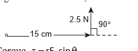
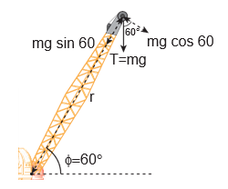
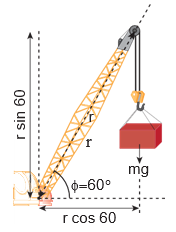
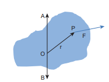
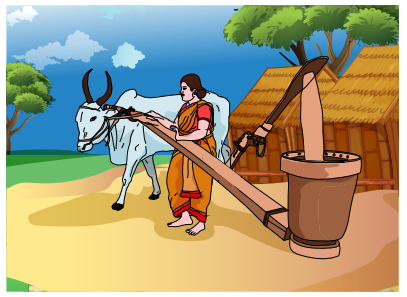

[comment]: <> (katex Header)


# TORQUE AND ANGULAR MOMENTUM

When a net force acts on a body, it produces linear motion in the direction of the applied force. If the body is fixed to a point or an axis, such a force rotates the body depending on the point of application of the force on the body. This ability of the force to produce rotational motion in a body is called torque or moment of force. Examples for such motion are plenty in day to day life. To mention a few; the opening and closing of a door about the hinges and turning of a nut using a wrench.

The extent of the rotation depends on the magnitude of the force, its direction and the distance between the fixed point and the point of application. When torque produces rotational motion in a body, its angular momentum changes with respect to time. In this Section we will learn about the torque and its effect on rigid bodies.

## Definition of Torque

Torque is defined as the moment of the external applied force about a point or axis of rotation. The expression for torque is,


\vec{\tau}=\overrightarrow{\mathrm{r}} \times \overrightarrow{\mathrm{F}}


where, \vec{r} is the position vector of the point where the force \overrightarrow{\mathrm{F}}
is acting on the body as shown in Figure 5.4.

Figure 5.4 Torque on a rigid body

Here, the product of \overrightarrow{\mathrm{r}} and \overrightarrow{\mathrm{F}} is called the vector product or cross product. The vector product of two vectors results in another vector that is perpendicular to both the vectors (refer Section 2.5.2). Hence, torque (\vec{\tau}) is a vector quantity.

Torque has a magnitude \mathrm{rF} \sin \theta and direction perpendicular to \overrightarrow{\mathrm{r}} and \overrightarrow{\mathrm{F}}. Its unit is \mathrm{N} \mathrm{m}.


\vec{\tau}=(r F \sin \theta) \hat{n}


Here, \theta  is the angle between \overrightarrow{\mathrm{r}} and \overrightarrow{\mathrm{F}}, and \hat{\mathrm{n}}  is the unit vector in the direction of \vec{\tau} . Torque (\vec{\tau})  is sometimes called as a pseudo vector as it needs the other two vectors \overrightarrow{\mathrm{r}}  and \overrightarrow{\mathrm{F}}  for its existence.

The direction of torque is found using right hand rule. This rule says that if fingers of right hand are kept along the position vector with palm facing the direction of the force and when the fingers are curled the thumb points to the direction of the torque. This is shown in Figure 5.5.

The direction of torque helps us to find the type of rotation caused by the torque. For example, if the direction of torque is out

Figure 5.5 Direction of torque using right hand rule

of the paper, then the rotation produced by the torque is anticlockwise. On the other hand, if the direction of the torque is into the paper, then the rotation is clockwise as shown in Figure 5.6.

In many cases, the direction and magnitude of the torque are found

(a) anticlockwise rotation

(b) clockwise rotation

Figure 5.6 Direction of torque and the type of rotation separately. For direction, we use the vector rule or right hand rule. For magnitude, we use scalar form as,


\tau=\mathrm{rF} \sin \theta


The expression for the magnitude of torque can be written in two different ways by associating \sin \theta either with r or F in the following manner.


\begin{aligned}
& \tau=r(F \sin \theta)=r \times(F \perp) \\
& \tau=(r \sin \theta) F=(r \perp) \times F
\end{aligned}


Here, (\mathrm{F} \sin \theta) is the component of \overrightarrow{\mathrm{F}}  perpendicular to \overrightarrow{\mathrm{r}} . Similarly, (\mathrm{r} \sin \theta) is the component of  \vec{r}  perpendicular to  \vec{F} . The two cases are shown in Figure 5.7.


(a) \tau=r(F \sin \theta)=r(F \perp)



(b) \tau=(r \sin \theta) F=(r \perp) F


Figure 5.7 Two ways of calculating the torque.

Based on the angle $\theta$ between \overrightarrow{\mathrm{r}} and  \overrightarrow{\mathrm{F}}, the torque takes different values.

The torque is maximum when, \overrightarrow{\mathrm{r}} and \overrightarrow{\mathrm{F}} are perpendicular to each other. That is when \theta=90^{\circ} and \sin 90^{\circ}=1, Hence, \tau_{\max }=\mathrm{rF}.

The torque is zero when \overrightarrow{\mathrm{r}} and \overrightarrow{\mathrm{F}} are parallel or antiparallel. If parallel, then \theta=0^{\circ}  and \sin 0^{\circ}=0 . If antiparallel, then \theta=180^{\circ} and \sin 180^{\circ}=0. Hence, \tau=0 .

The torque is zero if the force acts at the reference point. i.e. as  \overrightarrow{\mathrm{r}}=0, \tau=. The different cases discussed are shown in Table 5.1.

## Table 5.1 The Value of $\tau$ for different cases.

\theta=90^{\circ} ; \tau_{\max }=\mathrm{rF}

\theta=180^{\circ} ; \tau=0

**EXAMPLE 5.7**

If the force applied is perpendicular to the handle of the spanner as shown in the diagram, find the (i) torque exerted by the force about the centre of the nut, (ii) direction of torque and (iii) type of rotation caused by the torque about the nut.

**Solution**

Arm length of the spanner,  \mathrm{r}=15 \mathrm{~cm}$ $=15 \times 10^{-2} \mathrm{~m}

Force, \mathrm{F}=2.5 \mathrm{~N}

Angle between \mathrm{r}$ and $\mathrm{F}, \theta=90^{\circ}

(i) Torque,  \tau=\mathrm{rF} \sin \theta


\begin{aligned}
& \tau=15 \times 10^{-2} \times 2.5 \times \sin \left(90^{\circ}\right) \\
& \quad\left[\text { here, } \sin 90^{\circ}=1\right] \\
& \tau=37.5 \times 10^{-2} \mathrm{~N} \mathrm{~m}
\end{aligned}


(ii) As per the right hand rule, the direction of torque is out of the page.

(iii) The type of rotation caused by the torque is anticlockwise.

**EXAMPLE 5.8**

A force of (4 \hat{i}-3 \hat{j}+5 \hat{k}) \mathrm{N} is applied at a point whose position vector is (7 \hat{i}+4 \hat{j}-2 \hat{k}) \mathrm{m}. Find the torque of force about the origin.

**Solution**


\begin{aligned}
& \overrightarrow{\mathrm{r}}=7 \hat{\mathrm{i}}+4 \hat{\mathrm{j}}-2 \hat{\mathrm{k}} \\
& \overrightarrow{\mathrm{F}}=4 \hat{\mathrm{i}}-3 \hat{\mathrm{j}}+5 \hat{\mathrm{k}}
\end{aligned}


Torque, \vec{\tau}=\overrightarrow{\mathrm{r}} \times \overrightarrow{\mathrm{F}}


\begin{aligned}
\vec{\tau} & =\left|\begin{array}{ccc}
\hat{i} & \hat{j} & \hat{k} \\
7 & 4 & -2 \\
4 & -3 & 5
\end{array}\right| \\
\vec{\tau} & =\hat{i}(20-6)-\hat{j}(35+8)+\hat{k}(-21-16) \\
\vec{\tau} & =(14 \hat{i}-43 \hat{j}-37 \hat{k}) \mathrm{Nm}
\end{aligned}


**EXAMPLE 5.9**

A crane has an arm length of 20 \mathrm{~m}  inclined at 30^{\circ} with the vertical. It carries a container of mass of 2 ton suspended from the top end of the arm. Find the torque produced by the gravitational force on the container about the point where the arm is fixed to the crane. [Given: 1 ton =1000kgs; neglect the weight of the arm. \left.\mathrm{g}=10 \mathrm{~m} \mathrm{~s}^{-2}\right] 

**Solution**

**Note**
`In many problems, the angle
θ between 
r and 
F will not
be directly given. Thus,
the students must get accustomed to
identify and denote always the angle
between the 
r and 
F as θ. The other
angles in the arrangement may be
denoted as α, β, ϕ etc.`

The force F at the point of suspension is due to the weight of the hanging mass.


\begin{gathered}
\mathrm{F}=\mathrm{mg}=2 \times 1000 \times 10=20000 \mathrm{~N} ; \\
\text { The arm length, } \mathrm{r}=20 \mathrm{~m}
\end{gathered}


We can solve this problem by three different methods.

Method - I

The angle $(\theta)$ between the arm length $(r)$ and the force F is, \theta=150^{\circ}

The torque $(\tau)$ about the fixed point of the arm is,


\begin{aligned}
\tau & =r F \sin \theta \\
\tau & =20 \times 20000 \times \sin \left(150^{\circ}\right) \\
& =400000 \times \sin \left(90^{\circ}+60^{\circ}\right) \\
& \quad\left[\text { here, } \sin \left(90^{\circ}+\theta\right)=\cos \theta\right] \\
& =400000 \times \cos \left(60^{\circ}\right) \\
& =400000 \times \frac{1}{2} \quad\left[\cos 60^{\circ}=\frac{1}{2}\right] \\
& =200000 \mathrm{~N} \mathrm{~m} \\
\tau & =2 \times 10^{5} \mathrm{~N} \mathrm{~m}
\end{aligned}


 Method - II

Let us take the force and perpendicular distance from the point where the arm is fixed to the crane.


\begin{aligned}
\tau & =(\mathrm{r} \perp) \mathrm{F} \\
\tau & =\mathrm{r} \cos \phi \mathrm{mg} \\
\tau & =20 \times \cos 60^{\circ} \times 20000 \\
& =20 \times \frac{1}{2} \times 20000 \\
& =200000 \mathrm{Nm} \\
\tau & =2 \times 10^{5} \mathrm{Nm}
\end{aligned}


Method - III

Let us take the distance from the fixed point and perpendicular force.

## Torque about an Axis

In the earlier sections, we have dealt with the torque about a point. In this section we will deal with the torque about an axis. Let us consider a rigid body capable of rotating about an axis $A B$ as shown in Figure 5.8. Let the force F act at a point P on the rigid body. The force $F$ may not be on the plane $A B P$. We can take the origin O at any random point on the axis AB.

Figure 5.8 Torque about an axis answer.

The torque of the force \overrightarrow{\mathrm{F}} about O is, \vec{\tau}=\vec{r} \times \vec{F}. The component of the torque \vec{\tau} along the axis is the torque about the axis. To find it, we should first find the vector \vec{\tau}=\overrightarrow{\mathrm{r}} \times \overrightarrow{\mathrm{F}} and then find the angle \phi between \vec{\tau} and the axis AB. (Remember here, the force \vec{F} is not on the plane $A B P$ ). The torque about the axis A B is the parallel component of the torque along the axis A B, which is |\vec{r} \times \vec{F}| \cos \phi . The torque perpendicular to the axis AB is |\overrightarrow{\mathrm{r}} \times \overrightarrow{\mathrm{F}}| \sin \phi .

The torque about the axis will rotate the object about the axis and the torque perpendicular to the axis will turn or tilt the axis of rotation itself. When both components exist simultaneously on a rigid body, the body will have a precession. One can witness the precessional motion in a spinning top when it is about to come to rest as shown in Figure 5.9.

Figure 5.9 Precession of a spinning top

Study of precession is beyond the scope of the present course of study. Hence, it is assumed that there are constraints to cancel the effect of the perpendicular components of the torques, so that the fixed position of the axis is maintained. Therefore, perpendicular components of the torque need not be taken into account.
For the rest of the lesson, we consider rotation about only fixed axis. For this we shall,

1. Consider forces that lie only on planes perpendicular to the axis (without intersecting in the axis).
2. Consider position vectors that are only perpendicular to the axis.

**Note**
`• Forces parallel to the
axis will give torques
perpendicular to the axis
of rotation and need not
be taken into account.
„ • Forces that intersect (pass
through) the axis cannot
produce torque as r = 0.
„ • Position vectors along the
axis will result in torques
perpendicular to the axis and
need not be taken into account.`

**EXAMPLE 5.10**

Two mutually perpendicular beams AB, CD, are joined at O to form a structure which is fixed to the ground firmly as shown in the Figure. A string is tied to the point D and its free end E is pulled with a force \overrightarrow{\mathrm{F}}. Find the magnitude and direction of the torque produced by

the force,

(i) about the points E, D, O and B,

(ii) about the axes DE, CD, AB and BG.

## Solution

(i) Torque about point E is zero. (as \overrightarrow{\mathrm{F}} passes through E ).

Torque about point D is zero. (as \overrightarrow{\mathrm{F}} passes through D ).

Torque about point O is (\overrightarrow{\mathrm{OE}}) \times \overrightarrow{\mathrm{F}} which is perpendicular to axes A B and C D.

Torque about point $B$ is (\overrightarrow{B E}) \times \vec{F} which is perpendicular to axes A B and C D.

(ii) Torque about axis DE is zero (as \overrightarrow{\mathrm{F}}$ is parallel to DE).

Torque about axis CD is zero (as \overrightarrow{\mathrm{F}} intersects $C D  ).

Torque about axis \mathrm{AB} is zero (as \overrightarrow{\mathrm{F}} is parallel to AB).

Torque about axis BG is zero (as $\vec{F}$ intersects BG).
The torque of a force about an axis is independent of the choice of the origin as long as it is chosen on that axis itself. This can be shown as below.

Let O be the origin on the axis AB, which is the rotational axis of a rigid body. F is the force acting at the point P. Now, choose another point  \mathrm{O}^{\prime} anywhere on the axis as shown in Figure 5.10.

Figure 5.10 Torque about an axis is independent of origin

Identify the direction of torque in country press shown in picture (in Tamil, 'Marasekku' மரச்செக்க)

The torque of F about O ' is,


\begin{aligned}
\overrightarrow{\mathrm{O}^{\prime} \mathrm{P}} \times \overrightarrow{\mathrm{F}} & =\left(\overrightarrow{\mathrm{O}^{\prime} \mathrm{O}}+\overrightarrow{\mathrm{OP}}\right) \times \overrightarrow{\mathrm{F}} \\
& =\left(\overrightarrow{\mathrm{O}^{\prime} \mathrm{O}} \times \overrightarrow{\mathrm{F}}\right)+(\overrightarrow{\mathrm{OP}} \times \overrightarrow{\mathrm{F}})
\end{aligned}


As \overrightarrow{\mathrm{O}^{\prime} \mathrm{O}} \times \overrightarrow{\mathrm{F}} is perpendicular to \overrightarrow{\mathrm{O}^{\prime} \mathrm{O}}, this term will not have a component along AB. Thus, the component of \overrightarrow{\mathrm{O}^{\prime} \mathrm{P}} \times \overrightarrow{\mathrm{F}} is equal to that of \overrightarrow{\mathrm{OP}} \times \overrightarrow{\mathrm{F}}.

## Torque and Angular Acceleration

Let us consider a rigid body rotating about a fixed axis. A point mass $m$ in the body will execute a circular motion about a fixed axis as shown in Figure 5.11. A tangential force \overrightarrow{\mathrm{F}} acting on the point mass produces the necessary torque for this rotation. This force \overrightarrow{\mathrm{F}} is perpendicular to the position vector \overrightarrow{\mathrm{r}}  of the point mass.

Figure 5.11 Torque and Angular acceleration

The torque produced by the force on the point mass $m$ about the axis can be written as,


\begin{aligned}
& \tau=\mathrm{rF} \sin 90^{\circ}=\mathrm{rF} \quad\left[\because \sin 90^{\circ}=1\right] \\
& \tau=\mathrm{rma} \quad[\because(\mathrm{F}=\mathrm{ma})] \\
& \tau=\operatorname{rmr} \alpha=\operatorname{mr}^{2} \alpha \quad[\because(\mathrm{a}=\mathrm{r} \alpha)]
\end{aligned}



\tau=\left(\mathrm{mr}^{2}\right) \alpha


Hence, the torque of the force acting on the point mass produces an angular acceleration (\alpha) in the point mass about the axis of rotation.

In vector notation,


\vec{\tau}=\left(m r^{2}\right) \vec{\alpha}


The directions of \tau and \alpha are along the axis of rotation. If the direction of \tau is in the direction of \alpha, it produces angular acceleration. On the other hand if, \tau  is opposite to \alpha, angular deceleration or retardation is produced on the point mass.

The term \mathrm{mr}^{2} in equations 5.14 and 5.15 is called moment of inertia (I) of the point mass. A rigid body is made up of many such point masses. Hence, the moment of inertia of a rigid body is the sum of moments of inertia of all such individual point masses that constitute the body \left(I=\sum \mathrm{m}_{\mathrm{i}} \mathrm{r}_{\mathrm{i}}^{2}\right). Hence, torque for the rigid body can be written as,


\begin{aligned}
& \vec{\tau}=\left(\sum \mathrm{m}_{\mathrm{i}} \mathrm{r}_{\mathrm{i}}^{2}\right) \vec{\alpha} \\
& \vec{\tau}=\mathrm{I} \vec{\alpha}
\end{aligned}


We will learn more about the moment of inertia and its significance for bodies with different shapes in section 5.4.

## Angular Momentum

The angular momentum in rotational motion is equivalent to linear momentum in translational motion. The angular
momentum of a point mass is defined as the moment of its linear momentum. In other words, the angular momentum L of a point mass having a linear momentum $p$ at a position $r$ with respect to a point or axis is mathematically written as,


\overrightarrow{\mathrm{L}}=\overrightarrow{\mathrm{r}} \times \overrightarrow{\mathrm{p}}


The magnitude of angular momentum could be written as,


\mathrm{L}=\mathrm{rp} \sin \theta


where, \theta is the angle between \vec{r} and \vec{p} . \vec{L} is perpendicular to the plane containing \vec{r} and \overrightarrow{\mathrm{p}}. As we have written in the case of torque, here also we can associate \sin \theta with either \overrightarrow{\mathrm{r}} or \overrightarrow{\mathrm{p}}.


\begin{aligned}
& \mathrm{L}=\mathrm{r}(\mathrm{p} \sin \theta)=\mathrm{r}(\mathrm{p} \perp) \\
& \mathrm{L}=(\mathrm{r} \sin \theta) \mathrm{p}=(\mathrm{r} \perp) \mathrm{p}
\end{aligned}


where, \mathrm{p} \perp is the component of linear momentum p perpendicular to r, and \mathrm{r} \perp is the component of position r perpendicular to p.

The angular momentum is zero(L=0), if the linear momentum is zero (p=0) or if the particle is at the origin (\overrightarrow{\mathrm{r}}=0) or if \overrightarrow{\mathrm{r}} and \overrightarrow{\mathrm{p}} are parallel or antiparallel to each other (\theta$ $=0^{\circ}$ or $180^{\circ}$ ).

There is a misconception that the angular momentum is a quantity that is associated only with rotational motion. It is not true. The angular momentum is also associated with bodies in the linear motion. Let us understand the same with the following example.

EXAMPLE 5.11

A particle of mass (m) is moving with constant velocity (v). Show that its angular momentum about any point remains constant throughout the motion.

**Solution**

Let the particle of mass $m$ move with constant velocity \overrightarrow{\mathrm{v}} . As it is moving with constant velocity, its path is a straight line. Its momentum (\overrightarrow{\mathrm{p}}=\mathrm{mv})  is also directed along the same path. Let us fix an origin (O) at a perpendicular distance (d) from the path. At a particular instant, we can connect the particle which is at positon Q with a position vector (\overrightarrow{\mathrm{r}}=\overrightarrow{\mathrm{OQ}}) .

Take, the angle between the \overrightarrow{\mathrm{r}}  and \overrightarrow{\mathrm{p}}  as \theta . The magnitude of angular momentum of that particle at that instant is,


\mathrm{L}=\mathrm{OQp} \sin \theta=\mathrm{OQ} \mathrm{mv} \sin \theta=\mathrm{mv}(\mathrm{OQ} \sin \theta)
 

The term (\mathrm{OQ} \sin \theta)  is the perpendicular distance (d) between the origin and line along which the mass is moving. Hence, the angular momentum of the particle about the origin is,


\mathrm{L}=\mathrm{mvd}
 

The above expression for angular momentum L, does not have the angle \theta . As the momentum (p=m v) and the
perpendicular distance (d) are constants, the angular momentum of the particle is also constant. Hence, the angular momentum is associated with bodies with linear motion also. If the straight path of the particle passes through the origin, then the angular momentum is zero, which is also a constant.

## Angular Momentum and Angular Velocity

Let us consider a rigid body rotating about a fixed axis. A point mass $m$ in the body will execute a circular motion about the fixed axis as shown in Figure 5.12.

Figure 5.12 Angular momentum and angular velocity

The point mass m is at a distancer from the axis of rotation. Its linear momentum at any instant is tangential to the circular path. Then the angular momentum \overrightarrow{\mathrm{L}} is perpendicular to \overrightarrow{\mathrm{r}} and \overrightarrow{\mathrm{p}}. Hence, it is directed along the axis of rotation. The angle \theta between \overrightarrow{\mathrm{r}}and \overrightarrow{\mathrm{p}} in this case is 90^{\circ}. The magnitude of the angular momentum L could be written as,


\mathrm{L}=\mathrm{rmv} \sin 90^{\circ}=\mathrm{rmv}


where, v is the linear velocity. The relation between linear velocity v and angular velocity \omega in a circular motion is, v=r \omega. Hence,

The directions of\mathrm{L}and \omegaare along the axis of rotation. The above expression can be written in the vector notation as,


\overrightarrow{\mathrm{L}}=\left(m r^{2}\right) \vec{\omega}


As discussed earlier, the term \mathrm{mr}^{2} in equations 5.22 and 5.23 is called moment of inertia (I) of the point mass. A rigid body is made up of many such point masses. Hence, the moment of inertia of a rigid body is the sum of moments of inertia of all such individual point masses that constitute the body \left(\mathrm{I}=\sum \mathrm{m}_{\mathrm{i}} \mathrm{r}_{\mathrm{i}}^{2}\right) .Hence, the angular momentum of the rigid body can be written as,


\begin{aligned}
& \overrightarrow{\mathrm{L}}=\left(\sum \mathrm{m}_{\mathrm{i}} \mathrm{r}_{\mathrm{i}}^{2}\right) \vec{\omega} \\
& \overrightarrow{\mathrm{L}}=\mathrm{I} \vec{\omega}
\end{aligned}


The study about moment of inertia (I) is reserved for Section 5.4.

## Torque and Angular Momentum

We have the expression for magnitude of angular momentum of a rigid body as, \mathrm{L}=\mathrm{I} \omega. The expression for magnitude of torque on a rigid body is, \tau=\mathrm{I} \alpha

We can further write the expression for torque as,


\tau=\mathrm{I} \frac{\mathrm{d} \omega}{\mathrm{dt}} \quad \because\left(\alpha=\frac{\mathrm{d} \omega}{\mathrm{dt}}\right)


Where, \omega is angular velocity and \alpha is angular acceleration. We can also write equation 5.26 as,


\begin{gathered}
\tau=\frac{\mathrm{d}(\mathrm{I} \omega)}{\mathrm{dt}} \\
\tau=\frac{\mathrm{dL}}{\mathrm{dt}}
\end{gathered}


The above expression says that an external torque on a rigid body fixed to an axis produces rate of change of angular momentum in the body about that axis.

This is the Newton's second law in rotational motion as it is in the form of \mathrm{F}=\frac{\mathrm{dp}}{\mathrm{dt}} which holds good for translational motion.

## Conservation of angular momentum:

From the above expression we could conclude that in the absence of external torque, the angular momentum of the rigid body or system of particles is conserved.


\text { If } \tau=0 \text { then, } \frac{\mathrm{dL}}{\mathrm{dt}}=0 ; \mathrm{L}=\text { constant }


The above expression is known as law of conservation of angular momentum. We will learn about this law further in section 5.5.

