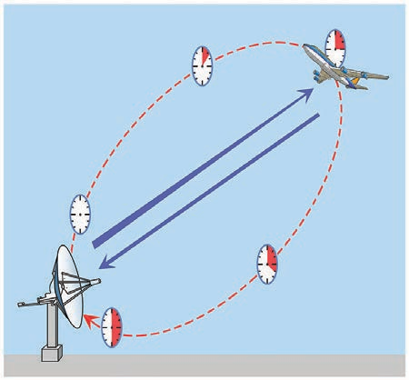

  

# MEASUREMENT OF BASIC QUANTITIES

### Measurement of length

The concept of length in physics is related to the concept of distance in everyday life. Length is defined as the distance between any two points in space. The SI unit of length is metre. The objects of our interest vary widely in sizes. For example, large objects like the galaxy, stars, Sun, Earth, Moon etc., and their distances constitute a **_macrocosm_**. It refers to a large world,

---
**The Radian (rad):** One radian is the angle _subtended at the centre of a circle by an arc equal in length to the radius of the circle_. 
**The Steradian (sr):** One steradian is _the solid angle subtended at the centre of a sphere, by that surface of the sphere, which is equal in area, to the square of radius of the sphere_

---
in which both objects and distances are large. On the contrary, objects like molecules, atoms, proton, neutron, electron, bacteria etc., and their distances constitute **_microcosm_**, which means a small world in which both objects and distances are small-sized.

Distances ranging from   10^{-5} m to \\(10^{2}\\) m can be measured by direct methods. For example_,_ a metre scale can be used to measure the distance from  10^{−3}  m to 1 m, vernier calipers up to  10^{−4}  m, a screw gauge up to  10^{−5}  m and so on. The atomic and astronomical distances cannot be measured by any of the above mentioned direct methods. Hence, to measure the very small and the very large distances, indirect methods have to be devised and used. In Table 1.4, a list of powers of 10 (both positive and negative powers) is given. Prefixes for each power are also mentioned. These prefixes are used along with units of length, and of mass.

---
**Do You Know ?**
The supplementary quantities of plane and solid angle were converted into Derived quantities in 1995 (GCWM)

---
**Table 1.4 Prefixes for Powers of Ten** 
|Multiple | Prefix | Symbol |Sub multiple | Prefix | Symbol |      
|---|----|----|---|---|---|
| 10^{1}  | deca | da |  10^{−1}  | deci | d |
| 10^{2}  | hecto | h |  10^{−2}  | centi |c|
| 10^{3}  | kilo | k | 10^{−3}  | milli | m |
| 10^{6}  | mega | M | 10^{−6}  | micro | µ |
| 10^{9}  | giga | G | 10^{−9}  | nano | n |
| 10^{12}  | tera | T |  10^{−12}  | pico | p |
| 10^{15}  | peta | P | 10^{−15}  | femto | f | 
| 10^{18}  | exa | E | 10^{−18}  | atto | a |
| 10^{21}  | zetta | Z | 10^{−21}  | zepto | z |
| 10^{24}  | yotta | Y |  10^{−24}  | yocto | y | 

**i) Measurement of small distances: screw gauge and vernier caliper** _Screw gauge: The screw gauge is_ an instrument used for measuring accurately the dimensions of objects up to a maximum of about 50 mm. The principle of the instrument is the magnification of linear motion using

**Figure 1.2** Screw gauge and vernier caliper with errors

the circular motion of a screw. The least
count of the screw gauge is 0.01 mm
Vernier caliper: A vernier caliper is a
versatile instrument for measuring
the dimensions of an object namely
diameter of a hole, or a depth of a
hole.  The least count of the vernier
caliper is 0.01 cm

**ii) Measurement of large distances** For measuring larger distances such as the height of a tree, distance of the Moon or a planet from the Earth, some special methods are adopted. Triangulation method, parallax method and radar method are used to determine very large distances.

**Triangulation method for the height of an accessible object** 

Let AB = h be the height of the tree or tower to be measured. Let C be the point of observation at distance _x_ from B. Place a range finder at C and measure the angle of elevation, ∠ACB = θ as shown in Figure 1.3.

From right angled triangle ABC,

tan θ = AB / BC = h / x

(or)

height h = x tan θ

Knowing the distance _x_, the height h can be determined.

**Figure 1.3** Triangulation method

Range and order of lengths of various objects are listed in Table 1.5  

**EXAMPLE 1.1**

From a point on the ground, the top of a tree is seen to have an angle of elevation 60°. The distance between the tree and a point is 50 m. Calculate the height of the tree?

**_Solution_**

Angle θ = 60°

The distance between the tree and a point _x_ \= 50 m

Height of the tree (h) = ?

For triangulation method tan θ = _h / x_

h = _x_ tan θ
 
  = 50 × tan 60°
 
  = 50 × 1.732
 
  _h_ = 86.6 m

The height of the tree is 86.6 m.

**Parallax method**

Very large distances, such as the distance of a planet or a star from the Earth can be measured by the parallax method. _Parallax is the name given to the apparent change in the position of an object with respect to the background, when the object is seen from two different positions. The distance between the_ two positions (i.e., points of observation) is called the basis (b). Consider any object at the location O (Figure 1.4)

Let L and R represent the positions of the left and right eyes of the observer respectively.

The object (O) is viewed with the left eye (L) keeping the right eye closed and the same object (O) is viewed with the right eye (R) keeping the left eye closed.

In Figure 1.4, LO and RO are the lines drawn from the positions of the left and right eyes to the object. These two lines make an angle θ at O. This angle θ is called the angle of parallax.

OL and OR are considered as the radii (_x_) of a circle. For astronomical calculation, the distance LR = b (basis) can be treated as an arc of this circle, then

OL = OR = _x_ 

as LR = b

θ = _b / x_

Knowing b and θ, _x_ can be calculated which is approximately the distance of the object from the observer.

If the object is the Moon or any near by star, then the angle θ will be too small due to the large astronomical distance and the place of observation. In this case, the two points of observation should be sufficiently spaced on the surface of the Earth.

**Figure 1.4** Parallax method L Rb

**Determination of distance of Moon from Earth** In Figure 1.5, C is the centre of the Earth. A and B are two diametrically opposite places on the surface of the Earth. From A and B, the parallaxes  θ_1   and  θ_2   respectively of Moon M with respect to some distant star are determined with the help of an astronomical telescope. Thus, the total parallax of the Moon subtended on Earth ∠_AMB_ =  θ_1   +  θ_2   = θ.

If θ is measured in radians, then θ = _AB / AM_ ; AM≈MC (AM is approximately equal to MC)
θ =_AB/MC_ or θ =_MC/AB_ ; Knowing the values of AB and θ, we can calculate the distance MC of Moon from the Earth.

**Figure 1.5** Parallax method: determination of distance of Moon from Earth

**EXAMPLE 1.2**

The Moon subtends an angle of 1° 55′ at the base line equal to the diameter of the Earth. What is the distance of the Moon from the Earth? (Radius of the Earth is 6.4 × {\\(10^{6}\\)>} _m_)

**_Solution_**

---
angle θ = 1° 55′= 115′

\=(115 × 60)˝ × (4.85 × 10-6) rad 

=3.34 × 10-2 rad

since 1˝ = 4.85 × 10-6 rad

---
Radius of the Earth = 6.4 × \\(10^{6}\\) _m_ From the Figure 1.5, AB is the diameter of the Earth (b)= 2 × 6.4 × \\(10^{6}\\) _m_ Distance of the Moon from the Earth _x_ = ?

---
_x_ = _b_/θ = 2 * 6.4  * \\(10^{6}\\) / 3.34 * 10
_x_ \= 3.83 × \\(10^{8}\\)m

---
**RADAR method** 

The word RADAR stands for radio detection and ranging. A radar can be used to measure accurately the distance of a nearby planet such as Mars. In this method, radio waves are sent from transmitters which, after reflection from the planet, are detected by the receiver. By measuring, the time interval (t) between the instants the radio waves are sent and received, the distance of the planet can be determined as

---
Speed = distance travelled / time taken (Speed is explained in unit 2) Distance(d) = Speed of radio

waves _×_ time taken

d =  v * t / 2

where v is the speed of the radio wave. As the time taken (t) is for the distance covered during the forward and backward path of the radio waves, it is divided by 2 to get the actual distance of the object. This method can also be used to determine the height, at which an aeroplane flies from the ground.

**Figure 1.6** RADAR method

**EXAMPLE 1.3**

A RADAR signal is beamed towards a planet and its echo is received 7 minutes later. If the distance between the planet and the Earth is 6.3 × \\(10^{10}\\) m. Calculate the speed of the signal?

**_Solution_**

The distance of the planet from the Earth d = 6.3 × \\(10^{10}\\) m

Time t = 7 minutes = 7 × 60 s. 

the speed of signal _v_ \= ?

The speed of signal

_v = 2d / t_ = 2 * 6.3 * \\(10^{10}\\) /  7 * 60 = 3 * \\(10^{8}\\) ms-1

**Table 1.5** Range and Order of Lengths 
|**Size of objects and distances** |**Length (m)**|
|---|----|
|Distance to the boundary of observable universe | \\(10^{26}\\) |
|Distance to the Andromeda galaxy | \\(10^{22}\\) |
|Size of our galaxy|\\(10^{21}\\)|
|Distance from Earth to the nearest star (other than the Sun) |\\(10^{16}\\)|
|Average radius of Pluto’s orbit | \\(10^{12}\\)|
|Distance of the Sun from the Earth |\\(10^{11}\\)|
|Distance of Moon from the Earth |\\(10^{8}\\)|
|Radius of the Earth |\\(10^{7}\\)|
|Height of the Mount Everest above sea level |\\(10^{4}\\)|
|Length of a football field |\\(10^{2}\\) |
|Thickness of a paper | \\(10^{-4}\\)|
|Diameter of a red blood cell |\\(10^{-5}\\) |
|Wavelength of light |\\(10^{-7}\\)|
|Length of typical virus |\\(10^{-8}\\)|
|Diameter of the hydrogen atom |\\(10^{-10}\\)|
|Size of atomic nucleus|\\(10^{-14}\\) |
|Diameter of a proton|\\(10^{-15}\\)|

**Figure 1.7 The international** 1 kg standard of mass, a platinum-iridium (9:1) cylinder 3.9 cm in height and diameter.  

**Some Common Practical Units**

(i) Fermi = 1 fm = 10−15 m

(ii) 1 angstrom = 1 Å = 10−10 m

(iii) 1 nanometer = 1 nm = 10−9 m

(iv) 1 micron = 1µm = 10−6 m

(v) 1 Light year (Distance travelled by light in vacuum in one year) 1 Light Year = 9.467 × 1015 m

(vi) 1 astronomical unit (the mean distance of the Earth from the Sun) 1 AU = 1.496 × 1011 m

(vii) 1 parsec (Parallactic second) (Distance at which an arc of length 1 AU subtends an angle of 1 second of arc) 1 parsec = 3.08 × 1016 m\=3.26 light year

---
**Do You Know ?**

Why is the cylinder used in defining kilogram made up of platinum-iridium alloy?

This is because the platinum-iridium alloy is least affected by environment and time.

---
Chandrasekhar Limit (CSL) is the largest practical unit of mass.

1 CSL = 1.4 times the mass of the Sun

The smallest practical unit of time is Shake.

1 Shake = 10−8 s