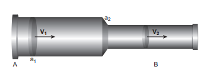
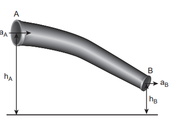
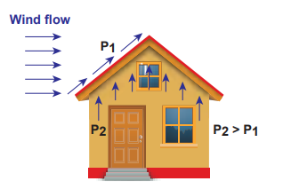
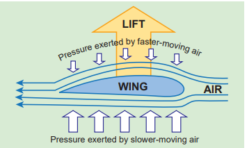
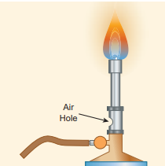
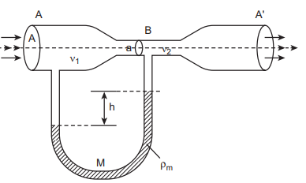
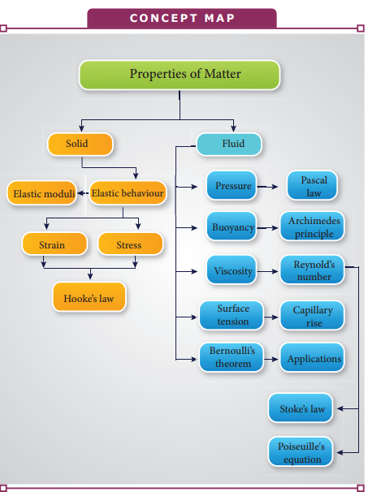
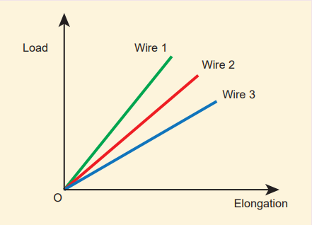

# BERNOULLI’S THEOREM

## Equation of continuity
In order to discuss the mass flow rate through a pipe, it is necessary to assume that the flow of fluid is steady, the flow of the fluid is said to be steady if at any given point, the velocity of each passing fluid particle remains constant with respect to time. Under this condition, the path taken by the fluid particle is a streamline. 
Consider a pipe AB of varying cross sectional area a1 and a2 such that a1 > a2\. A non-viscous and incompressible liquid flows steadily through the pipe, with velocities v1 and v2 in area a1 and a2, respectively as shown in Figure 7.32.

**Fig 7.32** A streamlined flow of fluid through a 

Let m1 be the mass of fluid flowing through section 
A in time Δt, m1 = (a1 v1 _Δt_) ρ
Let m2 be the mass of fluid flowing through section 
B in time Δt, m2 = (a2 v2 _Δt_) ρ
For an incompressible liquid, mass is conserved 
m1 = m2

a1 v1 Δt ρ = a2 v 2Δ t ρ

a1 v1 = a2 v2 ⇒ a v = constant (7.35)
which is called the equation of continuity and it is a statement of conservation of mass in the flow of fluids.  

In general, _a v =_ constant, which means that the volume flux or flow rate remains constant throughout the pipe. In other words, the smaller the cross section, greater will be the velocity of the fluid.

**EXAMPLE 7.14**
In a normal adult, the average speed of the blood through the aorta (radius _r_ = 0.8 cm) is 0.33 ms–1. From the aorta, the blood goes into major arteries, which are 30 in number, each of radius 0.4 cm. Calculate the speed of the blood through the arteries.

**_Solution_**
a1 v1 = 30 a2 v2 ⇒ π r v1 2

1 = 30 π _r v_2 2

2

_v r r_

_v v_2 1

2

2

1 2

2

2

1 30

1 30

0 8 10 0 4 10

\= 

 



  ⇒ = ×

× ×



 

−

−

.

. m m  × −

2

10 33( . )ms

_v v_ 2

1 2

2

2

1 30

0 8 10 0 4 10

⇒ = × × ×



 

−

−

.

. m m  × −

2

10 33( . )ms

_v_2 = 0.044 m s–1

## Pressure, kinetic and potential energy of liquids

A liquid in a steady flow can possess three kinds of energy. They are (1) Kinetic energy, (2) Potential energy, and (3) Pressure energy, respectively.

1. **Kinetic energy:** The kinetic energy of a liquid of mass _m_ moving with a velocity _v_ is given by

_KE_ = 1 2

_mv_2

The kinetic energy per unit mass =

_KE m_

_mv_

_m v_\= =

1 2 1

2

2

2

  

Similarly, the kinetic energy per unit volume

\= _KE mv_

_V m V_

_v v_ volume

\= = 

  

  =

1 2 1

2 1 2

2

2 2ρ

2. **Potential energy:** The potential energy of a liquid of mass _m_ at a height _h_ above the ground level is given by

_PE_ \= _mgh_

The potential energy per unit mass

\= _PE m_

_mgh m_

_gh_\= =

Similarly, the potential energy per unit

volume = _PE mgh V_

_m V_

_gh gh_ volume

\= = 

  

  =ρ

3. **Pressure energy:** The energy acquired by a fluid by applying pressure on the fluid. We know that

Pressure = Force Area

⇒ Force = Pressure × Area

_F_ × _d_ = (_P A_) × _d_ = _P_ (_A_ × _d_)

⇒ _F_ × _d_ \= W = P V = pressure energy Therefore, pressure energy, EP = PV

The pressure energy per unit mass =

_E m m_

_P_ \= = = PV P

m V

P ρ

Similarly, the pressure energy per unit

volume = _E PV V_

_PP_

volume = =

## Bernoulli’s theorem and its applications

In 1738, the Swiss scientist Daniel Bernoulli developed a relationship for the flow of fluid through a pipe of varying cross section. He proposed a theorem for the streamline flow of a liquid based on the law of conservation of energy. 

**Bernoulli’s theorem** According to Bernoulli’s theorem, the sum of pressure energy, kinetic energy, and potential energy per unit mass of an incompressible, non-viscous fluid in a streamlined flow remains a constant. Mathematically,
_P v_ ρ + +

1 2

2 gh = constant (7.36)

This is known as Bernoulli’s equation. 

**Proof:**

**Figure 7.33** Flow of liquid through a pipe AB

A

B aB

aA

hA

hB

Let us consider a flow of liquid through a pipe AB as shown in Figure 7.33. Let _V_ be the volume of the liquid when it enters _A_ in a time _t_ which is equal to the volume of the liquid leaving _B_ in the same time. Let _aA_, _vA_ and P_A_ be the area of cross section of the tube, velocity of the liquid and pressure exerted by the liquid at _A_ respectively.

Let the force exerted by the liquid at _A_ is _FA_ = _PAaA_

Distance travelled by the liquid in time _t_ is _d_ = _vA_ _t_

Therefore, the work done is _W_ = _FAd_ = _PAaAvA_ _t_

But _aAvAt_ = _aAd_ =_V_, volume of the liquid entering at _A_. Thus, the work done is the pressure energy (at _A_), _W_ = _FAd_ = _PAV_

  

Pressure energy per unit volume at A

Pressure energy volume

P V

PA A= =

_V_

Pressure energy per unit mass at A

Pressure energy mass

P m

P m V

PA A A= = = _V_

ρ

Since m is the mass of the liquid entering at A in a given time, therefore, pressure energy of the liquid at A is

_E_PA = P_AV_ = P_AV_ × _m m_

_m_ 

  

 =

PA

ρ

Potential energy of the liquid at A, PE_A_ = mg hA,

Due to the flow of liquid, the kinetic energy of the liquid at A,

KEA = 1 2

m v A 2

Therefore, the total energy due to the flow of liquid at A, EA = EPA + KEA + PEA

E P mv mg hA A

A A= + +_m_ ρ

1 2

2

Similarly, let _a_B, _v_B, and PB be the area of cross section of the tube, velocity of the liquid, and pressure exerted by the liquid at _B_. Calculating the total energy at EB, we get

E P mv mg hB B

B= + +_m_ ρ

1 2

2 **B**

From the law of conservation of energy, EA = EB

_m m_P mv mg h P m v mg hA A A

B B Bρ ρ

\+ + = + + 1 2

1 2

2 2

P v g h P v g hA A A

B B Bρ ρ

\+ + = + + 1 2

1 2

2 2 = constant

Thus, the above equation can be written as

P g

v gρ

\+ 1 2

2

\+ h = constant  

The above equation is the consequence of the conservation of energy which is true until there is no loss of energy due to friction. But in practice, some energy is lost due to friction. This arises due to the fact that in a fluid flow, the layers flowing with different velocities exert frictional forces on each other. This loss of energy is generally converted into heat energy. Therefore, Bernoulli’s relation is strictly valid for fluids with zero viscosity or non-viscous liquids. Notice that when the liquid flows through a horizontal pipe, then h = 0 ⇒ P g

v gρ

\+ 1 2

2

\= constant.

**Applications of Bernoulli’s Theorem**

**(a) Blowing off roofs during wind storm** In olden days, the roofs of the huts or houses were designed with a slope as shown in Figure.7.34. One important scientific reason is that as per the Bernoulli’s principle, it will be safeguarded except roof during storm or cyclone.

**Figure 7.34** Roofs of the huts or houses

During cyclonic condition, the roof is blown off without damaging the other parts of the house. In accordance with the Bernoulli’s principle, the high wind blowing over the roof creates a low-pressure P1. The pressure under the roof P2 is greater. Therefore, this pressure difference (P2–P1) creates an up thrust and the roof is blown off.

**(b) Aerofoil lift** 
The wings of an airplane (aerofoil) are so designed that its upper surface is more curved than the lower surface and the front edge is broader than the real edge. As the aircraft moves, the air moves faster above the aerofoil than at the bottom as shown in Figure 7.35. According to Bernoulli’s Principle, the pressure of air below is greater than above, which creates an upthrust called the dynamic lift to the aircraft.

**Figure 7.35 Aerofoil lift**

Pressure exerted by faster-moving air

**(c) Bunsen burner** 
In this, the gas comes out of the nozzle with high velocity, hence the pressure in the stem decreases. So outside air reaches into the burner through an air vent and the mixture of air and gas gives a blue flame as shown in Figure 7.36.

**Figure 7.36 Bunsen burner**

**(d) Venturimeter** 
This device is used to measure the rate of flow (or say flow speed) of the incompressible  fluid flowing through a pipe. It works on the principle of Bernoulli’s theorem. It consists of two wider tubes A and A' (with cross sectional area A) connected by a narrow tube B (with cross sectional area _a_). A manometer in the form of U-tube is also attached between the wide and narrow tubes as shown in Figure7.37. The manometer contains a liquid of density ‘ρm’.

**Figure 7.37** A schematic diagram of venturimeter

A A'

a B

A

1 2

h

M ρm

Let P1 be the pressure of the fluid at the wider region of the tube A. Let us assume that the fluid of density ‘ρ’ flows from the pipe with speed ‘v1’ and into the narrow region, its speed increases to ‘v2’. According to the Bernoulli’s equation, this increase in speed is accompanied by a decrease in the fluid pressure P2 at the narrow region of the tube B. Therefore, the pressure difference between the tubes A and B is noted by measuring the height difference (ΔP \= P1−P2) between the surfaces of the manometer liquid. From the equation of continuity, we can say that A v1 = a v2 which means that

_v_2 = _A a_

_v_1.

Using Bernoulli’s equation,

_P_1 + ρ _v_1 2

2 = _P_2 + ρ _v_2

2

2 = _P_2 + ρ 1

2 1

2_A a_

_v_ 

 



 

| h |

|------|------|

|------|------|------|
| Figure 7.36 Bunsen burner |
  

From the above equation, the pressure difference

Δ_P_ = _P_1 – _P_2 = ρ _v A a a_

1 2 2 2

22 ( )-

Thus, the speed of flow of fluid at the wide end of the tube A

_v P a_

_A a v_

_P a A a_1

2 2

2 2 1

2

2 2

2 2 =

∆ −

⇒ = ∆ −

( ) ( )

( ) ( )ρ ρ

The volume of the liquid flowing out per second is

_V Av A P a_

_A a aA_

_P A a_

\= = ∆

− =

∆

−1

2

2 2 2 2

2 2( ) ( )

( ) ( )ρ ρ

**(e) Other applications** 
This Bernoulli’s concept is mainly used in the design of carburetor of automobiles, filter pumps, atomizers, and sprayers. For example, the carburetor has a very fine channel called nozzle through which the air is allowed to flow in larger speed. In this case, the pressure is lowered at the narrow neck and in turn, the required fuel or petrol is sucked into the chamber so as to provide the correct mixture of air and fuel necessary for ignition process.

**Activity**
A bottle is filled with thermocol balls. One end of a flexible tube is kept inside the bottle immersed inside the balls. The free end is rotated and we find the balls sprayed all around. This explains the working of an atomizer or sprayer.

A spider web is much strong spider that what we think. A single strand of spider silk can stop flying insects which are tens and thousands times its mass. The young’s modu 4.5 × 109 N m−2. Compare this value  value wit Young's modulus of wood.

**S U M M A R Y**  

- The force between the atoms of an eleme force between the molecules of a compou
- _Hooke’s law:_ within the elastic limit, the „ The force per unit area is known as stress of cross section of the body then the m or compressional stress can be expresse _stress_.
- The ratio of change in length to the orig known as _longitudinal strain_
- Within the elastic limit, the ratio of long called the Young’ s modulus of the mater
- Within the elastic limit, the ratio of volu _bulk modulus_.
-  Within the elastic limit, the ratio of she _rigidity modulus_.
- Poisson’s ratio = lateral strain/longitudin „ The elastic potential energy stored in the

U = 1 2

× stress × strain= 1 2

× Y × (strain the material.

- If F is the magnitude of the normal for pressure is defined as the ‘force acting per
- The total pressure at a depth h below the the atmospheric pressure which is equal
- Pascal’s law states that the pressure in a flu the same height.
- The law of floatation states that a body wi displaced by the immersed part of the body body.
- The coefficient of viscosity of a liquid is th area of a liquid layer having a unit veloci the direction of flow of the liquid.
- When a liquid flows such that each partic the same path and has the same velocity said to be streamlined flow.
- During the flow of fluid, when the critica the motion becomes _turbulent_.
- Reynold’s number has a significance as it fluid through a cylindrical pipe is stream

**S U M M A R Y**  

- Stokes formula F= 6πηav, where F is the and v is the terminal velocity of the sphe
- The surface tension of a liquid is define length of an imaginary line drawn on the the force being perpendicular to the line
- The angle between tangents drawn at the solid surface inside the liquid is called t liquid.
The flow of a fluid is said to be steady i passing fluid particle remains constant w
- The equation a1 v1 = a2 v2 is called the through a tube and it is due to the conser that the sum of pressure energy, kinetic e of an incompressible, non-viscous fluid i.e., P/ρ + v2/2 + gh = constant.

**I. Multiple Choice Questions**
**EVALUATION**

**1\.** Consider two wires X and Y. The radius of wire X is 3 times the radius of Y. If they are stretched by the same load then the stress on Y is
(a) equal to that on X 
(b) thrice that on X 
(c) nine times that on X 
(d) Half that on X

**2\.** If a wire is stretched to double of its original length, then the strain in the wire is

(a) 1 
(b) 2 
(c) 3 
(d) 4

**3\. The load – elongation graph of three** wires of the same material are shown in figure. Which of the following wire is the thickest?

(a) wire 1 
(b) wire 2 
(c) wire 3 
(d) all of them have same thickness

**4\.** For a given material, the rigidity modulus is \((\frac{1}{3})^{rd} \)of Young’s modulus.
Its Poisson’s ratio is 
(a) 0 
(b) 0.25
(c) 0.3
(d) 0.5  

**5\.** A small sphere of radius 2cm falls from rest in a viscous liquid. Heat is produced due to viscous force. The rate of production of heat when the sphere attains its terminal velocity is proportional to
 (NEET model 2018)

(a) 22
(b) 23
(c) 24 
(d) 25

**6\.** Two wires are made of the same material and have the same volume. The area of cross sections of the first and the second wires are A and 2A respectively. If the length of the first wire is increased by ∆l on applying a force F, how much force is needed to stretch the second wire by the same amount?
(NEET model 2018)

(a) 2 F 
(b) 4 F 
(c) 8 F
(d) 16 F

**7\.** With an increase in temperature, the viscosity of liquid and gas, respectively will

(a) increase and increase 
(b) increase and decrease 
(c) decrease and increase 
(d) decrease and decrease

**8\.** The Young’s modulus for a perfect rigid body is

(a) 0 
(b) 1 
(c) 0.5
(d) infinit

**9\.** Which of the following is not a scalar?
 (a) viscosity 
 (b) surface tension 
 (c) pressure 
 (d) stress

**10\.** If the temperature of the wire is increased, then the Young’s modulus will

(a) remain the same 
(b) decrease 
(c) increase rapidly 
(d) increase by very a small amount

**11\.** Copper of fixed volume V is drawn into a wire of length l. When this wire is subjected to a constant force F, the extension produced in the wire is ∆l. If Y represents the Young’s modulus, then which of the following graphs is a straight line?
(NEET 2014 model) 

(a) ∆l versus _V_ 
(b) ∆l versus _Y_ 
(c) ∆l versus _F_ 
(d) ∆l versus 1

**12\.** A certain number of spherical drops of a liquid of radius R coalesce to form a single drop of radius R and volume V. If T is the surface tension of the liquid, then

(a) energy = 4 V T \( (\frac{1}{r} - \frac{1}{R})\) is released

(b) energy = 3 V T \( (\frac{1}{r} + \frac{1}{R})\) is absorbed

(c) energy = 3 V T \( (\frac{1}{r} - \frac{1}{R})\) is released

(d) energy is neither released nor absorbed  

**13\.** The following four wires are made of the same material. Which of these will have the largest extension when the same tension is applied?

(a) length = 200 cm, diameter = 0.5 mm 
(b) length= 200 cm, diameter = 1 mm 
(c) length = 200 cm, diameter = 2 mm 
(d) length= 200 cm, diameter = 3 m

**14\.** The wettability of a surface by a liquid depends primarily on 

(a) viscosity 
(b) surface tension 
(c) density 
(d) angle of contact between the surface and the liquid

 
**15\.** In a horizontal pipe of non-uniform cross section, water flows with a velocity of 1 m s-1 at a point where the diameter of the pipe is 20 cm. The velocity of water (1.5 m s-1) at a point where the diameter of the pipe is (in cm)

(a) 8 
(b) 16 
(c) 24 
(d) 32

**Answers:**

1) c 2) a 3) a 4) d 5) d 6) b 7) c 8) d 9) d 10) b 11) c 12) c 13) a 14) d 15) b

**II. Short Answer Questions**

**1\.** Define stress and strain. 
**2\.** State Hooke’s law of elasticity. 
**3\.** Define Poisson’s ratio. 
**4\.** Explain elasticity using intermolecular forces. 
**5\.** Which one of these is more elastic, steel or rubber? Why?
**6\.** A spring balance shows wrong readings after using for a long time. Why?
**7\.** What is the effect of temperature on elasticity?
**8\.** Write down the expression for the elastic potential energy of a stretched wire.
**9\.** State Pascal’s law in fluids. 
**10\.** State Archimedes principle. 
**11\.** What do you mean by upthrust or buoyancy? **12\.** State the law of floatation. 
**13\.** Define coefficient of viscosity of a liquid. **14\.** Distinguish between streamlined flow and turbulent flow. 
**15\.** What is Reynold’s number? Give its significance. 
**16\.** Define terminal velocity. 
**17\.** Write down the expression for the Stoke’s force and explain the symbols involved in it.
**18\.** State Bernoulli’s theorem. 
**19\.** What are the energies possessed by a liquid? Write down their equations. 
**20\.** Two streamlines cannot cross each other. Why? **21\.** Define surface tension of a liquid. Mention its S.I unit and dimension. 
**22\.** How is surface tension related to surface energy? 
**23\.** Define angle of contact for a given pair of solid and liquid. 
**24\.** Distinguish between cohesive and adhesive forces. 
**25\.** What are the factors affecting the surface tension of a liquid?  
**26\.** What happens to the pressure inside a soap bubble when air is blown into it?
**27\.** What do you mean by capillarity or capillary action?
**28\.** A drop of oil placed on the surface of water spreads out. But a drop of water place on oil contracts to a spherical shape. Why?
**29\.** State the principle and usage of Venturimeter.

**III. Long Answer Questions**

**1\.** State Hooke’s law and verify it with the help of an experiment.
**2\.** Explain the different types of modulus of elasticity.
**3\.** Derive an expression for the elastic energy stored per unit volume of a wire.
**4\.** Derive an equation for the total pressure at a depth ‘h’ below the liquid surface.
**5\.** State and prove Pascal’s law in fluids. 
**6\.** State and prove Archimedes principle.
**7\.** Derive the expression for the terminal velocity of a sphere moving in a high viscous fluid using stokes force.
**8\.** Derive Poiseuille’s formula for the volume of a liquid flowing per second through a pipe under streamlined flow.
**9\.** Obtain an expression for the excess of pressure inside a 
i) liquid drop 
ii) liquid bubble 
iii) air bubble.
**10\.** What is capillarity? Obtain an expression for the surface tension of a liquid by capillary rise method.
**11\.** Obtain an equation of continuity for a flow of fluid on the basis of conservation of mass.
**12\.** State and prove Bernoulli’s theorem for a flow of incompressible, non-viscous, and streamlined flow of fluid.
**13\.** Describe the construction and working of venturimeter and obtain an equation for the volume of liquid flowing per second through a wider entry of the tube.

**IV. Exercises**

**1\.** A capillary of diameter dmm is dipped in water such that the water rises to a height of 30mm. If the radius of the capillary is made \(\frac{2}{3} \) of its previous value, then compute the height up to which water will rise in the new capillary?
(Answer: 45 mm)

**2\.** A cylinder of length 1.5 m and diameter 4 cm is fixed at one end. A tangential force of 4 × 105 N is applied at the other end. If the rigidity modulus of the cylinder is 6 × 1010 N m-2 then, calculate the twist produced in the cylinder. 
(Answer: 45.60)

**3\.** A spherical soap bubble A of radius  2 cm is formed inside another bubble B of radius 4 cm. Show that the radius of a single soap bubble which maintains the same pressure difference as inside the smaller and outside the larger soap bubble is lesser than radius of both soap bubbles A and B.

**4\.** A block of Ag of mass x kg hanging from a string is immersed in a liquid of relative density 0.72. If the relative density of Ag is 10 and tension in the string is 37.12 N then compute the mass of Ablock. (Answer: x = 4 kg)

**5\.** The reading of pressure meter attached with a closed pipe is 5 × 105 N m-2. On opening the valve of the pipe, the reading of the pressure meter is 4.5 × 105 Nm-2. Calculate the speed of the water flowing in the pipe. 
(Answer: 10 ms-1)

**BOOKS FOR REFERENCE**

**1\.** Serway and Jewett, Physics for scientist and 
Engineers with modern physics, Brook/Coole publishers, Eighth edition

**2\.** Paul Tipler and Gene Mosca, Physics for scientist and engineers with modern physics, Sixth edition, W.H.Freeman and Company

**3\.** H.C.Verma, Concepts of physics volume 1 and Volume 2, Bharati Bhawan Publishers  

  

