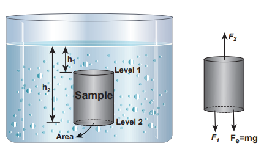
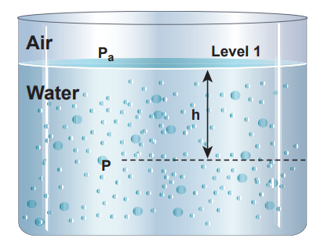
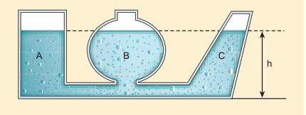
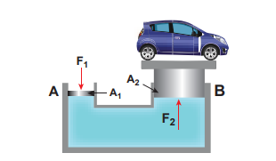
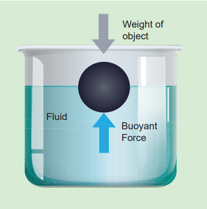

---
<<<<<<< HEAD
title: 'Fluids'
=======
title: 'fluids'
>>>>>>> 9468d8de506ee3fe7a32ff32aec5f0ee5a849f86
weight: 3
extensions:
    - katex # Add This Extension On Top
---

# FLUIDS

## Introduction

Fluids are found everywhere in the world. Earth,s surface has about two-thirds of water and one-third of land. Fluids are different from solids. Unlike solid, fluid has no defined shape of its own. As far as fluid is concerned, liquid has fixed volume whereas gas fills the entire volume of the container.

**Pressure of a fluid:**
 Fluid is a substance which begins to flow when an external force is applied on it. It offers a very small resistance to the applied force. If the force acts on a smaller area, then the impact will be more and vice versa. This particular idea decides yet another quantity called ‘_pressure_’.

Assume that an object is submerged in a fluid (say water) at rest. In this case, the fluid will exert a force on the surface of the object. This force is always normal to the surface of the object. If F is the magnitude of the normal force acting on the surface area A, then the pressure is defined as the ‘force _acting per unit area_’.  

P= \frac{F}{A}  (7.14)


Pressure is a scalar quantity.Its S.I. unit and dimensions are Nm–2 or pascal (Pa) and ML–1T–2 respectively.
Another common unit of pressure is atmosphere which is abbreviated as ‘atm’. It is defined as the pressure exerted by the atmosphere at sea level. i.e., 1 atm = 1.013 × 105 Pa or N m–2. Apart from pressure, there are two more parameters such as density and relative density (or specific gravity) which are used to describe the nature of fluids.

**Density of a fluid:**
The density of a fluid is defined as its mass per unit volume. For a fluid of mass m occupying volume _V_, the density ρ= \frac{m}{v}  . The dimensions and S.I unit of ρ are ML–3 and kg m–3, respectively. It is a positive scalar quantity. Mostly, a liquid is largely incompressible and hence its density is nearly constant at ambient pressure (i.e. at 1 atm. pressure). In the case of gases, there are variations in densities with reference to pressure.

**Relative density or specific gravity:**
The relative density of a substance is defined as the ratio of the density of a substance to the density of water at 4 °C. It is a dimensionless positive scalar quantity. For example, the density of mercury is 13.6 × 103kg m–3. Its relative density is equal to

\frac{{13.6}\times{10}^{3} {k}{g}{m}^{-3}}{{1.0}\times{10}^{3} {k}{g}{m}^{-3}}  = 13.6.
 

The density of water at 4 °C is 1000 kg m–3

**EXAMPLE 7.6**
A solid sphere has a radius of 1.5 cm and a mass of 0.038 kg. Calculate the specific gravity or relative density of the sphere.

**_Solution_**

Radius of the sphere R = 1.5 cm mass m = 0.038 kg


Volume of the sphere V= \frac{4}{3}πR^{3} 



= \frac{4}{3} \times({3.14}) \times ({1.5}\times{10}^{-2})^{3}  = {1.413}\times {10}^{-5}{m}^{3} 

Therefore, density


ρ= \frac{m}{v}  = \frac{0.038 kg}{{1.413}\times{10}^{-5}{m}^{3}}  = {2690}\ {kgm^{-3}}



= \frac{2690}{1000}  = {2.69}


## Pressure due to fluid column at rest
A mountaineer climbing the mountain is able to experience a decrease in pressure with altitude. A person jumping into the swimming pool always realizes an increase in pressure with depth below the water surface. In both the cases, the pressure encountered by the mountaineer and diver is usually due to the hydrostatic pressure, because they are due to fluids that are static.

In order to understand the increase in pressure with depth below the water surface, consider a water sample of cross sectional area A in the form of a cylinder. Let h1 and h2 be the depths from the air-water interface to level 1 and level 2 of the cylinder respectively as shown in Figure 7.10(a). Let F1 be the force acting downwards on level 1 and F2 be the force acting upwards on level 2 such that F1 = P1 A and F2 = P2 A. Let us assume the mass of the sample to be _m_ and under equilibrium condition, the total upward force (F2) is balanced by the total downward force (F1 + mg). In other words, the gravitational force will act downward which is being exactly balanced by the difference between the force F2 – F1.  

F2 – F1= mg = FG (7.15)


Let ρ be the density of the water, then the mass of water available in the sample element is


m=ρV =ρ A(h2–h1) 
V=A (h2–h1)


**Figure 7.10** (a) A sample of water with base area A in a static fluid with its forces in equilibrium

Hence gravitational force,

FG = ρ A (h2 – h1) g


On substituting the value of FG in equation (7.15)


F2=F1+m g 



P2 A = P1 A+ρA(h2–h1)g


Cancelling out A on both sides,

P2 = P1 + ρ(h2–h1)g (7.16)


**Figure 7.10 (b) The pressure (P) at a** depth (h) below the water surface

If we choose the level 1 at the surface of the liquid (i.e., air-water interface) and the level 2 at a depth ‘h’ below the surface (as shown in Figure 7.10(b)), then the value of h1 becomes zero (h1 = 0) and in turn P1 assumes the value of atmospheric pressure (say Pa). In addition, the pressure (P2) at a depth becomes P. Substituting these values in equation (7.16), we get

P = Pa + ρgh (7.17)


Therefore, the pressure at a depth h is greater than the pressure on the surface of the liquid. If the atmospheric pressure is neglected or ignored, then the pressure at a depth _h_ is


P = ρgh (7.18)


For a given liquid, ρ is fixed and g is also constant, then the pressure due to the fluid column is directly proportional to vertical distance or height of the fluid column. This implies that the height of the fluid column is more important to decide the pressure and not the cross sectional or base area or even the shape of the container. 

**Hydrostatic Paradox**
When we talk about liquid at rest, the liquid pressure is the same at all points at the same horizontal level (or same depth). This statement can be demonstrated by an experiment called ‘hydrostatic paradox’. Let us consider three vessels of different shapes A, B, and C as shown in Figure 7.11. These vessels are connected at the bottom by a horizontal pipe. When they are filled with a liquid (say water), it occupies the same level even though the vessels hold different amounts of water. It is true because the liquid at the bottom of each section of the vessel experiences the same pressure.  

**Figure 7.11** Illustration of hydrostatic parodox

The atmospheric pressure at a place is the gravitational force exerted by air above that place per unit surface area. It changes with height and weather conditions (i.e. density of air). In fact, the atmospheric pressure decreases with increasing elevation. The decrease of atmospheric pressure with altitude has an unwelcome consequence in daily life. For example, it takes longer time to cook at higher altitudes. Nose bleeding is another common experience at higher altitude because of larger difference in atmospheric pressure and blood pressure. Its value on the surface of the Earth at sea level is 1atm. 1 atm pressure = 1.013 × 105 pa

**Activity**
Take a metal container with an opening. Connect a vacuum pump to the opening. Evacuate the air from inside the container. Why the shape of the metal container gets crumbled?

**Inference:** 
Due to the force of atmospheric pressure acting on its outer surface, the shape of the container crumbles.

**Activity**
Take a glass tumbler. Fill it with water to the brim. Slide a cardboard on its rim so that no air remains in between the cardboard and the tumbler. Invert the tumbler gently. The water does not fall down.

**Inference:** 
This is due to the fact that the weight of water in the tumbler is balanced by the upward thrust caused due to the atmospheric pressure acting on the lower surface of the cardboard that is exposed to air.

## Pascal’s law and its applications
The French scientist Blaise Pascal observed that the pressure in a fluid at rest is the same at all points if they are at the same height. Pascal’s law states that _if the pressure in a liquid is changed at a particular point, the change is transmitted to the entire liquid without being diminished in magnitude_.

**_Application of Pascal’s law_ Hydraulic lift** 
A practical application of Pascal’s law is the hydraulic lift which is used to lift a heavy load with a small force. It is a force multiplier. It consists of two cylinders A and B connected to each other by a horizontal pipe, filled with a liquid (Figure 7.12). They are fitted with

**Figure 7.12 Hydraulic lift**

frictionless pistons of cross sectional areas A1 and A2 (A2 > A1). Suppose a downward force F is applied on the smaller piston, the pressure of the liquid under this piston increases to 

{P} (where, P = \frac{F1}{A1})


According to Pascal’s law,
this increased pressure P is transmitted undiminished in all directions. Therefore, a pressure is exerted on piston B. Upward force on piston B is


F2 = {P} \times {A2}  = \frac{F1}{A1} \times {A2} 



F2 = \frac{A2}{A1} \times {F1}  (7.19)


Therefore by changing the force on the smaller piston A, the force on the piston B can be increased by the factor A2/A1 and this factor is called the mechanical advantage of the lift.

**EXAMPLE 7.7**
Two pistons of a hydraulic lift have diameters of 60 cm and 5 cm. What is the force exerted by the larger piston when 50 N is placed on the smaller piston?

**_Solution_**
Since, the diameter of the pistons are given, we can calculate the radius of the piston


r= \frac{D}{2}



Area \ of \ smaller \ piston, A1 = {π}({\frac{5}{2}})^{2} = π ({2.5})^{2} 



Area\ of \ larger \ piston, A2 = {π}({\frac{60}{2}})^{2} = π ({30})^{2} 


This means that with the force of 50 N, the force of 7200 N can be lifted.

## Buoyancy

When a body is partially or fully immersed in a fluid, it displaces a certain amount of fluid. The displaced fluid exerts an upward force on the body. The upward force exerted by a fluid that opposes the weight of an immersed object in a fluid is called upthrust or _buoyant force_ and the phenomenon is called _buoyancy_.

**Archimedes principle:**

**Figure 7.13** Archimedes principle
**It states that when a body is partially or wholly immersed in a fluid, it experiences an upward thrust equal to the weight of the fluid displaced by it and its upthrust acts through the centre of gravity of the liquid displaced.** upthrust or buoyant force = weight of liquid displaced.

**Law of floatation** It is well-known that boats, ships, and some wooden objects move on the upper part of the water. We say that they float. Floatation can be defined as the tendency of an object to rise up to the upper levels  of the fluid or to stay on the surface of the fluid. **The law of floatation states that a body will float in a liquid if the weight of the liquid displaced by the immersed part of the body equals the weight of the body.**

For example, a wooden object weighs 300 kg (about 3000 N) floats in water displaces 300 kg (about 3000 N) of water.

**Note:**
If an object floats, the volume of fluid displaced is equal to the volume of the object submerged and the percentage of the volume of the object submerged is equal to the relative density of an object with respect to the density of the fluid in which it floats. For example, if an ice cube of density 0.9 g cm–3 floats in the fresh water of density 1.0 g cm–3, then the percentage volume of an object submerged in fresh water is. 
 
\frac{0.9cm^{-3}}{{1.0cm}^{-3}} \times {100}\%  = {90}\% 

Conversely, if the same ice cube floats in sea water of density 1.3 g cm–3, then the percentage volume of the object submerged in seawater would be only.
 
\frac{0.9cm^{-3}}{{1.3cm}^{-3}} \times {100}\%  = {69.23}\% 
\% 

**EXAMPLE 7.8** A cube of wood floating in water supports a 300 g mass at the centre of its top face. When the mass is removed, the cube rises by 3 cm. Determine the volume of the cube.

**_Solution_**

Let each side of the cube be l. The volume occupied by 3 cm depth of cube,


V = ({3cm}) \times {l}^{2}  = {3}{l}^{2} 


According to the principle of floatation, we have


Vρg = mg ⇒ Vρ = m


ρ is density of water = 1000 kg m–3


⇒  ({3l}^{2} \times {10}^{-2}{m}) \times ({100kg}{m}^{-3}) = {300} \times{10}^{-3}{kg} 



{l}^{2} =  \frac{300 \times 10^{-3}}{3 \times 10^{-2}\times{1000}} {m}^{2}  ⇒ {l}^{2} = 100 \times 10^{-4} {m}^{2} 



{l}  =  {10} \times {10}^{-2} m = {10}{cm} 


Therefore, volume of cube V = l3 = 1000 cm3

 Submarines can sink or rise in the depth of water by controlling its buoyancy. To achieve this,the submarines have ballast tanks that can be filled with water or air alternatively. When the ballast tanks are filled with air, the overall density of the submarine becomes lesser than the surrounding water and it surfaces (positive buoyancy). If the tanks are flooded with water replacing air, the overall density becomes greater than the surrounding water and submarine begins to sink (negative buoyancy). To keep the submarine at any depth, tanks are filled with air and water (neutral buoyancy).

**Examples of floating bodies:** 
1. A person can swim in sea water more easily than in river water. 
2. Ice floats on water. 
3. The ship is made of steel but its interior is made hollow by giving it a concave shape.