---
<<<<<<< HEAD
title: 'Microscopic Understanding Of Various States Of Matter'
=======
title: 'microscopic understanding of various states of matter'
>>>>>>> 9468d8de506ee3fe7a32ff32aec5f0ee5a849f86
weight: 2
extensions:
    - katex # Add This Extension On Top
---

# MICROSCOPIC UNDERSTANDING OF VARIOUS STATES OF MATTER

Even though various forms of matter such as solid food, liquids like water, and the air that we breathe are familiar in the day – to – day lifestyle for the past several thousand years, the microscopic understanding of solids, liquids, and gases was established only in 20th century. In the universe, everything is made up of atoms. If so, why the same materials exist in three states? For example, water exists in three forms as solid ice, liquid water, and gaseous steam. Interestingly ice, water, and steam are made up of same water molecules; two hydrogen atoms and one oxygen atom form a water molecule. Physics helps us to explore this beauty of nature at the microscopic level. The distance between  the atoms or molecules determines whether it exists in solid, liquid or gaseous state.

**Solids:**
In solids, atoms or molecules are tightly fixed. In the solid formation, atoms get bound together through various types of bonding. Due to the interaction between the atoms, they position themselves at a particular interatomic distance. This position of atoms in this bound condition is called their mean positions.

**Liquids:** When the solid is not given any external energy such as heat, it will remain as a solid due to the bonding between atoms. When heated, atoms of the solid receive thermal energy and vibrate about their mean positions. When the solid is heated above its melting point, the heat energy will break the bonding between atoms and eventually the atoms receive enough energy and wander around. Here also the intermolecular (or interatomic) forces are important, but the molecules will have enough energy to move around, which makes the structure mobile.

**Gases:** When a liquid is heated at constant pressure to its boiling point or when the pressure is reduced at a constant temperature it will convert to a gas. This process of a liquid changing to a gas is called evaporation. The gas molecules have either very weak bonds or no bonds at all. This enables them to move freely and quickly. Hence, the gas will conform to the shape of its container and also will expand to fill the container. The transition from solid to liquid to gaseous states with the variation in external energy is schematically shown in Figure 7.1.

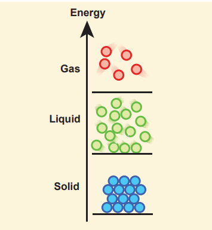
**Figure 7.1** Schematic representations of the transition from solid to liquid to gaseous states with a change in external energy

 
 In addition to the three physical states of matter (solid, liquid, and gas), in extreme environments, matter can exist in other states such as plasma, Bose-Einstein condensates. Additional states, such as quark-gluon plasmas are also believed to be possible. A major part of the atomic matter of the universe is hot plasma in the form of rarefied interstellar medium and dense stars. 

In the study of Newtonian mechanics (Volume 1), we assumed the objects to be either as point masses or perfect rigid bodies (collection of point masses). Both these are idealized models. In rigid bodies, changes in the shape of the bodies are so small that they are neglected. In real materials, when a force is applied on the objects, there could be some deformations due to the applied force. It is very important to know how materials behave when a deforming force is applied.  

## Elastic behaviour of materials
In a solid, interatomic forces bind two or more atoms together and the atoms occupy the positions of stable equilibrium. When a deforming force is applied on a body, its atoms are pulled apart or pushed closer. When the deforming force is removed, interatomic forces of attraction or repulsion restore the atoms to their equilibrium positions. **If a body regains its original shape and size after the removal of deforming force, it is said to be elastic and the property is called elasticity. The force which changes the size** or shape of a body is called a deforming force. 
**Examples:** Rubber, metals, steel ropes.

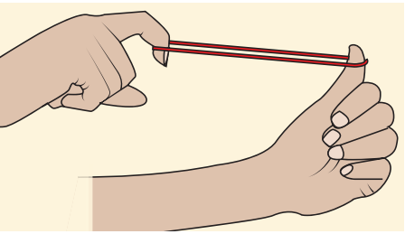
 **Figure 7.2** Elasticity

**Plasticity:** If a body does not regain its original shape and size after removal of the deforming force, it is said to be a plastic body and the property is called plasticity. 
**Example**: Glass

## Stress and strain
**(a) Stress:** When a force is applied, the size or shape or both may change due to the change in relative positions of atoms or molecules. This deformation may not be noticeable to our naked eyes but it exists in the material itself. When a body is subjected to such a deforming force, internal force is developed in it, called as restoring force. The force per unit area is called as stress.


Stress,\sigma = \frac{Force}{Area} = \frac{F}{A}             (7.1)


The SI unit of stress is N m–2 or pascal (Pa) and its dimension is [ML–1T–2\]. Stress is a tensor. 

**1. Longitudinal stress and shearing stress:**
Let us consider a body as shown in Figure 7.3. When many forces act on the system (body), the center of mass (defined in unit 5) remains at rest. However, the body gets deformed due to these forces and so the internal forces appear. Let ∆A be the cross sectional area of the body. The parts of the body on two sides of ∆A exert internal forces \vec{F}  and  -\vec{F}  on each other which is due to deformation. The force can be resolved in two components; F_n  normal to the surface ∆A (perpendicular to the surface) and F_t  tangential to the surface ∆A (tangent to the surface). The normal stress or longitudinal stress \sigma_n  over the area is defined as

 \sigma_n = \frac{F_n}{\Delta A}


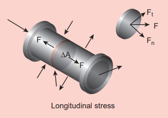
**Figure 7.3** Longitudinal stress

Similarly, the tangential stress or shearing stress σt over the area is defined as

\sigma_t = \frac{F_t}{\Delta A} 


Longitudinal stress can be classified into two types, tensile stress and compressive stress.

**Tensile stress** 
Internal forces on the two sides of ∆A may pull each other, i.e., it is stretched by equal and opposite forces. Then, the longitudinal stress is called tensile stress.
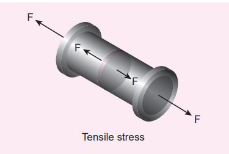

**Figure 7.4** Tensile stress

**Compressive stress** 
When forces acting on the two sides of ∆A push each other, ∆A is pushed by equal and opposite forces at the two ends. In this case, ∆A is said to be under compression. Then, the longitudinal stress is called compressive stress.

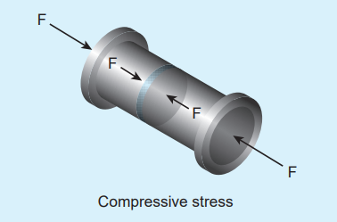

**Figure 7.5** Compressive stress

**(ii) Volume stress** 
This happens when a body is acted by forces everywhere on the surface such that the force at any point is normal to the surface and the magnitude of the force on a small surface area is proportional to the area. For instance, when a solid is immersed in a fluid, the pressure at the location of the solid is P, the force on any area ∆A is


F = P \Delta A 


Where, F is perpendicular to the area. Thus, force per unit area is called volume stress.

\sigma_v = \frac{F}{A} 


which is the same as the pressure.

**(b) Strain:** 
Strain measures how much an object is stretched or deformed when a force is applied. Strain deals with the fractional change in the size of the object, in other words, strain measures the degree of deformation. As an example, in one dimension, consider a rod of length _L_ when it stretches to a new length ∆L then

Strain, \varepsilon = \frac{Change \ in \ size}{Original \ size} = \frac{\Delta L}{L}  (7.2)


ε is a dimensionless quantity and has no unit. Strain is classified into three types.

**(1) Longitudinal strain** 
When a rod of length _L_ is pulled by equal and opposite forces, the longitudinal strain is defined as

 \varepsilon_1 =  \frac{Increase \ in \ length \ of \ therod}{Original \ or \ natural \ length \ of \ therod} = \frac{\Delta L}{L}  (7.3)

Longitudinal strain can be classified into two types 

**(i) Tensile strain:** If the length is increased from its natural length then it is known as tensile strain.

**(ii) Compressive strain:** If the length is decreased from its natural length then it is known as compressive strain.

**(2) Shearing strain** Consider a cuboid as shown in Figure 7.6. Let us assume that the body remains in translational and rotational equilibrium. Let us apply the tangential force F along AD such that the cuboid deforms as shown in Figure 7.6. Hence, shearing strain or shear is  \varepsilon_s 

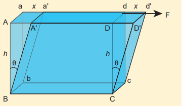

**Figure 7.6** Shearing strain

 \varepsilon_s = \frac{AA'}{BZ} = \frac{x}{h} = \tan \theta         (7.4)  For small angle, tanθ ≈ θ Therefore, shearing strain or shear,  \varepsilon_s = \frac{x}{h} = \theta =Angle \ of \ shear 

**(3) Volume strain** 
If the body is subjected to a volume stress, the volume will change. Let _V_ be the original volume of the body before stress and _V +_ ∆V be the change in volume due to stress. The volume strain which measures the fractional change in volume is


 Volume \ strain, \varepsilon_v = \frac{\Delta V}{V} 
(7.5) 


**Elastic Limit** 
The maximum stress within which the body regains its original size and shape after the removal of deforming force is called the elastic limit. If the deforming force exceeds the elastic limit, the body acquires a permanent deformation. For example, rubber band loses its elasticity if pulled apart too much. It changes its size and becomes misfit to be used again.

## Hooke’s law and its experimental verification

Hooke’s law states that for a small deformation within the elastic limit, the strain produced in a body is directly proportional to the stress that produces it. It can be verified in a simple way by stretching a thin straight wire (stretches like spring) of length L and uniform cross- sectional area A suspended from a fixed point O. A pan and a pointer are attached at the free end of the wire as shown in Figure 7.7 (a). The extension produced on the wire is measured using a vernier scale arrangement. The experiment shows that for a given load, the corresponding stretching force is F and the elongation produced on the wire is ΔL. It is directly proportional to the original length L and inversely proportional to the area of cross section A. A graph is plotted using F on the X- axis and ΔL on the Y- axis. This graph is a straight line passing through the origin as shown in Figure 7.7 (b).

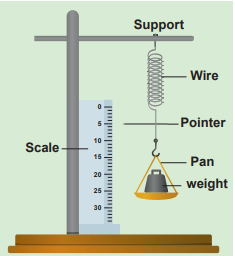

**Figure 7.7 (a) Experimental verification** of Hooke’s law

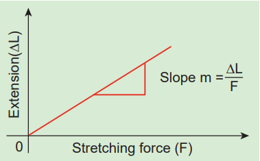

**Figure 7.7** (b) Variation of ∆L with F

Therefore,   
              ∆L = (slope)F 
             

Multiplying and dividing by volume,   
                                      V = A L,
                                     


F(\text{slope}) = \frac{AL}{AL}{\Delta L} 


Rearranging, we get


 \frac{F}{A}  =  (\frac{L}{A(\text{slope})}) \frac{\Delta L}{L} 


Therefore, 


 \frac{F}{A}  ∝  (\frac{\Delta L}{L}) 


Comparing with equation (7.1) and equation (7.2), we get equation (7.5) as σ ∝ ε i.e., the stress is proportional to the strain in the elastic limit.

**Stress–Strain profile curve:** 
The stress versus strain profile is a plot in which stress and strain are noted for each load and a graph is drawn taking strain along the X-axis and stress along the Y-axis. The elastic characteristics of the materials can be analyzed from the stress-strain profile.
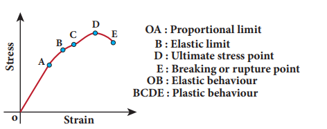

**Figure 7.8 Stress-Strain profile**

**(a) Portion OA:** 
In this region, stress is very small such that stress is proportional to strain, which means Hooke’s law is valid. The point A is called limit _of proportionality_ because above this point Hooke’s law is not valid. The slope of the line OA gives the Young’s modulus of the wire.

**(b) Portion AB:** 
This region is reached if the stress is increased by a very small amount. In this region, stress is not proportional to the strain. But once the stretching force is removed, the wire will regain its original length. This behaviour ends at point B and hence, the point B is known as yield point (elastic limit). The elastic behaviour of the material (here wire) in stress-strain curve is OAB.

**(c) Portion BC:** 
If the wire is stretched beyond the point B (elastic limit), stress increases and the wire will not regain its original length after the removal of stretching force.

**(d) Portion CD:**
 With further increase in stress (beyond the point C), the strain increases rapidly and reaches the point D. Beyond D, the strain increases even when the load is removed and breaks (ruptures) at the point E. Therefore, the maximum stress (here D) beyond which the wire breaks is called _breaking stress_ or _tensile strength. The corresponding point D is known_ as fracture point. The region BCDE represents the plastic behaviour of the material of the wire.

## Moduli of elasticity 
From Hooke’s law, 
            


stress ∝ strain



\frac{\text{stress}}{\text{strain}} = a constant, 


known as modulus of elasticity. Its SI unit is N m–2or pascal and its dimensional formula is ML–1T–2 .  

In this section, we shall define the elastic modulus of a given material. There are three types of elastic modulus.
1. Young’s modulus 
2. Rigidity modulus (or Shear modulus) 
3. Bulk modulus

**Young’s modulus:** 
When a wire is stretched or compressed, then the ratio between tensile stress (or compressive stress) and tensile strain (or compressive strain) is defined as Young’s modulus.

Young \ modulus \ of \ a \ material =  \frac{\text{Tensilestress or compressivestress}}{\text{Tensilestrain or compressivestrain}} 



Y = \frac{\sigma_t}{\epsilon_t}   Or  Y =  \frac{\sigma_c}{\epsilon_c} (7.6)


**EXAMPLE 7.1**
Within the elastic limit, the stretching strain produced in wires A, B, and C due to stress is shown in the figure. Assume the load applied are the same and discuss the elastic property of the material.
Write down the elastic modulus in ascending order.

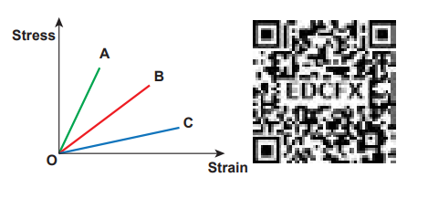

**_Solution_**

Here, the elastic modulus is Young modulus and due to stretching, stress is tensile stress and strain is tensile strain. Within the elastic limit, stress is proportional to strain (obey Hooke’s law). Therefore, it shows a straight line behaviour. So, Young modulus can be computed by taking slope of these straight lines. Hence, calculating the slope for the straight line, we get

Slope of A > Slope of B > Slope of C

Which implies, 

Young modulus of C < Young modulus of B < Young modulus of A

Notice that larger the slope, lesser the strain (fractional change in length). So, the material is much stiffer. Hence, the elasticity of wire A is greater than wire B which is greater than C. From this example, we have understood that Young’s modulus measures the resistance of solid to a change in its length.

**EXAMPLE 7.2**

A wire 10 m long has a cross-sectional area 1.25 × 10–4 m2. It is subjected to a load of 5 kg. If Young’s modulus of the material is 4 × 1010 N m–2, calculate the elongation produced in the wire. Take g = 10 ms–2.

**_Solution_**

We know that  


\frac{F}{A} = Y \cdot \frac{\Delta L}{L} 



 \Delta L = (\frac{F}{A})(\frac{L}{Y}) 



 = (\frac{50}{1.25 \times 10^{-4}})(\frac{10}{4 \times 10^10}) = 10^{-4} m  


**Bulk modulus:** 

The bulk modulus is defined as the ratio of the volume stress to the volume strain.


  Bulk \ modulus, K =
\frac{\text{Normal (Perpendicular) stress or Pressure}}{\text{Volume strain}}


The normal stress or pressure is

 
σₙ = \frac{Fₙ}{ΔA} = Δp


The volume strain is

 
εᵥ = \frac{\Delta V}{V}


Therefore, Bulk modulus is


K = \frac{-σₙ}{εᵥ} = \frac{-ΔP}{\frac{ΔV}{V}}
(7.7)

The negative sign in the equation (7.7) means that when pressure is applied on the body, its volume decreases. Further, the equation (7.7) implies that a material can be easily compressed if it has a small value of bulk modulus. In other words, bulk modulus measures the resistance of solids to change in their volume. For an example, we know that gases can be easily compressed than solids. This means that gases have small value of bulk modulus compared to solids.

**Compressibility** 
The reciprocal of the bulk modulus is called compressibility. It is defined as the fractional change in volume per unit increase in pressure.

From equation (7.7), we can say that the compressibility

 
C = \frac{1}{K} = \frac{-εᵥ}{σₙ} = \frac{-\frac{\Delta V}{V}}{\Delta P} 
(7.8)


Since gases have small value of bulk modulus than solids, their values of compressibility is very high.

 After pumping the air in the cycle tyre, usually we press the cycle tyre to check whether it has enough air. What is checked here is essentially the compressibility of air.
The tyre should be less compressible for its easy rolling

{: style="width: 100%;" }

In fact the rear tyre is less compressible than front tyre for a smooth ride.

**EXAMPLE 7.3**
A metallic cube of side 100 cm is subjected to a uniform force acting normal to the whole surface of the cube. The pressure is 106 pascal. If the volume changes by 1.5 × 10–5 m3, calculate the bulk modulus of the material.

**_Solution_**

By definition,

 
K = \frac{\frac{F}{A}}{\frac{\Delta V}{V}} = \frac{P \cdot V}{\Delta V}



K = \frac{{10^6 \times 1}}{{1.5 \times 10^{-5}}}  =  6.67 \times 10^{10} \, \text{N m}^{-2} 


**Rigidity modulus or shear modulus:** 
The rigidity modulus is defined as the ratio of the shearing stress to the shearing strain.
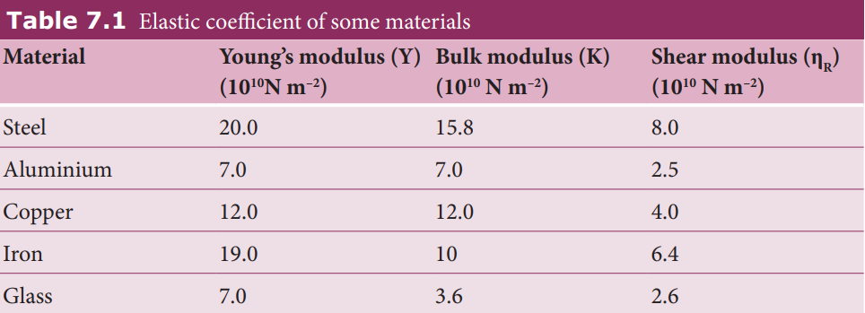


( \eta_R ) = \frac{\text{Shearing stress}}{\text{Angle of shear or shearing strain}} 


The shearing stress is


 σₛ = \frac{\text{Tangential force}}{\text{Area over which it is applied}} = \frac{F_t}{\Delta A}

 
The angle of shear or shearing strain

 
εₛ = \frac{x}{h} = θ


Therefore, Rigidity modulus is 

 
ηR = \frac{\sigma_s}{\varepsilon_s} = \frac{F_t}{\frac{\Delta A}{\frac{x}{h}}} = \frac{F_t}{\Delta A \theta}

(7.9)


Further, the equation (7.9) implies that a material can be easily twisted if it has small value of rigidity modulus. For example, consider a wire twisted through an angle θ, a restoring torque (τ) developed is
 
τ ∝ θ


This means that for a larger torque, wire will twist by a larger amount (angle of shear θ is large). Since the rigidity modulus is inversely proportional to angle of shear, the modulus of rigidity is small. 
For the best understanding, the elastic coefficients of some of the important materials are listed in Table 7.1.

**EXAMPLE 7.4**
A metal cube of side 0.20 m is subjected to a shearing force of 4000 N. The top surface is displaced through 0.50 cm with respect to the bottom. Calculate the shear modulus of elasticity of the metal.

**_Solution_**

Here, L = 0.20 m, F = 4000 N, _x_ = 0.50 cm = 0.005 m and Area A = L2 = 0.04 m2

Therefore,


ηR = \frac{F}{A} \times \frac{L}{X} = \frac{4000}{0.04} \times \frac{0.20}{0.005} = 4 \times 10^6 \, \text{N m}^{-2}


 
## Poisson’s ratio
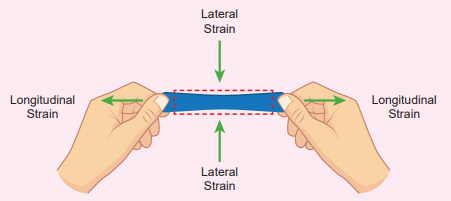

**Figure 7.9** Lateral strain versus longitudinal strain

Suppose we stretch a wire, its length increases (elongation) but its diameter decreases (contraction). Similarly, when we stretch a rubber band (elongation), it becomes noticeably thinner (contraction). That is, deformation of the material in one direction produces deformation in another direction. To quantify this, French Physicist S.D. Poisson proposed a ratio, known as Poisson’s ratio. **It is defined as the ratio of relative contraction (lateral strain) to relative expansion (longitudinal strain). It is denoted by the symbol µ.**  

 
Poisson's\  ratio,  \mu = \frac{\text{Lateral strain}}{\text{Longitudinal strain}} 
(7.10)


Consider a wire of length _L_ with diameter _D_. Due to applied force, wire stretches and let the increase in length be _l_ and decrease in diameter be d. Then

 
 \mu = -\frac{d}{D} \div \frac{l}{L} = -\frac{L}{l} \times \frac{d}{D} 


Negative sign indicates the elongation is along longitudinal and the contraction along lateral dimension. Further, notice that it is the ratio between quantities of the same dimension. So, Poisson’s ratio has no unit and no dimension (dimensionless number). The Poisson’s ratio values of some of the materials are listed in Table 7.2.

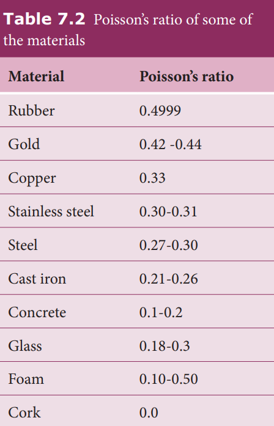

## Elastic energy 

When a body is stretched, work is done against the restoring force (internal force). This work done is stored in the body in the form of elastic energy. Consider a wire whose un-stretch length is L and area of cross section is A. Let a force produce an extension _l_ and further assume that the elastic limit of the wire has not been exceeded and there is no loss in energy. Then, the work done by the force F is equal to the energy gained by the wire. The work done in stretching the wire by dl, dW = F dl The total work done in stretching the wire from 0 to l is

 
W = ∫₀ˡ F dl (7.11) 

 

From Young’s modulus of elasticity,


Y = \frac{F}{A} \times \frac{L}{l}  ⇒  {F} = \frac{YAl}{L}  (7.12)


Substituting equation (7.12) in equation (7.11), we get


W = ∫₀ˡ \frac{YAl}{L} dl  


Since l is the dummy variable in the integration, we can change l to lʹ (not in limits). Therefore


W =  ∫₀ˡ \frac{YAlʹ}{L} dlʹ  =  \frac{YA}{L} ( \frac{lʹ^2}{2}) ⎷₀ˡ =  \frac{YA}{L} \ \frac{l^2}{2}  =  \frac{1}{2} \ (\frac{YAl}{L})l  =  \frac{1}{2}Fl 



W =  \frac{1}{2}Fl  = Elastic potential energy 


The energy per unit volume is called energy density which is is given by,


u =  \frac{Elastic\ potential\ energy}{Volume}  = \frac{1 }{\frac{2}{AL}} Fl 



= \frac{1}{2} \ \frac{F}{A}
\frac{l}{L}  =  \frac{1}{2} \times Stress \times Strain  (7.13)


**EXAMPLE 7.5** A wire of length 2 m with the area of cross- section 10–6 m2 is used to suspend a load of 980 N.
Calculate 1. the stress developed in the wire 2. the strain 3. the energy stored.
Given: Y=12 × 1010N m−2.

 **_Solution_**

1. stress


 stress =  \frac{F}{A}  =  \frac{980}{10^{-6}}  = 98 \times 10^7 N m^{-2}


2. strain stress 

 strain \ stress =  \frac{stress}{Y}  =  \frac{98 \times 10^7}{12 \times 10^{10}}  
=  8.17 \times 10^{-3} (no unit) 

3. Since volume


 Since \ volume = 2 \times 10^{-6}m ^{3} ,



Energy =  \frac{1}{2} (\ {stress} \times {strain}) \times volume 



= \frac{1}{2} (\ {98}\times {10}^{-3}) \times (\ {8.17}\times {10}^{-3}) \times{2} \times{10}^{-6}  =  {8}J


## Applications of elasticity
 The mechanical properties of materials play a very vital role in everyday life. The elastic behaviour is one such property which especially decides the structural design of the columns and beams of a building. As far as the structural engineering is concerned, the amount of stress that the design could withstand is a primary safety factor. A bridge has to be designed in such a way that it should have the capacity to withstand the load of the flowing traffic, the force of winds, and even its own weight. The elastic behaviour or in other words, the bending of beams is a major concern over the stability of the buildings or bridges. For an example, to reduce the bending of a beam for a given load, one should use the material with a higher value of Young’s modulus of elasticity. It is obvious from Table 7.1 that the Young’s modulus of steel is greater than aluminium or copper. Iron comes next to steel. This is the reason why steel is mostly preferred in the design of heavy duty machines and iron rods in the construction of buildings.

 
 Which one is more elastic? Rubber or steel? Steel is more elastic than rubber. If an equal stress is applied to both steel and rubber, the steel produces less strain. So the Young’s modulus is higher for steel than rubber. The object which has higher Young’s modulus is more elastic. 

