# SURFACE TENSION

## Intermolecular forces

Some liquids do not mix together due to their physical properties such as density, surface tension force, etc. For example, water and kerosene do not mix together. Mercury does not wet the glass but water sticks to it. Water rises up to the leaves through the stem. They are mostly related to the free surfaces of liquids. Liquids have no definite shape but have a definite volume. Hence they acquire a free surface when poured into a container. Therefore, the surfaces have some additional energy, called as surface energy. The phenomenon behind the above fact is called surface tension. Laplace and Gauss developed the theory of surface and motion of a liquid under various situations.

The molecules of a liquid are not rigidly fixed like in a solid. They are free to move about. The force between the like molecules which holds the liquid together is called ‘_cohesive force_’. When the liquid is in contact with a solid, the molecules of these solid and liquid will experience an attractive force which is called ‘_adhesive force_’. These molecular forces are effective only when the distance between the molecules is very small about 10–9 m (i.e., 10 Å). The distance through which the influence of these molecular forces can be felt in all directions constitute a range and is called _sphere of influence. The forces outside this_ range are rather negligible. Consider three different molecules A, B, and C in a given liquid as shown in Figure 7.20. Let a molecule ‘A’ be considered well inside the liquid within the sphere of influence. Since this molecule interacts with all other molecules in all directions, the net force experienced by A is zero. Now consider a molecule ‘B’ in which three-fourth lies below the liquid surface and one–fourth on the air. Since B has more molecules towards its lower side than the upper side, it experiences a net force in the downward direction. In a similar way, if another molecule ‘C’ is chosen on the liquid surface (i.e, upper half in air and lower half in liquid),  it experiences a maximum downward force due to the availability of more number of liquid molecules on the lower part. Hence it is obvious that all molecules of the liquid that falls within the molecular range inside the liquid interact with the molecule and hence experience a downward force.

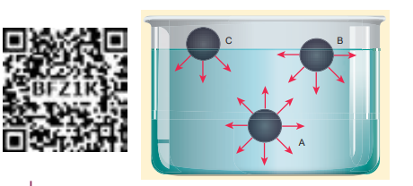
**Figure 7.20 Molecules at different levels of liquid**

When any molecule is brought towards the surface from the interior of the liquid, work is done against the cohesive force among the molecules of the surface. This work is stored as potential energy in molecules. So the molecules on the surface will have greater potential energy than that of molecules in the interior of the liquid. But for a system to be under stable equilibrium, its potential energy (or surface energy) must be a minimum. Therefore, in order to maintain stable equilibrium, a liquid always tends to have a minimum number of molecules. In other words, the liquid tends to occupy a minimum surface area. This behaviour of the liquid gives rise to surface tension.

**Examples for surface tension.** Water bugs and water striders walk on the surface of water (Figure 7.21). The water molecules are pulled inwards and the surface of water acts like a springy or stretched membrane. This balance the weight of water bugs and enables them to walk on the surface of water. We call this phenomenon as surface tension.

**Figure 7.21** Water striders can walk on water because of the surface tension of water

The hairs of the painting brush cling together when taken out of water. This is because the water films formed on them tends to contract to a minimum area (Figure 7.22).
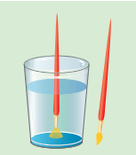

**Figure 7.22**Painting brush hairs cling together due to surface tension

**Activity**

**Needle floats on water surface** Take a greased needle of steel on a piece of blotting paper and place it gently over the water surface. Blotting paper soaks water and soon sinks down but the needle keeps floating.
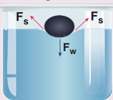

**Figure 7.23** Floating needle

The floating needle causes a little depression; the forces Fs due to the surface tension of the curved surface are inclined as shown in Figure 7.23. The vertical components of these two forces support the weight of the needle. Now add liquid soap to the water and stir it. We find that the needle sinks.

**Activity**

Take a plastic sheet and cut out a piece in the shape of a boat (Figure 7.24). A tapering and smooth front with a notch at the back is suggested. Put a piece of camphor into the notch of the boat. Gently release the boat on the surface of the water and we find that the boat is propelled forward when the camphor dissolves. The surface tension is lowered, as the camphor dissolves and produces a difference in surface tension in the water nearby the notch. This causes the water to flow away from the back of the boat, which moves the boat forward.

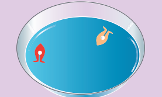

**Figure 7.24** Camphor boat

## Factors affecting the surface tension of a liquid

Surface tension for a given liquid varies in following situations 

1. **_The prsence of any contamination or impurities_** considerably affects the force of surface tension depending upon the degree of contamination.
2. **_The presence of dissolved substances_** can also affect the value of surface tension. For example, a highly soluble substance like sodium chloride (_NaCl_) when dissolved in water (H_2o) increases the surface tension of water. But the sparingly soluble substance like phenol or soap solution when mixed in water decreases the surface tension of water.
3. **_Electrification_** affects the surface tension. When a liquid is electrified, surface tension decreases. Since external force acts on the liquid surface due to electrification, area of the liquid surface increases which acts against the contraction phenomenon of the surface tension. Hence, it decreases.
4. **_Temperature_** plays a very crucial role in altering the surface tension of a liquid. Obviously, the surface tension decreases linearly with the rise of temperature. For a small range of temperature, the surface tension at T_t \ at \ t ºC \ is \ T_t = T_0 (1− α t)  Where, T_0is the surface tension at temperature 0ºC and _α_ is the temperature coefficient of surface tension. It is to be noted that at the critical temperature, the surface tension is zero as the interface between liquid and vapour disappear. For example, the critical temperature of water is 374ºC. Therefore, the surface tension of water is zero at that temperature. van der Wall suggested the important relation between the surface tension and the critical temperature as


T_t = T_0 ({1}-\frac{t}{t_c})^\frac{3}{2}


Generalizing the above relation, we get


T_t = T_0 ({1}-\frac{t}{t_c})^{n}


which gives more accurate value. Here, _n_ varies for different liquids and t and t_c denote  the temperature and critical temperature in absolute scale (Kelvin scale) respectively.

## Surface energy (S.E.) and surface tension (S.T.)

**Surface Energy**

 Consider a sample of liquid in a container. A molecule inside the liquid is being pulled in all direction by other molecules that surround it. However, near the surface, a molecule is pulled down only by the molecules below it and there is a net downward force. As a result, the entire surface of the liquid is being pulled inward. The liquid surface thus tends to have the least surface area. To increase the surface area, some molecules are brought from the interior to the surface. For this reason, work has to be done against the forces of attraction. The amount of work done is stored as potential energy. Thus, the molecules lying on the surface possess greater potential energy than other molecules. This excess energy per unit area of the free surface of the liquid is called ‘_surface energy_’. In other words, the work done in increasing the surface area per unit area of the liquid against the surface tension force is called the surface energy of the liquid.



Surface\ energy  = \frac{work\ done\ in\ increasing\  the\ surface\ area}{increase\ in\ surface\ area}



= \frac{W}{∆A}     (7.26)


It is expressed in J m–2 or N m–1.

**Surface tension** 

The surface tension of a liquid is defined as the force per unit length of the liquid or the energy per unit area of the surface of a liquid


T = \frac{F}{l}     (7.27)


The SI unit and dimensions of T are N m−1 and M T-2, respectively.

**Relation between surface tension and surface energy:** 

Consider a rectangular frame of wire ABCD in a soap solution (Figure 7.25). Let AB be the movable wire. Suppose the frame is dipped in soap solution, soap film is formed which pulls the wire AB inward due to surface tension. Let _F_ be the force due to surface tension, then 
F = (2T)l

here, 2 is introduced because it has two free surfaces. Suppose AB is moved by a small distance Δx to new a position _A_'_B_'. Since the area increases, some work has to be done against the inward force due to surface tension.


Work\  done = Force × distance = (2T\ l) (Δx)


Increase in area of the film 

ΔA = (2l) (Δx)=2l Δx 


Therefore,


surface\ energy  = \frac{work\ done}{
increase\ in\ surface\ area}    



= \frac{2TlΔx}{2l Δx} =T   (7.28)   


Hence, the surface energy per unit area of a surface is numerically equal to the surface tension.
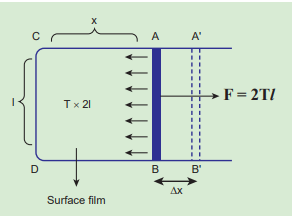

**Figure 7.25** A horizontal soap film on arectangular frame of wire ABCD

**Note:** It should be remembered that a liquid drop has only one free surface. Therefore, the surface area of a spherical drop of radius r is equal to 4πr2, whereas, a bubble has two free surfaces and hence the surface area of a spherical bubble is equal to 2 × 4πr2.

**EXAMPLE 7.10**
Let 2.4 × 10-4J of work is done to increase the area of a film of soap bubble from 50 cm2 to 100 cm2. Calculate the value of surface tension of soap solution.

**_Solution_**

A soap bubble has two free surfaces therefore increase in surface area ΔA =  A_2  -A_1  = 2(100–50) × 10–4m2 = 100 × 10–4m2.

Since, work done 
W = T × ∆A ⇒ T = \frac{W}{∆A} 


= \frac{2.4\times{10}^{-4}J}{100 \times {10}^{-4}m^{2}} = {2.4}\times {10}^{-2}N m^{-1}


## Angle of contact

When the free surface of a liquid comes in contact with a solid, then the surface of the liquid becomes curved at the point of contact. Whenever the liquid surface becomes a curve, then the angle between the two medium (solid-liquid interface) comes in the picture. For an example, when a glass plate is dipped in water with sides vertical as shown in figure, we can observe that the water is drawn up to the plate. In the same manner, instead of water the glass plate is dipped in mercury, the surface is curved but now the curve is depressed as shown in Figure 7.29
**The angle between the tangent to the liquid surface at the point of contact and the solid surface inside the liquid is known as the _angle of contact between the solid and the liquid_.** It is denoted by θ. Its value is different at interfaces of different pairs of solids and liquids. In fact, it is the factor which decides whether a liquid will spread on the surface of a chosen solid or it will form droplets on it.
Let us consider three interfaces such as liquid-air, solid-air and solid-liquid with reference to the point of contact ‘O’ and the interfacial surface tension forces T_{sa}, 
T_{sl}and T_{la}
on the respective interfaces as shown in Figure 7.26.
 
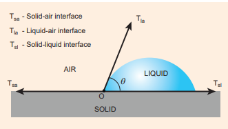

**Figure 7.26** Angle of contact of a liquid

Since the liquid is stable under equilibrium, the surface tension forces between the three interfaces must also be in equilibrium. 
Therefore,


T_{sa} = T_{la}\ cosθ + T_{sl} ⇒ cosθ = \frac{{T_{sa}}-{T_{sl}}}{T_{la}}  (7.29)
,


 

From the above equation, there are three different possibilities which can be discussed as follows.

1. If T_{sa}
 > T_{sl}
 and T_{sa}
 - T_{sl}
 > 0
 (water-plasticinterface), then the angle of contact θ is acute angle (θ less than 90°) as cosθ is positive.
2.  If T_{sa}
 > T_{sl}
 and T_{sa}
 - T_{sl}
  < 0
(water-leaf interface), then the angle of contact is  obtuse angle (θ less than 180°) as cosθ is negative.
3. If T_{sa}
 > T_{la}
+ T_{sl}
 
then there will be no equilibrium and liquid will spread over the solid.

Therefore, the concept of angle of contact between the solid-liquid interface leads to some practical applications in real life. For example, soaps and detergents are wetting agents. When they are added to an aqueous solution, they will try to minimize the angle of contact and in turn penetrate well in the cloths and remove the dirt. On the other hand, water proofing paints are coated on the outer side of the building so that it will enhance the angle of contact between the water and the painted surface during the rainfall.

## Excess of pressure inside a liquid drop, a soap bubble, and an air bubble
As it is discussed earlier, the free surface of a liquid becomes curved when it has contact with a solid. Depending upon the nature of liquid-air or liquid-gas interface, the magnitude of interfacial surface tension varies. In other words, as a consequence of surface tension, the above such interfaces have energy and for a given volume, the surface will have a minimum energy with least area. Due to this reason, the liquid drop becomes spherical (for a smaller radius). When the free surface of the liquid is curved, there is a difference in pressure between the inner and outer the side of the surface (Figure 7.27).

1. When the liquid surface is plane, the forces due to surface tension (_T, T_) act tangentially to the liquid surface in opposite directions. Hence, the resultant force on the molecule is zero. Therefore, in the case of a plane liquid surface, the pressure on the liquid side is equal to the pressure on the vapour side.

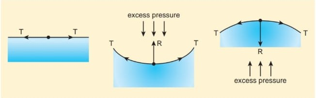

**Figure7.27** Excess of pressure across a liquid

2. When the liquid surface is curved, every molecule on the liquid surface experiences forces ( F_T
,F_T
) due to surface tension along the tangent to the surface. Resolving these forces into rectangular components, we find that horizontal components cancel out each other while vertical components get added up. Therefore, the resultant force normal to the surface acts on the curved surface of the liquid. Similarly, for a convex surface, the resultant force is directed inwards towards the centre of curvature, whereas the resultant force is directed outwards from the centre of curvature for a concave surface. Thus, for a curved liquid surface in equilibrium, the pressure on its concave side is greater than the pressure on its convex side.

**Excess of pressure inside a bubble and a liquid drop:** 

The small bubbles and liquid drops are spherical because of the forces of surface tension. The fact that a bubble or a liquid drop does not collapse due to the combined effect indicates that the pressure inside a bubble or a drop is greater than that outside it.

**1) Excess of pressure inside air bubble in a liquid.**

Consider an air bubble of radius R inside a liquid having surface tension T as shown in Figure 7.28 (a). Let P_1
and P_2
 be the pressures outside and inside the air bubble, respectively. Now, the excess pressure inside the air bubble is ΔP = P_2 − P_1
.

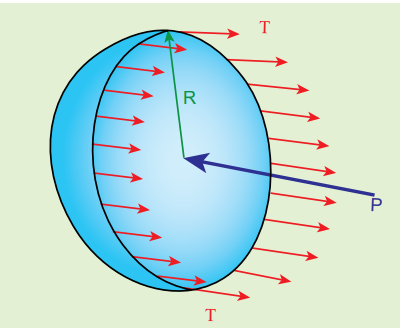

**Figure 7.28.** (a) Air bubble

In order to find the excess pressure inside the air bubble, let us consider the forces acting on the air bubble. For the hemispherical portion of the bubble, considering the forces acting on it, we get,

1. The force due to surface tension acting towards right around the rim of length 2πR is  F_T = 2πRT

2. The force due to outside pressure P1 is to the right acting across a cross sectional area of πR^{2}
 is F_{P_1}
 =  P_1π R^{2}

3. The force due to pressure  P_2inside the bubble, acting to the left is  F_{P_2}
 =  P_2π R^{2}
. 

As the air bubble is in equilibrium under the action of these forces, 

F_{P_2} = F_T + F_{P_1}


P_2π R^{2} = 2πRT + P_1π R^{2} 


⇒ (P_2 − P_1)πR^{2} = 2πRT 

 


Excess\  pressure\  is\ ∆P = P_2 - P_1 = \frac{2T}{R}  (7.30)
 

**2) Excess pressure inside a soap bubble** 

Consider a soap bubble of radius _R_ and the surface tension of the soap bubble be _T_ as shown in Figure 7.28 (b). A soap bubble has two liquid surfaces in contact with air, one inside the bubble and other outside the bubble. Therefore, the force on the soap bubble due to surface tension is 2×2πRT. The various forces acting on the soap bubble are,
1. Force due to surface tension F_T = 4πRT   towards right
2. Force due to outside pressure, F_{P_1} = P_1πR^{2} towards right
3. Force due to inside pressure, F_{P_2} = F_T + F_{P_1}  towards left 

As the bubble is in equilibrium, 


P_2πR^{2} = 4πRT + P_1πR^{2}



⇒ (P_2 − P_1)πR^{2} = 4πRT



Excess\  pressure\  is\  ∆P = P_2 - P_1 = \frac{4T}{R} (7.31)  


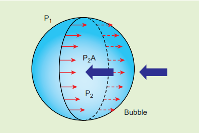

**Figure7.28** (b) Soap bubble

**3) Excess pressure inside the liquid drop** Consider a liquid drop of radius R and the surface tension of the liquid is T as shown in Figure 7.28 (c).

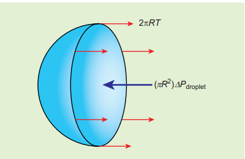

**Figure7.28** (c) Liquid drop

The various forces acting on the liquid drop are,
1. Force due to surface tension  F_T = 2πRT  towards right
2. Force due to outside pressure,  F_{P_1} = P_1πR^{2}  towards right 
3. Force due to inside pressure, F_{P_2} = P_2πR^{2}   towards left

As the drop is in equilibrium,  F_{P_2} = F_T + F_{P_1} 


P_2πR^{2} = 2πRT + P_1πR^{2} 



⇒ (P_2 − P_1)πR^{2} = 2πRT



Excess\  pressure\ is\ ∆P = P_2 - P_1 = \frac{2T}{R} (7.32)


  The smaller the radius of a liquid drop, the greater is the excess of pressure inside the drop. It is due to this excess of pressure inside, the tiny fog droplets are rigid enough to behave like solids. When an ice-skater skate over the surface of the ice, some ice melts due to the pressure exerted by the sharp metal edges of the skates, the tiny droplets of water act as rigid ball- bearings and help the skaters to run along smoothly.

**EXAMPLE 7.11**
If excess pressure is balanced by a column of oil (with specific gravity 0.8) 4 mm high, where R = 2.0 cm, find the surface tension of the soap bubble.

**_Solution_**

The excess of pressure inside the soap bubble is 
∆P = P_2 - P_1 = \frac{4T}{R} 


But

 ∆P = P_2 - P_1\  ρgh ⇒ ρgh = \frac{4T}{R}


⇒ Surface tension,


 T = \frac{ρghR}{4} =\frac{({800}) \times ({9.8})({4 \times {10}^{-3}}) \times ({2 \times {10}^{-2}})}{4} 
,


 T = 15.68 \times {10}^{-2} N m^{-1}


## Capillarity

The word ‘capilla’ means hair in Latin. If the tubes were hair thin, then the rise would be very large. It means that the tube having a very small diameter is called a ‘capillary tube’. When a glass capillary tube open at both ends is dipped vertically in water, the water in the tube will rise above the level of water in the vessel. In case of mercury, the liquid is depressed in the tube below the level of mercury in the vessel (shown in Figure 7.29). In a liquid whose angle of contact with solid is less than 90°, suffers capillary rise. On the other hand, in a liquid whose angle of contact is greater than 90°, suffers capillary fall (Table 7.4). The rise or fall of a liquid in a narrow tube is called capillarity or capillary action. Depending on the diameter of the capillary tube, liquid rises or falls to different heights.
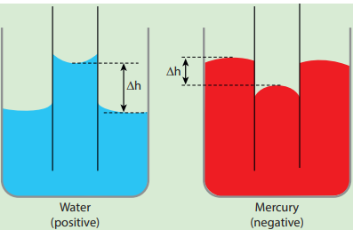

**Figure 7.29** Capillary rise or fall

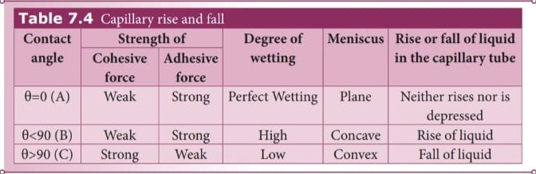

**Table 7.4** Capillary rise and fall **Contact**

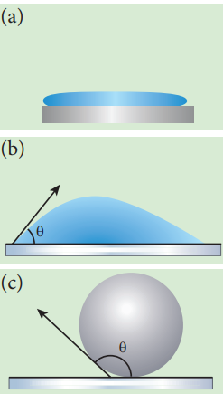

**Figure 7.30** (a) water on silver surface (b) glass plate on water (c) glass on mercury

**Practical applications of capillarity** 

- Due to capillary action, oil rises in the cotton within an earthen lamp. Likewise, sap rises from the roots of a plant to its leaves and branches. 
- Absorption of ink by a blotting paper 
- Capillary action is also ess ntial for the tear fluid from the eye to drain constantly. 
- Cotton dresses are preferred in summer because cotton dresses have fine pores which act as capillaries for sweat.

## Surface Tension by capillary rise method
The pressure difference across a curved liquid-air interface is the basic factor behind the rising up of water in a narrow tube (influence of gravity is ignored). The capillary rise is more dominant in the case of very fine tubes. But this phenomenon is the outcome of the force of surface tension. In order to arrive a relation between the capillary rise (_h_) and surface tension (_T_). 

consider a capillary tube which is held vertically in a beaker containing water; the water rises in the capillary tube to a height _h_ due to surface tension (Figure 7.31). 

The surface tension force 
 F_T, acts along the tangent at the point of contact downwards and its reaction force upwards. Surface tension _T_, is resolved into two components 1. Horizontal component _T_ sinθ and 2. Vertical component _T_ cosθ acting upwards, all along the whole circumference of the meniscus.

Total upward force 
= (_T_ cosθ) (2πr) = 2πrT cosθ

where θ is the angle of contact, _r_ is the radius of the tube. Let ρ be the density of water and _h_ be the height to which the liquid rises inside the tube. Then,


the\  volume\  of


liquid\  column\  in


liquid\  column\  in



volume\  of\ the


liquid\  column\  of\ radius\ r


height\  h



and\ height\ r - Volume\ of\ the


hemisphere\ of\ radius\ r


**Figure 7.31** Capillary rise by surface tension


V = πr^{2}h + (πr^{2} \times {r} - \frac{2}{3}πr^{3}) ⇒ V = πr^{2}h + \frac{1}{3}πr^{3}


The upward force supports the weight of the liquid column above the free surface, therefore,


2πrT cosθ= πr^{2}({h}+\frac{1}{3}r)ρg ⇒ T =
\frac {r({h}+\frac{1}{3}r)ρg} {2cosθ} 


If the capillary is a very fine tube of radius(i.e., radius is very small) then \frac{r}{3} 
can be neglected when it is compared to the height h. Therefore,


T =\frac {rρgh}{2cosθ}  (7.33)



h =\frac {2Tcosθ}{rρg}  ⇒ h ∝  \frac{1}{r} (7.34)


This implies that the capillary rise (h) is inversely proportional to the radius (_r_) of the tube. i.e, the smaller the radius of the tube greater will be the capillarity.

**EXAMPLE 7.12**
Water rises in a capillary tube to a height of 2.0cm. How much will the water rise through another capillary tube whose radius is one-third of the first tube? 

**_Solution_**
From equation (7.34), we have

h ∝  \frac{1}{r} ⇒ hr = constant 


Consider two capillary tubes with radius  r_1  and  r_2  which on placing in a liquid, capillary rises to height  h_1  and  h_2 , respectively. Then,


h_1 r1 = h_2 r_2 = constant



⇒ h_2  = \frac{{h_1}{r_1}}{r_2} = \frac{({2} \times {10}^{-2}m) \times r}{\frac{2}{3}} ⇒ h_2 = {6} \times {10}^{-2}m


**EXAMPLE 7.13** Mercury has an angle of contact equal to 140° with soda lime glass. A narrow tube of radius 2 mm, made of this glass is dipped in a trough containing mercury. By what amount does the mercury dip down in the tube relative to the liquid surface outside? Surface tension of mercury _T_\=0.456 N m–1; Density of mercury ρ = 13.6 × 103 kg m–3

**_Solution_**

Capillary descent, cos140 = cos(90+50) –sin50 = –0.7660


h =\frac {2Tcosθ}{rρg}= \frac{{2 \times ({0.456 Nm^{-1}})}({cos 140°})}    {({2 \times{10}^{-3}m})\ ({13.6 \times {10}^{3}}) ({9.8 ms^{-2}})}



= \frac{2 \times {0.456} \times ({-0.7660})} {2 \times{13.6} \times {9.8}}



= \frac{-0.6986} {266.56} = {-2.62}\times{10}^{-3}m


where, negative sign indicates that there is fall of mercury (mercury is depressed) in glass tube.

## Applications of surface tension

- Mosquitoes lay their eggs on the surface of water. To reduce the surface tension of water, a small amount of oil is poured. This breaks the elastic film of water surface and eggs are killed by drowning. 
- Chemical engineers must finely adjust the surface tension of the liquid, so it forms droplets of designed size and so it adheres to the surface without smearing. This is used in desktop printing, to paint automobiles and decorative items. 
- Specks of dirt get removed when detergents are added to hot water while washing clothes because surface tension is reduced. 
- A fabric can be made waterproof, by adding suitable waterproof material (wax) to the fabric. This increases the angle of contact.

  

