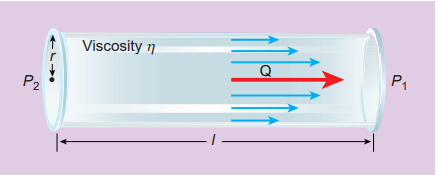
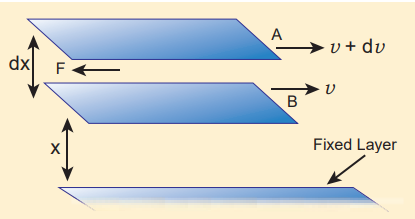
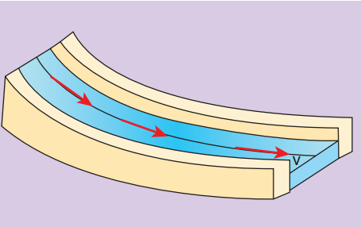
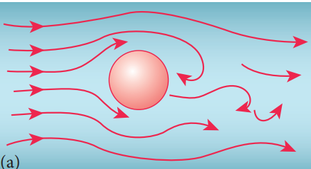
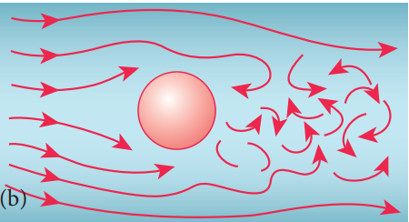
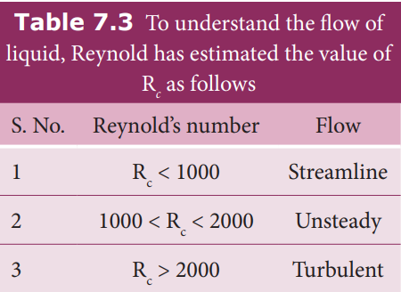
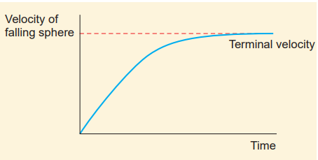
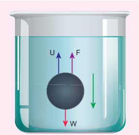

# VISCOSITY

## Introduction

In section 7.3, the behaviour of fluids at rest is discussed. Successive discussions will bring out the influence of fluid motion on different properties. A fluid in motion is a complex phenomenon as it possesses potential, kinetic, and gravitational energy besides causing friction viscous forces to come into play. Therefore, it is necessary to consider the case of an ideal liquid to simplify the task. An ideal liquid is incompressible (i.e., bulk modulus is infinity) and in which no shearing forces can be maintained (i.e., the coefficient of viscosity is zero). 

Most of the fluids offer resistance towards motion. A frictional force acts at the contact surface when a fluid moves relative to a solid or when two fluids move relative to each other. This resistance to fluid motion is similar to the friction produced when a solid moves on a surface. The internal friction existing between the layers of a moving fluid is viscosity. So, viscosity is defined as the property of a fluid to oppose the relative motion between its layers.

**Activity:**

Consider three steel balls of the same size, dropped simultaneously in three tall jars each filled with air, water, and oil respectively. It moves easily in air, but not so easily in water. Moving in oil would be even more difficult. There is a relative motion produced between the different layers of the liquid by the falling ball, which causes a viscous force. This frictional force depends on the density of the liquid.This property of a moving fluid to oppose the relative motion between its layers is called viscosity.

**Cause of viscosity:**

Consider a liquid flowing over a horizontal surface with two neighboring layers. The upper layer tends to accelerate the lower layer and in turn, the lower layer tends to retard the upper layer. As a result, a backward tangential force is set-up. This tends to destroy the relative motion. This accounts for the viscous behaviour of fluids.

**Figure 7.14** Viscosity

**Coefficient of viscosity:**

 Consider a liquid flowing steadily over a horizontal fixed layer (Figure 7.15). The velocities of the layers increase uniformly as we move away from the fixed layer. Consider any two parallel layers A and B. Let _v_ and _v + dv_ be the velocities of the neighboring layers at distances _x_ and _x + dx_ respectively from the fixed layer.

 

**Figure 7.15** Flow of liquid over the horizontal layers

The force of viscosity F acting tangentially between two layers is given by Newton’s First laws. This force is proportional to (i) area A of the liquid and (ii) the velocity gradient \frac{dv}{dx}



F ∝ A and F∝ \frac{dv}{dx}



⇒ F = −ηA \frac{dv}{dx}(7.20)

Where the constant of proportionality η is called the coefficient of viscosity of the liquid and the negative sign implies that the force is frictional and it opposes the relative motion. The dimensional formula for coefficient of viscosity is [ML-1 T-1]

**Note:**
Viscosity is similar to friction. The kinetic energy of the substance is dissipated as heat energy.

**EXAMPLE 7.9**
A metal plate of area 2.5×10–4 m2 is placed on a 0.25×10–3m thick layer of castor oil. If a force of 2.5 N is needed to move the plate with a velocity 3×10–2ms–1, calculate the coefficient of viscosity of castor oil.

Given: A=2.5×10–4 m2,dx= 0.25×10–3m, F\=2.5 N and dv=3×10–2ms–1

**_Solution_**


⇒ F = −ηA \frac{dv}{dx}(7.20)



In \ magnitude, \ η = \frac{F}{A} \frac{dv}{dx}



= \frac{2.5N}{2.5 \times {10}^{-2}m^{2}}



= {0.083} \times {10}^{3} Nm^{-2}s


## Streamlined flow
The flow of fluids occurs in different ways. It can be a steady or streamlined flow, unsteady or turbulent flow, compressible or incompressible flow or even viscous or non-viscous flow. For example, consider a calm flow of water through a river. Careful observation reveals that the velocity of water at different locations of the river is quite different. It is almost faster at the center and slowest near the banks. However, the velocity of the particle at any point is constant. For better understanding, assume that the velocity of the particle is about 4 meter per second at the center of the river. Hence it will be of the same value for all other particles crossing through this point. In a similar way, if the velocity of the particle flowing near the bank of the river is 0.5 meter per second, then the succeeding particles flowing through it will have the same value.
**When a liquid flows such that each particle of the liquid passing through a point moves along the same path with the same velocity as its predecessor then the flow of liquid is said to be a streamlined _flow. It is also referred to as steady or_** laminar flow. The actual path taken by the particle of the moving fluid is called a streamline, which is a curve, the tangent to which at any point gives the direction of the flow of the fluid at that point as shown in Figure 7.16. It is named so because the flow looks like the flow of a stream or river under ideal conditions.

**If we assume a bundle of streamlines having the same velocity over any cross section perpendicular to the direction of flow then such bundle is called a ‘tube of _flow_.**  

Thus, it is important to note that any particle in a tube of flow always remains in the tube throughout its motion and cannot mix with liquid in another tube. Always the axis of the tube of flow gives the streamline. The streamlines always represent the trajectories of the fluid particles. The flow of **fluid is streamlined up to a certain velocity called critical velocity. This means a steady** flow can be achieved at low flow speeds below the critical speed.

## Turbulent flow

When the speed of the moving fluid exceeds the critical speed vc, the motion becomes turbulent. In this case, the velocity changes both in magnitude and direction from particle to particle and hence the individual particles do not move in a streamlined path. Hence, the path taken by the particles in turbulent flow becomes erratic and whirlpool-like circles called eddy current or eddies (Figure 7.17 (a) and (b)). The flow of water just behind a boat or a ship and the air flow behind a moving bus are a few examples of turbulent flow.

**Figure 7.17 (a) turbulent flow around a** sphere (when v = vc) (b) turbulent flow around a sphere (when _v **>** vc_**)**

The distinction between the two types of motion can be easily demonstrated by injecting a jet of ink axially in a wide tube through which water flows. When the velocity of the fluid is small, the ink will move in a straight line path. Conversely, when the velocity is increased beyond a certain value, the ink will spread out showing the disorderliness and hence the motion becomes turbulent. The zig-zag motion results in the formation of eddy currents and as a consequence, much energy is dissipated.

## Reynold’s number
 We have learnt that the flow of a fluid becomes steady or laminar when the velocity of flow is less than the critical velocity vc otherwise, the flow becomes turbulent. Osborne Reynolds (1842-1912) formulated an equation to find out the nature of the flow of fluid, whether it is streamlined or turbulent.


Rc = \frac{ρvD}{η} (7.21)


It is a dimensionless number called ‘_Reynold’s number_’. It is denoted by the symbol Rc or K. In the equation, ρ denotes the density of the fluid, v the velocity of the flowing fluid, D is the diameter of the pipe in which the fluid flow, and η is the coefficient of viscosity of the fluid. The value of Rc remains the same in any system of units.

Hence, Reynold’s number Rc is a critical variable which decides whether the flow of a fluid through a cylindrical pipe is streamlined or turbulent. In fact, the critical value of Rc at which the turbulence sets is found to be the same for geometrically similar flows. For example, when two liquids (say oil and water) of different densities and viscosities flow in pipes of same shapes and sizes, the turbulence sets in at almost the same value of Rc. The above fact leads to the Law of _similarity_ which states that when there are two geometrically similar flows, both are essentially equal to each other, as long as they embrace the same Reynold’s number. The Law of similarity plays a very important role in technological applications. The shape of ships, submarines, racing cars, and airplanes are designed in such a way that their speed can be maximized.

## Terminal velocity

To understand terminal velocity, consider a small metallic sphere falling freely from rest through a large column of a viscous fluid. The forces acting on the sphere are 1. gravitational force of the sphere acting vertically downwards, 2. upthrust U due to buoyancy and 3. viscous drag acting upwards (viscous force always acts in a direction opposite to the motion of the sphere). Initially, the sphere is accelerated in the downward direction so that the upward force is less than the downward force. As the velocity of the sphere increases, the velocity of the viscous force also increases. A stage is reached when the net downward force balances the upward force and hence the resultant force on the sphere becomes zero. It now moves down with a constant velocity.

**The maximum constant velocity acquired by a body while falling freely through a viscous medium is called the terminal velocity vt**. In the Figure 7.18, a graph is drawn with velocity along y- axis and time along x- axis. It is evident from the graph that the sphere is accelerated initially and in course of time it becomes constant, and attains terminal velocity (vt).

**Figure 7.18** Velocity verses time graph

**Expression for terminal velocity:** Consider a sphere of radius _r_ which falls freely through a highly viscous liquid of coefficient of viscosity η. Let the density of the material of the sphere be ρ and the density of the fluid be σ.

**Figure 7.19** Forces acting on the sphere whenfalls in a viscous liquid

Gravitational force acting on the sphere,


FG = mg = \frac{4}{3}π {r}^{3}ρg  (downward force)



Up \ thrust,  U = \frac{4}{3}π {r}^{3}ρg  (upward force)



Viscous \ force, F = 6πηrvt



At \ terminal \ velocity \ vt,



The \ net \ downward \ force = upward \ force



FG = U + F



Fg - U = F  ⇒  \frac{4}{3}π {r}^{3}ρg - \frac{4}{3}π {r}^{3}ρg = 6πηrvt



vt = \frac{2}{9} \times {\frac{r}^{2} \times {ρ}{σ}}{η} \times {g} ⇒ vt ∝ {r}^{2}  (7.22)


Here, it should be noted that the terminal speed of the sphere is directly proportional to the square of its radius. If σ is greater than ρ, then the term (ρ _-_ σ) becomes negative leading to a negative terminal velocity. That is why air bubbles rise up through water or any fluid. This is also the reason for the clouds in the sky to move in the upward direction.

**Point to ponder**
1. The terminal speed of a sphere is directly proportional to the square of the radius of the sphere. Hence, larger raindrops fall with greater speed as compared to the smaller raindrops.
2. If the density of the material of the sphere is less than the density of the medium, then the sphere shall attain terminal velocity in the upward direction. That is why gas bubbles rise up in soda water.

## Stoke’s law and its applications
When a body falls through a viscous medium, it drags the layer of the fluid immediately in contact with it. This produces a relative motion between the different layers of the liquid. Stoke performed many experiments on the motion of small spherical bodies in different fluids and concluded that the viscous force F acting on a spherical body of radius r depends directly on
1. radius (_r_) of the sphere 
2. velocity (_v_) of the sphere and 
3. coefficient of viscosity η of the liquid

Therefore F ∝ η η_x y z x y zr F k rv v_⇒ = , where _k_ is a dimensionless constant.

Using dimensions, the above equation can be written as

_MLT k ML T L LT x y z_− − − −

   =  

  ×\[ \] × 

 2 1 1 1  

On solving, we get x=1, y=1, and z=1

Therefore, F=kη rv

Experimentally, Stoke found that the value of k = 6π

F = 6πη _rv_ (7.23)

This relation is known as Stoke’s law

**Practical applications of Stoke’s law** 

Since the raindrops are smaller in size and their terminal velocities are small, remain suspended in air in the form of clouds. As they grow up in size, their terminal velocities increase and they start falling in the form of rain. 
This law explains the following:

1. Floatation of clouds 
2. Larger raindrops hurt us more than the smaller ones 
3. A man coming down with the help of a parachute acquires  constant terminal velocity.

## Poiseuille’s equation

Poiseuille analyzed the steady flow of liquid through a capillary tube. He derived an expression for the volume of the liquid flowing per second through the capillary tube. As per the theory, the following conditions must be retained while deriving the equation.

• The flow of liquid through the tube is streamlined.

• The tube is horizontal so that gravity does not influence the flow

• The layer in contact with the wall of the tube is at rest

• The pressure is uniform over any cross section of the tube

| Point to ponderi) e t erminal s peed o f a s phere i s directly p roportional t o t he s quare o f the radius of t he sphere. Hence, l arger raindrops fa ll w ith g reater s peed a s compared to the smaller raindrops.ii) If  the den sity o f  the m aterial  of t he sphere i s les s t han t he den sity o f t he medium, t hen t he s phere s hall a ttain terminal  velocity  in  the  upward direction. at is w hy gas bubbles r ise up in soda water. |
  

We can derive Poiseuille’s equation using dimensional analysis. Consider a liquid flowing steadily through a horizontal

capillary tube. Let _v_ = _V t_ 

  

  be the volume of

the liquid flowing out per second through a capillary tube. It depends on (1) coefficient of viscosity (η) of the liquid, (2) radius of the tube (r), and (3) the pressure gradient _P_

_l_ 

  

  .

Then,

_v_ ∝ η_a b c_

_r P l_ 

  

 

_v_ \= 

  

 _k r P_

_l a b_

_c_

η (7.24)

where, _k_ is a dimensionless constant. Therefore,

_v_\[ \]= =    

   

   = =−volume

time Pressure distance

_L T dP dx_

_M_3 1 , _L T_− − 

2



   = =

Pressure distance

_ML T ML T and r L_− − − − 

  \[ \]=  

 \[ \]=\[ \]2 2 1 1, η

Substituting in equation (7.24)

_L T ML T L ML T a b c_3 1 1 1 2 2− − − − −

   =  

  \[ \]  



_M L T M L Ta c a b c a c_0 3 1 2 2− + − + − − −=

So, equating the powers of M, L, and T on both sides, we get

_a_ + _c_ = 0, −_a_ + _b_ −2_c_ =3, and −_a_ −2_c_ = −1

We have three unknowns _a_, _b_, and _c._ We have three equations, on solving, we get

_a_ = −1, _b_ = 4, and _c_ = 1

Therefore, equation (7.24) becomes,

_v_ \= 

  

 

−_k r P l_

η 1 4 1

Experimentally, the value of _k_ is shown to be π 8

, we have

_v_ \= π η

_r P l_

4

8 (7.25)  

**7.5**

The above equation is known as Poiseuille’s _equation for the flow of liquid through a_ narrow tube or a capillary tube. This relation holds good for the fluids whose velocities are lesser than the critical velocity (vc).

## Applications of viscosity

The importance of viscosity can be understood from the following examples. 
1. The oil used as a lubricant for heavy machinery parts should have a high viscous coefficient. To select a suitable lubricant, we should know its viscosity and how it varies with temperature 
[Note: As temperature increases, the viscosity of the liquid decreases]. Also, it helps to choose oils with low viscosity used in car engines (light machinery). 
2. The highly viscous liquid is used to damp the motion of some instruments and is used as brake oil in hydraulic brakes. 
3. Blood circulation through arteries and veins depends upon the viscosity of fluids.
4. Millikan conducted the oil drop experiment to determine the charge of an electron. He used the knowledge of viscosity to determine the charge.