---
We are slowed down sound and light waves, a walking bundle of frequencies tuned into the cosmos. We are souls dressed up in sacred biochemical garments and our bodies are the instruments through which our souls play their music – Albert Einstein

---

---
#### Learning Objectives

In this unit, the student is exposed to

- waves and their types (transverse and longitud
- basic terms like wavelength, frequency, time pe
- velocity of transverse waves and longitudinal w
- velocity of sound waves
- reflection of sound waves from plane and curv
- progressive waves and their graphical represen
- superposition principle, interference of waves,
- characteristics of stationary waves, sonometer
- fundamental frequency, harmonics and overto
- intensity and loudness
- vibration of air column – closed organ pipe, op
- Doppler effect and its applications
---
## INTRODUCTION

In the previous chapter, we have discussed the oscillation of a particle. Consider a medium which consists of a collection of particles. If the disturbance is created at one end, it propagates and reaches the other end. That is, the disturbance produced at the first mass point is transmitted to the next neighbouring mass point, and so on. Notice that here, only the disturbance is transmitted, not the mass points. Similarly, the speech we deliver is due to the vibration of our vocal chord inside the throat. This leads to the vibration of the surrounding air molecules and hence, the effect of speech (information) is transmitted from one point in space to another point in space without the medium carrying the particles. Thus, the disturbance which carries energy and momentum from one point in space to another point in space without the transfer of the medium is known as a wave.

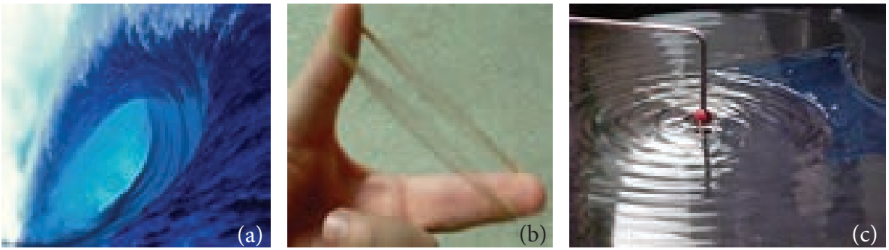

Standing near a beach, one can observe waves in the ocean reaching the seashore with a similar wave pattern; hence they are called ocean waves. A rubber band when plucked vibrates like a wave which is an example of a standing wave. These are shown in Figure 11.2. Other examples of waves are light waves (electromagnetic waves), through which we see and enjoy the beauty of nature and sound waves using which we hear and enjoy pleasant melodious songs. Day to day applications of waves are numerous, such as mobile phone communication, laser surgery, etc.

### Ripples and wave formation on the water surface

Suppose we drop a stone in a trough of still water, we can see a disturbance produced at the place where the stone strikes the water
surface as shown in Figure 11.3. We find that this disturbance spreads out (diverges out) in the form of concentric circles of ever increasing radii (ripples) and strike the boundary of the trough. This is because some of the kinetic energy of the stone is transmitted to the water molecules on the surface. Actually the particles of the water (medium) themselves do not move outward with the disturbance. This can be observed by keeping a paper strip on the water surface. The strip moves up and down when the disturbance (wave) passes on the water surface. This shows that the water molecules only undergo vibratory motion about their mean positions.

### Formation of waves on stretched string

Let us take a long string and tie one end of the string to the wall as shown in Figure 11.4 (a). If we give a quick jerk, a bump (like pulse) is produced in the string as shown in Figure 11.4 (b). Such a disturbance is sudden and it lasts for a short duration, hence it is known as a wave pulse. If jerks are given continuously then the waves produced are standing waves. Similar waves are produced by a plucked string in a guitar.

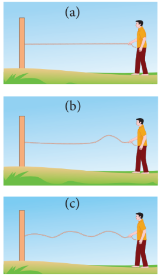

### Formation of waves in a tuning fork

When we strike a tuning fork on a rubber pad, the prongs of the tuning fork vibrate about their mean positions. The prong vibrating about a mean position means moving outward and inward, as indicated in the Figure 11.5. When a prong moves outward, it pushes the layer of air in its neighbourhood which means there is more accumulation of air molecules in this region. Hence, the density and also the pressure increase. These regions are known as compressed regions or compressions. This compressed air layer moves forward and compresses the next neighbouring layer in a similar manner. Thus a wave of compression advances or passes through air. When the prong moves inwards, the particles of the medium are moved to the right. In this region both density and pressure are low. It is known as a rarefaction or elongation.

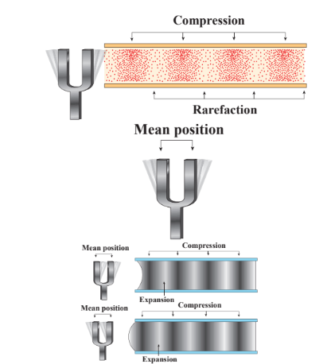

### Characteristics of wave motion

- For the propagation of the waves, the medium must possess both inertia and elasticity, which decide the velocity of the wave in that medium.
- In a given medium, the velocity of a wave is a constant whereas the constituent particles in that medium move with different velocities at different positions. Velocity is maximum at their mean position and zero at extreme positions.
- Waves undergo reflections, refraction, interference, diffraction and polarization.

| Point to ponder|
|------|
|The medium possesses both inertia and elasticity for propagation of waves.|
|Light is an electromagnetic wave. what is the medium for its transmission?|  

### Mechanical wave motion and its types

Wave motion can be classified into two types

a. **Mechanical wave** – Waves which require a medium for propagation are known as mechanical waves.

**Examples:** sound waves, ripples formed on the surface of water, etc.

b. **Non mechanical wave** – Waves which do not require any medium for propagation are known as non-mechanical waves.

**Example:** light waves, Infra red rays etc.

Further, waves can also be classified into two types

a. Transverse waves
b. Longitudinal waves

### Transverse wave motion

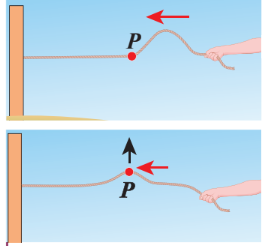

In transverse wave motion, the constituents of the medium oscillate or vibrate about their mean positions in a direction perpendicular to the direction of propagation (direction of energy transfer) of waves as shown in Figure 11.6.

**Example:** light (electromagnetic waves)

### Longitudinal wave motion

In longitudinal wave motion, the constituents of the medium oscillate or vibrate about their mean positions in a direction parallel to the direction of propagation (direction of energy transfer) of waves as shown in Figure 11.7.

**Example:** Sound waves travelling in air.

---
**Discuss with your Teacher** 
- Tsunami (pronounced soo-nah-mee in Japanese) means Harbour waves. 
- Tsunami is a series of huge and giant

waves which come with great speed and huge force. What happened on 26th December2004 in southern part of India? - Discuss

- Gravitational waves and LIGO (Laser lnterferometer Gravitational wave Observatory) experiment.

- Nobel Prize winners in Physics 2017 are Prof. Rainer Weiss, Prof. Barry C. Barish and Prof. Kip S. Thorne for decisive contributions to the LIGO detector and observation of gravitational forces.

---

**Table 11.1: Comparison of transverse and longitudinal waves**
|S. No|Transverse waves|Longitudinal waves|
|---|---|---|
|1.|The direction of vibration of particles of the medium is perpendicular to the direction of propagation of waves.|The direction of vibration of particles of the medium is parallel to the direction of propagation of waves.|
|2.|The disturbances are in the form of crests and troughs.|The disturbances are in the form of compressions and rarefactions.|
|3.|Transverse waves are possible in elastic medium.|Longitudinal waves are possible in all types of media (solid, liquid and gas).|

**NOTE:**

1. Absence of medium is also known as vacuum. Only electromagnetic waves can travel through vacuum.
2. Rayleigh waves are considered to be mixture of transverse and longitudinal.

## TERMS AND DEFINITIONS USED IN WAVE MOTION

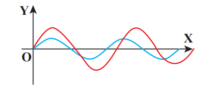

Suppose we have two waves as shown in Figure 11.8. Are these two waves identical? No. Though, the two waves are both sinusoidal, there are many difference between them. Therefore, we have to define some basic terminologies to distinguish one wave from another.

Consider a wave produced in a stretched string as shown in Figure 11.9.

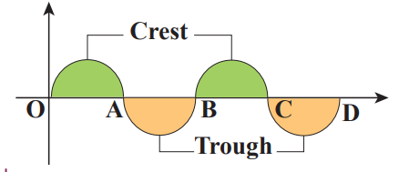

If we are interested in counting the number of waves created, let us put a reference level (mean position) as shown in Figure 11.9. Here the mean position is the horizontal line shown. The highest point in the shaded portion is called _crest_. With respect to the reference level, the lowest point on the un-shaded portion is called trough. This wave contains repetition of a section O to B and hence we define the length of the smallest section without repetition as one _wavelength_ as shown in Figure 11.10. In Figure 11.10 the length OB or length BD is one wavelengh. A Greek letter lambda λ is used to denote one wavelength.

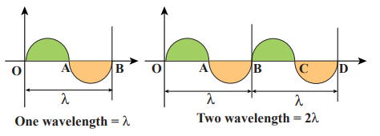

For transverse waves (as shown in Figure 11.11), the distance between two neighbouring crests or troughs is known as the _wavelength_. For longitudinal waves, (as shown in Figure 11.12) the distance between two neighbouring compressions or rarefactions is known as the wavelength. The SI unit of wavelength is _meter_.

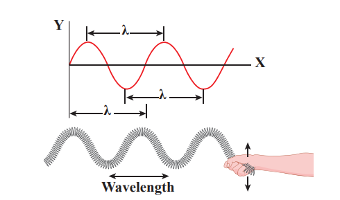

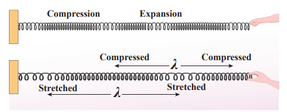

**EXAMPLE 11.1**

Which of the following has longer wavelength?

**Answer** is (c)

In order to understand frequency and time period, let us consider waves (made of three wavelengths) as shown in Figure 11.13 (a). At time _t_ = 0 _s,_ the wave reaches the point A from left. After time t = 1 s (shown in figure 11.13(b)), the number of waves which have crossed the point A is two. Therefore, the frequency is defined as the number of waves crossing a point per second. It is measured in _hertz_ whose symbol is _Hz_. In this example,

_f_ = 2 Hz (11.1)

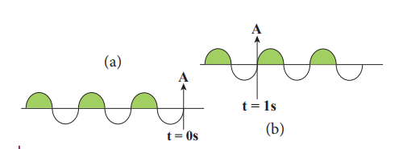

If two waves take one second (time) to cross the point A then the time taken by one wave to cross the point A is half a second. This defines the time period T as

_T_ = 1\2 = 0.5 s (11.2)

From equation (11.1) and equation (11.2), _frequency and time period are inversely related_ i.e.,

_T_ = 1/f (11.3)

_Time period is defined as the time taken by one wave to cross a point_.

---
**EXAMPLE 11.2**

Three waves are shown in the figure below.

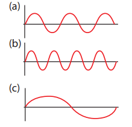

Write down

(a) the frequency in ascending order

(b) the wavelength in ascending order

**_Solution_**

(a) _f_ (\\_c\\) < _f_(\\_a\\) < _f_(\\_b\\)

(b) _λ_(\\_b\\) < _λ_(\\_a\\) < _λ_(\\_c\\)

From the example 11.2, we observe that the frequency is inversely related to the wavelength, _f_ ~= 1/λ

Then, f λ is equal to what?

[(i.e) _f_ λ = ?]

A simple dimensional argument will help us to determine this unknown physical quantity.

Dimension of wavelength is, [**λ**] = _L_

Frequency _f = 1/Time period_ , which implies that the dimension of frequency is,

[f] = 1 / [_T_] = T\\(^{-1}\\)

⇒ [_λf_] = [_λ_][_f_]= _LT_\\(^{-1}\\) = [velocity]

Therefore,

Velocity, _λf_ = _v_ (11.4)

where _v_ is known as the _wave velocity_ or _phase velocity. This is the velocity with_ which the wave propagates. _Wave velocity_ is the distance travelled by a wave in one second.

---

**Note:**

1. The number of cycles (or revolutions) per unit time is called _angular frequency_. _Angular frequency,_ ω = 2π / _T_ = 2πf (unit is radians/second)

2. The number of cycles per unit distance or number of waves per unit distance is called _wave number_.

_wave number, k_ = 2π / λ (unit is radians/ meter)

The velocity v, angular frequency ω and wave number _k_ are related as:

_velocity_, _v_ = _λf_ = λ/π2 = (2π _f_)/(2π / λ) = ω/ _k_  

---

**EXAMPLE 11.3**

The average range of frequencies at which human beings can hear sound waves varies from 20 Hz to 20 kHz. Calculate the wavelength of the sound wave in these limits. (Assume the speed of sound to be 340 m s\\(^{–1}\\).

**_Solution_**

λ(\\_1\\) = v/f(\\_1\\) = 340/20 = 17m

λ(\\_2\\) = v/f(\\_1\\) = 340/20 x 10(\\_3\\) = 0.017m 

Therefore, the audible wavelength region is from 0.017 m to 17 m when the velocity of sound in that region is 340 m s–1.

---

---

**EXAMPLE 11.4**

A man saw a toy duck on a wave in an ocean. He noticed that the duck moved up and down 15 times per minute. He roughly measured the wavelength of the ocean wave as 1.2 m. Calculate the time taken by the toy duck for going one time up and down and also the velocity of the ocean wave.

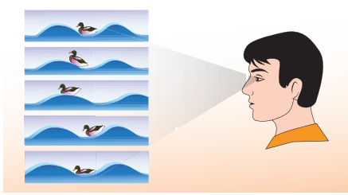

**_Solution_** 

Given that the number of times the toy duck moves up and down is 15 times per minute. This information gives us frequency (the number of times the toy duck moves up and down)

f = 15times toy duck moves up and down/one minute
 
But one minute is 60 second, therefore, expressing time in terms of second

f = 15/60 = 1/4 = 0.25 Hz

The time taken by the toy duck for going one time up and down is time period which is inverse of frequency

T = 1/f = 1/0.25 = 4s

The velocity of ocean wave is

v = λf = 1.2 × 0.25 = 0.3 m s\\(^{–1}\\)

---

Amplitude of a wave:

**Amplitude of a wave:**

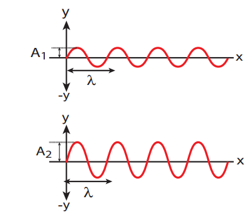

The waves shown in the Figure 11.14 have same wavelength, same frequency and same time period and also move with same velocity. The only difference between two waves is the height of either crest or trough. This means, the height of the crest or trough also signifies a wave character. So we define a quantity called an amplitude of the wave, as the maximum displacement of the medium with respect to a reference axis (for example in this case x-axis). Here, it is denoted by A.

---

**EXAMPLE 11.5**

Consider a string whose one end is attached to a wall. Then compute the following in both situations given in figure (assume waves crosses the distance in one second)

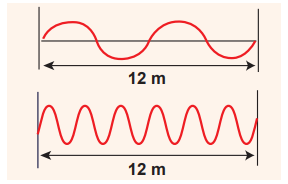

(a) Wavelength, (b) Frequency and (c) Velocity 

**Solution**

||First case|Second case|
|---|---|---|
|**(a)** Wavelength|λ = 6 m|λ = 2 m|
|**(b)** Frequency|_f_ = 2 Hz|_f_ = 6 Hz|
|**(c)** Velocity|_v_ = 6 × 2 = 12 m s\\(^{–1}\\)|_v_ = 2 × 6 = 12 ms \\(^{–1}\\)|

This means that the speed of the wave along a string is a constant. Higher the frequency, shorter the wavelength and vice versa, and their product is velocity which remains the same.

---

**VELOCITY OF WAVES IN DIFFERENT MEDIA**

Suppose a hammer is struck on long rails at a distance and when a person keeps his ear near the rails at the other end he/she will hear two sounds, at different instants. The sound that is heard through the rails (solid medium)

is faster than the sound we hear through the air (gaseous medium). This implies the velocity of sound is different in different media.

In this section, we shall derive the velocity of waves in two different cases:

1. The velocity of a transverse waves along a stretched string.

2. The velocity of a longitudinal waves in an elastic medium.

### Velocity of transverse waves in a stretched string

Let us compute the velocity of transverse travelling waves on a string. When a jerk is given at one end (left end) of the rope, the wave pulses move towards right end with a velocity _v_ with respect to an observer who is at rest frame.

Consider an elemental segment in the string as shown in the Figure 11.15. Let A and B be two points on the string at an instant of time. Let _dl_ and _dm_ be the length and mass of the elemental string, respectively. By definition, linear mass density, _μ_ is

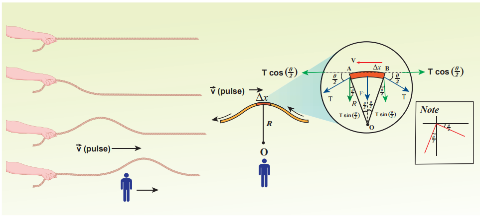

µ = dm/dl   ....(11.5)

dm = μ dl   ....(11.6)

The elemental string AB has a curvature which looks like an arc of a circle with centre at O, radius R and the arc subtending an angle θ at the origin O as shown in Figure 11.15(b). The angle θ can be written in terms of arc length and radius as θ = _dl_ / _R_ . The centripetal acceleration supplied by the tension in the string is

a(\\_{cp}\\) = _v_\\(^{2}\\) _R_    .....(11.7)

Then, centripetal force is

F(\\_{cp}\\) = (_dm_) _v_\\(^{cp}\\) / _R_   .....(11.8)

From eqn 11.6,

(_dm_) _v_ \\(^{cp}\\) / _R_ = µv\\(^{2}\\) dl / R   .....(11.9)

The tension T acts along the tangent of the elemental segment of the string at A and B. Since the arc length is very small, variation in the tension force can be ignored. We can resolve T into horizontal component



T cos \\(\frac{θ}{2}\\)

The horizontal components at A and B are equal in magnitude but opposite in direction; therefore, they cancel each other. Since the elemental arc length AB is taken to be very small, the vertical components at A and B appears to acts vertical towards the centre of the arc and hence, they add up. The net radial force Fr is

Fr = 2_T_ sin θ 2 

  

  (11.10)

Since the amplitude of the wave is very small when it is compared with the length of the

string, sin θ θ 2 2 

  

 ≈ . Hence,

Fr = 2T × θ 2

= _Tθ_ (11.11)

But θ = _dl R_

, we get

Fr = _T dl R_

(11.12)

Applying Newton’s second law to the elemental string in the radial direction, under equilibrium, the radial component of the force is equal to the centripetal force. Hence equating equation (11.9) and equation (11.12), we have

_T dl R_

_v dl R_

= µ 2

_v T_ =

µ (11.13)

**Observations:** 
- The velocity of the string is

a. directly proportional to the square root of the tension force

b. inversely proportional to the square root of linear mass density

c. independent of shape of the waves.  

**EXAMPLE 11.6**

Calculate the velocity of the travelling pulse as shown in the figure below. The linear mass density of pulse is 0.25 kg m–1. Further, compute the time taken by the travelling pulse to cover a distance of 30 cm on the string.

## kg

**Solution**

The tension in the string is T = m g = 1.2 × 9.8 = 11.76 N The mass per unit length is μ = 0.25 kg m–1

Therefore, velocity of the wave pulse is

_v T m s m s_= = = =− −

µ 11 76 0 25

6 858 6 81 1. .

. .

The time taken by the pulse to cover the distance of 30 cm is

_t d s ms v_

     

30 10

6 8 0 044 44

2

. . where,

ms = milli second.

### Velocity of longitudinal waves in an elastic medium

Consider an elastic medium (here we assume air) having a fixed mass contained in a long tube (cylinder) whose cross sectional area is _A_ and maintained under a pressure _P_. One can generate longitudinal waves in the fluid either by displacing the fluid using a piston or by keeping a vibrating tuning fork at one end of the tube. Let us assume that the direction of propagation of waves coincides with the axis of the cylinder. Let _ρ_ be the density of

the fluid which is initially at rest. At t = 0, the piston at left end of the tube is set in motion toward the right with a speed _u_.

Let _u_ be the velocity of the piston and _v_ be the velocity of the elastic wave. In time interval Δ_t_, the distance moved by the piston Δ_d_ = _u_ Δ_t_. Now, the distance moved by the elastic disturbance is Δ_x = v_Δ_t_. Let Δ_m_ be the mass of the air that has attained a velocity _v_ in a time Δt . Therefore,

Δ_m = ρ A_ Δ_x = ρ A_ (_v_ Δ_t_)

Then, the momentum imparted due to motion of piston with velocity _u_ is

Δ_p =_ [_ρ A_ (_v_ Δ_t_)]_u_

But the change in momentum is impulse.

The net impulse is

_I =_ (Δ_P A_)Δ_t_

Or (Δ_P A_)Δ_t =_ [_ρ A_ (_v_ Δ_t_)]_u_

Δ_P = ρ v u_ (11.14)

When the sound wave passes through air, the small volume element (Δ_V_) of the air undergoes regular compressions and rarefactions. So, the change in pressure can also be written as

**Air**

**_V_**

**AirF = PA ρ P**

**v∆tu∆t**

**F = (P+∆P) A PA**

**Figure 11.16** Longitudinal waves in the fluid by displacing the fluid using a piston  

∆_P K V V_

= ∆

where, _V_ is original volume and _K_ is known as bulk modulus of the elastic medium.

But _V_ = _A_ ∆_x_ = _A_ _v_ ∆_t_ and

∆_V_ = _A_ ∆_d_ =_A_ _u_ ∆_t_

Therefore,

∆ = ∆ ∆ =_P K Au t_

_Av t K u v_ (11.15)

Comparing equation (11.14) and equation (11.15), we get

ρ_v u K u v_

= or _v K_2 = ρ

⇒ =_v K_ ρ

(11.16)

In general, the velocity of a longitudinal

wave in elastic medium is _v E_ =

ρ , where _E_

is the modulus of elasticity of the medium.

**Cases: For a solid : (i) one dimensional rod (1D)**

_v Y_ =

ρ (11.17)

where _Y_ is the Young’s modulus of the material of the rod and _ρ_ is the density of the rod. The 1D rod will have only Young’s modulus.

**(ii) Three dimensional rod (3D) The speed** of longitudinal wave in a solid is

_v K_

= +

4 3

η

ρ (11.18)

where _η_ is the modulus of rigidity, K is the bulk modulus and _ρ_ is the density of the rod.

| ρ PAir |
|------|------|------|
| A |PA |
|------|------|------|

  

**Cases:** **For liquids:**

_v K_ =

ρ (11.19)

where, _K_ (or) _B_ is the bulk modulus and _ρ_ is the density of the rod.

**EXAMPLE 11.7**

Calculate the speed of sound in a steel rod whose Young’s modulus _Y_ = 2 × 1011 N m–2 and _ρ_ = 7800 kg m–3.

**Solution**

_v Y_ = =

× = × = ×

ρ 2 10 7800

0 2564 10 0 506 11

8. .

_ms ms_= × = × = ×− −0 0

0 2564 10 0 506 10 5 10 11

8 4 1 3 1. .

Therefore, longitudinal waves travel faster in a solid than in a liquid or a gas. Now you may understand why a shepherd checks before crossing railway track by keeping his ears on the rails to safegaurd his cattle.

**EXAMPLE 11.8**

An increase in pressure of 100 _k_Pa causes a certain volume of water to decrease by 0.005% of its original volume.

(a) Calculate the bulk modulus of water?

(b) Compute the speed of sound (compressional waves) in water?

**_Solution_**

(a) Bulk modulus

_B V P V_

_M_= ∆ ∆

= × ×

= × ×

=− −

100 10

0 005 10

100 10

5 10 2000

3

2

3

5 .

_V P V_

_MPa_∆ ∆

= × ×

= × ×

=− −

100 10

0 005 10

100 10

5 10 2000

3

2

3

5 .

, where

_MPa_ is mega pascal  

_ms ms_= ×− −10 5 104 1 3 1

_Pa_

(b) Speed of sound in water is

_v K ms_= = ×

= −

ρ 2000 10

1000 1414

6 1

The velocities of both transverse waves and longitudinal waves depend

on elastic property (like string tension T or bulk modulus K) and inertial property (like density or mass per

unit length) i.e.,

**Note**

**Table 11.2: Speed of sound in various media**

S.No. **Medium Speed in m s**–1

Solids 1. Rubber 1600 2. Gold 3240

3. Brass 4700 4. Copper 5010 5. Iron 5950 6. Aluminum 6420

Liquids at 25°C 1. Kerosene 1324 2. Mercury 1450 3. Water 1493 4. Sea Water 1533

Gas (at 0°C) 1. Oxygen 317 2. Air 331 3. Helium 972 4. Hydrogen 1286

Gas (at 20°C) 1. Air 343

## PROPAGATION OF SOUND WAVES

We know that sound waves are longitudinal waves, and when they propagate compressions and rarefactions are formed. In the following section, we compute the speed of sound in air by Newton’s method and also discuss the Laplace correction and the factors affecting sound in air.

### Newton’s formula for speed of sound waves in air

Sir Isaac Newton assumed that when sound propagates in air, the formation of compression and rarefaction takes place in a very slow manner so that the process is isothermal in nature. That is, the heat produced during compression (pressure increases, volume decreases), and heat lost during rarefaction (pressure decreases, volume increases) occur over a period of time such that the temperature of the medium remains constant. Therefore, by treating the air molecules to form an ideal gas, the changes in pressure and volume obey Boyle’s law, Mathematically

_PV_ = Constant (11.20)

Differentiating equation (11.20), we get

_PdV_ \+ _VdP_ = 0

or, _P_ = − _V_ _dP dV_

= _K_I (11.21)

where, _K_I is an isothermal bulk modulus of air. Substituting equation (11.21) in equation (11.16), the speed of sound in air is

_v K P T_

_I_= = ρ ρ (11.22)  

Since _P_ is the pressure of air whose value at NTP (Normal Temperature and Pressure) is 76 cm of mercury, we have _P = hρg_

_P_ = (0.76 × 13.6 ×103 × 9.8) N m–2

_ρ_ = 1.293 _kg_ _m_–3. Here _ρ_ is density of air

Then the speed of sound in air at Normal Temperature and Pressure (NTP) is

_v_T = 0 76 13 6 10 9 8

1 293

3 . . .

.

× × ×( )

= 279.80 m s–1 ≈ 280 ms–1 (theoretical value)

But the speed of sound in air at 0°C is experimentally observed as 332 m s–1 which is close upto 16% more than theoretical value (Percentage error is

332 280

332 100 15 6

  % . % ). This error is

not small

### Laplace’s correction

In 1816, Laplace satisfactorily corrected this discrepancy by assuming that when the sound propagates through a medium, the particles oscillate very rapidly such that the compression and rarefaction occur very fast. Hence the exchange of heat produced due to compression and cooling effect due to rarefaction do not take place, because, air (medium) is a bad conductor of heat. Since, temperature is no longer considered as a constant here, sound propagation is an adiabatic process. By adiabatic considerations, the gas obeys Poisson’s law (not Boyle’s law as Newton assumed), which is

_PV_γ = constant (11.23)

where, _γ = C C P_

_v_

, which is the ratio between

specific heat at constant pressure and specific heat at constant volume.

Differentiating equation (11.23) on both the sides, we get

_V_γ _dP_ \+ _P_ (_γ_Vγ–1 _dV_) = 0

or, γ_P V dp dV_

_K A_ = − = (11.24)

where, _K_A is the adiabatic bulk modulus of air. Now, substituting equation (11.24) in equation (11.16), the speed of sound in air is

_v K P vA A_

_T_ = ‡ ‡ ρ ρ = = (11.25)

Since air contains mainly, nitrogen, oxygen, hydrogen etc, (diatomic gas), we take _γ_ = 1.4. Hence, speed of sound in air is _v_A = ( 1 4. )(280 m s–1)= 331.30 m s–1, which is very much closer to experimental data.

### Factors affecting speed of sound in gases

Let us consider an ideal gas whose equation of state is

_PV_ = _μ R T_ (11.26)

where, _P_ is pressure, _V_ is volume, T is temperature, μ is number of mole and R is universal gas constant. For a given mass of a molecule, equation (11.26) can be written as

_PV T_ = Constant (11.27)

For a fixed mass m, density of the gas inversely varies with volume. i.e.,

ρ ρ

∝ = 1 _V_

_V m_, (11.28)

Substituting equation (11.28) in equation (11.27), we get  

_P cT_ ρ = (11.29)

where _c_ is constant.

The speed of sound in air given in equation (11.25) can be written as

_v P cT_= = γ ρ

γ (11.30)

From the above relation we observe the following

**(a) Effect of pressure :**

For a fixed temperature, when the pressure varies, correspondingly density also varies

such that the ratio _P_ ρ 

  

  becomes constant.

This means that the speed of sound is independent of pressure for a fixed temperature. If the temperature remains same at the top and the bottom of a mountain then the speed of sound will remain same at these two points. But, in practice, the temperatures are not same at top and bottom of a mountain; hence, the speed of sound is different at different points.

**(b) Effect of temperature :**

Since _v_ ∝ _T_ ,

the speed of sound varies directly to the square root of temperature in kelvin.

Let _v_0 be the speed of sound at temperature at 0° C or 273 K and _v_ be the speed of sound at any arbitrary temperature T (in kelvin), then

_v v_

_T t_

0 273

273

273 = = +

_v v t v t_= + ≅ +

  0 0

1 273

1 546

(using binomial expansion)

Since _v_0 = 331_m s_–1 at 0°C, _v_ at any temperature in _t_°C is

_v_ = (331 + 0.61_t_) _m s_–1

Thus the speed of sound in air increases by 0.61 _m s_–1 per degree celcius rise in temperature. Note that when the temperature is increased, the molecules will vibrate faster due to gain in thermal energy and hence, speed of sound increases.

**(c) Effect of density :** Let us consider two gases with different densities having same temperature and pressure. Then the speed of sound in the two gases are

_v P_ 1

1

1

= γ ρ

(11.31)

and

_v P_ 2

2

2

= γ ρ

(11.32)

Taking ratio of equation (11.31) and equation (11.32), we get

_v v_

_P_

_P_ 1

2

1

1

2

2

1 2

2 1

= =

γ ρ

γ ρ

γ ρ γ ρ

For gases having same value of _γ_,

_v v_

1

2

2

1

= ρ ρ (11.33)

Thus the velocity of sound in a gas is inversely proportional to the square root of the density of the gas.

**(d) Effect of moisture (humidity):**

We know that density of moist air is 0.625 of that of dry air, which means the presence of moisture in air (increase in humidity) decreases its density. Therefore, speed of sound increases with rise in humidity. From equation (11.30)  

_v p_ =

γ ρ

Let _ρ_1, _v_1 and _ρ_2, _v_2 be the density and speeds of sound in dry air and moist air, respectively. Then

_v v_

_P_

_P_ 1

2

1

1

2

2

2

1

= =

γ ρ

γ ρ

ρ ρ if _γ_1 = _γ_2

Since _P_ is the total atmospheric pressure, According to Dalton’s law of partial pressure, it can be shown that

ρ ρ

2

1 1 20 625 =

\+ _P_

_p p_.

where _p_1 and _p_2 are the partial pressures of dry air and water vapour respectively. Then

_v v P p p_1 2

1 2 0 625

= + .

(11.34)

**(e) Effect of wind:**

The speed of sound is also affected by blowing of wind. In the direction along the wind blowing, the speed of sound increases whereas in the direction opposite to wind blowing, the speed of sound decreases.

**EXAMPLE 11.9**

The ratio of the densities of oxygen and nitrogen is 16:14. Calculate the temperature when the speed of sound in nitrogen gas at 17°C is equal to the speed of sound in oxygen gas.

**_Solution_**

From equation (11.25), we have

_v P_ =

γ ρ

But ρ= _M V_

Therefore,

_v PV_

_M_ =

γ

Using equation (11.26)

_v RT_

_M_ =

γ

Where, R is the universal gas constant and M is the molecular mass of the gas. The speed of sound in nitrogen gas at 17°C is

_v R K K MN_

_N_

= +γ ( )273 17

= γ_R K_

_MN_

( )290 (1)

Similarly, the speed of sound in oxygen gas at temperature _t_

_v R K t_

_M_0 0

273 =

+γ ( ) (2)

Given that the value of _γ_ is same for both the gases, the two speeds must be equal. Hence, equating equation (1) and (2), we get

_v_O = _v_N

γ γ_R t M_

_R MN_

( ) ( )273 290

0

\+ =

Squaring on both sides and cancelling _γ R_ term and rearranging, we get

_M M_

_t_

_N_

0 273

290 = +

(3)

Since the densities of oxygen and nitrogen is 16:14,

ρ ρ

0 16 14_N_

= (4)  

**11.5**

ρ ρ

0 0 0 16 14_N_

_O_

_N N N_

_M V_

_M V_

_M M_

_M M_

= = ⇒ = (5)

Substituting equation (5) in equation (3), we get

273

290

16

14 3822 14 4640

\+ = ⇒ + =_t t_

⇒ _t =_ 58.4 °C

**REFLECTION OF SOUND WAVES**

When sound wave passes from one medium to another medium, the following things can happen

(a) Reflection of sound: If the medium is highly dense (highly rigid), the sound can be reflected completely (bounced back) to the original medium.

(b) **Refraction of sound:** When the sound waves propagate from one medium to another medium such that there can be some energy loss due to absorption by the second medium.

In this section, we will consider only the reflection of sound waves in a medium when it experiences a harder surface. Sound can also obey the laws of reflection, which state that

**Figure 11.17 Reflection of sound in** different surfaces

**A smooth plane**

**surface**

**A convex surface**

**A concave surface**

**A corner surface**

| Swe |ρρN |M==V M ⇒=M 16M M M 14VO00ting e quation  (5) in 0 equatioN NN+ t 16=⇒ 3822 +=14 t 464014t = 58.4 °C⇒ |(5) |
|------|------|------|------|

| n  (3), |
| ubstitu get273290 |

  

(i) The angle of incidence of sound is equal to the angle of reflection.

(ii) When the sound wave is reflected by a surface then the incident wave, reflected wave and the normal at the point of incidence all lie in the same plane.

Similar to reflection of light from a mirror, sound also reflects from a harder flat surface, This is called as specular reflection.

Specular reflection is observed only when the wavelength of the source is smaller than dimensions of the reflecting surface, as well as smaller than surface irregularities.

### Reflection of sound through the plane surface

**Figure 11.18 Reflection of sound** through the plane surface

**Wave front**

**Sound source**

**Flat reflector**

**Wall**

**Listener**

**Sound source**

**Virtual source**

**Reflected spherical wave**

**Incident spherical wave**

**Paper tube Paper tube**

**EarClock**

**Insulation board**

**WALL**

When the sound waves hit the plane wall, they bounce off in a manner similar to  

that of light. Suppose a loudspeaker is kept at an angle with respect to a wall (plane surface), then the waves coming from the source (assumed to be a point source) can be treated as spherical wave fronts (say, compressions moving like a spherical wave front). Therefore, the reflected wave front from the plane surface is also spherical, such that its centre of curvature (which lies on the other side of plane surface) can be treated as the image of the sound source (virtual or imaginary loud speaker). These are shown in Figures 11.18, 11.19.

Reflected sound

Reflected sound

Direct sound

**Figure 11.19** Common examples for reflection of sound in real situation

### Reflection of sound through the curved surface

The behaviour of sound is different when it is reflected from different surfaces like convex or concave or plane. The sound reflected from a convex surface is spread out and so it is easily attenuated and weakened. Whereas, if it is reflected from the concave surface it will converge at a point and this can be easily amplified. The parabolic reflector (curved reflector) which is used to focus the sound precisely to a point is used in designing the parabolic mics which are known as high directional microphones.

| Sound source |
|------|------|------|------|------|------|------|------|

| Listener |

| Wall |Incident |Vi rtual source |

  

We know that any surface (smooth or rough) can absorb sound. For example, the sound produced in a big hall or auditorium or theatre is absorbed by the walls, ceilings, floor, seats etc. To avoid such losses, a curved sound board (concave board) is kept in front of the speaker, so that the board reflects the sound waves of the speaker towards the audience. This method will minimize the spreading of sound waves in all possible directions in that hall and also enhances the uniform distribution of sound throughout the hall. That is why a person sitting at any position in that hall can hear the sound without any disturbance.

**Wave Front**

**Sound Source**

**Convex Reflector**

**Concave Reflector**

**Wave Front**

**Sound Source**

**Concave Reflector**

**Figure 11.20 Reflection of sound** through the curved surface  

**Concave SurfaceDais**

**Figure 11.21** Sound in a big auditorium

### Applications of reflection of sound waves

**(a) Stethoscope:** It works on the principle of multiple reflections.

**Multiple reflections of sound in the tube of stethescope**

**Stethescope**

**Figure 11.22** Stethoscope and multiple reflection of signal in a rubber tube

|------|------|------|------|------|

| Dais |Concave Surface |
|------|------|------|------|------|------|

| Figure 11.21 Sound in a big auditorium |
|------|------|------|

|------|------|------|------|

|------|------|

  

It consists of three main parts: (i) Chest piece (ii) Ear piece (iii) Rubber tube

**(i) Chest piece:** It consists of a small disc-shaped resonator (diaphragm) which is very sensitive to sound and amplifies the sound it detects.

**(ii) Ear piece:** It is made up of metal tubes which are used to hear sounds detected by the chest piece.

**(iii) Rubber tube: This tube connects** both chest piece and ear piece. It is used to transmit the sound signal detected by the diaphragm, to the ear piece. The sound of heart beats (or lungs) or any sound produced by internal organs can be detected, and it reaches the ear piece through this tube by multiple reflections.

Scientists have estimated that _we can hear two sounds properly if the_

_time gap or time interval between_

_each sound is_ 1

10 

  

 

_th_

_of a second (persistence of hearing) i.e., 0.1 s. Then,_

velocity = Distance travelled

time taken = 2_d t_

2d = 344 × 0.1 = 34.4 m d = 17.2 m The minimum distance from a sound reflecting wall to hear an echo at 20°C is 17.2 meter.

**Note**

**(b) Echo:** An echo is a repetition of sound produced by the reflection of sound waves from a wall, mountain or other obstructing surfaces. The speed of sound in air at 20°C is 344 m s–1. If we shout at a wall which is  

at 344 m away, then the sound will take 1 second to reach the wall. After reflection, the sound will take one more second to reach us. Therefore, we hear the echo after two seconds.

**(c) SONAR:** **SO**_und_ **NA**_vigation_ and **R**_anging_. Sonar systems make use of reflections of sound waves in water to locate the position or motion of an object. Similarly, dolphins and bats use the sonar principle to find their way in the darkness.

**(d) Reverberation:** In a closed room the sound is repeatedly reflected from the walls and it is even heard long after the sound source ceases to function. The residual sound remaining in an enclosure and the phenomenon of multiple reflections of sound is called reverberation. The duration for which the sound persists is called reverberation time. It should be noted that the reverberation time greatly affects the quality of sound heard in a hall. Therefore, halls are constructed with some optimum reverberation time.

**EXAMPLE 11.10** Suppose a man stands at a distance from a cliff and claps his hands. He receives an echo from the cliff after 4 second. Calculate the distance between the man and the cliff. Assume the speed of sound to be 343 m s–1.

**_Solution_** The time taken by the sound to come back as echo is 2_t_ = 4 ⇒ _t_ = 2 s ∴The distance is d = vt =(343 m s–1)(2 s) = 686 m.

**11.6**

**Note: Classification of sound waves:** Sound waves can be classified in three groups according to their range of frequencies:

**(1) _Infrasonic waves:_** Sound waves having frequencies below

20 Hz are called infrasonic waves. These waves are produced during earthquakes. Human beings cannot hear these frequencies. Snakes can hear these frequencies.

**(2) _Audible waves:_** Sound waves having frequencies

between 20 Hz to 20,000 Hz (20kHz) are called audible waves. Human beings can hear these frequencies.

**(3) _Ultrasonic waves:_** Sound waves having frequencies

greater than 20 kHz are known as ultrasonic waves. Human beings cannot hear these frequencies. Bats can produce and hear these frequencies.

(1.) Supersonic speed: An object moving with a speed greater than the speed of sound is said to move with a supersonic speed.

(2.) Mach number: It is the ratio of the velocity of

source to the velocity of sound.

**PROGRESSIVE WAVES (OR) TRAVELLING WAVES**

If a wave that propagates in a medium is continuous then it is known as progressive wave or travelling wave.  

### Characteristics of progressive waves

1. Particles in the medium vibrate about their mean positions with the same amplitude.
2. The phase of every particle ranges from 0 to 2π.
3. No particle remains at rest permanently. During wave propagation, particles come to the rest position only twice at the extreme points.
4. Transverse progressive waves are characterized by crests and troughs whereas longitudinal progressive waves are characterized by compressions and rarefactions.
5. When the particles pass through the mean position they always move with the same maximum velocity.
6. The displacement, velocity and acceleration of particles separated from each other by _nλ_ are the same, where _n_ is an integer, and λ is the wavelength.

### Equation of a plane progressive wave

**(b) Pulse at time _t_**

**_vt P_**

**_P OO_**

**(a) Pulse at t = 0**

**_Y Y_**

**_X X_**

**_A V V_**

**Figure 11.23** Wave pulse moving with velocity _v_ at two instants at _t_ = 0 and at time _t_

Suppose we give a jerk on a stretched string at time _t_ = 0 _s_. Let us assume that the wave pulse created during this disturbance moves along positive _x_ direction with constant speed _v_ as shown in Figure 11.23 (a).

We can represent the shape of the wave pulse mathematically as _y_ = _y_(_x_, 0) = _f_(_x_) at time _t_ = 0 _s_. Assume that the shape of the wave pulse

| P |
|------|------|

  

remains the same during the propagation. After some time t, the pulse moving towards the right and any point on it can be represented by _x_' (read it as _x_ prime) as shown in Figure 11.23 (b). Then,

_y_(_x, t_) = _f_(_x´_) = _f_(_x_ − _vt_) (11.35)

Similarly, if the wave pulse moves towards left with constant speed _v_, then _y_ = _f_(_x_ \+ _vt_). Both waves _y_ = _f_(_x_ \+ _vt_) and _y_ = _f_(_x_ − _vt_) will satisfy the following one dimensional differential equation known as the wave equation

∂ ∂

= ∂ ∂

2

2 2

2

2

1_y x v_

_y t_ (11.36)

where the symbol **∂** represents partial derivative (read ¶

¶ _y x_

as partial y by partial x). Not all the solutions satisfying this differential equation can represent waves, because any physical acceptable wave must take finite values for all values of x and t. But if the function represents a wave then it must satisfy the differential equation. Since, in one dimension (one independent variable), the partial derivative with respect to _x_ is the same as total derivative in coordinate _x_, we write

_d y dx v_

_d y dt_

2

2 2

2

2

1 = (11.37)

This can be extended to more than one dimension (two, three, etc.). Here, for simplicity, we focus only on the one dimensional wave equation.

**EXAMPLE 11.11**

Sketch y = x −a for different values of a.

**_Solution_**

This implies, when increasing the value of a, the line shifts towards right side. For  

_a = vt, y = x − vt satisfies the differential_ equation. Though this function satisfies the differential equation, it is not finite for all values of _x_ and _t_. Hence, it does not represent a wave.

y

**x**

**a=0 a=1**

**a=3 a=2**

**o**

**y=x-a where, a = vt lines moves towards right**

**a (Increases)**

**1 2 3**

**EXAMPLE 11.12**

How does the wave _y_ = sin(_x_ − _a_) for _a_ = 0, _a_ = π

4 , _a_ = π

2 , _a_ = 3

2 π and _a_ = π look like?.

Sketch this wave.

**_Solution y 0_**

**_0_**

**_0_**

**_0_**

**_0_**

**_x_**

**_x_**

**_x_**

**_x_**

**_x_**

π 2π

π 2π

π 2π

π 2π

π 2π

π 4

π 2

3π 4

π 4

π 2

3π 4

π 4

π 2

3π 4

π 4

π 2

3π 4

π 4

π 2

3π 4

**_sin x_**

π 4_sin(x- )_

π 2_sin(x- )_

3π 4_sin(x- )_

_sin(x-_π _)_

From the above picture we observe that _y_ = sin (_x_−_a_) for _a_ = 0, _a_ = π

4 , _a_ = π

2 ,

_a_ = 3 2 π and _a_ = π, the function _y_ = sin (_x_−_a_)

shifts towards right. Further, we can take _a_ = _vt_ and _v_ = π

4 , and sketching for different

| yo |
|------|------|------|------|------|------|------|------|

| a=0a=1 a=2 |a=3 |x |
| 12 3 |

| π π 3π |
|------|------|------|
| sin(x-  4 2 4 |
| π π 3π |
| sin(x-  4 2 4 |
| π π 3π |
| sin(x-  4 2 4 |
| π π 3π |
| sin(x-4 2 4 |
| π π 3π |
  

times _t_ = 0_s_, _t_ = 1_s_, _t_ = 2_s_ etc., we once again observe that _y_ = sin(_x_−_vt_) moves towards the right. Hence, _y_ = sin(_x_−_vt_) is a travelling (or progressive) wave moving towards the right. If _y_ = sin(_x_+_vt_) then the travelling (or progressive) wave moves towards the left. Thus, any arbitrary function of type _y_ = _f_(_x_−_vt_) characterising the wave must move towards right and similarly, any arbitrary function of type _y_ = _f_(_x_+_vt_) characterizing the wave must move towards left.

**EXAMPLE 11.13**

Check the dimensional of the wave _y_ = sin(_x_−_vt_). If it is dimensionally wrong, write the above equation in the correct form.

**_Solution_** Dimensionally it is not correct. we know that _y_ = sin(_x_−_vt_) must be a dimensionless quantity but x−vt has dimension. The correct equation is _y_ = sin (_k_ _x_−_ωt_), where _k_ and _ω_ have the dimensions of inverse of length and inverse of time respectively. The sine functions and cosine functions are periodic functions with period 2π. Therefore, the correct expression is

_y_ = sin 2 2π λ

π_x T_

_t_− 

 



  where _λ_ and _T_ are

wavelength and time period, respectively. In general, _y_(_x_,_t_)=A sin(_k_ _x_−_ωt_).

**Amplitude**

**_y(x,t) = A sin(kx -ωt)_ Phase**

**Oscillating term**

**Displacement**

**Angular wave number Position Angular**

**frequency**

**Time**  

### Graphical representation of the wave

Let us graphically represent the two forms of the wave variation

**(a)** Space (or Spatial) variation graph **(b)** Time (or Temporal) variation graph

**(a) Space variation graph**

**x+λ**

**2π**

**λ**

**π**

**o**

**x**

**x**

**y**

**Figure 11.24** Graph of sinusoidal function _y_ = _A_ sin(_kx_)

By keeping the time fixed, the change in displacement with respect to _x_ is plotted. Let us consider a sinusoidal graph, _y_ = _A_ sin(_kx_) as shown in the Figure 11.24, where _k_ is a constant. Since the wavelength _λ_ denotes the distance between any two points in the same state of motion, the displacement _y_ is the same at both the ends _y_ = _x_ and _y_ = _x + λ,_ i.e.,

_y_ = A sin(_kx_) = A sin(_k_(_x_ \+ _λ_)) = A sin(_kx_ \+ _k λ_) (11.38)

The sine function is a periodic function with period 2π. Hence,

_y_ = A sin(_kx_ \+ 2π) = A sin(_kx_) (11.39)

Comparing equation (11.38) and equation (11.39), we get

_kx_ \+ _k_ _λ_ = _kx_ \+ 2π

This implies

_k_ = 2π λ

rad m–1 (11.40)

where k is called wave number. This measures how many wavelengths are present in 2π radians.

| π 2π |
|------|------|

  

The spatial periodicity of the wave is

λ π =

2 _k_

in m Then, At _t_ = 0 s _y_(_x_, 0) = _y_(_x_ \+ _λ_, 0)

and At any time _t, y_(_x_, t) = _y_(_x_ \+ _λ_, _t_)

**EXAMPLE 11.14**

The wavelength of two sine waves are _λ_1 = 1m and _λ_2 = 6m. Calculate the corresponding wave numbers.

**_Solution_**

_k_1 = 2 1 π = 6.28 rad m-1

_k_2 = 2 6 π = 1.05 rad m-1

**(b) Time variation graph**

**2π**

**2π π t**

**y**

**o**

2π―tT ))

sin

**Figure 11.25** Graph of sinusoidal function _y_ =_A_ sin(_ωt_)

By keeping the position fixed, the change in displacement with respect to time is plotted. Let us consider a sinusoidal graph, _y_ =_A_ sin(_ωt_) as shown in the Figure 11.25, where _ω_ is angular frequency of the wave which measures how quickly wave oscillates in time or number of cycles per second.

The temporal periodicity or time period is

_T_

_T_ = ⇒ =

2 2π ω

ω π

The angular frequency is related to frequency _f_ by the expression _ω_ = 2 π_f_, where the frequency f is defined as the number of oscillations made by the medium particle  

per second. Since inverse of frequency is time period, we have,

_T f_

= 1 in seconds

This is the time taken by a medium particle to complete one oscillation. Hence, we can define the speed of a wave (wave speed, v) as the distance traversed by the wave per second

_v T_

_f_= = λ λ in m s-1

which is the same relation as we obtained in equation (11.4).

### Particle velocity and wave velocity

In a plane progressive harmonic wave, the constituent particles in the medium oscillate simple harmonically about their equilibrium positions. When a particle is in motion, the rate of change of displacement at any instant of time is defined as velocity of the particle at that instant of time. This is known as particle velocity.

_v dy dtP_ = m s-1 (11.41)

But _y_(_x, t_)= A sin(_k x_ \- _ω t_) (11.42)

Therefore, dy _dt_

= − ω A cos(_k x_− _ω t_) (11.43)

Similarly, we can define velocity (here speed) for the travelling wave (or progressive wave). In order to determine the velocity of a progressive wave, let us consider a progressive wave (shown in Figure 11.23) moving towards right. This can be mathematically represented as a sinusoidal wave. Let _P_ be any point on the phase of the wave and _y_P be its displacement with respect

| 2π |t |
|------|------|------|------|
| o |π |
| 2π |
| Figure 11.25 Graph of sinusoidal function y =A sin(ωt) |
  

to the mean position. The displacement of the wave at an instant _t_ is

_y_ = _y_(_x,t_) = A sin(_k x_− _ω t_)

At the next instant of time _tʹ_ = _t_ + ∆_t_ the position of the point _P_ is _xʹ_ = _x_ + ∆_x_. Hence, the displacement of the wave at this instant is

_y_ = _y_(_x_ʹ, _t_ʹ) = _y_(_x_ + ∆_x_, _t_ + ∆_t_ )

= A sin[_k_ (x + ∆x)- ω (t + ∆t)] (11.44)

Since the shape of the wave remains the same, this means that the phase of the wave remains constant (i.e., the _y_\- displacement of the point is a constant). Therefore, equating equation (11.42) and equation (11.44), we get

_y_(_x_',_t_') = _y_(_x_,_t_), which implies

A sin[_k_ (_x_ + ∆_x_)− _ω_ (_t_ + ∆_t_)]= A sin(_k_ _x_− _ω_ _t_)

Or

_k_(_x_ + ∆_x_) − _ω_(_t_ + ∆_t_) = _kx_ − _ωt_ = constant (11.45)

On simplification of equation (11.45), we get

_v x t k_

_vp_= ∆ ∆ = =

ω (11.46)

where _v_p is called wave velocity or phase velocity.

By expressing the angular frequency and wave number in terms of frequency and wave length, we obtain

ω =2 π _f_ = 2π _T_

_k_ =

2π λ

_v_

_k f_= =

ω λ  

**11.7**

**EXAMPLE 11.15**

A mobile phone tower transmits a wave signal of frequency 900MHz. Calculate the length of the waves transmitted from the mobile phone tower.

**_Solution_**

Frequency, _f MHz Hz_= = ×900 900 10 6

The speed of wave is c = 3 × 108m s−1

λ= =

× ×

= _v f_

_m_3 10 900 10

0 33 8

6 .

**SUPERPOSITION PRINCIPLE**

When a jerk is given to a stretched string which is tied at one end, a wave pulse is produced and the pulse travels along the string. Suppose two persons holding the stretched string on either side give a jerk simultaneously, then these two wave pulses move towards each other, meet at some point and move away from each other with their original identity. Their behaviour is very different only at the crossing/meeting points; this behaviour depends on whether the two pulses have the same or different shape as shown in Figure 11.26.

**Figure 11.26** Superposition of two waves

When the pulses have the same shape, at the crossing, the total displacement is the algebraic sum of their individual displacements and hence its net amplitude is higher than the amplitudes of the individual pulses. Whereas, if the two pulses have same amplitude but shapes are 180° out of phase at the crossing point, the net amplitude vanishes at that point and the pulses will recover their identities after crossing. Only waves can possess such a peculiar property and it is called superposition of waves. This means that the principle of superposition explains the net behaviour of the waves when they overlap.

Generalizing to any number of waves i.e, if two or more waves in a medium move simultaneously, when they overlap, their total displacement is the vector sum of the individual displacements. We know that the waves satisfy the wave equation which is a linear second order homogeneous partial differential equation in both space coordinates and time. Hence, their linear combination (often called as linear superposition of waves) will also satisfy the same differential equation.

To understand mathematically, let us consider two functions which characterize the displacement of the waves, for example,

_y_1 = _A_1 sin(_kx_ − _ωt_)

and _y_2 = _A_2 cos(_kx_ − _ωt_)

Since, both _y_1 and _y_2 satisfy the wave equation (solutions of wave equation) then their algebraic sum

_y_ = _y_1 + _y_2

also satisfies the wave equation. This means, the displacements are additive. Suppose we  

multiply _y_1 and _y_2 with some constant then their amplitude is scaled by that constant Further, if _C_1 and _C_2 are used to multiply the displacements _y_1 and _y_2, respectively, then, their net displacement _y_ is _y_ = _C_1 _y_1 + _C_2 _y_2

This can be generalized to any number of waves. In the case of n such waves in more than one dimension the displacements are written using vector notation.

Here, the net displacement _y_ 

is

_y C yi i i_

_n_  

 

1

The principle of superposition can explain the following :

(a) Space (or spatial) Interference (also known as Interference)

(b) Time (or Temporal) Interference (also known as Beats)

(c) Concept of stationary waves

Waves that obey principle of superposition are called linear waves (amplitude is much smaller than their wavelengths). In general, if the amplitude of the wave is not small then they are called non-linear waves. These violate the linear superposition principle, e.g. laser. In this chapter, we will focus our attention only on linear waves**.**

We will discuss the following in different subsections:

### Interference of waves

**Figure 11.27** Interference of waves

**Interference** is a phenomenon in which two waves superimpose to form a resultant wave of greater, lower or the same amplitude.

**Figure 11.28** Interference of two sinusoidal waves

ϕ = 60º

**y2**

**X**

**y1yy**

Consider two harmonic waves having identical frequencies, constant phase difference φ and same wave form (can be treated as coherent source), but having amplitudes _A_1 and _A_2, then

_y_1 = _A_1 sin(_kx_ − _ωt_) (11.47)

_y_2 = _A_2 sin(_kx_ − _ωt_+_φ_) (11.48)

Suppose they move simultaneously in a particular direction, then interference occurs (i.e., overlap of these two waves). Mathematically

_y_ = _y_1 + _y_2 (11.49)

Therefore, substituting equation (11.47) and equation (11.48) in equation (11.49), we get

_y_ = A1 sin(_kx_ − _ωt_) + A2 sin(_kx_ − _ωt_ \+ φ)

Using trigonometric identity sin (α+β) = (sin _α_ cos_β_ \+ cos_α_ sin_β_ ), we get

_y_ = _A_1 sin(_kx_ − _ωt_)+_A_2 [sin(_kx_ − _ωt_) cos_φ_ + cos(_kx_ − _ωt_) sinφ]

_y_ = sin(_kx_ − _ωt_)(_A_1 +_A_2 cos_φ_) + _A_2 sin_φ_ cos(_kx_ − _ωt_) (11.50)

Let us re-define

_A_ cos_θ_ =(_A_1 + A2 cos_φ_) (11.51)

and _A_ sin_θ_ = _A_2 sin_φ_ (11.52)

then equation (11.50) can be rewritten as

_y_ = _A_ sin(_kx_−_ωt_) cos_θ_ + _A_ cos(_kx_−_ωt_) sin_θ_  

_y_ = _A_ (sin(_kx_−_ωt_) cos_θ_ \+ sin_θ_ cos(_kx_−_ωt_))

_y_ = _A_ sin(_kx_−_ωt_ \+ _θ_) (11.53)

By squaring and adding equation (11.51) and equation (11.52), we get

_A_2 = A1 2 + A2

2 + 2A1 A2 cos_φ_ (11.54)

Since, intensity is square of the amplitude (I = _A_2), we have

_I I I I I_= + + 1 2 1 2

2 cos _φ_ (11.55)

This means the resultant intensity at any point depends on the phase difference at that point.

**(a) For constructive interference:**

When crests of one wave overlap with crests of another wave, their amplitudes will add up and we get constructive interference. The resultant wave has a larger amplitude than the individual waves as shown in Figure 11.29 (a). The constructive interference at a point occurs if there is maximum intensity at that point, which means that

cos_φ_ = + 1 ⇒ _φ_ = 0, 2π,4π,… = 2_nπ_, where _n_ = 0,1,2,...

This is the phase difference in which two waves overlap to give constructive interference.

Therefore, for this resultant wave,

_I I I A A_ maximum

     1 2

2

1 2

2

Hence, the resultant amplitude _A_ = A1 _\+ A_2

**Figure 11.29** (a) Constructive interference (b) Destructive interference

**Wave 1**

**Wave 2 + =**

**Constructive interference** (a) (b)

**Destructive interference**

**\+ wave 1**

**wave 2 =**

**(b) For destructive interference:** When the trough of one wave overlaps with the crest of another wave, their amplitudes “cancel” each other and we get destructive interference as shown in Figure 11.29 (b). The resultant amplitude is nearly zero. The destructive interference occurs if there is minimum intensity at that point, which means cos_φ_ = − 1 ⇒ _φ_ = _π_,3_π_,5_π_,… = (2 n-1) π, where n = 0,1,2,…. i.e. This is the phase difference in which two waves overlap to give destructive interference. Therefore,

_I I I A A_minimum = −( ) = −( )1 2

2

1 2 2

Hence, the resultant amplitude

_A_=|_A_1−_A_2|

Let us consider a simple instrument to demonstrate the interference of sound waves as shown in Figure 11.30.

**Figure 11.30** Simple instrument to demonstrate interference of sound waves

**P R R**

**S**

**S**

**Sliding tube**

A sound wave from a loudspeaker S is sent through the tube P. This looks like a T-shaped junction. In this case, half of the sound energy is sent in one direction and the remaining half is sent in the opposite direction. Therefore, the sound waves that reach the receiver R can travel along either of two paths. The distance covered by the sound wave along any path from the speaker to receiver is called the path length . From the Figure 11.30, we notice that the lower  

path length is fixed but the upper path length can be varied by sliding the upper tube i.e., is varied. The difference in path length is known as path difference,

∆_r_ = |_r_2 − _r_1|

Suppose the path difference is allowed to be either zero or some integer (or integral) multiple of wavelength _λ_. Mathematically, we have

∆_r_ = _nλ_ where, n = 0, 1, 2, 3,....

Then the two waves arriving from the paths _r_1 and _r_2 reach the receiver at any instant are in phase (the phase difference is 0° or 2π) and interfere constructively as shown in Figure 11.31.

ϕ = 0º

**y1 and y2 are identicalyy**

**x**

**Figure 11.31** Maximum intensity when the phase difference is 0°

Therefore, in this case, maximum sound intensity is detected by the receiver. If the path difference is some half-odd-integer (or half-integral) multiple of wavelength _λ_,

mathematically, Δ _r = n_ λ 2

where, _n_ = 1,3,... (n is odd)

then the two waves arriving from the paths _r_1 and _r_2 and reaching the receiver at any instant are out of phase (phase difference of π or 180°). They interfere destructively as shown in Figure 11.32. They will cancel each other.

**Figure 11.32** Minimum intensity when the phase difference is 180°

**y y**

**x**

**y 1**

**y 2**

| ϕ = 0º |x |
|------|------|------|------|------|------|------|

| Figure 11.31 Maximum intensity when the phase dierence is 0° |
|------|
| x |
|------|------|------|------|

| Figure 11.32 Minimum intensity when the 180°phase dierence is |
  

Therefore, the amplitude is minimum or zero amplitude which means no sound. No sound intensity is detected by the receiver in this case. The relation between path difference and phase difference is

phase difference = 2π λ

(path difference) (11.56)

i.e., ∆ ∆ϕ π λ

= 2 _r_ or ∆ ∆_r_ = λ

π ϕ

2

**EXAMPLE 11.16**

Consider two sources A and B as shown in the figure below. Let the two sources emit simple harmonic waves of same frequency but of different amplitudes, and both are in phase (same phase). Let O be any point equidistant from A and B as shown in the figure. Calculate the intensity at points O, Y and X. (X and Y are not equidistant from A & B)

**A**

**B O**

**X**

**Y**

**_Solution_**

The distance between OA and OB are the same and hence, the waves starting from A and B reach O after covering equal distances (equal path lengths). Thus, the path difference between two waves at O is zero.

_OA_ − _OB_ = 0

Since the waves are in the same phase, at the point O, the phase difference between two waves is also zero. Thus, the resultant intensity at the point O is maximum. Consider a point Y, such that the path difference between two waves is λ. Then the phase difference at Y is

∆ ∆ϕ π λ

π λ

λ π= × = × = 2 2 2_r_  

Therefore, at the point Y, the two waves from A and B are in phase, hence, the intensity will be maximum. Consider a point X, and let the path

difference the between two waves be λ 2

. Then the phase difference at X is

∆ϕ π λ

λ π= = 2

2 Therefore, at the point X, the waves meet and are in out of phase, Hence, due to destructive interference, the intensity will be minimum.

**EXAMPLE 11.17**

Two speakers C and E are placed 5 m apart and are driven by the same source. Let a man stand at A which is 10 m away from the mid point O of C and E. The man walks towards the point O which is at 1 m (parallel to OC) as shown in the figure. He receives the first minimum in sound intensity at B. Then calculate the frequency of the source. (Assume speed of sound = 343 m s–1)

**5m 1 m X1**

**X2**

**_Solution_**

**1 m B**

**A**

**F**

**10 m E**

**5m D**

**C**

**O**

**X**

**X**

The first minimum occurs when the two waves reaching the point B are 180° (out of

phase). The path difference ∆ =_x_ λ 2

.

In order to calculate the path difference, we have to find the path lengths x1 and x2. In a right triangle BDC,

|------|

|------|
| DO |
|------|------|------|

  

_DB_ = 10m and _OC_ = 1

2 (5) = 2.5 m

_CD_ = _OC_ −1 = (2.5 m)−1 m = 1.5 m

_x_ 1

2 2

10 1 5 100 2 25 102 25 1= ( ) + ( ) = + = =. . .

_m_2

5 100 2 25 102 25 10 1) = + = =. . . .

In a right triangle EFB,

_DB =_ 10m and _OE =_ 1

2 (5) = 2.5m = FA

_FB_ = _FA_ \+ _AB_ = (2.5 m) + 1 m = 3.5 m

_x_ 2

2 2

10 3 5 100 12 25 112 25= ( ) + ( ) = + = =. . .

_m_2

100 12 25 112 25 10 6) = + = =. . .

The path difference ∆x = x2 − x1 = 10.6 m−10.1 m = 0.5 m. Required that this path difference

∆_x_ = λ 2

=0.5 ⇒ _λ_=1.0 m

To obtain the frequency of source, we use

_v_ = _λf_ ⇒ _f_ = _v_ λ

= 343

1 =343 Hz

=0.3 _k_Hz

If the speakers were connected such that already the path difference is .

Now, the path difference combines with a path difference of . This gives a total path difference of λ which means, the waves are in phase and there is a maximum intensity at point B.

**Note**  

### Formation of beats

When two or more waves superimpose each other with slightly different frequencies, then a sound of periodically varying amplitude at a point is observed. This phenomenon is known as beats. The number of amplitude maxima per second is called beat frequency. If we have two sources, then their difference in frequency gives the beat frequency. Number of beats per second

n = | _f_1 - _f_2| per second

_m_0 1.

_m_10 6.

**Figure 11.33:** Two waves superimpose with different frequencies such that there is a time alternation in constructive and destructive interference i.e., they are periodically in and out of phase

**A**

**B B**

**D C**

**A**

**r = 0.05r = 0 r =0.10 r = 0.15**

| 6 |
|------|------|------|------|------|

| Figure 11.33: Two waves superimpose with dierent frequencies such that there is a time alternation in constructive and destructive interference i.e., they are periodically in and out of phase |

| DB = 10m aCD = O()xm=== 1021 |nd OC  =  1  (5) = 2.5 m2C −1 = (2.5 m)−1 m = 1.5 m()10 + 15.. =+ 100 22 5 ==..25 10 122ht triangle EFB,nd OE =  1  (5) = 2.5m = F2+ AB = (2.5 m) + 1 m = 3.5 m() ()10 + 35.. =+ 100 12 25 ==22..25 10 6th di erence ∆ x =  x  −  x  = 10.6 equired t herence 2 1λ =0.5  λ=1.0 m⇒2in the frequency of source, wλf  f =  v  =  343  =343 H⇒ λ 1=0.3 kHz |102..25 |
|------|------|------|------|

| In a rigDB = 10m aFB = FAxm=== 1122e p am−10.1 m = 0.5 m. Rpath di∆x = To obtav = |
| A112..25 |
| at t his |

| e use |
| z |

  

For mathematical treatment, let us consider two sound waves having same amplitude and slightly different frequencies f1 and f2, superimposed on each other.

Since the sound wave (pressure wave) is a longitudinal wave, let us consider _y_1 _= A_ sin(_ω_1_t_) and _y_2 _= A_ sin(_ω_2_t_) to be displacements of the two waves at a point _x =_ 0 with same amplitude (region having high pressures) and different angular frequencies _ω_1 and _ω_2, respectively. Then when they are allowed to superimpose we get the net displacement

_y_ = _y_1 + _y_2

_y_ = _A_ sin(ω1 t) + A sin(ω2 t)

But ω1 = 2π_f_1 and ω2 = 2π_f_2

Then _y_ = _A_ sin(2π_f_1_t_) + _A_ sin(2π_f_2_t_)

Using trigonometry formula

sin sin cos sin_C D C D C D_ \+ =

−

 



 

+

 



 2

2 2

_y A f f t f f_ =

−

 



 



 



 

+

 



 2 2

2 2

2 1 2 1 2cos sinπ π 



 



 

_t_

Let _y A f f_

_tp_ = −

 



 



 



 

2 2 2

1 2cos π (11.57)

and if _f_1 is slightly higher value than _f_2 then,

_f f f f_ 1 2 1 2

2 2

− 

 

+ 

 

 means _y_p in equation

(11.57) varies very slowly when compared to _f f_ 1 2

2

+ 

 

. Therefore

_y_ = _y_P sin(2_πf_avg_t_) (11.58)

This represents a simple harmonic wave of frequency which is an arithmetic average of frequencies of the individual waves,

_f_avg_= f f_ 1 2

2

+ 

  and amplitude _y_p varies with

time _t_.

**Additional information (Not for examina**  

**Case (A):**

The resultant amplitude is maximum when yp

is maximum. Since _y f f_

_tp_ ∝ −

 



 



 



 

cos 2 2

1 2π ,

this means maximum amplitude occurs only when cosine takes ±1,

cos 2 2

11 2π _f f t_

−

 



 



 



  =±

⇒ 2 2

1 2π π_f f t n_

−

 



  = ,

or, (_f_1− _f_2 )_t_ = _n_

or, _t n_

_f f_ =

−( )1 2

_n_ = 0,1,2,3, ....

Hence, the time interval between two successive maxima is _t_2−_t_1 = _t_3−_t_2=...= 1

1 2 _f f_−( )

; _n_=| _f_1 − _f_2|= 1

1 2_t t_\- Therefore, the number of beats produced per second is equal to the reciprocal of the time interval between two consecutive maxima i.e., |f1 - f2|.

**Case (B):**

The resultant amplitude is minimum i.e., it is equal to zero when _y_p is minimum. Since

_y f f tp_ ∝ −

 



 



 



 

cos 2 2

1 2π , this means, minimum

occurs only when cosine takes 0,

cos 2 2

01 2π _f f t_−

 



 



 



  = ,

 2 2

2 1 2

1 2π π_f f t n_−

 



  = +( ) ,

 _f f t n_1 2 1 2

2 1−( ) = +( )

or, _t n_

_f f_ =

\+ −



 



 

1 2

2 1

1 2

, where _f_1 ≠ _f_2 n = 0,1,2,3,.....

Hence, the time interval between two successive minima is

_t_2−_t_1 = _t_3−_t_2=...= 1

1 2 _f f_−( ) ;

_n_=| _f_1 − _f_2|= 1

1 2_t t_\- Therefore, the number of beats produced per second is equal to the reciprocal of the time interval between two consecutive minima i.e., |_f_1 – _f_2|.

**tion): Mathematical treatment of beats**

| AdditionaFor mathematicsound waves havdierent frequeneach other.Since t he s ounlongitudinal wavand y = A  sin(two waves at a p(region  having higangular f requenen w2 hen they aget the net disply = y + yy = A sin(ωButω  = 2π1  feny = A sin(2πUsing trig1 onom 1sinsCD+=in yA= 22 coss ππLet yA= 22and if  f  i s s ligh ff − p  ff    22  (11.57) va1 ries v ff12+   . er 2 y = y  sin(2i12s r epresents a simfrequency w hicof f requencies o P ff + f =     a 2 time t. 12avg |
|------|

  

**EXAMPLE 11.18**

Consider two sound waves with wavelengths 5 _m_ and 6 _m_. If these two waves propagate in a gas with velocity 330 _ms_\-1. Calculate the number of beats per second.

**_Solution_**

Given _λ_1 = 5_m_ and _λ_2 = 6_m_ Velocity of sound waves in a gas is _v_ = 330 _ms_\-1

The relation between wavelength and

velocity is _v_ = _λf_ ⇒ _f_ = _v_ λ

The frequency corresponding to wavelength

_λ_1 is _f v Hz_1 1

330 5

66= = = λ

The frequency corresponding to wavelength

_λ_2 is _f v Hz_2 2

330 6

55= = = λ

The number of beats per second is

| _f_1 − _f_2| = |66 − 55| = 11 beats per sec

**EXAMPLE 11.19**

Two vibrating tuning forks produce waves whose equation is given by _y_1 = 5 sin(240_π_ _t_) and _y_2 = 4 sin(244_πt_). Compute the number of beats per second.

**_Solution_**

Given _y_1 = 5 sin(240_π_ _t_) and _y_2 = 4 sin(244_πt_)

Comparing with _y_ = _A_ sin(2_π_ _f_1_t_), we get

2_πf_1 = 240_π_ ⇒ _f_1 = 120_Hz_

2_πf_2 = 244_π_ ⇒ _f_2 = 122_Hz_

The number of beats produced is | _f_1 − _f_2| = |120 − 122| = |− 2|=2 beats per sec  

**11.8**

**STANDING WAVES**

### Explanation of stationary waves

When the wave hits the rigid boundary it bounces back to the original medium and can interfere with the original waves. A pattern is formed, which are known as standing waves or stationary waves. Consider two harmonic progressive waves (formed by strings) that have the same amplitude and same velocity but move in opposite directions. Then the displacement of the first wave (incident wave) is

_y_1 = _A_ sin(_kx_ − _ωt_) (11.59)

(waves move toward right)

and the displacement of the second wave (reflected wave) is

_y_2 = _A_ sin(_kx_ + _ωt_) (11.60)

(waves move toward left)

both will interfere with each other by the principle of superposition, the net displacement is

_y_ = _y_1 + _y_2 (11.61)

Substituting equation (11.59) and equation (11.60) in equation (11.61), we get

_y_ = _A_ sin(_kx_ − _ωt_)+_A_ sin(_kx_ + _ωt_) (11.62)

Using trigonometric identity, we rewrite equation (11.62) as

_y_ (_x, t_) = 2_A_ cos(_ωt_) sin(_kx_) (11.63)

This represents a stationary wave or standing wave, which means that this wave does not move either forward or backward, whereas progressive or travelling waves will move forward or backward. Further, the displacement of the particle in equation (11.63) can be written in more compact form,

_y_(_x_,_t_) = _A_ ʹcos(ωt)

where, _Aʹ = 2A_sin(_kx_), implying that the particular element of the string executes simple harmonic motion with amplitude equals to Aʹ. The maximum of this amplitude occurs at positions for which

sin(_kx_) =1 ⇒ kx = π π π 2

3 2

5 2

, , , ... = _m_π

where _m_ takes half integer or half integral values. The position of maximum amplitude is known as _antinode_. Expressing wave number in terms of wavelength, we can represent the anti-nodal positions as

_x m m_ =

+

 



 

2 1 2 2

λ , where, _m =_ 0,1,2... (11.64)

For _m_ = 0 we have maximum at

_x_0 4 =

λ

For _m_ = 1 we have maximum at

_x_1 3 4

= λ

For _m_ = 2 we have maximum at

_x_2 5 4

= λ

and so on.

The distance between two successive anti- nodes can be computed by

_x_m − _x_m−1 = 2 1 2 2

2 1 1 2 2 2

_m m_+

 



  −

+( )+

 



  =

λ λ λ

Similarly, the minimum of the amplitude A' also occurs at some points in the space, and these points can be determined by setting

sin(_kx_)= 0 ⇒ _k x_ = 0,_π_,2_π_,3_π_,… = n _π_  

where _n_ takes integer or integral values. Note that the elements at these points do not vibrate (not move), and the points are called _nodes. The nthnodal positions is given by,_

_x nn_ = λ 2

where, n = 0,1,2,... (11.65)

For _n_ = 0 we have minimum at

_x_0 = 0

For _n_ = 1 we have minimum at

_x_1 2 =

λ

For _n_ = 2 we have maximum at _x_2 = _λ_

and so on.

The distance between any two successive nodes can be calculated as

_x_n − _x_n−1 = _n n_λ λ λ 2

1 2 2

− −( ) = .

**EXAMPLE 11.20**

Compute the distance between anti-node and neighbouring node.

**_Solution_**

For _nth_ mode, the distance between anti- node and neighbouring node is

Δ_x_n = 2 1

2 2 2 4 _n n_+

 



  − =

λ λ λ

### Characteristics of stationary waves

**(1)** Stationary waves are characterised by the confinement of a wave disturbance between two rigid boundaries. This means, the wave does not move forward or backward in a medium (does not advance), it remains steady at its place. Therefore, they are called “stationary waves or standing waves”.

**(2)** Certain points in the region in which the wave exists have _maximum amplitude, called as anti-nodes_ and at certain points the _amplitude is minimum or zero, called as nodes_.

**(3) The distance between two consecutive**

nodes (or) anti-nodes is λ 2

.

**(4) The distance between a node and its**

neighbouring anti-node is λ 4

.

**(5) The transfer of energy along the standing** wave is zero.

**Table 11.3:** Comparison between progres **S.No. Progressive waves**

1. Crests and troughs are formed in transverse progressive waves, and compression and rarefaction are form in longitudinal progressive waves. These waves move forward or backwa in a medium i.e., they will advance in medium with a definite velocity.

2. All the particles in the medium vibr such that the amplitude of the vibrati for all particles is same.

3. These wave carry energy wh propagating.

P

**Figure 11.34** Sonometer  

### Stationary waves in sonometer

**Sono** means _sound_ related, and sonometer implies sound-related measurements. It is a device for demonstrating the relationship between the frequency of the sound produced in the transverse standing wave in a string, and the tension, length and mass per unit length of the string. Therefore, using this device, we can determine the following quantities:

sive and stationary waves **Stationary waves**

ed

rd a

Crests and troughs are formed in transverse stationary waves, and compression and rarefaction are formed in longitudinal stationary waves. These waves neither move forward nor backward in a medium i.e., they will not advance in a medium.

ate on

Except at nodes, all other particles of the medium vibrate such that amplitude of vibration is different for different particles. The amplitude is minimum or zero at nodes and maximum at anti- nodes.

ile These waves do not transport energy.

Load

Q

| Table 11.3: Comparison between progressive and stationar y waves |
|------|------|------|
| S.No. |Progressive waves |Stationar y waves |
| 1. |Crests and troughs are formed in transverse progressive waves, and compression and rarefaction are formed in longitudinal progressive waves. ese waves move for ward or backward in a medium i.e., they will advance in a medium with a denite velocity. |Crests and troughs are formed in transverse stationar y waves, and compression and rarefaction are formed in longitudinal stationar y waves. ese waves neither move for ward nor backward in a medium i.e., they will not advance in a medium. |
| 2. |All t he p articles in t he m edium v ibrate such t hat t he a mplitude o f t he v ibration for all particles is same. |Except a t n odes, a ll o ther p articles o f the medium vibrate such that amplitude of v ibration i s di erent f or di erent particles.  e  amplitude  is  minimum or zer o a t n odes a nd m aximum a t a nti-nodes. |
| 3. |ese wa ve c arr y en erg y w hile propagating. |ese waves do not transport energ y. |
|------|------|------|------|
| Load |
|------|------|------|------|
| Figure 11.34 Sonometer |
  

(a) the _frequency_ of the tuning fork or frequency of alternating current

(b) the _tension_ in the string

(c) the unknown hanging _mass_

**Construction:**

The sonometer is made up of a hollow box which is one meter long with a uniform metallic thin string attached to it. One end of the string is connected to a hook and the other end is connected to a weight hanger through a pulley as shown in Figure 11.34. Since only one string is used, it is also known as monochord. The weights are added to the free end of the wire to increase the tension of the wire. Two adjustable wooden knives are put over the board, and their positions are adjusted to change the vibrating length of the stretched wire.

**Working :**

A transverse stationary or standing wave is produced and hence, at the knife edges P and Q, nodes are formed. In between the knife edges, anti-nodes are formed.

If the length of the vibrating element is _l_ then

_l l_= ⇒ = λ λ 2

2

Let _f_ be the frequency of the vibrating element, _T_ the tension of in the string and _μ_ the mass per unit length of the string. Then using equation (11.13), we get

_f v l_

_T_ = =

λ µ 1 2 in Hertz (11.66)

Let _ρ_ be the density of the material of the string and _d_ be the diameter of the string. Then the mass per unit length μ,

_μ_ = Area × density = _πr_2_ρ_ = πρ_d_2

4  

frequency _f v l_

_T d_

= = λ π ρ

1 2

4

2

∴ _f ld_

_T_ =

1 πρ

(11.67)

**EXAMPLE 11.21**

Let _f_ be the fundamental frequency of the string. If the string is divided into three segments _l_1, _l_2 and _l_3 such that the fundamental frequencies of each segments be _f_1, _f_2 and _f_3, respectively. Show that

1 1 1 1

1 2 3 _f f f f_ = + +

**_Solution_**

For a fixed tension T and mass density µ, frequency is inversely proportional to the string length i.e.

_f l_

_f v l_

_l v f_

∝ ⇒ = ⇒ = 1

2 2

For the first length segment

_f v l_

_l v f_1

1

1

1 2 2

= ⇒ =

For the second length segment

_f v l_

_l v f_2

2 2

22 2 = ⇒ =

For the third length segment

_f v l_

_l v f_3

3

3

3 2 2

= ⇒ =

Therefore, the total length

_l=l_1 +_l_2_+l_3

_v f_

_v f_

_v f_

_v f f f f f_2 2 2 2

1 1 1 1

1 2 1 2 3

= + + ⇒ = + +

|------|

  

### Fundamental frequency and overtones

Let us now keep the rigid boundaries at _x_ = 0 and _x_ = L and produce a standing waves by wiggling the string (as in plucking strings in a guitar). Standing waves with a specific wavelength are produced. Since, the amplitude must vanish at the boundaries, therefore, the displacement at the boundary must satisfy the following conditions

_y_(_x_ = 0, _t_) = 0 and _y_(_x_ = _L, t_) = 0 (11.68)

Since the nodes formed are at a distance λ_n_

2 apart, we have _n Ln_λ

2 

  

 = , where _n_ is

an integer, L is the length between the two boundaries and λn is the specific wavelength that satisfy the specified boundary conditions. Hence,

_ln L n_

=      

2 (11.69)

_What will happen to wavelength if n is taken as zero? Why is this not permitted?_

Therefore, not all wavelengths are allowed. The (allowed) wavelengths should fit with the specified boundary conditions, i.e., for n = 1, the first mode of vibration has specific wavelength _λ_l = 2L. Similarly for n = 2, the second mode of vibration has specific wavelength

λ2 2 2

= 

  

 =

_L L_

For n = 3, the third mode of vibration has specific wavelength

λ3 2 3

= 

  

 

_L_

and so on. The frequency of each mode of vibration (called natural frequency) can be calculated.  

We have,

_f v n v Ln_

_n_

= = 

  

 λ 2

(11.70)

The lowest natural frequency is called the _fundamental frequency_.

_f v v L_1

1 2 = =



  

 λ

(11.71)

The second natural frequency is called the _first over tone._

_f v L L_

_T_ 2 2

2 1

= 

  

 = µ

The third natural frequency is called the _second over tone**.**_

_f v L L_

_T_ 3 3

2 3 1

2 = 

  

 = 

 



 µ

and so on.

Therefore, the nth natural frequency can be computed as integral (or integer ) multiple of fundamental frequency, i.e.,

_fn_ = _nf_1, where _n_ is an integer (11.72)

_If natural frequencies are written as integral multiple of fundamental frequencies, then the frequencies are called harmonics. Thus, the_ first harmonic is f1 = f1 (the fundamental frequency is called first harmonic), the second harmonic is _f_2 = 2_f_1 , the third harmonic is _f_3 = 3_f_1 etc.

**EXAMPLE 11.22**

Consider a string in a guitar whose length is 80 cm and a mass of 0.32 g with tension 80 N is plucked. Compute the first four lowest frequencies produced when it is plucked.

**_Solution_**

The velocity of the wave

_v T_ =

µ

The length of the string, L = 80 cm = 0.8 m The mass of the string, m = 0.32 g = 0.32 × 10–3 kg Therefore, the linear mass density,

µ= × = ×

− − −0 32 10

0 8 0 4 10

3 3 1.

. . _kg m_

The tension in the string, T = 80 N

_v_= × −

80 0 4 10 3.

= 447.2 m s-1

The wavelength corresponding to the fundamental frequency _f_1 is _λ_1 = _2L_ = 2 × 0.8 = 1.6 m The fundamental frequency f1 corresponding to the wavelength _λ_1

_f v Hz_1 1

447 2 1 6

279 5= = = λ

. .

.

Similarly, the frequency corresponding to the second harmonics, third harmonics and fourth harmonics are

_f_2 = 2_f_1 = 559 Hz

_f_3 = 3_f_1 = 838.5 Hz

_f_4 = 4_f_1 = 1118 Hz

### Laws of transverse vibrations in stretched strings

There are three laws of transverse vibrations of stretched strings which are given as follows:

**(i) The law of length :**

For a given wire with tension _T_ (which is fixed) and mass per unit length μ (fixed) the frequency varies inversely with the vibrating length. Therefore,

_f l_

_f C l_

∝ ⇒ = 1

⇒_l_×_f_ = C, where C is a constant  

**11.9**

**(ii) The law of tension:**

For a given vibrating length l (fixed) and mass per unit length μ (fixed) the frequency varies directly with the square root of the tension _T,_

_f T_µ

⇒ =_f A T_ , where A is a constant

**(iii) The law of mass:**

For a given vibrating length l (fixed) and tension T (fixed) the frequency varies inversely with the square root of the mass per unit length _μ,_

_f_ µ 1 µ

⇒ =_f B_ µ

, where B is a constant

**INTENSITY AND LOUDNESS**

Consider a source and two observers (listeners). The source emits sound waves which carry energy. The sound energy emitted by the source is same regardless of whoever measures it, i.e., it is independent of any observer standing in that region. But the sound received by the two observers may be different; this is due to some factors like sensitivity of ears, etc. To quantify such thing, we define two different quantities known as intensity and loudness of sound.

### Intensity of sound

When a sound wave is emitted by a source, the energy is carried to all possible surrounding points. The average sound energy emitted or

transmitted per unit time or per second is called sound power. Therefore, the intensity _of sound is defined as “the sound power transmitted per unit area taken normal to the propagation of the sound wave ”._

**Source I**

**I = P 4r2**

**I 4**

**I 9**

**Area 2**

**Area 3**

**Area 1**

**Sound Source**

**Distance 3**

**Distance 2**

**Distance 1**

**r 2r**

**3r**

**Source I**

**I = P 4r2**

**I 4**

**I 9**

**Area 2**

**Area 3**

**Area 1**

**Sound Source**

**Distance 3**

**istance 2**

**Distance 1**

**r 2r**

**3r**

**Figure 11.35 Intensity of sound waves**

For a particular source (fixed source), the sound intensity is inversely proportional to the square of the distance from the source.

_I power of the source_

_r I_

_r_ = ⇒ ∝

4 1

2 2π

This is known as inverse square law of sound intensity.

**EXAMPLE 11.23**

A baby cries on seeing a dog and the cry is detected at a distance of 3.0 m such that the intensity of sound at this distance is 10–2 W m–2. Calculate the intensity of the baby’s cry at a distance 6.0 m.

**_Solution_** _I_1 is the intensity of sound detected at a distance 3.0 m and it is given as 10-2 _W m_\-2.

Let _I_2 be the intensity of sound detected at a distance 6.0 m. Then,

_r_1 = 3.0 m, _r_2 = 6.0 m  

and since, _I r_

µ 1

2

the power output does not depend on the observer and depends on the baby. Therefore,

_I I_

_r r_

1

2

2 2

1 2=

_I I r r_2 1 1 2

2 2=

_I_2 = 0.25 × 10–2 W m–2

### Loudness of sound

Two sounds with same intensities need not have the same loudness. For example, the sound heard during the explosion of balloons in a silent closed room is very loud when compared to the same explosion happening in a noisy market. Though the intensity of the sound is the same, the loudness is not. If the intensity of sound is increased then loudness also increases. But additionally, not only does intensity matter, the internal and subjective experience of “how loud a sound is” i.e., the sensitivity of the listener also matters here. This is often called loudness. That is, loudness depends on both intensity of sound wave and sensitivity of the ear (It is purely observer dependent quantity which varies from person to person) whereas the intensity of sound does not depend on the observer. The loudness of sound is defined as _“the degree of sensation of sound produced in the ear or the perception of sound by the listener”._

### Intensity and loudness of sound

Our ear can detect the sound with intensity level ranges from 10-2 _Wm_\-2 to 20 _W m_\-2.

According to Weber-Fechner’s law, “loudness (L) is proportional to the logarithm of the actual intensity (I) measured with an accurate non-human instrument”. This means that

_L_ ∝ ln _I L_ = _k_ ln _I_

where _k_ is a constant, which depends on the unit of measurement. The difference between two loudnesses, _L_1 and _L_0 measures the relative loudness between two precisely measured intensities and is called as sound intensity level. Mathematically, sound intensity level is

∆_L_ = _L_1−L0 = _k_ ln _I_1− _k_ ln_I_0 = _k_ ln _I I_

1

0



  



  

If _k_ = 1 bel, _k_ = 10 decibel, then sound intensity level is measured in bel, in honour of Alexander Graham Bell. Therefore,

  

  



  

_L I I_

ln 1

0

bel

However, this is practically a bigger unit, so we use a convenient smaller unit, called decibel. Thus, decibel = 1

10 bel. Therefore,

by multiplying and dividing by 10, we get

_L I I_

= 

   

  



 



 

10 1

10

1

0

ln bel

_L I I_

= 

   

  10

1

0

ln decibel with _k_ = 10

For practical purposes, we use logarithm to base 10 instead of natural logarithm,

ΔL =10 log10 _L I I_

= 

   

  10 10

1

0

log decibel (11.73)

**EXAMPLE 11.24** The sound level from a musical instrument playing is 50 dB. If three identical musical instruments are played together then compute the total intensity. Calculate the intensity of the sound from each instrument as the threshold of hearing is 10–12 W m–2.  

**_Solution_**

ΔL =10 log10 _L I I_

_dB_= 

   

  =10 5010

1

0

log

log10 1

0

5_I I_

_dB_ 

   

  =

_I I_

1

0

= 105⇒ _I_1= 105 _I_0 = 105 × 10–12 Wm–2

_I_1 = 10–7 Wm–2

Since three musical instruments are played, therefore, _Itotal_ = 3_I_1 = 3 × 10–7 Wm–2.

**11.10 VIBRATIONS OF AIR COLUMN**

Musical instruments like flute, clarinet, nathaswaram, etc are known as wind instruments. They work on the principle of vibrations of air columns. The simplest form of a wind instrument is the organ pipe. It is made up of a wooden or metal pipe which produces the musical sound. For example, flute, clarinet and nathaswaram are organ pipe instruments. Organ pipe instruments are classified into two types:

**(a) Closed organ pipes:**

**Figure 11.36:** Clarinet is an example of a closed organ pipe

Look at the picture of a clarinet, shown in Figure 11.36. It is a pipe with one end closed and the other end open. If one end of a pipe is closed, the wave reflected at this closed end is 180° out of phase with the incoming wave. Thus there is no

displacement of the particles at the closed end. Therefore, nodes are formed at the closed end and anti-nodes are formed at open end.

Let us consider the simplest mode of vibration of the air column called the fundamental mode. Anti-node is formed at the open end and node at closed end. From the Figure 11.37, let _L_ be the length of the tube and the wavelength of the wave produced. For the fundamental mode of vibration, we have,

_L or L_= = _l_

_l_1

1

4 4 (11.74)

The frequency of the note emitted is

_f v v L_1

1 4

= = _l_ (11.75)

which is called the fundamental note.

_The frequencies higher than fundamental frequency can be produced by blowing air strongly at open end. Such frequencies are called overtones._

The Figure 11.38 shows the second mode of vibration having two nodes and two anti-

**Figure 11.37** No motion of particles which le open end (fundamental mode) (N-node, A-an

**L A**

**A**

**N**

λ 4  

nodes, for which we have, from example 11.20.

λ2 2

3 4

1 2

λ2 2

λ2 4

λ2 4

λ2**\+ =**

**=**

N

L

A A

AA

A

A

λ2 1 2

λ2 2**=**

**Figure 11.38** second mode of vibration having two nodes and two anti-nodes

_4L_ = 3_λ_2

_L_= 3

4

2 _l_ or _l_2

4

3 =

_L_

The frequency for this,

_f v v L_

_f_ 2

2

1

3

4 3= = =

_l_

is called first over tone, since here, the frequency is three times the fundamental frequency it is called _third harmonic_.

The Figure 11.39 shows third mode of vibration having three nodes and three anti- nodes.

ads to nodes at closed end and antinodes at tinode)

**L A**

**A**

**N**

1 2

1 4

λ1λ1 2

λ1 2

**=**

| L |A |
|------|------|------|
| L |

  

λ3

λ3λ3

λ3 2

λ3 2

λ3 4

λ3 4

5 4

**L**

**\+ =**

**A**

**A A**

**A**

**A**

**A**

N **N N**

**Figure 11.39 Third mode of vibration** having three nodes and three anti-nodes

We have, _4L_ = 5_λ_3

_L_= 5

4

3 _l_ or _l_

3

4

5 =

_L_

The frequency

_f v v_

_L f_3

3 1

5 4

5= = = λ

is called _second over tone_, and since _n_ = 5 here, this is called fifth harmonic. Hence, the _closed organ pipe has only odd harmonics and frequency of the n_th _harmonic is fn **=**_ (_2n+1_**)**_f_1. Therefore, the frequencies of harmonics are _in the ratio_

_f_1 _: f_2 _: f_3 _: f_4 _:_…= 1 **:** 3 **:** 5 **:** 7 **:** … (11.76)

**(b) Open organ pipes:**

**Figure 11.40** Flute is an example of open organ pipe

Consider the picture of a flute, shown in Figure 11.40. It is a pipe with both the ends open. At  

both open ends, anti-nodes are formed. Let us consider the simplest mode of vibration of the air column called fundamental mode. Since anti-nodes are formed at the open end, a node is formed at the mid-point of the pipe.

**Figure 11.41** Antinodes are formed at the open end and a node is formed at the middle of the pipe.

λ1 4

λ1 4

λ1 4

λ1 4

λ1 2**\+ =**

**N**

**L**

**A A**

**AA**

From Figure 11.41, if _L_ be the length of the tube, the wavelength of the wave produced is given by

_L or L_= = _l_

_l_1

1

2 2 (11.77)

The frequency of the note emitted is

_f v v L_1

1 2

= = _l_

(11.78)

which is called the _fundamental note_.

The frequencies higher than fundamental frequency can be produced by blowing air strongly at one of the open ends. Such frequencies are called overtones.

**A A**

**A AA**

**A**

**NN**

λ2 4

λ2 4

λ2 2

λ2 4

λ2

λ2 2

λ2 4

\+ + =

**Figure 11.42** Second mode of vibration in open pipes having two nodes and three anti-nodes

| AA |N |AA |
|------|------|------|

| Figure 11.41 Antinodes are formed at the open end and a node is formed at the middle of the piLpe. |
  

The Figure 11.42 shows the second mode of vibration in open pipes. It has two nodes and three anti-nodes, and therefore,

_L_ =_λ_2 or _λ_2 = _L_

The frequency

_f v v L_

_v L_

_f_ 2

2

1 2

2 2= = = × =

_l_

is called first over tone. Since n = 2 here, it is called the **_second harmonic_**.

λ3

λ3λ3

λ3 2

λ3 2

λ3 4

λ3 4

λ3 4

λ3 4

3 2

**L**

**\+ + =**

**Figure 11.43 Third mode of vibration** having three nodes and four anti-nodes

The Figure 11.43 above shows the third mode of vibration having three nodes and four anti-nodes

_L or L_ = =

3

2

2

3 3 3

_l l_

The frequency

_f v v L_

_f_3 3

1

3 2

3= = = λ

is called _second over tone_. Since _n_ = 3 here, it is called the _third harmonic_.

Hence, the open organ pipe has all the harmonics and frequency of n**th** harmonic is fn = nf1. Therefore, the frequencies of harmonics are in the ratio  

_f_1 _: f_2 _: f_3 _: f_4 **:**…= 1 **:** 2 **:** 3 **:** 4 **:** … (11.79)

**EXAMPLE 11.25**

If a flute sounds a note with 450Hz, what are the frequencies of the second, third, and fourth harmonics of this pitch?. If the clarinet sounds with a same note as 450_Hz_, then what are the frequencies of the lowest three harmonics produced ?.

**_Solution_**

For a flute which is an open pipe, we have Second harmonics _f_2 = 2 _f_1 = 900 Hz Third harmonics f3 = 3 f1 = 1350 Hz Fourth harmonics _f_4 = 4 _f_1 = 1800 Hz For a clarinet which is a closed pipe, we have Second harmonics _f_2 = 3 _f_1 = 1350 Hz Third harmonics f3 = 5 f1 = 2250 Hz Fourth harmonics _f_4 = 7 _f_1 = 3150 Hz

**EXAMPLE 11.26**

If the third harmonics of a closed organ pipe is equal to the fundamental frequency of an open organ pipe, compute the length of the open organ pipe if the length of the closed organ pipe is 30 cm.

**_Solution_**

Let _l_2 be the length of the open organ pipe, with _l_1 =30 _cm_ the length of the closed organ pipe. It is given that the third harmonic of closed organ pipe is equal to the fundamental frequency of open organ pipe. The third harmonic of a closed organ pipe is

_f v v l_

_f_2 2 1

1 3 4

3= = = λ

The fundamental frequency of open organ

pipe is _f v v l_1

1 2 2

= = _l_

Therefore, _v l_

_v l_

_l l cm_ 2

3

4

2

3 20

2 1

2

1= ⇒ = =

**11.10.1 Resonance air column apparatus**

0

10

20

30

40

50

60

70

80

90

100

**L 5 4 λ3**

**4 λλ1 4**

**Rubber tube**

**One meter cylindrical glass tube**

**Tuning fork**

**Reservoir R**

**A**

**A**

**N**

**Water**

**Water**

**Water**

**A**

**B**

**Figure 11.44: The resonance air** column apparatus and first, second and third resonance

The resonance air column apparatus is one of the simplest techniques to measure the speed of sound in air at room temperature. It consists of a cylindrical glass tube of one meter length whose one end A is open and another end B is connected to the water reservoir R through a rubber tube as shown in Figure 11.44. This cylindrical glass tube is mounted on a vertical stand with a scale attached to it. The tube is partially filled with water and the water level can be adjusted  

by raising or lowering the water in the reservoir R. The surface of the water will act as a closed end and other as the open end. Therefore, it behaves like a closed organ pipe, forming nodes at the surface of water and antinodes at the open end. When a vibrating tuning fork is brought near the open end of the tube, longitudinal waves are formed inside the air column. These waves move downward as shown in Figure 11.44, and reach the surfaces of water and get reflected and produce standing waves. The length of the air column is varied by changing the water level until a loud sound is produced in the air column. At this particular length the frequency of waves in the air column resonates with the frequency of the tuning fork (natural frequency of the tuning fork). At resonance, the frequency of sound waves produced is equal to the frequency of the tuning fork. This will occur only when the length of air column is proportional to

1 4 

  

 

_th_

of the wavelength of the sound waves produced.

Let the first resonance occur at length L1, then

1

4 _λ_ = _L_1 (11.80)

But since the antinodes are not exactly formed at the open end, we have to include a correction, called end correction _e_, by assuming that the antinode is formed at some small distance above the open end. Including this end correction, the first resonance is

1

4 _λ_ = _L_1 + _e_ (11.81)

Now the length of the air column is increased to get the second resonance. Let _L_2 be the length at which the second resonance occurs. Again taking end correction into account, we have

| Figure 11.44: e resonance air column apparatus and rst, second and third resonance |
  

3

4 _λ_ = _L_2 + _e_ (11.82)

In order to avoid end correction, let us take the difference of equation (11.82) and equation (11.81), we get

3

4 _λ_ −

1

4 _λ_ = (_L_2 + _e_) − (_L_1 + _e_)

⇒ 1

2 _λ_ = _L_2−_L_1 = Δ_L_

⇒ _λ_ = 2Δ_L_

The speed of the sound in air at room temperature can be computed by using the formula _v_ = _f λ_ = 2_f_ Δ_L_

Further, to compute the end correction, we use equation (11.81) and equation (11.82), we get

_e L L_ = −2 13 2

**EXAMPLE 11.27**

A frequency generator with fixed frequency of 343 Hz is allowed to vibrate above a 1.0 m high tube. A pump is switched on to fill the water slowly in the tube. In order to get resonance, what must be the minimum height of the water?. (speed of sound in air is 343 m s−1)

**_Solution_**

The wavelength, λ = c _f_

_λ =_ 343 343

1_ms Hz_

\-

_=_1.0 m

Let the length of the resonant columns be _L1, L2 and L3. The first resonance occurs at_ length _L_1

_L_1 _=_ λ 4

_=_ 1

4 _=_ 0.25 m

The second resonance occurs at length L2  

_L_2 _=_ 3

4

_l =_ 3

4 _=_ 0.75 m

The third resonance occurs at length

_L_3 _=_ 5

4

_l =_ 5

4 _=_ 1.25 m

and so on. Since total length of the tube is 1.0 m the third and other higher resonances do not occur. Therefore, the minimum height of water Hmin for resonance is,

Hmin = 1.0 m − 0.75 m = 0.25 m

**EXAMPLE 11.28**

A student performed an experiment to determine the speed of sound in air using the resonance column method. The length of the air column that resonates in the fundamental mode with a tuning fork is 0.2 m. If the length is varied such that the same tuning fork resonates with the first overtone at 0.7 m. Calculate the end correction.

**_Solution_**

End correction

_e L L_

= −

= −

=2 13 2

0 7 3 0 2 2

0 05. ( . ) . m

**EXAMPLE 11.29**

Consider a tuning fork which is used to produce resonance in an air column. A resonance air column is a glass tube whose length can be adjusted by a variable piston. At room temperature, the two successive resonances observed are at 20 cm and 85 cm of the column length. If the frequency of the length is 256 Hz, compute the velocity of the sound in air at room temperature.

**_Solution_**

Given two successive length (resonance) to be L1 = 20 cm and L2 = 85 cm

The frequency is f = 256 Hz

_v_ = _f λ_ = 2_f_ Δ_L_ = 2_f_ (_L_2 − _L_1)

= 2 × 256 × (85 − 20) × 10 −2 m s−1

_v_ = 332.8 m s−1

**11.11**

**DOPPLER EFFECT**

Imagine that you are standing on a railway platform and listening to the blowing whistle of a train moving past you, the pitch (or frequency) of the sound you listen as the train approaches you is higher than the pitch you listen as it moves away from you. This is an example of Doppler effect.

This effect occurs due to the relative motion between the source of sound and its listener. This motion−related frequency change was first observed and studied by Johann Christian Doppler (1803–1853), an Austrian Mathematician and Physicist.

**Whenever there is a relative motion between the source of sound and the listener, the frequency of the sound observed by the listener is different from the frequency produced by the source. This is known as Doppler effect.**

The Doppler effect is a wave phenomenon. Therefore, it occurs not only for sound waves but for any wave such as light and other electromagnetic waves. Here, we will discuss different cases of Doppler effect for sound and derive the expression for the frequency observed by the listener.  

**i) Observed frequency: Stationary source and Moving listener**

Consider a point source S of sound at rest with respect to the medium (air) in which it is kept. The medium is assumed to be uniform and is also at rest. The source emits sound waves of frequency _f_ and wavelength λ.

L

Compressions of sound waves

_v_

_v_

_v_

_vvL_ S

**Figure 11.45** Listener moves toward the stationary source

Sound waves travel with the same speed _v_ in all directions radially away from the source in the form of spherical waves. The compressions (or wavefronts) of sound waves are represented by concentric circles in the Figure 11.45. The distance between two successive compressions is equal to its wavelength λ and the frequency of the wave is given by

_f_ = _v l_

(11.83)

When the listener L is stationary, there is no relative motion between the source and the listener. Since _v_ and _l_ remain unchanged, the frequency of sound observed by the listener is the same as the source frequency _f_.

**_Stationary observer_ and _stationary source_ means the observer and source are both at rest with respect to medium respectively**

Now the listener moves directly toward the stationary source (Figure 11.45). If _vL_ is the speed of the listener, then the relative speed of sound with respect to the listener becomes ′ = +_v v vL_ . Since the wavelength remains unchanged (because the source is stationary), the frequency of sound observed by the listener is changed and the observed frequency ¢_f_ is given by

′ = ′ = +_f Lv v v_

_l l_

Using the equation (11.83),

′ = +

 



 _f fLv v_

_v_ (11.84)

(listener moving toward the source)

Thus, the observed frequency is greater than the source frequency when the listener moves toward the stationary source.

If the listener is moving away from the stationary source, the observed frequency can be obtained from equation (11.84) by taking negative value for _vL_ . It is given by

′ = +

 



 

−( ) _f fLv v_

_v_

′ = 

 



 

−_f fLv v v_

(11.85)

(listener moving away from the source)

Thus, the observed frequency is less than the source frequency when the listener is moving away from the stationary source.

**ii) Observed frequency: Moving source and stationary listener**

Assume that both the source S and the listener L are at rest as shown in Figure 11.46a. Two successive compressions are  

also shown and are represented by two concentric circles. The second compression has just been emitted and is still near the source. The distance between two successive compressions is the wavelength _l_ of the sound. Since _f_ is the frequency of the source, then the time between emissions of compressions is

_T f_

= = 1 _l_

_v_

L

Compressions

(a) Source at rest

S _vv_ λ

L

Compression emitted when S was at A

Compression emitted when S is at B

_vsT_

_vs_

(b) Source moving

S λ′

S B

A

**Figure 11.46** Source moves toward the stationary listener

Now the listener is stationary and the source moves directly toward the listener (Figure 11.46(b)). Let the speed of the source be _vS_ which is less than the speed of sound _v_.

In a time T, the first compression travels a distance _v T_ =_l_ and the source moves a distance _vST_ . As a result, the distance between two successive compressions is decreased from _l_ to ′ = −_l l vST_ . Therefore, the wavelength observed by the listener is given by

′ = =− − 

  

 

_l l lv v S_

_ST f_

The observed frequency is then given by

′ = ′ = − 

  

 

_f_

_f S_

_v v vl_

_l_

= 

  

  − 

  

 

_v vv_

_f f S_

′ = 

 



 −

_f f S_

_v v v_

(11.86)

(source moving toward the listener)

Thus, whenever the source moves toward the stationary listener, the observed frequency is greater than the source frequency.

If the source is moving away from the stationary listener, the observed frequency can be obtained from equation (11.86) by taking negative value for _vS_ . It is given by

′ = 

 



 − −( )

_f f S_

_v v v_

′ = +



 



 

_f f S_

_v v v_

(11.87)

(source moving away from the listener)

Thus, the observed frequency is less than the source frequency when the source is moving away from the stationary listener.

**iii) Observed frequency: Both source and listener moving**

When both source and listener are moving, the observed frequency is obtained by combining equations (11.84) and (11.86).  

′ = +

 



 −

_f fL_

_S_

_v v v v_

(11.88)

The sign convention we used here is that both _vS_ and _vL_ take positive values if the source or the listener moves toward the other. Likewise, they are negative when the source or the listener moves away from the other.

The observed frequency for different situations of relative motion between the source and the listener is consolidated in Table 11.4.

It is important to note that the change in frequency oc- curs either due to the change

in speed of sound (when the listener moves and source at rest) or due to the change in wavelength of sound (when the source moves and observer at rest).

If both source and listener move, the change in frequency occurs due to both the change in speed of sound and the change in wavelength of sound wave.

**Note**

Suppose the source moves faster than sound (that is, the source is supersonic),

the equations (11.84) and (11.86) for observed frequency will become invalid and a stationary listener in front of the source hears no sound as the sound waves are at the rear of the source. At such speeds, the newly produced waves and the old waves interfere constructively which leads to very large amplitude of sound, called a ‘sonic boom’ or ‘shock wave’.

**Table 11.4:** Observed frequency fo **S.No. Situation**

1 L moves toward the stationary S

2 L moves away from the stationa

3 S moves toward the stationary L

4 S moves away from the stationa

5 S and L move toward each othe

6 S and L recede from each other

7 S chases the L

8 L chases the S

9 S and L move toward each othe the medium also moves in the d of sound with speed _vm_

**Doppler effect in sound is asymmetric while that in light is symmetric.**

The observed frequency of sound when the source moves toward stationary listener and the observed frequency when the listener moves toward stationary source with the same speed are not equal. Although the relative speed is same in both the cases, observed frequency is different. Hence, we say that the

**Note**  

r different situations **Observed frequency**

′ = +

 



 _f fLv v_

_v_

ry S ′ = 

 



 

−_f fLv v v_

′ = 

 



 −

_f f S_

_v v v_

ry L ′ = +



 



 

_f f S_

_v v v_

r ′ = +

 



 −

_f fL_

_S_

_v v v v_

′ = +



 



 

−_f fL_

_S_

_v v v v_

′ = 

 



 

− −

_f fL_

_S_

_v v v v_

′ = + +



 



 

_f fL_

_S_

_v v v v_

r and irection ′ =

+( )+ +( )



 



 −

_f fm L_

_m S_

_v v v v v v_

Doppler effect in sound is asymmetric. The reason is that sound wave requires a medium for its propagation and it has its speed with respect to that medium.

But in the case of light and other electromagnetic radiations, the observed frequency is the same in both abovesaid cases. Therefore, Doppler effect in light and other electromagnetic waves is symmetric because the propagation of light is independent of the medium.

| Table 11.4: Obser ved frequency for dierent situations |
|------|------|------|
| S.No. |Situation |Obser ved frequenc y |
| 1 |L moves toward the stationar y S |ff′ = vv+v L |
| 2 |L moves away from the stationar y S |ff′ = vv−v L |
| 3 |S moves toward the stationar y L |ff′ = vv−v S |
| 4 |S moves away from the stationar y L |ff′ = vv+v S |
| 5 |S and L move toward each other |ff′ = vvvv+− LS |
| 6 |S and L recede from each other |ff′ = vvvv−+ LS |
| 7 |S chases the L |ff′ = vvvv−− LS |
| 8 |L chases the S |ff′ = vvvv++ LS |
| 9 |S and L move toward each other and the medium also moves in the direction of sound with speed vm |()ff′ = ()vvvv++ +−vv mLmS |
  

**EXAMPLE 11.30**

A sound of frequency 1500 Hz is emitted by a source which moves away from an observer and moves towards a cliff at a speed of 6 ms–1.

(a) Calculate the frequency of the sound which is coming directly from the source.

(b) Compute the frequency of sound heard by the observer reflected off the cliff. Assume the speed of sound in air is 330 m s–1.

**_Solution_**

(a) Source is moving away and observer is stationary, therefore, the frequency of sound heard directly from source is

′ = +



  



   = +



  



   × =_f f_

_s_

_v v v_

330 330 6

1500 1473Hz

(b) Sound is reflected from the cliff and reaches observer, therefore,

′ = −



  



   = −



  



   × =_f f_

_s_

_v v v_

330 330 6

1500 1528Hz  

**EXAMPLE 11.31**

An observer observes two moving trains, one reaching the station and other leaving the station with equal speeds of 8 m s−1. If each train sounds its whistles with frequency 240 Hz, then calculate the number of beats heard by the observer.

**_Solution:_**

Observer is stationary (i) Source (train) is moving towards an

observer: The observed frequency due to train arriving station is

_f fin s_

= −



  



   = −



  



   × =

_v v v_

330 330 8

240 246Hz

(ii) Source (train) is moving away from an observer: The observed frequency due to train leaving station is

_f fout s_

= +



  



   = +



  



   × =

_v v v_

330 330 8

240 234Hz

So the number of beats = | _f_in–_f_out| = (246–234) = 12

„ A disturbance which carries energy and another point in space without the transf

„ The waves which require medium for their „ The waves which do not require medi

non-mechanical waves. „ For a transverse wave, the vibration of pa

direction of propagation of the wave. „ For a longitudinal wave, the vibration o

direction of propagation of the wave. „ Elasticity and inertia are necessary prope „ Waves formed in still water (ripples) are tr

of tuning fork is longitudinal. „ The distance between two consecutive cr „ The number of waves which crossed a po „ The time taken by one wave to cross a po „ Velocity of the wave is _v_ = _λf._ „ Frequency is source dependent and wave „ The velocity of a transverse wave produc

in the string and mass per unit length. It d

„ Velocity of transverse wave on a string is

„ Velocity of longitudinal wave in an elasti

„ The minimum distance from a sound r 17.2 meters.

„ The wave equation is ∂ ∂ =

∂ ∂

2

2 2

2

2

1_y x v_

_y t_

in on

„ Wave number is given by _k rad m_= −2 1π λ

.

„ During interference the resultant inten

intensity is square of the amplitude _I A_=

For constructive interference, I maximum

For destructive interference, _I_ minimum

=

„ When we superimpose two or more wav

a sound of periodically varying amplitud is known as beats. The number of amp frequency.

**S U M M A R Y**  

momentum from one point in space to er of medium is known as a wave. propagation are known as mechanical waves. um for their propagation are known as

rticles in a medium is perpendicular to the

f particles in a medium is parallel to the

rties of the medium for wave propagation. ansverse and wave formed due to vibration

ests or troughs is known as wavelength, _λ_. int per second is known as frequency, _f._ int is known as time period, _T._

velocity is medium dependent. e in a stretched string depends on tension oes not depend on shape of the wave form.

_v T ms_= −

µ 1 .

c medium is _v E ms_= −

ρ 1 .

eflecting wall to hear an echo at 20°C is

e dimension.

sity is _I I I I I_= + + 1 2 1 2

2 cos ,_j_ where the 2 .

= +( ) = +( )_I I A A_ 1 2

2

1 2

2

.

_I I_ (A A )−( ) = − 1 2

2

1 2

2 .

es with slightly different frequencies then

e at a point is observed. This phenomenon litude maxima per second is called beat

„ If natural frequencies are written as inte then the frequencies are said to be in har (the fundamental frequency is called fi _v_2 = 2 _v_1, the third harmonics is _v3_ = 3 _v1_,

„ _Loudness of sound is defined as “the degre or the perception of sound by the listener_”.

„ _The intensity of sound is defined as “the so normal to the propagation of sound wave_

„ Sound intensity level, ∆ =_L I I dec_10

10

1

0

log

„ A closed organ pipe has only odd harm

the _nth_ harmonic is _fn_ = (2n + 1) _f_1. „ In a closed organ pipe the frequencies of

_f_1 : _f_2 : _f_3 : _f_4 :... = 1 : 3 : 5 : 7 :...

„ The open organ pipe has all harmonics a „ In the open organ pipe the frequencies o

_f_1 : _f_2 : _f_3 : _f_4 :... = 1 : 2 : 3 : 4 :...

„ Whenever there is a relative motion betw the frequency of the sound observed by produced by the source. This is known as

**S U M M A R Y (cont .)**  

gral multiples of fundamental frequency, monics. Thus, the first harmonic is v1 = v1, rst harmonics), the second harmonics is and so on. _e of sensation of sound produced in the ear_

_und power transmitted per unit area placed ”_.

_ibel_ .

onics and the corresponding frequency of

harmonics are in the ratio

nd frequency of the _nth_ harmonic is _fn_ = n _f_1. f harmonics are in the ratio

een the source of sound and the listener, the listener is different from the frequency Doppler effect.

**C O**

**N C**

**E P**

**T M**

**A P**

**I. Multiple Choice Questions:**

1. A student tunes his guitar by striking a 120 Hertz with a tuning fork, and simultaneously plays the 4th string on his guitar. By keen observation, he hears the amplitude of the combined sound oscillating thrice per second. Which of the following frequencies is the most likely the frequency of the 4th string on his guitar?.

a) 130 b) 117 c) 110 d) 120

2. A transverse wave moves from a medium A to a medium B. In medium A, the velocity of the transverse wave is 500 ms-1 and the wavelength is 5 m. The frequency and the wavelength of the wave in medium B when its velocity is 600 ms-1, respectively are a) 120 Hz and 5 m b) 100 Hz and 5 m c) 120 Hz and 6 m d) 100 Hz and 6 m

3. For a particular tube, among six harmonic frequencies below 1000 Hz, only four harmonic frequencies are given : 300 Hz, 600 Hz, 750 Hz and 900 Hz. What are the two other frequencies missing from this list?. a) 100 Hz, 150 Hz b) 150 Hz, 450 Hz c) 450 Hz, 700 Hz d) 700 Hz, 800 Hz  

**EVALUATION**

4. Which of the following options is correct?.

**A B** (1) Quality (A) Intensity (2) Pitch (B) Waveform (3) Loudness (C) Frequency

Options for (1), (2) and (3), respectively are

a) (B),(C) and (A) b) (C), (A) and (B) c) (A), (B) and (C) d) (B), (A) and (C)

5. Eqution of travelling wave on a stretched string of linear density 5 g/m is _y_ = 0.03 sin(450_t_ – 9_x_), where distance and time are measured in SI units. The tension in the string is a) 5 N b) 12.5 N c) 7.5 N d) 10 N

6. A sound wave whose frequency is 5000 Hz travels in air and then hits the water surface. The ratio of its wavelengths in water and air is

a) 4.30 b) 0.23

c) 5.30 d) 1.23

7. A person standing between two parallel hills fires a gun and hears the first echo

| A |B |
|------|------|
| (1) Quality |(A) Intensity |
| (2) Pitch |(B) Waveform |
| (3) Loudness |(C) Frequency |
  

after t1 sec and the second echo after _t2 sec. The distance between the two_ hills is

a) _v_(t t ) 1 2

2

\- b) _v t t t t_

1 2

1 22 ( ) +( )

c) _v t t_ 1 2 +( ) d) _v_(t t )1 2

2 +

8. An air column in a pipe which is closed at one end, will be in resonance with the vibrating body of frequency 83Hz. Then the length of the air column is **a)** 1.5 m (b) 0.5 m (c) 1.0 m (d) 2.0 m

9. The displacement y of a wave travelling in the _x_ direction is given by

_y t x_= − +− ( x )sin ( )2 10 300 2

4

3 _p_ , where

_x_ and _y_ are measured in metres and _t_ in second. The speed of the wave is (a) 150 ms-1 (b) 300 ms-1

(c) 450 ms-1 (d) 600 ms-1

10. Consider two uniform wires vibrating simultaneously in their fundamental notes. The tensions, densities, lengths and diameter of the two wires are in the ratio 8 : 1, 1 : 2, _x_ : _y_ and 4 : 1 respectively. If the note of the higher pitch has a frequency of 360 Hz and the number of beats produced per second is 10, then the value of _x_ : _y_ is (a) 36 : 35 (b) 35 : 36 (c) 1 : 1 (d) 1 : 2

11. Which of the following represents a wave (a) (_x_ \- _vt_)3 (b) _x(x+vt)_

(c) 1

(x vt)+ (d) sin_(x+vt_)

**v v**

**o o hh**

**(b) (a)**  

12. A man sitting on a swing which is moving to an angle of 60° from the vertical is blowing a whistle which has a frequency of 2.0 k Hz. The whistle is 2.0 m from the fixed support point of the swing. A sound detector which detects the whistle sound is kept in front of the swing. The maximum frequency the sound detector detected is (a) 2.027 _k_Hz (b) 1.974 _k_Hz (c) 9.74 _k_Hz (d) 1.011 _k_Hz

13. Let _y x_

= + 1

1 2

at t = 0 s be the amplitude

of the wave propagating in the positive x-direction. At _t_ = 2 _s_, the amplitude of the wave propagating becomes

_y x_

= + −

1 1 2 2( )

. Assume that the shape

of the wave does not change during propagation. The velocity of the wave is (a) 0.5m s-1 (b) 1.0m s-1

(c) 1.5m s-1 (d) 2.0m s-1

14. A uniform rope having mass m hangs vertically from a rigid support. A transverse wave pulse is produced at the lower end. Which of the following plots shows the correct variation of speed _v_ with height _h_ from the lower end?

**v v v**

**o o ohh**

**(c) (b) (a)**

**v v**

**o oh h (d) (c)**

15. An organ pipe A closed at one end is allowed to vibrate in its first harmonic and another pipe B open at both ends is allowed to vibrate in its third harmonic. Both A and B are in resonance with a given tuning fork. The ratio of the length of A and B is

(a) 8

3 (b) 3

8

(c) 1

6 (d) 1

3

**Answers:**

**1)** b 2) d 3) b 4) a 5) b 6) a 7) d 8) c 9) a 10) a 11) d 12) a 13) b 14) d 15) c

**II. Short Answer Questions**

1. What is meant by waves?. 2. Write down the types of waves. 3. What are transverse waves?. Give one

example. 4. What are longitudinal waves?. Give

one example. **5. Define wavelength. 6.** Write down the relation between

frequency, wavelength and velocity of a wave.

7. What is meant by interference of waves?.

8. Explain the beat phenomenon. **9. Define intensity of sound and loudness**

of sound. **10. Explain Doppler Effect. 11. Explain red shift and blue shift in**

Doppler Effect. 12. What is meant by end correction in

resonance air column apparatus?  

13. Sketch the function _y_ = _x_ \+ _a_. Explain your sketch.

**14. Write down the factors affecting** velocity of sound in gases.

15. What is meant by an echo?. Explain.

**III. Long Answer Questions**

1. Discuss how ripples are formed in still water.

**2. Briefly explain the difference between** travelling waves and standing waves.

3. Show that the velocity of a travelling

wave produced in a string is _v T_ =

µ

4. Describe Newton’s formula for velocity of sound waves in air and also discuss the Laplace’s correction.

**5. Write short notes on reflection of sound** waves from plane and curved surfaces.

**6. Briefly explain the concept of** superposition principle.

7. Explain how the interference of waves is formed.

8. Describe the formation of beats. 9. What are stationary waves?. Explain

the formation of stationary waves and also write down the characteristics of stationary waves.

10. Discuss the law of transverse vibrations in stretched strings.

11. Explain the concepts of fundamental frequency, harmonics and overtones in detail.

12. What is a sonometer?. Give its construction and working. Explain how to determine the frequency of tuning fork using sonometer.

13. Write short notes on intensity and loudness.

14. Explain how overtones are produced in a

(a) Closed organ pipe

(b) Open organ pipe 15. How will you determine the velocity

of sound using resonance air column apparatus?

**16. What is meant by Doppler effect?.** Discuss the following cases **(1)** Source in motion and Observer at

rest

(a) Source moves towards observer

(b) Source moves away from the

observer **(2)** Observer in motion and Source at

rest.

(a) Observer moves towards Source

(b) Observer resides away from the

Source **(3)** Both are in motion (a) Source and Observer approach

each other

(b) Source and Observer resides

from each other

(c) Source chases Observer

(d) Observer chases Source

**IV. Exercises**

1. The speed of a wave in a certain medium is 900 m/s. If 3000 waves passes over a certain point of the medium in 2 minutes, then compute its wavelength?. **Answer** : _λ_ = 36 m  

2. Consider a mixture of 2 mol of helium and 4 mol of oxygen. Compute the speed of sound in this gas mixture at 300 K. **Answer** : 400.9 ms-1

3. A ship in a sea sends SONAR waves straight down into the seawater from the bottom of the ship. The signal reflects from the deep bottom bed rock and returns to the ship after 3.5 s. After the ship moves to 100 km it sends another signal which returns back after 2s. Calculate the depth of the sea in each case and also compute the difference in height between two cases. **Answer** : Δd = 1149.75 m

4. A sound wave is transmitted into a tube as shown in figure. The sound wave splits into two waves at the point A which recombine at point B. Let R be the radius of the semi-circle which is varied until the first minimum. Calculate the radius of the semi-circle if the wavelength of the sound is 50.0 m. **Answer** : _R_ = 21.9 _m_

**Source Detector**

**R**

**BA**

5. N tuning forks are arranged in order of increasing frequency and any two successive tuning forks give n beats per second when sounded together. If the last fork gives double the frequency of the first (called as octave), Show that the frequency of the first tuning fork is _f_ = (N−1)_n_.

6. Let the source propagate a sound wave whose intensity at a point (initially) be _I_. Suppose we consider a case when the amplitude of the sound wave is

doubled and the frequency is reduced to one-fourth. Calculate now the new

intensity of sound at the same point ?.

**Answer**: _I_new ∝ 1

4 _I_old.

7. Consider two organ pipes of same length in which one organ pipe is closed and another organ pipe is open. If the fundamental frequency of closed pipe is 250 Hz. Calculate the fundamental frequency of the open pipe. **Answer:** 500Hz

8. A police in a siren car moving with a velocity 20 ms-1 chases a thief who is moving in a car with a velocity _v0ms-1. The police car sounds at_ frequency 300Hz, and both of them move towards a stationary siren of frequency 400Hz. Calculate the speed in which thief is moving. (Assume the thief does not observe any beat) **Answer:** _vthief_ = 10 m s-1

**BOOKS FOR REFERENCE**

1. Vibrations and Waves – A. P. French, CBS p

2. Concepts of Physics – H. C. Verma, Volume

3. Halliday, Resnick and Walker, Fundamental

4. Serway and Jewett, Physics for scientist and publishers, Eighth edition  

9. Consider the following function

(a) _y_ = _x_2 + 2 _α_ _t x_

(b) _y_ = (_x_ \+ _vt_)2

which among the above function can be characterized as a wave ?.

**Answer:** (a) function is not describing wave (b) satisfies wave equation.

ublisher and Distributors Pvt. Ltd.

1 and Volume 2, Bharati Bhawan Publisher

s of Physics, Wiley Publishers, 10th edition

engineers with modern physics, Brook/Coole

**Wav**

Through this activity you will be able to learn about the wave motion.

**STEPS:** 
- Use the URL or scan the QR code to open ‘P

the play button.

- In the activity window a diagram of string is of wave.

- We can see the ‘oscillations’ and ‘pulse’ by s window and by changing the ‘amplitude’ and

- By selecting the ‘end types’ on the right side w

**URL:** https://phet.colorado.edu/en/simulation/wave-on-a-str

\* Pictures are indicative only. \* If browser requires, allow **Flash Player** or **Java Scr**

**ICT CORNER**

**Step1**

**Step3**  

**es**

hET’ simulation on ‘waves on a string’. Click

given. Click the play icon to see the motion

electing on the table given in the left side ‘frequency’ is given below.

indow and repeat the same as before.

ing

**ipt** to load the page.

**Step4**

**Step2**

