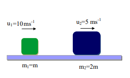
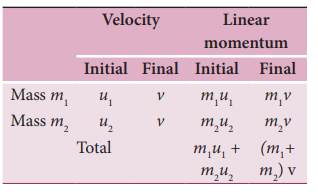

# COLLISIONS

Collision is a common phenomenon that happens around us every now and then. For example, carom, billiards, marbles, etc.,. Collisions can happen between two bodies with or without physical contacts.

Linear momentum is conserved in all collision processes. When two bodies collide, the mutual impulsive forces acting between them during the collision time (∆t) produces a change in their respective momenta. That is, the first body exerts a force



F21 on the second body. From Newton’s third law, the second body exerts a force



F12 on the first body. This causes a change in momentum Dp1 and Dp2 of the first body and second body respectively. Now, the relations could be written as,

  



p F t1 12 (4.44)

  



p F t2 21 (4.45)

Adding equation (4.44) and equation (4.45), we get

      

   

p p F t F t F F t1 2 12 21 12 21     

According to Newton’s third law,  

F F12 21 

   p p1 2 0 

  p p1 2 0  

Dividing both sides by ∆t and taking limit t  0 , we get  

lim 

 t

p p p p 

  

  

0

1 2 1 2 0    

_t d_

_dt_

The above expression implies that the total linear momentum is a conserved quantity. **Note: The momentum is a vector quantity.** Hence, vector addition has to be followed to find the total momentum of the individual bodies in collision.

## Types of Collisions

In any collision process, the total linear momentum and total energy are always conserved whereas the total kinetic energy need not be conserved always. Some part of the initial kinetic energy is transformed to other forms of energy. This is because, the impact of collisions and deformation occurring due to collisions may in general, produce heat, sound, light etc. By taking these effects into account, we classify the types of collisions as follows:

(a) Elastic collision

(b) Inelastic collision

**(a) Elastic collision** 

In a collision, the total initial kinetic energy of the bodies (before collision) is equal to the total final kinetic energy of the bodies (after collision) then, it is called as elastic collision. i.e.,

Total kinetic energy before collision = Total kinetic energy after collision

**(b) Inelastic collision** 

In a collision, the total initial kinetic energy of the bodies (before collision) is not equal to the total final kinetic energy of the bodies (after collision) then, it is called as inelastic collision. i.e.,

Total kinetic energy before collision ≠ Total kinetic energy after collision

_Total kinetic energy before collision_

_Total kinetic e_

 

 

\- _nergy_

_after collision_  

 

\=  _loss in energy_

_during collision_



 



  = DQ

Even though kinetic energy is not conserved but the total energy is conserved. This is because the total energy contains the kinetic energy term and also a term DQ , which includes all the losses that take place during collision. Note that loss in kinetic energy during collision is transformed to another form of energy like sound, thermal, etc. Further, if the two colliding bodies stick together after collision such collisions are known as completely inelastic collision or perfectly inelastic collision. Such a collision is found very often. For example when a clay putty is thrown on a moving vehicle, the clay putty (or Bubblegum) sticks to the moving

vehicle and they move together with the same velocity.

### Elastic collisions in one dimension

Consider two elastic bodies of masses _m_1 and _m_2 moving in a straight line (along positive x direction) on a frictionless horizontal surface as shown in Figure 4.16.

**Figure 4.16** Elastic collision in one dimension

In order to have collision, we assume that the mass _m_1 moves faster than mass _m_2 i.e., _u u_1 2> . For elastic collision, the total linear momentum and kinetic energies of the two bodies before and after collision must remain the same.

From the law of conservation of linear 
momentum, 
Total momentum before collision 
( pi
) = Total momentum after collision ( pf

m u m u m v m v 1 1 2 2 1 1 2 2    (4.46)
Or m u v m v u 1 1 1 2 2 2        (4.47)

Further

For elastic collision,
Total kinetic energy before collision KEi
= Total kinetic energy after collision KEf

1
2
1
2
1
2
1
2 1 1
2
2 2
2
1 1
2
2 2
2 m u   m u m v  m v 
(4.48)
After simplifying and rearranging the
m u v m v u 1 1
2
1
2
2 2
2
2
2
      
Using the formula a b a b a b 2 2         , 
we can rewrite the above equation as 
m u v u v m v u v u 1 1 1 1 1 2 2 2 2 2            
(4.49)
Dividing equation (4.49) by (4.47) gives, 

This means that for any elastic head on collision, the relative speed of the two elastic bodies after the collision has the same magnitude as before collision but in opposite direction. Further note that this result is independent of mass.

Rewriting the above equation for v1 and v2 ,

v v u u1 2 2 1   (4.51)

Or

v u v u2 1 1 2   (4.52)

**To find the final velocities v1 and v2:** Substituting equation (4.52) in equation (4.47) gives the velocity of m1 as

m u v m u v u u1 1 1 2 1 1 2 2       m u v m u v u1 1 1 2 1 1 22      m u m v m u m v m u1 1 1 1 2 1 2 1 2 22   

m u m u m u m v m v1 1 2 1 2 2 1 1 2 12   

m m u m u m m v1 2 1 2 2 1 2 12     

or v m m m m

u m m m

u1 1 2

1 2 1

2

1 2 2

2 

 



 



  

 

 



 

(4.53)  

Similarly, by substituting (4.51) in equation (4.47) or substituting equation (4.53) in equation (4.52), we get the final velocity of m2 as

v m m m

u m m m m

u2 1

1 2 1

2 1

1 2 2

2 

 

 



  

 



 



  (4.54)

**Case 1:** 

When bodies has the same mass i.e., m1 = m2,

equation (4.53) ⇒ v u m m

u1 1 2

2 20 2

2    



 



 

v u1 2= (4.55)

equation (4.54) ⇒ v m m

u u2 1

1 1 2

2 2

0 

 



    

v u2 1= (4.56)

The equations (4.55) and (4.56) show that in one dimensional elastic collision, when two bodies of equal mass collide after the collision their velocities are exchanged.

**Case 2:** When bodies have the same mass i.e., m1 = m2 and second body (usually called target) is at rest (u2 = 0),

By substituting m m1 2= and u2 0= in equations (4.53) and equations (4.54) we get,

from equation (4.53) ⇒ v1 0= (4.57)

from equation (4.54) ⇒ v u2 1= (4.58)

Equations (4.57) and (4.58) show that when the first body comes to rest the second

|    v mv  uv11 1 22 22 | uu(4.50)22 |
|------|------|------|
| mu  vu11 |
| muu uu111112 | v mv vvu  Rearranging,vv1 222221 |

  

body moves with the initial velocity of the first body.

**Case 3:**

The first body is very much lighter than the second body

m m m m1 2

1

2

1 ,  

 

then the ratio m m

1

2

≈ 0

and also if the target is at rest u2 0  Dividing numerator and denominator of

equation (4.53) by m2, we get

v

m m m m

u m m

1

1

2

1

2

1 1

2

1

1

2

1 0









   





   

 





   





   

 

v u1 1 0 1 0 1

  

  

  

v u1 1  (4.59)

Similarly,

Dividing numerator and denominator of equation (4.54) by m2, we get

v

m m

m m

u

m m

m m

2

1

2

1

2

1

1

2

1

2

2

1

1

1 0







   





   

 







   





   

 

v u

m m

m m

2 1

1

2

1

2

0 1

1 0   









   





   

 

v2 0= (4.60)

The equation (4.59) implies that the first body which is lighter returns back  

(rebounds) in the opposite direction with the same initial velocity as it has a negative sign. The equation (4.60) implies that the second body which is heavier in mass continues to remain at rest even after collision. For example, if a ball is thrown at a fixed wall, the ball will bounce back from the wall with the same velocity with which it was thrown but in opposite direction.

**Case 4:**

The second body is very much lighter than the first body

m m m m2 1

2

1

1 ,  

 

then the ratio m m

2

1

≈ 0

and also if the target is at rest u2 0  Dividing numerator and denominator of

equation (4.53) by m1, we get

v

m m m m

u

m m m m

1

2

1

2

1

1

2

1

2

1

1

1

2

1 0









   





   

 





   





   

 

v u1 1 1 0 1 0

0 1 0

0  

  

   

   

   

v u1 1= (4.61)

Similarly,

Dividing numerator and denominator of equation (4.58) by m1, we get

v m m

u

m m

m m

2 2

1

1

2

1

2

1

2

1

1

1 0







 





 

 







   





   

 

v u2 1 2

1 0 

   

  

v u2 12= (4.62)

| m2 |
|------|
| m1 |

| m1 |
|------|
| m2 |

| m1 |
|------|
| m2 |

| 2m2 |
|------|
| m1 |

| m2 |
|------|
| m1 |

| m2 |
|------|
| m1 |

|  1m1 |
|------|
| m2 |
  

The equation (4.61) implies that the first body which is heavier continues to move with the same initial velocity. The equation (4.62) suggests that the second body which is lighter will move with twice the initial velocity of the first body. It means that the lighter body is thrown away from the point of collision.

**EXAMPLE 4.20**

A lighter particle moving with a speed of 10 m s-1 collides with an object of double its mass moving in the same direction with half its speed. Assume that the collision is a one dimensional elastic collision. What will be the speed of both particles after the collision?

**_Solution_**

Let the mass of the first body be m which moves with an initial velocity, u1 = 10 m s-1. Therefore, the mass of second body is _2m_ and its initial velocity is u2 = 1

2 u1 =1

2 10 1m s-( ) ,

Then, the final velocities of the bodies can be calculated from the equation (4.53) and equation (4.54)

v m m

m m u m

m m u1

1 2

1 2 1

2

1 2 2

2 

 



 



  

 

 



   

v m m m m

m m m1

2 2

10 2 2 2

5  

  

   

 

  

  

v1 1 3

10 4 3

5 10 20 3

10 3

   

    

 

   

  

v ms1 13 33 .

v m m m

u m m m m

u2 1

1 2 1

2 1

1 2 2

2 

 

 



  

 



 



 

v m m m

m m m m2

2 2

10 2 2

5 

  

   

 

  

  

v2 2 3

10 1 3

5 20 5 3

25 3

   

    

 

   

 

v ms2 18 33 .

As the two speeds v1 and v2 are positive, they move in the same direction with the velocities, 3.33 m s−1 and 8.33 m s−1 respectively.

### Perfect inelastic collision

In a perfectly inelastic or completely inelastic collision, the objects stick together permanently after collision such that they move with common velocity. Let the two bodies with masses _m_1 and _m_2 move with initial velocities _u_1 and _u_2 respectively before collision. After perfect inelastic collision both the objects move together with a common velocity v as shown in Figure (4.17).

Since, the linear momentum is conserved during collisions,

_m_1 _u_1 _+ m_2 _u_2 _\= (m_1_\+ m_2) v

|  mm 2   22 mv   10   mm 2   mm 2 1   4  10 20v   10    5 1  3   3  3vm 33. 3 s1 2m   mmv    u   mm   mm1 1 2m   2mmv   1 10   212  mm 2  1  mm 212 122  1  20  5v   10    5  2  3   3  3vm 83. 3 s2As t he t wo s peeds v  an d v  a re pthey m ove in t 2 he s ame dir ectiothe v elocities, 3.33 m s  a nd 8.33 m srespectively.1 2−1 | 5103 u 5 2253 |
|------|------|

**Figure 4.17** Perfect inelastic collision in one dimension

The common velocity can be computed by

v m u m u

m m 

  

1 1 2 2

1 2

(4.63)

**EXAMPLE 4.21**

A bullet of mass 50 g is fired from below into a suspended object of mass 450 g. The object rises through a height of 1.8 m with bullet remaining inside the object. Find the speed of the bullet. Take g = 10 ms-2.

**_Solution_**

m1 = 50 g = 0.05 kg; m2 = 450 g = 0.45 kg  

The speed of the bullet is u1. The second body is at rest u2 0 . Let the common velocity of the bullet and the object after the bullet is embedded into the object is v.

v m u m u m m

   

1 1 2 2

1 2

v u u= + × +( ) =0 05 0 45 0

0 05 0 45 0 05 0 50

1 1

. ( . ) . .

.

.

The combined velocity is the initial velocity for the vertical upward motion of the combined bullet and the object. From second equation of motion,

v gh= 2

v    2 10 1 8 36.

v ms 6 1

Substituting this in the above equation, the value of u1 is

6 0 05 0 50 1=

.

. u or _u_1

0 50 0 05

6 10 6    . .

_u_1 160 ms

### Loss of kinetic energy in perfect inelastic collision

In perfectly inelastic collision, the loss in kinetic energy during collision is transformed to another form of energy like sound, thermal, heat, light etc. Let KEi

be the total kinetic energy before collision and KEf be the total kinetic energy after collision.

Total kinetic energy before collision,

  

KE_i_ \= +1 2

1 21 1

2 2 2

2m u m u (4.64)

Total kinetic energy after collision,

KE _f_ \= +( )1 2 1 2

2m m v (4.65)

Then the loss of kinetic energy is Loss of _KE_, ∆_Q_ \= _KE KEi f_\-

∆_Q_ = 1 2

1 2

1 21 1

2 2 2

2 1 2

2m u m u m m v    (4.66)

Substituting equation (4.63) in equation (4.66), and on simplifying (expand v by using the algebra a b a b    

2 2 2 2_ab_, we get

Loss of KE, ∆_Q_ = 1 2

1 2

1 2 1 2

2m m m m



 



   _u u_

(4.67)

### Coefficient of restitution (e)

Suppose we drop a rubber ball and a plastic ball on the same floor. The rubber ball will bounce back higher than the plastic ball. This is because the loss of kinetic energy for an elastic ball is much lesser than the loss of kinetic energy for a plastic ball. The amount of kinetic energy after the collision of two bodies, in general, can be measured through a dimensionless number called the coefficient of restitution (COR).

_It is defined as the ratio of velocity of separation (relative velocity) after collision to the velocity of approach (relative velocity) before collision, i.e.,_  

e velocity of separation after collision velocity of appro

  

ach before collision v v u u

  

  

( )2 1

1 2 (4.68)

In an elastic collision, we have obtained the velocity of separation is equal to the velocity of approach i.e.,

u u v v e v v u u1 2 2 1

2 1

1 2

1-( ) = -( ) → = - -( ) =( )

This implies that, coefficient of restitution for an elastic collision, e =1. Physically, it means that there is no loss of kinetic energy after the collision. So, the body bounces back with the same kinetic energy which is usually called as perfect elastic.

In any real collision problems, there will be some losses in kinetic energy due to collision, which means e is not always equal to unity. If the ball is perfectly plastic, it will never bounce back and therefore their separation of velocity is zero after the collision. Hence, the value of coefficient of restitution, e = 0.

In general, the coefficient of restitution for a material lies between 0 1< <e .

**EXAMPLE 4.22**

Show that the ratio of velocities of equal masses in an inelastic collision when one

of the masses is stationary is _v v_

_e e_

1

2

1 1

  

.

**_Solution_**

e velocity of separation after collision velocity of appro

  

ach before collision 
|  of separation after collision |
|------|------|------|------|
| velocitye velocity()vv uu2112 |
|  of appr oaachb efore collision |
| (4.68) |

  

   

   

 ( ) ( ) ( )v v

u u v v u

v v u

2 1

1 2

2 1

1

2 1

10

  **_�_**v v eu2 1 1 (1)

From the law of conservation of linear momentum,

m u m v m v u v v1 1 2 1 1 2    **_�_** (2)

Using the equation (2) for u1
 in (1), we get
v v e v v 2 1 1 2     
On simplification, we get
v
v
e
e