# WORK, ENERGY AND POWER

---
**Learning Objectives**
*********
In this unit, student is exposed to
• definition of work
• work done by a constant and a variable force
• various types of energy
• law of conservation of energy
• vertical circular motion
• definition of power
• various types of collisions

---

# INTRODUCTION

The term work is used in diverse contexts in daily life. It refers to both physical as well as mental work. In fact, any activity can generally be called as work. But in Physics, the term work is treated as a physical quantity with a precise definition. Work is said to be done by the force when the force applied on a body displaces it. To do work, energy is required. In simple words, energy is defined as the ability to do work. Hence, work and energy are equivalents and have same dimension. Energy, in Physics exists in different forms such as mechanical, electrical, thermal, nuclear and so on. Many machines consume one form of energy and deliver energy in a different form. In this chapter we deal mainly with mechanical energy and its two types namely kinetic energy and potential energy. The next
quantity in this sequence of discussion is the rate of work done or the rate of energy delivered. The rate of work done is called _power_. A powerful strike in cricket refers to a hit on the ball at a fast rate. This chapter aims at developing a good understanding of these three physical quantities namely work, energy and power and their physical significance.

###  WORK

Let us consider a force ( F), acting on a body which moves it by a displacement in some direction (d r ) as shown in Figure 4.1

The expression for work done (W) by the force on the body is mathematically written as,

$$ W F = \cdot dr $$

 (4.1)

**Figure 4.1** Work done by a force

Here, the product 

F dr⋅ is a _scalar product (or dot product). The scalar product of two_ vectors is a scalar (refer section 2.5.1). Thus, work done is a scalar quantity. It has only magnitude and no direction. In SI system, unit of work done is N m (or) joule (J). Its dimensional formula is [ML2T-2].

The equation (4.1) is,

$$ W = F dr \cos(\theta) $$

which can be realised using Figure 4.2 (as $$ \vec{a} \cdot \vec{b} = ab \cos(\theta) $$
) where, θ is the angle between applied force and the displacement of the body.

**Figure 4.3 Different cases of zero work done** 

The work done by the force depends on the force (F), displacement (dr) and the angle (θ) between them.

**Figure 4.2** Calculating work done.

Work done is zero in the following cases.

(i) **When the force is zero (F = 0)**. 
For example, a body moving on a horizontal smooth frictionless surface will continue to do so as no force (not even friction) is acting along the plane. (This is an ideal situation.)

(ii) **When the displacement is zero (dr = 0).** 
For example, when force is applied on a rigid wall it does not produce any displacement. Hence, the work done is zero as shown in Figure. 4.3(a).

  

(iii) **When the force and displacement are perpendicular  (θ = 90o to each other.** 

when a body moves on a horizontal direction, the gravitational force (mg) does no work on the body, since it acts at right angles to the displacement as shown in Figure 4.3(b). In circular motion the centripetal force does not do work on the object moving on a circle as it is always perpendicular to the displacement as shown in Figure 4.3(c).

For a given force (F) and displacement (dr), the angle (θ) between them decides the value of work done as consolidated in Table 4.1.

There are many examples for the negative work done by a force. In a football game, the goalkeeper catches the ball coming towards him by applying a force such that the force is applied in a direction opposite to that of the motion of the ball till it comes to rest in his hands. During the time of applying the force, he does a negative work on the ball as shown in Figure 4.4. We will discuss many more situations of negative work further in this unit.

**EXAMPLE 4.1**

A box is pulled with a force of 25 N to produce a displacement of 15 m. If the angle between the force and displacement is 30o, find the work done by the force.

**_Solution_**

Force, $F = 25 \, \text{N}$ 

Displacement, $dr = 15 \, \text{m}$ 

Angle between $F$ and $dr$, $\theta = 30^\circ$ 

Work done, $W = F \cdot dr \cdot \cos(\theta)$ 

$W = 25 \cdot 15 \cdot \cos(30^\circ)$ 

$W = \frac{25 \cdot 15 \cdot \sqrt{3}}{2} \, \text{J}$

### Work done by a constant force

When a constant force F acts on a body, the small work done (dW) by the force in producing a small displacement dr is given by the relation,

$$ dW = F \cos(\theta) \, dr $$
(4.3)

The total work done in producing a displacement from initial position ri to final position **rf** is,

$$ W = \int_{r_i}^{r_f} dW $$         
(4.4)
$$ W = \int_{r_i}^{r_f} F \cos(\theta) \, dr $$
$$ W = (F \cos(\theta) r) \bigg|_{r_i}^{r_f} $$

The graphical representation of the work done by a constant force is shown in Figure 4.5. The area under the graph shows the work done by the constant force.

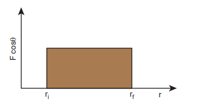
**Figure 4.5** Work done by the constant force

**EXAMPLE 4.2**

An object of mass 2 kg falls from a height of 5 m to the ground. What is the work done by the gravitational force on the object? (Neglect air resistance; Take g = 10 m s-2)

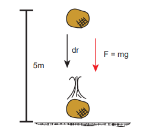

**Solution**

In this case the force acting on the object is downward gravitational force mg. This is a constant force.

Work done by gravitational force is

$$ W = \int_{r_i}^{r_f} F \, dr $$
$$ W = \int_{r_i}^{r_f} F \cos(\theta) \, dr $$ 
$$ = (mg \cos(\theta)) (r_f - r_i) $$

The object also moves downward which is in the direction of gravitational force ($\vec{F} = mg\vec{g}$) as shown in figure. Hence, the angle between them is $\theta = 0^\circ$; $\cos(0) = 1$ and the displacement, $r_f - r_i = 5m$.

$$ W = mg (r_f - r_i) $$
$$ W = 2 \times 10 \times 5 = 100 \, \text{J} $$

The work done by the gravitational force on the object is positive.

**EXAMPLE 4.3**

An object of mass _m_\=1 kg is sliding from top to bottom in the frictionless inclined plane of inclination angle 0=30o and the length of inclined plane is 10 m as shown in the figure. Calculate the work done by gravitational force and normal force on the object. Assume acceleration due to gravity, g = 10 m s-2

**Solution**

We calculated in the previous chapter that the acceleration experienced by the object in the inclined plane as = g sinθ .

According to Newton’s second law, the force acting on the mass along the inclined plane F = mg sinθ. Note that this force is constant throughout the motion of the mass.

The work done by the parallel component of gravitational force mg e (mg sin θ) is given by

$$ W = \vec{F} \cdot \vec{r} \, dr \, \cos(\phi) $$

where $\phi$ is the angle between the force ($mg \sin(\theta)$) and the direction of motion ($dr$). In this case, force ($mg \sin(\theta)$) and the displacement ($r_f - r_i$) are in the same direction. Hence $\phi = 0$ and $\cos(\phi) = 1$.
  

W = F dr = (mg sin length of inclined plane)θ × () (dr) (dr = length of the inclined place)

W = 1 × 10 × sin (30°) × 10 = 100 1 2

50 _J_

The component mg cos θ and the normal force _N_ are perpendicular to the direction of motion of the object, so they do not perform any work.

**EXAMPLE 4.4**

If an object of mass 2 kg is thrown up from the ground reaches a height of 5 m and falls back to the Earth (neglect the air resistance). Calculate

(a) The work done by gravity when the object reaches 5 m height

(b) The work done by gravity when the object comes back to Earth

(c) Total work done by gravity both in upward and downward motion and mention the physical significance of the result.

**Solution**

When the object goes up, the displacement points in the upward direction whereas the gravitational force acting on the object points in downward direction. Therefore, the angle between gravitational force and displacement of the object is 180°.

(a) The work done by gravitational force in the upward motion.

Given that dr = 5m and F =mg

$$ W_{up} = F \, dr \, \cos(\theta) = mg \, dr \, \cos(180^\circ) $$

$$ W_{up} = 2 \times 10 \times 5 \times (-1) = -100 \, \text{J} $$

(b) When the object falls back, both the gravitational force and displacement of the object are in the same direction. This implies that the angle between gravitational force and displacement of the object is 0°.

$$ W_{down} = F \, dr \, \cos(0^\circ) $$
$$2 \times 10^5 \times (1) = 100 \, \text{joule} \quad [\cos 0° = 1]$$

(c) The total work done by gravity in the entire trip (upward and downward motion)

 $$W_{\text{total}} = W_{\text{up}} + W_{\text{down}} = -100 \, \text{joule} + 100 \, \text{joule} = 0$$

It implies that the gravity does not transfer any energy to the object. When the object is thrown upwards, the energy is transferred to the object by the external agency, which means that the object gains some energy. As soon as it comes back and hits the Earth, the energy gained by the object is transferred to the surface of the Earth (i.e., dissipated to the Earth).

**EXAMPLE 4.5**

A weight lifter lifts a mass of 250 kg with a force 5000 N to the height of 5 m.

(a) What is the workdone by the weight lifter?

(b) What is the workdone by the gravity? (c) What is the net workdone on the object?

**Solution** 

(a) When the weight lifter lifts the mass,force and displacement are in the same direction, which means that the angle between them $$\theta = 0^\circ$$. Therefore, the work done by the weight lifter,

$$W_{\text{weight lifter}} = F_w h \cos \theta = F_w h (\cos 0^\circ) = 5000 \times 5 \times (1) = 25,000 \, \text{joule} = 25 \, \text{kJ}$$

(b) When the weight lifter lifts the mass, the gravity acts downwards which means that the force and displacement are in opposite direction. Therefore, the angle between them  1800

$$W_{\text{gravity}} = F_g h \cos \theta = mgh(\cos 180^\circ) = 250 \times 10 \times 5 \times (-1) = -12,500 \, \text{joule} = -12.5 \, \text{kJ}$$

(c) The net workdone (or total work done) on the object

 $$W_{\text{net}} = W_{\text{weight lifter}} + W_{\text{gravity}} = 25 \, \text{kJ} - 12.5 \, \text{kJ} = +12.5 \, \text{kJ}$$

### Work done by a variable force

When the component of a variable force F acts on a body, the small work done (dW) by the force in producing a small displacement dr is given by the relation

$$
dW = F \cos \theta \, dr
$$[F cos θ is the component of the variable force F\]

where, F and θ are variables. The total work done for a displacement from initial position ri to final position rf is given by the relation,

$$
W = \int_{ri}^{rf} dW = \int_{ri}^{rf} F \cos \theta \, dr
$$

A graphical representation of the work done by a variable force is shown in Figure 4.6. The area under the graph is the work done by the variable force.

**Figure 4.6** Work done by a variable force

**EXAMPLE 4.6**

A variable force F = k x2 acts on a particle which is initially at rest. Calculate the work done by the force during the displacement of the particle from x = 0 m to x = 4 m. (Assume the constant k =1 N m-2)

**Solution**

Work done,

$$
W = \int_{xi}^{xf} F(x) \, dx = k \int_{0}^{4} x^2 \, dx = \frac{64}{3} \, \text{N m}
$$

## ENERGY

Energy is defined as the capacity to do work_. In other words, work done is the manifestation of energy. That is why work and energy have the same dimension (ML2T-2)

**Work** ⇔ **Energy**  

The important aspect of energy is that for an isolated system, the sum of all forms of energy i.e., the total energy remains the same in any process irrespective of whatever internal changes may take place. This means that the energy disappearing in one form reappears in another form. This is known as the law of conservation of energy. In this chapter we shall take up only the mechanical energy for discussion.

In a broader sense, mechanical energy is classified into two types

1\. Kinetic energy 

2\. Potential energy

The energy possessed by a body due to its motion is called kinetic energy. The energy possessed by the body by virtue of its position is called potential energy._

The SI unit of energy is the same as that of work done i.e., N m (or) joule (J). The dimension of energy is also the same as that of work done. It is given by [ML2T-2]. The other units of energy and their SI equivalent values are given in Table 4.2.

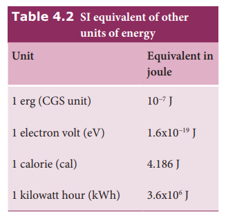

### Kinetic energy

Kinetic energy is the energy possessed by a body by virtue of its motion_. All moving objects have kinetic energy. A body that is in motion has the ability to do work. For example a hammer kept at rest on a nail does not push the nail into the wood. Whereas the same hammer when it strikes the nail, draws the nail into the wood as shown in Figure 4.7. Kinetic energy is measured by the amount of work that the body can perform before it comes to rest. The amount of work done by a moving body depends both on the mass of the body and the magnitude of its velocity. A body which is not in motion does not have kinetic energy.

### Work–Kinetic Energy Theorem

Work and energy are equivalents. This is true in the case of kinetic energy also. To prove this, let us consider a body of mass m at rest on a frictionless horizontal surface.

The work (W) done by the constant force (F) for a displacement (s) in the same direction is,

W Fs= (4.7)

The constant force is given by the equation,

F ma= (4.8)

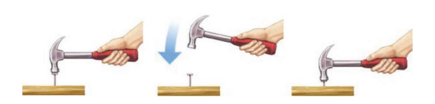
**Figure 4.7** Demonstration of kinetic en  

The third equation of motion (refer section 2.10.3) can be written as,

$$
v^2 = u^2 + 2as
$$

$$
a = \frac{v^2 - u^2}{2s}
$$

Substituting for a in equation (4.8),

$$
F = m \left( \frac{v^2 - u^2}{2s} \right)
$$ (4.9)

Substituting equation (4.9) in (4.7),

$$
W = m \left( \frac{v^2}{2s} \cdot s \right) - m \left( \frac{u^2}{2s} \cdot s \right)
$$
$$
W = \frac{1}{2} m v^2 - \frac{1}{2} m u^2
$$

(4.10)

**The expression for kinetic energy:**

The expression for kinetic energy:

The term ($$\frac{1}{2} m v^2 $$) in the above equation is the kinetic energy of the body of mass \( m \) moving with velocity \( v \). 

So, the kinetic energy (KE) can be expressed as:

$$
KE = \frac{1}{2} m v^2
$$

(4.11)

Kinetic energy of the body is always positive. From equations (4.10) and (4.11)

$$
\Delta KE = \frac{1}{2} m v^2 - \frac{1}{2} m u^2 \tag{4.12}
$$

Thus, 
$$
W = \Delta KE
$$

The expression on the right hand side (RHS) of equation (4.12) is the change in kinetic energy (∆KE) of the body.

This implies that the work done by the _force on the body changes the kinetic energy of the body. This is called work-kinetic energy theorem._

**The work-kinetic energy theorem implies the following.**

1\. If the work done by the force on the body is positive then its kinetic energy increases.

2\. If the work done by the force on the body is negative then its kinetic energy decreases.

3\. If there is no work done by the force on the body then there is no change in its kinetic energy, which means that the body has moved at constant speed provided its mass remains constant.

### Relation between Momentum and Kinetic Energy

Consider an object of mass \( m \) moving with a velocity vector $( \mathbf{v} $). Then its linear momentum is $( \mathbf{p} = m \mathbf{v} $) and its kinetic energy, $( KE = \frac{1}{2} m v^2 $).

So, the kinetic energy (KE) can be expressed as:

$$
KE = \frac{1}{2} m v^2 = \frac{1}{2} m ( \mathbf{v} \cdot \mathbf{v} ) \tag{4.13}
$$'

Multiplying both the numerator and denominator of equation (4.13) by mass, m

$$
KE = \frac{1}{2} m^2 \left( \mathbf{v} \cdot \mathbf{v} \right) / m
 = 
 \\ \frac{1}{2} (m \mathbf{v}) \cdot (m \mathbf{v}) / m
 \\ = \frac{1}{2} \mathbf{p} \cdot \mathbf{p} / m \\ = \frac{p^2}{2m}

$$ (4.14)

where p is the magnitude of the momentum. The magnitude of the linear momentum can be obtained by

$$
p = \sqrt{2m (\text{KE})} \ 
$$      
(4.15)

Note that if kinetic energy and mass are given, only the magnitude of the momentum can be calculated but not the direction of momentum. It is because the kinetic energy and mass are scalars.

**EXAMPLE 4.7**

Two objects of masses 2 kg and 4 kg are moving with the same momentum of 20 kg m s-1.

(a) Will they have same kinetic energy? 

(b) Will they have same speed?

**Solution**

(a) The kinetic energy of the mass is given by:

$$
KE = \frac{p^2}{2m}
$$

For an object of mass 2 kg, the kinetic energy (`KE1`) is calculated as follows:

$$
KE1 = \frac{20^2}{2 \times 2} = \frac{400}{4} = 100 \, \text{J}
$$
For an object of mass 4 kg, the kinetic energy (`KE2`) is calculated as follows:

$$
KE2 = \frac{20^2}{2 \times 4} = \frac{400}{8} = 50 \, \text{J}
$$

Note that 
$$
KE1 \neq KE2
$$
 i.e., even though both are having the same momentum, the kinetic energy of both masses is not the same. The kinetic energy of the heavier object has lesser kinetic energy than smaller mass. It is because the kinetic energy is inversely proportional to the mass (_KE_ _m_ ∝ 1 ) for a given momentum.

(b) As the momentum, _p_ = _mv_, the two objects will not have same speed.

### Potential Energy

The potential energy of a body is associated with its position and configuration with respect to its surroundings. This is because the various forces acting on the body also depends on position and configuration.

“Potential energy of an object at a point P is defined as the amount of work done by an external force in moving the object at constant velocity from the point O (initial location) to the point P (final location). At initial point O potential energy can be taken as zero.

Mathematically, _potential energy_ is defined as
$$
U = \int \mathbf{F} \cdot d\mathbf{r} \tag{4.16}
$$

where the limit of integration ranges from initial location point O to final location point P.

We have various types of potential energies. Each type is associated with a particular force. For example,

(i) The energy possessed by the body due to gravitational force gives rise to gravitational potential energy.  

(ii) The energy due to spring force and other similar forces give rise to elastic potential energy.

(iii) The energy due to electrostatic force on charges gives rise to electrostatic potential energy.

We will learn more about conservative forces in the section 4.2.7. Now, we continue to discuss more about gravitational potential energy and elastic potential energy.

### Potential energy near the surface of the Earth

The gravitational potential energy (U) at some height _h_ is equal to the amount of work required to take the object from ground to that height _h_ with constant velocity.

Let us consider a body of mass _m_ being moved from ground to the height h against the gravitational force as shown in Figure 4.8.

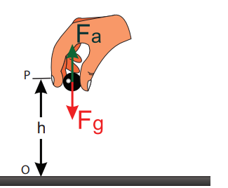
**Figure 4.8** Gravitational potential energy The gravitational force _Fg_ acting on the body is, m ˆ= −

 _gF g j_ (as the force is in y direction, unit vector ĵ is used). Here, negative sign implies that the force is acting

vertically downwards. In order to move the body without acceleration (or with constant velocity), an external applied force  _Fa_ equal in magnitude but opposite to that of gravitational force _Fg_ has to be applied on the body i.e.,

 

F Fa g  . This implies that m ˆ= +

 _aF g j. The positive sign implies that_ the applied force is in vertically upward direction. Hence, when the body is lifted up its velocity remains unchanged and thus its kinetic energy also remains constant.

The gravitational potential energy (U) at some height _h_ is equal to the amount of work required to take the object from the ground to that height _h_.

U F dr ‚ h

a   





_F dra_ . cos 0

θ (4.17)

Since the displacement and the applied force are in the same upward direction, the angle between them,   0 . Hence, cos0 10 = and 

F mga = and dr dr

\= .

U mg dr h

  0

(4.18)

U mg r h    

0 _mgh_ (4.19)

Note that the potential energy stored in the object is defined through work done by the external force which is positive. Physically this implies that the agency which is applying the external force is transferring the energy to the object which is then stored as potential energy. If the object is allowed to fall from a height _h_ then the stored potential energy is converted into kinetic energy.  

---
- How can an object move with 
zero acceleration (constant 
velocity) when the external 
force is acting on the object?

It is possible when there is another force which acts exactly opposite to the external applied force. They both cancel each other and the resulting net force becomes zero, hence the object moves with zero acceleration.

• Why should the object be moved at constant velocity when we define potential energy?

If the object does not move at constant velocity, then it will have different velocities at the initial and final locations. According to work- kinetic energy theorem, the external force will impart some extra kinetic energy. But we associate potential energy to the forces like gravitational force, spring force and coulomb force. So the external agency should not impart any kinetic energy when the object is taken from initial to final location.

---

**EXAMPLE 4.8**

An object of mass 2 kg is taken to a height 5 m from the ground _g_  10ms-2 .

(a) Calculate the potential energy stored in the object.

(b) Where does this potential energy come from?

(c) What external force must act to bring the mass to that height?

(d) What is the net force that acts on the object while the object is taken to the height ‘h’?

  

**Solution**

(a) The potential energy U _m g h_\=  = 2 10 5× × = 100 J

Here the positive sign implies that the energy is stored on the mass.

(b) This potential energy is transferred from external agency which applies the force on the mass.

(c) The external applied force 

Fa which takes the object to the height 5 m is  

F Fa g 

  F mg j mg ja = - -( ) =

where, j represents unit vector along vertical upward direction.

(d) From the definition of potential energy, the object must be moved at constant velocity. So the net force acting on the object is zero.

 

_F Fg a_  0

### Elastic Potential Energy

When a spring is elongated, it develops a restoring force. The potential energy possessed _by a spring due to a deforming force which stretches or compresses the spring is termed as elastic potential energy. The work done by_ the applied force against the restoring force of the spring is stored as the elastic potential energy in the spring.

Consider a spring-mass system. Let us assume a mass, _m_ lying on a smooth  

horizontal table as shown in Figure 4.9. Here, _x_ = 0 is the equilibrium position. One end of the spring is attached to a rigid wall and the other end to the mass.

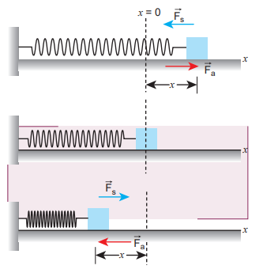

**Figure 4.9** Potential energy of the spring (elastic potential energy)

As long as the spring remains in equilibrium position, its potential energy is zero. Now an external force
_F_ a is applied so that it is stretched by a distance (_x_) in the direction of the force.

There is a restoring force called spring force _F_ s developed in the spring which tries to bring the mass back to its original position. This applied force and the spring force are equal in magnitude but opposite in direction i.e., F Fa s  . According Hooke’s law, the restoring force developed in the spring is
F ks   _x_ (4.20)

The negative sign in the above expression implies that the spring force is always opposite to that of displacement x and k

is the force constant. Therefore applied force is Fa _\=_ +k _x . The positive sign implies_ that the applied force is in the direction of displacement _x_ . The spring force is an example of variable force as it depends on the displacement _x_ . Let the spring be stretched to a small distance _dx_ . The work done by the applied force on the spring to stretch it by a displacement _x_ is stored as elastic potential energy.

U F dr

dx

x

a= =

\=

∫ ∫

∫







_F dr_

_F_

_a_

_x_

_a_

. cos

cos

0

0

θ

θ (4.21)

The applied force  Fa and the displacement dr (i.e., here _d_x ) are in the same direction. As, the initial position is taken as the equilibrium position or mean position, _x_\=0 is the lower limit of integration.

_U k x_

\= ∫ 0

_x x_d (4.22)

U k= 

 



 

_x x_2

0 2

(4.23)

U = 1 2

2_kx_ (4.24)

If the initial position is not zero, and if the mass is changed from position _x_i to _x_f , then the elastic potential energy is

U k f i= -( )1 2

2 2_x x_ (4.25)

From equations (4.24) and (4.25), we observe that the potential energy of the stretched  

spring depends on the force constant _k_ and elongation or compression _x_ .

The potential energy stored in the spring does not depend on the mass that is attached to the spring.

**Note**

The potential energy stored 
in the spring does not 
depend on the mass that is 
attached to the spring.

**Force-displacement graph for a spring** 

Since the restoring spring force and displacement are linearly related as _F = – k x,_ and are opposite in direction, the graph between _F_ and _x_ is a straight line with dwelling only in the second and fourth quadrant as shown in Figure 4.10. The elastic potential energy can be easily calculated by drawing a F - x graph. The shaded area (triangle) is the work done by the spring force.

Area = 1 2

1 2 1 2

2

( )( ) ( ) ( )base height k

k

  



_x x_

_x_

.

Displacement (_x)_

Fo rc

e (-

k_x_ )

0

**Figure 4.10** Force–displacement graph for a spring

**Potential energy-displacement graph for a spring** 

A compressed or extended spring will transfer its stored potential energy into kinetic energy of the mass attached to the spring. The potential energy-displacement graph is shown in Figure 4.11.

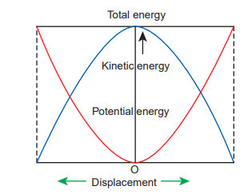
**Figure 4.11** Potential energy– displacement graph for a spring- mass system

In a frictionless environment, the energy gets transferred from kinetic to potential and potential to kinetic repeatedly such that the total energy of the system remains constant. At the mean position,

DKE = DU (4.26)

**EXAMPLE 4.9**

Let the two springs A and B be such that kA>k**B**. On which spring will more work has to be done if they are stretched by the same force?

**Solution**

F = k_A A B Bx k x_\=

_x F kA_

_A_

\= ; _x F kB_

_B_

\=  

The work done on the springs are stored as potential energy in the springs.

UA = 1 2

2_k xA A_ ; UB = 1 2

2_k xB B_

_U U_

_k x k x_

_k F k_

_k F k_

_k_

_k_

_U U_

_k k_

_A_

_B_

_A A_

_B B_

_A A_

_B B_

_A_

_B_

_A_

_B_

_B_

_A_

 



 



 



 



 





2

2

2

2

1

1

kA>kB implies that UB>UA . Thus, more work is done on B than A.

**EXAMPLE 4.10**

A body of mass m is attached to the spring which is elongated to 25 cm by an applied force from its equilibrium position.

(a) Calculate the potential energy stored in the spring-mass system?

(b) What is the work done by the spring force in this elongation?

(c) Suppose the spring is compressed to the same 25 cm, calculate the potential energy stored and also the work done by the spring force during compression. (The spring constant, k = 0.1 N m-1).

**Solution**

The spring constant, k = 0.1 N m-1

The displacement, x = 25 cm = 0.25 m

(a) The potential energy stored in the spring is given by

U = 1 2

1 2

0 1 0 25 0 00312 2k J_x_     . . .

| kA |
|------|
| F |

| 12 |
|------|------|
| k1A |
| kB |

(b) The work done Ws by the spring force 

_F_ s is given by,

( )s s 0 0

W F dr ˆk i (d i)= ⋅ = − ⋅∫ ∫ 





_x x_

_x x_

The spring force 

_Fs_ acts in the negative _x_ direction while elongation acts in the positive _x_ direction.

W k d ks = -( ) = -∫ 0

21 2

_x_

_x x x_

W Js = - × × ( ) = -1 2

0 1 0 25 0 00312. . .

Note that the potential energy is defined through the work done by the external agency. The positive sign in the potential energy implies that the energy is transferred from the agency to the object. But the work done by the restoring force in this case is negative since restoring force is in the opposite direction to the displacement direction. (c) During compression also the potential

energy stored in the object is the same.

U = 1 2

0 00312_kx J_\= . .

Work done by the restoring spring force during compression is given by

Ws = ( ) ( )s 0 0

F .d k îr ˆ. d i= −∫ ∫ 



_x x_

_x x_

In the case of compression, the restoring spring force acts towards positive _x_\-axis and displacement is along negative _x_ direction.

W k d k Js        0

21 2

0 0031 _x_

_x x x_ .  

## Conservative and non- conservative forces

**Conservative force** A force is said to be a conservative force if the work done by or against the force in moving the body depends only on the initial and final positions of the body and not on the nature of the path followed between the initial and final positions.

Let us consider an object at point A on the Earth. It can be taken to another point B at a height _h_ above the surface of the Earth by three paths as shown in Figure 4.12.

Whatever may be the path, the work done against the gravitational force is the same as long as the initial and final positions are the same. This is the reason why gravitational force is a conservative force. Conservative force is equal to the negative gradient of the potential energy. In one dimensional case,

**Figure 4.12** Conservative force

A

B

_F dU dxx_  (4.27)

Examples for conservative forces are elastic spring force, electrostatic force, magnetic force, gravitational force, etc.

**Non-conservative force** A force is said to be non-conservative if the work done by or against the force in moving a body depends upon the path between the initial and final positions. This means that the value of work done is different in different paths.

1\. Frictional forces are non-conservative forces as the work done against friction depends on the length of the path moved by the body.

2\. The force due to air resistance, viscous force are also non-conservative forces as the work done by or against these forces depends upon the velocity of motion.

The properties of conservative and non- conservative forces are summarized in the Table 4.3.

**EXAMPLE 4.11**

Compute the work done by the gravitational force for the following cases
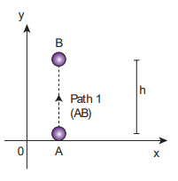
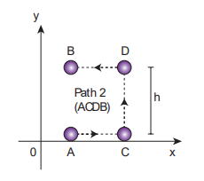

**_Solution_**

Force   _F mg mg_\= -( ) = -j j

Displacement vector _dr dx dy_  = +i j

(As the displacement is in two dimension; unit vectors î and ĵ are used)

(a) Since the motion is only vertical, horizontal displacement component d_x_ is zero. Hence, work done by the force along path 1 (of distance h).

W F dr mg dy

mg dy mgh

A

B

A

B

h

path j j1

0

\= = -( ) ( ) = - = -

∫ ∫

∫

   . .

W F dr F dr F dr F dr A

B

A

C

C

D

D

B

path 2 = = + +∫ ∫ ∫ ∫ 













. . . .

non-conservative forces Non-conservative forces Work done depends upon the path Work done in a round trip is not zero Energy is dissipated as heat energy Work done is not completely recoverable. No such relation exists.

Total work done for path 2 is

  

But

_A_

_C_

_A_

_C_

_F dr mg dx_∫ ∫= -( ) ( ) =    . .j i 0

_C_

_D_

_C_

_D_

_h_

_F dr mg dy_

_mg dy mgh_

∫ ∫

∫

\= -( ) ( ) = - = -

   . .j j

0

_D_

_B_

_D_

_B_

_F dr mg dx_∫ ∫= -( ) -( ) =    . .j i 0

Therefore, the total work done by the force along the path 2 is

_W F dr mgh A_

_B_

path 2    

.

Note that the work done by the conservative force is independent of the path.

**EXAMPLE 4.12**

Consider an object of mass 2 kg moved by an external force 20 N in a surface having coefficient of kinetic friction 0.9 to a distance 10 m. What is the work done by the external force and kinetic friction ? Comment on the result. (Assume g = 10 ms-2)

**_Solution_**

m = 2 kg, d = 10 m, Fext = 20 N, m k = 0.9. When an object is in motion on the horizontal surface, it experiences two forces.

(a) External force, _Fext_ \= 20 N (b) Kinetic friction,

_fk_ = _k mg_    0 9 2 10 18. N_k_ . .  

The work done by the external force _W F dext_    20 10 200J

The work done by the force of kinetic friction _W f dk k_\= = = -( ) × = -18 10 180 J. Here the negative sign implies that the force of kinetic friction is opposite to the direction of displacement.

The total work done on the object _W W Wtotal ext k_\= + = - =200 180 20J J J .

Since the friction is a non-conservative force, out of 200 J given by the external force, the 180 J is lost and it can not be recovered.

### Law of conservation of energy

When an object is thrown upwards its kinetic energy goes on decreasing and consequently its potential energy keeps increasing (neglecting air resistance). When it reaches the highest point its energy is completely potential. Similarly, when the object falls back from a height its kinetic energy increases whereas its potential energy decreases. When it touches the ground its energy is completely kinetic. At the intermediate points the energy is both kinetic and potential as shown in Figure 4.13. When the body reaches the ground the kinetic energy is completely dissipated into some other form of energy like sound, heat, light and deformation of the body etc.

In this example the energy transformation takes place at every point. The sum of kinetic energy and potential energy i.e., the total mechanical energy always remains constant, implying that the total energy is conserved. This is stated as the law of conservation of energy.

**Figure 4.13** Conservation of energy

The law of conservation of energy states that _energy can neither be created nor destroyed. It may be transformed from one form to another but the total energy of an isolated system remains constant._

Figure 4.13 illustrates that, if an object starts from rest at height _h_, the total energy is purely potential energy (U=mgh) and the kinetic energy (KE) is zero at _h_. When the object falls at some distance _y_, the potential energy and the kinetic energy are not zero whereas, the total energy remains same as measured at height _h_. When the object is about to touch the ground, the potential energy is zero and total energy is purely kinetic.

**EXAMPLE 4.13**

An object of mass 1 kg is falling from the height _h_ = 10 m. Calculate

(a) The total energy of an object at h =10 m 

(b) Potential energy of the object when it is at _h_ \= 4 m 

(c) Kinetic energy of the object when it is at _h_ \= 4 m  

(d) What will be the speed of the object when it hits the ground?

(Assume _g_ \=10 m s-2)

**_Solution_**

(a) The gravitational force is a conservative force. So the total energy remains constant throughout the motion. At _h_ \=10 m, the total energy _E_ is entirely potential energy.

_E U mgh_\= = = × × =1 10 10 100 J

(b) The potential energy of the object at _h_ \= 4 m is

_U mgh_    1 10 4 40J

(c) Since the total energy is constant throughout the motion, the kinetic energy at _h_ \= 4 m must be _KE E U_\= = =- -100 40 60J

Alternatively, the kinetic energy could also be found from velocity of the object at 4 m. At the height 4 m, the object has fallen through a height of 6 m.

The velocity after falling 6 m is calculated from the equation of motion,

v gh    2 2 10 6 120 m s-1;

v2 120=

The kinetic energy is KE mv J= = × × =1 2

1 2

1 120 602

J× × =1 120 60

(d) When the object is just about to hit the ground, the total energy is completely kinetic and the potential energy, _U_ \= 0.

E KE mv J= = =1 2

1002

v m KE

1 100 m s= = × = ≈ -2 2 200 14 12 1.

**EXAMPLE 4.14**

A body of mass 100 kg is lifted to a height 10 m from the ground in two different ways as shown in the figure. What is the work done by the gravity in both the cases? Why is it easier to take the object through a ramp?
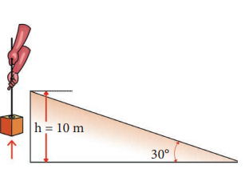
Path (1) straight up
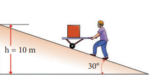
Path (2) along the ramp

**_Solution_**

m = 100 kg, h = 10 m 
Along path (1):_ The minimum force F1 required to move the object to the height of 10 m should

h = 10 m

30°

30°

h = 10 m  

be equal to the gravitational force, _F mg_1 100 10 1000    N

The distance moved along path (1) is, _h_ \=10 m

The work done on the object along path (1) is

_W F h_\= = 1000  10 10 000, J

**Along path (2):**

In the case of the ramp, the minimum force _F_2 that we apply on the object to take it up is not equal to _mg_ , it is rather equal to _mg_ sinθ . mg sin  _mg_ .

Here, angle θ = 30o

Therefore, F2 = mg sinθ = 100 × 10 × sin30o = 100 × 10 × 0.5 = 500 N

Hence, mg sin  _mg_

The path covered along the ramp is,

_l_ = _h m_ sin .30

10 0 5

20 °

\= =

The work done on the object along path 

(2) is, W = F2 _l_ = 500 × 20 = 10,000 J

Since the gravitational force is a conservative force, the work done by gravity on the object is independent of the path taken.

In both the paths the work done by the gravitational force is 10,000 J

Along path (1): more force needs to be applied against gravity to cover lesser distance .

Along path (2): lesser force needs to be applied against the gravity to cover more distance.

As the force needs to be applied along the ramp is less, it is easier to move the object along the ramp.

**EXAMPLE 4.15**

An object of mass m is projected from the ground with initial speed v0.

   Find the speed at height h.

**_Solution_**

Since the gravitational force is conservative; the total energy is conserved throughout the motion.

Initial Final Kinetic energy

Final values of potential energy, kinetic energy and total energy are measured at the height _h_.

By law of conservation of energy, the initial and final total energies are the same.

1 2

1 20

2 2mv mv mgh 

v v gh0 2 2 2 

v v gh 0 2 2

Note that in section (2.11.2) similar result is obtained using kinematic equation based on calculus method. However, calculation through energy conservation method is much easier than calculus method.  

**EXAMPLE 4.16**

An object of mass 2 kg attached to a spring is moved to a distance _x_ \=10 m from its equilibrium position. The spring constant _k_ \=1 N m-1 and assume that the surface is frictionless.

(a) When the mass crosses the equilibrium position, what is the speed of the mass?

(b) What is the force that acts on the object when the mass crosses the equilibrium position and extremum position _x_ = ± 10 m.

**_Solution_**

(a) Since the spring force is a conservative force, the total energy is constant. At _x_ \=10 m, the total energy is purely potential.

E = U = 1 2

1 2

1 10 502 2_k x_ \= × ( ) × ( ) = J

When the mass crosses the equilibrium position _x_  0 , the potential energy

U = 1 2

1 0 0    J

The entire energy is purely kinetic energy at this position.

_E KE mv_\= = =1 2

502 J

The speed

_v KE m_

_ms ms_\= = × = ≈- -2 2 50 2

50 7 071 1.

(b) Since the restoring spring force is F = - kx, when the object crosses the equilibrium position, it experiences no force. Note that at equilibrium position, the object moves very fast. When the object is at _x_ = +10 m (elongation), the force F = − k _x_

F = − (1) (10) = − 10 N. Here the negative sign implies that the force is towards equilibrium i.e., towards negative _x_\-axis and when the object is at _x_ = − 10_m_ (compression), it experiences a forces F = − (1) (− 10) = +10 N. Here the positive sign implies that the force points towards positive _x_\-axis.

The object comes to momentary rest at _x_ = ±10_m_ even though it experiences a maximum force at both these points.

### Motion in a vertical circle

Imagine that a body of mass (m) attached to one end of a massless and inextensible string executes circular motion in a vertical plane with the other end of the string fixed. The length of the string becomes the radius ( _r_ ) of the circular path (Figure 4.14).

Let us discuss the motion of the body by taking the free body diagram (FBD) at a position where the position vector (_r_ ) makes an angle θ with the vertically downward direction and the instantaneous velocity is as shown in Figure 4.14. There are two forces acting on the mass. 1. Gravitational force which acts downward 2. Tension along the string. Applying Newton’s second law on the mass,

In the tangential direction,

mg ma

mg m dv dt

tsin

sin







    

   (4.28)  

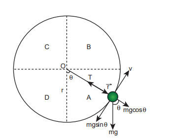

**Figure 4.14** Motion in vertical circle

C B

D

O

r A

T r

θ

θ

v

mgcos θ

mgsinθ mg

where, a dv dt

is tangential retardationt  

In the radial direction,

T mg cos m a

T mg cos mv r

r- =

\- =

θ

θ 2 (4.29)

where, a v rr =

2

is the centripetal acceleration.

The circle can be divided into four sections A, B, C, D for better understanding of the motion. The four important facts to be understood from the two equations are as follows:

(i) The mass is having tangential acceleration (g sin θ) for all values of θ (except θ = 0o), it is clear that this vertical cirular motion is not a uniform circular motion.

(ii) From the equations (4.28) and (4.29) it is understood that as the magnitude of velocity is not a constant in the course of motion, the tension in the string is also not constant.

| θ TA |
|------|------|------|
| r |
| θ mgcos |

  

(iii) The equation (4.29),T mg cosθ mv r

\= + 2

highlights that in sections A and D

of the circle, for cos is p    

   

2 2 ;

cos is positive     

    2 2

; , the term mg cosθ is always

greater than zero. Hence the tension cannot vanish even when the velocity vanishes.

(iv) The equation (4.29), mv r

T mg cos 2

   ;

further highlights that in sections B

and C of the circle, for cos  2

3 2

     ;

for cos is negative  2

3 2

   

   ; , the second term

is always greater than zero. Hence velocity cannot vanish, even when the tension vanishes.

These points are to be kept in mind while solving problems related to motion in vertical circle.

To start with let us consider only two positions, say the lowest point 1 and the highest point 2 as shown in Figure 4.15 for further analysis. Let the velocity of the body at the lowest point 1 be _v_1, at the highest point 2 be _v_2 and _v_ at any other point. The direction of velocity is tangential to the circular path at all points. Let



_T_1 be the tension in the string at the lowest point and 

_T_2 be the tension at the highest point and 

_T_ be the tension at any other point. Tension at each point acts towards the centre. The tensions and velocities at these two points can be found by applying the law of conservation of energy.

_For the lowest point (1)_ When the body is at the lowest point 1, the gravitational force _m g_ which acts on the  

body (vertically downwards) and another one is the tension



_T_ 1 acting vertically upwards, i.e. towards the centre. From the equation (4.29), we get

T mg mv r1

1 2

  (4.30)

T mv r

mg1 1 2

  (4.31)

V 2

V 1

T 2

T 1

r

2

mg

mg

1

**Figure 4.15** Motion in vertical circle shown for lowest and highest points

**For the highest point (2)**
At the highest point 2, both the gravitational force _mg_ on the body and the tension



_T_2 act downwards, i.e. towards the centre again.

T mg mv

r2 2 2

\+ = (4.32)

T mv

r mg2

2 2

\= - (4.33)

From equations (4.31) and (4.33), it is understood that T T1 2> . The difference in tension T T1 2- is obtained by subtracting equation (4.33) from equation (4.31).

ositive  

is negative  

  

T T mv r

mg mv r

mg1 2 1 2

2 2

     

 



 

\= mv r

mg mv r

mg1 2

2 2

  

T T m r

v v mg1 2 1 2

2 2 2     (4.34)

The term v v1 2 2 2  can be found easily by applying law of conservation of energy at point 1 and also at point 2.

---
**NOTE**

The tension will not do any work on the mass as the tension and the direction of motion is always perpendicular.

The gravitational force is doing work on the mass, as it is a conservative force the total energy of the mass is conserved throughout the motion.

Total Energy at point 1(_E_1) is same as the total energy at a point 2 (_E_2)

_E_1 = _E_2 (4.35)

Potential Energy at point 1, _U_1 0= (by taking reference as point 1)

Kinetic Energy at point 1, _KE_1 1 21

2 = mv

Total Energy at point 1, _E U KE_1 1 1 0= + = +

_E U KE_1 1 1 1 2

1 20 1

2 1 2

\= + = + =mv mv

Similarly, Potential Energy at point 2, _U_2 2= mg r)( (h is 2r from point 1)

Kinetic Energy at point 2, _KE_2 2 21

2 = mv

Total Energy at point 2, _E U KE_2 2 2 2= =+ m

_U KE_ 2 2

2 2 2 1= = ++ mg r mv  

From the law of conservation of energy given in equation (4.35), we get

1 2

2 1 21

2 2 2mv mgr mv 

After rearranging,

1 2

21 2

2 2m v v mgr  

v v gr1 2

2 2 4  (4.36)

Substituting equation (4.36) in equation (4.34) we get,

T T m r

gr mg1 2 4 2- = \[ \] +

Therefore, the difference in tension is

T T mg1 2 6  (4.37)

**Minimum speed at the highest point (2)**
The body must have a minimum speed at point 2 otherwise, the string will slack before reaching point 2 and the body will not loop the circle. To find this minimum speed let us take the tension T2 = 0 in equation (4.33).

0 2 2

  mv

r mg

mv r

mg2 2

\=

v rg2 2 =

v gr2 = (4.38)

1 2

1 21

2 1 2

\=mv mv

2 21

2 +g r mv

The body must have a speed at point 2, v gr2 ≥ to stay in the circular path.

**Minimum speed at the lowest point 1**
To have this minimum speed v gr2   at point 2, the body must have minimum speed also at point 1.

By making use of equation (4.36) we can find the minimum speed at point 1.

v v gr1 2

2 2 4 

Substituting equation (4.38) in (4.36),

v gr gr1 2 4 

v gr1 2 5=

v gr1 5= (4.39)

The body must have a speed at point 1, v gr1 5≥ to stay in the circular path.

From equations (4.38) and (4.39), it is clear that the minimum speed at the lowest point 1 should be 5 times more than the minimum speed at the highest point 2, so that the body loops without leaving the circle.

**EXAMPLE 4.17**

Water in a bucket tied with rope is whirled around in a vertical circle of radius 0.5 m. Calculate the minimum velocity at the lowest point so that the water does not spill from it in the course of motion. (g = 10 ms-2)  

**_Solution_**

Radius of circle r = 0.5 m The required speed at the highest point

_v gr_2 10 0 5 5   . ms-1. The speed at lowest point _v gr gr_1 5 5 5    × 5 = 5 m_s_\-1

## POWER

### Definition of power

Power is a measure of how fast or slow a work is done. Power is defined as the rate of _work done or energy delivered_.

Power P work done W time taken t

      

P W t

\=

_Average power The average power (Pav) is defined as the ratio of the total work done to the total time taken._

P total work done total time takenav 

**Instantaneous power** The instantaneous power (Pinst) is defined as the power delivered at an instant (as time interval approaches zero),

P dW dtinst =

### Unit of power

Power is a scalar quantity. Its dimension is \[ML2T–3\]. The SI unit of power is watt (W), named after the inventor of the steam engine James Watt. One watt is defined as the power _when one joule of work is done in one second_, (1 W = 1 J s–1).

The higher units are kilowatt(kW), megawatt(MW), and Gigawatt(GW).

1kW = 1000 W = 103 watt 1MW = 106 watt

1GW = 109 watt

For motors, engines and some automobiles an old unit of power still commercially in use which is called as the horse-power (hp). We have a conversion for horse-power (hp) into watt (W) which is,

1 hp = 746 W

All electrical goods come with a definite power rating in watt printed on them. A 100 watt bulb consumes 100 joule of electrical energy in one second. The energy measured in joule in terms of power  

in watt and time in second is written as, 1 J =1 W s. When electrical appliances are put in use for long hours, they consume a large amount of energy. Measuring the electrical energy in a small unit watt. second (W s) leads to handling large numerical values. Hence, electrical energy is measured in the unit called kilowatt hour (kWh).

1 electrical unit = 1 kWh = 1 × (103 W) × (3600 s)

1 electrical unit = 3600×103 W s

1 electrical unit = 3.6×106 J

1 kWh = 3.6×106 J

Electricity bills are generated in units of kWh for electrical energy consumption. 1 unit of electrical energy is 1 kWh. (**Note**: kWh is unit of energy and not of power.)

**EXAMPLE 4.18**

Calculate the energy consumed in electrical units when a 75 W fan is used for 8 hours daily for one month (30 days).

**_Solution_**

Power, P = 75 W

Time of usage, t = 8 hour × 30 days = 240 hours

Electrical energy consumed is the product of power and time of usage.

Electrical energy = power × time of usage = P × t

 75 240 watt hour =18000 watt hour

\= =18 18 kilowatt hour kWh

1 1 electrical unit kWh=

Electrical energy unit=18

---
**DO YOU KNOW**

Incandescent lamps glow for 1000 hours. CFL lamps glow for 6000 hours. But LED lamps glow for 50000 hrs (almost 25 years at 5.5 hour per day).

### Relation between power and velocity

The work done by a force 

F for a displacement dr is

W F dr  

 (4.40)

Left hand side of the equation (4.40) can be written as

W dW dW dt

dt  

(multiplied and divided by dt) (4.41)

Since, velocity is  

_v dr dt_

\= ; _dr v dt_ 

\= . Right hand side of the equation (4.40) can be written as

      

      

  











 



F dr F dt F dt_dr dt_

_v v dr dt_

(4.42)  

Substituting equation (4.41) and equation (4.42) in equation (4.40), we get

   dW dt

dt F dt 

_v_

    

   

dW dt

F dt 

_v_ 0

This relation is true for any arbitrary value of dt. This implies that the term within the bracket must be equal to zero, i.e.,

dW dt

F   

_v_ 0

Or

dW dt

F= ⋅ = 

_v P_ (4.43)

**EXAMPLE 4.19**

A vehicle of mass 1250 kg is driven with an acceleration 0.2 ms-2 along a straight level road against an external resistive force 500 N_._ Calculate the power delivered by the vehicle’s engine if the velocity of the vehicle is 30 m _s_\-1 .

**_Solution_**

The vehicle’s engine has to do work against resistive force and make vechile to move with an acceleration. Therefore, power delivered by the vehicle engine is

P = (resistive force + mass × acceleration) (velocity)

P F v F F v P F v F ma v

tot resistive

tot resistive

\= ⋅ = + = ⋅ = +

\-



 



 

( ) ( )

\= (500 N + (1250 kg) × (0.2 _ms_\-2 )) (30 ms-1) = 22.5 kW

**EXAMPLE 4.19**

A vehicle of mass 1250 kg is driven with an acceleration 0.2 ms along a straight le vel road against a n external resistive force 500 N. Calculate t he p ower de livered b y t he vehicle’s engine if th-e v2 elocity of the vehicle is 30 m s . 

**Solution** 

e vehic-1 le’s engine has to do work against resistive f orce a nd m ake v echile t o m ove with a n acce leration.  erefore, p ower delivered by the vehicle engine i

P = (resistive force + mass ×
acceleration) (velocity) 
P F v F F v
P F v F ma v
tot resistive
tot resistive
= ⋅ = +
= ⋅ = +
-
  
  
( )
( )
 = (500 N + (1250 kg) × (0.2 ms-2
))
(30 ms-1
) = 22.5 kW

# COLLISIONS

Collision is a common phenomenon that happens around us every now and then. For example, carom, billiards, marbles, etc.,. Collisions can happen between two bodies with or without physical contacts.

Linear momentum is conserved in all collision processes. When two bodies collide, the mutual impulsive forces acting between them during the collision time (∆t) produces a change in their respective momenta. That is, the first body exerts a force



F21 on the second body. From Newton’s third law, the second body exerts a force



F12 on the first body. This causes a change in momentum Dp1 and Dp2 of the first body and second body respectively. Now, the relations could be written as,

  



p F t1 12 (4.44)

  



p F t2 21 (4.45)

Adding equation (4.44) and equation (4.45), we get

      

   

p p F t F t F F t1 2 12 21 12 21     

According to Newton’s third law,  

F F12 21 

   p p1 2 0 

  p p1 2 0  

Dividing both sides by ∆t and taking limit t  0 , we get  

lim 

 t

p p p p 

  

  

0

1 2 1 2 0    

_t d_

_dt_

The above expression implies that the total linear momentum is a conserved quantity. **Note: The momentum is a vector quantity.** Hence, vector addition has to be followed to find the total momentum of the individual bodies in collision.

## Types of Collisions

In any collision process, the total linear momentum and total energy are always conserved whereas the total kinetic energy need not be conserved always. Some part of the initial kinetic energy is transformed to other forms of energy. This is because, the impact of collisions and deformation occurring due to collisions may in general, produce heat, sound, light etc. By taking these effects into account, we classify the types of collisions as follows:

(a) Elastic collision

(b) Inelastic collision

**(a) Elastic collision** 

In a collision, the total initial kinetic energy of the bodies (before collision) is equal to the total final kinetic energy of the bodies (after collision) then, it is called as elastic collision. i.e.,

Total kinetic energy before collision = Total kinetic energy after collision

**(b) Inelastic collision** 

In a collision, the total initial kinetic energy of the bodies (before collision) is not equal to the total final kinetic energy of the bodies (after collision) then, it is called as inelastic collision. i.e.,

Total kinetic energy before collision ≠ Total kinetic energy after collision

_Total kinetic energy before collision_

_Total kinetic e_

 

 

\- _nergy_

_after collision_  

 

\=  _loss in energy_

_during collision_



 



  = DQ

Even though kinetic energy is not conserved but the total energy is conserved. This is because the total energy contains the kinetic energy term and also a term DQ , which includes all the losses that take place during collision. Note that loss in kinetic energy during collision is transformed to another form of energy like sound, thermal, etc. Further, if the two colliding bodies stick together after collision such collisions are known as completely inelastic collision or perfectly inelastic collision. Such a collision is found very often. For example when a clay putty is thrown on a moving vehicle, the clay putty (or Bubblegum) sticks to the moving

vehicle and they move together with the same velocity.

### Elastic collisions in one dimension

Consider two elastic bodies of masses _m_1 and _m_2 moving in a straight line (along positive x direction) on a frictionless horizontal surface as shown in Figure 4.16.

**Figure 4.16** Elastic collision in one dimension

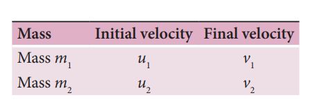

In order to have collision, we assume that the mass _m_1 moves faster than mass _m_2 i.e., _u u_1 2> . For elastic collision, the total linear momentum and kinetic energies of the two bodies before and after collision must remain the same.

From the law of conservation of linear 
momentum, 
Total momentum before collision 
( pi
) = Total momentum after collision ( pf

m u m u m v m v 1 1 2 2 1 1 2 2    (4.46)
Or m u v m v u 1 1 1 2 2 2        (4.47)

Further

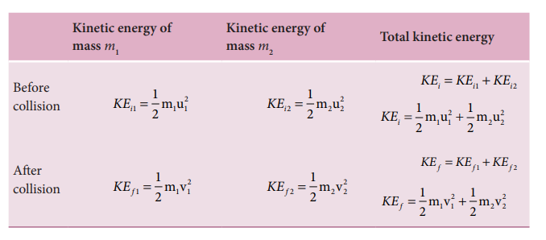

For elastic collision,
Total kinetic energy before collision KEi
= Total kinetic energy after collision KEf

1
2
1
2
1
2
1
2 1 1
2
2 2
2
1 1
2
2 2
2 m u   m u m v  m v 
(4.48)
After simplifying and rearranging the
m u v m v u 1 1
2
1
2
2 2
2
2
2
      
Using the formula a b a b a b 2 2         , 
we can rewrite the above equation as 
m u v u v m v u v u 1 1 1 1 1 2 2 2 2 2            
(4.49)
Dividing equation (4.49) by (4.47) gives, 

This means that for any elastic head on collision, the relative speed of the two elastic bodies after the collision has the same magnitude as before collision but in opposite direction. Further note that this result is independent of mass.

Rewriting the above equation for v1 and v2 ,

v v u u1 2 2 1   (4.51)

Or

v u v u2 1 1 2   (4.52)

**To find the final velocities v1 and v2:** Substituting equation (4.52) in equation (4.47) gives the velocity of m1 as

m u v m u v u u1 1 1 2 1 1 2 2       m u v m u v u1 1 1 2 1 1 22      m u m v m u m v m u1 1 1 1 2 1 2 1 2 22   

m u m u m u m v m v1 1 2 1 2 2 1 1 2 12   

m m u m u m m v1 2 1 2 2 1 2 12     

or v m m m m

u m m m

u1 1 2

1 2 1

2

1 2 2

2 

 



 



  

 

 



 

(4.53)  

Similarly, by substituting (4.51) in equation (4.47) or substituting equation (4.53) in equation (4.52), we get the final velocity of m2 as

v m m m

u m m m m

u2 1

1 2 1

2 1

1 2 2

2 

 

 



  

 



 



  (4.54)

**Case 1:** 

When bodies has the same mass i.e., m1 = m2,

equation (4.53) ⇒ v u m m

u1 1 2

2 20 2

2    



 



 

v u1 2= (4.55)

equation (4.54) ⇒ v m m

u u2 1

1 1 2

2 2

0 

 



    

v u2 1= (4.56)

The equations (4.55) and (4.56) show that in one dimensional elastic collision, when two bodies of equal mass collide after the collision their velocities are exchanged.

**Case 2:** When bodies have the same mass i.e., m1 = m2 and second body (usually called target) is at rest (u2 = 0),

By substituting m m1 2= and u2 0= in equations (4.53) and equations (4.54) we get,

from equation (4.53) ⇒ v1 0= (4.57)

from equation (4.54) ⇒ v u2 1= (4.58)

Equations (4.57) and (4.58) show that when the first body comes to rest the second

|    v mv  uv11 1 22 22 | uu(4.50)22 |
|------|------|------|
| mu  vu11 |
| muu uu111112 | v mv vvu  Rearranging,vv1 222221 |

  

body moves with the initial velocity of the first body.

**Case 3:**

The first body is very much lighter than the second body

m m m m1 2

1

2

1 ,  

 

then the ratio m m

1

2

≈ 0

and also if the target is at rest u2 0  Dividing numerator and denominator of

equation (4.53) by m2, we get

v

m m m m

u m m

1

1

2

1

2

1 1

2

1

1

2

1 0









   





   

 





   





   

 

v u1 1 0 1 0 1

  

  

  

v u1 1  (4.59)

Similarly,

Dividing numerator and denominator of equation (4.54) by m2, we get

v

m m

m m

u

m m

m m

2

1

2

1

2

1

1

2

1

2

2

1

1

1 0







   





   

 







   





   

 

v u

m m

m m

2 1

1

2

1

2

0 1

1 0   









   





   

 

v2 0= (4.60)

The equation (4.59) implies that the first body which is lighter returns back  

(rebounds) in the opposite direction with the same initial velocity as it has a negative sign. The equation (4.60) implies that the second body which is heavier in mass continues to remain at rest even after collision. For example, if a ball is thrown at a fixed wall, the ball will bounce back from the wall with the same velocity with which it was thrown but in opposite direction.

**Case 4:**

The second body is very much lighter than the first body

m m m m2 1

2

1

1 ,  

 

then the ratio m m

2

1

≈ 0

and also if the target is at rest u2 0  Dividing numerator and denominator of

equation (4.53) by m1, we get

v

m m m m

u

m m m m

1

2

1

2

1

1

2

1

2

1

1

1

2

1 0









   





   

 





   





   

 

v u1 1 1 0 1 0

0 1 0

0  

  

   

   

   

v u1 1= (4.61)

Similarly,

Dividing numerator and denominator of equation (4.58) by m1, we get

v m m

u

m m

m m

2 2

1

1

2

1

2

1

2

1

1

1 0







 





 

 







   





   

 

v u2 1 2

1 0 

   

  

v u2 12= (4.62)

| m2 |
|------|
| m1 |

| m1 |
|------|
| m2 |

| m1 |
|------|
| m2 |

| 2m2 |
|------|
| m1 |

| m2 |
|------|
| m1 |

| m2 |
|------|
| m1 |

|  1m1 |
|------|
| m2 |
  

The equation (4.61) implies that the first body which is heavier continues to move with the same initial velocity. The equation (4.62) suggests that the second body which is lighter will move with twice the initial velocity of the first body. It means that the lighter body is thrown away from the point of collision.

**EXAMPLE 4.20**

A lighter particle moving with a speed of 10 m s-1 collides with an object of double its mass moving in the same direction with half its speed. Assume that the collision is a one dimensional elastic collision. What will be the speed of both particles after the collision?

**_Solution_**

Let the mass of the first body be m which moves with an initial velocity, u1 = 10 m s-1. Therefore, the mass of second body is _2m_ and its initial velocity is u2 = 1

2 u1 =1

2 10 1m s-( ) ,

Then, the final velocities of the bodies can be calculated from the equation (4.53) and equation (4.54)

v m m

m m u m

m m u1

1 2

1 2 1

2

1 2 2

2 

 



 



  

 

 



   

v m m m m

m m m1

2 2

10 2 2 2

5  

  

   

 

  

  

v1 1 3

10 4 3

5 10 20 3

10 3

   

    

 

   

  

v ms1 13 33 .

v m m m

u m m m m

u2 1

1 2 1

2 1

1 2 2

2 

 

 



  

 



 



 

v m m m

m m m m2

2 2

10 2 2

5 

  

   

 

  

  

v2 2 3

10 1 3

5 20 5 3

25 3

   

    

 

   

 

v ms2 18 33 .

As the two speeds v1 and v2 are positive, they move in the same direction with the velocities, 3.33 m s−1 and 8.33 m s−1 respectively.

### Perfect inelastic collision

In a perfectly inelastic or completely inelastic collision, the objects stick together permanently after collision such that they move with common velocity. Let the two bodies with masses _m_1 and _m_2 move with initial velocities _u_1 and _u_2 respectively before collision. After perfect inelastic collision both the objects move together with a common velocity v as shown in Figure (4.17).

Since, the linear momentum is conserved during collisions,

_m_1 _u_1 _+ m_2 _u_2 _\= (m_1_\+ m_2) v

|  mm 2   22 mv   10   mm 2   mm 2 1   4  10 20v   10    5 1  3   3  3vm 33. 3 s1 2m   mmv    u   mm   mm1 1 2m   2mmv   1 10   212  mm 2  1  mm 212 122  1  20  5v   10    5  2  3   3  3vm 83. 3 s2As t he t wo s peeds v  an d v  a re pthey m ove in t 2 he s ame dir ectiothe v elocities, 3.33 m s  a nd 8.33 m srespectively.1 2−1 | 5103 u 5 2253 |
|------|------|

**Figure 4.17** Perfect inelastic collision in one dimension

The common velocity can be computed by

v m u m u

m m 

  

1 1 2 2

1 2

(4.63)

**EXAMPLE 4.21**

A bullet of mass 50 g is fired from below into a suspended object of mass 450 g. The object rises through a height of 1.8 m with bullet remaining inside the object. Find the speed of the bullet. Take g = 10 ms-2.

**_Solution_**

m1 = 50 g = 0.05 kg; m2 = 450 g = 0.45 kg  

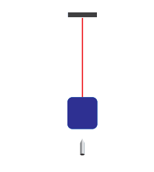

The speed of the bullet is u1. The second body is at rest u2 0 . Let the common velocity of the bullet and the object after the bullet is embedded into the object is v.

v m u m u m m

   

1 1 2 2

1 2

v u u= + × +( ) =0 05 0 45 0

0 05 0 45 0 05 0 50

1 1

. ( . ) . .

.

.

The combined velocity is the initial velocity for the vertical upward motion of the combined bullet and the object. From second equation of motion,

v gh= 2

v    2 10 1 8 36.

v ms 6 1

Substituting this in the above equation, the value of u1 is

6 0 05 0 50 1=

.

. u or _u_1

0 50 0 05

6 10 6    . .

_u_1 160 ms

### Loss of kinetic energy in perfect inelastic collision

In perfectly inelastic collision, the loss in kinetic energy during collision is transformed to another form of energy like sound, thermal, heat, light etc. Let KEi

be the total kinetic energy before collision and KEf be the total kinetic energy after collision.

Total kinetic energy before collision,

  

KE_i_ \= +1 2

1 21 1

2 2 2

2m u m u (4.64)

Total kinetic energy after collision,

KE _f_ \= +( )1 2 1 2

2m m v (4.65)

Then the loss of kinetic energy is Loss of _KE_, ∆_Q_ \= _KE KEi f_\-

∆_Q_ = 1 2

1 2

1 21 1

2 2 2

2 1 2

2m u m u m m v    (4.66)

Substituting equation (4.63) in equation (4.66), and on simplifying (expand v by using the algebra a b a b    

2 2 2 2_ab_, we get

Loss of KE, ∆_Q_ = 1 2

1 2

1 2 1 2

2m m m m



 



   _u u_

(4.67)

### Coefficient of restitution (e)

Suppose we drop a rubber ball and a plastic ball on the same floor. The rubber ball will bounce back higher than the plastic ball. This is because the loss of kinetic energy for an elastic ball is much lesser than the loss of kinetic energy for a plastic ball. The amount of kinetic energy after the collision of two bodies, in general, can be measured through a dimensionless number called the coefficient of restitution (COR).

_It is defined as the ratio of velocity of separation (relative velocity) after collision to the velocity of approach (relative velocity) before collision, i.e.,_  

e velocity of separation after collision velocity of appro

  

ach before collision v v u u

  

  

( )2 1

1 2 (4.68)

In an elastic collision, we have obtained the velocity of separation is equal to the velocity of approach i.e.,

u u v v e v v u u1 2 2 1

2 1

1 2

1-( ) = -( ) → = - -( ) =( )

This implies that, coefficient of restitution for an elastic collision, e =1. Physically, it means that there is no loss of kinetic energy after the collision. So, the body bounces back with the same kinetic energy which is usually called as perfect elastic.

In any real collision problems, there will be some losses in kinetic energy due to collision, which means e is not always equal to unity. If the ball is perfectly plastic, it will never bounce back and therefore their separation of velocity is zero after the collision. Hence, the value of coefficient of restitution, e = 0.

In general, the coefficient of restitution for a material lies between 0 1< <e .

**EXAMPLE 4.22**

Show that the ratio of velocities of equal masses in an inelastic collision when one

of the masses is stationary is _v v_

_e e_

1

2

1 1

  

.

**_Solution_**

e velocity of separation after collision velocity of appro

  

ach before collision 
|  of separation after collision |
|------|------|------|------|
| velocitye velocity()vv uu2112 |
|  of appr oaachb efore collision |
| (4.68) |

  

   

   

 ( ) ( ) ( )v v

u u v v u

v v u

2 1

1 2

2 1

1

2 1

10

  **_�_**v v eu2 1 1 (1)

From the law of conservation of linear momentum,

m u m v m v u v v1 1 2 1 1 2    **_�_** (2)

Using the equation (2) for u1
 in (1), we get
v v e v v 2 1 1 2     
On simplification, we get
v
v
e
e