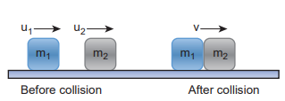

[comment]: <> (katex Header)


# COLLISIONS

Collision is a common phenomenon that happens around us every now and then. For example, carom, billiards, marbles, etc. Collisions can happen between two bodies with or without physical contacts.

Linear momentum is conserved in all collision processes. When two bodies collide, the mutual impulsive forces acting between them during the collision time ($$\Delta$$ t) produces a change in their respective momenta. That is, the first body exerts a force $$ \vec{F}$$_$${21}$$ on the second body. From Newton’s third law, the second body exerts a force $$\vec{F}$$_$${12}$$ on the first body. This causes a change in momentum $$\Delta \vec{p}_1$$ and $$\Delta$$ $$\vec{p}$$_2 of the first body and second body respectively. Now, the relations could be written as,

$$ \Delta $$ $$\vec{p} $$_1 = $$\vec{F}$$_ $${12}$$ $$\cdot \Delta t \quad $$ (4.44)

$$ \Delta \vec{p} $$ _2 = $$ \vec{F} $$ _ $$ {21} $$ $$ \cdot \Delta t \quad (4.45) $$

Adding equation (4.44) and equation (4.45), we get

$$\Delta$$ $$\vec{p}$$_1 + $$\Delta$$ $$\vec{p}$$_2 = $$\vec{F}$$_{12} $$\cdot$$ $$\Delta$$ t + $$\vec{F}$$_$${21}$$ $$\cdot$$ $$\Delta$$ t $$\quad $$ (4.46)

According to Newton’s third law, $$\vec{F}$$_$${12}$$ = -$$\vec{F}$$_$${21}$$, so $$\Delta \vec{p}_1 + \Delta \vec{p}_2 = \vec{0}$$.

Dividing both sides by $$\Delta t$$ and taking the limit $$\Delta t \to 0$$, we get

$$
\lim_{{\Delta t \to 0}} \frac{\Delta \vec{p}}{\Delta t} = \vec{0}
$$

This implies that the total linear momentum is a conserved quantity. **Note: The momentum is a vector quantity.** Hence, vector addition has to be followed to find the total momentum of the individual bodies in collision.

\section*{Types of Collisions}

In any collision process, the total linear momentum and total energy are always conserved whereas the total kinetic energy need not be conserved always. Some part of the initial kinetic energy is transformed to other forms of energy. This is because the impact of collisions and deformation occurring due to collisions may, in general, produce heat, sound, light, etc. By taking these effects into account, we classify the types of collisions as follows:

(a) Elastic collision

(b) Inelastic collision

\subsection*{(a) Elastic collision}

In a collision, the total initial kinetic energy of the bodies (before collision) is equal to the total final kinetic energy of the bodies (after collision), then it is called an elastic collision, i.e.,

Total kinetic energy before collision = Total kinetic energy after collision

\subsection*{(b) Inelastic collision}

In a collision, the total initial kinetic energy of the bodies (before collision) is not equal to the total final kinetic energy of the bodies (after collision), then it is called an inelastic collision, i.e.,

Total kinetic energy before collision $$\neq$$ Total kinetic energy after collision

Total kinetic energy before collision $$-$$ Total kinetic energy after collision $$= \Delta Q$$

Even though kinetic energy is not conserved, the total energy is conserved. This is because the total energy contains the kinetic energy term and also a term $$\Delta Q$$, which includes all the losses that take place during collision. Note that loss in kinetic energy during collision is transformed into another form of energy like sound, thermal, etc. Further, if the two colliding bodies stick together after collision, such collisions are known as completely inelastic collision or perfectly inelastic collision. Such a collision is found very often. For example, when a clay putty is thrown on a moving vehicle, the clay putty (or Bubblegum) sticks to the moving vehicle and they move together with the same velocity.

\begin{figure}[h]
    \centering
    \includegraphics[width=0.5\textwidth]{image-24.png}
    \caption{Elastic collision illustration}
\end{figure}

\subsection*{Elastic collisions in one dimension}

Consider two elastic bodies of masses $$m_1$$ and $$m_2$$ moving in a straight line (along the positive x direction) on a frictionless horizontal surface as shown in Figure 4.16.

\begin{figure}[h]
    \centering
    \includegraphics[width=0.5\textwidth]{image-25.png}
    \caption{Elastic collision in one dimension}
\end{figure}

In order to have a collision, we assume that mass $$m_1$$ moves faster than mass $$m_2$$, i.e., $$u_1 > u_2$$. For elastic collision, the total linear momentum and kinetic energies of the two bodies before and after collision must remain the same.

$$
m_1u_1 + m_2u_2 = m_1v_1 + m_2v_2 \quad (4.47)
$$

Further,

$$
\frac{1}{2}m_1u_1^2 + \frac{1}{2}m_2u_2^2 = \frac{1}{2}m_1v_1^2 + \frac{1}{2}m_2v_2^2 \quad (4.48)
$$

After simplifying and rearranging the equations,

$$
m_1u_1v_1 + m_2u_2v_2 = m_1v_1^2 + m_2v_2^2 \quad (4.49)
$$

Dividing equation (4.49) by (4.47) gives,

$$
\frac{v_1}{u_1} = \frac{u_1 - u_2}{v_2 - v_1}
$$

This means that for any elastic head-on collision, the relative speed of the two elastic bodies after the collision has the same magnitude as before the collision but in the opposite direction. Further note that this result is independent of mass.

Rewriting the above equation for $$v_1$$ and $$v_2$$,

$$
\frac{v_2 - v_1}{u_1} = \frac{u_1 - u_2}{u_2} \quad (4.51)
$$

Or

$$
\frac{v_1}{u_2} = \frac{u_1 - u_2}{u_1} \quad (4.52)
$$

\textbf{To find the final velocities $$v_1$$ and $$v_2$$:} Substituting equation (4.52) in equation (4.47) gives the velocity of $$m_1$$ as

$$
v_1 = u_1(u_1 - u_2)/(u_1 - u_2) = u_1
$$

Similarly, by substituting (4.51) in equation (4.47) or substituting equation (4.52) in equation (4.52), we get the final velocity of $$m_2$$ as

$$
v_2 = u_1(u_1 - u_2)/u_1 = u_2
$$

\textbf{Case 1:}

When bodies have the same mass, i.e., $$m_1 = m_2$$,

$$
v_1 = u_1 - u_2 \quad (4.55)
$$

$$
v_2 = u_1 - u_2 \quad (4.56)
$$

The equations (4.55) and (4.56) show that in one-dimensional elastic collision, when two bodies of equal mass collide, after the collision, their velocities are exchanged.

\textbf{Case 2:} When bodies have the same mass, i.e., $$m_1 = m_2$$, and the second body (usually called target) is at rest ($$u_2 = 0$$),

By substituting $$m_1 = m_2$$ and $$u_2 = 0$$ in equations (4.53) and equations (4.54), we get,

from equation (4.53) $$\Rightarrow v_1 = 0$$ (4.57)

from equation (4.54) $$\Rightarrow v_2 = u_1$$ (4.58)

Equations (4.57) and (4.58) show that when the first body comes to rest, the second body moves with the initial velocity of the first body.

\textbf{Case 3:}

The first body is very much lighter than the second body, $$m_1 \ll m_2$$, and also if the target is at rest, $$u_2 = 0$$. Dividing numerator and denominator of equation (4.53) by $$m_2$$, we get

$$
v_1 = \frac{u_1(u_1 - u_2)}{u_1} = u_1 - u_2
$$

Similarly,
Dividing numerator and denominator of equation (4.54) by $$m^2$$, we get

$$\frac{v}{m} = \frac{u}{m_1} - \frac{u_1}{m_2}$$

The equation (4.59) implies that the first body which is lighter returns back in the opposite direction with the same initial velocity as it has a negative sign. The equation (4.60) implies that the second body which is heavier in mass continues to remain at rest even after collision. For example, if a ball is thrown at a fixed wall, the ball will bounce back from the wall with the same velocity with which it was thrown but in the opposite direction.

**Case 4:**

The second body is very much lighter than the first body, $$\frac{m_2}{m_1} \approx 0$$ and also if the target is at rest $$u_2 = 0$$, then

Dividing numerator and denominator of equation (4.53) by $$m_1$$, we get

$$\frac{v}{m} = \frac{u}{m_1} - \frac{u_1}{m_2}$$

Similarly,

Dividing numerator and denominator of equation (4.58) by $$m_1$$, we get

$$\frac{v}{m} = \frac{u}{m_1} - \frac{u_1}{m_2}$$

The equation (4.61) implies that the first body which is heavier continues to move with the same initial velocity. The equation (4.62) suggests that the second body which is lighter will move with twice the initial velocity of the first body. It means that the lighter body is thrown away from the point of collision.

**EXAMPLE 4.20**

A lighter particle moving with a speed of $$10 \, \text{m/s}$$ collides with an object of double its mass moving in the same direction with half its speed. Assume that the collision is a one-dimensional elastic collision. What will be the speed of both particles after the collision?

**_Solution_**

Let the mass of the first body be $$m$$ which moves with an initial velocity, $$u_1 = 10 \, \text{m/s}$$. Therefore, the mass of the second body is $$2m$$ and its initial velocity is $$u_2 = \frac{1}{2} u_1 = \frac{1}{2} \cdot 10 \, \text{m/s} = 5 \, \text{m/s}$$. Then, the final velocities of the bodies can be calculated from equation (4.53) and equation (4.54).

For the first body:

$$\frac{v}{m} = \frac{u}{m} - \frac{u_1}{2m} = \frac{10}{m} - \frac{5}{m} = \frac{5}{m}$$

$$v_1 = 3 \cdot \frac{10}{3} \, \text{m/s} = 10 \, \text{m/s}$$

For the second body:

$$\frac{v}{2m} = \frac{u}{2m} - \frac{u_1}{m} = \frac{10}{2m} - \frac{10}{m} = \frac{5}{m} - \frac{10}{m} = -\frac{5}{m}$$

$$v_2 = 3 \cdot \frac{5}{3} \, \text{m/s} = 5 \, \text{m/s}$$

As the two speeds $$v_1$$ and $$v_2$$ are positive, they move in the same direction with the velocities, $$3.33 \, \text{m/s}$$ and $$8.33 \, \text{m/s}$$ respectively.

## Perfect inelastic collision

In a perfectly inelastic or completely inelastic collision, the objects stick together permanently after collision such that they move with common velocity. Let the two bodies with masses $$m_1$$ and $$m_2$$ move with initial velocities $$u_1$$ and $$u_2$$ respectively before collision. After a perfect inelastic collision, both objects move together with a common velocity $$v$$ as shown in Figure (4.17).

Since the linear momentum is conserved during collisions,

$$m_1 u_1 + m_2 u_2 = (m_1 + m_2) v$$

**Figure 4.17** Perfect inelastic collision in one dimension

The common velocity can be computed by

$$v = \frac{m_1 u_1 + m_2 u_2}{m_1 + m_2}$$

**EXAMPLE 4.21**

A bullet of mass 50 g is fired from below into a suspended object of mass 450 g. The object rises through a height of 1.8 m with the bullet remaining inside the object. Find the speed of the bullet. Take $$g = 10 \, \text{m/s}^2$$.

**_Solution_**

$$m_1 = 50 \, \text{g} = 0.05 \, \text{kg}$$; $$m_2 = 450 \, \text{g} = 0.45 \, \text{kg}$$

The speed of the bullet is $$u_1$$. The second body is at rest, $$u_2 = 0$$. Let the common velocity of the bullet and the object after the bullet is embedded into the object be $$v$$.

$$v = \frac{m_1 u_1 + m_2 u_2}{m_1 + m_2} = \frac{0.05 \cdot u_1}{0.05 + 0.45} = \frac{0.05 \cdot u_1}{0.5} = 0.1 u_1$$

The combined velocity is the initial velocity for the vertical upward motion of the combined bullet and the object. From the second equation of motion,

$$v^2 = u^2 + 2gh$$

$$0.1^2 u_1^2 = u_1^2 + 2 \cdot 10 \cdot 1.8$$

Simplifying,

$$0.01 u_1^2 = u_1^2 + 36$$

$$0.01 u_1^2 - u_1^2 = 36$$

$$-0.99 u_1^2 = 36$$

$$u_1^2 = \frac{36}{-0.99}$$

$$u_1 = \sqrt{\frac{36}{-0.99}}$$

$$u_1 \approx -60.61 \, \text{m/s}$$

### Loss of kinetic energy in perfect inelastic collision

In a perfectly inelastic collision, the loss in kinetic energy during collision is transformed into another form of energy like sound, thermal, heat, light, etc. Let $$KE_i$$ be the total kinetic energy before collision and $$KE_f$$ be the total kinetic energy after collision.

Total kinetic energy before collision,

$$KE_i = \frac{1}{2} m_1 u_1^2 + \frac{1}{2} m_2 u_2^2$$

Total kinetic energy after collision,

$$KE_f = \frac{1}{2} (m_1 + m_2) v^2$$

Then the loss of kinetic energy is Loss of $$KE$$, $$\Delta Q = KE_i - KE_f$$

$$\Delta Q = \frac{1}{2} m_1 u_1^2 + \frac{1}{2} m_2 u_2^2 - \frac{1}{2} (m_1 + m_2) v^2$$

Substituting equation (4.63) in equation (4.66), and on simplifying (expand v by using the algebra $$a^2 - b^2 = (a + b)(a - b)$$), we get

Loss of KE, $$\Delta Q = \frac{1}{2} m_1 u_1^2 - \frac{1}{2} m_2 u_2^2$$

## Coefficient of restitution (\(e\))

Suppose we drop a rubber ball and a plastic ball on the same floor. The rubber ball will bounce back higher than the plastic ball. This is because the loss of kinetic energy for an elastic ball is much less than the loss of kinetic energy for a plastic ball. The amount of kinetic energy after the collision of two bodies, in general, can be measured through a dimensionless number called the coefficient of restitution (COR).

It is defined as the ratio of velocity of separation (relative velocity) after collision to the velocity of approach (relative velocity) before collision, i.e.,

$$e = \frac{\text{velocity of separation after collision}}{\text{velocity of approach before collision}} = \frac{v - u}{u_1 - u_2}$$

In an elastic collision, we have obtained that the velocity of separation is equal to the velocity of approach, i.e.,

$$v - u = u_1 - u_2$$

This implies that the coefficient of restitution for an elastic collision, $$e = 1$$. Physically, it means that there is no loss of kinetic energy after the collision, and the bodies bounce back with the same kinetic energy, which is usually called perfect elastic collision.

In any real collision problems, there will be some losses in kinetic energy due to the collision, which means $$e$$ is not always equal to unity. If the collision is perfectly plastic, the bodies will never bounce back, and therefore, their separation velocity is zero after the collision. Hence, the value of the coefficient of restitution, $$e = 0$$.

In general, the coefficient of restitution for a material lies between $$0 < e < 1$$.

**EXAMPLE 4.22**

Show that the ratio of velocities of equal masses in an inelastic collision when one of the masses is stationary is

$$\frac{v}{u} = \frac{e}{1 + e}$$

e = \(\frac{v - u}{u_1 - u_2}\)

e \(\frac{v - u}{u_1 - u_2}\)

$$\frac{v}{u} = \frac{e}{1 + e}$$