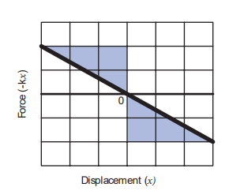

[comment]: <> (katex Header)


## ENERGY

Energy is defined as the capacity to do work_. In other words, work done is the manifestation of energy. That is why work and energy have the same dimension (ML2T-2)

**Work** ⇔ **Energy**  

The important aspect of energy is that for an isolated system, the sum of all forms of energy i.e., the total energy remains the same in any process irrespective of whatever internal changes may take place. This means that the energy disappearing in one form reappears in another form. This is known as the law of conservation of energy. In this chapter we shall take up only the mechanical energy for discussion.

In a broader sense, mechanical energy is classified into two types

1\. Kinetic energy 

2\. Potential energy

The energy possessed by a body due to its motion is called kinetic energy. The energy possessed by the body by virtue of its position is called potential energy._

The SI unit of energy is the same as that of work done i.e., N m (or) joule (J). The dimension of energy is also the same as that of work done. It is given by [ML2T-2]. The other units of energy and their SI equivalent values are given in Table 4.2.

### Kinetic energy

Kinetic energy is the energy possessed by a body by virtue of its motion_. All moving objects have kinetic energy. A body that is in motion has the ability to do work. For example a hammer kept at rest on a nail does not push the nail into the wood. Whereas the same hammer when it strikes the nail, draws the nail into the wood as shown in Figure 4.7. Kinetic energy is measured by the amount of work that the body can perform before it comes to rest. The amount of work done by a moving body depends both on the mass of the body and the magnitude of its velocity. A body which is not in motion does not have kinetic energy.

### Work–Kinetic Energy Theorem

Work and energy are equivalents. This is true in the case of kinetic energy also. To prove this, let us consider a body of mass m at rest on a frictionless horizontal surface.

The work (W) done by the constant force (F) for a displacement (s) in the same direction is,

W Fs= (4.7)

The constant force is given by the equation,

F ma= (4.8)

**Figure 4.7** Demonstration of kinetic en  

The third equation of motion (refer section 2.10.3) can be written as,

$$
v^2 = u^2 + 2as
$$

$$
a = \frac{v^2 - u^2}{2s}
$$

Substituting for a in equation (4.8),

$$
F = m \left( \frac{v^2 - u^2}{2s} \right)
$$ (4.9)

Substituting equation (4.9) in (4.7),

$$
W = m \left( \frac{v^2}{2s} \cdot s \right) - m \left( \frac{u^2}{2s} \cdot s \right)
$$
$$
W = \frac{1}{2} m v^2 - \frac{1}{2} m u^2
$$

(4.10)

**The expression for kinetic energy:**

The expression for kinetic energy:

The term ($$\frac{1}{2} m v^2 $$) in the above equation is the kinetic energy of the body of mass \( m \) moving with velocity \( v \). 

So, the kinetic energy (KE) can be expressed as:

$$
KE = \frac{1}{2} m v^2
$$

(4.11)

Kinetic energy of the body is always positive. From equations (4.10) and (4.11)

$$
\Delta KE = \frac{1}{2} m v^2 - \frac{1}{2} m u^2 \tag{4.12}
$$

Thus, 
$$
W = \Delta KE
$$

The expression on the right hand side (RHS) of equation (4.12) is the change in kinetic energy (∆KE) of the body.

This implies that the work done by the _force on the body changes the kinetic energy of the body. This is called work-kinetic energy theorem._

**The work-kinetic energy theorem implies the following.**

1\. If the work done by the force on the body is positive then its kinetic energy increases.

2\. If the work done by the force on the body is negative then its kinetic energy decreases.

3\. If there is no work done by the force on the body then there is no change in its kinetic energy, which means that the body has moved at constant speed provided its mass remains constant.

### Relation between Momentum and Kinetic Energy

Consider an object of mass \( m \) moving with a velocity vector $( \mathbf{v} $). Then its linear momentum is $( \mathbf{p} = m \mathbf{v} $) and its kinetic energy, $( KE = \frac{1}{2} m v^2 $).

So, the kinetic energy (KE) can be expressed as:

$$
KE = \frac{1}{2} m v^2 = \frac{1}{2} m ( \mathbf{v} \cdot \mathbf{v} ) \tag{4.13}
$$'

Multiplying both the numerator and denominator of equation (4.13) by mass, m

$$
KE = \frac{1}{2} m^2 \left( \mathbf{v} \cdot \mathbf{v} \right) / m
 = 
 \\ \frac{1}{2} (m \mathbf{v}) \cdot (m \mathbf{v}) / m
 \\ = \frac{1}{2} \mathbf{p} \cdot \mathbf{p} / m \\ = \frac{p^2}{2m}

$$ (4.14)

where p is the magnitude of the momentum. The magnitude of the linear momentum can be obtained by

$$
p = \sqrt{2m (\text{KE})} \ 
$$      
(4.15)

Note that if kinetic energy and mass are given, only the magnitude of the momentum can be calculated but not the direction of momentum. It is because the kinetic energy and mass are scalars.

**EXAMPLE 4.7**

Two objects of masses 2 kg and 4 kg are moving with the same momentum of 20 kg m s-1.

(a) Will they have same kinetic energy? 

(b) Will they have same speed?

**Solution**

(a) The kinetic energy of the mass is given by:

$$
KE = \frac{p^2}{2m}
$$

For an object of mass 2 kg, the kinetic energy (`KE1`) is calculated as follows:

$$
KE1 = \frac{20^2}{2 \times 2} = \frac{400}{4} = 100 \, \text{J}
$$
For an object of mass 4 kg, the kinetic energy (`KE2`) is calculated as follows:

$$
KE2 = \frac{20^2}{2 \times 4} = \frac{400}{8} = 50 \, \text{J}
$$

Note that 
$$
KE1 \neq KE2
$$
 i.e., even though both are having the same momentum, the kinetic energy of both masses is not the same. The kinetic energy of the heavier object has lesser kinetic energy than smaller mass. It is because the kinetic energy is inversely proportional to the mass (_KE_ _m_ ∝ 1 ) for a given momentum.

(b) As the momentum, _p_ = _mv_, the two objects will not have same speed.

### Potential Energy

The potential energy of a body is associated with its position and configuration with respect to its surroundings. This is because the various forces acting on the body also depends on position and configuration.

“Potential energy of an object at a point P is defined as the amount of work done by an external force in moving the object at constant velocity from the point O (initial location) to the point P (final location). At initial point O potential energy can be taken as zero.

Mathematically, _potential energy_ is defined as
$$
U = \int \mathbf{F} \cdot d\mathbf{r} \tag{4.16}
$$

where the limit of integration ranges from initial location point O to final location point P.

We have various types of potential energies. Each type is associated with a particular force. For example,

(i) The energy possessed by the body due to gravitational force gives rise to gravitational potential energy.  

(ii) The energy due to spring force and other similar forces give rise to elastic potential energy.

(iii) The energy due to electrostatic force on charges gives rise to electrostatic potential energy.

We will learn more about conservative forces in the section 4.2.7. Now, we continue to discuss more about gravitational potential energy and elastic potential energy.

### Potential energy near the surface of the Earth

The gravitational potential energy (U) at some height _h_ is equal to the amount of work required to take the object from ground to that height _h_ with constant velocity.

Let us consider a body of mass _m_ being moved from ground to the height h against the gravitational force as shown in Figure 4.8.

**Figure 4.8** Gravitational potential energy The gravitational force _Fg_ acting on the body is, m ˆ= −

 _gF g j_ (as the force is in y direction, unit vector ĵ is used). Here, negative sign implies that the force is acting

vertically downwards. In order to move the body without acceleration (or with constant velocity), an external applied force  _Fa_ equal in magnitude but opposite to that of gravitational force _Fg_ has to be applied on the body i.e.,

 

F Fa g  . This implies that m ˆ= +

 _aF g j. The positive sign implies that_ the applied force is in vertically upward direction. Hence, when the body is lifted up its velocity remains unchanged and thus its kinetic energy also remains constant.

The gravitational potential energy (U) at some height _h_ is equal to the amount of work required to take the object from the ground to that height _h_.

U = $$\int \vec{F_a} \cdot d\vec{r} = \int_0^h |\vec{d r}| \cos \theta \tag{4.17}$$

Since the displacement and the applied force are in the same upward direction, the angle between them, $$\theta = 0^{\circ}$$ . Hence, $$\cos(0^{\circ}) = 1$$ and 
$$|\vec{F_a}| = mg$$ 
and $$|\vec{dr}| = dr$$

$$U = mg \int_0^h dr \tag{4.18}$$

$$U = mg[r]_{0}^{h} = mgh$$

Note that the potential energy stored in the object is defined through work done by the external force which is positive. Physically this implies that the agency which is applying the external force is transferring the energy to the object which is then stored as potential energy. If the object is allowed to fall from a height _h_ then the stored potential energy is converted into kinetic energy.  

---
- How can an object move with 
zero acceleration (constant 
velocity) when the external 
force is acting on the object?

It is possible when there is another force which acts exactly opposite to the external applied force. They both cancel each other and the resulting net force becomes zero, hence the object moves with zero acceleration.

• Why should the object be moved at constant velocity when we define potential energy?

If the object does not move at constant velocity, then it will have different velocities at the initial and final locations. According to work- kinetic energy theorem, the external force will impart some extra kinetic energy. But we associate potential energy to the forces like gravitational force, spring force and coulomb force. So the external agency should not impart any kinetic energy when the object is taken from initial to final location.

---

**EXAMPLE 4.8**

An object of mass 2 kg is taken to a height 5 m from the ground $$g = 10 \, \text{m/s}^2$$
 .

(a) Calculate the potential energy stored in the object.

(b) Where does this potential energy come from?

(c) What external force must act to bring the mass to that height?

(d) What is the net force that acts on the object while the object is taken to the height ‘h’?

  

**Solution**

(a) The potential energy $$U = mgh = 2 \times 10 \times 5 = 100 \, \text{J}$$

Here the positive sign implies that the energy is stored on the mass.

(b) This potential energy is transferred from external agency which applies the force on the mass.

(c) The external applied force 

$\vec{F_a}$ which takes the object to the height 5 m is $$\vec{F_a} = - \vec{F_g}$$

$$\vec{F_a} = -(- mg \hat{j}) = mg \hat{j}$$

where, $\hat{j}$ represents unit vector along vertical upward direction.

(d) From the definition of potential energy, the object must be moved at constant velocity. So the net force acting on the object is zero.

$$\vec{F_g} + \vec{F_a} = 0$$

### Elastic Potential Energy

When a spring is elongated, it develops a restoring force. The potential energy possessed _by a spring due to a deforming force which stretches or compresses the spring is termed as elastic potential energy. The work done by_ the applied force against the restoring force of the spring is stored as the elastic potential energy in the spring.

Consider a spring-mass system. Let us assume a mass, _m_ lying on a smooth  

horizontal table as shown in Figure 4.9. Here, _x_ = 0 is the equilibrium position. One end of the spring is attached to a rigid wall and the other end to the mass.

**Figure 4.9** Potential energy of the spring (elastic potential energy)

As long as the spring remains in equilibrium position, its potential energy is zero. Now an external force
$\vec{F_a}$ is applied so that it is stretched by a distance (_x_) in the direction of the force.

There is a restoring force called spring force _F_ s developed in the spring which tries to bring the mass back to its original position. This applied force and the spring force are equal in magnitude but opposite in direction i.e., $\vec{F_a} = -\vec{F_s}$ . According Hooke’s law, the restoring force developed in the spring is
$\vec{F_a} = -\vec{F_s}$       (4.20)

The negative sign in the above expression implies that the spring force is always opposite to that of displacement $\vec{x}$ and k

is the force constant. Therefore applied force is $\vec{F_a} = +k \vec{x}$. The positive sign implies_ that the applied force is in the direction of displacement $\vec{x}$ . The spring force is an example of variable force as it depends on the displacement $\vec{x}$ . Let the spring be stretched to a small distance d $\vec{x}$ . The work done by the applied force on the spring to stretch it by a displacement $\vec{x}$ is stored as elastic potential energy.

U = $$\int \vec{F_a} \cdot d\vec{r} = \int_0^x |\vec{F_a}| |\vec{dr}| \cos \theta = \int_0^x |\vec{F_a}| |\vec{dx}| \cos \theta $$ 

{4.21}

The applied force $\vec{F_a}$ and the displacement d $\vec{r}$ (i.e., here dx) are in the same direction. As, the initial position is taken as the equilibrium position or mean position, _x_\=0 is the lower limit of integration.

$$U = \int_0^x kx \, dx$$
(4.22)
$$U = k \left[\frac{x^2}{2}\right]_0^x$$
(4.23)
$$U = \frac{1}{2} k x^2$$
(4.24)

If the initial position is not zero, and if the mass is changed from position _x_i to _x_f , then the elastic potential energy is

$$U = \frac{1}{2} k (x_f^2 - x_i^2)$$
(4.25)

From equations (4.24) and (4.25), we observe that the potential energy of the stretched  

spring depends on the force constant _k_ and elongation or compression _x_ .

The potential energy stored in the spring does not depend on the mass that is attached to the spring.

**Note**

The potential energy stored 
in the spring does not 
depend on the mass that is 
attached to the spring.

**Force-displacement graph for a spring** 

Since the restoring spring force and displacement are linearly related as _F = – k x,_ and are opposite in direction, the graph between _F_ and _x_ is a straight line with dwelling only in the second and fourth quadrant as shown in Figure 4.10. The elastic potential energy can be easily calculated by drawing a F - x graph. The shaded area (triangle) is the work done by the spring force.

$$ \text{Area} = \frac{1}{2} (\text{base})(\text{height}) = \frac{1}{2} \cdot (x) \cdot (kx) = \frac{1}{2} k x^2 $$

**Figure 4.10** Force–displacement graph for a spring

**Potential energy-displacement graph for a spring** 

A compressed or extended spring will transfer its stored potential energy into kinetic energy of the mass attached to the spring. The potential energy-displacement graph is shown in Figure 4.11.

**Figure 4.11** Potential energy– displacement graph for a spring- mass system

In a frictionless environment, the energy gets transferred from kinetic to potential and potential to kinetic repeatedly such that the total energy of the system remains constant. At the mean position,

DKE = DU (4.26)

**EXAMPLE 4.9**

Let the two springs A and B be such that kA>k**B**. On which spring will more work has to be done if they are stretched by the same force?

**Solution**

 $$F = k_a x_a = k_b x_b$$
 $$x_a = \frac{F}{k_a}$$
 $$x_b = \frac{F}{k_b}$$

kA>kB implies that UB>UA . Thus, more work is done on B than A.

**EXAMPLE 4.10**

A body of mass m is attached to the spring which is elongated to 25 cm by an applied force from its equilibrium position.

(a) Calculate the potential energy stored in the spring-mass system?

(b) What is the work done by the spring force in this elongation?

(c) Suppose the spring is compressed to the same 25 cm, calculate the potential energy stored and also the work done by the spring force during compression. (The spring constant, k = 0.1 N m-1).

**Solution**

The spring constant, k = 0.1 N m-1

The displacement, x = 25 cm = 0.25 m

(a) The potential energy stored in the spring is given by

$$ U = \frac{1}{2}k x^2 = \frac{1}{2} \times 0.1 \times (0.25)^2 = 0.0031 \, \text{J} $$

(b) The work done \(W_s\) by the spring force \(\vec{F}_s\) is given by,

$$
W_s = -\int_{0}^{x} \vec{F}_s \cdot d\vec{r} = -\int_{0}^{x} k\hat{i} \cdot dx\hat{i} = -\int_{0}^{x} kdx
$$

Where:
- \(W_s\) is the work done by the spring force.
- \(\vec{F}_s\) is the spring force.
- \(k\) is the spring constant.

The spring force \(\vec{F}_s\) acts in the negative \(x\) direction while elongation acts in the positive \(x\) direction.

$$
W_k = -\int_{0}^{x} kdx = -\frac{1}{2}kx^2
$$

(c) During compression, the potential energy stored in the object is the same.

The potential energy \(U\) is given by:

$$
U = \frac{1}{2}kx^2
$$

Work done by the restoring spring force during compression is given by:

$$
W_s = -\int_{0}^{x} \vec{F}_s \cdot d\vec{r} = -\int_{0}^{x} k\hat{i} \cdot dx\hat{i} = -\int_{0}^{x} kdx
$$

In the case of compression, the restoring spring force acts towards the positive \(x\)-axis, and displacement is along the negative \(x\) direction.

$$
W_k = -\int_{0}^{x} kdx = -\frac{1}{2}kx^2
$$

## Conservative and non-conservative forces

**Conservative force:** A force is said to be a conservative force if the work done by or against the force in moving the body depends only on the initial and final positions of the body and not on the nature of the path followed between the initial and final positions.

**Non-conservative force:** A force is said to be non-conservative if the work done by or against the force in moving a body depends upon the path between the initial and final positions. This means that the value of work done is different in different paths.

Examples for conservative forces are elastic spring force, electrostatic force, magnetic force, gravitational force, etc.

Examples for non-conservative forces are frictional forces, forces due to air resistance, viscous forces, etc.

The properties of conservative and non-conservative forces are summarized in the Table 4.3.

**EXAMPLE 4.11**

Compute the work done by the gravitational force for the following cases:

Force \(\vec{F}_g = -mg\hat{j}\)

(a) Work done along path 1 (vertical motion):

$$
W = \int_{A}^{B} \vec{F}_g \cdot d\vec{r} = \int_{0}^{h} -mg\hat{j} \cdot dy\hat{j} = -\int_{0}^{h} mgdy = -mgh
$$

(b) Work done along path 2 (horizontal then vertical motion):

For horizontal motion, the force component in the vertical direction is zero, so there is no work done during the horizontal motion. Therefore, the total work done along path 2 is:

$$
W = \int_{A}^{C} \vec{F}_g \cdot d\vec{r} + \int_{C}^{D} \vec{F}_g \cdot d\vec{r} + \int_{D}^{B} \vec{F}_g \cdot d\vec{r} = -\int_{C}^{D} mgdx = -mg(x_D - x_C) = -mg(x_1 - x_0)
$$

Note that the work done by the conservative force is independent of the path.

$$\textbf{EXAMPLE 4.12}$$

Consider an object of mass $$2 \, \text{kg}$$ moved by an external force $$20 \, \text{N}$$ on a surface having a coefficient of kinetic friction $$0.9$$ over a distance $$10 \, \text{m}$$. What is the work done by the external force and kinetic friction? (Assume $$g = 10 \, \text{m/s}^2$$)

$$\textbf{Solution}$$

Given: $$m = 2 \, \text{kg}$$, $$d = 10 \, \text{m}$$, $$F_{\text{ext}} = 20 \, \text{N}$$, $$\mu_k = 0.9$$

When an object is in motion on the horizontal surface, it experiences two forces:

(a) External force, $$F_{\text{ext}} = 20 \, \text{N}$$

(b) Kinetic friction,
$$f_k = \mu_k \cdot mg = 0.9 \cdot 2 \, \text{kg} \cdot 10 \, \text{m/s}^2 = 18 \, \text{N}$$

The work done by the external force:
$$W_{\text{ext}} = F_{\text{ext}} \cdot d = 20 \, \text{N} \cdot 10 \, \text{m} = 200 \, \text{J}$$

The work done by the force of kinetic friction:
$$W_k = -f_k \cdot d = -18 \, \text{N} \cdot 10 \, \text{m} = -180 \, \text{J}$$

Here the negative sign implies that the force of kinetic friction is opposite to the direction of displacement.

The total work done on the object:
$$W_{\text{total}} = W_{\text{ext}} + W_k = 200 \, \text{J} - 180 \, \text{J} = 20 \, \text{J}$$

Since friction is a non-conservative force, out of the $$200 \, \text{J}$$ given by the external force, $$180 \, \text{J}$$ is lost and cannot be recovered.

$$\textbf{EXAMPLE 4.13}$$

An object of mass $$1 \, \text{kg}$$ is falling from a height $$h = 10 \, \text{m}$$. Calculate:

(a) The total energy of an object at $$h = 10 \, \text{m}$$

(b) Potential energy of the object when it is at $$h = 4 \, \text{m}$$

(c) Kinetic energy of the object when it is at $$h = 4 \, \text{m}$$

(d) What will be the speed of the object when it hits the ground? (Assume $$g = 10 \, \text{m/s}^2$$)

$$\textbf{Solution}$$

(a) The gravitational force is a conservative force. So the total energy remains constant throughout the motion. At $$h = 10 \, \text{m}$$, the total energy $$E$$ is entirely potential energy:
$$E = U = mgh = 1 \, \text{kg} \cdot 10 \, \text{m/s}^2 \cdot 10 \, \text{m} = 100 \, \text{J}$$

(b) The potential energy of the object at $$h = 4 \, \text{m}$$ is:
$$U = mgh = 1 \, \text{kg} \cdot 10 \, \text{m/s}^2 \cdot 4 \, \text{m} = 40 \, \text{J}$$

(c) Since the total energy is constant throughout the motion, the kinetic energy at $$h = 4 \, \text{m}$$ must be:
$$KE = E - U = 100 \, \text{J} - 40 \, \text{J} = 60 \, \text{J}$$

Alternatively, the kinetic energy could also be found from the velocity of the object at $$4 \, \text{m}$$. At a height of $$4 \, \text{m}$$, the object has fallen through a height of $$6 \, \text{m}$$.

The velocity after falling $$6 \, \text{m}$$ is calculated from the equation of motion:
$$v = \sqrt{2gh} = \sqrt{2 \cdot 10 \, \text{m/s}^2 \cdot 6 \, \text{m}} = 12 \, \text{m/s}$$

Then, the kinetic energy is:
$$KE = \frac{1}{2}mv^2 = \frac{1}{2} \cdot 1 \, \text{kg} \cdot (12 \, \text{m/s})^2 = 60 \, \text{J}$$

(d) When the object is just about to hit the ground, the total energy is completely kinetic and the potential energy $$U = 0$$. So,
$$KE = \frac{1}{2}mv^2 = 100 \, \text{J}$$

Solving for $$v$$:
$$v = \sqrt{\frac{2 \cdot 100 \, \text{J}}{1 \, \text{kg}}} = 10 \, \text{m/s}$$

So, the speed of the object when it hits the ground is approximately $$10 \, \text{m/s}$$.

$$\textbf{EXAMPLE 4.14}$$

A body of mass $$100 \, \text{kg}$$ is lifted to a height $$10 \, \text{m}$$ from the ground in two different ways as shown in the figure. What is the work done by gravity in both cases? Why is it easier to take the object through a ramp?

Path (1) straight up

Path (2) along the ramp

$$\textbf{Solution}$$

Given: $$m = 100 \, \text{kg}$$, $$h = 10 \, \text{m}$$

Along path (1): The minimum force $$F_1$$ required to move the object to the height of $$10 \, \text{m}$$ should be equal to the gravitational force, $$F_{mg} = 100 \, \text{kg} \cdot 10 \, \text{m/s}^2 = 1000 \, \text{N}$$

The distance moved along path (1) is, $$h = 10 \, \text{m}$$

The work done on the object along path (1) is:
$$W_1 = F_{mg} \cdot h = 1000 \, \text{N} \cdot 10 \, \text{m} = 10,000 \, \text{J}$$

Along path (2): In the case of the ramp, the minimum force $$F_2$$ that we apply on the object to take it up is not equal to $$F_{mg}$$, it is rather equal to $$F_{mg} \cdot \sin \theta$$. Here, angle $$\theta = 30^\circ$$

Therefore, $$F_2 = F_{mg} \cdot \sin \theta = 100 \, \text{kg} \cdot 10 \, \text{m/s}^2 \cdot \sin 30^\circ = 100 \, \text{kg} \cdot 10 \, \text{m/s}^2 \cdot 0.5 = 500 \, \text{N}$$

Hence, the path covered along the ramp is:
$$l = h \cdot \sin 30^\circ = 10 \, \text{m} \cdot 0.5 = 5 \, \text{m}$$

The work done on the object along path (2) is:
$$W_2 = F_2 \cdot l = 500 \, \text{N} \cdot 5 \, \text{m} = 2500 \, \text{J}$$

Since the gravitational force is a conservative force, the work done by gravity on the object is independent of the path taken.

In both paths, the work done by the gravitational force is $$10,000 \, \text{J}$$

Along path (1): More force needs to be applied against gravity to cover a lesser distance.

Along path (2): Lesser force needs to be applied against gravity to cover more distance.

As the force needs to be applied along the ramp is less, it is easier to move the object along the ramp.

$$\textbf{EXAMPLE 4.15}$$

An object of mass $$m$$ is projected from the ground with initial speed $$v_0$$.

Find the speed at height $$h$$.

$$\textbf{Solution}$$

Since the gravitational force is conservative, the total energy is conserved throughout the motion.

Initial Final Kinetic energy

Final values of potential energy, kinetic energy, and total energy are measured at the height $$h$$.

By the law of conservation of energy, the initial and final total energies are the same:

$$\frac{1}{2}mv_0^2 = mgh + \frac{1}{2}mv^2$$

Solving for $$v$$:

$$v^2 = v_0^2 - 2gh$$

$$v = \sqrt{v_0^2 - 2gh}$$

$$\textbf{EXAMPLE 4.16}$$

An object of mass $$2 \, \text{kg}$$ attached to a spring is moved to a distance $$x = 10 \, \text{m}$$ from its equilibrium position. The spring constant $$k = 1 \, \text{N/m}$$ and assume that the surface is frictionless.

(a) When the mass crosses the equilibrium position, what is the speed of the mass?

(b) What is the force that acts on the object when the mass crosses the equilibrium position and extremum position $$x = \pm 10 \, \text{m}$$?

$$\textbf{Solution}$$

(a) Since the spring force is a conservative force, the total energy is constant. At $$x = 10 \, \text{m}$$, the total energy is purely potential:

$$E = U = \frac{1}{2}kx^2 = \frac{1}{2} \cdot 1 \, \text{N/m} \cdot (10 \, \text{m})^2 = 500 \, \text{J}$$

When the mass crosses the equilibrium position $$x = 0$$, the potential energy is zero. The entire energy is purely kinetic energy at this position:

$$E = KE = \frac{1}{2}mv^2$$

Solving for $$v$$:

$$\frac{1}{2}mv^2 = 500 \, \text{J}$$

$$v^2 = \frac{2 \cdot 500 \, \text{J}}{2 \, \text{kg}} = 500 \, \text{J/kg} = 250 \, \text{m^2/s^2}$$

$$v = \sqrt{250 \, \text{m^2/s^2}} = 5\sqrt{10} \, \text{m/s} \approx 15.81 \, \text{m/s}$$

(b) Since the restoring spring force is $$F = -kx$$, when the object crosses the equilibrium position, it experiences no force. Note that at the equilibrium position, the object moves very fast. When the object is at $$x = +10 \, \text{m}$$ (elongation), the force $$F = -kx = -(1 \, \text{N/m}) \cdot (10 \, \text{m}) = -10 \, \text{N}$$.

Here, the negative sign implies that the force is towards the equilibrium (negative $$x$$-axis).

When the object is at $$x = -10 \, \text{m}$$ (compression), it experiences a force $$F = -kx = -(1 \, \text{N/m}) \cdot (-10 \, \text{m}) = +10 \, \text{N}$$.

Here, the positive sign implies that the force points towards the positive $$x$$-axis.

The object comes to momentary rest at $$x = \pm 10 \, \text{m}$$ even though it experiences a maximum force at both these points.

### Motion in a vertical circle

Imagine that a body of mass $$(m)$$ attached to one end of a massless and inextensible string executes circular motion in a vertical plane with the other end of the string fixed. The length of the string becomes the radius $$(r)$$ of the circular path (Figure 4.14).

Let us discuss the motion of the body by taking the free body diagram (FBD) at a position where the position vector $$(\vec{r})$$ makes an angle $$\theta$$ with the vertically downward direction and the instantaneous velocity is as shown in Figure 4.14. There are two forces acting on the mass: 1. Gravitational force which acts downward 2. Tension along the string. Applying Newton’s second law on the mass,

In the tangential direction,

$$mg \cdot \frac{d\vec{v}}{dt} = T \cdot \sin\theta$$

$$\sin\theta = \frac{T}{mg}$$

In the radial direction,

$$T \cdot \cos\theta = \frac{mv^2}{r}$$

The circle can be divided into four sections A, B, C, D for better understanding of the motion. The four important facts to be understood from the two equations are as follows:

(i) The mass is having tangential acceleration $$g \cdot \sin\theta$$ for all values of $$\theta$$ (except $$\theta = 0^\circ$$), it is clear that this vertical circular motion is not a uniform circular motion.

(ii) From the equations (4.28) and (4.29) it is understood that as the magnitude of velocity is not a constant in the course of motion, the tension in the string is also not constant.

$$\begin{array}{|c|c|c|}
\hline
\theta & T & A \\
\hline
r & & \\
\hline
\theta & mg\cos\theta & \\
\hline
\end{array}$$

(iii) The equation (4.29),

$$T \cdot \cos\theta = mv^2/r + 2mgr$$

Highlights that in sections A and D of the circle, for $$\cos\theta > 0$$, the term $$mg\cos\theta$$ is always greater than zero. Hence the tension cannot vanish even when the velocity vanishes.

(iv) The equation (4.29),

$$T \cdot \cos^2\theta = mgr + mv^2/r$$

Further highlights that in sections B and C of the circle, for $$\cos\theta < 0$$, the second term is always greater than zero. Hence velocity cannot vanish, even when the tension vanishes.

These points are to be kept in mind while solving problems related to motion in vertical circle.

To start with let us consider only two positions, say the lowest point 1 and the highest point 2 as shown in Figure 4.15 for further analysis. Let the velocity of the body at the lowest point 1 be $$\vec{v}_1$$, at the highest point 2 be $$\vec{v}_2$$ and $$\vec{v}$$ at any other point. The direction of velocity is tangential to the circular path at all points. Let $$\vec{T}_1$$ be the tension in the string at the lowest point and $$\vec{T}_2$$ be the tension at the highest point and $$\vec{T}$$ be the tension at any other point. Tension at each point acts towards the center. The tensions and velocities at these two points can be found by applying the law of conservation of energy.

**For the lowest point (1):** When the body is at the lowest point 1, the gravitational force $$mg\vec{r}$$ which acts on the body (vertically downwards) and another one is the tension $$\vec{T}_1$$ acting vertically upwards, i.e. towards the center. From the equation (4.29), we get

$$T = mg - \frac{mv_1^2}{r}$$

$$T_1 = mg - \frac{mv_1^2}{r}$$

**For the highest point (2):** At the highest point 2, both the gravitational force $$mg\vec{r}$$ on the body and the tension $$\vec{T}_2$$ act downwards, i.e. towards the center again.

$$T = mg + \frac{mv_2^2}{r}$$

$$T_2 = mg + \frac{mv_2^2}{r}$$

From equations (4.31) and (4.33), it is understood that $$T > T_1 > T_2$$. The difference in tension $$T - T_1 - T_2$$ is obtained by subtracting equation (4.33) from equation (4.31).

$$T - T_1 - T_2 = \frac{2mv^2}{r} - 2mg = 2m \left(\frac{v^2}{r} - g\right)$$

Therefore, the difference in tension is

$$T - T_1 - T_2 = 2m \left(\frac{v^2}{r} - g\right)$$

**Minimum speed at the highest point (2):** The body must have a minimum speed at point 2 otherwise, the string will slack before reaching point 2 and the body will not loop the circle. To find this minimum speed let us take the tension $$T_2 = 0$$ in equation (4.33).

$$0 = \frac{mv_2^2}{r} + mg$$

$$\frac{mv_2^2}{r} = -mg$$

$$v_2^2 = -gr$$

$$v_2 = \sqrt{-gr}$$

**Minimum speed at the lowest point (1):** To have this minimum speed $$v_2 = \sqrt{-gr}$$ at point 2, the body must have minimum speed also at point 1.

By making use of equation (4.36) we can find the minimum speed at point 1.

$$v^2 = v_2^2 + 2g \cdot r$$

$$v^2 = (-gr) + 2g \cdot r$$

$$v^2 = r(2g - g)$$

$$v^2 = gr$$

$$v = \sqrt{gr}$$

From equations (4.38) and (4.39), it is clear that the minimum speed at the lowest point 1 should be $$\sqrt{gr}$$.

**EXAMPLE 4.17**

Water in a bucket tied with a rope is whirled around in a vertical circle of radius $$0.5 \, \text{m}$$. Calculate the minimum velocity at the lowest point so that the water does not spill from it in the course of motion. ($$g = 10 \, \text{m/s}^2$)

**Solution**

Radius of circle $$r = 0.5 \, \text{m}$$. The required speed at the highest point is

$$v_2 = \sqrt{-gr} = \sqrt{-10 \cdot 0.5} = \sqrt{-5} \, \text{m/s}$$

The speed at the lowest point is

$$v = \sqrt{gr} = \sqrt{10 \cdot 0.5} = \sqrt{5} \, \text{m/s}$$

