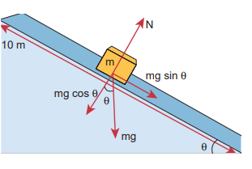

[comment]: <> (katex Header)


###  WORK

Let us consider a force F, acting on a body which moves it by a displacement in some direction dr as shown in Figure 4.1

The expression for work done (W) by the force on the body is mathematically written as,

$$ W F = \cdot dr $$

 (4.1)

**Figure 4.1** Work done by a force

Here, the product 

F dr⋅ is a _scalar product (or dot product). The scalar product of two_ vectors is a scalar (refer section 2.5.1). Thus, work done is a scalar quantity. It has only magnitude and no direction. In SI system, unit of work done is N m (or) joule (J). Its dimensional formula is [ML2T-2].

The equation (4.1) is,

$$ W = F dr \cos(\theta) $$

which can be realised using Figure 4.2 (as $$ \vec{a} \cdot \vec{b} = ab \cos(\theta) $$
) where, θ is the angle between applied force and the displacement of the body.

**Figure 4.3 Different cases of zero work done** 

The work done by the force depends on the force (F), displacement (dr) and the angle (θ) between them.

**Figure 4.2** Calculating work done.

Work done is zero in the following cases.

(i) **When the force is zero (F = 0)**. 
For example, a body moving on a horizontal smooth frictionless surface will continue to do so as no force (not even friction) is acting along the plane. (This is an ideal situation.)

(ii) **When the displacement is zero (dr = 0).** 
For example, when force is applied on a rigid wall it does not produce any displacement. Hence, the work done is zero as shown in Figure. 4.3(a).

  

(iii) **When the force and displacement are perpendicular  (θ = 90o to each other.** 

when a body moves on a horizontal direction, the gravitational force (mg) does no work on the body, since it acts at right angles to the displacement as shown in Figure 4.3(b). In circular motion the centripetal force does not do work on the object moving on a circle as it is always perpendicular to the displacement as shown in Figure 4.3(c).

For a given force (F) and displacement (dr), the angle (θ) between them decides the value of work done as consolidated in Table 4.1.

There are many examples for the negative work done by a force. In a football game, the goalkeeper catches the ball coming towards him by applying a force such that the force is applied in a direction opposite to that of the motion of the ball till it comes to rest in his hands. During the time of applying the force, he does a negative work on the ball as shown in Figure 4.4. We will discuss many more situations of negative work further in this unit.

**EXAMPLE 4.1**

A box is pulled with a force of 25 N to produce a displacement of 15 m. If the angle between the force and displacement is 30o, find the work done by the force.

**_Solution_**

Force, $$F = 25 \, \text{N}$$

Displacement, $$dr = 15 \, \text{m}$$

Angle between $$F$$ and $$dr$$, $$\theta = 30^\circ$$

Work done, $$W = F \cdot dr \cdot \cos(\theta)$$ 

$$W = 25 \cdot 15 \cdot \cos(30^\circ)$$

$$W = \frac{25 \cdot 15 \cdot \sqrt{3}}{2} \, \text{J}$$

### Work done by a constant force

When a constant force F acts on a body, the small work done (dW) by the force in producing a small displacement dr is given by the relation,

$$ dW = F \cos(\theta) \, dr $$
(4.3)

The total work done in producing a displacement from initial position ri to final position **rf** is,

$$ W = \int_{r_i}^{r_f} dW $$         
(4.4)
$$ W = \int_{r_i}^{r_f} F \cos(\theta) \, dr $$
$$ W = (F \cos(\theta) r) \bigg|_{r_i}^{r_f} $$

The graphical representation of the work done by a constant force is shown in Figure 4.5. The area under the graph shows the work done by the constant force.

**Figure 4.5** Work done by the constant force

**EXAMPLE 4.2**

An object of mass 2 kg falls from a height of 5 m to the ground. What is the work done by the gravitational force on the object? (Neglect air resistance; Take g = 10 m s-2)

**Solution**

In this case the force acting on the object is downward gravitational force mg. This is a constant force.

Work done by gravitational force is

$$ W = \int_{r_i}^{r_f} F \, dr $$
$$ W = \int_{r_i}^{r_f} F \cos(\theta) \, dr $$ 
$$ = (mg \cos(\theta)) (r_f - r_i) $$

The object also moves downward which is in the direction of gravitational force ($$\vec{F} = mg\vec{g}$$) as shown in figure. Hence, the angle between them is $$\theta = 0^\circ$$; $$\cos(0) = 1$$ and the displacement, $$r_f - r_i = 5m$$.

$$ W = mg (r_f - r_i) $$
$$ W = 2 \times 10 \times 5 = 100 \, \text{J} $$

The work done by the gravitational force on the object is positive.

**EXAMPLE 4.3**

An object of mass _m_\=1 kg is sliding from top to bottom in the frictionless inclined plane of inclination angle 0=30o and the length of inclined plane is 10 m as shown in the figure. Calculate the work done by gravitational force and normal force on the object. Assume acceleration due to gravity, g = 10 m s-2

**Solution**

We calculated in the previous chapter that the acceleration experienced by the object in the inclined plane as = g sinθ .

According to Newton’s second law, the force acting on the mass along the inclined plane F = mg sinθ. Note that this force is constant throughout the motion of the mass.

The work done by the parallel component of gravitational force mg e (mg sin θ) is given by

$$ W = \vec{F} \cdot \vec{r} \, dr \, \cos(\phi) $$

where $\phi$ is the angle between the force ($$mg \sin(\theta)$$) and the direction of motion ($$dr$$). In this case, force ($$mg \sin(\theta)$$) and the displacement ($$r_f - r_i$$) are in the same direction. Hence $$\phi = 0$$ and $$\cos(\phi) = 1$$.
  

W = F dr = (mg sin length of inclined plane)θ × () (dr) (dr = length of the inclined place)

W = 1 × 10 × sin (30°) × 10 = 100 1 2

50 _J_

The component mg cos θ and the normal force _N_ are perpendicular to the direction of motion of the object, so they do not perform any work.

**EXAMPLE 4.4**

If an object of mass 2 kg is thrown up from the ground reaches a height of 5 m and falls back to the Earth (neglect the air resistance). Calculate

(a) The work done by gravity when the object reaches 5 m height

(b) The work done by gravity when the object comes back to Earth

(c) Total work done by gravity both in upward and downward motion and mention the physical significance of the result.

**Solution**

When the object goes up, the displacement points in the upward direction whereas the gravitational force acting on the object points in downward direction. Therefore, the angle between gravitational force and displacement of the object is 180°.

(a) The work done by gravitational force in the upward motion.

Given that dr = 5m and F =mg

$$ W_{up} = F \, dr \, \cos(\theta) = mg \, dr \, \cos(180^\circ) $$

$$ W_{up} = 2 \times 10 \times 5 \times (-1) = -100 \, \text{J} $$

(b) When the object falls back, both the gravitational force and displacement of the object are in the same direction. This implies that the angle between gravitational force and displacement of the object is 0°.

$$ W_{down} = F \, dr \, \cos(0^\circ) $$
$$2 \times 10^5 \times (1) = 100 \, \text{joule} \quad [\cos 0° = 1]$$

(c) The total work done by gravity in the entire trip (upward and downward motion)

 $$W_{\text{total}} = W_{\text{up}} + W_{\text{down}} = -100 \, \text{joule} + 100 \, \text{joule} = 0$$

It implies that the gravity does not transfer any energy to the object. When the object is thrown upwards, the energy is transferred to the object by the external agency, which means that the object gains some energy. As soon as it comes back and hits the Earth, the energy gained by the object is transferred to the surface of the Earth (i.e., dissipated to the Earth).

**EXAMPLE 4.5**

A weight lifter lifts a mass of 250 kg with a force 5000 N to the height of 5 m.

(a) What is the workdone by the weight lifter?

(b) What is the workdone by the gravity? (c) What is the net workdone on the object?

**Solution** 

(a) When the weight lifter lifts the mass,force and displacement are in the same direction, which means that the angle between them $$\theta = 0^\circ$$. Therefore, the work done by the weight lifter,

$$W_{\text{weight lifter}} = F_w h \cos \theta = F_w h (\cos 0^\circ) = 5000 \times 5 \times (1) = 25,000 \, \text{joule} = 25 \, \text{kJ}$$

(b) When the weight lifter lifts the mass, the gravity acts downwards which means that the force and displacement are in opposite direction. Therefore, the angle between them  1800

$$W_{\text{gravity}} = F_g h \cos \theta = mgh(\cos 180^\circ) = 250 \times 10 \times 5 \times (-1) = -12,500 \, \text{joule} = -12.5 \, \text{kJ}$$

(c) The net workdone (or total work done) on the object

 $$W_{\text{net}} = W_{\text{weight lifter}} + W_{\text{gravity}} = 25 \, \text{kJ} - 12.5 \, \text{kJ} = +12.5 \, \text{kJ}$$

### Work done by a variable force

When the component of a variable force F acts on a body, the small work done (dW) by the force in producing a small displacement dr is given by the relation

$$
dW = F \cos \theta \, dr
$$[F cos θ is the component of the variable force F\]

where, F and θ are variables. The total work done for a displacement from initial position ri to final position rf is given by the relation,

$$
W = \int_{ri}^{rf} dW = \int_{ri}^{rf} F \cos \theta \, dr
$$

A graphical representation of the work done by a variable force is shown in Figure 4.6. The area under the graph is the work done by the variable force.

**Figure 4.6** Work done by a variable force

**EXAMPLE 4.6**

A variable force F = k x2 acts on a particle which is initially at rest. Calculate the work done by the force during the displacement of the particle from x = 0 m to x = 4 m. (Assume the constant k =1 N m-2)

**Solution**

Work done,

$$
W = \int_{xi}^{xf} F(x) \, dx = k \int_{0}^{4} x^2 \, dx = \frac{64}{3} \, \text{N m}
$$