**கற்றல் நோக்கங்கள்**

இந்த அலகில், மாணவர் பின்வரும் கருத்துகளை அறிந்துகொள்வார்:

- கோள்களின் இயக்கத்திற்கான கெப்லரின் விதிகள்
- நியூட்டனின் ஈர்ப்பு விதி
- கெப்லரின் விதிகள் மற்றும் ஈர்ப்பு விதிக்கு இடையேயான தொடர்பு
- ஈர்ப்புப் புலம் மற்றும் நிலையின் கணக்கீடு
- புவியீர்ப்பு முடுக்கத்தின் மாறுபாட்டின் கணக்கீடு
- விடுபடு வேகம் மற்றும் செயற்கைக்கோள்களின் ஆற்றல் கணக்கீடு
- எடையின்மை கருத்து
- புவிமைய அமைப்பை விட சூரியமைய அமைப்பின் நன்மை
- எரடோஸ்தெனஸ் முறையைப் பயன்படுத்தி பூமியின் ஆரத்தை அளவிடுதல்
- ஈர்ப்பு மற்றும் வானியற்பியலில் சமீபத்திய முன்னேற்றங்கள்

# அறிமுகம்

மின்னும் வானத்தைப் பார்த்து நாம் வியப்படைகிறோம்; சூரியன் கிழக்கில் உதித்து மேற்கில் மறைவது எப்படி, வால் நட்சத்திரங்கள் ஏன் உள்ளன அல்லது நட்சத்திரங்கள் ஏன் மின்னுகின்றன என்று நாம் ஆச்சரியப்படுகிறோம். வானம் என்பது பழங்காலத்திலிருந்தே மனிதர்களுக்கு ஆர்வத்தின் பொருளாக இருந்து வருகிறது. நட்சத்திரங்கள், சந்திரன் மற்றும் கோள்களின் இயக்கத்தைப் பற்றி நாம் எப்போதும் வியந்திருக்கிறோம். அரிஸ்டாட்டில் முதல் ஸ்டீபன் ஹாக்கிங் வரை, சிறந்த அறிவாளிகள் விண்வெளியில் வானப் பொருட்களின் இயக்கம் மற்றும் அவற்றின் இயக்கத்திற்கு என்ன காரணம் என்பதைப் புரிந்துகொள்ள முயன்றுள்ளனர்.

'ஈர்ப்புக் கோட்பாடு' 17 ஆம் நூற்றாண்டின் பிற்பகுதியில் நியூட்டனால் உருவாக்கப்பட்டது, இது வானப் பொருட்கள் மற்றும் பூமியிலுள்ள பொருட்களின் இயக்கத்தை விளக்கவும், எழுப்பப்பட்ட பெரும்பாலான கேள்விகளுக்கு பதிலளிக்கவும் ஆகும். கடந்த மூன்று நூற்றாண்டுகளாக ஈர்ப்பு மற்றும் அது வானப் பொருட்களின் மீதான விளைவு பற்றிய ஆய்வு இருந்தபோதிலும், "ஈர்ப்பு" இன்றும் இயற்பியலில் ஆராய்ச்சியின் சுறுசுறுப்பான பகுதிகளில் ஒன்றாக உள்ளது. 2017 ஆம் ஆண்டில், 'ஈர்ப்பு அலைகள்' கண்டுபிடிப்பிற்காக இயற்பியலுக்கான நோபல் பரிசு வழங்கப்பட்டது, இது 1915 ஆம் ஆண்டில் ஆல்பர்ட் ஐன்ஸ்டீனால் கோட்பாட்டளவில் கணிக்கப்பட்டது. கோள்களின் இயக்கம், நட்சத்திரங்கள் மற்றும் விண்மீன் திரள்களின் உருவாக்கம், மற்றும் சமீபத்தில் கருந்துளைகள் போன்ற மிகப்பெரிய பொருட்கள் மற்றும் அவற்றின் வாழ்க்கைச் சுழற்சி ஆகியவற்றைப் புரிந்துகொள்வது கடந்த சில நூற்றாண்டுகளாக இயற்பியலில் ஆய்வின் மையமாக இருந்து வருகிறது.

**சூரியக் குடும்பத்தின் புவிமைய மாதிரி** இரண்டாம் நூற்றாண்டில், புகழ்பெற்ற கிரேக்க-ரோமானிய வானியலாளர் கிளாடியஸ் டோலமி, சூரியன், சந்திரன், செவ்வாய், வியாழன் போன்ற வானப் பொருட்களின் இயக்கத்தை விளக்க ஒரு கோட்பாட்டை உருவாக்கினார். இந்த கோட்பாடு புவிமைய மாதிரி என்று அழைக்கப்பட்டது. புவிமைய மாதிரியின் படி, பூமி பிரபஞ்சத்தின் மையத்தில் உள்ளது மற்றும் சூரியன், சந்திரன் மற்றும் பிற கோள்கள் உட்பட அனைத்து வானப் பொருட்களும் பூமியைச் சுற்றி வருகின்றன. டோலமியின் மாதிரி நம் நிர்வாணக் கண்களால் வானத்தின் அவதானிப்புகளுடன் நெருக்கமாகப் பொருந்தியது. ஆனால் பின்னர், வானியலாளர்கள் டோலமியின் மாதிரி சூரியன் மற்றும் சந்திரனின் இயக்கத்தை ஒரு குறிப்பிட்ட அளவிற்கு வெற்றிகரமாக விளக்கினாலும், செவ்வாய் மற்றும் வியாழனின் இயக்கத்தை திறம்பட விளக்க முடியவில்லை என்பதைக் கண்டறிந்தனர்.

**நிக்கோலஸ் கோப்பர்னிக்கஸின் சூரியமைய மாதிரி** 15 ஆம் நூற்றாண்டில், போலந்து வானியலாளர் நிக்கோலஸ் கோப்பர்னிக்கஸ் (1473-1543) 'சூரியமைய மாதிரி' என்ற புதிய மாதிரியை முன்மொழிந்தார், இதில் சூரியன் சூரியக் குடும்பத்தின் மையத்தில் கருதப்பட்டது மற்றும் பூமி உட்பட அனைத்து கோள்களும் சூரியனை வட்டப்பாதையில் சுற்றி வந்தன. இந்த மாதிரி அனைத்து வானப் பொருட்களின் இயக்கத்தையும் வெற்றிகரமாக விளக்கியது.

அதே நேரத்தில், புகழ்பெற்ற இத்தாலிய இயற்பியலாளர் கலிலேயோ, பூமிக்கு அருகில் உள்ள அனைத்து பொருட்களும் பூமியை நோக்கி ஒரே விகிதத்தில் முடுக்கப்படுகின்றன என்பதைக் கண்டுபிடித்தார். இதற்கிடையில், டைகோ ப்ராஹே (1546-1601) என்ற ஒரு பிரபு தனது வாழ்நாள் முழுவதையும் நட்சத்திரங்கள் மற்றும் கோள்களின் நிலைகளை தனது நிர்வாணக் கண்களால் பதிவு செய்வதில் கழித்தார். அவர் தொகுத்த தரவுகள் பின்னர் அவரது உதவியாளர் ஜோஹன்னஸ் கெப்லரால் (1571–1630) பகுப்பாய்வு செய்யப்பட்டன, இறுதியில் அந்த பகுப்பாய்வு கோள்களின் இயக்க விதிகளைக் கண்டறிய வழிவகுத்தது. இந்த விதிகள் 'கெப்லரின் கோள்களின் இயக்க விதிகள்' என்று அழைக்கப்படுகின்றன.

## கெப்லரின் கோள்களின் இயக்க விதிகள்

கெப்லரின் விதிகள் பின்வருமாறு கூறப்படுகின்றன:

1. **சுற்றுப்பாதைகளின் விதி:** ஒவ்வொரு கோளும் சூரியனை ஒரு நீள்வட்ட சுற்றுப்பாதையில் நகரும், சூரியன் அதன் குவியங்களில் ஒன்றில் இருக்கும்.

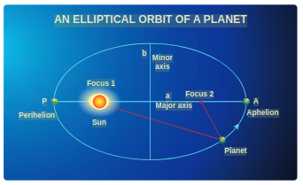.\
**படம் 6.1** சூரியனைச் சுற்றி ஒரு கோளால் வரையப்பட்ட நீள்வட்டம்.

சூரியனுக்கு மிக நெருக்கமான அணுகுமுறைப் புள்ளி 'P' உச்சி என்றும், தொலைவான புள்ளி 'A' சேய்மை உச்சி என்றும் அழைக்கப்படுகிறது (படம் 6.1). அரை-பெரிய அச்சு 'a' மற்றும் அரை-சிறிய அச்சு 'b' ஆகும். உண்மையில், கோப்பர்னிக்கஸ் மற்றும் டோலமி இருவரும் கோள்களின் சுற்றுப்பாதைகள் வட்டமானவை என்று கருதினர், ஆனால் கோள்களின் உண்மையான சுற்றுப்பாதைகள் நீள்வட்டமானவை என்பதை கெப்லர் கண்டுபிடித்தார்.

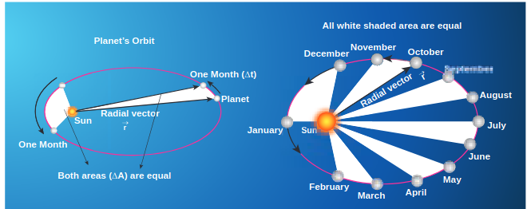.\
**படம் 6.2** 'பரப்பு விதியை' விளக்கும், கோள் சூரியனைச் சுற்றுவதன் இயக்கம்.

2. **பரப்பு விதி:**

ஆரத் திசையன் (சூரியனை ஒரு கோளுடன் இணைக்கும் கோடு) சம கால இடைவெளிகளில் சம பரப்புகளை வருடும்.

படம் 6.2 இல், வெள்ளை நிழலிடப்பட்ட பகுதி, சூரியனைச் சுற்றி ஒரு கோள், Dt என்ற சிறிய கால இடைவெளியில் வருடிய பரப்பு DA ஆகும். சூரியன் நீள்வட்டத்தின் மையத்தில் இல்லாததால், கோள்கள் சூரியனுக்கு அருகில் இருக்கும்போது வேகமாகவும், அதிலிருந்து வெகுதூரத்தில் இருக்கும்போது மெதுவாகவும் பயணித்து, சம கால இடைவெளிகளில் சம பரப்பை மூடுகின்றன. கோள்களின் வேகத்தில் உள்ள மாறுபாட்டை கவனமாகக் குறிப்பதன் மூலம் கெப்லர் பரப்பு விதியைக் கண்டுபிடித்தார்.

3. **கால விதி:**

சூரியனைச் சுற்றி அதன் நீள்வட்ட சுற்றுப்பாதையில் ஒரு கோளின் புரட்சியின் காலத்தின் வர்க்கம், நீள்வட்டத்தின் அரை-பெரிய அச்சின் கனத்திற்கு நேரடியாக விகிதாசாரமாகும். இதை இவ்வாறு எழுதலாம்:

\[
\begin{gathered}
T^{2} \propto a^{3} \\
\frac{T^{2}}{a^{3}} = \text{மாறிலி}
\end{gathered}
\]

இங்கு \(T\) என்பது ஒரு கோளுக்கான புரட்சியின் காலமாகும், மற்றும் \(a\) என்பது அரை-பெரிய அச்சாகும். இயற்பியல் ரீதியாக, கோளின் சூரியனிலிருந்து தூரம் அதிகரிக்கும்போது, காலமும் அதிகரிக்கும் ஆனால் அதே விகிதத்தில் அல்ல என்பதை இந்த விதி குறிக்கிறது.

அட்டவணை 6.1 இல், சூரியனைச் சுற்றும் கோள்களின் புரட்சியின் காலம் மற்றும் அவற்றின் அரை-பெரிய அச்சுகள் கொடுக்கப்பட்டுள்ளன. நான்காவது நெடுவரிசையில் இருந்து, \(\frac{T^{2}}{a^{3}}\) என்பது கிட்டத்தட்ட மாறிலியாக இருப்பதை உணரலாம், இது கெப்லரின் மூன்றாவது விதியை உறுதிப்படுத்துகிறது.

அட்டவணை 6.1 சூரியனைச் சுற்றும் கோள்களின் புரட்சியின் காலம் மற்றும் அவற்றின் அரை-பெரிய அச்சுகள்.

| கோள் | a | T | \(T^{2}/a^{3}\) |
| :--- | :--- | :--- | :---: |
|  | \(\left(10^{10} \, \text{மீ}\right)\) | (ஆண்டுகள்) |  |
| புதன் | 5.79 | 0.24 | 2.95 |
| வெள்ளி | 10.8 | 0.615 | 3.00 |
| பூமி | 15.0 | 1 | 2.96 |
| செவ்வாய் | 22.8 | 1.88 | 2.98 |
| வியாழன் | 77.8 | 11.9 | 3.01 |
| சனி | 143 | 29.5 | 2.98 |
| யுரேனஸ் | 287 | 84 | 2.98 |
| நெப்டியூன் | 450 | 165 | 2.99 |

| சிந்திக்க வேண்டிய புள்ளிகள் |  |  |  |  |
| :--- | :---: | :---: | :--- | :---: |
| தரவு | கணக்கு |  |  |  |
| கோள் | a | T | \(a\) மற்றும் \(T\) ஐ |  |
| A | 1 | 3 | இணைக்கும் |  |
| B | 2 | 6 | விதி என்ன? |  |
| C | 4 | 18 |  |  |
| இந்த கற்பனைக் கோள்களுக்கு \(a\) மற்றும் T க்கு இடையிலான |  |  |  |  |
| உறவைப் பற்றி கருத்து தெரிவிக்கவும் |  |  |  |  |

**எடுத்துக்காட்டு 6.1**

கீழே உள்ள படத்தில் காட்டப்பட்டுள்ளபடி, 10 மீட்டர் தூரத்தில் பிரிக்கப்பட்ட \(m_{1}\) மற்றும் \(m_{2}\) என்ற இரண்டு புள்ளி நிறைகளைக் கவனியுங்கள். அவற்றுக்கிடையேயான கவர்ச்சி விசையைக் கணக்கிட்டு, ஒவ்வொன்றின் மீதும் உள்ள விசையின் திசைகளை வரையவும். \(m_{1}=1 \, \text{கிகி}\) மற்றும் \(m_{2}=2 \, \text{கிகி}\) எனக் கொள்க.

**தீர்வு**

கவர்ச்சி விசை பின்வருமாறு வழங்கப்படுகிறது

\[
\vec{F} = -\frac{G m_{1} m_{2}}{r^{2}} \hat{r}
\]

படத்தில் இருந்து, \(r = 10 \, \text{மீ}\).

முதலில், விசையின் அளவைக் கணக்கிடலாம்

\[
\begin{aligned}
F & = \frac{G m_{1} m_{2}}{r^{2}} = \frac{6.67 \times 10^{-11} \times 1 \times 2}{100} \\
& = 13.34 \times 10^{-13} \, \text{N}
\end{aligned}
\]

இந்த விசை மிகவும் சிறியது என்பதைக் கவனத்தில் கொள்ள வேண்டும். நாம் ஒருவருக்கொருவர் இடையேயான ஈர்ப்பு விசையை உணராததற்கு இதுவே காரணம். \(G\) இன் சிறிய மதிப்பு விசையின் வலிமையை தீர்மானிப்பதில் மிக முக்கிய பங்கு வகிக்கிறது.

\(m_{1}\) காரணமாக \(m_{2}\) நிறையால் அனுபவிக்கப்படும் கவர்ச்சி விசை \(\left(\vec{F}_{21}\right)\) எதிர்மறை ' \(y\) ' திசையில் உள்ளது, அதாவது \(\hat{r} = -\hat{j}\). நியூட்டனின் மூன்றாவது விதியின்படி, \(m_{2}\) நிறையும் \(m_{1}\) மீது சமமான மற்றும் எதிரெதிர் விசையை செலுத்துகிறது. எனவே \(m_{2}\) காரணமாக \(m_{1}\) ஆல் அனுபவிக்கப்படும் கவர்ச்சி விசை \(\left(\vec{F}_{12}\right)\) நேர்மறை ' \(y\) ' அச்சின் திசையில் உள்ளது, அதாவது \(\hat{r} = \hat{j}\).

\[
\begin{aligned}
& \vec{F}_{21} = -13.34 \times 10^{-13} \hat{j} \\
& \vec{F}_{12} = 13.34 \times 10^{-13} \hat{j}
\end{aligned}
\]

விசையின் திசை படத்தில் காட்டப்பட்டுள்ளது,

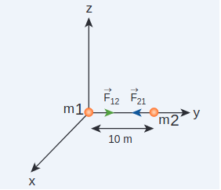

\(m_{1}\) மற்றும் \(m_{2}\) இடையேயான ஈர்ப்பு கவர்ச்சி விசை

\(\vec{F}_{12} = -\vec{F}_{21}\) இது நியூட்டனின் மூன்றாவது விதியை உறுதிப்படுத்துகிறது.

**ஈர்ப்பு விசையின் முக்கிய அம்சங்கள்:**

- இரண்டு நிறைகளுக்கு இடையேயான தூரம் அதிகரிக்கும்போது, விசையின் வலிமை \(r^{2}\) மீதான எதிர் சார்பு காரணமாக குறையும். இயற்பியல் ரீதியாக, பூமியுடன் ஒப்பிடும்போது யுரேனஸ் சூரியனிலிருந்து அதிக தூரத்தில் இருப்பதால், அது சூரியனிடமிருந்து குறைந்த ஈர்ப்பு விசையை அனுபவிக்கிறது என்பதை இது குறிக்கிறது.

**படம் 6.4** ஈர்ப்பு விசையின் மாறுபாடு தூரத்துடன்

- இரண்டு துகள்களுக்கு இடையிலான ஈர்ப்பு விசைகள் எப்போதும் ஒரு வினை-எதிர்வினை இணையை உருவாக்குகின்றன. சூரியன் பூமியின் மீது செலுத்தும் ஈர்ப்பு விசை எப்போதும் சூரியனை நோக்கியே இருக்கும் என்பதை இது குறிக்கிறது. எதிர்வினை-விசை பூமியால் சூரியனின் மீது செலுத்தப்படுகிறது. இந்த எதிர்வினை விசையின் திசை பூமியை நோக்கியதாகும்.
- சூரியனின் ஈர்ப்பு விசையால் பூமி அனுபவிக்கும் முறுக்கு விசை பின்வருமாறு வழங்கப்படுகிறது

\[
\begin{gathered}
\vec{\tau} = \vec{r} \times \vec{F} = \vec{r} \times \left(-\frac{G M_{S} M_{E}}{r^{2}} \hat{r}\right) = 0 \\
\text{இங்கு } \vec{r} = r \hat{r}, (\hat{r} \times \hat{r}) = 0
\end{gathered}
\]
எனவே \(\vec{\tau} = \frac{d \vec{L}}{d t} = 0\). கோண உந்தம் \(\vec{L}\) ஒரு மாறிலி திசையன் என்பதை இது குறிக்கிறது. சூரியனைப் பற்றிய பூமியின் கோண உந்தம் இயக்கம் முழுவதும் மாறிலியாகும். இது அனைத்து கோள்களுக்கும் உண்மை. உண்மையில், கோண உந்தத்தின் இந்த நிலைத்தன்மையே கெப்லரின் இரண்டாவது விதிக்கு வழிவகுக்கிறது.

- \(\vec{F} = -\frac{G M_{1} M_{2}}{r^{2}} \hat{r}\) என்ற கோவையில் \(M_{1}\) மற்றும் \(M_{2}\) இரண்டும் புள்ளி நிறைகளாகக் கருதப்படுகின்றன என்ற ஒரு உள்ளார்ந்த அனுமானம் உள்ளது. பூமி சூரியனின் ஈர்ப்பு விசையால் சூரியனைச் சுற்றி வருகிறது என்று கூறப்படும்போது, பூமியையும் சூரியனையும் புள்ளி நிறைகளாகக் கருதினோம். இந்த அனுமானம் ஒரு நல்ல தோராயமாகும், ஏனெனில் இரண்டு உடல்களுக்கு இடையிலான தூரம் அவற்றின் விட்டத்தை விட மிக அதிகமாக உள்ளது. ஒரு சிறிய தூரத்தால் பிரிக்கப்பட்ட சில ஒழுங்கற்ற மற்றும் நீட்டிக்கப்பட்ட பொருட்களுக்கு, சமன்பாடு (6.3) ஐ நேரடியாகப் பயன்படுத்த முடியாது. அதற்கு பதிலாக, நாம் தனி கணித சிகிச்சையைப் பயன்படுத்த வேண்டும், இது உயர் வகுப்புகளில் கொண்டு வரப்படும்.
- இருப்பினும், புள்ளி நிறைகளைப் பற்றிய இந்த அனுமானம் ஒரு சிறப்பு வழக்கிற்கு, சிறிய தூரத்திற்கும் கூட உள்ளது. சீரான அடர்த்தி கொண்ட ஒரு வெற்றுக் கோளத்தின் நிறை \(M\) மற்றும் வெற்றுக் கோளத்திற்கு வெளியே வைக்கப்பட்டுள்ள புள்ளி நிறை \(m\) ஆகியவற்றுக்கு இடையேயான கவர்ச்சி விசையைக் கணக்கிட, வெற்றுக் கோளத்தின் நிறை \(M\) ஐ வெற்றுக் கோளத்தின் மையத்தில் அமைந்துள்ள ஒரு புள்ளி நிறை \(M\) க்கு சமமானதாக மாற்றலாம். வெற்றுக் கோளத்தின் நிறை \(M\) மற்றும் புள்ளி நிறை \(m\) ஆகியவற்றுக்கு இடையேயான கவர்ச்சி விசையை, வெற்றுக் கோளத்தையும் மற்றொரு புள்ளி நிறையாகக் கருதி கணக்கிடலாம். அடிப்படையில், வெற்றுக் கோளத்தின் முழு நிறையும் வெற்றுக் கோளத்தின் மையத்தில் குவிந்திருப்பதாகத் தெரிகிறது. இது படம் 6.5(a) இல் காட்டப்பட்டுள்ளது.

- மேலும் ஒரு சுவாரஸ்யமான முடிவு உள்ளது. \(M\) நிறை கொண்ட ஒரு வெற்றுக் கோளத்தைக் கவனியுங்கள். படம் 6.5(b) இல் உள்ளதைப் போல இந்த வெற்றுக் கோளத்தின் உள்ளே ' \(m\) ' நிறையுள்ள மற்றொரு பொருளை வைத்தால், இந்த ' \(m\) ' நிறையால் அனுபவிக்கப்படும் விசை பூஜ்ஜியமாக இருக்கும். இந்த கணக்கீடு உயர் வகுப்புகளில் கையாளப்படும்.

இருப்பினும், புள்ளி நிறைகளைப் பற்றிய இந்த அனுமானம் ஒரு சிறப்பு வழக்கிற்கு, சிறிய தூரத்திற்கும் கூட உள்ளது. சீரான அடர்த்தி கொண்ட ஒரு வெற்றுக் கோளத்தின் நிறை M மற்றும் வெற்றுக் கோளத்திற்கு வெளியே வைக்கப்பட்டுள்ள புள்ளி நிறை m ஆகியவற்றுக்கு இடையேயான கவர்ச்சி விசையைக் கணக்கிட, வெற்றுக் கோளத்தின் நிறை M ஐ வெற்றுக் கோளத்தின் மையத்தில் அமைந்துள்ள ஒரு புள்ளி நிறை M க்கு சமமானதாக மாற்றலாம். வெற்றுக் கோளத்தின் நிறை M மற்றும் புள்ளி நிறை m ஆகியவற்றுக்கு இடையேயான கவர்ச்சி விசையை, வெற்றுக் கோளத்தையும் மற்றொரு புள்ளி நிறையாகக் கருதி கணக்கிடலாம். அடிப்படையில், வெற்றுக் கோளத்தின் முழு நிறையும் வெற்றுக் கோளத்தின் மையத்தில் குவிந்திருப்பதாகத் தெரிகிறது. இது படம் 6.5(a) இல் காட்டப்பட்டுள்ளது.

மேலும் ஒரு சுவாரஸ்யமான முடிவு உள்ளது. M நிறை கொண்ட ஒரு வெற்றுக் கோளத்தைக் கவனியுங்கள். படம் 6.5(b) இல் உள்ளதைப் போல இந்த வெற்றுக் கோளத்தின் உள்ளே 'm' நிறையுள்ள மற்றொரு பொருளை வைத்தால், இந்த 'm' நிறையால் அனுபவிக்கப்படும் விசை பூஜ்ஜியமாக இருக்கும். இந்த கணக்கீடு உயர் வகுப்புகளில் கையாளப்படும்.

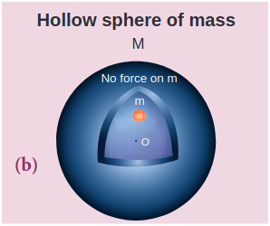\
**படம் 6.5** ஒரு வெற்றுக் கோளத்தில் வைக்கப்பட்டுள்ள ஒரு நிறை.

- ஈர்ப்பு விதியின் வெற்றி என்னவென்றால், கீழே விழும் மாம்பழமும், பூமியைச் சுற்றி வரும் சந்திரனும் ஒரே ஈர்ப்பு விசையின் காரணமாகவே என்பதை இது முடிவு செய்கிறது.

நியூட்டனின் தலைகீழ் வர்க்க விதி:

கோள்களின் சுற்றுப்பாதைகளை வட்டமாக நியூட்டன் கருதினார். \(r\) ஆரம் கொண்ட வட்ட சுற்றுப்பாதைக்கு, மையத்தை நோக்கிய மையநோக்கு முடுக்கம்

\[
a = -\frac{v^{2}}{r}
\]

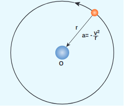

**படம் 6.6** ஒரு வட்ட சுற்றுப்பாதையில் சுற்றும் புள்ளி நிறை.

இங்கு \(v\) என்பது திசைவேகம் மற்றும் \(r\), சுற்றுப்பாதையின் மையத்திலிருந்து கோளின் தூரம் (படம் 6.6).

அறியப்பட்ட அளவுகள் \(r\) மற்றும் \(T\) இன் அடிப்படையில் திசைவேகம்,

\[
v = \frac{2 \pi r}{T}
\]

இங்கு \(T\) என்பது கோளின் புரட்சியின் காலமாகும். சமன்பாட்டில் (6.4) இந்த \(v\) மதிப்பைப் பிரதியிட நாம் பெறுவது,

\[
a = -\frac{\left(\frac{2 \pi r}{T}\right)^{2}}{r} = -\frac{4 \pi^{2} r}{T^{2}}
\]

நியூட்டனின் இரண்டாவது விதியில் 'a' இன் மதிப்பைப் பிரதியிட, \(F = m a\), இங்கு ' \(m\) ' என்பது கோளின் நிறை.

\[
F = -\frac{4 \pi^{2} m r}{T^{2}}
\]

கெப்லரின் மூன்றாவது விதியிலிருந்து,

\[
\frac{r^{3}}{T^{2}} = k \; (\text{மாறிலி})
\]

\[
\frac{r}{T^{2}} = \frac{k}{r^{2}}
\]

சமன்பாடு 6.9 ஐ விசைக் கோவையில் பிரதியிடுவதன் மூலம், நாம் ஈர்ப்பு விதியை அடையலாம்.

\[
F = -\frac{4 \pi^{2} m k}{r^{2}}
\]

இங்குள்ள எதிர்மறை குறியீடு விசை கவர்ச்சியானது மற்றும் அது மையத்தை நோக்கி செயல்படுகிறது என்பதைக் குறிக்கிறது. சமன்பாட்டில் (6.10), கோளின் நிறை ' \(m\) ' வெளிப்படையாக வருகிறது. ஆனால், தனது மூன்றாவது விதியின்படி, பூமி சூரியனால் கவரப்பட்டால், சூரியனும் பூமியால் அதே அளவுள்ள விசையுடன் கவரப்பட வேண்டும் என்று நியூட்டன் வலுவாக உணர்ந்தார். எனவே சூரியனின் நிறை (M) விசைக்கான கோவையிலும் (6.10) வெளிப்படையாக வர வேண்டும் என்று அவர் உணர்ந்தார். இந்த நுண்ணறிவிலிருந்து, அவர் மாறிலி \(4 \pi^{2} k\) ஐ GM க்கு சமப்படுத்தினார், இது ஈர்ப்பு விதியாக மாறியது.

\[
F = -\frac{G M m}{r^{2}}
\]

மீண்டும் மேலே உள்ள சமன்பாட்டில் உள்ள எதிர்மறை குறியீடு ஈர்ப்பு விசை கவர்ச்சியானது என்பதைக் குறிக்கிறது.

மேலே உள்ள விவாதத்தில், கோளின் சுற்றுப்பாதை வட்டமானது என்று நாம் கருதினோம், இது சூரியனைச் சுற்றியுள்ள கோளின் சுற்றுப்பாதை நீள்வட்டமாக இருப்பதால் உண்மையல்ல. ஆனால் இந்த வட்ட சுற்றுப்பாதை அனுமானம் நியாயமானது, ஏனெனில் கோளின் சுற்றுப்பாதை வட்டமாக இருப்பதற்கு மிக நெருக்கமாக உள்ளது மற்றும் வட்ட வடிவத்திலிருந்து மிகச் சிறிய விலகல் மட்டுமே உள்ளது.

**சிந்திக்க வேண்டிய புள்ளிகள்**

கெப்லரின் மூன்றாவது விதி "\(\frac{r^{3}}{T^{2}}=\) மாறிலி" என்பதற்கு பதிலாக "\(r^{3} T^{2}=\) மாறிலி" என்று இருந்தால், புதிய ஈர்ப்பு விதி என்னவாக இருக்கும்? அது இன்னும் ஒரு தலைகீழ் வர்க்க விதியாகவே இருக்குமா? தூரத்துடன் ஈர்ப்பு விசை எவ்வாறு மாறும்? இந்த புதிய ஈர்ப்பு விதியில், நெப்டியூன் பூமியுடன் ஒப்பிடும்போது அதிக ஈர்ப்பு விசையை அனுபவிக்குமா அல்லது குறைவான ஈர்ப்பு விசையை அனுபவிக்குமா?

**எடுத்துக்காட்டு 6.2**

சந்திரனும் ஒரு ஆப்பிளும் பூமியின் காரணமாக ஒரே ஈர்ப்பு விசையால் முடுக்கப்படுகின்றன. இரண்டின் முடுக்கத்தையும் ஒப்பிடுக.

பூமியின் காரணமாக ஆப்பிள் அனுபவிக்கும் ஈர்ப்பு விசை
\[
F = -\frac{G M_{E} M_{A}}{R^{2}}
\]

இங்கு \(M_{A}\) - ஆப்பிளின் நிறை, \(M_{E}\) - பூமியின் நிறை மற்றும் R - பூமியின் ஆரம்.

மேலே உள்ள சமன்பாட்டை நியூட்டனின் இரண்டாவது விதியுடன் சமன்படுத்த,

\[
M_{A} a_{A} = -\frac{G M_{E} M_{A}}{R^{2}}
\]

மேலே உள்ள சமன்பாட்டை எளிமைப்படுத்த நாம் பெறுவது,

\[
a_{A} = -\frac{G M_{E}}{R^{2}}
\]

இங்கு \(a_{A}\) என்பது ஆப்பிளின் முடுக்கம் ஆகும், இது ' \(g\) ' க்கு சமம்.

இதேபோல் பூமியின் காரணமாக சந்திரன் அனுபவிக்கும் விசை பின்வருமாறு வழங்கப்படுகிறது

\[
F = -\frac{G M_{E} M_{m}}{R_{m}^{2}}
\]

இங்கு \(R_{m}\) - பூமியிலிருந்து சந்திரனின் தூரம், \(M_{m}\) - சந்திரனின் நிறை

சந்திரன் அனுபவிக்கும் முடுக்கம் பின்வருமாறு வழங்கப்படுகிறது

\[
a_{m} = -\frac{G M_{E}}{R_{m}^{2}}
\]

ஆப்பிளின் முடுக்கத்திற்கும் சந்திரனின் முடுக்கத்திற்கும் இடையிலான விகிதம் பின்வருமாறு வழங்கப்படுகிறது

\[
\frac{a_{A}}{a_{m}} = \frac{R_{m}^{2}}{R^{2}}
\]

ஹிப்பார்கஸின் அளவீட்டிலிருந்து, சந்திரனுக்கான தூரம் பூமியின் ஆரத்தை விட 60 மடங்கு ஆகும். \(R_{m} = 60 R\).

\[
a_{A} / a_{m} = \frac{(60 R)^{2}}{R^{2}} = 3600 .
\]

ஆப்பிளின் முடுக்கம் சந்திரனின் முடுக்கத்தை விட 3600 மடங்கு ஆகும்.

நியூட்டன் தனது ஈர்ப்பு சூத்திரத்தைப் பயன்படுத்தி அதே முடிவைப் பெற்றார். ஆப்பிளின் முடுக்கம் எளிதில் அளவிடப்படுகிறது, அது \(9.8 \, \text{மீ} \, \text{வி}^{-2}\). சந்திரன் 27.3 நாட்களில் ஒருமுறை பூமியைச் சுற்றி வருகிறது, மேலும் மையநோக்கு முடுக்கம் சூத்திரத்தைப் பயன்படுத்தி, (அலகு 3 ஐப் பார்க்கவும்).

\[
\frac{a_{A}}{a_{m}} = \frac{9.8}{0.00272} = 3600
\]

இது அவர் தனது ஈர்ப்பு விதியின் மூலம் பெற்றதைப் போலவே சரியாக உள்ளது.

**குறிப்பு**
மேலே உள்ள கணக்கீடு பூமிக்கும் சந்திரனுக்கும் இடையிலான தூரம் மற்றும் பூமியின் ஆரம் ஆகியவற்றை அறிவதைப் பொறுத்தது. பூமியின் ஆரம் கிரேக்க நூலகர் எரடோஸ்தெனஸால் அளவிடப்பட்டது மற்றும் பூமிக்கும் சந்திரனுக்கும் இடையிலான தூரம் கிரேக்க வானியலாளர் ஹிப்பார்கஸால் 2400 ஆண்டுகளுக்கு முன்பு அளவிடப்பட்டது. இந்த தூரங்களை அளவிடுவதற்காக அவர் உயர்நிலைப் பள்ளி வடிவியல் மற்றும் முக்கோணவியலை மட்டுமே பயன்படுத்தினார் என்பதைக் கவனிப்பது மிகவும் சுவாரஸ்யமானது. இந்த விவரங்கள் வானியல் பிரிவில் (6.5) விவாதிக்கப்பட்டுள்ளன.

## ஈர்ப்பு மாறிலி

ஈர்ப்பு விதியில், ஈர்ப்பு மாறிலியின் மதிப்பு \(G\) மிக முக்கிய பங்கு வகிக்கிறது. \(G\) இன் மதிப்பு, பூமிக்கும் சூரியனுக்கும் இடையிலான ஈர்ப்பு விசை ஏன் மிகப் பெரியதாக உள்ளது, அதே சமயம் இரண்டு சிறிய பொருள்களுக்கு இடையிலான விசை (எடுத்துக்காட்டாக இரண்டு மனிதர்களுக்கு இடையில்) மிகக் குறைவு என்பதை விளக்குகிறது.

பூமியின் மேற்பரப்பில் உள்ள ' \(m\) ' நிறையால் அனுபவிக்கப்படும் விசை (படம் 6.7) பின்வருமாறு வழங்கப்படுகிறது

\[
F = -\frac{G M_{E} m}{R_{E}^{2}}
\]

\(M_{E}\)-பூமியின் நிறை, \(m\) - பொருளின் நிறை, \(R_{E}\) - பூமியின் ஆரம்.

நியூட்டனின் இரண்டாவது விதி \(F = -m g\) ஐ சமன்பாட்டுடன் (6.11) சமன்படுத்த நாம் பெறுவது,

\[
\begin{aligned}
-m g & = -\frac{G M_{E} m}{R_{E}^{2}} \\
g & = \frac{G M_{E}}{R_{E}^{2}}
\end{aligned}
\]
படம் 6.7 பூமியின் (i) மேற்பரப்பில் (ii) பூமியின் மையத்திலிருந்து ஒரு தூரத்தில் ஒரு நிறையால் அனுபவிக்கப்படும் விசை

இப்போது பூமியின் மையத்திலிருந்து \(r\) தூரத்தில் உள்ள \(M\) நிறையுள்ள வேறு சில பொருள்களால் அனுபவிக்கப்படும் விசை பின்வருமாறு வழங்கப்படுகிறது,

\[
F = -\frac{G M_{E} M}{r^{2}}
\]

சமன்பாட்டில் (6.12) \(g\) இன் மதிப்பைப் பயன்படுத்தி, \(F\) விசை பின்வருமாறு இருக்கும்,

\[
F = -g M \frac{R_{E}^{2}}{r^{2}}
\]

இதிலிருந்து, \(g\) இன் மதிப்பை அறிந்தால் விசையைக் கணக்கிட முடியும் என்பது தெளிவாகிறது. மேலே உள்ள கணக்கீட்டில் \(G\) தேவையில்லை என்பதைக் கவனத்தில் கொள்ள வேண்டும்.

1798 ஆம் ஆண்டில், ஹென்றி கேவென்டிஷ் ஒரு முறுக்கு சமநிலையைப் பயன்படுத்தி ஈர்ப்பு மாறிலி ' \(G\) ' இன் மதிப்பை சோதனை முறையில் தீர்மானித்தார். அவர் ' \(G\) ' இன் மதிப்பை \(6.75 \times 10^{-11} \, \text{N} \, \text{m}^{2} \, \text{kg}^{-2}\) க்கு சமமாக கணக்கிட்டார். நவீன நுட்பங்களைப் பயன்படுத்தி \(G\) இன் மிகவும் துல்லியமான மதிப்பை அளவிட முடியும். தற்போது ஏற்றுக்கொள்ளப்பட்ட \(G\) இன் மதிப்பு \(6.67259 \times 10^{-11} \, \text{N} \, \text{m}^{2} \, \text{kg}^{-2}\) ஆகும்.

## ஈர்ப்புப் புலம்

விசை அடிப்படையில் இரண்டு துகள்களுக்கு இடையிலான தொடர்பு காரணமாக ஏற்படுகிறது. தொடர்புகளின் வகையைப் பொறுத்து நாம் இரண்டு வகையான விசைகளைப் பெறலாம்: தொடு விசைகள் மற்றும் தொடாவிசைகள் (படம் 6.8).

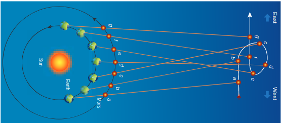\

**படம் 6.8** தொடு மற்றும் தொடாவிசைகளின் சித்தரிப்பு

தொடு விசைகள் என்பது ஒரு பொருள் மற்றொன்றுடன் உடல் ரீதியாக தொடர்பு கொண்டிருக்கும் விசைகளாகும். பொருளின் இயக்கம், பொருளுக்கும் விசையைச் செலுத்தும் முகவருக்கும் இடையிலான தொடர்பின் மூலம் செலுத்தப்படும் உடல் விசையால் ஏற்படுகிறது.

பூமி சூரியனைச் சுற்றி வரும் வழக்கைக் கவனியுங்கள். சூரியனும் பூமியும் ஒன்றுக்கொன்று உடல் ரீதியாக தொடர்பில் இல்லாவிட்டாலும், அவற்றுக்கிடையே ஒரு தொடர்பு உள்ளது. பூமி சூரியனின் ஈர்ப்பு விசையை அனுபவிப்பதே இதற்குக் காரணம். இந்த ஈர்ப்பு விசை ஒரு தொடாவிசையாகும்.

சூரியன், அதிலிருந்து மிகத் தொலைவில் இருந்தும், அதைத் தொடாமல் பூமியை ஈர்க்கிறது என்பது மர்மமாகத் தெரிகிறது. தள்ளுதல் அல்லது இழுத்தல் போன்ற தொடு விசைகளுக்கு, நாம் உணரலாம் அல்லது பார்க்கலாம் என்பதால் விசையின் வலிமையைக் கணக்கிடலாம். ஆனால் தொடாவிசையின் வலிமையை வெவ்வேறு தூரங்களில் எவ்வாறு கணக்கிடுவது? தொடாவிசைகளின் வலிமையைப் புரிந்துகொள்வதற்கும் கணக்கிடுவதற்கும், 'புலம்' என்ற கருத்து அறிமுகப்படுத்தப்பட்டுள்ளது.

' \(m_{1}\) ' நிறையுள்ள ஒரு துகள் காரணமாக ' \(m_{2}\) ' நிறையுள்ள ஒரு துகள் மீதான ஈர்ப்பு விசை

\[
\vec{F}_{21} = -\frac{G m_{1} m_{2}}{r^{2}} \hat{r}
\]

இங்கு \(\hat{r}\) என்பது \(m_{1}\) மற்றும் \(m_{2}\) நிறைகளை இணைக்கும் கோட்டின் வழியாக \(m_{1}\) இலிருந்து \(m_{2}\) க்கு சுட்டிக்காட்டும் ஓரலகு திசையன் ஆகும்.

\(m_{1}\) இலிருந்து \(r\) தூரத்தில் உள்ள ஒரு புள்ளியில் உள்ள ஈர்ப்புப் புலச் செறிவு \(\vec{E}_{1}\) (இனி ஈர்ப்புப் புலம் என அழைக்கப்படுகிறது) அந்த புள்ளியில் வைக்கப்பட்டுள்ள ஓரலகு நிறையால் அனுபவிக்கப்படும் ஈர்ப்பு விசை என வரையறுக்கப்படுகிறது. இது \(\frac{\vec{F}_{21}}{m_{2}}\) என்ற விகிதத்தால் வழங்கப்படுகிறது (இங்கு \(m_{2}\) என்பது \(\vec{F}_{21}\) செயல்படும் பொருளின் நிறை)

சமன்பாட்டில் (6.14) \(\vec{E}_{1} = \frac{\vec{F}_{21}}{m_{2}}\) ஐப் பயன்படுத்த நாம் பெறுவது,

\[
\vec{E}_{1} = -\frac{G m_{1}}{r^{2}} \hat{r}
\]

\(\vec{E}_{1}\) என்பது \(m_{1}\) நிறையை நோக்கி சுட்டிக்காட்டும் ஒரு திசையன் அளவு மற்றும் \(m_{2}\) நிறையிலிருந்து சுயாதீனமானது, இங்கு \(m_{2}\) ஓரலகு அளவில் எடுக்கப்படுகிறது. \(\hat{r}\) என்பது \(m_{1}\) க்கும் கேள்விக்குரிய புள்ளிக்கும் இடையிலான கோட்டின் வழியாக உள்ளது. \(\vec{E}_{1}\) புலம் \(m_{1}\) நிறையின் காரணமாக உள்ளது.

பொதுவாக, \(M\) நிறையின் காரணமாக \(r\) தூரத்தில் உள்ள ஈர்ப்புப் புலச் செறிவு பின்வருமாறு வழங்கப்படுகிறது

\[
\vec{E} = -\frac{G M}{r^{2}} \hat{r}
\]

இப்போது இந்த ஈர்ப்புப் புலத்தின் பகுதியில், ' \(m\) ' நிறை ஒரு புள்ளி \(P\) இல் வைக்கப்பட்டுள்ளது (படம் 6.9). ' \(m\) ' நிறை \(\vec{E}\) புலத்துடன் தொடர்பு கொண்டு படம் 6.9 இல் காட்டப்பட்டுள்ளபடி \(M\) காரணமாக ஒரு கவர்ச்சி விசையை அனுபவிக்கிறது. ' \(M\) ' காரணமாக ' \(m\) ' ஆல் அனுபவிக்கப்படும் ஈர்ப்பு விசை பின்வருமாறு வழங்கப்படுகிறது

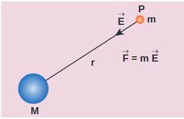

**படம் 6.9** ஓரலகு நிறையுள்ள ஒரு பொருளுடன் அளவிடப்படும் ஈர்ப்புப் புலச் செறிவு

\[
\vec{F}_{m} = m \vec{E}
\]

இப்போது இதை நியூட்டனின் இரண்டாவது விதி \(\vec{F} = m \vec{a}\) உடன் சமன்படுத்தலாம்

\[
\begin{aligned}
m \vec{a} & = m \vec{E} \\
\vec{a} & = \vec{E}
\end{aligned}
\]

வேறு வார்த்தைகளில் கூறுவதானால், சமன்பாடு (6.18) ஒரு புள்ளியில் உள்ள ஈர்ப்புப் புலம், அந்த புள்ளியில் ஒரு துகள் அனுபவிக்கும் முடுக்கத்திற்கு சமமானது என்பதைக் குறிக்கிறது. இருப்பினும், \(\vec{a}\) மற்றும் \(\vec{E}\) ஆகியவை ஒரே அளவு மற்றும் திசையைக் கொண்ட தனித்தனி இயற்பியல் அளவுகள் என்பதைக் கவனத்தில் கொள்ள வேண்டும். ஈர்ப்புப் புலம் \(\vec{E}\) என்பது மூலத்தின் பண்பு மற்றும் முடுக்கம் \(\vec{a}\) என்பது ஈர்ப்புப் புலத்தில் \(\vec{E}\) வைக்கப்பட்டுள்ள சோதனை நிறையால் (ஓரலகு நிறை) அனுபவிக்கப்படும் விளைவாகும். இரண்டு நிறைகளுக்கு இடையிலான தொடாதொடர்பை இப்போது "ஈர்ப்புப் புலம்" என்ற கருத்தைப் பயன்படுத்தி விளக்கலாம்.

**கவனிக்க வேண்டிய புள்ளிகள்:**

i) ஈர்ப்புப் புலத்தின் வலிமை, நாம் \(M\) நிறையிலிருந்து விலகிச் செல்லும்போது படம் 6.10 இல் சித்தரிக்கப்பட்டுள்ளபடி குறைகிறது. \(\vec{E}\) இன் அளவு \(r\) தூரம் அதிகரிக்கும்போது குறைகிறது.

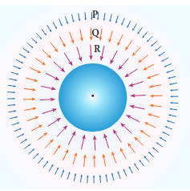

**படம் 6.10** ஈர்ப்புப் புலக் கோடுகளின் வலிமை தூரத்துடன் குறைகிறது

படம் 6.10 \(P, Q\) , மற்றும் \(R\) புள்ளிகளில் ஈர்ப்புப் புலத்தின் வலிமை \(\left|\vec{E}_{P}\right|<\left|\vec{E}_{Q}\right|<\left|\vec{E}_{R}\right|\) என வழங்கப்படுகிறது என்பதைக் காட்டுகிறது. \(P, Q\) , மற்றும் \(R\) புள்ளிகளில் உள்ள திசையன்களின் நீளத்தை ஒப்பிடுவதன் மூலம் இதைப் புரிந்து கொள்ளலாம்.

ii) "புலம்" என்ற கருத்து ஈர்ப்பு தொடர்புகளைக் கணக்கிடுவதற்கான ஒரு கணிதக் கருவியாக அறிமுகப்படுத்தப்பட்டது. பின்னர் புலம் ஒரு உண்மையான இயற்பியல் அளவு என்பதும், அது விண்வெளியில் ஆற்றலையும் உந்தத்தையும் கொண்டு செல்கிறது என்பதும் கண்டறியப்பட்டது. மின்னூட்டங்களின் நடத்தையைப் புரிந்துகொள்வதில் புலத்தின் கருத்து தவிர்க்க முடியாதது.

iii) ஈர்ப்புப் புலத்தின் அலகு நியூட்டன் பெர் கிலோகிராம் \((\text{N}/\text{kg})\) அல்லது \(\text{மீ} \, \text{வி}^{-2}\) ஆகும்.

## ஈர்ப்புப் புலத்திற்கான மேற்பொருட்கோள் கோட்பாடு

' \(n\) ' துகள்களின் நிறைகள் \(m_{1}, m_{2}, \ldots . m_{n}\), புள்ளி \(P\) க்கு பொறுத்தமட்டில் \(\vec{r}_{1}, \vec{r}_{2}, \vec{r}_{3} \ldots\) போன்ற நிலைகளில் விண்வெளியில் பரவியுள்ளன. அனைத்து நிறைகளின் காரணமாக ஒரு புள்ளி \(P\) இல் உள்ள மொத்த ஈர்ப்புப் புலம், தனித்தனி நிறைகளின் காரணமாக உள்ள ஈர்ப்புப் புலங்களின் திசையன் கூட்டுத்தொகையால் வழங்கப்படுகிறது (படம் 6.11). இந்த கொள்கை ஈர்ப்புப் புலங்களின் மேற்பொருட்கோள் கோட்பாடு எனப்படும்.

\[
\begin{aligned}
\vec{E}_{\text{மொத்தம்}} & = \vec{E}_{1} + \vec{E}_{2} + \ldots \vec{E}_{n} \\
& = -\frac{G m_{1}}{r_{1}^{2}} \hat{r}_{1} - \frac{G m_{2}}{r_{2}^{2}} \hat{r}_{2} - \ldots - \frac{G m_{n}}{r_{n}^{2}} \hat{r}_{n} \\
& = -\sum_{i=1}^{n} \frac{G m_{i}}{r_{i}^{2}} \hat{r}_{i} .
\end{aligned}
\]

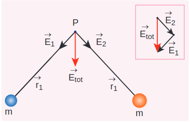

**படம் 6.11** இரண்டு ஈர்ப்புப் புலச் செறிவுகளின் மேற்பொருட்கோள், விளைவான புலத்தைக் கொடுக்கிறது.

தனித்தனி நிறைகளுக்குப் பதிலாக, \(M\) மொத்த நிறையின் தொடர்ச்சியான பரவல் இருந்தால், ஒரு புள்ளி \(P\) இல் உள்ள ஈர்ப்புப் புலம் தொகையீட்டு முறையைப் பயன்படுத்தி கணக்கிடப்படுகிறது.

**எடுத்துக்காட்டு 6.3**

(a) \(m_{1}\) மற்றும் \(m_{2}\) நிறைகள் கொண்ட இரண்டு துகள்கள் முறையே \(x\) மற்றும் \(y\) அச்சுகளில் மையத்திலிருந்து 'a' தூரத்தில் வைக்கப்பட்டுள்ளன. கீழே உள்ள படத்தில் காட்டப்பட்டுள்ள \(P\) புள்ளியில் ஈர்ப்புப் புலத்தைக் கணக்கிடுங்கள்.

**தீர்வு**

\(m_{1}\) காரணமாக \(P\) புள்ளியில் உள்ள ஈர்ப்புப் புலம் பின்வருமாறு வழங்கப்படுகிறது,

\[
\vec{E}_{1} = -\frac{G m_{1}}{a^{2}} \hat{j}
\]

\(m_{2}\) காரணமாக \(p\) புள்ளியில் உள்ள ஈர்ப்புப் புலம் பின்வருமாறு வழங்கப்படுகிறது,

\[
\begin{gathered}
\vec{E}_{2} = -\frac{G m_{2}}{a^{2}} \hat{i} \\
\vec{E}_{\text{மொத்தம்}} = -\frac{G m_{1}}{a^{2}} \hat{j} - \frac{G m_{2}}{a^{2}} \hat{i} \\
= -\frac{G}{a^{2}}\left(m_{1} \hat{j} + m_{2} \hat{i}\right)
\end{gathered}
\]

மொத்த ஈர்ப்புப் புலத்தின் திசையானது \(m_{1}\) மற்றும் \(m_{2}\) இன் சார்பு மதிப்பால் தீர்மானிக்கப்படுகிறது.

\(m_{1} = m_{2} = m\) ஆக இருக்கும்போது

\[
\vec{E}_{\text{மொத்தம்}} = -\frac{G m}{a^{2}}(\hat{i} + \hat{j})
\]

\((\hat{i} + \hat{j} = \hat{j} + \hat{i}\) திசையன்கள் பரிமாற்ற விதிக்குக் கீழ்ப்படிவதால்).

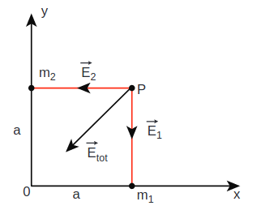

\(\vec{E}_{\text{மொத்தம்}}\) ஆய அமைப்பின் மையத்தை நோக்கிச் சுட்டிக்காட்டுகிறது மற்றும் \(\vec{E}_{\text{மொத்தம்}}\) இன் அளவு \(\sqrt{2} \frac{G m}{a^{2}}\) ஆகும்.

**எடுத்துக்காட்டு 6.4**

படத்தில் காட்டப்பட்டுள்ள புதன், பூமி மற்றும் வியாழன் ஆகியவற்றின் மீது சூரியனின் ஈர்ப்புப் புலத்தை தரமான முறையில் குறிப்பிடவும்.

தூரம் அதிகரிக்கும்போது ஈர்ப்புப் புலம் குறைவதால், வியாழன் சூரியனின் காரணமாக ஒரு பலவீனமான ஈர்ப்புப் புலத்தை அனுபவிக்கிறது. புதன் சூரியனுக்கு மிக அருகில் இருப்பதால், அது வலிமையான ஈர்ப்புப் புலத்தை அனுபவிக்கிறது.

சூரியக் குடும்பம்

## ஈர்ப்பு நிலை ஆற்றல்

நிலை ஆற்றல் மற்றும் அதன் இயற்பியல் பொருள் பற்றிய கருத்துக்கள் அலகு 4 இல் விவாதிக்கப்பட்டன. ஈர்ப்பு விசை ஒரு பழமைவாத விசை, எனவே இந்த பழமைவாத விசைப் புலத்துடன் தொடர்புடைய ஒரு ஈர்ப்பு நிலை ஆற்றலை வரையறுக்கலாம்.

\(m_{1}\) மற்றும் \(m_{2}\) ஆகிய இரண்டு நிறைகள் ஆரம்பத்தில் \(r^{\prime}\) தூரத்தால் பிரிக்கப்பட்டுள்ளன. \(m_{1}\) அதன் நிலையில் நிலையானது எனக் கருதிக்கொண்டு, \(m_{2}\) ஐ \(r^{\prime}\) இலிருந்து \(r\) க்கு நகர்த்துவதற்கு வேலை செய்யப்பட வேண்டும், படம் 6.12(a) இல் காட்டப்பட்டுள்ளபடி

**படம் 6.12** இரண்டு தொலைதூர நிறைகள் நேர்கோட்டுத் தூரத்தை மாற்றுகின்றன

\(d \vec{r}\) என்ற எல்லையற்ற இடப்பெயர்ச்சி வழியாக \(m_{2}\) நிறையை \(\vec{r}\) இலிருந்து \(\vec{r}+d \vec{r}\) க்கு நகர்த்துவதற்கு (படம் 6.12(b) இல் காட்டப்பட்டுள்ளது), வெளிப்புறமாக வேலை செய்யப்பட வேண்டும். இந்த எல்லையற்ற வேலை பின்வருமாறு வழங்கப்படுகிறது

\[
d W = \vec{F}_{ext} \cdot d \vec{r}
\]

இந்த வேலை ஈர்ப்பு விசைக்கு எதிராக செய்யப்படுகிறது, எனவே,

\[
\left|\vec{F}_{ext}\right| = \left|\vec{F}_{G}\right| = \frac{G m_{1} m_{2}}{r^{2}}
\]

சமன்பாடு (6.22) ஐ 6.21 இல் பிரதியிட, நாம் பெறுவது

\[
d W = \frac{G m_{1} m_{2}}{r^{2}} \hat{r} \cdot d \vec{r}
\]

மேலும் நமக்குத் தெரியும்,

\[
\begin{aligned}
d \vec{r} & = d r \hat{r} \\
\Rightarrow d W & = \frac{G m_{1} m_{2}}{r^{2}} \hat{r} \cdot (d r \hat{r}) \\
\hat{r} \cdot \hat{r} & = 1 \; (\text{இரண்டும் ஓரலகு திசையன்கள் என்பதால்}) \\
\therefore \quad d W & = \frac{G m_{1} m_{2}}{r^{2}} d r
\end{aligned}
\]

எனவே துகளை \(r^{\prime}\) இலிருந்து \(r\) க்கு இடப்பெயர்ச்சி செய்வதற்கான மொத்த வேலை

\[
\begin{aligned}
& W = \int_{r^{\prime}}^{r} d W = \int_{r^{\prime}}^{r} \frac{G m_{1} m_{2}}{r^{2}} d r \\
& W = -\left(\frac{G m_{1} m_{2}}{r}\right)_{r^{\prime}}^{r} \\
& W = -\frac{G m_{1} m_{2}}{r} + \frac{G m_{1} m_{2}}{r^{\prime}} \\
& W = U(r) - U\left(r^{\prime}\right)
\end{aligned}
\]

இங்கு \(U(r) = \frac{-G m_{1} m_{2}}{r}\)

இந்த செய்யப்பட்ட வேலை \(W\) ஆனது, \(m_{1}\) மற்றும் \(m_{2}\) நிறைகளின் தொகுப்பின் ஈர்ப்பு நிலை ஆற்றல் வேறுபாட்டை வழங்குகிறது, அவற்றுக்கிடையேயான பிரிப்பு முறையே \(r\) மற்றும் \(r^{\prime}\) ஆக இருக்கும்போது.

**வழக்கு 1: \(r < r^{\prime}\) ஆக இருந்தால்**

ஈர்ப்பு விசை கவர்ச்சியானது என்பதால், \(m_{2}\) ஆனது \(m_{1}\) ஆல் கவரப்படுகிறது. பின்னர் \(m_{2}\) எந்த வெளிப்புற வேலையும் இல்லாமல் \(r^{\prime}\) இலிருந்து \(r\) க்கு நகர முடியும் (படம் 6.13(a)). இங்கு, அமைப்பு அதன் உள் ஆற்றலைச் செலவழித்து வேலை செய்கிறது, எனவே செய்யப்பட்ட வேலை எதிர்மறை என்று கூறப்படுகிறது.

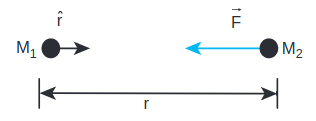

**படம் 6.13** புவியீர்ப்பால் செய்யப்படும் வேலையின் கணக்கீட்டிற்கான வழக்குகள்

**வழக்கு 2: \(r > r^{\prime}\) ஆக இருந்தால்**

பொருளை \(r^{\prime}\) இலிருந்து \(r\) க்கு நகர்த்துவதற்கு புவியீர்ப்புக்கு எதிராக வேலை செய்யப்பட வேண்டும் (படம் 6.13(b)). எனவே வேலை வெளிப்புற விசையால் உடலில் செய்யப்படுகிறது, எனவே செய்யப்பட்ட வேலை நேர்மறையாகும்.

நிலை ஆற்றல் வேறுபாடு மட்டுமே இயற்பியல் முக்கியத்துவம் வாய்ந்தது என்பதை கவனத்தில் கொள்ள வேண்டும். இப்போது ஒரு புள்ளியை குறிப்புப் புள்ளியாகத் தேர்ந்தெடுப்பதன் மூலம் ஈர்ப்பு நிலை ஆற்றலைப் பற்றி விவாதிக்கலாம்.

\(r^{\prime} = \infty\) எனத் தேர்ந்தெடுப்போம். பின்னர் சமன்பாட்டின் (6.28) இரண்டாவது உறுப்பு பூஜ்ஜியமாகிறது.

\[
W = -\frac{G m_{1} m_{2}}{r} + 0
\]

இப்போது \(m_{1}\) மற்றும் \(m_{2}\) என்ற இரண்டு நிறைகளின் அமைப்பின் ஈர்ப்பு நிலை ஆற்றலை, \(m_{1}\) அதன் நிலையில் நிலையானது எனக் கருதிக்கொண்டு, \(m_{2}\) நிறையை \(r\) தூரத்திலிருந்து முடிவிலிக்கு எடுத்துச் செல்வதற்கான வேலையின் அளவு என வரையறுக்கலாம், மேலும் இது \(U(r) = -\frac{G m_{1} m_{2}}{r}\) என எழுதப்படுகிறது. \(r\) தூரத்தால் பிரிக்கப்பட்ட \(m_{1}\) மற்றும் \(m_{2}\) ஆகிய இரண்டு நிறைகளைக் கொண்ட அமைப்பின் ஈர்ப்பு நிலை ஆற்றல், நிறைகள் முடிவிலி தூரத்தால் பிரிக்கப்பட்டிருக்கும் போதும், \(r\) தூரத்தால் பிரிக்கப்பட்டிருக்கும் போதும் உள்ள அமைப்பின் ஈர்ப்பு நிலை ஆற்றல் வேறுபாடு ஆகும் என்பதைக் கவனத்தில் கொள்ள வேண்டும். \(U(r) = U(r) - U(\infty)\). இங்கு \(U(\infty) = 0\) ஐ குறிப்புப் புள்ளியாகத் தேர்ந்தெடுக்கிறோம். ஈர்ப்பு நிலை ஆற்றல் \(U(r)\) எப்போதும் எதிர்மறையாகவே இருக்கும், ஏனெனில் இரண்டு நிறைகள் முடிவிலியிலிருந்து மெதுவாக ஒன்றாக வரும்போது, அமைப்பால் வேலை செய்யப்படுகிறது.

ஈர்ப்பு நிலை ஆற்றலின் அலகு \(U(r)\) ஜூல் ஆகும், மேலும் இது ஒரு அளவுகோல் அளவு ஆகும். ஈர்ப்பு நிலை ஆற்றல் இரண்டு நிறைகள் மற்றும் அவற்றுக்கிடையேயான தூரத்தைப் பொறுத்தது.

## பூமியின் மேற்பரப்பிற்கு அருகில் உள்ள ஈர்ப்பு நிலை ஆற்றல்

\(m\) நிறையுள்ள ஒரு பொருள் \(h\) உயரத்திற்கு உயர்த்தப்படும்போது, பொருளில் சேமிக்கப்படும் நிலை ஆற்றல் mgh ஆகும் (படம் 6.14) என்பது அத்தியாயம் 4 இல் ஏற்கனவே விவாதிக்கப்பட்டது. இது ஈர்ப்பு நிலை ஆற்றலுக்கான பொதுவான கோவையைப் பயன்படுத்தி பெறப்படலாம்.

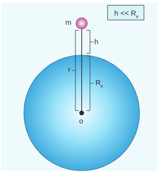

படம் 6.14 பூமியின் மையத்திலிருந்து \(r\) தூரத்தில் வைக்கப்பட்டுள்ள நிறை

பூமி மற்றும் நிறை அமைப்பைக் கவனியுங்கள், \(r\) என்பது \(m\) நிறைக்கும் பூமியின் மையத்திற்கும் இடையிலான தூரம். பின்னர் ஈர்ப்பு நிலை ஆற்றல்,

\[
U = -\frac{G M_{e} m}{r}
\]

இங்கு \(r = R_{e} + h\), இதில் \(R_{e}\) என்பது பூமியின் ஆரம். \(h\) என்பது பூமியின் மேற்பரப்பிற்கு மேலே உள்ள உயரம்

\[
U = -G \frac{M_{e} m}{\left(R_{e} + h\right)}
\]

\(h \ll R_{e}\) எனில், சமன்பாடு (6.31) பின்வருமாறு மாற்றியமைக்கப்படலாம்

\[
\begin{aligned}
& U = -G \frac{M_{e} m}{R_{e}\left(1 + h / R_{e}\right)} \\
& U = -G \frac{M_{e} m}{R_{e}}\left(1 + h / R_{e}\right)^{-1}
\end{aligned}
\]

இருபடி விரிவாக்கத்தைப் பயன்படுத்தி, உயர் வரிசை உறுப்புகளைப் புறக்கணிப்பதன் மூலம், நாம் பெறுவது

\[
U = -G \frac{M_{e} m}{R_{e}}\left(1 - \frac{h}{R_{e}}\right)
\]

பூமியின் மேற்பரப்பில் \(m\) நிறைக்கு,

\[
G \frac{M_{e} m}{R_{e}} = m g R_{e}
\]

சமன்பாடு (6.34) ஐ (6.33) இல் பிரதியிட, நாம் பெறுவது,

\[
U = -m g R_{e} + m g h
\]

மேலே உள்ள கோவையில் முதல் உறுப்பு \(h\) உயரத்திலிருந்து சுயாதீனமானது என்பது தெளிவாகிறது. எடுத்துக்காட்டாக, பொருள் \(h_{1}\) உயரத்திலிருந்து \(h_{2}\) க்கு எடுத்துச் செல்லப்பட்டால், \(h_{1}\) இல் உள்ள நிலை ஆற்றல்

\[
U\left(h_{1}\right) = -m g R_{e} + m g h_{1}
\]

மற்றும் \(h_{2}\) இல் உள்ள நிலை ஆற்றல்

\[
U\left(h_{2}\right) = -m g R_{e} + m g h_{2}
\]

\(h_{1}\) மற்றும் \(h_{2}\) இடையேயான நிலை ஆற்றல் வேறுபாடு

\[
U\left(h_{2}\right) - U\left(h_{1}\right) = m g \left(h_{2} - h_{1}\right) .
\]

சமன்பாடுகளில் (6.36) மற்றும் (6.37) உள்ள \(m g R_{e}\) என்ற உறுப்பு முடிவில் எந்தப் பங்கையும் வகிக்காது. எனவே சமன்பாட்டில் (6.35) முதல் உறுப்பைத் தவிர்க்கலாம் அல்லது பூஜ்ஜியமாக எடுத்துக்கொள்ளலாம். எனவே, பூமியின் மேற்பரப்பிலிருந்து \(h\) உயரத்தில் \(m\) நிறையுள்ள துகளில் சேமிக்கப்படும் ஈர்ப்பு நிலை ஆற்றல் \(U = m g h\) ஆகும். பூமியின் மேற்பரப்பில், \(h\) பூஜ்ஜியம் என்பதால், \(U = 0\).

mgh என்பது \(m\) நிறையை பூமியின் மேற்பரப்பிலிருந்து \(h\) உயரத்திற்கு எடுத்துச் செல்லும்போது துகள் மீது செய்யப்படும் வேலை என்பதைக் கவனத்தில் கொள்ள வேண்டும். இந்த செய்யப்பட்ட வேலை \(m\) நிறையில் ஈர்ப்பு நிலை ஆற்றலாகச் சேமிக்கப்படுகிறது. \(m g h\) என்பது அமைப்பின் (பூமி மற்றும் \(m\) நிறை) ஈர்ப்பு நிலை ஆற்றலாக இருந்தாலும், நிறை \(h\) உயரத்திற்கு நகரும் போது பூமி நிலையாக இருப்பதால், \(m g h\) ஐ \(m\) நிறையின் ஈர்ப்பு நிலை ஆற்றலாக எடுத்துக்கொள்ளலாம்.

## ஈர்ப்பு நிலை \(V(r)\)

முந்தைய பிரிவுகளில், ஈர்ப்புப் புலம் \(\vec{E}\) புலத்தை உருவாக்கும் மூல நிறையை மட்டுமே சார்ந்துள்ளது என்று விளக்கப்பட்டது. இது ஒரு திசையன் அளவு ஆகும். "ஈர்ப்பு நிலை" என்று அழைக்கப்படும் ஒரு அளவுகோல் அளவையும் நாம் வரையறுக்கலாம், இது மூல நிறையை மட்டுமே சார்ந்துள்ளது.

ஒரு நிறையின் காரணமாக \(r\) தூரத்தில் உள்ள ஈர்ப்பு நிலையானது, \(r\) தூரத்திலிருந்து முடிவிலிக்கு ஓரலகு நிறையை எடுத்துச் செல்வதற்குத் தேவையான வேலையின் அளவு என வரையறுக்கப்படுகிறது, மேலும் இது \(V(r)\) எனக் குறிக்கப்படுகிறது. வேறு வார்த்தைகளில் கூறுவதானால், \(r\) தூரத்தில் உள்ள ஈர்ப்பு நிலையானது, அதே \(r\) தூரத்தில் உள்ள ஒரு அலகு நிறைக்கான ஈர்ப்பு நிலை ஆற்றலுக்குச் சமமாகும். இது ஒரு அளவுகோல் அளவு மற்றும் அதன் அலகு \(\text{ஜூல்} \, \text{கிகி}^{-1}\) ஆகும்.

நாம் ஈர்ப்பு நிலை ஆற்றலின் மூலம் ஈர்ப்பு நிலையைத் தீர்மானிக்கலாம். \(r\) தூரத்தால் பிரிக்கப்பட்ட \(m_{1}\) மற்றும் \(m_{2}\) என்ற இரண்டு நிறைகளைக் கவனியுங்கள், அவை \(U(r)\) ஈர்ப்பு நிலை ஆற்றலைக் கொண்டுள்ளன (படம் 6.15). \(m_{1}\) நிறையின் காரணமாக ஒரு புள்ளி \(P\) இல் உள்ள ஈர்ப்பு நிலையானது, \(m_{1}\) இலிருந்து \(r\) தூரத்தில் உள்ளது, \(m_{2}\) ஐ ஒன்றுக்கு சமமாக \((m_{2} = 1 \, \text{கிகி})\) ஆக்குவதன் மூலம் பெறப்படுகிறது. எனவே \(m_{1}\) நிறையின் காரணமாக \(r\) தூரத்தில் உள்ள ஈர்ப்பு நிலை \(V(r)\)

\[
V(r) = -\frac{G m_{1}}{r}
\]

**படம் 6.15** ஒரு தூரத்தில் வைக்கப்பட்டுள்ள புள்ளி நிறை

ஈர்ப்புப் புலம் மற்றும் ஈர்ப்பு விசை ஆகியவை திசையன் அளவுகள் ஆகும், அதேசமயம் ஈர்ப்பு நிலை மற்றும் ஈர்ப்பு நிலை ஆற்றல் ஆகியவை அளவுகோல் அளவுகள் ஆகும். துகள்களின் இயக்கத்தை திசையன் அளவுகளை விட அளவுகோல் அளவுகளைப் பயன்படுத்தி எளிதாகப் பகுப்பாய்வு செய்யலாம். ஒரு விழும் ஆப்பிளின் உதாரணத்தைக் கவனியுங்கள்:

படம் 6.16 பூமியின் ஈர்ப்பு விசையின் காரணமாக பூமியின் மீது விழும் ஒரு ஆப்பிளைக் காட்டுகிறது. இதை பின்வருமாறு ஈர்ப்பு நிலை \(V(r)\) கருத்தைப் பயன்படுத்தி விளக்கலாம்.

**படம் 6.16** ஆப்பிள் புவியீர்ப்பின் கீழ் சுதந்திரமாக விழுதல்

பூமியின் மேற்பரப்பில் இருந்து \(h\) உயரத்தில் உள்ள ஒரு புள்ளியில் ஈர்ப்பு நிலை \(V(r)\) பின்வருமாறு வழங்கப்படுகிறது,

\[
V(r = R + h) = -\frac{G M_{e}}{(R + h)}
\]

பூமியின் மேற்பரப்பில் ஈர்ப்பு நிலை \(V(r)\) பின்வருமாறு வழங்கப்படுகிறது,

\[
V(r = R) = -\frac{G M_{e}}{R}
\]

எனவே நாம் இதைக் காண்கிறோம்

\[
V(r = R) < V(r = R + h) .
\]

முந்தைய பிரிவில் ஏற்கனவே விவாதிக்கப்பட்டபடி, \(h\) உயரத்தில் பூமியின் மேற்பரப்பிற்கு அருகில் உள்ள ஈர்ப்பு நிலை ஆற்றல் \(m g h\) ஆகும். இந்த புள்ளியில் ஈர்ப்பு நிலை என்பது வெறுமனே \(V(h) = U(h) / m = g h\) ஆகும். உண்மையில், \(h\) பூஜ்ஜியம் என்பதால் பூமியின் மேற்பரப்பில் ஈர்ப்பு நிலை பூஜ்ஜியமாகும். எனவே ஆப்பிள் அதிக ஈர்ப்பு நிலையின் பகுதியிலிருந்து குறைந்த ஈர்ப்பு நிலையின் பகுதிக்கு விழுகிறது. பொதுவாக, நிறையானது அதிக ஈர்ப்பு நிலையின் பகுதியிலிருந்து குறைந்த ஈர்ப்பு நிலையின் பகுதிக்கு நகரும்.

**எடுத்துக்காட்டு 6.5**

ஒரு மலையின் உச்சியில் இருந்து தண்ணீர் தரையில் விழுகிறது. ஏன்?

ஏனெனில் மலையின் உச்சி பூமியின் மேற்பரப்பை விட அதிக ஈர்ப்பு நிலையின் புள்ளியாகும், அதாவது \(V_{\text{மலை}} > V_{\text{தரை}}\)

மலை உச்சியில் இருந்து விழும் நீர்

திசையன் அளவுகளான \(\vec{F}\) அல்லது \(\vec{E}\) ஐ விட, \(U(r)\) அல்லது \(V(r)\) போன்ற அளவுகோல்களைப் பயன்படுத்தி துகள்களின் இயக்கத்தை எளிதாகப் பகுப்பாய்வு செய்யலாம். நவீன இயற்பியல் கோட்பாடுகளில், நிலை பற்றிய கருத்து முக்கிய பங்கு வகிக்கிறது.

**எடுத்துக்காட்டு 6.6**

கீழே உள்ள படத்தில் காட்டப்பட்டுள்ளபடி ஒரு வட்டத்தின் சுற்றளவில் அமைக்கப்பட்ட நான்கு நிறைகள் \(m_{1}, m_{2}, m_{3}\), மற்றும் \(m_{4}\) ஐக் கவனியுங்கள்

**கணக்கிடுக**

(a) படத்தில் காட்டப்பட்டுள்ள 4 நிறைகளின் அமைப்பின் ஈர்ப்பு நிலை ஆற்றல்.

(b) அனைத்து 4 நிறைகளின் காரணமாக \(O\) புள்ளியில் உள்ள ஈர்ப்பு நிலை.

ஈர்ப்பு நிலை ஆற்றல் \(U(r)\) என்பது ஒவ்வொரு ஜோடி துகள்களின் ஈர்ப்பு நிலை ஆற்றலின் கூட்டுத்தொகையைக் கண்டறிவதன் மூலம் கணக்கிடப்படலாம்.

\[
\begin{aligned}
U = & -\frac{G m_{1} m_{2}}{r_{12}} - \frac{G m_{1} m_{3}}{r_{13}} - \frac{G m_{1} m_{4}}{r_{14}} \\
& -\frac{G m_{2} m_{3}}{r_{23}} - \frac{G m_{2} m_{4}}{r_{24}} - \frac{G m_{3} m_{4}}{r_{34}}
\end{aligned}
\]

இங்கு \(r_{12}, r_{13} \ldots\) என்பது ஜோடி துகள்களுக்கு இடையேயான தூரம்

\[
\begin{aligned}
& r_{14}^{2} = R^{2} + R^{2} = 2 R^{2} \\
& r_{14} = \sqrt{2} R = r_{12} = r_{23} = r_{34} \\
& r_{13} = r_{24} = 2 R
\end{aligned}
\]

\[
\begin{aligned}
U = & -\frac{G m_{1} m_{2}}{\sqrt{2} R} - \frac{G m_{1} m_{3}}{2 R} - \frac{G m_{1} m_{4}}{\sqrt{2} R} \\
- & \frac{G m_{2} m_{3}}{\sqrt{2} R} - \frac{G m_{2} m_{4}}{2 R} - \frac{G m_{3} m_{4}}{\sqrt{2} R} \\
U = - & \frac{G}{R}\left[\frac{m_{1} m_{2}}{\sqrt{2}} + \frac{m_{1} m_{3}}{2} + \frac{m_{1} m_{4}}{\sqrt{2}} \right. \\
& \left. + \frac{m_{2} m_{3}}{\sqrt{2}} + \frac{m_{2} m_{4}}{2} + \frac{m_{3} m_{4}}{\sqrt{2}}\right]
\end{aligned}
\]

அனைத்து நிறைகளும் சமமாக இருந்தால், \(m_{1} = m_{2} = m_{3} = m_{4} = M\)

\[
\begin{aligned}
& U = -\frac{G M^{2}}{R}\left[\frac{1}{\sqrt{2}} + \frac{1}{2} + \frac{1}{\sqrt{2}} + \frac{1}{\sqrt{2}} + \frac{1}{2} + \frac{1}{\sqrt{2}}\right] \\
& U = -\frac{G M^{2}}{R}\left[1 + \frac{4}{\sqrt{2}}\right]
\end{aligned}
\]

\[
U = -\frac{G M^{2}}{R}[1 + 2 \sqrt{2}]
\]

ஒரு புள்ளி \(O\) இல் உள்ள ஈர்ப்பு நிலை \(V(r)\) ஆனது தனித்தனி நிறைகளின் காரணமாக உள்ள ஈர்ப்பு நிலைகளின் கூட்டுத்தொகைக்கு சமமாகும். நிலை ஒரு அளவுகோல் என்பதால், புள்ளி \(O\) இல் நிகர நிலை என்பது ஒவ்வொரு நிறையின் காரணமாக உள்ள நிலைகளின் இயற்கணிதத் தொகை ஆகும்.

\[
\begin{aligned}
V_{O}(r) & = -\frac{G m_{1}}{R} - \frac{G m_{2}}{R} - \frac{G m_{3}}{R} - \frac{G m_{4}}{R} \\
\text{ } m_{1} & = m_{2} = m_{3} = m_{4} = M \text{ எனில்} \\
V_{O}(r) & = -\frac{4 G M}{R}
\end{aligned}
\]