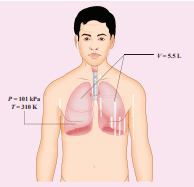
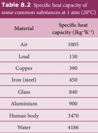
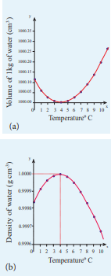
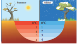
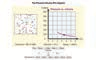

<!--  -->

**8.1**
**வெப்பமும் வெப்பநிலையும்**

## அறிமுகம்

வெப்பநிலையும் வெப்பமும் அன்றாட வாழ்க்கையில் மிக முக்கிய பங்கு வகிக்கின்றன. அனைத்து உயிரினங்களும் சரியாக செயல்பட அவற்றின் உடல் ஒரு குறிப்பிட்ட வெப்பநிலையில் பராமரிக்கப்பட வேண்டும். உண்மையில், சூரியன் அதன் வெப்பநிலையை பராமரிப்பதால் பூமியில் வாழ்க்கை சாத்தியமாகிறது. வெப்பநிலை மற்றும் வெப்பத்தின் பொருளைப் புரிந்துகொள்வது இயற்கையைப் புரிந்துகொள்வதற்கு மிகவும் முக்கியமானதாகும். வெப்ப இயக்கவியல் என்பது வெப்பநிலை, வெப்பம் போன்ற நிகழ்வுகளை விளக்கும் இயற்பியலின் ஒரு பிரிவாகும். இந்த அத்தியாயத்தில் வழங்கப்பட்டுள்ள கருத்துக்கள் ‘வெப்பம்’ மற்றும் ‘குளிர்ச்சி’ ஆகிய சொற்களைப் புரிந்துகொள்ளவும், வெப்பத்திலிருந்து வெப்பநிலையை வேறுபடுத்தவும் உதவும். வெப்ப இயக்கவியலில், வெப்பமும் வெப்பநிலையும் இரண்டு வெவ்வேறு ஆனால் நெருங்கிய தொடர்புடைய அளவுருக்களாகும்.

## வெப்பத்தின் பொருள்

ஒரு பொருள் அதிக வெப்பநிலையில் இருக்கும்போது, அது குறைந்த வெப்பநிலையில் உள்ள மற்றொரு பொருளுடன் தொடர்பு கொள்ளும் போது, அதிக வெப்பநிலையில் உள்ள பொருளிலிருந்து குறைந்த வெப்பநிலையில் உள்ள பொருளுக்கு தன்னிச்சையான ஆற்றல் பாய்வு ஏற்படும். இந்த ஆற்றல் வெப்பம் எனப்படும். அதிக வெப்பநிலை பொருளிலிருந்து குறைந்த வெப்பநிலை பொருளுக்கு ஆற்றலை மாற்றும் இந்த செயல்முறை வெப்பமாக்கல் எனப்படும். வெப்பப் பாய்வு காரணமாக சில நேரங்களில் உடலின் வெப்பநிலை அதிகரிக்கும் அல்லது சில நேரங்களில் அது அதிகரிக்காமல் போகலாம்.

வெப்பம் என்பது ஆற்றலின் ஒரு அளவு என்று ஒரு தவறான கருத்து உள்ளது. மக்கள் பெரும்பாலும் ‘இந்த தண்ணீரில் அதிக வெப்பம் உள்ளது அல்லது குறைந்த வெப்பம் உள்ளது’ என்று பேசுகிறார்கள். இந்த வார்த்தைகள் அர்த்தமற்றவை. வெப்பம் என்பது ஒரு அளவு அல்ல. வெப்பம் என்பது பயணத்தில் உள்ள ஆற்றல் ஆகும், இது அதிக வெப்பநிலை பொருளிலிருந்து குறைந்த வெப்பநிலை பொருளுக்கு பாய்கிறது. வெப்பமாக்கல் செயல்முறை நிறுத்தப்பட்டவுடன், நாம் வெப்பம் என்ற வார்த்தையைப் பயன்படுத்த முடியாது. ‘வெப்பம்’ என்ற வார்த்தையைப் பயன்படுத்தும்போது, அது பயணத்தில் உள்ள ஆற்றலைக் குறிக்கும், ஆனால் உடலில் சேமிக்கப்பட்ட ஆற்றலை அல்ல.

<blockquote style="background-color: pink; padding:10px; border-radius:5px;">

**குறிப்பு**
வெப்பம் என்பது ஆற்றலின் ஒரு அளவு என்று ஒரு தவறான கருத்து உள்ளது. மக்கள் பெரும்பாலும் 'இந்த தண்ணீரில் அதிக வெப்பம் உள்ளது அல்லது குறைந்த வெப்பம் உள்ளது' என்று பேசுகிறார்கள். இந்த வார்த்தைகள் அர்த்தமற்றவை. வெப்பம் என்பது ஒரு அளவு அல்ல. வெப்பம் என்பது பயணத்தில் உள்ள ஆற்றல் ஆகும், இது அதிக வெப்பநிலை பொருளிலிருந்து குறைந்த வெப்பநிலை பொருளுக்கு பாய்கிறது. வெப்பமாக்கல் செயல்முறை நிறுத்தப்பட்டவுடன், நாம் வெப்பம் என்ற வார்த்தையைப் பயன்படுத்த முடியாது. 'வெப்பம்' என்ற வார்த்தையைப் பயன்படுத்தும்போது, அது பயணத்தில் உள்ள ஆற்றலைக் குறிக்கும், ஆனால் உடலில் சேமிக்கப்பட்ட ஆற்றலை அல்ல.
</blockquote>

**எடுத்துக்காட்டு 8.1**
a. ‘ஒரு ஏரியில் அதிக மழை பெய்துள்ளது’. b. ‘ஒரு சூடான காபி கோப்பையில் அதிக வெப்பம் உள்ளது’.

இந்த இரண்டு அறிக்கைகளிலும் என்ன தவறு?

**_தீர்வு_**
a. மழை பெய்யும் போது, ஏரி மேகத்திலிருந்து தண்ணீரைப் பெறுகிறது. மழை நின்றவுடன், மழைக்கு முன்பை விட ஏரியில் அதிக தண்ணீர் இருக்கும். இங்கே ‘மழை பெய்தல்’ என்பது மேகத்திலிருந்து தண்ணீரைக் கொண்டுவரும் ஒரு செயல்முறையாகும். மழை என்பது ஒரு அளவு அல்ல, மாறாக அது பயணத்தில் உள்ள நீர். எனவே ‘ஏரியில் அதிக மழை பெய்துள்ளது’ என்ற அறிக்கை தவறானது, அதற்கு பதிலாக ‘ஏரியில் அதிக தண்ணீர் உள்ளது’ என்பது பொருத்தமானதாக இருக்கும்.

b. வெப்பமாக்கும்போது, ஒரு காபி கோப்பை அடுப்பிலிருந்து வெப்பத்தைப் பெறுகிறது. காபி அடுப்பிலிருந்து எடுக்கப்பட்டவுடன், காபி கோப்பையில் முன்பு இருந்ததை விட அதிக உள் ஆற்றல் உள்ளது. ‘வெப்பம்’ என்பது பயணத்தில் உள்ள ஆற்றல் மற்றும் இது அதிக வெப்பநிலையில் உள்ள ஒரு பொருளிலிருந்து குறைந்த வெப்பநிலையில் உள்ள பொருளுக்கு பாய்கிறது. வெப்பம் ஒரு அளவு அல்ல. எனவே ‘ஒரு சூடான காபி கோப்பையில் அதிக வெப்பம் உள்ளது’ என்ற அறிக்கை தவறானது, அதற்கு பதிலாக ‘காபி சூடாக உள்ளது’ என்பது பொருத்தமானதாக இருக்கும்.

## வேலையின் பொருள்

உங்கள் கைகளை ஒன்றோடொன்று தேய்க்கும்போது, கைகளின் வெப்பநிலை அதிகரிக்கிறது. தேய்ப்பதன் மூலம் உங்கள் கைகளில் சில வேலைகளைச் செய்துள்ளீர்கள். இந்த வேலை காரணமாக கைகளின் வெப்பநிலை அதிகரிக்கிறது. இப்போது நீங்கள் உங்கள் கைகளை கன்னத்தின் மீது வைத்தால், கன்னத்தின் வெப்பநிலை அதிகரிக்கிறது. ஏனெனில் கைகள் கன்னத்தை விட அதிக வெப்பநிலையில் உள்ளன. மேலே உள்ள எடுத்துக்காட்டில், கைகளின் வெப்பநிலை வேலை காரணமாக அதிகரிக்கிறது, மேலும் கன்னத்தின் வெப்பநிலை கைகளிலிருந்து கன்னத்திற்கு வெப்ப பரிமாற்றம் காரணமாக அதிகரிக்கிறது. இது படம் 8.1 இல் காட்டப்பட்டுள்ளது.


படம் 8.1 வேலை மற்றும் வெப்பத்திற்கு இடையிலான வேறுபாடு

அமைப்பு சுற்றுப்புறத்தில் வேலை செய்வதன் மூலம் அல்லது சுற்றுப்புறம் அமைப்பில் வேலை செய்வதன் மூலம் ஆற்றலை மாற்றலாம். வேலை செயல்முறை மூலம் ஒரு உடலில் இருந்து மற்றொரு உடலுக்கு ஆற்றலை மாற்றுவதற்கு, அவை வெவ்வேறு வெப்பநிலையில் இருக்க வேண்டிய அவசியமில்லை.

## வெப்பநிலையின் பொருள்

வெப்பநிலை என்பது ஒரு உடலின் வெப்பம் அல்லது குளிர்ச்சியின் அளவு ஆகும். உடல் சூடாக இருந்தால் அதன் வெப்பநிலை அதிகமாக இருக்கும். இரண்டு உடல்கள் வெப்பத் தொடர்பில் இருக்கும்போது வெப்பப் பாய்வின் திசையை வெப்பநிலை தீர்மானிக்கும்.

வெப்பநிலையின் SI அலகு கெல்வின் (K) ஆகும்.

நம் அன்றாட பயன்பாடுகளில், **_செல்சியஸ்_** (˚C) மற்றும் **_ஃபாரன்ஹீட்_** (°F) அளவுகோல்கள் பயன்படுத்தப்படுகின்றன.

வெப்பநிலை ஒரு வெப்பமானி மூலம் அளவிடப்படுகிறது. ஒரு அளவுகோலில் இருந்து மற்றொரு அளவுகோலுக்கு வெப்பநிலையை மாற்றுவது அட்டவணை 8.1 இல் கொடுக்கப்பட்டுள்ளது.


**அட்டவணை 8.1** வெப்பநிலை மாற்றம்

# பொருளின் வெப்ப பண்புகள்

## பாயிலின் விதி, சார்லஸின் விதி மற்றும் சிறந்த வாயு விதி

கொள்ளளவு V கொண்ட ஒரு கொள்கலனில் குறைந்த அழுத்தத்தில் (அடர்த்தி) வைக்கப்பட்டுள்ள ஒரு குறிப்பிட்ட வாயுவிற்கு, சோதனைகள் பின்வரும் தகவல்களை வெளிப்படுத்தின.

- வாயு நிலையான வெப்பநிலையில் வைக்கப்படும்போது, வாயுவின் அழுத்தம் கன அளவிற்கு எதிர் விகிதாசாரமாகும். \(P \propto \frac{1}{V}\). இது ராபர்ட் பாயில் (1627-1691) என்பவரால் கண்டுபிடிக்கப்பட்டது மற்றும் பாயிலின் விதி என அழைக்கப்படுகிறது.
- வாயு நிலையான அழுத்தத்தில் வைக்கப்படும்போது, வாயுவின் கன அளவு தனி வெப்பநிலைக்கு நேரடியாக விகிதாசாரமாகும். \(V \propto T\). இது ஜாக்குவஸ் சார்லஸ் (1743-1823) என்பவரால் கண்டுபிடிக்கப்பட்டது மற்றும் சார்லஸின் விதி என அழைக்கப்படுகிறது.
- இந்த இரண்டு சமன்பாடுகளையும் இணைப்பதன் மூலம் \(PV = CT\) கிடைக்கிறது. இங்கு C என்பது ஒரு நேர்மறை மாறிலி ஆகும். பின்வரும் வாதத்தைக் கருத்தில் கொண்டு, C ஆனது வாயு கொள்கலனில் உள்ள துகள்களின் எண்ணிக்கைக்கு விகிதாசாரமாகும் என்று நாம் ஊகிக்கலாம். நாம் ஒரே வகை வாயுவின் இரண்டு கொள்கலன்களை ஒரே கன அளவு V, ஒரே அழுத்தம் P மற்றும் ஒரே வெப்பநிலை T உடன் எடுத்துக் கொண்டால், ஒவ்வொரு கொள்கலனிலும் உள்ள வாயு மேலே உள்ள சமன்பாட்டிற்குக் கீழ்ப்படிகிறது. \(PV = CT\). இரண்டு வாயு கொள்கலன்கள் ஒரு ஒற்றை அமைப்பாகக் கருதப்பட்டால், இந்த ஒருங்கிணைந்த அமைப்பின் அழுத்தம் மற்றும் வெப்பநிலை ஒரே மாதிரியாக இருக்கும், ஆனால் கன அளவு இருமடங்காகவும், துகள்களின் எண்ணிக்கையும் இரட்டிப்பாகவும் இருக்கும், படம் 8.2 இல் காட்டப்பட்டுள்ளபடி.


இந்த ஒருங்கிணைந்த அமைப்பிற்கு, V ஆனது 2V ஆகிறது, எனவே சிறந்த வாயு சமன்பாடு \(\frac{P(2V)}{T} = 2C\) உடன் பொருந்துவதற்கு C இரட்டிப்பாக வேண்டும். வாயுவில் உள்ள துகள்களின் எண்ணிக்கையை C சார்ந்திருக்க வேண்டும் மற்றும் \(\left[\frac{PV}{T}\right] = \text{J K}^{-1}\) என்ற பரிமாணத்தையும் கொண்டிருக்க வேண்டும் என்பதை இது குறிக்கிறது. எனவே மாறிலி C ஐ போல்ட்ஸ்மேன் மாறிலி k மடங்கு துகள்களின் எண்ணிக்கை N என எழுதலாம். இங்கு k என்பது போல்ட்ஸ்மேன் மாறிலி (\(1.381 \times 10^{-23} \, \text{J K}^{-1}\)) மற்றும் இது ஒரு உலகளாவிய மாறிலி என்று கண்டறியப்பட்டுள்ளது. எனவே சிறந்த வாயு விதியை பின்வருமாறு கூறலாம்.

\[
PV = NkT \tag{8.1}
\]

சமன்பாடு (8.1) மோலின் அடிப்படையிலும் வெளிப்படுத்தப்படலாம்.

*மோல் என்பது வாயுவின் அளவை வெளிப்படுத்தும் நடைமுறை அலகு ஆகும். எந்தவொரு பொருளின் ஒரு மோல் என்பது அவகாதரோ எண்ணிக்கையிலான (\(N_A\)) துகள்களைக் (அணுக்கள் அல்லது மூலக்கூறுகள் போன்றவை) கொண்ட அந்த பொருளின் அளவாகும். அவகாதரோ எண் \(N_A\) என்பது சரியாக 12 கிராம் \(^{12}C\) இல் உள்ள கார்பன் அணுக்களின் எண்ணிக்கை என வரையறுக்கப்படுகிறது.*

ஒரு வாயுவில் μ மோல் துகள்கள் இருந்தால், மொத்த துகள்களின் எண்ணிக்கையை இவ்வாறு எழுதலாம்

\[
N = \mu N_A
\]

இங்கு \(N_A\) என்பது அவகாதரோ எண் (\(6.023 \times 10^{23} \, \text{mol}^{-1}\))

மேலே உள்ள சமன்பாட்டிலிருந்து N ஐப் பிரதியிட, சமன்பாடு (8.1) \(PV = \mu N_A kT\) ஆகிறது. இங்கு \(N_A k = R\) என்பது உலகளாவிய வாயு மாறிலி என்று அழைக்கப்படுகிறது, மேலும் அதன் மதிப்பு \(8.314 \, \text{J mol}^{-1} \text{K}^{-1}\) ஆகும். எனவே சிறந்த வாயு விதியை μ மோல் வாயுவிற்கு இவ்வாறு எழுதலாம்

\[
PV = \mu RT
\]

இது ஒரு சிறந்த வாயுவிற்கான நிலைச் சமன்பாடு என்று அழைக்கப்படுகிறது. இது சமநிலையில் உள்ள வெப்ப இயக்கவியல் அமைப்பின் அழுத்தம், கன அளவு மற்றும் வெப்பநிலை ஆகியவற்றை தொடர்புபடுத்துகிறது.

**எடுத்துக்காட்டு 8.2**

ஒரு மாணவி பள்ளிக்கு சைக்கிளில் வருகிறார், அதன் டயர் 27°C வெப்பநிலையில் 240 kPa அழுத்தத்தில் காற்றால் நிரப்பப்பட்டுள்ளது. அவர் பள்ளியை அடைய 8 கி.மீ பயணிக்கிறார், மேலும் சைக்கிள் டயரின் வெப்பநிலை 39°C ஆக அதிகரிக்கிறது. மாணவி பள்ளியை அடையும் போது டயரில் ஏற்படும் அழுத்த மாற்றம் என்ன?


**_தீர்வு_**

டயரில் உள்ள காற்று மூலக்கூறுகளை ஒரு சிறந்த வாயுவாக எடுத்துக் கொள்ளலாம். மூலக்கூறுகளின் எண்ணிக்கை மற்றும் டயரின் கன அளவு மாறிலியாக இருக்கும். எனவே 27°C இல் உள்ள காற்று மூலக்கூறுகள் \(P_1 V_1 = NkT_1\) என்ற சிறந்த வாயு சமன்பாட்டையும், 39°C இல் \(P_2 V_2 = NkT_2\) ஐயும் பூர்த்தி செய்கின்றன.

ஆனால் நாம் அறிவோம்

\(V_1 = V_2 = V\)

\(PV = NkT\)

\[
\frac{P_1 V}{P_2 V} = \frac{NkT_1}{NkT_2}
\]

\[
\frac{P_1}{P_2} = \frac{T_1}{T_2}
\]

\[
P_2 = \frac{T_2}{T_1} P_1
\]

\[
P_2 = \frac{312 \, \text{K}}{300 \, \text{K}} \times 240 \times 10^3 \, \text{Pa} = 249.6 \, \text{kPa}
\]

**எடுத்துக்காட்டு 8.3**

ஒரு நபர் சுவாசிக்கும்போது, அவரது நுரையீரல்கள் உடல் வெப்பநிலை 37°C மற்றும் வளிமண்டல அழுத்தத்தில் (1 atm = 101 kPa) 5.5 லிட்டர் காற்றை வரை வைத்திருக்க முடியும். இந்த காற்றில் 21% ஆக்ஸிஜன் உள்ளது. நுரையீரலில் உள்ள ஆக்ஸிஜன் மூலக்கூறுகளின் எண்ணிக்கையைக் கணக்கிடுங்கள்.



**_தீர்வு_**

நுரையீரலுக்குள் இருக்கும் காற்றை ஒரு சிறந்த வாயுவாகக் கருதலாம். மூலக்கூறுகளின் எண்ணிக்கையைக் கண்டறிய, சிறந்த வாயு விதியைப் பயன்படுத்தலாம்.

\(PV = NkT\)

இங்கு கன அளவு லிட்டரில் கொடுக்கப்பட்டுள்ளது. 1 லிட்டர் என்பது 10 செ.மீ பக்கமுள்ள ஒரு கனசதுரத்தால் ஆக்கிரமிக்கப்பட்ட கன அளவு. 1 லிட்டர் = 10 செ.மீ × 10 செ.மீ × 10 செ.மீ = \(10^{-3} \, \text{m}^3\)

\[
N = \frac{PV}{kT} = \frac{1.01 \times 10^5 \, \text{Pa} \times 5.5 \times 10^{-3} \, \text{m}^3}{1.38 \times 10^{-23} \, \text{J K}^{-1} \times 310 \, \text{K}} = 1.29 \times 10^{23} \, \text{molecules}
\]

N இல் 21% மட்டுமே ஆக்ஸிஜன். மொத்த ஆக்ஸிஜன் மூலக்கூறுகளின் எண்ணிக்கை
\(= 1.29 \times 10^{23} \times \frac{21}{100} = 2.7 \times 10^{22} \, \text{molecules}\)

**எடுத்துக்காட்டு 8.4**

STP இல் மற்றும் அறை வெப்பநிலையில் (300K) 1 atm அழுத்தத்துடன் எந்த வாயுவின் ஒரு மோலின் கன அளவைக் கணக்கிடுங்கள்.

**_தீர்வு:_**

இங்கு STP என்பது நிலையான வெப்பநிலை (\(T = 273 \, \text{K}\) அல்லது 0°C) மற்றும் அழுத்தம் (\(P = 1 \, \text{atm}\) அல்லது \(101.3 \, \text{kPa}\)) ஆகும்.

நாம் சிறந்த வாயு சமன்பாட்டைப் பயன்படுத்தலாம்

\[
V = \frac{\mu RT}{P}
\]

இங்கு μ = 1 மோல் மற்றும் \(R = 8.314 \, \text{J mol}^{-1} \text{K}^{-1}\).

மதிப்புகளைப் பிரதியிட

\[
V = \frac{1 \times 8.314 \times 273}{1.01 \times 10^5} = 22.4 \times 10^{-3} \, \text{m}^3
\]

1 லிட்டர் (L) = \(10^{-3} \, \text{m}^3\) என்பதை நாம் அறிவோம். எனவே எந்த சிறந்த வாயுவின் 1 மோல் 22.4 L கன அளவைக் கொண்டுள்ளது என்று முடிவு செய்யலாம்.

22.4 L ஐ \(\frac{300}{273}\) ஆல் பெருக்குவதன் மூலம், அறை வெப்பநிலையில் ஒரு மோல் வாயுவின் கன அளவு கிடைக்கிறது. அது 24.6 L ஆகும்.

**எடுத்துக்காட்டு 8.5**

NTP இல் உங்கள் வகுப்பறையில் உள்ள காற்றின் நிறையை மதிப்பிடுங்கள். இங்கு NTP என்பது இயல்பான வெப்பநிலை (அறை வெப்பநிலை) மற்றும் 1 வளிமண்டல அழுத்தத்தைக் குறிக்கிறது.


**_தீர்வு_**

ஒரு வகுப்பின் சராசரி அளவு 6 மீ நீளம், 5 மீ அகலம் மற்றும் 4 மீ உயரம். அறையின் கன அளவு \(V = 6 \times 5 \times 4 = 120 \, \text{m}^3\). மோல்களின் எண்ணிக்கையை நாம் தீர்மானிக்கலாம். அறை வெப்பநிலை 300 K இல், எந்த வாயுவும் ஆக்கிரமித்துள்ள வாயுவின் கன அளவு 24.6 L க்கு சமம்.

மோல்களின் எண்ணிக்கை

\[
\mu = \frac{120}{24.6 \times 10^{-3}} = 4878 \, \text{mol}
\]

காற்று என்பது 20% ஆக்ஸிஜன், 79% நைட்ரஜன் மற்றும் மீதமுள்ள ஒரு சதவீதம் ஆർகான், ஹைட்ரஜன், ஹீலியம் மற்றும் செனான் ஆகியவற்றின் கலவையாகும். காற்றின் மோலார் நிறை \(29 \, \text{g mol}^{-1}\) ஆகும். எனவே அறையில் உள்ள மொத்த காற்றின் நிறை

\[
m = 4878 \times 29 \times 10^{-3} = 141.4 \, \text{kg}
\]

## வெப்பத் திறன் மற்றும் தன்வெப்பத் திறன்

27°C வெப்பநிலையில் சம அளவு தண்ணீர் மற்றும் எண்ணெயை எடுத்து, இரண்டையும் 50°C வெப்பநிலையை அடையும் வரை சூடாக்கவும். தண்ணீர் மற்றும் எண்ணெய் 50°C வெப்பநிலையை அடைய எடுக்கும் நேரத்தைக் குறித்துக் கொள்ளுங்கள். வெளிப்படையாக இந்த நேரங்கள் ஒரே மாதிரியாக இல்லை. எண்ணெயை விட தண்ணீர் 50°C ஐ அடைய அதிக நேரம் எடுக்கும் என்பதை நாம் காணலாம். அதாவது, அதன் வெப்பநிலையை உயர்த்த தண்ணீருக்கு எண்ணெயை விட அதிக வெப்ப ஆற்றல் தேவைப்படுகிறது. இப்போது 27°C இல் இருமடங்கு அளவு தண்ணீரை எடுத்து 50°C வரை சூடாக்கவும், வெப்பநிலை உயர்வுக்கு எடுக்கும் நேரத்தைக் குறித்துக் கொள்ளுங்கள். முந்தைய வழக்குடன் ஒப்பிடும்போது தண்ணீர் எடுத்துக்கொண்ட நேரம் இப்போது இருமடங்காக உள்ளது.

‘வெப்பத் திறன்’ என்பது கொடுக்கப்பட்ட உடலின் வெப்பநிலையை T இலிருந்து \(T + \Delta T\) வரை உயர்த்த தேவையான வெப்ப ஆற்றலின் அளவு என வரையறுக்கலாம்.

வெப்பத் திறன்
\[
S = \frac{\Delta Q}{\Delta T}
\]

*ஒரு பொருளின் தன்வெப்பத் திறன் என்பது 1 கிலோகிராம் பொருளின் வெப்பநிலையை 1 கெல்வின் அல்லது 1°C ஆல் உயர்த்த தேவையான வெப்ப ஆற்றலின் அளவு என வரையறுக்கப்படுகிறது.*

\[
\Delta Q = m s \Delta T
\]

எனவே,
\[
s = \frac{1}{m} \left(\frac{\Delta Q}{\Delta T}\right)
\]

இங்கு s என்பது ஒரு பொருளின் தன்வெப்பத் திறன் என அழைக்கப்படுகிறது, மேலும் அதன் மதிப்பு பொருளின் தன்மையை மட்டுமே சார்ந்துள்ளது, பொருளின் அளவை அல்ல.

\(\Delta Q\) = வெப்ப ஆற்றலின் அளவு
\(\Delta T\) = வெப்பநிலையில் ஏற்படும் மாற்றம்
\(m\) = பொருளின் நிறை

தன்வெப்பத் திறனுக்கான SI அலகு \(\text{J kg}^{-1} \text{K}^{-1}\) ஆகும். வெப்பத் திறன் மற்றும் தன்வெப்பத் திறன் எப்போதும் நேர்மறை அளவுகளாகும்.



அட்டவணை 8.2 இலிருந்து, நீரே அதிக தன்வெப்பத் திறன் மதிப்பைக் கொண்டுள்ளது என்பது தெளிவாகிறது. இந்த காரணத்திற்காக, இது மின் நிலையங்கள் மற்றும் உலையங்களில் குளிரூட்டியாகப் பயன்படுத்தப்படுகிறது.

வெப்பத் திறன் அல்லது தன்வெப்பத் திறன் என்ற சொல், பொருளில் ஒரு குறிப்பிட்ட அளவு வெப்பம் உள்ளது என்று பொருள்படாது. வெப்பம் என்பது அதிக வெப்பநிலையில் உள்ள பொருளிலிருந்து குறைந்த வெப்பநிலையில் உள்ள பொருளுக்கு ஆற்றல் பரிமாற்றமாகும். சரியான பயன்பாடு ‘உள் ஆற்றல் திறன்’ ஆகும். ஆனால் வரலாற்றுக் காரணங்களுக்காக ‘வெப்பத் திறன்’ அல்லது ‘தன்வெப்பத் திறன்’ என்ற சொல் தக்கவைக்கப்பட்டுள்ளது.

<blockquote style="background-color:pink; padding:10px; border-radius:5px;">
**குறிப்பு**
வெப்பத் திறன் அல்லது தன்வெப்பத் திறன் என்ற சொல், பொருளில் ஒரு குறிப்பிட்ட அளவு வெப்பம் உள்ளது என்று பொருள்படாது. வெப்பம் என்பது அதிக வெப்பநிலையில் உள்ள பொருளிலிருந்து குறைந்த வெப்பநிலையில் உள்ள பொருளுக்கு ஆற்றல் பரிமாற்றமாகும். சரியான பயன்பாடு 'உள் ஆற்றல் திறன்' ஆகும். ஆனால் வரலாற்றுக் காரணங்களுக்காக 'வெப்பத் திறன்' அல்லது 'தன்வெப்பத் திறன்' என்ற சொல் தக்கவைக்கப்பட்டுள்ளது.
</blockquote>

ஒரே நிறையுள்ள இரண்டு பொருள்கள் சம விகிதங்களில் சூடாக்கப்படும்போது, சிறிய தன்வெப்பத் திறன் கொண்ட பொருள் விரைவான வெப்பநிலை அதிகரிப்பைக் கொண்டிருக்கும். ஒரே நிறையுள்ள இரண்டு பொருள்கள் குளிர்விக்க விடப்படும்போது, சிறிய தன்வெப்பத் திறன் கொண்ட பொருளின் வெப்பநிலை வேகமாக குறையும்.

வாயுக்களின் பண்புகளை நாம் படிக்கும்போது, மோலார் தன்வெப்பத் திறனைப் பயன்படுத்துவது மிகவும் நடைமுறைக்குரியதாகும். மோலார் தன்வெப்பத் திறன் என்பது ஒரு மோல் பொருளின் வெப்பநிலையை 1 K அல்லது 1°C ஆல் அதிகரிக்க தேவையான வெப்ப ஆற்றல் என வரையறுக்கப்படுகிறது. இதை பின்வருமாறு எழுதலாம்

\[
C = \frac{1}{\mu} \left(\frac{\Delta Q}{\Delta T}\right)
\]

இங்கு C என்பது ஒரு பொருளின் மோலார் தன்வெப்பத் திறன் என அழைக்கப்படுகிறது, மேலும் μ என்பது பொருளில் உள்ள மோல்களின் எண்ணிக்கையாகும்.

மோலார் தன்வெப்பத் திறனுக்கான SI அலகு \(\text{J mol}^{-1} \text{K}^{-1}\) ஆகும். இதுவும் ஒரு நேர்மறை அளவாகும்.

## திடப்பொருள்கள், திரவங்கள் மற்றும் வாயுக்களின் வெப்ப விரிவாக்கம்

*வெப்ப விரிவாக்கம் என்பது வெப்பநிலையில் ஏற்படும் மாற்றம் காரணமாக ஒரு பொருளின் வடிவம், பரப்பு மற்றும் கன அளவு மாறுவதற்கான போக்காகும்.*

பொருளின் மூன்று நிலைகளும் (திட, திரவ மற்றும் வாயு) சூடாக்கப்படும்போது விரிவடைகின்றன. ஒரு திடப்பொருள் சூடாக்கப்படும்போது, அதன் அணுக்கள் அவற்றின் நிலையான புள்ளிகளைப் பற்றி அதிக வீச்சுடன் அதிர்வுறும். திடப்பொருள்களின் அளவில் ஒப்பீட்டு மாற்றம் சிறியது. கோடை காலத்தில் தண்டவாளங்கள் விரிவடைந்து வளைந்து விடாமல் இருக்க, ரயில் பாதைகளில் சிறிய இடைவெளிகள் விடப்படுகின்றன. ரயில் பாதைகள் மற்றும் பாலங்களில் வெப்பநிலை மாற்றங்களுடன் சுதந்திரமாக விரிவடையவும் சுருங்கவும் விரிவாக்க மூட்டுகள் உள்ளன. இது படம் 8.3 இல் காட்டப்பட்டுள்ளது.


**படம் 8.3** பாதுகாப்பிற்கான விரிவாக்க மூட்டுகள்

**திரவங்கள்**, திடப்பொருள்களை விட குறைவான மூலக்கூறிடை விசைகளைக் கொண்டுள்ளன, எனவே அவை திடப்பொருள்களை விட அதிகமாக விரிவடைகின்றன. இதுவே பாதரச வெப்பமானிகளின் கொள்கையாகும்.

**வாயு** மூலக்கூறுகளைப் பொறுத்தவரை, மூலக்கூறிடை விசைகள் கிட்டத்தட்ட புறக்கணிக்கத்தக்கவை, எனவே அவை திடப்பொருள்களை விட அதிகமாக விரிவடைகின்றன. உதாரணமாக, சூடான காற்று பலூன்களில், வாயுத் துகள்கள் சூடாகும்போது, அவை விரிவடைந்து அதிக இடத்தை எடுத்துக்கொள்கின்றன.

அதன் வெப்பநிலை அதிகரிப்பு காரணமாக ஒரு உடலின் பரிமாணத்தில் ஏற்படும் அதிகரிப்பு வெப்ப விரிவாக்கம் எனப்படும்.

நீளத்தில் ஏற்படும் விரிவாக்கம் **நேரியல் விரிவாக்கம்** எனப்படும். இதேபோல், பரப்பில் ஏற்படும் விரிவாக்கம் **பரப்பு விரிவாக்கம்** என்றும், கன அளவில் ஏற்படும் விரிவாக்கம் **கன அளவு விரிவாக்கம்** என்றும் அழைக்கப்படுகிறது. இது படம் 8.4 இல் காட்டப்பட்டுள்ளது.


**படம் 8.4** வெப்ப விரிவாக்கங்கள்

**நேரியல் விரிவாக்கம்** திடப்பொருள்களில், ஒரு சிறிய வெப்பநிலை மாற்றத்திற்கு \(\Delta T\), நீளத்தில் ஏற்படும் பின்ன மாற்றம் \(\frac{\Delta L}{L_0}\) ஆனது \(\Delta T\) க்கு நேரடியாக விகிதாசாரமாகும்.

\[
\frac{\Delta L}{L_0} = \alpha_L \Delta T
\]

எனவே,
\[
\alpha_L = \frac{\Delta L}{L_0 \Delta T}
\]

இங்கு, \(\alpha_L\) = நேரியல் விரிவாக்க குணகம்.
\(\Delta L\) = நீளத்தில் ஏற்படும் மாற்றம்
\(L_0\) = அசல் நீளம்
\(\Delta T\) = வெப்பநிலையில் ஏற்படும் மாற்றம்

- ஒரு கண்ணாடி பாட்டிலின் மூடி இறுக்கமாக இருந்தால், மூடியை சூடான நீரில் வைக்கவும், இது திறப்பதை எளிதாக்குகிறது. ஏனெனில் மூடி கண்ணாடியை விட அதிக வெப்ப விரிவாக்கத்தைக் கொண்டுள்ளது.
- சுட்ட வேகவைத்த முட்டையை குளிர்ந்த நீரில் போடும்போது, முட்டை ஓட்டை எளிதாக அகற்றலாம். இது ஓடு மற்றும் முட்டையின் வெவ்வேறு வெப்ப விரிவாக்கங்களால் ஏற்படுகிறது.

**எடுத்துக்காட்டு 8.6**

ஈபெல் கோபுரம் இரும்பினால் ஆனது, மேலும் அதன் உயரம் தோராயமாக 300 மீ ஆகும். பிரான்சில் குளிர்காலத்தில் (ஜனவரி) வெப்பநிலை 2°C ஆகவும், வெப்பமான கோடையில் அதன் சராசரி வெப்பநிலை 25°C ஆகவும் இருக்கும். கோடை மற்றும் குளிர்காலத்திற்கு இடையில் ஈபெல் கோபுரத்தின் உயரத்தில் ஏற்படும் மாற்றத்தைக் கணக்கிடுங்கள். இரும்பிற்கான நேரியல் வெப்ப விரிவாக்க குணகம் \(\alpha = 10 \times 10^{-6} \, \text{per} °\text{C}\)


**_தீர்வு_**

\[
\frac{\Delta L}{L_0} = \alpha_L \Delta T
\]

\[
\Delta L = \alpha_L L_0 \Delta T = 10 \times 10^{-6} \times 300 \times 23 = 0.069 \, \text{m} = 69 \, \text{mm}
\]

**பரப்பு விரிவாக்கம்** ஒரு சிறிய வெப்பநிலை மாற்றத்திற்கு \(\Delta T\), ஒரு பொருளின் பரப்பில் ஏற்படும் பின்ன மாற்றம் \(\frac{\Delta A}{A_0}\) ஆனது \(\Delta T\) க்கு நேரடியாக விகிதாசாரமாகும், மேலும் இதை இவ்வாறு எழுதலாம்

\[
\frac{\Delta A}{A_0} = \alpha_A \Delta T
\]

எனவே,
\[
\alpha_A = \frac{\Delta A}{A_0 \Delta T}
\]

இங்கு, \(\alpha_A\) = பரப்பு விரிவாக்க குணகம்.
\(\Delta A\) = பரப்பில் ஏற்படும் மாற்றம்
\(A_0\) = அசல் பரப்பு
\(\Delta T\) = வெப்பநிலையில் ஏற்படும் மாற்றம்

**கன அளவு விரிவாக்கம்** ஒரு சிறிய வெப்பநிலை மாற்றத்திற்கு \(\Delta T\), ஒரு பொருளின் கன அளவில் ஏற்படும் பின்ன மாற்றம் \(\frac{\Delta V}{V_0}\) ஆனது \(\Delta T\) க்கு நேரடியாக விகிதாசாரமாகும்.

\[
\frac{\Delta V}{V_0} = \alpha_V \Delta T
\]

எனவே,
\[
\alpha_V = \frac{\Delta V}{V_0 \Delta T}
\]

இங்கு, \(\alpha_V\) = கன அளவு விரிவாக்க குணகம்.
\(\Delta V\) = கன அளவில் ஏற்படும் மாற்றம்
\(V_0\) = அசல் கன அளவு
\(\Delta T\) = வெப்பநிலையில் ஏற்படும் மாற்றம்

திடப்பொருள்களின் நேரியல், பரப்பு மற்றும் கன அளவு விரிவாக்க குணகத்தின் அலகு °C⁻¹ அல்லது K⁻¹ ஆகும்.

கொடுக்கப்பட்ட மாதிரிக்கு,
\[
\frac{\Delta L}{L_0} = \alpha_L \Delta T \quad \text{(நேரியல் விரிவாக்கம்)}
\]
\[
\frac{\Delta A}{A_0} \approx 2 \alpha_L \Delta T \quad \text{(பரப்பு விரிவாக்கம்} \approx 2 \times \text{நேரியல் விரிவாக்கம்)}
\]
\[
\frac{\Delta V}{V_0} \approx 3 \alpha_L \Delta T \quad \text{(கன அளவு விரிவாக்கம்} \approx 3 \times \text{நேரியல் விரிவாக்கம்)}
\]

## நீரின் முரண்பாடான விரிவாக்கம்

திரவங்கள் மிதமான வெப்பநிலையில் சூடாக்கும்போது விரிவடைகின்றன மற்றும் குளிர்விக்கும்போது சுருங்குகின்றன. ஆனால் நீர் ஒரு முரண்பாடான நடத்தையை வெளிப்படுத்துகிறது. இது 0°C மற்றும் 4°C க்கு இடையில் சூடாக்கும்போது சுருங்குகிறது. கொடுக்கப்பட்ட அளவு நீரின் கன அளவு அறை வெப்பநிலையில் இருந்து குளிர்விக்கப்படும்போது, அது 4°C அடையும் வரை குறைகிறது. 4°C க்கு கீழே கன அளவு அதிகரிக்கிறது, எனவே அடர்த்தி குறைகிறது. இதன் பொருள் நீர் 4°C இல் அதிகபட்ச அடர்த்தியைக் கொண்டுள்ளது. நீரின் இந்த நடத்தை நீரின் முரண்பாடான விரிவாக்கம் எனப்படுகிறது. இது படம் 8.5 இல் காட்டப்பட்டுள்ளது.


**படம் 8.5** நீரின் முரண்பாடான விரிவாக்கம்

குளிர் நாடுகளில் குளிர்காலத்தில், ஏரிகளின் மேற்பரப்பு அடிப்பகுதியை விட குறைந்த வெப்பநிலையில் இருக்கும், படம் 8.6 இல் காட்டப்பட்டுள்ளது. திட நீர் (பனி) அதன் திரவ வடிவத்தை விட குறைந்த அடர்த்தியைக் கொண்டிருப்பதால், 4°C க்கு கீழே, உறைந்த நீர் திரவ நீருக்கு மேலே மேற்பரப்பில் இருக்கும் (பனி மிதக்கிறது). இது நீரின் முரண்பாடான விரிவாக்கம் காரணமாகும். ஏரிகள் மற்றும் குளங்களில் உள்ள நீர் மேலே மட்டுமே உறைவதால், ஏரிகளில் வாழும் உயிரினங்கள் அடிப்பகுதியில் பாதுகாப்பாக இருக்கும்.


**படம் 8.6** ஏரிகளில் நீரின் முரண்பாடான விரிவாக்கம்

## நிலை மாற்றம்

அனைத்து பொருட்களும் பொதுவாக திட, திரவ அல்லது வாயு என மூன்று நிலைகளில் உள்ளன. சூடாக்குதல் அல்லது குளிர்வித்தல் மூலம் பொருளை ஒரு நிலையிலிருந்து மற்றொரு நிலைக்கு மாற்றலாம்.

எடுத்துக்காட்டுகள்: 1. உருகுதல் (திடத்திலிருந்து திரவம்) 2. ஆவியாதல் (திரவத்திலிருந்து வாயு) 3. பதங்கமாதல் (திடத்திலிருந்து வாயு) 4. உறைதல் / திடப்படுத்தல் (திரவத்திலிருந்து திடம்) 5. ஒடுக்கம் (வாயுவிலிருந்து திரவம்)

**படம் 8.7** பொருளின் நிலை மாற்றங்கள்

**உள்ளுறை வெப்பத் திறன்:** ஒரு பாத்திரத்தில் தண்ணீரை கொதிக்க வைக்கும்போது, தண்ணீரின் வெப்பநிலை 100°C அடையும் வரை அதிகரிக்கிறது, இது நீரின் கொதிநிலை ஆகும், பின்னர் எல்லா நீரும் திரவத்திலிருந்து வாயுவாக மாறும் வரை வெப்பநிலை மாறாமல் இருக்கும். இந்த செயல்பாட்டின் போது, தண்ணீரில் தொடர்ந்து வெப்பம் சேர்க்கப்படுகிறது. ஆனால் தண்ணீரின் வெப்பநிலை அதன் கொதிநிலைக்கு மேல் உயராது. இதுவே உள்ளுறை வெப்பத் திறன் என்ற கருத்தாகும்.

*ஒரு பொருளின் உள்ளுறை வெப்பத் திறன் என்பது ஒரு அலகு நிறை பொருளின் நிலையை மாற்ற தேவையான வெப்ப ஆற்றலின் அளவு என வரையறுக்கப்படுகிறது.*

\[
Q = m \times L
\]

எனவே,
\[
L = \frac{Q}{m}
\]

இங்கு L = பொருளின் உள்ளுறை வெப்பத் திறன், Q = வெப்பத்தின் அளவு, m = பொருளின் நிறை. உள்ளுறை வெப்பத் திறனுக்கான SI அலகு \(\text{J kg}^{-1}\) ஆகும்.

**படம் 8.8** நீருக்கான வெப்பநிலை மற்றும் வெப்பம்

ஒரு நிலை மாற்றத்தின் போது வெப்பம் சேர்க்கப்படும்போது அல்லது அகற்றப்படும்போது, வெப்பநிலை மாறாமல் இருக்கும்.

**குறிப்பு**
- ஒரு திட-திரவ நிலை மாற்றத்திற்கான உள்ளுறை வெப்பம் உருகலின் உள்ளுறை வெப்பம் (\(L_f\)) எனப்படும்.
- ஒரு திரவ-வாயு நிலை மாற்றத்திற்கான உள்ளுறை வெப்பம் ஆவியாதலின் உள்ளுறை வெப்பம் (\(L_v\)) எனப்படும்.
- ஒரு திட-வாயு நிலை மாற்றத்திற்கான உள்ளுறை வெப்பம் பதங்கமாதலின் உள்ளுறை வெப்பம் (\(L_s\)) எனப்படும்.

**முப்புள்ளி** *ஒரு பொருளின் முப்புள்ளி என்பது வெப்பநிலை மற்றும் அழுத்தமாகும், அதில் அந்த பொருளின் மூன்று நிலைகளும் (வாயு, திரவ மற்றும் திட) வெப்ப இயக்கவியல் சமநிலையில் இணைந்து வாழ்கின்றன.* நீரின் முப்புள்ளி 273.1 K மற்றும் 611.657 பாஸ்கல் என்ற பகுதி நீராவி அழுத்தத்தில் உள்ளது.

## வெப்ப அளவியல்

வெப்பமாக்கல் செயல்முறையின் போது வெப்ப இயக்கவியல் அமைப்பினால் வெளியிடப்பட்ட அல்லது உறிஞ்சப்பட்ட வெப்பத்தின் அளவை அளவிடுவதே வெப்ப அளவியல் ஆகும். அதிக வெப்பநிலையில் உள்ள ஒரு உடல், குறைந்த வெப்பநிலையில் உள்ள மற்றொரு உடலுடன் தொடர்பு கொள்ளும்போது, வெப்ப உடலால் இழக்கப்படும் வெப்பம், குளிர் உடலால் பெறப்படும் வெப்பத்திற்கு சமமாகும். எந்த வெப்பமும் சுற்றுப்புறத்திற்குத் தப்ப அனுமதிக்கப்படுவதில்லை. இதை கணித ரீதியாக இவ்வாறு வெளிப்படுத்தலாம்

\(Q_{\text{gain}} = -Q_{\text{lost}}\)

\(Q_{\text{gain}} + Q_{\text{lost}} = 0\)

பெறப்பட்ட அல்லது இழந்த வெப்பம் ஒரு வெப்ப அளவி மூலம் அளவிடப்படுகிறது. பொதுவாக வெப்ப அளவி என்பது படம் 8.9 இல் காட்டப்பட்டுள்ளபடி ஒரு காப்பிடப்பட்ட நீர் கொள்கலன் ஆகும்.

**படம் 8.9** வெப்ப அளவி

ஒரு மாதிரி அதிக வெப்பநிலையில் (\(T_1\)) சூடாக்கப்பட்டு, வெப்ப அளவியில் உள்ள அறை வெப்பநிலையில் (\(T_2\)) உள்ள நீரில் மூழ்கடிக்கப்படுகிறது. சிறிது நேரத்திற்குப் பிறகு, மாதிரி மற்றும் நீர் இரண்டும் இறுதி சமநிலை வெப்பநிலை \(T_f\) ஐ அடைகின்றன. வெப்ப அளவி காப்பிடப்பட்டிருப்பதால், வெப்ப மாதிரியால் கொடுக்கப்படும் வெப்பம், நீரால் பெறப்படும் வெப்பத்திற்கு சமமாகும். இது படம் 8.10 இல் காட்டப்பட்டுள்ளது.

**படம் 8.10** மாதிரி தொகுதியுடன் கூடிய வெப்ப அளவி

\(Q_{\text{gain}} = -Q_{\text{lost}}\)

அடையாள விதியைக் கவனிக்கவும். இழந்த வெப்பம் எதிர்மறை குறியாலும், பெறப்பட்ட வெப்பம் நேர்மறை குறியாலும் குறிக்கப்படுகிறது. தன்வெப்பத் திறனின் வரையறையிலிருந்து

\(Q_{\text{gain}} = m_2 s_2 (T_f - T_2)\)

\(Q_{\text{lost}} = m_1 s_1 (T_f - T_1)\)

இங்கு \(s_1\) மற்றும் \(s_2\) என்பது முறையே வெப்ப மாதிரி மற்றும் நீரின் தன்வெப்பத் திறன் ஆகும். எனவே நாம் எழுதலாம்

\(m_2 s_2 (T_f - T_2) = - m_1 s_1 (T_f - T_1)\)

\(m_2 s_2 T_f - m_2 s_2 T_2 = - m_1 s_1 T_f + m_1 s_1 T_1\)

\(m_2 s_2 T_f + m_1 s_1 T_f = m_2 s_2 T_2 + m_1 s_1 T_1\)

இறுதி வெப்பநிலை

\[
T_f = \frac{m_1 s_1 T_1 + m_2 s_2 T_2}{m_1 s_1 + m_2 s_2}
\]

**எடுத்துக்காட்டு 8.7**

50°C இல் 5 L தண்ணீர், 30°C இல் 4 L தண்ணீருடன் கலக்கப்பட்டால், தண்ணீரின் இறுதி வெப்பநிலை என்னவாக இருக்கும்? நீரின் தன்வெப்பத் திறனை 4184 J kg⁻¹ K⁻¹ என எடுத்துக் கொள்ளுங்கள்.

**_தீர்வு_**

நாம் சமன்பாட்டைப் பயன்படுத்தலாம்

\[
T_f = \frac{m_1 s_1 T_1 + m_2 s_2 T_2}{m_1 s_1 + m_2 s_2}
\]

\(m_1 = 5 \, \text{L} = 5 \, \text{kg}\) மற்றும் \(m_2 = 4 \, \text{L} = 4 \, \text{kg}\), \(s_1 = s_2\) மற்றும் \(T_1 = 50°C = 323 \, \text{K}\) மற்றும் \(T_2 = 30°C = 303 \, \text{K}\).

எனவே

\[
T_f = \frac{m_1 T_1 + m_2 T_2}{m_1 + m_2} = \frac{5 \times 323 + 4 \times 303}{5 + 4} = 314.11 \, \text{K}
\]

\(T_f = 314.11 \, \text{K} - 273 \, \text{K} \approx 41°C\).

50°C மற்றும் 30°C உடன் சம அளவு தண்ணீரை (\(m_1 = m_2\)) கலந்தால், இறுதி வெப்பநிலை இரண்டு வெப்பநிலைகளின் சராசரியாக இருக்கும்.

\[
T_f = \frac{T_1 + T_2}{2} = \frac{323 + 303}{2} = 313 \, \text{K} = 40°C
\]

இரண்டு நீரும் 30°C இல் இருந்தால், இறுதி வெப்பநிலையும் 30°C ஆக இருக்கும். அவை சமநிலையில் இருப்பதையும், அவற்றுக்கிடையே எந்த வெப்பப் பரிமாற்றமும் நடைபெறவில்லை என்பதையும் இது குறிக்கிறது.

வாயு அல்லது திரவத்தை கலக்கும் இறுதி சமநிலை வெப்பநிலை, பொருள்களின் நிறை, அவற்றின் தன்வெப்பத் திறன்கள் மற்றும் அவற்றின் வெப்பநிலைகளைப் பொறுத்தது என்பதைக் கவனத்தில் கொள்ள வேண்டும். ஒரே பொருட்களை சம அளவில் கலந்தால் மட்டுமே, இறுதி வெப்பநிலை தனிப்பட்ட வெப்பநிலைகளின் சராசரியாக இருக்கும்.

**குறிப்பு**

## வெப்ப பரிமாற்றம்

நாம் ஏற்கனவே பார்த்தபடி, வெப்பம் என்பது வெப்பநிலை வேறுபாடு காரணமாக ஒரு உடலிலிருந்து மற்றொரு உடலுக்கு மாற்றப்படும் பயணத்தில் உள்ள ஆற்றலாகும். வெப்ப பரிமாற்றத்தில் மூன்று முறைகள் உள்ளன: கடத்தல், வெப்பச்சலனம் மற்றும் கதிர்வீச்சு.

**கடத்தல்** கடத்தல் என்பது வெப்பநிலை வேறுபாடு காரணமாக பொருளின் வழியாக நேரடி வெப்ப பரிமாற்றத்தின் செயல்முறையாகும். இரண்டு பொருள்கள் ஒன்றோடொன்று நேரடியாக தொடர்பில் இருக்கும்போது, வெப்பம் சூடான பொருளிலிருந்து குளிர்ந்த பொருளுக்கு மாற்றப்படும். வெப்பத்தை எளிதாக பயணிக்க அனுமதிக்கும் பொருள்கள் கடத்திகள் என்று அழைக்கப்படுகின்றன.

**வெப்ப கடத்துத்திறன்** வெப்ப கடத்துத்திறன் என்பது வெப்பத்தை கடத்தும் திறன் ஆகும். *நிலையான நிலை நிலைமைகளின் கீழ் ஒரு அலகு வெப்பநிலை வேறுபாடு காரணமாக ஒரு பொருளின் அலகு நீளத்தின் வழியாக, ஒரு அலகு பரப்பிற்கு செங்குத்தான திசையில் மாற்றப்படும் வெப்பத்தின் அளவு, ஒரு பொருளின் வெப்ப கடத்துத்திறன் என அழைக்கப்படுகிறது.*

**படம் 8.11** கடத்தல் மூலம் நிலையான நிலை வெப்பப் பாய்வு.

நிலையான நிலையில், வெப்பப் பாய்வு விகிதம் \(\frac{Q}{t}\) என்பது வெப்பநிலை வேறுபாடு \(\Delta T\) மற்றும் குறுக்கு வெட்டு பரப்பு A க்கு விகிதாசாரமாகும், மேலும் நீளம் L க்கு எதிர் விகிதாசாரமாகும். எனவே வெப்பப் பாய்வு விகிதம் இவ்வாறு எழுதப்படுகிறது

\[
\frac{Q}{t} = \frac{KA \Delta T}{L}
\]

இங்கு, K என்பது **வெப்ப கடத்துத்திறன்** குணகம் என அழைக்கப்படுகிறது. (பெரிய எழுத்து K ஆல் குறிக்கப்படும் கெல்வினுடன் குழப்பிக் கொள்ளக்கூடாது)

வெப்ப கடத்துத்திறனின் SI அலகு \(\text{J s}^{-1} \text{m}^{-1} \text{K}^{-1}\) அல்லது \(\text{W m}^{-1} \text{K}^{-1}\) ஆகும்.

நிலையான நிலை: வெப்பநிலை எல்லா இடங்களிலும் ஒரு நிலையான மதிப்பைப் பெற்று, எங்கும் மேலும் வெப்பப் பரிமாற்றம் இல்லாத நிலையே நிலையான நிலை எனப்படும்.

**குறிப்பு**

வெப்ப கடத்துத்திறன் பொருளின் தன்மையைப் பொறுத்தது. உதாரணமாக, வெள்ளி மற்றும் அலுமினியம் அதிக வெப்ப கடத்துத்திறனைக் கொண்டுள்ளன. எனவே அவை சமையல் பாத்திரங்களை உருவாக்க பயன்படுத்தப்படுகின்றன.

**வெப்பச்சலனம்** வெப்பச்சலனம் என்பது திரவங்கள் மற்றும் வாயுக்கள் போன்ற பாய்மங்களில் மூலக்கூறுகளின் உண்மையான இயக்கத்தால் வெப்ப பரிமாற்றம் செய்யப்படும் செயல்முறையாகும். வெப்பச்சலனத்தில், மூலக்கூறுகள் ஒரு இடத்திலிருந்து மற்றொரு இடத்திற்கு சுதந்திரமாக நகரும். இது இயற்கையாகவோ அல்லது வலுக்கட்டாயமாகவோ நிகழ்கிறது.

பகலில், சூரிய கதிர்கள் நிலத்தை கடலை விட விரைவாக வெப்பப்படுத்துகின்றன. ஏனெனில் நிலத்தின் தன்வெப்பத் திறன் தண்ணீரை விட குறைவாக உள்ளது. இதன் விளைவாக நிலத்திற்கு மேலே உள்ள காற்றின் அடர்த்தி குறைந்து மேலே எழுகிறது. அதே நேரத்தில் கடலுக்கு மேலே உள்ள குளிர்ந்த காற்று நிலத்தை நோக்கி பாய்கிறது, இது ‘கடல் தென்றல்’ எனப்படுகிறது. இரவு நேரத்தில், அதே காரணத்தால் (தன்வெப்பத் திறன்) நிலம் கடலை விட வேகமாக குளிர்கிறது. கடலுக்கு மேலே உள்ள காற்று மூலக்கூறுகள் நிலத்திற்கு மேலே உள்ள காற்று மூலக்கூறுகளை விட வெப்பமாக இருக்கும். எனவே கடலுக்கு மேலே உள்ள காற்று மூலக்கூறுகள் நிலத்திலிருந்து வரும் குளிர்ந்த காற்று மூலக்கூறுகளால் மாற்றப்படுகின்றன. இது ‘நிலத்தென்றல்’ எனப்படும்.

**அட்டவணை 8.3: 1 atm இல் சில பொருட்களின் வெப்ப கடத்துத்திறன்கள் (W m⁻¹ K⁻¹ இல்)**

ஒரு சமையல் பாத்திரத்தில் தண்ணீர் கொதிப்பது வெப்பச்சலனத்திற்கு ஒரு எடுத்துக்காட்டு. பாத்திரத்தின் அடிப்பகுதியில் உள்ள தண்ணீர் அதிக வெப்பத்தைப் பெறுகிறது. வெப்பமடைதல் காரணமாக, தண்ணீர் விரிவடைகிறது மற்றும் அடிப்பகுதியில் நீரின் அடர்த்தி குறைகிறது. இந்த அடர்த்தி குறைவு காரணமாக, மூலக்கூறுகள் மேலே உயர்கின்றன. அதே நேரத்தில், மேலே உள்ள மூலக்கூறுகள் குறைந்த வெப்பத்தைப் பெற்று அடர்த்தியாகி பாத்திரத்தின் அடிப்பகுதிக்கு வருகின்றன. இந்த செயல்முறை தொடர்ந்து நடைபெறுகிறது. மூலக்கூறுகளின் முன்னும் பின்னுமான இயக்கம் வெப்பச்சலன மின்னோட்டம் எனப்படும்.

அறையை சூடாக வைத்திருக்க, நாம் அறை ஹீட்டரைப் பயன்படுத்துகிறோம். ஹீட்டருக்கு அருகில் உள்ள காற்று மூலக்கூறுகள் சூடாகி விரிவடையும். அவை விரிவடையும்போது, காற்று மூலக்கூறுகளின் அடர்த்தி குறைந்து மேலே உயரும், அதே நேரத்தில் அதிக அடர்த்தி கொண்ட குளிர்ந்த காற்று கீழே வரும். காற்று மூலக்கூறுகளின் இந்த சுழற்சி வெப்பச்சலன மின்னோட்டம் எனப்படும்.

**கதிர்வீச்சு:** நாம் சூடான அடுப்புக்கு அருகில் எங்கள் கைகளை வைத்திருக்கும்போது, எங்கள் கைகள் சூடான அடுப்பைத் தொடவில்லை என்றாலும் வெப்பத்தை உணர்கிறோம். இங்கே சூடான அடுப்பிலிருந்து எங்கள் கைகளுக்கு மாற்றப்படும் வெப்பம் கதிர்வீச்சு வடிவில் உள்ளது. சூரியனிடமிருந்து ஆற்றலை கதிர்வீச்சு வடிவில் பெறுகிறோம். இந்த கதிர்வீச்சுகள் வெற்றிடத்தின் வழியாக பயணித்து பூமியை அடைகின்றன. ஒரு பொருளிலிருந்து மற்றொரு பொருளுக்கு ஆற்றலை மாற்றுவதற்கு எந்த ஊடகமும் தேவையில்லாத கதிர்வீச்சின் தனித்துவமான பண்பு இதுவாகும். கடத்தல் அல்லது வெப்பச்சலனம் வெப்பத்தை மாற்றுவதற்கு ஊடகம் தேவைப்படுகிறது.

கதிர்வீச்சு என்பது மின்காந்த அலைகள் மூலம் ஒரு உடலில் இருந்து மற்றொரு உடலுக்கு ஆற்றலை மாற்றும் ஒரு வடிவமாகும்.

எடுத்துக்காட்டு: 1. சூரியனிடமிருந்து சூரிய ஆற்றல். 2. அறை ஹீட்டரிலிருந்து கதிர்வீச்சு.

வெப்பநிலை என்ற அளவுரு பொதுவாக பொருளுடன் (திட, திரவ மற்றும் வாயு) தொடர்புடையதாக கருதப்படுகிறது. ஆனால் கதிர்வீச்சு ஒரு வெப்ப இயக்கவியல் அமைப்பாகவும் கருதப்படுகிறது, இது நன்கு வரையறுக்கப்பட்ட வெப்பநிலை மற்றும் அழுத்தத்தைக் கொண்டுள்ளது. சூரியனில் இருந்து வரும் புலப்படும் கதிர்வீச்சு 5700 K வெப்பநிலையில் உள்ளது, மேலும் பூமி 300K வெப்பநிலையில் சுமார் அகச்சிவப்பு வரம்பில் கதிர்வீச்சை விண்வெளியில் மீண்டும் வெளியிடுகிறது.

**குறிப்பு**

## நியூட்டனின் குளிர்விப்பு விதி

*ஒரு பொருளின் வெப்ப இழப்பு விகிதம், அந்த பொருளுக்கும் அதன் சுற்றுப்புறத்திற்கும் இடையிலான வெப்பநிலை வேறுபாட்டிற்கு நேரடியாக விகிதாசாரமாகும் என்று நியூட்டனின் குளிர்விப்பு விதி கூறுகிறது.*

\[
\frac{dQ}{dt} \propto -(T - T_s) \tag{8.4}
\]

எதிர்மறை குறியானது, பொருளால் இழக்கப்படும் வெப்பத்தின் அளவு காலப்போக்கில் குறைந்து கொண்டே செல்கிறது என்பதைக் குறிக்கிறது. இங்கு, T = பொருளின் வெப்பநிலை, \(T_s\) = சுற்றுப்புறத்தின் வெப்பநிலை.

**படம் 8.12** காலப்போக்கில் சூடான நீரின் குளிர்விப்பு

படம் 8.12 இல் உள்ள வரைபடத்திலிருந்து, ஆரம்பத்தில் குளிர்விக்கும் விகிதம் அதிகமாகவும், வெப்பநிலை குறைவதோடு குறைந்து கொண்டும் செல்கிறது என்பது தெளிவாகிறது.

m நிறை மற்றும் s தன்வெப்பத் திறன் கொண்ட ஒரு பொருளை T வெப்பநிலையில் கருத்தில் கொள்வோம். சுற்றுப்புறத்தின் வெப்பநிலை \(T_s\) ஆக இருக்கட்டும். dt நேரத்தில் வெப்பநிலை ஒரு சிறிய அளவு dT ஆல் குறைந்தால், இழந்த வெப்பத்தின் அளவு,

\[
dQ = m s \, dT \tag{8.5}
\]

சமன்பாட்டின் இருபுறமும் dt ஆல் வகுக்க

\[
\frac{dQ}{dt} = m s \frac{dT}{dt} \tag{8.6}
\]

நியூட்டனின் குளிர்விப்பு விதியிலிருந்து

\[
\frac{dQ}{dt} \propto -(T - T_s)
\]

\[
\frac{dQ}{dt} = -a (T - T_s) \tag{8.7}
\]

இங்கு a என்பது சில நேர்மறை மாறிலி. சமன்பாடு (8.6) மற்றும் (8.7) இலிருந்து

\[
-a (T - T_s) = m s \frac{dT}{dt}
\]

\[
\frac{dT}{T - T_s} = -\frac{a}{m s} dt \tag{8.8}
\]

சமன்பாடு (8.8) ஐ இருபுறமும் தொகையிட,

\[
\int \frac{dT}{T - T_s} = -\frac{a}{m s} \int dt
\]

\[
\ln(T - T_s) = -\frac{a}{m s} t + b_1
\]

இங்கு \(b_1\) என்பது தொகையீட்டு மாறிலி. இருபுறமும் அதிவேகப்படுத்த, நாம் பெறுவது

\[
T = T_s + b_2 e^{-\frac{a}{m s} t} \tag{8.9}
\]

இங்கு \(b_2 = e^{b_1} = \text{māṟalil}\)

**எடுத்துக்காட்டு 8.8**

அறை வெப்பநிலை 27°C ஆக இருக்கும்போது, ஒரு சூடான நீர் 92°C இலிருந்து 84°C க்கு 3 நிமிடங்களில் குளிர்கிறது. 65°C இலிருந்து 60°C க்கு குளிர்விக்க எவ்வளவு நேரம் ஆகும்? சூடான நீர் 3 நிமிடங்களில் 8°C குளிர்கிறது. 92°C மற்றும் 84°C இன் சராசரி வெப்பநிலை 88°C ஆகும். இந்த சராசரி வெப்பநிலை அறை வெப்பநிலையை விட 61°C அதிகமாகும். சமன்பாடு (8.8) ஐப் பயன்படுத்தி

\[
\frac{dT}{dt} = -\frac{a}{m s} (T - T_s)
\]

\[
\frac{8}{3} \, \text{°C/min} = -\frac{a}{m s} (61°C)
\]

இதேபோல், 65°C மற்றும் 60°C இன் சராசரி வெப்பநிலை 62.5°C ஆகும். சராசரி வெப்பநிலை அறை வெப்பநிலையை விட 35.5°C அதிகமாகும். பின்னர் நாம் எழுதலாம்

\[
\frac{5}{dt} \, \text{°C/min} = -\frac{a}{m s} (35.5°C)
\]

இரண்டு சமன்பாடுகளையும் வகுக்க, நாம் பெறுவது

\[
\frac{8/3}{5/dt} = \frac{61}{35.5}
\]

\[
\frac{8}{3} \times \frac{dt}{5} = \frac{61}{35.5}
\]

\[
dt = \frac{61 \times 15}{35.5 \times 8} = \frac{915}{284} \approx 3.22 \, \text{min}
\]

# வெப்ப பரிமாற்ற விதிகள்

## ப்ரிவோஸ்டின் வெப்பப் பரிமாற்றக் கோட்பாடு

ஒவ்வொரு பொருளும் அனைத்து வரையறுக்கப்பட்ட வெப்பநிலைகளிலும் (0 K தவிர) வெப்பக் கதிர்வீச்சை வெளியிடுகிறது, அதே போல் சுற்றுப்புறத்திலிருந்து கதிர்வீச்சை உறிஞ்சுகிறது. எடுத்துக்காட்டாக, நீங்கள் ஒருவரைத் தொட்டால், அவர்கள் உங்கள் சருமத்தை சூடாகவோ அல்லது குளிராகவோ உணரலாம்.

அதிக வெப்பநிலையில் உள்ள ஒரு உடல், அது பெறுவதை விட அதிக வெப்பத்தை சுற்றுப்புறத்திற்கு வெளியிடுகிறது. இதேபோல், குறைந்த வெப்பநிலையில் உள்ள ஒரு உடல், அது இழப்பதை விட சுற்றுப்புறத்திலிருந்து அதிக வெப்பத்தைப் பெறுகிறது.

ப்ரிவோஸ்ட் ‘வெப்ப சமநிலை’ என்ற கருத்தை கதிர்வீச்சுக்குப் பயன்படுத்தினார். அனைத்து உடல்களும் ஆற்றலை வெளியிடுகின்றன, ஆனால் சூடான உடல்கள் குளிர்ந்த உடல்களை விட அதிக வெப்பத்தை வெளியிடுகின்றன என்று அவர் பரிந்துரைத்தார். ஒரு கட்டத்தில், இரண்டு உடல்களிலிருந்தும் வெப்பப் பரிமாற்ற விகிதம் ஒரே மாதிரியாக மாறும். இப்போது உடல்கள் ‘வெப்ப சமநிலையில்’ உள்ளன என்று கூறப்படுகிறது.

தனிவெப்பநிலை சுழியில் மட்டுமே ஒரு உடல் வெளியிடுவதை நிறுத்தும். எனவே, ப்ரிவோஸ்ட் கோட்பாடு *சுற்றுப்புறத்தின் தன்மையைப் பொருட்படுத்தாமல், தனிவெப்பநிலைக்கு மேல் உள்ள அனைத்து வெப்பநிலைகளிலும் அனைத்து உடல்களும் வெப்பக் கதிர்வீச்சை வெளியிடுகின்றன* என்று கூறுகிறது.

## ஸ்டீஃபன்-போல்ட்ஸ்மேன் விதி

ஸ்டீஃபன்-போல்ட்ஸ்மேன் விதி, *ஒரு கரும்பொருளின் ஒரு அலகு பரப்பிற்கு ஒரு வினாடிக்கு வெளிப்படும் மொத்த வெப்பக் கதிர்வீச்சின் அளவு, அதன் தனி வெப்பநிலையின் நான்காவது அடுக்குக்கு நேரடியாக விகிதாசாரமாகும்* என்று கூறுகிறது.

\[
E \propto T^4 \quad \text{or} \quad E = \sigma T^4 \tag{8.10}
\]

இங்கு, σ ஸ்டீஃபனின் மாறிலி என அழைக்கப்படுகிறது. இதன் மதிப்பு \(5.67 \times 10^{-8} \, \text{W m}^{-2} \text{K}^{-4}\).

ஒரு உடல் சரியான கரும்பொருளாக இல்லாவிட்டால்,

\[
E = e \sigma T^4 \tag{8.11}
\]

இங்கு ‘e’ என்பது மேற்பரப்பின் உமிழும் திறன் ஆகும். *உமிழும் திறன் என்பது ஒரு பொருளின் மேற்பரப்பில் இருந்து கதிர்வீச்சு செய்யப்படும் ஆற்றலின் விகிதமாக வரையறுக்கப்படுகிறது, இது அதே வெப்பநிலை மற்றும் அலைநீளத்தில் ஒரு சரியான கரும்பொருளில் இருந்து கதிர்வீச்சு செய்யப்படும் ஆற்றலுக்கு ஆகும்.*

**குறிப்பு**

## வீனின் இடப்பெயர்ச்சி விதி

பிரபஞ்சத்தில் உள்ள ஒவ்வொரு பொருளும் கதிர்வீச்சை வெளியிடுகிறது. இந்த கதிர்வீச்சுகளின் அலைநீளங்கள் பொருளின் தனி வெப்பநிலையைப் பொறுத்தது. இந்த கதிர்வீச்சுகள் வெவ்வேறு அலைநீளங்களைக் கொண்டுள்ளன, மேலும் வெளிப்படும் அனைத்து அலைநீளங்களும் சமமான செறிவைக் கொண்டிருக்காது.

வீனின் விதி, *ஒரு கரும்பொருள் கதிர்வீச்சின் உச்ச செறிவின் அலைநீளம், கரும்பொருளின் தனி வெப்பநிலைக்கு எதிர் விகிதாசாரமாகும்* என்று கூறுகிறது.

\[
\lambda_m \propto \frac{1}{T} \quad \text{or} \quad \lambda_m T = b \tag{8.12}
\]

இங்கு, b என்பது வீனின் மாறிலி என அழைக்கப்படுகிறது. இதன் மதிப்பு \(2.898 \times 10^{-3} \, \text{m K}\).

உடலின் வெப்பநிலை அதிகரித்தால், உச்ச செறிவு அலைநீளம் (\(\lambda_m\)) மின்காந்த நிறமாலையின் குறைந்த அலைநீளத்திற்கு (அதிக அதிர்வெண்) நகர்கிறது என்பதை இது குறிக்கிறது. இது படம் 8.13 இல் காட்டப்பட்டுள்ளது.

**படம் 8.13** வீனின் இடப்பெயர்ச்சி விதி

வரைபடத்திலிருந்து, அலைநீளங்களின் உச்சம் வெப்பநிலைக்கு எதிர் விகிதாசாரமாகும் என்பது தெளிவாகிறது. இந்த வளைவு ‘கரும்பொருள் கதிர்வீச்சு வளைவு’ என அழைக்கப்படுகிறது.

**வீனின் விதி மற்றும் பார்வை:** நம் கண் ஏன் புலப்படும் அலைநீளத்திற்கு (400 nm முதல் 700 nm வரை) மட்டுமே உணர்திறன் கொண்டது?

சூரியன் தோராயமாக ஒரு கரும்பொருளாக எடுத்துக்கொள்ளப்படுகிறது. 0 K க்கு மேல் எந்த பொருளும் கதிர்வீச்சை வெளியிடுவதால், சூரியனும் கதிர்வீச்சை வெளியிடுகிறது. அதன் மேற்பரப்பு வெப்பநிலை சுமார் 5700 K ஆகும். இந்த மதிப்பை சமன்பாட்டில் (8.12) பிரதியிட,

\[
\lambda_m = \frac{b}{T} = \frac{2.898 \times 10^{-3}}{5700} \approx 508 \, \text{nm}
\]

இது உச்ச செறிவு 508 nm ஆக இருக்கும் அலைநீளமாகும். சூரியனின் வெப்பநிலை 5700 K ஆக இருப்பதால், சூரியனால் வெளிப்படும் கதிர்வீச்சுகளின் நிறமாலை 400 nm முதல் 700 nm வரை இருக்கும், இது நிறமாலையின் புலப்படும் பகுதியாகும். இது படம் 8.14 இல் காட்டப்பட்டுள்ளது.

**படம் 8.14** வீனின் விதி மற்றும் மனிதனின் பார்வை

மனிதர்கள் சூரியனின் கதிர்வீச்சுகளைப் பெற்று அதன் கீழ் பரிணமித்தனர். மனிதக் கண் நிறமாலையில் அகச்சிவப்பு அல்லது எக்ஸ்ரே வரம்புகளில் அல்ல, புலப்படும் வரம்பில் மட்டுமே உணர்திறன் கொண்டது. மனிதர்கள் சீரியஸ் (9940 K) நட்சத்திரத்திற்கு அருகில் உள்ள ஒரு கிரகத்தில் பரிணமித்திருந்தால், அவர்கள் புற ஊதா கதிர்களைப் பார்க்கும் திறனைப் பெற்றிருப்பார்கள்!

**எடுத்துக்காட்டு 8.9**

ஒரு கரும்பொருள் A ஆல் வெளிப்படும் வ потужність \(E_A\) ஆகும், மேலும் அதிகபட்ச ஆற்றல் \(\lambda_A\) அலைநீளத்தில் வெளிப்படுகிறது. மற்றொரு கரும்பொருள் B ஆல் வெளிப்படும் потужність \(E_B = N E_A\) ஆகும், மேலும் வெளிப்படும் ஆற்றல் அதிகபட்ச அலைநீளம் \(\frac{1}{2} \lambda_A\) ஆகும். N இன் மதிப்பு என்ன?

வீனின் இடப்பெயர்ச்சி விதியின் படி \(\lambda_{\text{max}} T = \text{māṟalil}\) A மற்றும் B இரண்டு பொருள்களுக்கும்

\(\lambda_A T_A = \lambda_B T_B\). இங்கு \(\lambda_B = \frac{1}{2} \lambda_A\)

\[
\frac{T_B}{T_A} = \frac{\lambda_A}{\lambda_B} = \frac{\lambda_A}{\frac{1}{2} \lambda_A} = 2
\]

\(T_B = 2 T_A\)

ஸ்டீஃபன்-போல்ட்ஸ்மேன் விதியிலிருந்து

\[
\frac{E_B}{E_A} = \left(\frac{T_B}{T_A}\right)^4 = (2)^4 = 16
\]

B பொருள் A உடன் ஒப்பிடும்போது குறைந்த அலைநீளத்தில் வெளிப்படுகிறது. எனவே B பொருள் A விட அதிக சக்தி வாய்ந்த கதிர்வீச்சை வெளியிட்டிருக்கும்.

# வெப்ப இயக்கவியல்:

## அறிமுகம்

முந்தைய பிரிவுகளில் நாம் வெப்பம், வெப்பநிலை மற்றும் பொருளின் வெப்ப பண்புகள் பற்றி படித்தோம். வேலையை வெப்பமாக மாற்றும் மற்றும் வெப்பத்தை வேலையாக மாற்றும் செயல்முறைகளை நிர்வகிக்கும் விதிகளை விவரிக்கும் இயற்பியலின் ஒரு பிரிவு வெப்ப இயக்கவியல் ஆகும். வெப்ப இயக்கவியலின் விதிகள் பாயில், சார்லஸ், பெர்னௌலி, ஜூல், கிளாசியஸ், கெல்வின், கார்னோட் மற்றும் ஹெல்ம்ஹோல்ட்ஸ் ஆகியோரின் முந்நூறு ஆண்டுகால சோதனைப் பணிகளின் விளைவாக உருவாக்கப்பட்டன. நம் அன்றாட வாழ்க்கையில், நம்மைச் சுற்றியுள்ள அனைத்தின் செயல்பாடும், நம் உடல் கூட, வெப்ப இயக்கவியலின் விதிகளால் நிர்வகிக்கப்படுகிறது. எனவே வெப்ப இயக்கவியல் என்பது இயற்பியலின் அத்தியாவசிய கிளைகளில் ஒன்றாகும்.

**வெப்ப இயக்கவியல் அமைப்பு:** ஒரு வெப்ப இயக்கவியல் அமைப்பு என்பது பிரபஞ்சத்தின் ஒரு வரையறுக்கப்பட்ட பகுதியாகும். இது அழுத்தம் (P), கன அளவு (V) மற்றும் வெப்பநிலை (T) எனப்படும் சில அளவுருக்களால் குறிப்பிடப்படும் பெரிய எண்ணிக்கையிலான துகள்களின் (அணுக்கள் மற்றும் மூலக்கூறுகள்) தொகுப்பாகும். பிரபஞ்சத்தின் மீதமுள்ள பகுதி சுற்றுப்புறம் எனப்படும். இரண்டும் ஒரு எல்லையால் பிரிக்கப்படுகின்றன. இது படம் 8.15 இல் காட்டப்பட்டுள்ளது.

**படம் 8.15** வெப்ப இயக்கவியல் அமைப்பு

எடுத்துக்காட்டுகள்: ஒரு வெப்ப இயக்கவியல் அமைப்பு திரவம், திடம், வாயு மற்றும் கதிர்வீச்சாக இருக்கலாம்.

| வெப்ப இயக்கவியல் அமைப்பு | சுற்றுப்புறம் |
| :--- | :--- |
| தண்ணீர் வாளி | திறந்த வளிமண்டலம் |
| அறையில் காற்று மூலக்கூறுகள் | வெளியில் காற்று |
| மனித உடல் | திறந்த வளிமண்டலம் |
| கடலில் மீன் | கடல் நீர் |

வெப்ப இயக்கவியல் அமைப்புகளை மூன்று வகைகளாக வகைப்படுத்தலாம். இது படம் 8.16 இல் கொடுக்கப்பட்டுள்ளது.

**படம் 8.16** வெப்ப இயக்கவியல் அமைப்புகளின் வெவ்வேறு வகைகள்

**வெப்ப இயக்கவியல் அமைப்பு**

## வெப்ப சமநிலை

ஒரு சூடான காபி கோப்பை அறையில் வைக்கப்படும் போது, வெப்பம் காபியிலிருந்து சுற்றியுள்ள காற்றுக்கு பாய்கிறது. சிறிது நேரம் கழித்து, காபி சுற்றியுள்ள காற்றின் அதே வெப்பநிலையை அடைகிறது, மேலும் காபியிலிருந்து காற்றுக்கு அல்லது காற்றிலிருந்து காபிக்கு நிகர வெப்பப் பாய்வு இருக்காது. காபி மற்றும் சுற்றியுள்ள காற்று ஒன்றுடன் ஒன்று வெப்ப சமநிலையில் உள்ளன என்பதை இது குறிக்கிறது.

இரண்டு அமைப்புகள் ஒரே வெப்பநிலையில் இருந்தால், அவை ஒன்றுடன் ஒன்று வெப்ப சமநிலையில் உள்ளன என்று கூறப்படுகிறது, இது காலப்போக்கில் மாறாது.

**இயந்திர சமநிலை:** படம் 8.17 இல் காட்டப்பட்டுள்ளபடி, பிஸ்டனுடன் கூடிய ஒரு வாயு கொள்கலனைக் கவனியுங்கள். சில நிறை பிஸ்டனின் மீது வைக்கப்படும் போது, அது கீழ்நோக்கிய ஈர்ப்பு விசையின் காரணமாக கீழ்நோக்கி நகரும், மேலும் சில உயர்வு மற்றும் குதித்த பிறகு, பிஸ்டன் ஒரு புதிய நிலையில் ஓய்வுக்கு வரும். பிஸ்டனால் கொடுக்கப்படும் கீழ்நோக்கிய ஈர்ப்பு விசை, வாயுவால் செலுத்தப்படும் மேல்நோக்கிய விசையால் சமன்படுத்தப்படும் போது, அமைப்பு இயந்திர சமநிலையில் உள்ளது என்று கூறப்படுகிறது. வெப்ப இயக்கவியல் அமைப்பின் மீது அல்லது வெப்ப இயக்கவியல் அமைப்பால் சுற்றுப்புறத்தின் மீது சமநிலையற்ற விசை செயல்படவில்லை என்றால், அந்த அமைப்பு இயந்திர சமநிலையில் உள்ளது என்று கூறப்படுகிறது.

**படம் 8.17** இயந்திர சமநிலை

**வேதிச் சமநிலை:** ஒன்றுடன் ஒன்று தொடர்பில் உள்ள இரண்டு வெப்ப இயக்கவியல் அமைப்புகளுக்கு இடையே நிகர வேதி வினை இல்லை என்றால், அது வேதிச் சமநிலையில் இருப்பதாக கூறப்படுகிறது.

**வெப்ப இயக்கவியல் சமநிலை:** இரண்டு அமைப்புகள் வெப்ப இயக்கவியல் சமநிலையில் இருக்குமாறு அமைக்கப்பட்டால், அந்த அமைப்புகள் ஒன்றுடன் ஒன்று வெப்ப, இயந்திர மற்றும் வேதிச் சமநிலையில் இருக்கும். வெப்ப இயக்கவியல் சமநிலையின் நிலையில், அழுத்தம், கன அளவு மற்றும் வெப்பநிலை போன்ற பருநிலை மாறிகள் நிலையான மதிப்புகளைக் கொண்டிருக்கும் மற்றும் காலப்போக்கில் மாறாது.

## வெப்ப இயக்கவியல் நிலை மாறிகள்

இயக்கவியலில், திசைவேகம், உந்தம் மற்றும் முடுக்கம் ஆகியவை எந்தவொரு நகரும் பொருளின் நிலையை விளக்கப் பயன்படுத்தப்படுகின்றன (நீங்கள் தொகுதி 1 இல் உணர்ந்திருக்கலாம்). வெப்ப இயக்கவியலில், ஒரு வெப்ப இயக்கவியல் அமைப்பின் நிலை, வெப்ப இயக்கவியல் மாறிகள் எனப்படும் மாறிகளின் தொகுப்பால் குறிப்பிடப்படுகிறது. எடுத்துக்காட்டுகள்: அழுத்தம், வெப்பநிலை, கன அளவு மற்றும் உள் ஆற்றல் போன்றவை. இந்த மாறிகளின் மதிப்புகள் ஒரு வெப்ப இயக்கவியல் அமைப்பின் சமநிலை நிலையை முழுமையாக விவரிக்கின்றன. வெப்பம் மற்றும் வேலை ஆகியவை நிலை மாறிகள் அல்ல, மாறாக அவை செயல்முறை மாறிகள் ஆகும். வெப்ப இயக்கவியல் மாறிகள் இரண்டு வகைகளாகும்: பரவளவியல் மற்றும் செறிவியல்.

பரவளவியல் மாறி அமைப்பின் அளவு அல்லது நிறையைப் பொறுத்தது. **எடுத்துக்காட்டு:** கன அளவு, மொத்த நிறை, என்ட்ரோபி, உள் ஆற்றல், வெப்பத் திறன் போன்றவை.

செறிவியல் மாறிகள் அமைப்பின் அளவு அல்லது நிறையைச் சார்ந்தது இல்லை. **எடுத்துக்காட்டு:** வெப்பநிலை, அழுத்தம், தன்வெப்பத் திறன், அடர்த்தி போன்றவை.

**நிலைச் சமன்பாடு:** நிலை மாறிகளை ஒரு குறிப்பிட்ட முறையில் இணைக்கும் சமன்பாடு நிலைச் சமன்பாடு எனப்படும். இந்த நிலை மாறிகள் மூலம் ஒரு வெப்ப இயக்கவியல் சமநிலை முழுமையாக குறிப்பிடப்படுகிறது. அமைப்பு வெப்ப இயக்கவியல் சமநிலையில் இல்லை என்றால், இந்த சமன்பாடுகள் அமைப்பின் நிலையைக் குறிப்பிட முடியாது.

ஒரு சிறந்த வாயு வெப்ப இயக்கவியல் சமநிலையில் \(PV = NkT\) சமன்பாட்டிற்குக் கீழ்ப்படிகிறது. நான்கு பருநிலை மாறிகள் (P, V, T மற்றும் N) இந்த சமன்பாட்டால் இணைக்கப்பட்டிருப்பதால், ஒரு மாறியை மட்டும் மாற்ற முடியாது. எடுத்துக்காட்டாக, ஒரு வாயு கொள்கலனின் பிஸ்டனைத் தள்ளினால், வாயுவின் கன அளவு குறையும் ஆனால் அழுத்தம் அதிகரிக்கும், அல்லது வாயுவுக்கு வெப்பம் வழங்கப்பட்டால், அதன் வெப்பநிலை அதிகரிக்கும், வாயுவின் அழுத்தம் மற்றும் கன அளவும் அதிகரிக்கக்கூடும்.

வான் டெர் வால்ஸ் சமன்பாடு என்ற மற்றொரு நிலைச் சமன்பாட்டிற்கு உதாரணம். உண்மையான வாயுக்கள் வெப்ப இயக்கவியல் சமநிலையில் இந்த சமன்பாட்டிற்குக் கீழ்ப்படிகின்றன. அறையில் உள்ள காற்று மூலக்கூறுகள் உண்மையிலேயே வான் டெர் வால்ஸ் நிலைச் சமன்பாட்டிற்குக் கீழ்ப்படிகின்றன. ஆனால் அறை வெப்பநிலையில் குறைந்த அடர்த்தியுடன், அதை ஒரு சிறந்த வாயுவாக தோராயமாக மதிப்பிடலாம்.

# வெப்ப இயக்கவியலின் பூஜ்யாம் விதி

வெப்ப இயக்கவியலின் பூஜ்யாம் விதி, A மற்றும் B என்ற இரண்டு அமைப்புகள், மூன்றாவது அமைப்பான C உடன் வெப்ப சமநிலையில் இருந்தால், A மற்றும் B ஆகியவை ஒன்றுடன் ஒன்று வெப்ப சமநிலையில் இருக்கும் என்று கூறுகிறது. A, B மற்றும் C என்ற மூன்று அமைப்புகளைக் கவனியுங்கள், அவை ஆரம்பத்தில் வெவ்வேறு வெப்பநிலைகளில் உள்ளன. A மற்றும் B ஒன்றுடன் ஒன்று வெப்பத் தொடர்பில் இல்லை என்றும் (படம் 8.18 (a) இல் காட்டப்பட்டுள்ளது), ஆனால் அவை ஒவ்வொன்றும் மூன்றாவது அமைப்பான C உடன் வெப்பத் தொடர்பில் இருப்பதாகவும் கருதுங்கள். சிறிது நேரம் கழித்து, அமைப்பு A ஆனது C உடன் வெப்ப சமநிலையையும், B ஆனது C உடன் வெப்ப சமநிலையையும் அடையும். இந்த நிலையில், அமைப்புகள் A மற்றும் B வெப்பத் தொடர்பில் வைக்கப்பட்டால் (படம் 8.18 (b) இல் காட்டப்பட்டுள்ளது), A மற்றும் B அமைப்புகளுக்கு இடையே வெப்பப் பாய்வு இல்லை. A மற்றும் B அமைப்புகளும் ஒன்றுடன் ஒன்று வெப்ப சமநிலையில் உள்ளன என்பதை இது குறிக்கிறது. மூன்று அமைப்புகளும் வெப்ப சமநிலையில் இருந்தால், அவை ஒரே வெப்பநிலையில் இருப்பதால், அவற்றுக்கிடையே வெப்பப் பாய்வு இருக்காது. இதை கணித ரீதியாக, \(T_A = T_C\) மற்றும் \(T_B = T_C\) எனில், \(T_A = T_B\) எனக் கூறலாம், இங்கு \(T_A, T_B\) மற்றும் \(T_C\) ஆகியவை முறையே A, B மற்றும் C அமைப்புகளின் வெப்பநிலைகளாகும்.

வெப்பநிலை என்பது அமைப்பானது மற்ற அமைப்புகளுடன் வெப்ப சமநிலையில் உள்ளதா இல்லையா என்பதை தீர்மானிக்கும் பண்பாகும். பூஜ்யாம் விதி வெப்பநிலையை தீர்மானிக்க நம்மை அனுமதிக்கிறது. எடுத்துக்காட்டாக, ஒரு வெப்பமானி மனித உடலுடன் தொடர்பில் வைக்கப்படும்போது, அது உடலுடன் வெப்ப சமநிலையை அடைகிறது. இந்த நிலையில், வெப்பமானியின் வெப்பநிலை மனித உடலின் வெப்பநிலையைப் போலவே இருக்கும். இந்தக் கொள்கை உடல் வெப்பநிலையைக் கண்டறியப் பயன்படுகிறது.

ஒரு பொருளைத் தொடும் போது, வெப்பநிலையை வெப்பம் அல்லது குளிர்ச்சியின் அளவீடாக நாம் அடிக்கடி தொடர்புபடுத்துகிறோம். ஒரு பொருளின் வெப்பநிலையை தீர்மானிக்க நாம் நமது உணர்வு உறுப்புகளைப் பயன்படுத்த முடியுமா?

நீங்கள் வெறும் கால்களுடன் ஒரு கால் கம்பளத்தின் மீதும், மற்றொரு கால் ஓடு தரையின் மீதும் நிற்கும்போது, ஓடு தரை மற்றும் கம்பளம் இரண்டும் ஒரே அறை வெப்பநிலையில் இருந்தாலும், ஓடு தரையில் உங்கள் கால் கம்பளத்தில் உள்ள காலை விட குளிர்ச்சியாக உணர்கிறது. ஏனெனில் ஓடு தரையானது கம்பளத்தை விட அதிக விகிதத்தில் வெப்ப ஆற்றலை உங்கள் சருமத்திற்கு மாற்றுகிறது. எனவே சருமம் பொருளின் உண்மையான வெப்பநிலையை அளவிடவில்லை; அது வெப்ப ஆற்றல் பரிமாற்ற விகிதத்தை அளவிடுகிறது. ஆனால் நாம் ஒரு வெப்பமானியை ஓடு தரை அல்லது கம்பளத்தின் மீது வைத்தால், அது ஒரே வெப்பநிலையைக் காட்டும்.

**செயல்பாடு**

# உள் ஆற்றல் (U)

ஒரு வெப்ப இயக்கவியல் அமைப்பின் உள் ஆற்றல் என்பது, அமைப்பின் அனைத்து மூலக்கூறுகளின் இயக்க மற்றும் நிலை ஆற்றல்களின் கூட்டுத்தொகையாகும், இது அமைப்பின் நிறை மையத்தைப் பொறுத்தது.

மூலக்கூறு இயக்கம் (மொழிபெயர்ப்பு, சுழற்சி மற்றும் அதிர்வு இயக்கம் உட்பட) காரணமாக ஏற்படும் ஆற்றல் உள் இயக்க ஆற்றல் (\(E_K\)) எனப்படும்.

மூலக்கூறு இடைவினை காரணமாக ஏற்படும் ஆற்றல் உள் நிலை ஆற்றல் (\(E_P\)) எனப்படும். எடுத்துக்காட்டு: பிணைப்பு ஆற்றல்.

\(U = E_K + E_P\)

- சிறந்த வாயு மூலக்கூறுகள் ஒன்றுடன் ஒன்று தொடர்பு கொள்ளவில்லை என்று கருதப்படுவதால், உள் ஆற்றல் இயக்க ஆற்றல் பகுதியை (\(E_K\)) மட்டுமே கொண்டுள்ளது, இது வெப்பநிலை, துகள்களின் எண்ணிக்கை ஆகியவற்றைப் பொறுத்தது மற்றும் கன அளவிலிருந்து சுயாதீனமானது. இருப்பினும் வான் டெர் வால்ஸ் வாயுக்கள் போன்ற உண்மையான வாயுக்களுக்கு இது உண்மையல்ல.
- உள் ஆற்றல் ஒரு நிலை மாறி ஆகும். இது வெப்ப இயக்கவியல் அமைப்பின் ஆரம்ப மற்றும் இறுதி நிலைகளை மட்டுமே சார்ந்துள்ளது. எடுத்துக்காட்டாக, நீரின் வெப்பநிலை 30°C இலிருந்து 40°C க்கு சூடாக்குவதன் மூலமோ அல்லது கிளறுவதன் மூலமோ உயர்த்தப்பட்டால், இறுதி உள் ஆற்றல் இறுதி வெப்பநிலையான 40°C ஐ மட்டுமே சார்ந்துள்ளது, அது அடையப்பட்ட வழியை அல்ல.

வெப்ப இயக்கவியல் அமைப்பின் உள் ஆற்றல், தனிப்பட்ட மூலக்கூறின் சீரற்ற இயக்கம் காரணமாக அதன் இயக்க ஆற்றலுடனும், மூலக்கூறுகளின் நிலை ஆற்றலுடனும் மட்டுமே தொடர்புடையது என்பதைக் கவனத்தில் கொள்ள வேண்டும், இது அவற்றின் வேதி தன்மையைப் பொறுத்தது. முழு அமைப்பின் மொத்த இயக்க ஆற்றல் அல்லது அமைப்பின் ஈர்ப்பு நிலை ஆற்றல் ஆகியவை உள் ஆற்றலின் ஒரு பகுதியாக தவறாகக் கருதப்படக்கூடாது. எடுத்துக்காட்டாக

(a) ஒரே வெப்பநிலையில் ஒரே உள் ஆற்றலைக் கொண்ட இரண்டு வாயு கொள்கலன்களைக் கவனியுங்கள், ஒன்று தரையில் ஓய்வில் வைக்கப்பட்டுள்ளது, மற்றொன்று நகரும் ரயிலில் வைக்கப்பட்டுள்ளது. ரயிலில் உள்ள வாயு கொள்கலன் ரயிலின் வேகத்தில் நகர்ந்தாலும், அதில் உள்ள வாயுவின் உள் ஆற்றல் அதிகரிக்காது.

(b) ஒரே வெப்பநிலையில் ஒரே உள் ஆற்றலைக் கொண்ட இரண்டு வாயு கொள்கலன்களைக் கவனியுங்கள், ஒன்று தரையில் வைக்கப்பட்டுள்ளது, மற்றொன்று சில உயரத்தில் h வைக்கப்பட்டுள்ளது. உயரம் h இல் உள்ள கொள்கலன் அதிக ஈர்ப்பு நிலை ஆற்றலைக் கொண்டிருந்தாலும், இது வாயு மூலக்கூறுகளின் உள் ஆற்றலில் எந்த தாக்கத்தையும் ஏற்படுத்தாது.

**குறிப்பு**

**எடுத்துக்காட்டு 8.10**

நீங்கள் ஒரு டம்ளர் சூடான தண்ணீரை ஒரு வாளி சாதாரண தண்ணீருடன் கலக்கும்போது, வெப்பப் பாய்வின் திசை என்னவாக இருக்கும்? நியாயப்படுத்துங்கள். டம்ளரில் உள்ள தண்ணீர் சாதாரண தண்ணீர் வாளியை விட அதிக வெப்பநிலையில் உள்ளது. ஆனால் சாதாரண தண்ணீர் வாளி, டம்ளரில் உள்ள சூடான தண்ணீரை விட அதிக உள் ஆற்றலைக் கொண்டுள்ளது. ஏனெனில் உள் ஆற்றல் என்பது ஒரு பரவளவியல் மாறி மற்றும் அது அமைப்பின் அளவு அல்லது நிறையைப் பொறுத்தது. சாதாரண தண்ணீர் வாளி, டம்ளர் சூடான தண்ணீரை விட அதிக உள் ஆற்றலைக் கொண்டிருந்தாலும், வெப்பம் டம்ளரில் உள்ள தண்ணீரிலிருந்து வாளியில் உள்ள தண்ணீருக்கு பாயும். ஏனெனில் வெப்பம் அதிக வெப்பநிலையில் உள்ள ஒரு உடலில் இருந்து குறைந்த வெப்பநிலையில் உள்ள உடலுக்குப் பாய்கிறது, மேலும் இது அமைப்பின் உள் ஆற்றலில் இருந்து சுயாதீனமானது. வெப்பம் ஒரு பொருளுக்கு மாற்றப்பட்டவுடன், அது பொருளின் உள் ஆற்றலாகிறது. சரியான வழி ‘ஒரு பொருளில் ஒரு குறிப்பிட்ட அளவு உள் ஆற்றல் உள்ளது’ என்பதாகும். படத்தில் காட்டப்பட்டுள்ளபடி, ஒரு அமைப்பின் உள் ஆற்றலை அதிகரிப்பதற்கான ஒரு வழி வெப்பமாகும்.

வெப்பம் எப்போதும் உள் ஆற்றலை அதிகரிக்காது என்பதைக் கவனத்தில் கொள்ள வேண்டும். பின்னர் சிறந்த வாயுக்களில் சமவெப்ப செயல்பாட்டின் போது, வெப்பம் அமைப்பிற்குள் பாய்ந்தாலும் உள் ஆற்றல் அதிகரிக்காது என்பதைப் பார்ப்போம்.

**குறிப்பு**

## ஜூலின் வெப்பத்தின் இயந்திர சமானம்

ஒரு பொருளின் வெப்பநிலையை அதை சூடாக்குவதன் மூலமோ அல்லது அதன் மீது சில வேலைகளைச் செய்வதன் மூலமோ அதிகரிக்க முடியும். பதினெட்டாம் நூற்றாண்டில், ஜேம்ஸ் பிரெஸ்காட் ஜூல், இயந்திர ஆற்றலை உள் ஆற்றலாக மாற்ற முடியும் என்பதையும், நேர்மாறாகவும் காட்டினார். அவரது சோதனையில், இரண்டு நிறைகள் ஒரு கயிறு மற்றும் ஒரு துடுப்பு சக்கரத்துடன் இணைக்கப்பட்டன, படம் 8.19 இல் காட்டப்பட்டுள்ளது. இந்த நிறைகள் ஈர்ப்பு விசையால் h தூரம் விழும்போது, இரண்டு நிறைகளும் \(2mgh\) க்கு சமமான நிலை ஆற்றலை இழக்கின்றன. நிறைகள் விழும்போது, துடுப்பு சக்கரம் திரும்புகிறது. தண்ணீருக்குள் சக்கரம் திரும்புவதால், நீருக்கும் துடுப்பு சக்கரத்திற்கும் இடையில் உராய்வு விசை ஏற்படுகிறது. இது நீரின் வெப்பநிலையை உயர்த்துகிறது. ஈர்ப்பு நிலை ஆற்றல் நீரின் உள் ஆற்றலாக மாற்றப்படுகிறது என்பதை இது குறிக்கிறது. நிறைகளால் செய்யப்படும் வேலை காரணமாக நீரின் வெப்பநிலை அதிகரிக்கிறது. உண்மையில், இயந்திர வேலை வெப்பத்தைக் கொடுப்பதற்கு சமமான விளைவைக் கொண்டிருப்பதை ஜூல் காட்ட முடிந்தது. 1 கிராம் பொருளின் வெப்பநிலையை 1°C உயர்த்த 4.186 J ஆற்றல் தேவை என்பதை அவர் கண்டறிந்தார். முந்தைய காலங்களில் வெப்பம் கலோரியில் அளவிடப்பட்டது.

\(1 \, \text{cal} = 4.186 \, \text{J}\)

இது ஜூலின் வெப்பத்தின் இயந்திர சமானம் எனப்படும்.

**படம் 8.19** வெப்ப ஆற்றலின் இயந்திர சமானத்தைத் தீர்மானிப்பதற்கான ஜூலின் சோதனை.

ஜேம்ஸ் பிரெஸ்காட் ஜூலுக்கு முன்பு, வெப்பம் என்பது கலோரிக் திரவம் எனப்படும் ஒரு வகை திரவம் என்று மக்கள் நினைத்தார்கள், இது அதிக வெப்பநிலையில் உள்ள ஒரு பொருளிலிருந்து குறைந்த வெப்பநிலையில் உள்ள பொருளுக்கு பாய்கிறது. கலோரிக் திரவக் கருத்தின்படி, சூடான பொருளில் அதிக கலோரிக் திரவமும், குளிர்ந்த பொருளில் குறைந்த கலோரிக் திரவமும் உள்ளது, ஏனெனில் வெப்பம் ஒரு அளவாகக் கருதப்பட்டது. வெப்பம் என்பது ஒரு அளவு அல்ல, மாறாக அது பயணத்தில் உள்ள ஆற்றல் என்பதை இப்போது நாம் புரிந்துகொள்கிறோம். எனவே ‘வெப்பத்தின் இயந்திர சமானம்’ என்ற சொல் தவறான சொல்லாகும். ஏனெனில் இயந்திர ஆற்றல் ஒரு அளவு, மற்றும் எந்த ஒரு பொருளும் அதிக அல்லது குறைந்த இயந்திர ஆற்றலைக் கொண்டிருக்க முடியும், ஆனால் வெப்பம் ஒரு அளவு இல்லாததால் இது அவ்வாறு இல்லை. இருப்பினும், இந்த சொல் வரலாற்றுக் காரணங்களுக்காக தக்கவைக்கப்பட்டுள்ளது. சரியான பெயர் ‘ஜூலின் உள் ஆற்றலின் இயந்திர சமானம்’ ஆகும். ஜூல் அடிப்படையில் இயந்திர ஆற்றலை உள் ஆற்றலாக மாற்றினார். அவரது சோதனையில், நிலை ஆற்றல் துடுப்பு சக்கரத்தின் சுழற்சி இயக்க ஆற்றலாக மாற்றப்படுகிறது, மேலும் இந்த சுழற்சி இயக்க ஆற்றல் நீரின் உள் ஆற்றலாக மாற்றப்படுகிறது.

**குறிப்பு**

**எடுத்துக்காட்டு 8.11**

ஒரு மாணவர் 200 உணவு கலோரிகள் காலை உணவாக சாப்பிட்டார். கிணற்றில் இருந்து தண்ணீரை இழுத்து தனது பள்ளியில் உள்ள மரங்களுக்கு தண்ணீர் பாய்ச்சுவதன் மூலம் இந்த ஆற்றலை எரிக்க நினைக்கிறார். கிணற்றின் ஆழம் சுமார் 25 மீ. பானை 25 லிட்டர் தண்ணீரை வைத்திருக்க முடியும், மேலும் ஒவ்வொரு மரத்திற்கும் ஒரு பானை தண்ணீர் தேவைப்படுகிறது. அவர் எத்தனை மரங்களுக்கு தண்ணீர் பாய்ச்ச முடியும்? (பானையின் நிறை மற்றும் நடப்பதற்கு செலவழித்த ஆற்றலைப் புறக்கணிக்கவும். \(g = 10 \, \text{m s}^{-2}\) எனக் கொள்க)


**_தீர்வு_**

கிணற்றில் இருந்து 25 லிட்டர் தண்ணீரை இழுக்க, மாணவர் தனது ஆற்றலை எரித்து ஈர்ப்பு விசைக்கு எதிராக வேலை செய்ய வேண்டும்.

நீரின் நிறை = 25 L = 25 kg (1 L = 1 kg)

25 கிலோ தண்ணீரை இழுக்க தேவையான வேலை = நீர் பெற்ற ஈர்ப்பு நிலை ஆற்றல்.

\(W = mgh = 25 \times 10 \times 25 = 6250 \, \text{J}\)

உணவில் இருந்து பெறப்பட்ட மொத்த ஆற்றல் = 200 உணவு கலோரி = 200 கிலோ கலோரி.

\(= 200 \times 10^3 \times 4.186 \, \text{J} = 8.37 \times 10^5 \, \text{J}\)

இந்த ஆற்றலைப் பயன்படுத்தி மாணவர் கிணற்றிலிருந்து ‘n’ பானைகள் தண்ணீரை இழுக்க முடியும் என்று வைத்துக்கொண்டால், அவர் செலவழித்த மொத்த ஆற்றல் = \(8.37 \times 10^5 \, \text{J} = n \times mgh\)

\[
n = \frac{8.37 \times 10^5}{6250} \approx 134
\]

இந்த n என்பது அவரால் தண்ணீர் பாய்ச்ச முடியும் மரங்களின் எண்ணிக்கைக்கும் சமம்.

காலை உணவு மூலம் மட்டும் கிணற்றில் இருந்து 134 பானைகள் தண்ணீரை இழுக்க முடியுமா? இல்லை. உண்மையில், மனித உடல் முழு உணவு ஆற்றலையும் வேலையாக மாற்றாது. இது தோராயமாக 20% மட்டுமே திறன் கொண்டது. 200 உணவு கலோரிகளில் 20% மட்டுமே கிணற்றில் இருந்து தண்ணீரை இழுக்கப் பயன்படுகிறது என்பதை இது குறிக்கிறது. எனவே 134 இல் 20% என்பது 26 பானைகள் மட்டுமே. இது மிகவும் அர்த்தமுள்ளதாக இருக்கிறது. எனவே அவர் 26 மரங்களுக்கு மட்டுமே தண்ணீர் பாய்ச்ச முடியும்.

மீதமுள்ள ஆற்றல் இரத்த ஓட்டம் மற்றும் உடலின் பிற செயல்பாடுகளுக்குப் பயன்படுத்தப்படுகிறது. சில ஆற்றல் எப்போதும் ‘வீணாகிறது’ என்பதைக் கவனத்தில் கொள்ள வேண்டும். உடல் 100% திறன் கொண்டிருக்க முடியாது என்பது ஏன்? பதிலை பிரிவு 8.9 இல் காணலாம்.

## வெப்ப இயக்கவியலின் முதல் விதி

வெப்ப இயக்கவியலின் முதல் விதி என்பது ஆற்றல் அழிவின்மை விதியின் ஒரு கூற்றாகும். நியூட்டனிய இயக்கவியலில் ஆற்றல் அழிவின்மை என்பது மொத்த பொருள்களின் இயக்க மற்றும் நிலை ஆற்றல்களை உள்ளடக்கியது. ஆனால் வெப்ப இயக்கவியலின் முதல் விதி வெப்பத்தையும் உள்ளடக்கியது. இந்த விதி, ‘*அமைப்பின் உள் ஆற்றலில் ஏற்படும் மாற்றம் (\(\Delta U\)), அமைப்பிற்கு வழங்கப்பட்ட வெப்பத்திற்கு (Q) கழித்தல் அமைப்பால் சுற்றுப்புறத்தின் மீது செய்யப்பட்ட வேலைக்கு (W) சமம்*’ என்று கூறுகிறது. கணித ரீதியாக இது இவ்வாறு எழுதப்படுகிறது

\[
\Delta U = Q - W \tag{8.13}
\]

கீழே காட்டப்பட்டுள்ளபடி, ஒரு வெப்ப இயக்கவியல் அமைப்பின் உள் ஆற்றலை வெப்பமாக்கல் அல்லது வேலை மூலம் மாற்றலாம்.

| | |
| :--- | :--- |
| வெப்பம் அமைப்பிற்குள் பாய்கிறது → உள் ஆற்றல் அதிகரிக்கிறது | வெப்பம் அமைப்பிலிருந்து வெளியே பாய்கிறது → உள் ஆற்றல் குறைகிறது |
| அமைப்பின் மீது வேலை செய்யப்படுகிறது → உள் ஆற்றல் அதிகரிக்கிறது | அமைப்பால் வேலை செய்யப்படுகிறது → உள் ஆற்றல் குறைகிறது |

மேலே உள்ள அட்டவணையின் அடிப்படையில், வெப்ப இயக்கவியலின் முதல் விதியை பொருத்தமாகப் பயன்படுத்த அடையாள விதி அறிமுகப்படுத்தப்பட்டுள்ளது. இது பின்வரும் அட்டவணை மற்றும் படம் 8.20 இல் காட்டப்பட்டுள்ளது.

| | |
| :--- | :--- |
| அமைப்பு வெப்பத்தைப் பெறுகிறது → Q நேர்மறை | அமைப்பு வெப்பத்தை இழக்கிறது → Q எதிர்மறை |
| அமைப்பின் மீது வேலை செய்யப்படுகிறது → W எதிர்மறை | அமைப்பால் வேலை செய்யப்படுகிறது → W நேர்மறை |

**படம் 8.20** வெப்பம் மற்றும் வேலைக்கான அடையாள விதி

வெப்ப இயக்கவியலின் முதல் விதியை வாயுக்களைப் பயன்படுத்தி அடிக்கடி விளக்கினாலும், இந்த விதி உலகளாவியது மற்றும் திரவங்கள் மற்றும் திடப்பொருள்களுக்கும் பொருந்தும்.

சில புத்தகங்கள் வெப்ப இயக்கவியலின் முதல் விதியை \(\Delta U = Q + W\) என வழங்குகின்றன. இங்கு அமைப்பால் செய்யப்படும் வேலை எதிர்மறையாகவும், அமைப்பின் மீது செய்யப்படும் வேலை நேர்மறையாகவும் எடுத்துக்கொள்ளப்படுகிறது. இருப்பினும் இரண்டு விதிகளும் சரியானவை, மேலும் நாம் எந்த ஒரு விதியையும் பின்பற்றலாம்.

**குறிப்பு**

**எடுத்துக்காட்டு 8.12**

ஒரு நபர் ஒரு துடுப்பு சக்கரத்தைப் பயன்படுத்தி கிளறுவதன் மூலம் 2 கிலோ தண்ணீரில் 30 kJ வேலை செய்கிறார். கிளறும்போது, தண்ணீரிலிருந்து அதன் கொள்கலன் வழியாக வெப்ப கடத்தல் மற்றும் கதிர்வீச்சு மூலம் மேற்பரப்பிற்கும் சுற்றுப்புறத்திற்கும் சுமார் 5 கிலோ கலோரி வெப்பம் வெளியிடப்படுகிறது. அமைப்பின் உள் ஆற்றலில் ஏற்படும் மாற்றம் என்ன?

**_தீர்வு_**

அமைப்பின் மீது செய்யப்படும் வேலை (கிளறும் நபரால்), \(W = -30 \, \text{kJ} = -30,000 \, \text{J}\)

அமைப்பிலிருந்து வெளியேறும் வெப்பம், \(Q = -5 \, \text{kcal} = -5 \times 4184 \, \text{J} = -20,920 \, \text{J}\)

வெப்ப இயக்கவியலின் முதல் விதியைப் பயன்படுத்தி \(\Delta U = Q - W\)

\(\Delta U = -20,920 \, \text{J} - (-30,000) \, \text{J}\)

\(\Delta U = -20,920 \, \text{J} + 30,000 \, \text{J} = 9080 \, \text{J}\)

இங்கு, இழந்த வெப்பம் அமைப்பின் மீது செய்யப்பட்ட வேலையை விட குறைவாக உள்ளது, எனவே உள் ஆற்றலில் ஏற்படும் மாற்றம் நேர்மறையாகும்.

**எடுத்துக்காட்டு 8.13**

தினமும் ஜாகிங் செய்வது உடல்நலத்திற்கு நல்லது. நீங்கள் ஜாகிங் செய்யும் போது 500 kJ வேலை செய்யப்படுகிறது மற்றும் 230 kJ வெப்பம் வெளியேற்றப்படுகிறது என்று வைத்துக்கொள்வோம். உங்கள் உடலின் உள் ஆற்றலில் ஏற்படும் மாற்றம் என்ன?

**_தீர்வு_**


அமைப்பால் (உடல்) செய்யப்படும் வேலை, \(W = +500 \, \text{kJ}\)

அமைப்பிலிருந்து (உடல்) வெளியிடப்படும் வெப்பம், \(Q = -230 \, \text{kJ}\)

உடலின் உள் ஆற்றலில் ஏற்படும் மாற்றம் = \(\Delta U = -230 \, \text{kJ} - 500 \, \text{kJ} = -730 \, \text{kJ}\)

## தன்னிச்சையான நெருங்கிய செயல்முறை

கன அளவு V, அழுத்தம் P மற்றும் வெப்பநிலை T இல் ஒரு சிலிண்டரில் வைக்கப்பட்டுள்ள ஒரு சிறந்த வாயு அமைப்பைக் கவனியுங்கள். சிலிண்டருடன் இணைக்கப்பட்ட பிஸ்டன் வெளிப்புறமாக நகரும் போது, வாயுவின் கன அளவு மாறும். இதன் விளைவாக, வெப்பநிலை மற்றும் அழுத்தமும் மாறும், ஏனெனில் P, T மற்றும் V ஆகிய மூன்று மாறிகளும் \(PV = NkT\) என்ற நிலைச் சமன்பாட்டால் தொடர்புடையவை. சில நிறை கொண்ட ஒரு தொகுதி பிஸ்டனின் மீது வைக்கப்பட்டால், அது திடீரென பிஸ்டனை கீழ்நோக்கி தள்ளும். பிஸ்டனுக்கு அருகில் உள்ள அழுத்தம் அமைப்பின் மற்ற பகுதிகளை விட அதிகமாக இருக்கும். வாயு சமநிலையற்ற நிலையில் உள்ளது என்பதை இது குறிக்கிறது. அது மற்றொரு சமநிலை நிலையை அடையும் வரை, அமைப்பின் அழுத்தம், வெப்பநிலை அல்லது உள் ஆற்றலை நாம் தீர்மானிக்க முடியாது. ஆனால் பிஸ்டன் மிக மெதுவாக தள்ளப்பட்டு, ஒவ்வொரு கட்டத்திலும் அது சுற்றுப்புறத்துடன் சமநிலையில் இருக்கும்படி இருந்தால், உள் ஆற்றல், அழுத்தம் அல்லது வெப்பநிலையைக் கணக்கிட, நாம் நிலைச் சமன்பாட்டைப் பயன்படுத்தலாம். இந்த வகையான செயல்முறை தன்னிச்சையான நெருங்கிய செயல்முறை எனப்படும்.

ஒரு தன்னிச்சையான நெருங்கிய செயல்முறை என்பது எல்லையற்ற மெதுவான செயல்முறையாகும், இதில் அமைப்பு அதன் மாறிகளை (P, V, T) மிக மெதுவாக மாற்றுகிறது, இதனால் அது முழுவதும் அதன் சுற்றுப்புறத்துடன் வெப்ப, இயந்திர மற்றும் வேதிச் சமநிலையில் இருக்கும். இந்த எல்லையற்ற மெதுவான மாறுபாட்டின் மூலம், அமைப்பு எப்போதும் சமநிலை நிலைக்கு மிக அருகில் இருக்கும்.

**எடுத்துக்காட்டு 8.14**

தன்னிச்சையான நெருங்கிய செயல்முறைக்கு ஒரு எடுத்துக்காட்டு கொடுங்கள். கன அளவு V, அழுத்தம் P மற்றும் வெப்பநிலை T உடன் ஒரு வாயு கொள்கலனைக் கவனியுங்கள். பிஸ்டனின் மேல் ஒவ்வொன்றாக மெதுவாக மணல் துகள்களைச் சேர்த்தால், பிஸ்டன் மிக மெதுவாக உள்நோக்கி நகரும். இதை கிட்டத்தட்ட ஒரு தன்னிச்சையான நெருங்கிய செயல்முறையாக எடுத்துக்கொள்ளலாம். இது படத்தில் காட்டப்பட்டுள்ளது.

## கன அளவு மாற்றத்தில் செய்யப்படும் வேலை

சிலிண்டரில் பொருத்தப்பட்ட நகரும் பிஸ்டனுடன் ஒரு வாயு உள்ளது என்று வைத்துக்கொள்வோம். படம் 8.21 இல் காட்டப்பட்டுள்ளபடி, பிஸ்டனை ஒரு சிறிய தூரம் dx ஆல் தள்ளி, வாயு தன்னிச்சையாக நெருங்கிய முறையில் விரிவடைகிறது என்று வைத்துக்கொள்வோம். விரிவாக்கம் தன்னிச்சையாக நெருங்கிய முறையில் நிகழ்வதால், அழுத்தம், வெப்பநிலை மற்றும் உள் ஆற்றல் ஆகியவை ஒவ்வொரு கணத்திலும் தனிப்பட்ட மதிப்புகளைக் கொண்டிருக்கும்.

பிஸ்டனின் மீது வாயுவால் செய்யப்படும் சிறிய வேலை

\(dW = F \, dx \tag{8.14}\)

பிஸ்டனின் மீது வாயு செலுத்தும் விசை \(F = PA\). இங்கு A என்பது பிஸ்டனின் பரப்பு மற்றும் P என்பது பிஸ்டனின் மீது வாயு செலுத்தும் அழுத்தம்.

**படம் 8.21** வாயுவால் செய்யப்படும் வேலை

சமன்பாடு (8.14) ஐ இவ்வாறு மாற்றி எழுதலாம்

\(dW = PA \, dx \tag{8.15}\)

ஆனால் \(A \, dx = dV\) = இந்த விரிவாக்க செயல்பாட்டின் போது கன அளவில் ஏற்படும் மாற்றம். எனவே விரிவாக்கத்தின் போது வாயுவால் செய்யப்படும் சிறிய வேலை பின்வருமாறு வழங்கப்படுகிறது

\(dW = P \, dV \tag{8.16}\)

இங்கு கன அளவு அதிகரிக்கப்படுவதால் dV நேர்மறை என்பதைக் கவனிக்கவும். எனவே dW நேர்மறை. பொதுவாக, கன அளவை \(V_i\) இலிருந்து \(V_f\) க்கு அதிகரிப்பதன் மூலம் வாயுவால் செய்யப்படும் வேலை பின்வருமாறு வழங்கப்படுகிறது

\[
W = \int_{V_i}^{V_f} P \, dV \tag{8.17}
\]

அமைப்பின் மீது வேலை செய்யப்பட்டால், \(V_i > V_f\) ஆகும். பின்னர், W எதிர்மறையாகும். சமன்பாட்டில் (8.17) உள்ள தொகையீட்டின் உள்ளே அழுத்தம் P உள்ளது என்பதை இங்கே கவனிக்கவும். அமைப்பு வேலை செய்யும் போது, அழுத்தம் மாறிலியாக இருக்க வேண்டிய அவசியமில்லை என்பதை இது குறிக்கிறது. தொகையீட்டை மதிப்பிடுவதற்கு, நிலைச் சமன்பாட்டைப் பயன்படுத்தி அழுத்தத்தை முதலில் கன அளவு மற்றும் வெப்பநிலையின் செயல்பாடாக வெளிப்படுத்த வேண்டும்.

## PV வரைபடம்

PV வரைபடம் என்பது அமைப்பின் அழுத்தம் P மற்றும் கன அளவு V க்கு இடையிலான வரைபடமாகும். விரிவாக்கத்தின் போது வாயுவால் செய்யப்படும் வேலை அல்லது சுருக்கத்தின் போது வாயுவின் மீது செய்யப்படும் வேலையின் அளவைக் கணக்கிட P-V வரைபடம் பயன்படுத்தப்படுகிறது. அலகு 2 இல், வளைவின் கீழ் உள்ள பரப்பு, செயல்பாட்டின் தொகையீட்டை கீழ் வரம்பிலிருந்து மேல் வரம்புக்கு வழங்கும் என்று பார்த்தோம். PV வரைபடத்தின் கீழ் உள்ள பரப்பு, விரிவாக்கம் அல்லது சுருக்கத்தின் போது செய்யப்படும் வேலையை வழங்கும், இது படம் 8.22 இல் காட்டப்பட்டுள்ளது.

**படம் 8.22** விரிவாக்கத்தின் போது வாயுவால் செய்யப்படும் வேலை

PV வரைபடத்தின் வடிவம் வெப்ப இயக்கவியல் செயல்முறையின் தன்மையைப் பொறுத்தது.

**எடுத்துக்காட்டு 8.15**

ஒரு வாயு 1 m³ கன அளவிலிருந்து 2 m³ க்கு நிலையான வளிமண்டல அழுத்தத்தில் விரிவடைகிறது. (a) வாயுவால் செய்யப்படும் வேலையைக் கணக்கிடுங்கள். (b) PV வரைபடத்தில் செய்யப்பட்ட வேலையைக் குறிக்கவும்.

**_தீர்வு_**

(a) அழுத்தம் \(P = 1 \, \text{atm} = 101 \, \text{kPa}\), \(V_f = 2 \, \text{m}^3\) மற்றும் \(V_i = 1 \, \text{m}^3\)

சமன்பாடு (8.17) இலிருந்து

\[
W = \int_{V_i}^{V_f} P \, dV = P \int_{V_i}^{V_f} dV
\]

P மாறிலி என்பதால், அது தொகையீட்டிற்கு வெளியே எடுக்கப்படுகிறது.

\(W = P (V_f - V_i) = 101 \times 10^3 \times (2 - 1) = 101 \, \text{kJ}\)

(b) அழுத்தம் மாறிலியாக வைக்கப்படுவதால், PV வரைபடம் படத்தில் காட்டப்பட்டுள்ளபடி ஒரு நேர் கோடாகும். பரப்பு வாயுவால் செய்யப்படும் வேலைக்கு சமம்.

வளைவில் உள்ள அம்புக்குறியைக் கவனிக்கவும். அமைப்பின் மீது வேலை செய்யப்பட்டால், கன அளவு குறையும் மற்றும் அம்புக்குறி எதிர் திசையில் சுட்டிக்காட்டும்.

# வாயுவின் தன்வெப்பத் திறன்

கொடுக்கப்பட்ட அமைப்பின் தன்வெப்பத் திறன், அமைப்பின் கட்டமைப்பு மற்றும் மூலக்கூறு தன்மையை தீர்மானிப்பதில் மிக முக்கிய பங்கு வகிக்கிறது. திடப்பொருள்கள் மற்றும் திரவங்களைப் போலல்லாமல், வாயுக்கள் இரண்டு தன்வெப்பத் திறன்களைக் கொண்டுள்ளன: நிலையான அழுத்தத்தில் தன்வெப்பத் திறன் (\(s_p\)) மற்றும் நிலையான கன அளவில் தன்வெப்பத் திறன் (\(s_v\)).

## தன்வெப்பத் திறன்

**நிலையான அழுத்தத்தில் தன்வெப்பத் திறன்** (\(s_p\)): ஒரு கிலோகிராம் பொருளின் வெப்பநிலையை 1 K அல்லது 1°C ஆல் உயர்த்த, அழுத்தத்தை மாறிலியாக வைத்துக்கொண்டு தேவைப்படும் வெப்ப ஆற்றலின் அளவு, நிலையான அழுத்தத்தில் தன்வெப்பத் திறன் எனப்படும். வாயுவிற்கு வெப்ப ஆற்றல் வழங்கப்படும்போது, அது அழுத்தத்தை மாறிலியாக வைத்திருக்க விரிவடைகிறது, படம் 8.23 இல் காட்டப்பட்டுள்ளது.

**படம் 8.23** நிலையான அழுத்தத்தில் தன்வெப்பத் திறன்

இந்த செயல்பாட்டில், வெப்ப ஆற்றலின் ஒரு பகுதி வேலை செய்வதற்கும் (விரிவாக்கம்), மீதமுள்ள பகுதி வாயுவின் உள் ஆற்றலை அதிகரிப்பதற்கும் பயன்படுத்தப்படுகிறது.

**நிலையான கன அளவில் தன்வெப்பத் திறன் (\(s_v\)):** ஒரு கிலோகிராம் பொருளின் வெப்பநிலையை 1 K அல்லது 1°C ஆல் உயர்த்த, கன அளவை மாறிலியாக வைத்துக்கொண்டு தேவைப்படும் வெப்ப ஆற்றலின் அளவு, நிலையான கன அளவில் தன்வெப்பத் திறன் எனப்படும்.

கன அளவு மாறிலியாக வைக்கப்பட்டால், வழங்கப்பட்ட வெப்பமானது உள் ஆற்றலை மட்டுமே அதிகரிக்கப் பயன்படுகிறது. படம் 8.24 இல் காட்டப்பட்டுள்ளபடி, வாயுவால் எந்த வேலையும் செய்யப்படுவதில்லை.

**படம் 8.24** நிலையான கன அளவில் தன்வெப்பத் திறன்

நிலையான அழுத்தத்தில் வாயுவின் வெப்பநிலையை அதிகரிப்பதை விட, நிலையான கன அளவில் வாயுவின் வெப்பநிலையை அதிகரிக்க குறைந்த வெப்பம் தேவைப்படுகிறது என்பதை இது குறிக்கிறது. வேறு வார்த்தைகளில் கூறுவதானால், \(s_p\) எப்போதும் \(s_v\) ஐ விட அதிகமாகும்.

**மோலார் தன்வெப்பத் திறன்கள்** சில சமயங்களில் மோலார் வெப்பத் திறன்கள் \(C_p\) மற்றும் \(C_v\) ஆகியவற்றைக் கணக்கிடுவது பயனுள்ளதாக இருக்கும். ஒரு மோல் பொருளின் வெப்பநிலையை 1 K அல்லது 1°C ஆல் நிலையான கன அளவில் உயர்த்த தேவையான வெப்பத்தின் அளவு, நிலையான கன அளவில் மோலார் தன்வெப்பத் திறன் (\(C_v\)) எனப்படும். அழுத்தம் மாறிலியாக வைக்கப்பட்டால், அது நிலையான அழுத்தத்தில் மோலார் தன்வெப்பத் திறன் (\(C_p\)) எனப்படும்.

Q என்பது μ மோல் வாயுவிற்கு நிலையான கன அளவில் வழங்கப்படும் வெப்பமாகவும், வெப்பநிலை \(\Delta T\) அளவு மாறினால், நாம் பெறுவது

\(Q = \mu C_v \Delta T \tag{8.18}\)

இந்த நிலையான கன அளவு செயல்முறைக்கு முதல் விதியைப் பயன்படுத்துவதன் மூலம் (\(W = 0\), \(dV = 0\) என்பதால்), நாம் பெறுவது

\(Q = \Delta U - 0 \tag{8.19}\)

சமன்பாடுகள் (8.18) மற்றும் (8.19) ஐ ஒப்பிடுவதன் மூலம்,

\(\Delta U = \mu C_v \Delta T\) அல்லது \(C_v = \frac{1}{\mu} \frac{\Delta U}{\Delta T}\)

\(\Delta T\) இன் வரம்பு பூஜ்ஜியத்தை நெருங்கினால், நாம் எழுதலாம்

\[
C_v = \frac{1}{\mu} \frac{dU}{dT} \tag{8.20}
\]

வெப்பநிலை மற்றும் உள் ஆற்றல் ஆகியவை நிலை மாறிகள் என்பதால், மேற்கண்ட உறவு எந்த செயல்முறைக்கும் உண்மையாக இருக்கும்.

## மேயரின் உறவு

கன அளவு V, அழுத்தம் P மற்றும் வெப்பநிலை T உடைய ஒரு கொள்கலனில் μ மோல் சிறந்த வாயுவைக் கவனியுங்கள்.

வாயு நிலையான கன அளவில் சூடாக்கப்படும்போது, வெப்பநிலை dT ஆல் அதிகரிக்கிறது. வாயுவால் எந்த வேலையும் செய்யப்படாததால், அமைப்பிற்குள் பாயும் வெப்பமானது உள் ஆற்றலை மட்டுமே அதிகரிக்கும். உள் ஆற்றலில் ஏற்படும் மாற்றம் dU ஆக இருக்கட்டும்.

\(C_v\) என்பது நிலையான கன அளவில் மோலார் தன்வெப்பத் திறன் எனில், சமன்பாட்டிலிருந்து (8.20)

\(dU = \mu C_v dT \tag{8.21}\)

வாயு நிலையான அழுத்தத்தில் சூடாக்கப்படும்போது, வெப்பநிலை dT ஆல் அதிகரிக்கிறது என்று வைத்துக்கொள்வோம். இந்த செயல்பாட்டில் வழங்கப்படும் வெப்பம் ‘Q’ ஆகவும், வாயுவின் கன அளவில் ஏற்படும் மாற்றம் ‘dV’ ஆகவும் இருந்தால்.

\(Q = \mu C_p dT \tag{8.22}\)

இந்த செயல்பாட்டில் வாயுவால் செய்யப்படும் வேலை W எனில்,

\(W = P dV \tag{8.23}\)

ஆனால் வெப்ப இயக்கவியலின் முதல் விதியிலிருந்து,

\(Q = dU + W \tag{8.24}\)

சமன்பாடுகள் (8.21), (8.22) மற்றும் (8.23) ஐ (8.24) இல் பிரதியிட, நாம் பெறுவது,

\(\mu C_p dT = \mu C_v dT + P dV \tag{8.25}\)

μ மோல் சிறந்த வாயுவிற்கு, நிலைச் சமன்பாடு பின்வருமாறு வழங்கப்படுகிறது

\(PV = \mu RT \Rightarrow P dV + V dP = \mu R dT \tag{8.26}\)

அழுத்தம் மாறிலி என்பதால், \(dP = 0\)

\(\therefore C_p dT = C_v dT + R dT\)

\(\therefore C_p = C_v + R\) (or) \(C_p - C_v = R \tag{8.27}\)

இந்த உறவு மேயரின் உறவு எனப்படும்.

நிலையான அழுத்தத்தில் ஒரு சிறந்த வாயுவின் மோலார் தன்வெப்பத் திறன், நிலையான கன அளவில் மோலார் தன்வெப்பத் திறனை விட அதிகமாகும் என்பதை இது குறிக்கிறது. நிலையான அழுத்தத்தில் தன்வெப்பத் திறன் (\(s_p\)) எப்போதும் நிலையான கன அளவில் தன்வெப்பத் திறனை (\(s_v\)) விட அதிகமாகும் என்பதை இந்த உறவு காட்டுகிறது.

# வெப்ப இயக்கவியல் செயல்முறைகள்

## சமவெப்ப செயல்முறை

இது ஒரு செயல்முறையாகும், இதில் வெப்பநிலை மாறிலியாக இருக்கும், ஆனால் ஒரு வெப்ப இயக்கவியல் அமைப்பின் அழுத்தம் மற்றும் கன அளவு மாறும். சிறந்த வாயு சமன்பாடு

\(PV = \mu RT\)

இங்கு, T என்பது இந்த செயல்முறைக்கு மாறிலி ஆகும்.

எனவே சமவெப்ப செயல்முறைக்கான நிலைச் சமன்பாடு பின்வருமாறு வழங்கப்படுகிறது

\(PV = \text{மாறிலி} \tag{8.28}\)

வாயு ஒரு சமநிலை நிலையிலிருந்து (\(P_1, V_1\)) மற்றொரு சமநிலை நிலைக்கு (\(P_2, V_2\)) சென்றால், இந்த செயல்முறைக்கு பின்வரும் உறவு உள்ளது என்பதை இது குறிக்கிறது

\(P_1 V_1 = P_2 V_2 \tag{8.29}\)

\(PV = \text{மாறிலி}\) என்பதால், P ஆனது V க்கு எதிர் விகிதாசாரமாகும் (\(P \propto \frac{1}{V}\)). PV வரைபடம் ஒரு மீப்பரவளைவு என்பதை இது குறிக்கிறது. மாறிலி வெப்பநிலைக்கான அழுத்தம்-கன அளவு வரைபடம் சமவெப்ப வளைவு என்றும் அழைக்கப்படுகிறது.

படம் 8.25 தன்னிச்சையான நெருங்கிய சமவெப்ப விரிவாக்கம் மற்றும் தன்னிச்சையான நெருங்கிய சமவெப்ப சுருக்கத்திற்கான PV வரைபடத்தைக் காட்டுகிறது.

ஒரு சிறந்த வாயுவிற்கு, உள் ஆற்றல் என்பது வெப்பநிலையின் செயல்பாடு மட்டுமே என்பதை நாம் அறிவோம். ஒரு சமவெப்ப செயல்முறைக்கு, வெப்பநிலை மாறிலி என்பதால், உள் ஆற்றலும் மாறிலியாகும். இது \(dU\) அல்லது \(\Delta U = 0\) என்பதைக் குறிக்கிறது.

ஒரு சமவெப்ப செயல்முறைக்கு, வெப்ப இயக்கவியலின் முதல் விதியை பின்வருமாறு எழுதலாம்,

\(Q = W \tag{8.30}\)

சமன்பாட்டிலிருந்து (8.30), வாயுவிற்கு வழங்கப்படும் வெப்பமானது வெளிப்புற வேலையை மட்டுமே செய்ய பயன்படுகிறது என்று நாம் ஊகிக்கிறோம். அமைப்பிற்கு வெப்பப் பாய்வு இருக்கும்போது, வெப்பநிலை அதிகரிக்கும் என்பது ஒரு பொதுவான தவறான கருத்தாகும். சமவெப்ப செயல்முறைக்கு இது உண்மையல்ல. சிலிண்டரின் பிஸ்டன் தள்ளப்படும்போது சமவெப்ப சுருக்கம் நிகழ்கிறது. இது உள் ஆற்றலை அதிகரிக்கும், இது வெப்பத் தொடர்பு மூலம் அமைப்பிலிருந்து வெளியேறும். இது படம் 8.26 இல் காட்டப்பட்டுள்ளது.

**படம் 8.26** சமவெப்ப விரிவாக்கம் மற்றும் சமவெப்ப சுருக்கம்

**எடுத்துக்காட்டுகள்:** (i) நீர் சூடாக்கப்படும் போது, கொதிநிலையில், வெப்பம் நீருக்குப் பாய்ந்தாலும், நீர் முழுமையாக ஆவியாகும் வரை வெப்பநிலை அதிகரிக்காது. இதேபோல், உறைநிலையில், பனி உருகி தண்ணீராக மாறும்போது, பனிக்கு வெப்பம் வழங்கப்பட்டாலும், பனியின் வெப்பநிலை அதிகரிக்காது.

(ii) அனைத்து உயிரியல் செயல்முறைகளும் நிலையான உடல் வெப்பநிலையில் (37°C) நிகழ்கின்றன.

**சமவெப்ப செயல்பாட்டில் செய்யப்படும் வேலை:** ஆரம்ப நிலையிலிருந்து (\(P_i, V_i\)) இறுதி நிலைக்கு (\(P_f, V_f\)) ஒரு சிறந்த வாயு மாறிலி வெப்பநிலையில் தன்னிச்சையாக நெருங்கிய முறையில் விரிவடைய அனுமதிக்கப்படுகிறது என்று கருதுங்கள். இந்த செயல்பாட்டின் போது வாயுவால் செய்யப்படும் வேலையை நாம் கணக்கிடலாம். சமன்பாட்டிலிருந்து (8.17) வாயுவால் செய்யப்படும் வேலை,

\[
W = \int_{V_i}^{V_f} P \, dV \tag{8.31}
\]

செயல்முறை தன்னிச்சையாக நெருங்கிய முறையில் நிகழும் போது, ஒவ்வொரு கட்டத்திலும் வாயு சுற்றுப்புறத்துடன் சமநிலையில் இருக்கும். இது ஒவ்வொரு கட்டத்திலும் சமநிலையில் இருப்பதால், சிறந்த வாயு விதி செல்லுபடியாகும். கன அளவு மற்றும் வெப்பநிலையின் அடிப்படையில் அழுத்தத்தை எழுதுதல்,

\[
P = \frac{\mu R T}{V} \tag{8.32}
\]

சமன்பாடு (8.32) ஐ (8.31) இல் பிரதியிட நாம் பெறுவது

\[
W = \int_{V_i}^{V_f} \frac{\mu R T}{V} dV
\]

\[
W = \mu R T \int_{V_i}^{V_f} \frac{dV}{V} \tag{8.33}
\]

சமன்பாட்டில் (8.33), \(\mu R T\) ஐ தொகையீட்டிற்கு வெளியே எடுக்கிறோம், ஏனெனில் இது சமவெப்ப செயல்முறை முழுவதும் மாறிலியாகும்.

சமன்பாட்டில் (8.33) தொகையீட்டைச் செய்வதன் மூலம், நாம் பெறுவது

\[
W = \mu R T \ln \left( \frac{V_f}{V_i} \right) \tag{8.34}
\]

எங்களுக்கு ஒரு சமவெப்ப விரிவாக்கம் இருப்பதால், \(\frac{V_f}{V_i} > 1\), எனவே \(\ln \left( \frac{V_f}{V_i} \right) > 0\). இதன் விளைவாக, ஒரு சமவெப்ப விரிவாக்கத்தின் போது வாயுவால் செய்யப்படும் வேலை நேர்மறையாகும்.

மேலே உள்ள முடிவு சமன்பாட்டில் (8.34) சமவெப்ப சுருக்கத்திற்கும் பொருந்தும். ஆனால் ஒரு சமவெப்ப சுருக்கத்தில் \(\frac{V_f}{V_i} < 1\). எனவே \(\ln \left( \frac{V_f}{V_i} \right) < 0\). இதன் விளைவாக, ஒரு சமவெப்ப சுருக்கத்தில் வாயுவின் மீது செய்யப்படும் வேலை எதிர்மறையாகும்.

PV வரைபடத்தில், சமவெப்ப விரிவாக்கத்தின் போது செய்யப்படும் வேலை, வரைபடத்தின் கீழ் உள்ள பரப்பிற்கு சமமாகும், படம் 8.27 இல் காட்டப்பட்டுள்ளது.

**படம் 8.27** ஒரு சமவெப்ப செயல்பாட்டில் செய்யப்படும் வேலை.

இதேபோல், ஒரு சமவெப்ப சுருக்கத்திற்கு, PV வரைபடத்தின் கீழ் உள்ள பரப்பு, வாயுவின் மீது செய்யப்படும் வேலைக்கு சமமாகும், இது எதிர்மறை குறியுடன் கூடிய பரப்பாக மாறும்.

சமவெப்ப செயல்பாட்டில் செய்யப்படும் வேலையைக் கணக்கிட, செயல்முறை தன்னிச்சையான நெருங்கியது என்று நாம் கருதுகிறோம். அது தன்னிச்சையான நெருங்கியதாக இல்லாவிட்டால், சமன்பாட்டில் (8.31) \(P = \frac{\mu RT}{V}\) ஐப் பிரதியிட முடியாது. ஏனெனில் சமநிலையற்ற நிலைகளுக்கு சிறந்த வாயு விதி செல்லுபடியாகாது. ஆனால் சமன்பாடு (8.34) சமவெப்ப செயல்முறை தன்னிச்சையான நெருங்கியதாக இல்லாதபோதும் கூட செல்லுபடியாகும். ஏனெனில் அழுத்தம் மற்றும் கன அளவு போன்ற நிலை மாறிகள் ஒரு சிறந்த வாயுவின் ஆரம்ப மற்றும் இறுதி நிலையை மட்டுமே சார்ந்துள்ளன, இறுதி நிலையை அடையும் வழியைச் சார்ந்தது இல்லை. ‘தன்னிச்சையான நெருங்கியவை’ என்ற அனுமானம் தொகையீடு செய்ய தேவைப்படுகிறது.

**குறிப்பு**

**எடுத்துக்காட்டு 8.16**

300 K வெப்பநிலையில் 0.5 மோல் வாயு ஆரம்ப கன அளவு 2 L இலிருந்து 6 L க்கு சமவெப்பமாக விரிவடைகிறது. (a) வாயுவால் செய்யப்படும் வேலை என்ன? (b) வாயுவில் சேர்க்கப்பட்ட வெப்பத்தை மதிப்பிடுங்கள்? (c) வாயுவின் இறுதி அழுத்தம் என்ன? (வாயு மாறிலியின் மதிப்பு, \(R = 8.31 \, \text{J mol}^{-1} \text{K}^{-1}\))

**_தீர்வு_**

(a) ஒரு சமவெப்ப விரிவாக்கத்தில் வாயுவால் செய்யப்படும் வேலை நாம் அறிவோம்

μ = 0.5 என்பதால்

\(W = 0.5 \, \text{mol} \times 8.31 \, \text{J mol}^{-1} \text{K}^{-1} \times 300 \, \text{K} \times \ln \left( \frac{6}{2} \right) = 1.369 \, \text{kJ}\)

வேலை என்பதால் W நேர்மறை என்பதைக் கவனிக்கவும்.

(b) வெப்ப இயக்கவியலின் முதல் விதியிலிருந்து, ஒரு சமவெப்ப செயல்பாட்டில், வழங்கப்பட்ட வெப்பம் வேலை செய்ய செலவிடப்படுகிறது. எனவே, \(Q = W = 1.369 \, \text{kJ}\). எனவே Q நேர்மறையாகும், இது வெப்பம் அமைப்பிற்குள் பாய்கிறது என்பதைக் குறிக்கிறது.

(c) ஒரு சமவெப்ப செயல்முறைக்கு

\(P_i V_i = P_f V_f = \mu R T\)

\(P_f = \frac{\mu R T}{V_f} = \frac{0.5 \times 8.31 \times 300}{6 \times 10^{-3}} = 207.75 \, \text{kPa}\)

**எடுத்துக்காட்டு 8.17**

பின்வரும் PV வளைவு \(T_1\) மற்றும் \(T_2\) என்ற இரண்டு வெவ்வேறு வெப்பநிலைகளுக்கான இரண்டு சமவெப்ப செயல்முறைகளைக் காட்டுகிறது. இவற்றில் அதிக வெப்பநிலையை அடையாளம் காணவும்.

**_தீர்வு_**

அதிக வெப்பநிலைக்கு ஒத்த வளைவைத் தீர்மானிக்க, படத்தில் காட்டப்பட்டுள்ளபடி x அச்சுக்கு இணையாக ஒரு கிடைமட்ட கோட்டை வரையவும். இது நிலையான அழுத்தக் கோடு ஆகும். \(V_1\) மற்றும் \(V_2\) ஆகிய கன அளவுகள் \(V_1\) மற்றும் \(V_2\) இலிருந்து வரும் செங்குத்து கோடுகள் நிலையான அழுத்தக் கோட்டைச் சந்திக்கும் அதே அழுத்தத்தைச் சேர்ந்தவை.

நிலையான அழுத்தத்தில், வாயுவின் கன அளவு அதிகமாக இருந்தால், வெப்பநிலை அதிகமாக இருக்கும். படத்தில் இருந்து, \(V_1 > V_2\) என்பதால், \(T_1 > T_2\) என்று முடிவு செய்கிறோம். பொதுவாக, மையத்திற்கு நெருக்கமான சமவெப்ப வளைவு, குறைந்த வெப்பநிலையைக் கொண்டுள்ளது.

## வெப்பஞ்செல்லா செயல்முறை

இது ஒரு செயல்முறையாகும், இதில் எந்த வெப்பமும் அமைப்பிற்குள் பாய்வதில்லை அல்லது வெளியேறுவதில்லை (\(Q = 0\)). ஆனால் வாயு அதன் உள் ஆற்றலை செலவழித்து விரிவடையலாம் அல்லது வாயு சில வெளிப்புற வேலை மூலம் சுருக்கப்படலாம். எனவே, ஒரு வெப்பஞ்செல்லா செயல்முறையில் அமைப்பின் அழுத்தம், கன அளவு மற்றும் வெப்பநிலை மாறலாம்.

ஒரு வெப்பஞ்செல்லா செயல்முறைக்கு, முதல் விதி \(\Delta U = -W\) ஆகிறது.

வாயுவால் உள் ஆற்றலைச் செலவழித்து வேலை செய்யப்படுகிறது அல்லது அமைப்பின் மீது வேலை செய்யப்படுகிறது, இது அதன் உள் ஆற்றலை அதிகரிக்கிறது என்பதை இது குறிக்கிறது.

வெப்பஞ்செல்லா செயல்முறையை பின்வரும் முறைகள் மூலம் அடையலாம்:

(i) சுற்றுப்புறத்திலிருந்து அமைப்பை வெப்பமுறை காப்பிடுதல், இதனால் எந்த வெப்பமும் அமைப்பிற்குள் பாய்வதில்லை அல்லது வெளியேறுவதில்லை; எடுத்துக்காட்டாக, வெப்பமுறை காப்பிடப்பட்ட வாயு சிலிண்டர் சுருக்கப்படும்போது (வெப்பஞ்செல்லா சுருக்கம்) அல்லது விரிவடையும் போது (வெப்பஞ்செல்லா விரிவாக்கம்), படம் 8.28 இல் காட்டப்பட்டுள்ளபடி.

**படம் 8.28** வெப்பஞ்செல்லா சுருக்கம் மற்றும் விரிவாக்கம்

(ii) வெப்பமுறை காப்பு இல்லாவிட்டாலும், செயல்முறை மிக விரைவாக நிகழ்ந்தால், சுற்றுப்புறத்துடன் வெப்பத்தைப் பரிமாறிக்கொள்ள நேரமில்லை. சில எடுத்துக்காட்டுகள் படம் 8.29 இல் காட்டப்பட்டுள்ளன.

**எடுத்துக்காட்டுகள்:**


**படம் 8.29** (a) டயர் வெடிக்கும்போது, காற்று மிக விரைவாக விரிவடைகிறது, இதனால் சுற்றுப்புறத்துடன் வெப்பத்தைப் பரிமாறிக்கொள்ள நேரமில்லை.

**படம் 8.29** (b): வாயு மிக வேகமாக சுருக்கப்படும்போது அல்லது விரிவடையும் போது, வெப்ப காப்பு இல்லாவிட்டாலும், வாயுவால் சுற்றுப்புறத்துடன் வெப்பத்தைப் பரிமாறிக்கொள்ள முடியாது.


**படம் 8.29** (c): பூமியின் மேற்பரப்பில் இருந்து வெப்பமான காற்று மேலே எழும்போது, அது வெப்பஞ்செல்லாவாக விரிவடைகிறது. இதன் விளைவாக, நீராவி குளிர்ந்து நீர்த்துளிகளாக ஒடுங்கி மேகத்தை உருவாக்குகிறது.

ஒரு வெப்பஞ்செல்லா செயல்முறைக்கான நிலைச் சமன்பாடு பின்வருமாறு வழங்கப்படுகிறது

\(PV^{\gamma} = \text{மாறிலி} \tag{8.35}\)

இங்கு γ என்பது வெப்பஞ்செல்லா அடுக்கு (\(γ = C_p/C_v\)) எனப்படும், இது வாயுவின் தன்மையைப் பொறுத்தது. சமன்பாடு (8.35) வாயு ஒரு சமநிலை நிலையிலிருந்து (\(P_i, V_i\)) மற்றொரு சமநிலை நிலைக்கு (\(P_f, V_f\)) வெப்பஞ்செல்லாவாகச் சென்றால், அது பின்வரும் உறவைப் பூர்த்தி செய்கிறது என்பதைக் குறிக்கிறது

\(P_i V_i^{\gamma} = P_f V_f^{\gamma} \tag{8.36}\)

**படம் 8.30** வெப்பஞ்செல்லா விரிவாக்கம் மற்றும் வெப்பஞ்செல்லா சுருக்கத்திற்கான PV வரைபடம்

ஒரு வெப்பஞ்செல்லா விரிவாக்கம் மற்றும் வெப்பஞ்செல்லா சுருக்க செயல்முறையின் PV வரைபடம் படம் 8.30 இல் காட்டப்பட்டுள்ளது. ஒரு வெப்பஞ்செல்லா செயல்முறைக்கான PV வரைபடம் *வெப்பஞ்செல்லா* என்றும் அழைக்கப்படுகிறது. சமவெப்ப (படம் 8.25) மற்றும் வெப்பஞ்செல்லா (படம் 8.30) செயல்முறைகளுக்கான PV வரைபடங்கள் ஒரே மாதிரியாக இருப்பதைக் கவனிக்கவும். ஆனால் உண்மையில், வெப்பஞ்செல்லா வளைவு சமவெப்ப வளைவை விட செங்குத்தானது.

சமன்பாட்டை (8.35) T மற்றும் V இன் அடிப்படையிலும் மாற்றி எழுதலாம். சிறந்த வாயு சமன்பாட்டிலிருந்து, அழுத்தம் \(P = \frac{\mu R T}{V}\). இந்த சமன்பாட்டை (8.35) இல் பிரதியிட, நாம் பெறுவது

\(\frac{\mu R T}{V} V^{\gamma} = \text{மாறிலி}\) (or) \(T V^{\gamma} = \frac{\text{மாறிலி}}{\mu R}\)

இங்கு \(\frac{\text{மாறிலி}}{\mu R}\) என்பது மற்றொரு மாறிலி என்பதைக் கவனிக்கவும். எனவே இதை இவ்வாறு எழுதலாம்

\(T V^{\gamma-1} = \text{மாறிலி} \tag{8.37}\)

சமன்பாடு (8.37) வாயு ஒரு ஆரம்ப சமநிலை நிலையிலிருந்து (\(T_i, V_i\)) இறுதி சமநிலை நிலைக்கு (\(T_f, V_f\)) வெப்பஞ்செல்லாவாகச் சென்றால், அது பின்வரும் உறவைப் பூர்த்தி செய்கிறது என்பதைக் குறிக்கிறது

\(T_i V_i^{\gamma-1} = T_f V_f^{\gamma-1} \tag{8.38}\)

வெப்பஞ்செல்லா செயல்முறைக்கான நிலைச் சமன்பாட்டை T மற்றும் P இன் அடிப்படையிலும் எழுதலாம்

\(T^{\gamma} P^{1-\gamma} = \text{மாறிலி} \tag{8.39}\)

(சமன்பாட்டின் (8.39) நிரூபணம் ஒரு பயிற்சியாக விடப்பட்டுள்ளது).

**எடுத்துக்காட்டு 8.18**


கை பம்பைப் பயன்படுத்தி சைக்கிள் டயரில் காற்றை செலுத்தும் அனுபவம் நமக்கு அடிக்கடி ஏற்படும். பம்பின் உள்ளே இருக்கும் காற்றை ஒரு வெப்ப இயக்கவியல் அமைப்பாகக் கருதுங்கள், அது வளிமண்டல அழுத்தம் மற்றும் அறை வெப்பநிலையான 27°C இல் கன அளவு V ஐக் கொண்டுள்ளது. டயரின் முனை தடுக்கப்பட்டுள்ளது என்றும், பம்பின் கன அளவு V இன் 1/4 ஆகும் வரை பம்பை நீங்கள் தள்ளுகிறீர்கள் என்றும் கருதுங்கள். பம்பில் உள்ள காற்றின் இறுதி வெப்பநிலையைக் கணக்கிடுங்கள்? (காற்றிற்கு, முனை தடுக்கப்பட்டிருப்பதால், காற்று டயருக்குள் பாயாது, மேலும் இதை ஒரு வெப்பஞ்செல்லா சுருக்கமாகக் கருதலாம்). காற்றிற்கான γ = 1.4 எடுத்துக் கொள்ளுங்கள்.

**_தீர்வு_**

இங்கு, செயல்முறை வெப்பஞ்செல்லா சுருக்கம் ஆகும். கன அளவு கொடுக்கப்பட்டுள்ளது, வெப்பநிலையைக் கண்டறிய வேண்டும். நாம் சமன்பாட்டை (8.38) பயன்படுத்தலாம்.

\(T_i V_i^{\gamma-1} = T_f V_f^{\gamma-1}\)

\(T_i = 300 \, \text{K}\) (273 + 27°C = 300 K)

\(V_i = V\) & \(V_f = \frac{V}{4}\)

\[
T_f = T_i \left( \frac{V_i}{V_f} \right)^{\gamma-1} = 300 \, \text{K} \times (4)^{1.4-1} = 300 \, \text{K} \times 1.741 \approx 522 \, \text{K} \text{ or } 249°C
\]

இந்த வெப்பநிலை நீரின் கொதிநிலையை விட அதிகமாகும். எனவே காற்றை பம்ப் செய்யும் போது தடுக்கப்பட்ட பம்பின் முனையைத் தொடுவது மிகவும் ஆபத்தானது.

பிஸ்டன் மிக விரைவாக சுருக்கப்படும்போது, சுற்றுப்புறத்திற்கு வெப்பத்தைப் பரிமாறிக்கொள்ள நேரமில்லை, வாயுவின் வெப்பநிலை விரைவாக அதிகரிக்கிறது. இது படத்தில் காட்டப்பட்டுள்ளது. டீசல் இயந்திரத்தில் இந்த கொள்கை பயன்படுத்தப்படுகிறது. காற்று-பெட்ரோல் கலவை மிக விரைவாக (வெப்பஞ்செல்லா சுருக்கம்) சுருக்கப்படுகிறது, இதனால் வெப்பநிலை மிகப்பெரிய அளவில் அதிகரிக்கிறது, இது ஒரு பற்றவைப்பை ஏற்படுத்த போதுமானது.


**வெப்பஞ்செல்லா செயல்பாட்டில் செய்யப்படும் வேலை:** ஒரு சிலிண்டரில் முற்றிலும் வெப்பத்தை கடத்தாத சுவர்கள் மற்றும் அடித்தளத்துடன் μ மோல் சிறந்த வாயு அடைக்கப்பட்டுள்ளது என்று கருதுங்கள். குறுக்கு வெட்டு பரப்பு A கொண்ட ஒரு உராய்வற்ற மற்றும் காப்பிடப்பட்ட பிஸ்டன் சிலிண்டரில் பொருத்தப்பட்டுள்ளது, படம் 8.31 இல் காட்டப்பட்டுள்ளது.

**படம் 8.31** ஒரு வெப்பஞ்செல்லா செயல்பாட்டில் செய்யப்படும் வேலை

அமைப்பு ஆரம்ப நிலையிலிருந்து (\(P_i, V_i, T_i\)) இறுதி நிலைக்கு (\(P_f, V_f, T_f\)) வெப்பஞ்செல்லாவாக செல்லும்போது செய்யப்படும் வேலை W ஆக இருக்கட்டும்.

\[
W_{\text{adia}} = \int_{V_i}^{V_f} P \, dV \tag{8.40}
\]

வெப்பஞ்செல்லா செயல்முறை தன்னிச்சையாக நெருங்கிய முறையில் நிகழ்கிறது என்று கருதுவதன் மூலம், ஒவ்வொரு கட்டத்திலும் சிறந்த வாயு விதி செல்லுபடியாகும். இந்த நிபந்தனையின் கீழ், வெப்பஞ்செல்லா நிலைச் சமன்பாடு \(P V^{\gamma} = \text{மாறிலி}\) (அல்லது) \(P = \frac{\text{மாறிலி}}{V^{\gamma}}\) ஐ சமன்பாட்டில் (8.40) பிரதியிடலாம், நாம் பெறுவது

\[
\begin{aligned}
\therefore W_{\text{adia}} &= \int_{V_i}^{V_f} \frac{\text{மாறிலி}}{V^{\gamma}} dV = \text{மாறிலி} \int_{V_i}^{V_f} V^{-\gamma} dV \\
&= \text{மாறிலி} \left[ \frac{V^{-\gamma+1}}{-\gamma+1} \right]_{V_i}^{V_f} \\
&= \frac{\text{மாறிலி}}{1-\gamma} \left( V_f^{1-\gamma} - V_i^{1-\gamma} \right)
\end{aligned}
\]

ஆனால், \(P_i V_i^{\gamma} = P_f V_f^{\gamma} = \text{மாறிலி}\).

\[
\therefore W_{\text{adia}} = \frac{1}{1-\gamma} \left( P_f V_f^{\gamma} V_f^{1-\gamma} - P_i V_i^{\gamma} V_i^{1-\gamma} \right) = \frac{1}{1-\gamma} \left( P_f V_f - P_i V_i \right)
\]

\[
W_{\text{adia}} = \frac{P_f V_f - P_i V_i}{1-\gamma} = \frac{P_i V_i - P_f V_f}{\gamma - 1} \tag{8.41}
\]

சிறந்த வாயு விதியிலிருந்து,
\(P_f V_f = \mu R T_f\) மற்றும் \(P_i V_i = \mu R T_i\)

சமன்பாட்டில் (8.41) பிரதியிட, நாம் பெறுவது

\[
W_{\text{adia}} = \frac{\mu R}{\gamma - 1} (T_i - T_f) \tag{8.42}
\]

வெப்பஞ்செல்லா விரிவாக்கத்தில், வாயுவால் வேலை செய்யப்படுகிறது. அதாவது, \(W_{\text{adia}}\) நேர்மறை. \(T_i > T_f\) என்பதால், வெப்பஞ்செல்லா விரிவாக்கத்தின் போது வாயு குளிர்கிறது. வெப்பஞ்செல்லா சுருக்கத்தில், வாயுவின் மீது வேலை செய்யப்படுகிறது. அதாவது, \(W_{\text{adia}}\) எதிர்மறை. \(T_i < T_f\) என்பதால், வெப்பஞ்செல்லா சுருக்கத்தின் போது வாயுவின் வெப்பநிலை அதிகரிக்கிறது.

வெப்பஞ்செல்லா செயல்முறை தன்னிச்சையான நெருங்கியது என்று கருதி சமன்பாடுகள் (8.41) மற்றும் (8.42) ஐப் பெற்றிருந்தாலும், செயல்முறை தன்னிச்சையான நெருங்கியதாக இல்லாவிட்டாலும் இரண்டு சமன்பாடுகளும் செல்லுபடியாகும். ஏனெனில் P மற்றும் V ஆகியவை நிலை மாறிகள் மற்றும் நிலை எவ்வாறு வந்தடைகிறது என்பதில் இருந்து சுயாதீனமானவை.

படம் 8.32 இல் காட்டப்பட்டுள்ள வெப்பஞ்செல்லா PV வரைபடத்தில், ஆரம்ப நிலையிலிருந்து இறுதி நிலைக்கு வெப்பஞ்செல்லா வளைவின் கீழ் உள்ள பரப்பு, வெப்பஞ்செல்லா செயல்பாட்டில் செய்யப்பட்ட மொத்த வேலையைக் கொடுக்கும்.

**படம் 8.32** PV வரைபடம் - வெப்பஞ்செல்லா செயல்பாட்டில் செய்யப்படும் வேலை

படம் 8.32 இல் உள்ள சமவெப்ப மற்றும் வெப்பஞ்செல்லா வளைவுகளை வேறுபடுத்துவதற்கு, வெப்பஞ்செல்லா வளைவு \(T_f\) மற்றும் \(T_i\) க்கான சமவெப்ப வளைவுடன் வரையப்பட்டுள்ளது. γ > 1 எப்போதும் இருப்பதால், வெப்பஞ்செல்லா வளைவு சமவெப்ப வளைவை விட செங்குத்தானது என்பதைக் கவனிக்கவும்.

## சம அழுத்த செயல்முறை

இது நிலையான அழுத்தத்தில் நிகழும் ஒரு வெப்ப இயக்கவியல் செயல்முறையாகும். இந்த செயல்பாட்டில் அழுத்தம் மாறிலியாக இருந்தாலும், வெப்பநிலை, கன அளவு மற்றும் உள் ஆற்றல் ஆகியவை மாறிலியாக இருக்காது. சிறந்த வாயு சமன்பாட்டிலிருந்து, நாம் பெறுவது

\[
V = \left( \frac{\mu R}{P} \right) T \tag{8.43}
\]

இங்கு \(\frac{\mu R}{P} = \text{மாறிலி}\)

ஒரு சம அழுத்த செயல்பாட்டில், வெப்பநிலை கன அளவுக்கு நேரடியாக விகிதாசாரமாகும்.

\(V \propto T\) (சம அழுத்த செயல்முறை) \hfill (8.44)

ஒரு சம அழுத்த செயல்முறைக்கு, V-T வரைபடம் மையத்தின் வழியாக செல்லும் ஒரு நேர் கோடு என்பதை இது குறிக்கிறது. ஒரு வாயு நிலையான அழுத்தத்தில் ஒரு நிலையிலிருந்து (\(V_i, T_i\)) (\(V_f, T_f\)) க்கு சென்றால், அமைப்பு பின்வரும் சமன்பாட்டை பூர்த்தி செய்கிறது

\[
\frac{T_f}{V_f} = \frac{T_i}{V_i} \tag{8.45}
\]

சம அழுத்த செயல்முறைக்கான எடுத்துக்காட்டுகள்:
(i) வாயு சூடாக்கப்பட்டு, பிஸ்டனைத் தள்ளும் போது, அது வளிமண்டல அழுத்தத்தையும் ஈர்ப்பு விசையையும் செலுத்தும் வகையில் இருந்தால், இந்த செயல்முறை சம அழுத்தமாகும். இது படம் 8.33 இல் காட்டப்பட்டுள்ளது.

**படம் 8.33** சம அழுத்த செயல்முறை

(ii) எங்கள் சமையலறையில் உள்ள பெரும்பாலான சமையல் செயல்முறைகள் சம அழுத்த செயல்முறைகளாகும். ஒரு திறந்த பாத்திரத்தில் உணவு சமைக்கப்படும்போது, உணவிற்கு மேலே உள்ள அழுத்தம் எப்போதும் வளிமண்டல அழுத்தத்தில் இருக்கும். இது படம் 8.34 இல் காட்டப்பட்டுள்ளது.


**படம் 8.34** சம அழுத்த செயல்முறை

ஒரு சம அழுத்த செயல்முறைக்கான PV வரைபடம், கன அளவு அச்சுக்கு இணையான ஒரு கிடைமட்டக் கோடாகும், படம் 8.35 இல் காட்டப்பட்டுள்ளது. படம் 8.35 (a) கன அளவு குறையும் சம அழுத்த செயல்முறையைக் குறிக்கிறது. படம் 8.35 (b) கன அளவு அதிகரிக்கும் சம அழுத்த செயல்முறையைக் குறிக்கிறது.

**படம் 8.35** ஒரு சம அழுத்த செயல்முறைக்கான PV வரைபடம்

ஒரு சம அழுத்த செயல்பாட்டில் செய்யப்படும் வேலை: வாயுவால் செய்யப்படும் வேலை

\[
W = \int_{V_i}^{V_f} P \, dV \tag{8.46}
\]

ஒரு சம அழுத்த செயல்பாட்டில், அழுத்தம் மாறிலியாகும், எனவே P ஆனது தொகையீட்டிற்கு வெளியே வருகிறது,

\[
W = P \int_{V_i}^{V_f} dV \tag{8.47}
\]

\[
W = P [V_f - V_i] = P \Delta V \tag{8.48}
\]

இங்கு \(\Delta V\) என்பது கன அளவில் ஏற்படும் மாற்றத்தைக் குறிக்கிறது. \(\Delta V\) எதிர்மறையாக இருந்தால், W யும் எதிர்மறையாகும். வாயுவின் மீது வேலை செய்யப்படுகிறது என்பதை இது குறிக்கிறது. \(\Delta V\) நேர்மறையாக இருந்தால், W யும் நேர்மறையாகும், வாயுவால் வேலை செய்யப்படுகிறது என்பதைக் குறிக்கிறது.

சமன்பாடு (8.48) சிறந்த வாயு சமன்பாட்டைப் பயன்படுத்தியும் மாற்றி எழுதலாம். சிறந்த வாயு சமன்பாட்டிலிருந்து

\(PV = \mu RT\) மற்றும் \(V = \frac{\mu R T}{P}\)

இதை சமன்பாட்டில் (8.48) பிரதியிட நாம் பெறுவது

\[
W = \mu R T_f \left( 1 - \frac{T_i}{T_f} \right) \tag{8.49}
\]

PV வரைபடத்தில், சம அழுத்த வளைவின் கீழ் உள்ள பரப்பு, சம அழுத்த செயல்பாட்டில் செய்யப்படும் வேலைக்கு சமம். பின்வரும் படம் 8.36 இல் உள்ள நிழலிடப்பட்ட பரப்பு, வாயுவால் செய்யப்படும் வேலைக்கு சமம்.

**படம் 8.36** ஒரு சம அழுத்த செயல்பாட்டில் செய்யப்படும் வேலை

சம அழுத்த செயல்முறைக்கான வெப்ப இயக்கவியலின் முதல் விதி பின்வருமாறு வழங்கப்படுகிறது

\[
\Delta U = Q - P \Delta V \tag{8.50}
\]

**எடுத்துக்காட்டு 8.19**

பின்வரும் வரைபடம் \(P_1\) மற்றும் \(P_2\) என்ற இரண்டு வெவ்வேறு அழுத்தங்களில் சம அழுத்த செயல்முறைகளுக்கான V-T வரைபடத்தைக் காட்டுகிறது. எது அதிக அழுத்தத்தில் நிகழ்கிறது என்பதை அடையாளம் காணவும்.

**_தீர்வு_** சிறந்த வாயு சமன்பாட்டிலிருந்து, \(V = \left( \frac{\mu R}{P} \right) T\). V-T வரைபடம் மையத்தின் வழியாக செல்லும் ஒரு நேர் கோடு. சாய்வு = \(\frac{\mu R}{P}\). V-T வரைபடத்தின் சாய்வு அழுத்தத்திற்கு எதிர் விகிதாசாரமாகும். சாய்வு அதிகமாக இருந்தால், அழுத்தம் குறைவாக இருக்கும்.

இங்கு \(P_1\) ஆனது \(P_2\) ஐ விட அதிக சாய்வைக் கொண்டுள்ளது. எனவே \(P_2 > P_1\).

வரைபடம் T மற்றும் V க்கு இடையில் வரையப்பட்டால் (x- அச்சில் வெப்பநிலை மற்றும் y- அச்சில் கன அளவு) நாம் இன்னும் \(P_2 > P_1\) என்று வைத்திருப்போமா?

**எடுத்துக்காட்டு 8.20**

ஆரம்பத்தில் 1 MPa அழுத்தம் மற்றும் 27°C வெப்பநிலையில் ஒரு சிலிண்டரில் வைக்கப்பட்டுள்ள ஒரு மோல் சிறந்த வாயு, அதன் கன அளவு இரட்டிப்பாகும் வரை விரிவடையச் செய்யப்படுகிறது. (a) விரிவாக்கம் (i) வெப்பஞ்செல்லா (ii) சம அழுத்த (iii) சமவெப்பமாக இருந்தால் எவ்வளவு வேலை செய்யப்படுகிறது? (b) எந்த செயல்முறைகளில் செய்யப்படும் வேலை மிகக் குறைவு மற்றும் அதிகபட்சம் என்பதை அடையாளம் காணவும். (c) ஒவ்வொரு செயல்முறையையும் PV வரைபடத்தில் காட்டவும். (d) வெப்ப பரிமாற்றம் அதிகபட்சம் மற்றும் குறைந்தபட்சம் உள்ள செயல்முறைகளுக்கு பெயரிடவும். (\(\gamma = \frac{5}{3}\) மற்றும் \(R = 8.3 \, \text{J mol}^{-1} \text{K}^{-1}\) எடுத்துக் கொள்ளுங்கள்)

**_தீர்வு_**

(a) (i) ஒரு வெப்பஞ்செல்லா செயல்பாட்டில் அமைப்பால் செய்யப்படும் வேலை

\(W_{\text{adia}} = \frac{\mu R}{\gamma - 1} (T_i - T_f)\)

இறுதி வெப்பநிலை \(T_f\) ஐக் கண்டறிய, வெப்பஞ்செல்லா நிலைச் சமன்பாட்டைப் பயன்படுத்தலாம். \(T_f V_f^{\gamma-1} = T_i V_i^{\gamma-1}\)

\[
T_f = T_i \left( \frac{V_i}{V_f} \right)^{\gamma-1} = 300 \times \left( \frac{1}{2} \right)^{\frac{2}{3}} = 0.63 \times 300 \, \text{K} = 189.8 \, \text{K}
\]

\[
W = 1 \times 8.3 \times \frac{3}{2} (300 - 189.8) = 1.37 \, \text{kJ}
\]

(ii) ஒரு சம அழுத்த செயல்பாட்டில் அமைப்பால் செய்யப்படும் வேலை

\(W = P \Delta V = P (V_f - V_i)\) மற்றும் \(V_f = 2 V_i\) எனவே \(W = P V_i\)

\(V_i\) ஐக் கண்டறிய, ஆரம்ப நிலைக்கான சிறந்த வாயு விதியைப் பயன்படுத்தலாம். \(P_i V_i = R T_i\)

\(V_i = \frac{R T_i}{P_i} = \frac{8.3 \times 300}{1 \times 10^6} = 24.9 \times 10^{-4} \, \text{m}^3\)

சம அழுத்த செயல்பாட்டின் போது செய்யப்படும் வேலை, \(W = 1 \times 10^6 \times 24.9 \times 10^{-4} = 2.49 \, \text{kJ}\)

(iii) ஒரு சமவெப்ப செயல்பாட்டில் அமைப்பால் செய்யப்படும் வேலை,

\(W = \mu R T \ln \left( \frac{V_f}{V_i} \right)\)

ஒரு சமவெப்ப செயல்பாட்டில், ஆரம்ப அறை வெப்பநிலை மாறிலியாகும்.

\(W = 1 \times 8.3 \times 300 \times \ln(2) = 1.7 \, \text{kJ}\)

(b) மூன்று செயல்முறைகளையும் ஒப்பிடுகையில், சம அழுத்த செயல்பாட்டில் செய்யப்படும் வேலை மிகப்பெரியது என்றும், வெப்பஞ்செல்லா செயல்பாட்டில் செய்யப்படும் வேலை மிகக் குறைவு என்றும் காண்கிறோம்.

(c) PV வரைபடம் படத்தில் காட்டப்பட்டுள்ளது.

வளைவு AB இன் கீழ் உள்ள பரப்பு = சம அழுத்த செயல்பாட்டின் போது செய்யப்படும் வேலை
வளைவு AC இன் கீழ் உள்ள பரப்பு = சமவெப்ப செயல்பாட்டின் போது செய்யப்படும் வேலை
வளைவு AD இன் கீழ் உள்ள பரப்பு = வெப்பஞ்செல்லா செயல்பாட்டின் போது செய்யப்படும் வேலை
PV வரைபடத்திலிருந்து, வளைவு AB இன் கீழ் உள்ள பரப்பு அதிகமாக இருப்பதால், சம அழுத்த செயல்பாட்டில் செய்யப்படும் வேலை மிக அதிகம், மேலும் வெப்பஞ்செல்லா செயல்பாட்டில் செய்யப்படும் வேலை மிகக் குறைவு என்பதைக் குறிக்கிறது.

(d) ஒரு வெப்பஞ்செல்லா செயல்பாட்டில், எந்த வெப்பமும் அமைப்பிற்குள் நுழைவதில்லை அல்லது அமைப்பிலிருந்து வெளியேறுவதில்லை. ஒரு சம அழுத்த செயல்பாட்டில், செய்யப்படும் வேலை அதிகமாக இருப்பதால், வழங்கப்படும் வெப்பம் ஒரு சமவெப்ப செயல்முறையுடன் ஒப்பிடும்போது அதிகமாக இருக்க வேண்டும்.

## சம கன அளவு செயல்முறை

இது ஒரு வெப்ப இயக்கவியல் செயல்முறையாகும், இதில் அமைப்பின் கன அளவு மாறிலியாக வைக்கப்படுகிறது. ஆனால் அழுத்தம், வெப்பநிலை மற்றும் உள் ஆற்றல் ஆகியவை மாறிகளாகத் தொடர்கின்றன.

ஒரு சம கன அளவு செயல்முறைக்கான அழுத்தம் - கன அளவு வரைபடம், அழுத்த அச்சுக்கு இணையான ஒரு செங்குத்து கோடாகும், படம் 8.37 இல் காட்டப்பட்டுள்ளது.

**படம் 8.37** (a) அதிகரித்த அழுத்தம் மற்றும் (b) குறைந்த அழுத்தத்துடன் கூடிய சம கன அளவு செயல்முறை

ஒரு சம கன அளவு செயல்முறைக்கான நிலைச் சமன்பாடு பின்வருமாறு வழங்கப்படுகிறது

\[
P = \left( \frac{\mu R}{V} \right) T \tag{8.51}
\]

இங்கு \(\left( \frac{\mu R}{V} \right) = \text{மாறிலி}\)

அழுத்தம் வெப்பநிலைக்கு நேரடியாக விகிதாசாரமாகும் என்று நாம் அனுமானிக்கலாம். ஒரு சம கன அளவு செயல்முறைக்கான P-T வரைபடம் மையத்தின் வழியாக செல்லும் ஒரு நேர் கோடு என்பதை இது குறிக்கிறது. ஒரு வாயு நிலையான கன அளவில் ஒரு நிலையிலிருந்து (\(P_i, T_i\)) (\(P_f, T_f\)) க்கு சென்றால், அமைப்பு பின்வரும் சமன்பாட்டை பூர்த்தி செய்கிறது

\[
\frac{P_i}{T_i} = \frac{P_f}{T_f} \tag{8.52}
\]

சம கன அளவு செயல்முறைகளுக்கு, \(\Delta V = 0\) மற்றும் \(W = 0\). பின்னர் முதல் விதி

\[
\Delta U = Q \tag{8.53}
\]

வழங்கப்பட்ட வெப்பம் உள் ஆற்றலை மட்டுமே அதிகரிக்க பயன்படுகிறது என்பதைக் குறிக்கிறது. இதன் விளைவாக வெப்பநிலை அதிகரிக்கிறது மற்றும் அழுத்தமும் அதிகரிக்கிறது. இது படம் 8.38 இல் காட்டப்பட்டுள்ளது.

**படம் 8.38** சம கன அளவு செயல்முறை

ஒரு அமைப்பு கன அளவை மாறிலியாக வைத்துக்கொண்டு, கடத்தும் சுவர்கள் வழியாக சுற்றுப்புறத்திற்கு வெப்பத்தை இழந்தால், அதன் உள் ஆற்றல் குறைகிறது. இதன் விளைவாக வெப்பநிலை குறைகிறது; அழுத்தமும் குறைகிறது.

**எடுத்துக்காட்டுகள்:** 1. ஒரு மூடியால் மூடி உணவு சமைக்கப்படும்போது, படத்தில் காட்டப்பட்டுள்ளது.


இந்த மூடிய நிலையில் உணவு சமைக்கப்படும் போது, ஒரு குறிப்பிட்ட நேரத்திற்குப் பிறகு, நீராவியால் மூடி மேல்நோக்கி தள்ளப்படுவதை நீங்கள் கவனிக்கலாம். ஏனெனில் மூடி மூடப்படும் போது, கன அளவு மாறிலியாக வைக்கப்படுகிறது. வெப்பம் தொடர்ந்து வழங்கப்படுவதால், அழுத்தம் அதிகரிக்கிறது மற்றும் நீராவி மூடியை மேல்நோக்கி தள்ள முயற்சிக்கிறது.

2. ஆட்டோமொபைல்களில், பெட்ரோல் எஞ்சின் நான்கு செயல்முறைகளுக்கு உட்படுகிறது. முதலில், பிஸ்டன் படம் (a) இல் காட்டப்பட்டுள்ளபடி சில கன அளவிற்கு வெப்பஞ்செல்லாவாக சுருக்கப்படுகிறது. இரண்டாவது செயல்பாட்டில் (படம் (b)), காற்று-எரிபொருள் கலவையின் கன அளவு மாறிலியாக வைக்கப்பட்டு வெப்பம் சேர்க்கப்படுகிறது. இதன் விளைவாக வெப்பநிலை மற்றும் அழுத்தம் அதிகரிக்கப்படுகின்றன. இது ஒரு சம கன அளவு செயல்முறையாகும். மூன்றாவது பக்கவாதத்திற்கு (படம் (c)) ஒரு வெப்பஞ்செல்லா விரிவாக்கம் இருக்கும், மற்றும் நான்காவது பக்கவாதம் பிஸ்டனை அசைவில்லாமல் வைத்து மீண்டும் சம கன அளவு செயல்முறையாகும் (படம் (d)).

பல்வேறு வெப்ப இயக்கவியல் செயல்முறைகளின் சுருக்கம் அட்டவணை 8.4 இல் கொடுக்கப்பட்டுள்ளது.

**எடுத்துக்காட்டு 8.21**

500 கிராம் தண்ணீர் 30°C இலிருந்து 60°C க்கு சூடாக்கப்படுகிறது. தண்ணீரின் சிறிய விரிவாக்கத்தைப் புறக்கணித்து, நீரின் உள் ஆற்றலில் ஏற்படும் மாற்றத்தைக் கணக்கிடுங்கள்? (நீரின் தன்வெப்பத் திறன் 4184 J/kg.K)

**_தீர்வு_**

தண்ணீர் 30°C இலிருந்து 60°C க்கு சூடாக்கப்படும்போது, அதன் கன அளவில் ஒரு சிறிய மாற்றம் மட்டுமே உள்ளது. எனவே இந்த செயல்முறையை சம கன அளவு செயல்முறையாகக் கருதலாம். ஒரு சம கன அளவு செயல்முறையில், அமைப்பால் செய்யப்படும் வேலை பூஜ்ஜியமாகும். வழங்கப்பட்ட வெப்பம் உள் ஆற்றலை மட்டுமே அதிகரிக்க பயன்படுகிறது.

\(\Delta U = Q = m s_v \Delta T\)

நீரின் நிறை = 500 g = 0.5 kg

வெப்பநிலையில் ஏற்படும் மாற்றம் = 30 K

வெப்பம் \(Q = 0.5 \times 4184 \times 30 = 62.76 \, \text{kJ}\)

## சுழற்சி செயல்முறைகள்

இது ஒரு வெப்ப இயக்கவியல் செயல்முறையாகும், இதில் வெப்ப இயக்கவியல் அமைப்பு தொடர்ச்சியான மாற்றங்களுக்கு உட்பட்டு அதன் ஆரம்ப நிலைக்குத் திரும்புகிறது. அமைப்பு ஆரம்ப நிலைக்குத் திரும்புவதால், உள் ஆற்றலில் ஏற்படும் மாற்றம் பூஜ்ஜியமாகும். சுழற்சி செயல்பாட்டில், வெப்பம் அமைப்பிற்குள் பாயலாம் மற்றும் வெப்பம் அமைப்பிலிருந்து வெளியே பாயலாம். வெப்ப இயக்கவியலின் முதல் விதியிலிருந்து, அமைப்பிற்கு மாற்றப்படும் நிகர வெப்பம், வாயுவால் செய்யப்படும் வேலைக்கு சமமாகும்.

\[
Q_{\text{net}} = Q_{\text{in}} - Q_{\text{out}} = W \quad \text{(சுழற்சி செயல்முறை)} \tag{8.54}
\]

## சுழற்சி செயல்முறைக்கான PV வரைபடம்

PV வரைபடத்தில், சுழற்சி செயல்முறை ஒரு மூடிய வளைவால் குறிப்பிடப்படுகிறது. படம் 8.39 இல் காட்டப்பட்டுள்ளபடி, வாயு ஒரு விரிவாக்கம் மற்றும் சுருக்கத்திற்குப் பிறகு ஆரம்ப நிலைக்குத் திரும்பும் ஒரு சுழற்சி செயல்முறைக்கு உட்படுங்கள்.

\(W_1\) என்பது கன அளவு \(V_1\) இலிருந்து \(V_2\) க்கு விரிவாக்கத்தின் போது வாயுவால் செய்யப்படும் வேலையாக இருக்கட்டும். இது படம் 8.40 (a) இல் காட்டப்பட்டுள்ளபடி, வளைவு CBA இன் கீழ் உள்ள பரப்பிற்கு சமம்.

\(W_2\) என்பது கன அளவு \(V_2\) இலிருந்து \(V_1\) க்கு சுருக்கத்தின் போது வாயுவின் மீது செய்யப்படும் வேலையாக இருக்கட்டும். இது படம் 8.40 (b) இல் காட்டப்பட்டுள்ளபடி, வளைவு ADC இன் கீழ் உள்ள பரப்பிற்கு சமம்.

இந்த சுழற்சி செயல்பாட்டில் செய்யப்படும் மொத்த வேலை = \(W_1 - W_2\) = படம் 8.41 இல் காட்டப்பட்டுள்ளபடி, வளையத்தின் உள்ளே இருக்கும் பச்சை நிழற்பரப்பு.

**படம் 8.41** ஒரு சுழற்சி செயல்பாட்டில் நிகர வேலை

எனவே, மேலே காட்டப்பட்டுள்ள சுழற்சி செயல்பாட்டின் போது செய்யப்படும் நிகர வேலை பூஜ்ஜியமாக இல்லை. பொதுவாக, நிகர வேலை நேர்மறை அல்லது எதிர்மறையாக இருக்கலாம். நிகர வேலை நேர்மறையாக இருந்தால், அமைப்பால் செய்யப்படும் வேலை, அமைப்பின் மீது செய்யப்படும் வேலையை விட அதிகமாகும். நிகர வேலை எதிர்மறையாக இருந்தால், அமைப்பால் செய்யப்படும் வேலை, அமைப்பின் மீது செய்யப்படும் வேலையை விட குறைவாக இருக்கும்.

மேலும், ஒரு சுழற்சி செயல்பாட்டில், செயல்முறை வலஞ்சுழியாகச் சென்றால் நிகர வேலை நேர்மறையாகவும், இடஞ்சுழியாகச் சென்றால் நிகர வேலை எதிர்மறையாகவும் இருக்கும். படம் 8.41 இல், செயல்முறை வலஞ்சுழியாக செல்கிறது.

**குறிப்பு**

**எடுத்துக்காட்டு 8.22**

ஒரு வெப்ப இயக்கவியல் அமைப்புக்கான PV வரைபடங்கள் கீழே உள்ள படத்தில் கொடுக்கப்பட்டுள்ளன. காட்டப்பட்டுள்ள ஒவ்வொரு சுழற்சி செயல்முறையிலும் செய்யப்படும் மொத்த வேலையைக் கணக்கிடுங்கள்.

**_தீர்வு_**

வழக்கு (a) இல், மூடிய வளைவு இடஞ்சுழியாக உள்ளது. எனவே நிகர வேலை எதிர்மறையானது, அமைப்பின் மீது செய்யப்படும் வேலை அமைப்பால் செய்யப்படும் வேலையை விட அதிகமாகும் என்பதைக் குறிக்கிறது. வளைவு BC இன் கீழ் உள்ள பரப்பு, வாயுவின் மீது செய்யப்படும் வேலையையும் (சம அழுத்த சுருக்கம்), வளைவு DA இன் கீழ் உள்ள பரப்பு (அமைப்பால் செய்யப்படும் வேலை) அமைப்பால் செய்யப்படும் மொத்த வேலையையும் கொடுக்கும்.

வளைவு BC இன் கீழ் உள்ள பரப்பு = செவ்வக BC12 இன் பரப்பு = \(1 \times 4 = -4 \, \text{J}\)

வளைவு DA இன் கீழ் உள்ள பரப்பு = \(1 \times 2 = +2 \, \text{J}\)

சுழற்சி செயல்பாட்டில் நிகர வேலை = \(-4 + 2 = -2 \, \text{J}\)

வழக்கு (b) இல், மூடிய வளைவு வலஞ்சுழியாக உள்ளது. எனவே நிகர வேலை நேர்மறையானது, அமைப்பின் மீது செய்யப்படும் வேலை அமைப்பால் செய்யப்படும் வேலையை விட குறைவாகும் என்பதைக் குறிக்கிறது. வளைவு BC இன் கீழ் உள்ள பரப்பு, வாயுவின் மீது செய்யப்படும் வேலையையும் (சம அழுத்த சுருக்கம்), வளைவு AB இன் கீழ் உள்ள பரப்பு அமைப்பால் செய்யப்படும் மொத்த வேலையையும் கொடுக்கும்.

வளைவு AB இன் கீழ் உள்ள பரப்பு = செவ்வக பரப்பு + முக்கோண பரப்பு = \((1 \times 2) + \frac{1}{2} \times 1 \times 2 = +3 \, \text{J}\)

வளைவு BC இன் கீழ் உள்ள பரப்பு = செவ்வக பரப்பு = \(1 \times 2 = -2 \, \text{J}\)

சுழற்சி செயல்பாட்டில் நிகர வேலை = \(1 \, \text{J}\), இது நேர்மறை.

வழக்கு (c) இல், மூடிய வளைவு இடஞ்சுழியாக உள்ளது. எனவே நிகர வேலை எதிர்மறையானது, அமைப்பின் மீது செய்யப்படும் வேலை அமைப்பால் செய்யப்படும் வேலையை விட அதிகமாகும் என்பதைக் குறிக்கிறது. வளைவு AB இன் கீழ் உள்ள பரப்பு, வாயுவின் மீது செய்யப்படும் வேலையையும் (சம அழுத்த சுருக்கம்), வளைவு CA இன் கீழ் உள்ள பரப்பு (அமைப்பால் செய்யப்படும் வேலை) அமைப்பால் செய்யப்படும் மொத்த வேலையையும் கொடுக்கும்.

வளைவு AB இன் கீழ் உள்ள பரப்பு = செவ்வக பரப்பு = \(4 \times 1 = -4 \, \text{J}\)

வளைவு CA இன் கீழ் உள்ள பரப்பு = செவ்வக பரப்பு + முக்கோண பரப்பு = \((1 \times 2) + \frac{1}{2} \times 1 \times 2 = +3 \, \text{J}\)

சுழற்சி செயல்பாட்டில் மொத்த வேலை = \(-1 \, \text{J}\). இது எதிர்மறை.

## வெப்ப இயக்கவியலின் முதல் விதியின் வரம்புகள்

வெப்ப இயக்கவியலின் முதல் விதி, வெப்பம் மற்றும் வேலையின் ஒன்றுக்கொன்று மாற்றும் தன்மையை நன்கு விளக்குகிறது. ஆனால் அது மாற்றத்தின் திசையைக் குறிப்பிடவில்லை. எடுத்துக்காட்டாக,
a. ஒரு சூடான பொருள் ஒரு குளிர்ந்த பொருளுடன் தொடர்பில் இருக்கும்போது, வெப்பம் எப்போதும் சூடான பொருளிலிருந்து குளிர்ந்த பொருளுக்குப் பாய்கிறது, எதிர் திசையில் அல்ல. முதல் விதியின் படி, ஆற்றல் சூடான பொருளிலிருந்து குளிர்ந்த பொருளுக்கு அல்லது குளிர்ந்த பொருளிலிருந்து சூடான பொருளுக்குப் பாய்வது சாத்தியமாகும். ஆனால் இயற்கையில், வெப்பப் பாய்வின் திசை எப்போதும் அதிக வெப்பநிலையிலிருந்து குறைந்த வெப்பநிலைக்கு இருக்கும்.

b. பிரேக்குகள் பயன்படுத்தப்படும்போது, ஒரு கார் உராய்வு காரணமாக நின்றுவிடுகிறது, மேலும் உராய்வுக்கு எதிராக செய்யப்படும் வேலை வெப்பமாக மாற்றப்படுகிறது. ஆனால் இந்த வெப்பம் காரின் இயக்க ஆற்றலாக மீண்டும் மாற்றப்படுவதில்லை.

எனவே, பல இயற்கை நிகழ்வுகளை விளக்க முதல் விதி போதுமானதாக இல்லை.

## மீளக்கூடிய செயல்முறை

ஒரு வெப்ப இயக்கவியல் செயல்முறையானது, அதன் பாதையை எதிர் திசையில் மீண்டும் கண்டறிய முடிந்தால் மட்டுமே மீளக்கூடியதாகக் கருதப்பட முடியும், அதாவது அமைப்பும் சுற்றுப்புறமும் ஆரம்ப, நேரடி செயல்முறையில் உள்ள அதே நிலைகளைக் கடந்து செல்லும் வகையில். எடுத்துக்காட்டு: ஒரு வாயுவின் தன்னிச்சையான நெருங்கிய சமவெப்ப விரிவாக்கம், ஒரு நீரூற்றின் மெதுவான சுருக்கம் மற்றும் விரிவாக்கம்.

மீளக்கூடிய செயல்முறைக்கான நிபந்தனைகள்:
1. செயல்முறை மிகவும் மெதுவான விகிதத்தில் தொடர வேண்டும்.
2. செயல்முறையின் போது, அமைப்பு எல்லா நேரங்களிலும் சுற்றுப்புறத்துடன் இயந்திர, வெப்ப மற்றும் வேதி சமநிலை நிலையில் இருக்க வேண்டும்.
3. உராய்வு, பாகுத்தன்மை, மின் தடை போன்ற ஆற்றலைச் சிதறடிக்கும் விசைகள் எதுவும் இருக்கக்கூடாது.

அனைத்து மீளக்கூடிய செயல்முறைகளும் தன்னிச்சையான நெருங்கியவை, ஆனால் அனைத்து தன்னிச்சையான நெருங்கிய செயல்முறைகளும் மீளக்கூடியதாக இருக்க வேண்டிய அவசியமில்லை. எடுத்துக்காட்டாக, நாம் பிஸ்டனை மிக மெதுவாகத் தள்ளும்போது, சிலிண்டர் சுவருக்கும் பிஸ்டனுக்கும் இடையில் உராய்வு இருந்தால், சில அளவு ஆற்றல் சுற்றுப்புறத்திற்கு இழக்கப்படுகிறது, அதை மீண்டும் பெற முடியாது.

**குறிப்பு**

**மீள முடியாத செயல்முறை:** அனைத்து இயற்கை செயல்முறைகளும் மீள முடியாதவை. மீள முடியாத செயல்முறையை PV வரைபடத்தில் வரையறுக்க முடியாது, ஏனெனில் இந்த செயல்முறைகள் செயல்முறையின் ஒவ்வொரு கட்டத்திலும் அழுத்தம், வெப்பநிலையின் தனிப்பட்ட மதிப்புகளைக் கொண்டிருக்க முடியாது.

வெப்ப இயக்கவியலின் முதல் விதி என்பது ஒரு வெப்ப இயக்கவியல் செயல்பாட்டில் ஆற்றல் அழிவின்மை பற்றிய கூற்றாகும். எடுத்துக்காட்டாக, ஒரு சூடான பொருள் ஒரு குளிர்ந்த பொருளின் மீது வைக்கப்பட்டால், வெப்பம் சூடான பொருளிலிருந்து குளிர்ந்த பொருளுக்குப் பாய்கிறது. வெப்பம் குளிர்ந்த பொருளிலிருந்து சூடான பொருளுக்கு ஏன் பாயவில்லை? ஆற்றல் குளிர்ந்த பொருளிலிருந்து சூடான பொருளுக்குப் பாய்ந்தாலும், வெப்ப இயக்கவியலின் முதல் விதி மீறப்படுவதில்லை. எடுத்துக்காட்டாக, 5 J வெப்பம் சூடான பொருளிலிருந்து குளிர்ந்த பொருளுக்கு அல்லது குளிர்ந்த பொருளிலிருந்து சூடான பொருளுக்குப் பாய்ந்தால், இந்த ஒருங்கிணைந்த அமைப்பின் மொத்த உள் ஆற்றல் ஒரே மாதிரியாக இருக்கும். ஆனால் 5 J வெப்பம் குளிர்ந்த பொருளிலிருந்து சூடான பொருளுக்கு ஒருபோதும் பாய்வதில்லை. இயற்கையில், இத்தகைய அனைத்து செயல்முறைகளும் ஒரு திசையில் மட்டுமே நிகழ்கின்றன, ஆனால் எதிர் திசையில் நிகழ்வதில்லை, இரு செயல்முறைகளிலும் ஆற்றல் பாதுகாக்கப்பட்டாலும் கூட. எனவே, இந்த மீளமுடியாத தன்மைக்கு வெப்ப இயக்கவியலின் முதல் விதிக்கு விளக்கம் இல்லை. பதினெட்டாம் நூற்றாண்டின் விஞ்ஞானிகள் இந்த மீளமுடியாத தன்மையை விளக்க முயன்றபோது, அவர்கள் இயற்கையின் ஒரு புதிய விதியைக் கண்டுபிடித்தனர். இது வெப்ப இயக்கவியலின் இரண்டாவது விதி என்று அழைக்கப்படுகிறது. வெப்ப இயக்கவியலின் இரண்டாவது விதியின் படி

“வெப்பம் எப்போதும் சூடான பொருளிலிருந்து குளிர்ந்த பொருளுக்கு தன்னிச்சையாக பாய்கிறது”. இது வெப்ப இயக்கவியலின் இரண்டாவது விதியின் கிளாசியஸ் வடிவம் என்று அழைக்கப்படுகிறது.

**எடுத்துக்காட்டு 8.23**

மீள முடியாத செயல்முறைகளுக்கு சில எடுத்துக்காட்டுகளைக் கொடுங்கள்.

இயற்கையாக நிகழும் அனைத்து செயல்முறைகளும் மீள முடியாதவை. இங்கே சில சுவாரஸ்யமான எடுத்துக்காட்டுகளைத் தருகிறோம்.
(a) நாம் ஒரு வாயு பாட்டிலைத் திறக்கும்போது, வாயு மூலக்கூறுகள் மெதுவாக முழு அறையிலும் பரவுகின்றன. இந்த வாயு மூலக்கூறுகள் மீண்டும் பாட்டிலுக்குள் செல்ல முடியாது.

(b) ஒரு துளி மை தண்ணீரில் போடப்பட்டால், மை துளி மெதுவாக தண்ணீரில் பரவுகிறது. மை துளியை மீண்டும் பெறுவது சாத்தியமில்லை.

(c) ஒரு பொருள் சில உயரத்தில் இருந்து விழும்போது, அது பூமியில் மோதியவுடன் ஓய்வுக்கு வருகிறது. பொருளின் அனைத்து இயக்க ஆற்றலும் பூமியின் மேற்பரப்பின் மூலக்கூறுகளின் இயக்க ஆற்றலாகவும், பொருளின் மூலக்கூறுகளின் இயக்க ஆற்றலாகவும் மாற்றப்படுகிறது, மேலும் ஒரு சிறிய அளவு ஒலி ஆற்றலாக செல்கிறது. மூலக்கூறுகளுக்கு பரவிய இயக்க ஆற்றல் ஒருபோதும் திரும்பப் பெறப்படுவதில்லை, மேலும் பொருள் ஒருபோதும் தானாகவே மேலே செல்லாது.

மேற்கூறிய அனைத்து செயல்முறைகளும் முதல் விதியின் படி இரு திசைகளிலும் சாத்தியமாகும் என்பதைக் கவனத்தில் கொள்ளவும். ஆனால் வெப்ப இயக்கவியலின் இரண்டாவது விதி, செயல்முறைகள் எதிர் திசையில் நிகழ்வதைத் தடுக்கிறது. வெப்ப இயக்கவியலின் இரண்டாவது விதி இயற்கையின் மிக முக்கியமான விதிகளில் ஒன்றாகும். இது இயற்கை செயல்முறைகள் நிகழும் விதத்தைக் கட்டுப்படுத்துகிறது.

# வெப்ப எந்திரம்

நவீன தொழில்நுட்ப உலகில், போக்குவரத்தில் வாகன இயந்திரங்களின் பங்கு முக்கிய பங்கு வகிக்கிறது. மோட்டார் சைக்கிள்கள் மற்றும் கார்களில், பெட்ரோல் அல்லது டீசலை உள்ளீடாக எடுத்துக் கொள்ளும் இயந்திரங்கள் உள்ளன, மேலும் சக்கரங்களைச் சுழற்றுவதன் மூலம் வேலை செய்கின்றன. இந்த வாகன இயந்திரங்களில் பெரும்பாலானவை 40% க்கும் அதிகமான செயல்திறனைக் கொண்டிருக்கவில்லை. வெப்ப இயந்திரங்களின் செயல்திறனில் வெப்ப இயக்கவியலின் இரண்டாவது விதி ஒரு அடிப்படைக் கட்டுப்பாட்டை விதிக்கிறது. எனவே வெப்ப இயந்திரங்களைப் புரிந்துகொள்வது மிகவும் முக்கியமானது.

**நீர்த்தேக்கம்:** இது மிகப் பெரிய வெப்பத் திறனைக் கொண்ட ஒரு வெப்ப இயக்கவியல் அமைப்பு என வரையறுக்கப்படுகிறது. ஒரு நீர்த்தேக்கத்தில் இருந்து வெப்பத்தை எடுத்துக்கொள்வதன் மூலமோ அல்லது ஒரு நீர்த்தேக்கத்திற்கு வெப்பத்தைக் கொடுப்பதன் மூலமோ, நீர்த்தேக்கத்தின் வெப்பநிலை மாறாது. **எடுத்துக்காட்டு:** ஒரு டம்ளர் சூடான தண்ணீரை ஏரியில் ஊற்றுவது ஏரியின் வெப்பநிலையை அதிகரிக்காது. இங்கே ஏரியை ஒரு நீர்த்தேக்கமாகக் கருதலாம். ஒரு சூடான காபி கோப்பை திறந்த வளிமண்டலத்துடன் சமநிலையை அடையும் போது, வளிமண்டலத்தின் வெப்பநிலை கணிசமாக மாறாது. வளிமண்டலத்தை ஒரு நீர்த்தேக்கமாக எடுத்துக்கொள்ளலாம். ஒரு வெப்ப எந்திரத்தை பின்வருமாறு வரையறுக்கலாம்.

*வெப்ப எந்திரம் என்பது ஒரு சுழற்சி செயல்முறைக்கு உட்பட்டு வெப்பத்தை உள்ளீடாக எடுத்துக்கொண்டு இந்த வெப்பத்தை வேலையாக மாற்றும் ஒரு சாதனமாகும்.* ஒரு வெப்ப எந்திரம் மூன்று பகுதிகளைக் கொண்டுள்ளது:
(a) சூடான நீர்த்தேக்கம் (b) செயல்படும் பொருள் (c) குளிர்ந்த நீர்த்தேக்கம்

வெப்ப எந்திரத்திற்கான திட்ட வரைபடம் கீழே படம் 8.42 இல் கொடுக்கப்பட்டுள்ளது.

**படம் 8.42** வெப்ப எந்திரம்

1. சூடான நீர்த்தேக்கம் (அல்லது) மூலம்: இது எந்திரத்திற்கு வெப்பத்தை வழங்குகிறது. இது எப்போதும் அதிக வெப்பநிலை \(T_H\) இல் பராமரிக்கப்படுகிறது.
2. செயல்படும் பொருள்: இது வாயு அல்லது நீர் போன்ற ஒரு பொருளாகும், இது வழங்கப்பட்ட வெப்பத்தை வேலையாக மாற்றுகிறது. ஒரு வெப்ப எந்திரத்தின் எளிய உதாரணம் நீராவி இயந்திரம் ஆகும். பழைய நாட்களில், ரயில்களை இயக்க நீராவி இயந்திரங்கள் பயன்படுத்தப்பட்டன. இவற்றில் உள்ள செயல்படும் பொருள் நீர் ஆகும், இது நிலக்கரியை எரிப்பதில் இருந்து வெப்பத்தை உறிஞ்சுகிறது. வெப்பம் நீரை நீராவியாக மாற்றுகிறது. இந்த நீராவி ரயிலின் சக்கரங்களைச் சுழற்றுவதன் மூலம் வேலை செய்கிறது, இதனால் ரயில் நகர்கிறது.
3. குளிர்ந்த நீர்த்தேக்கம் (அல்லது) கசிவு: வெப்ப எந்திரம் வேலை செய்த பிறகு, சிறிது வெப்பத்தை (\(Q_L\)) குளிர்ந்த நீர்த்தேக்கத்தில் வெளியேற்றுகிறது. இது எப்போதும் குறைந்த வெப்பநிலை \(T_L\) இல் பராமரிக்கப்படுகிறது. எடுத்துக்காட்டாக, ஆட்டோமொபைல் எஞ்சினில், குளிர்ந்த நீர்த்தேக்கம் என்பது அறை வெப்பநிலையில் உள்ள சுற்றுப்புறமாகும். ஆட்டோமொபைல் ஒரு சைலன்சர் மூலம் இந்த சுற்றுப்புறங்களுக்கு வெப்பத்தை வெளியேற்றுகிறது.

வெப்ப எந்திரம் ஒரு சுழற்சி செயல்பாட்டில் வேலை செய்கிறது. ஒரு சுழற்சி செயல்முறைக்குப் பிறகு, அது அதே நிலைக்குத் திரும்புகிறது. வெப்ப எந்திரம் வெப்பத்தை வெளியேற்றிய பிறகு அதே நிலைக்குத் திரும்புவதால், வெப்ப எந்திரத்தின் உள் ஆற்றலில் ஏற்படும் மாற்றம் பூஜ்ஜியமாகும்.

வெப்ப எந்திரத்தின் செயல்திறன், ஒரு சுழற்சி செயல்பாட்டில் செய்யப்படும் வேலை (வெளியீடு) மற்றும் உறிஞ்சப்படும் வெப்பத்திற்கு (உள்ளீடு) இடையிலான விகிதமாக வரையறுக்கப்படுகிறது.

செயல்படும் பொருள் மூலத்திலிருந்து \(Q_H\) அலகுகள் வெப்பத்தை உறிஞ்சி, W அலகுகள் வேலை செய்த பிறகு, கசிவுக்கு \(Q_L\) அலகுகளை வெளியேற்றுகிறது என்று வைத்துக்கொள்வோம், படம் 8.43 இல் காட்டப்பட்டுள்ளது.

**படம் 8.43** வெப்ப எந்திரம்

நாம் உள்ளீடு வெப்பம் = செய்யப்பட்ட வேலை + வெளியேற்றப்பட்ட வெப்பம் என்று எழுதலாம்

\(Q_H = W + Q_L\)

\(W = Q_H - Q_L\)

பின்னர் வெப்ப எந்திரத்தின் செயல்திறன்

\[
\eta = \frac{\text{வெளியீடு}}{\text{உள்ளீடு}} = \frac{W}{Q_H} = \frac{Q_H - Q_L}{Q_H}
\]

\[
\eta = 1 - \frac{Q_L}{Q_H} \tag{8.55}
\]

இங்கு \(Q_H, Q_L\) மற்றும் \(W\) அனைத்தும் நேர்மறையாக எடுத்துக்கொள்ளப்படுகின்றன என்பதைக் கவனியுங்கள், இது இந்த வெளிப்பாட்டில் பின்பற்றப்படும் ஒரு அடையாள விதியாகும். \(Q_L < Q_H\) என்பதால், செயல்திறன் (η) எப்போதும் 1 ஐ விட குறைவாக இருக்கும். உறிஞ்சப்படும் வெப்பம் முற்றிலும் வேலையாக மாற்றப்படவில்லை என்பதை இது குறிக்கிறது. வெப்பத்தை முழுமையாக வேலையாக மாற்றுவதில் வெப்ப இயக்கவியலின் இரண்டாவது விதி அடிப்படைக் கட்டுப்பாடுகளை விதித்துள்ளது.

வெப்ப இயக்கவியலின் இரண்டாவது விதியின் வெப்ப எந்திரக் கூற்றை நாம் கூறலாம். இது கெல்வின்-பிளாங்கின் கூற்று என்றும் அழைக்கப்படுகிறது.

**கெல்வின்-பிளாங்கின் கூற்று:** *ஒரு சுழற்சியில் இயங்கும், அதன் ஒரே விளைவாக வெப்பத்தை முழுமையாக வேலையாக மாற்றுவதே ஆகும் ஒரு வெப்ப எந்திரத்தை உருவாக்குவது சாத்தியமில்லை. பிரபஞ்சத்தில் எந்த வெப்ப எந்திரமும் 100% செயல்திறனைக் கொண்டிருக்க முடியாது என்பதை இது குறிக்கிறது.*

வெப்ப இயக்கவியலின் முதல் விதியின் படி, ஒரு சமவெப்ப செயல்பாட்டில், கொடுக்கப்பட்ட வெப்பம் முழுமையாக வேலையாக மாற்றப்படுகிறது (\(Q = W\)). இது வெப்ப இயக்கவியலின் இரண்டாவது விதியின் மீறலா? இல்லை. ஒரு சமவெப்ப விரிவாக்கம் போன்ற சுழற்சி அல்லாத செயல்முறைக்கு, வெப்பத்தை முழுமையாக வேலையாக மாற்ற முடியும். ஆனால் வெப்ப இயக்கவியலின் இரண்டாவது விதி, ‘ஒரு சுழற்சி செயல்பாட்டில் மட்டும் உறிஞ்சப்படும் வெப்பத்தின் ஒரு பகுதி மட்டுமே வேலையாக மாற்றப்படுகிறது’ என்பதைக் குறிக்கிறது. அனைத்து வெப்ப எந்திரங்களும் ஒரு சுழற்சி செயல்பாட்டில் இயங்குகின்றன.

**குறிப்பு**

**எடுத்துக்காட்டு 8.24**

ஒரு சுழற்சி செயல்பாட்டின் போது, ஒரு வெப்ப எந்திரம் ஒரு சூடான நீர்த்தேக்கத்திலிருந்து 500 J வெப்பத்தை உறிஞ்சுகிறது, வேலை செய்கிறது மற்றும் சுற்றுப்புறத்தில் (குளிர் நீர்த்தேக்கம்) 300 J வெப்பத்தை வெளியேற்றுகிறது. வெப்ப எந்திரத்தின் செயல்திறனைக் கணக்கிடுங்கள்?

**_தீர்வு_**

வெப்ப எந்திரத்தின் செயல்திறன் பின்வருமாறு வழங்கப்படுகிறது

\[
\eta = 1 - \frac{Q_L}{Q_H} = 1 - \frac{300}{500} = 1 - \frac{3}{5} = 1 - 0.6 = 0.4
\]

வெப்ப எந்திரம் 40% செயல்திறனைக் கொண்டுள்ளது, இந்த வெப்ப எந்திரம் உள்ளீடு வெப்பத்தில் 40% மட்டுமே வேலையாக மாற்றுகிறது என்பதைக் குறிக்கிறது.

## கார்னோட்டின் சிறந்த வெப்ப எந்திரம்

முந்தைய பகுதியில், ஒரு வெப்ப எந்திரம் 100% செயல்திறனைக் கொண்டிருக்க முடியாது என்பதைக் கண்டோம். ஒரு வெப்ப எந்திரம் பெறக்கூடிய அதிகபட்ச சாத்தியமான செயல்திறன் என்ன? 1824 ஆம் ஆண்டில், இளம் பிரஞ்சு பொறியாளர் சாடி கார்னாட், ஒரு குறிப்பிட்ட மீளக்கூடிய எந்திரம் சூடான மற்றும் குளிர்ந்த நீர்த்தேக்கங்களுக்கு இடையில் ஒரு சுழற்சியில் இயக்கப்படும் போது, அது அதிகபட்ச செயல்திறனைக் கொண்டிருக்கும் என்பதை நிரூபித்தார். இந்த எந்திரம் கார்னாட் எந்திரம் என்று அழைக்கப்படுகிறது.

*இரண்டு வெப்பநிலைகளுக்கு இடையில் ஒரு சுழற்சியில் ஒரு குறிப்பிட்ட வழியில் இயங்கும் ஒரு மீளக்கூடிய வெப்ப எந்திரம் கார்னாட் எந்திரம் எனப்படும்.*

கார்னாட் எந்திரத்தில் பின்வரும் நான்கு பகுதிகள் உள்ளன.

i. மூலம்: இது நிலையான அதிக வெப்பநிலை \(T_H\) இல் பராமரிக்கப்படும் வெப்பத்தின் மூலமாகும். அதன் வெப்பநிலையை மாற்றாமல், எந்த அளவு வெப்பத்தையும் அதிலிருந்து பிரித்தெடுக்க முடியும்.
ii. கசிவு: இது நிலையான குறைந்த வெப்பநிலை \(T_L\) இல் பராமரிக்கப்படும் ஒரு குளிர்ந்த உடல் ஆகும். இது எந்த அளவு வெப்பத்தையும் உறிஞ்சும்.
iii. காப்பிடப்பட்ட நிலைப்பாடு: இது முற்றிலும் கடத்தாத பொருளால் ஆனது. இந்த நிலைப்பாடு வழியாக வெப்பம் கடத்தப்படுவதில்லை.
iv. செயல்படும் பொருள்: இது முற்றிலும் கடத்தாத சுவர்கள் மற்றும் முற்றிலும் கடத்தும் அடிப்பகுதியுடன் கூடிய ஒரு சிலிண்டரில் அடைக்கப்பட்ட ஒரு சிறந்த வாயுவாகும். ஒரு கடத்தாத மற்றும் உராய்வற்ற பிஸ்டன் அதில் பொருத்தப்பட்டுள்ளது.

நான்கு பகுதிகளும் பின்வரும் படம் 8.44 இல் காட்டப்பட்டுள்ளன.

**படம் 8.44** கார்னாட் எந்திரம்

**கார்னாட்டின் சுழற்சி:** செயல்படும் பொருள் நான்கு தொடர்ச்சியான மீளக்கூடிய செயல்முறைகளுக்கு உட்பட்டது, இது கார்னாட்டின் சுழற்சி என்று அழைக்கப்படுகிறது.

செயல்படும் பொருளின் ஆரம்ப அழுத்தம், கன அளவு \(P_1, V_1\) ஆக இருக்கட்டும்.

**படி A முதல் B வரை: (\(P_1, V_1, T_H\)) இலிருந்து (\(P_2, V_2, T_H\)) க்கு தன்னிச்சையான நெருங்கிய சமவெப்ப விரிவாக்கம்:** சிலிண்டர் மூலத்தின் மீது வைக்கப்படுகிறது. வெப்பம் (\(Q_H\)) சிலிண்டரின் அடிப்பகுதி வழியாக மூலத்திலிருந்து செயல்படும் பொருளுக்கு (சிறந்த வாயு) பாய்கிறது. செயல்முறை சமவெப்பமாக இருப்பதால், செயல்படும் பொருளின் உள் ஆற்றல் மாறாது. உள்ளீடு வெப்பம் வாயுவின் கன அளவை அதிகரிக்கிறது. பிஸ்டன் மிக மெதுவாக (தன்னிச்சையாக நெருங்கிய முறையில்) வெளியேற அனுமதிக்கப்படுகிறது. இது படம் 8.47(a) இல் காட்டப்பட்டுள்ளது.

\(W_1\) என்பது கன அளவு \(V_1\) இலிருந்து \(V_2\) க்கு விரிவடையும் போது, அழுத்தம் \(P_1\) இலிருந்து \(P_2\) க்கு குறையும் போது வாயுவால் செய்யப்படும் வேலையாகும். இது படம் 8.45 இல் காட்டப்பட்டுள்ள P-V வரைபடத்தில் AB பாதையில் குறிக்கப்படுகிறது.

**படம் 8.45** கார்னாட் சுழற்சிக்கான PV வரைபடம்

பின்னர் வாயுவால் (செயல்படும் பொருள்) செய்யப்படும் வேலை பின்வருமாறு வழங்கப்படுகிறது

\[
\therefore Q_H = W_{A \to B} = \int_{V_1}^{V_2} P \, dV
\]

செயல்முறை தன்னிச்சையாக நெருங்கிய முறையில் நிகழ்வதால், அது இறுதி நிலையை அடையும் வரை வாயு மூலத்துடன் சமநிலையில் இருக்கும். சமவெப்ப விரிவாக்கத்தில் செய்யப்படும் வேலை சமன்பாடு (8.34) மூலம் வழங்கப்படுகிறது

\[
W_{A \to B} = \mu R T_H \ln \left( \frac{V_2}{V_1} \right) = \text{AB வளைவின் கீழ் உள்ள பரப்பு} \tag{8.56}
\]

இது படம் 8.46 (a) இல் காட்டப்பட்டுள்ளது.

**படி B முதல் C வரை: (\(P_2, V_2, T_H\)) இலிருந்து (\(P_3, V_3, T_L\)) க்கு தன்னிச்சையான நெருங்கிய வெப்பஞ்செல்லா விரிவாக்கம்:** சிலிண்டர் காப்பிடப்பட்ட நிலைப்பாட்டின் மீது வைக்கப்பட்டு, பிஸ்டன் வெளியேற அனுமதிக்கப்படுகிறது. வாயு கன அளவு \(V_2\) இலிருந்து \(V_3\) க்கு வெப்பஞ்செல்லாவாக விரிவடையும் போது, அழுத்தம் \(P_2\) இலிருந்து \(P_3\) க்கு குறைகிறது. வெப்பநிலை \(T_L\) க்கு குறைகிறது. இந்த வெப்பஞ்செல்லா விரிவாக்கம் P-V வரைபடத்தில் BC வளைவால் குறிப்பிடப்படுகிறது. இந்த வெப்பஞ்செல்லா செயல்முறையும் தன்னிச்சையாக நெருங்கிய முறையில் நிகழ்கிறது, அதாவது இந்த செயல்முறை மீளக்கூடியது மற்றும் செயல்முறை முழுவதும் சிறந்த வாயு சமநிலையில் உள்ளது. இது படம் 8.47(b) இல் காட்டப்பட்டுள்ளது. சமன்பாட்டிலிருந்து (8.42) ஒரு வெப்பஞ்செல்லா விரிவாக்கத்தில் வாயுவால் செய்யப்படும் வேலை பின்வருமாறு வழங்கப்படுகிறது,

\[
W_{B \to C} = \int_{V_2}^{V_3} P \, dV = \frac{\mu R}{\gamma - 1} (T_H - T_L) = \text{BC வளைவின் கீழ் உள்ள பரப்பு} \tag{8.57}
\]

இது படம் 8.46 (b) இல் காட்டப்பட்டுள்ளது.

**படி C முதல் D வரை: (\(P_3, V_3, T_L\)) இலிருந்து (\(P_4, V_4, T_L\)) க்கு தன்னிச்சையான நெருங்கிய சமவெப்ப சுருக்கம்:** இது படம் 8.47(c) இல் காட்டப்பட்டுள்ளது. சிலிண்டர் கசிவின் மீது வைக்கப்பட்டு, வாயு அழுத்தம் மற்றும் கன அளவு முறையே \(P_4\) மற்றும் \(V_4\) ஆகும் வரை சமவெப்பமாக சுருக்கப்படுகிறது. இது படம் 8.45 இல் காட்டப்பட்டுள்ள PV வரைபடத்தில் CD வளைவால் குறிப்பிடப்படுகிறது. \(W_{C \to D}\) வாயுவின் மீது செய்யப்படும் வேலையாக இருக்கட்டும். வெப்ப இயக்கவியலின் முதல் விதியின் படி

\[
Q_L = W_{C \to D} = \int_{V_3}^{V_4} P \, dV = \mu R T_L \ln \left( \frac{V_4}{V_3} \right) = -\mu R T_L \ln \left( \frac{V_3}{V_4} \right) = -\text{CD வளைவின் கீழ் உள்ள பரப்பு} \tag{8.58}
\]

இது படம் 8.46 (c) இல் காட்டப்பட்டுள்ளது. இங்கு \(V_3\) ஆனது \(V_4\) ஐ விட அதிகமாக உள்ளது. எனவே செய்யப்படும் வேலை எதிர்மறை, வாயுவின் மீது வேலை செய்யப்படுகிறது என்பதைக் குறிக்கிறது.

**படி D முதல் A வரை: (\(P_4, V_4, T_L\)) இலிருந்து (\(P_1, V_1, T_H\)) க்கு தன்னிச்சையான நெருங்கிய வெப்பஞ்செல்லா சுருக்கம்:** இது படம் 8.47(d) இல் காட்டப்பட்டுள்ளது. சிலிண்டர் மீண்டும் காப்பிடப்பட்ட நிலைப்பாட்டின் மீது வைக்கப்பட்டு, வாயு ஆரம்ப அழுத்தம் \(P_1\), கன அளவு \(V_1\) மற்றும் வெப்பநிலை \(T_H\) ஐ அடையும் வரை வெப்பஞ்செல்லாவாக சுருக்கப்படுகிறது. இது P-V வரைபடத்தில் DA வளைவால் காட்டப்படுகிறது.

\[
\therefore W_{D \to A} = \int_{V_4}^{V_1} P \, dV = -\frac{\mu R}{\gamma - 1} (T_H - T_L) = -\text{DA வளைவின் கீழ் உள்ள பரப்பு} \tag{8.59}
\]

வெப்பஞ்செல்லா சுருக்கத்திலும் வாயுவின் மீது வேலை செய்யப்படுகிறது, எனவே அது எதிர்மறை, படம் 8.46 (d) இல் காட்டப்பட்டுள்ளது.

ஒரு சுழற்சியில் செயல்படும் பொருளால் செய்யப்படும் நிகர வேலை ‘W’ ஆக இருக்கட்டும்
\(= W_{A \to B} + W_{B \to C} + W_{C \to D} + W_{D \to A}\)

\(W_{D \to A} = -W_{B \to C}\) என்பதால்

\(= W_{A \to B} + W_{C \to D}\)

ஒரு சுழற்சியில் கார்னாட் எந்திரம் செய்யும் நிகர வேலை

\[
W = |W|_{A \to B} - |W|_{C \to D} \tag{8.60}
\]

ஒரு சுழற்சியில் செயல்படும் பொருளால் செய்யப்படும் நிகர வேலை, P-V வரைபடத்தின் (ABCD ஆல் சூழப்பட்ட) பரப்பிற்கு சமம் என்பதை சமன்பாடு (8.60) காட்டுகிறது (படம் 8.48).

**படம் 8.48** கார்னாட் சுழற்சியில் நிகர வேலை

ஒரு சுழற்சிக்குப் பிறகு, செயல்படும் பொருள் ஆரம்ப வெப்பநிலை \(T_H\) க்குத் திரும்புகிறது என்பதைக் கவனிப்பது மிகவும் முக்கியம். ஒரு சுழற்சிக்குப் பிறகு செயல்படும் பொருளின் உள் ஆற்றலில் ஏற்படும் மாற்றம் பூஜ்ஜியம் என்பதை இது குறிக்கிறது.

## கார்னாட் எந்திரத்தின் செயல்திறன்

செயல்திறன் என்பது ஒரு சுழற்சியில் செயல்படும் பொருளால் செய்யப்படும் வேலைக்கும், மூலத்திலிருந்து பிரித்தெடுக்கப்பட்ட வெப்பத்தின் அளவிற்கும் உள்ள விகிதமாக வரையறுக்கப்படுகிறது.

\[
\eta = \frac{\text{செய்யப்பட்ட வேலை}}{\text{பிரித்தெடுக்கப்பட்ட வெப்பம்}} = \frac{W}{Q_H} \tag{8.61}
\]

வெப்ப இயக்கவியலின் முதல் விதியிலிருந்து, \(W = Q_H - Q_L\)

\[
\therefore \eta = \frac{Q_H - Q_L}{Q_H} = 1 - \frac{Q_L}{Q_H} \tag{8.62}
\]

சமவெப்ப நிபந்தனைகளைப் பயன்படுத்துதல், நாம் பெறுவது,

\[
Q_H = \mu R T_H \ln \left( \frac{V_2}{V_1} \right), \quad Q_L = \mu R T_L \ln \left( \frac{V_3}{V_4} \right) \tag{8.63}
\]

இங்கு நாம் எதிர்மறை குறியைத் தவிர்க்கிறோம். கசிவில் வெளியேற்றப்படும் வெப்பத்தின் (\(Q_L\)) அளவு மட்டுமே நமக்கு ஆர்வமாக இருப்பதால், நாம் பெறுவது

\[
\frac{Q_L}{Q_H} = \frac{T_L \ln \left( \frac{V_3}{V_4} \right)}{T_H \ln \left( \frac{V_2}{V_1} \right)} \tag{8.64}
\]

வெப்பஞ்செல்லா நிபந்தனைகளைப் பயன்படுத்துவதன் மூலம், நாம் பெறுவது,

\(T_H V_2^{\gamma-1} = T_L V_3^{\gamma-1}\)

\(T_H V_1^{\gamma-1} = T_L V_4^{\gamma-1}\)

மேலே உள்ள இரண்டு சமன்பாடுகளை வகுப்பதன் மூலம், நாம் பெறுவது

\[
\left( \frac{V_2}{V_1} \right)^{\gamma-1} = \left( \frac{V_3}{V_4} \right)^{\gamma-1}
\]

இது குறிக்கிறது

\[
\frac{V_2}{V_1} = \frac{V_3}{V_4} \tag{8.65}
\]

சமன்பாடு (8.65) ஐ (8.64) இல் பிரதியிட, நாம் பெறுவது

\[
\frac{Q_L}{Q_H} = \frac{T_L}{T_H} \tag{8.66}
\]

\[
\therefore \text{செயல்திறன் } \eta = 1 - \frac{T_L}{T_H} \tag{8.67}
\]

குறிப்பு: \(T_L\) மற்றும் \(T_H\) ஆகியவை கெல்வின் அளவுகோலில் வெளிப்படுத்தப்பட வேண்டும்.

**முக்கிய முடிவுகள்:**
1. η எப்போதும் 1 ஐ விட குறைவு, ஏனெனில் \(T_L\) ஆனது \(T_H\) ஐ விட குறைவு. செயல்திறன் 100% ஆக இருக்க முடியாது என்பதை இது குறிக்கிறது. \(T_L = 0 \, \text{K}\) (தனிவெப்பநிலையின் சுழி) ஆக இருக்கும்போது மட்டுமே அது 1 அல்லது 100% ஆக இருக்க முடியும், இது நடைமுறையில் அடைய இயலாது.
2. கார்னாட் எந்திரத்தின் செயல்திறன், செயல்படும் பொருளில் இருந்து சுயாதீனமானது. இது மூலம் மற்றும் கசிவின் வெப்பநிலைகளை மட்டுமே சார்ந்துள்ளது. இரண்டு வெப்பநிலைகளுக்கு இடையிலான வேறுபாடு அதிகமாக இருந்தால், செயல்திறன் அதிகமாகும்.
3. \(T_H = T_L\) ஆக இருக்கும்போது, செயல்திறன் η = 0. மூலமும் கசிவும் ஒரே வெப்பநிலையில் இருக்கும்போது எந்த எந்திரமும் வேலை செய்ய முடியாது.
4. கார்னாட் எந்திர சுழற்சியில் முழு செயல்முறையும் மீளக்கூடியது. எனவே கார்னாட் எந்திரம் ஒரு மீளக்கூடிய எந்திரமாகும், மேலும் இது அதிகபட்ச செயல்திறனைக் கொண்டுள்ளது. ஆனால் டீசல் எஞ்சின்கள், பெட்ரோல் எஞ்சின்கள் மற்றும் நீராவி எஞ்சின்கள் போன்ற அனைத்து நடைமுறை வெப்ப எந்திரங்களும் முற்றிலும் மீளக்கூடியவை அல்லாத சுழற்சிகளைக் கொண்டுள்ளன. எனவே அவற்றின் செயல்திறன் கார்னாட் செயல்திறனை விட எப்போதும் குறைவு. இதை கார்னாட் தேற்றத்தின் வடிவத்தில் கூறலாம். இது பின்வருமாறு கூறப்படுகிறது: ‘*இரண்டு மாறிலி வெப்பநிலை நீர்த்தேக்கங்களுக்கு இடையில், கார்னாட் எந்திரம் மட்டுமே அதிகபட்ச செயல்திறனைக் கொண்டிருக்க முடியும். அனைத்து உண்மையான வெப்ப எந்திரங்களும் கார்னாட் எந்திரத்தை விட குறைவான செயல்திறனைக் கொண்டிருக்கும்*’.

**எடுத்துக்காட்டு 8.25**

(a) ஒரு நீராவி எந்திரம் கொதிகலன் 250°C இல் பராமரிக்கப்படுகிறது, மேலும் நீர் நீராவியாக மாற்றப்படுகிறது. இந்த நீராவி வேலை செய்ய பயன்படுத்தப்படுகிறது, மேலும் வெப்பம் 300 K வெப்பநிலையில் சுற்றியுள்ள காற்றில் வெளியேற்றப்படுகிறது. அது பெறக்கூடிய அதிகபட்ச செயல்திறனைக் கணக்கிடுங்கள்?

**_தீர்வு_**

நீராவி எந்திரம் ஒரு கார்னாட் எந்திரம் அல்ல, ஏனெனில் நீராவி எந்திரத்தில் உள்ள அனைத்து செயல்முறைகளும் முற்றிலும் மீளக்கூடியவை அல்ல. ஆனால் நீராவி எந்திரத்தை ஒரு கார்னாட் எந்திரமாகக் கருதுவதன் மூலம் அதன் அதிகபட்ச சாத்தியமான செயல்திறனைக் கணக்கிடலாம்.

\[
\eta = 1 - \frac{T_L}{T_H} = 1 - \frac{300}{523} = 0.43
\]

நீராவி எந்திரம் அதிகபட்சமாக 43% செயல்திறனைக் கொண்டிருக்கும், இந்த நீராவி எந்திரம் உள்ளீடு வெப்பத்தில் 43% ஐ பயனுள்ள வேலையாக மாற்றும், மீதமுள்ள 57% வெப்பமாக வெளியேற்றப்படுகிறது என்பதைக் குறிக்கிறது. நடைமுறையில், செயல்திறன் 43% க்கும் குறைவாக உள்ளது.

**எடுத்துக்காட்டு 8.26**

இரண்டு வெவ்வேறு வெப்பநிலை பகுதிகளில் இயங்கும் A மற்றும் B என்ற இரண்டு கார்னாட் எந்திரங்கள் உள்ளன. எந்திரம் A க்கு, இரண்டு நீர்த்தேக்கங்களின் வெப்பநிலைகள் 150°C மற்றும் 100°C ஆகும். எந்திரம் B க்கு, நீர்த்தேக்கங்களின் வெப்பநிலைகள் 350°C மற்றும் 300°C ஆகும். எந்த எந்திரம் குறைந்த செயல்திறனைக் கொண்டுள்ளது?

**_தீர்வு_**

எந்திரம் A க்கான செயல்திறன் = \(1 - \frac{373}{423} = 0.11\). எந்திரம் A 11% செயல்திறனைக் கொண்டுள்ளது.

எந்திரம் B க்கான செயல்திறன் = \(1 - \frac{573}{623} = 0.08\). எந்திரம் B 8% செயல்திறனை மட்டுமே கொண்டுள்ளது.

இரண்டு எந்திரங்களிலும் சூடான மற்றும் குளிர்ந்த நீர்த்தேக்கங்களின் வெப்பநிலைகளுக்கு இடையிலான வேறுபாடு ஒரே மாதிரியாக இருந்தாலும், செயல்திறன் ஒரே மாதிரியாக இல்லை. செயல்திறன் இரண்டு வெப்பநிலைகளின் விகிதத்தைப் பொறுத்தது, வெப்பநிலையில் உள்ள வேறுபாட்டை அல்ல. குறைந்த வெப்பநிலையில் இயங்கும் எந்திரம் அதிக செயல்திறனைக் கொண்டுள்ளது.

கார்களில் பயன்படுத்தப்படும் டீசல் எஞ்சின்களும், எங்கள் மோட்டார் சைக்கிள்களில் பயன்படுத்தப்படும் பெட்ரோல் எஞ்சின்களும் உண்மையான வெப்ப எந்திரங்களாகும். டீசல் எஞ்சின்களின் செயல்திறன் அதிகபட்சம் 44% வரையும், பெட்ரோல் எஞ்சின்களின் செயல்திறன் அதிகபட்சம் 30% வரையும் உள்ளது. இந்த எந்திரங்கள் சிறந்த வெப்ப எந்திரங்கள் (கார்னாட் எந்திரம்) அல்லாததால், அவற்றின் செயல்திறன் வெப்ப இயக்கவியலின் இரண்டாவது விதியால் குறைக்கப்படுகிறது. இப்போதெல்லாம், பொதுவான பைக்குகள் ஒரு லிட்டர் பெட்ரோலுக்கு 50 கி.மீ மைலேஜைக் கொடுக்கின்றன. ஒரு லிட்டர் பெட்ரோலில் 30% மட்டுமே இயந்திர வேலையாக மாற்றப்படுகிறது, மீதமுள்ள 70% வீண் வெப்பமாக வெளியேறி சுற்றியுள்ள வளிமண்டலத்தில் வெளியேற்றப்படுகிறது என்பதை இது குறிக்கிறது!

## என்ட்ரோபி மற்றும் வெப்ப இயக்கவியலின் இரண்டாவது விதி

சமன்பாட்டில் (8.66) \(\frac{Q_H}{T_H}\) என்ற அளவு \(\frac{Q_L}{T_L}\) க்கு சமம் என்பதை நாம் பார்த்தோம். \(\frac{Q}{T}\) என்ற அளவு என்ட்ரோபி எனப்படும். இது ஒரு அமைப்பின் மிக முக்கியமான வெப்ப இயக்கவியல் பண்பாகும். இதுவும் ஒரு நிலை மாறி ஆகும். \(\frac{Q_H}{T_H}\) என்பது கார்னாட் எந்திரத்தால் சூடான நீர்த்தேக்கத்திலிருந்து பெறப்பட்ட என்ட்ரோபி ஆகும், மேலும் \(\frac{Q_L}{T_L}\) என்பது கார்னாட் எந்திரத்தால் குளிர்ந்த நீர்த்தேக்கத்திற்கு வழங்கப்படும் என்ட்ரோபி ஆகும். மீளக்கூடிய எந்திரங்களுக்கு (கார்னாட் எந்திரம்), இரு என்ட்ரோபிகளும் ஒரே மாதிரியாக இருக்க வேண்டும், இதனால் ஒரு சுழற்சியில் கார்னாட் எந்திரத்தின் என்ட்ரோபியில் ஏற்படும் மாற்றம் பூஜ்ஜியமாகும். இது சமன்பாட்டில் (8.66) நிரூபிக்கப்பட்டுள்ளது. ஆனால் மீள முடியாத எந்திரங்களான டீசல் மற்றும் பெட்ரோல் எஞ்சின்கள் போன்ற அனைத்து நடைமுறை எந்திரங்களுக்கும், அவை \(\frac{Q_L}{T_L} > \frac{Q_H}{T_H}\) என்ற உறவைப் பூர்த்தி செய்கின்றன. உண்மையில், வெப்ப இயக்கவியலின் இரண்டாவது விதியை பின்வருமாறு மறுசீரமைக்கலாம்:

“இயற்கையில் நிகழும் அனைத்து செயல்முறைகளுக்கும் (மீள முடியாத செயல்முறைகள்), என்ட்ரோபி எப்போதும் அதிகரிக்கிறது. ஒரு மீளக்கூடிய செயல்முறைக்கு என்ட்ரோபி மாறாது.” என்ட்ரோபி இயற்கை செயல்முறைகள் எந்த திசையில் நிகழ வேண்டும் என்பதை தீர்மானிக்கிறது.

இப்போது நாம் கேள்விக்கு திரும்புவோம்: வெப்பம் ஏன் எப்போதும் அதிக வெப்பநிலை நிலையிலிருந்து குறைந்த வெப்பநிலை நிலைக்கு பாய்கிறது, எதிர் திசையில் அல்ல? ஏனெனில், ஒரு சூடான பொருளிலிருந்து ஒரு குளிர்ந்த பொருளுக்கு வெப்பம் பாயும்போது என்ட்ரோபி அதிகரிக்கிறது. வெப்பம் குளிர்ந்த பொருளிலிருந்து சூடான பொருளுக்குப் பாய்ந்தால், என்ட்ரோபி குறையும், இது வெப்ப இயக்கவியலின் இரண்டாவது விதியை மீறும்.

*என்ட்ரோபி ‘ஒழுங்கீனத்தின் அளவீடு’ என்றும் அழைக்கப்படுகிறது. ஒழுங்கீனம் எப்போதும் அதிகரிக்கும் வகையில் அனைத்து இயற்கை செயல்முறைகளும் நிகழ்கின்றன.*

உள்ளே வாயு நிரப்பப்பட்ட ஒரு பாட்டிலைக் கவனியுங்கள். வாயு மூலக்கூறுகள் பாட்டிலின் உள்ளே இருக்கும்போது, அது குறைந்த ஒழுங்கீனத்தைக் கொண்டுள்ளது. அவை முழு அறையிலும் பரவியவுடன், அது அதிக ஒழுங்கீனத்திற்கு வழிவகுக்கிறது. வேறு வார்த்தைகளில் கூறுவதானால், வாயு பாட்டிலின் உள்ளே இருக்கும்போது என்ட்ரோபி குறைவாகவும், வாயு முழு அறையிலும் பரவியவுடன், என்ட்ரோபி அதிகரிக்கிறது. வெப்ப இயக்கவியலின் இரண்டாவது விதியின்படி, என்ட்ரோபி எப்போதும் அதிகரிக்கிறது. காற்று மூலக்கூறுகள் மீண்டும் பாட்டிலுக்குள் சென்றால், என்ட்ரோபி குறைய வேண்டும், இது வெப்ப இயக்கவியலின் இரண்டாவது விதியால் அனுமதிக்கப்படாது. இதே விளக்கம் ஒரு துளி மை தண்ணீரில் பரவுவதற்கும் பொருந்தும். மை துளி பரவியவுடன், அதன் என்ட்ரோபி அதிகரிக்கிறது. பரவிய மை மீண்டும் ஒரு துளியாக மாற முடியாது. எனவே, அனைத்து மீள முடியாத செயல்முறைகளுக்கும் என்ட்ரோபி அதிகரிக்கும் வகையில் இயற்கை செயல்முறைகள் நிகழ்கின்றன.

# குளிர்சாதனப் பெட்டி

குளிர்சாதனப் பெட்டி என்பது ஒரு கார்னாட் எந்திரம் எதிர் வரிசையில் வேலை செய்கிறது. இது படம் 8.49 இல் காட்டப்பட்டுள்ளது.

**வேலைக்கான கொள்கை:**

**படம் 8.49** (a) குளிர்சாதனப் பெட்டியின் திட்ட வரைபடம் (b) உண்மையான குளிர்சாதனப் பெட்டி

செயல்படும் பொருள் (வாயு) குறைந்த வெப்பநிலை \(T_L\) இல் உள்ள குளிர்ந்த உடலில் (கசிவு) இருந்து \(Q_L\) அளவு வெப்பத்தை உறிஞ்சுகிறது. ஒரு குறிப்பிட்ட அளவு வேலை W அமுக்கியால் செயல்படும் பொருளின் மீது செய்யப்படுகிறது, மேலும் \(Q_H\) அளவு வெப்பம் சூடான உடலுக்கு (மூலம்), அதாவது \(T_H\) இல் உள்ள வளிமண்டலத்திற்கு வெளியேற்றப்படுகிறது. ஒரு குளிர்சாதனப் பெட்டியின் கீழே நிற்கும்போது, நீங்கள் சூடான காற்றை உணர முடியும். வெப்ப இயக்கவியலின் முதல் விதியிலிருந்து, நாம் பெறுவது

\(Q_L + W = Q_H \tag{8.68}\)

இதன் விளைவாக, குளிர்ந்த நீர்த்தேக்கம் (குளிர்சாதனப் பெட்டி) மேலும் குளிர்கிறது, மற்றும் சுற்றுப்புறங்கள் (சமையலறை அல்லது வளிமண்டலம்) வெப்பமடைகின்றன.

**செயல்திறன் குணகம் (COP) (β):** COP என்பது குளிர்சாதனப் பெட்டியின் செயல்திறனின் அளவீடு ஆகும். இது குளிர்ந்த உடலில் (கசிவு) இருந்து பிரித்தெடுக்கப்பட்ட வெப்பத்திற்கும், அமுக்கியால் செய்யப்படும் வெளிப்புற வேலை W க்கும் உள்ள விகிதமாக வரையறுக்கப்படுகிறது.

\[
\text{COP} = \beta = \frac{Q_L}{W} \tag{8.69}
\]

சமன்பாடு (8.68) இலிருந்து

\[
\beta = \frac{Q_L}{Q_H - Q_L} = \frac{1}{\frac{Q_H}{Q_L} - 1} \tag{8.70}
\]

ஆனால் \(\frac{Q_H}{Q_L} = \frac{T_H}{T_L}\) என்பது நமக்குத் தெரியும்

இந்த சமன்பாட்டை சமன்பாட்டில் (8.70) பிரதியிட, நாம் பெறுவது

\[
\beta = \frac{1}{\frac{T_H}{T_L} - 1} = \frac{T_L}{T_H - T_L}
\]

**முடிவுகள்:**
1. COP அதிகமாக இருந்தால், குளிர்சாதனப் பெட்டியின் நிலை சிறப்பாக இருக்கும். ஒரு பொதுவான குளிர்சாதனப் பெட்டி 5 முதல் 6 வரை COP ஐக் கொண்டுள்ளது.
2. குளிரூட்டும் அறைக்கும் வளிமண்டலத்திற்கும் இடையிலான வெப்பநிலைகளில் வேறுபாடு குறைவாக இருந்தால், குளிர்சாதனப் பெட்டியின் COP அதிகமாக இருக்கும்.
3. குளிர்சாதனப் பெட்டியில், வெப்பம் ஒரு குளிர்ந்த பொருளிலிருந்து ஒரு சூடான பொருளுக்கு வெளிப்புற வேலை செய்வதன் மூலம் எடுக்கப்படுகிறது. வெளிப்புற வேலை இல்லாமல், வெப்பம் குளிர்ந்த பொருளிலிருந்து சூடான பொருளுக்கு பாய முடியாது. இது வெப்ப இயக்கவியலின் இரண்டாவது விதியின் மீறல் அல்ல, ஏனெனில் வெப்பம் சுற்றியுள்ள காற்றில் வெளியேற்றப்படுகிறது, மேலும் (குளிர்சாதனப் பெட்டி + சுற்றுப்புறம்) ஆகியவற்றின் மொத்த என்ட்ரோபி எப்போதும் அதிகரிக்கப்படுகிறது.

**எடுத்துக்காட்டு 8.27**

ஒரு குளிர்சாதனப் பெட்டி 3 என்ற COP ஐக் கொண்டுள்ளது. அதன் உட்பகுதியில் இருந்து 200 J வெப்பத்தை அகற்றுவதற்கு, குளிர்சாதனப் பெட்டிக்கு எவ்வளவு வேலை வழங்கப்பட வேண்டும்?

\[
\text{COP} = \beta = \frac{Q_L}{W} \Rightarrow W = \frac{Q_L}{\text{COP}} = \frac{200}{3} = 66.67 \, \text{J}
\]

**பசுமை இல்ல விளைவு**

பூமியில் வளிமண்டலம் இருப்பது மனித வாழ்க்கையில் மிக முக்கிய பங்கு வகிக்கிறது. வளிமண்டலத்தின் உச்சி -19°C இல் உள்ளது, மற்றும் வளிமண்டலத்தின் அடிப்பகுதி +14°C இல் உள்ளது. மேலிருந்து கீழாக வெப்பநிலையில் ஏற்படும் அதிகரிப்பு வளிமண்டலத்தில் உள்ள சில வாயுக்களால் ஏற்படுகிறது. இந்த வாயுக்கள் பசுமை இல்ல வாயுக்கள் என்று அழைக்கப்படுகின்றன, மேலும் இந்த விளைவு பசுமை இல்ல விளைவு எனப்படும்.

பசுமை இல்ல வாயுக்கள் முக்கியமாக CO₂, நீராவி, Ne, He, NO₂, CH₄, Xe, Kr, ஓசோன், மற்றும் NH₃ ஆகும். CO₂ மற்றும் நீராவி தவிர, மற்ற அனைத்தும் வளிமண்டலத்தில் மிகச் சிறிய அளவில் மட்டுமே உள்ளன. சூரியனில் இருந்து வரும் கதிர்வீச்சு முக்கியமாக நிறமாலையின் புலப்படும் பகுதியில் உள்ளது. பூமி இந்த கதிர்வீச்சுகளை உறிஞ்சி, அகச்சிவப்பு பகுதியில் மீண்டும் கதிர்வீச்சு செய்கிறது. கார்பன் டை ஆக்சைடு மற்றும் நீராவி ஆகியவை அகச்சிவப்பு கதிர்வீச்சின் நல்ல உறிஞ்சிகளாகும், ஏனெனில் அவை நைட்ரஜன் மற்றும் ஆக்ஸிஜனுடன் ஒப்பிடும்போது அதிக அதிர்வு சுதந்திரத்தைக் கொண்டுள்ளன (நீங்கள் அலகு 9 இல் கற்றுக் கொள்வீர்கள்), இது பூமியை வெப்பமாக வைத்திருக்கிறது, படத்தில் காட்டப்பட்டுள்ளது.

1900 களில் இருந்து மனித நடவடிக்கைகளால் வளிமண்டலத்தில் உள்ள CO₂ இன் அளவு 20% இலிருந்து 40% ஆக அதிகரித்துள்ளது. CO₂ இன் முக்கிய உமிழ்வு புதைபடிவ எரிபொருட்களை எரிப்பதில் இருந்து வருகிறது. உலகளவில் ஆட்டோமொபைல் பயன்பாடு அதிகரிப்பது இந்த சேதத்தை ஏற்படுத்துகிறது. வளிமண்டலத்தில் CO₂ உள்ளடக்கத்தில் ஏற்படும் இந்த அதிகரிப்பு காரணமாக, பூமியின் சராசரி வெப்பநிலை 1°C ஆல் அதிகரிக்கிறது. இந்த விளைவு உலக வெப்பமயமாதல் எனப்படும். இது ஆர்க்டிக் மற்றும் அண்டார்டிக் பகுதிகளில் உள்ள பனி பனிப்பாறைகளில் ஒரு தீவிரமான தாக்கத்தையும், பயங்கரமான விளைவையும் கொண்டுள்ளது. கூடுதலாக, CO₂ உள்ளடக்கம் கடலிலும் அதிகரித்து வருகிறது, இது கடல்களில் உள்ள உயிரினங்களுக்கு மிகவும் ஆபத்தானது.

CO₂ க்கு கூடுதலாக, மற்றொரு முக்கியமான பசுமை இல்ல வாயு குளோரோஃப்ளூரோகார்பன் (CFC) ஆகும், இது உலகளவில் குளிர்சாதனப் பெட்டிகளில் குளிரூட்டியாகப் பயன்படுத்தப்படுகிறது. மனிதனால் உருவாக்கப்பட்ட பசுமை இல்ல வாயுக்களில், CO₂ 55%, CFCகள் 24%, நைட்ரஜன் ஆக்சைடு 6% மற்றும் மீத்தேன் 15% ஆகும். CFCகள் ஓசோன் படலத்திற்கும் பெரும் சேதத்தை ஏற்படுத்தியுள்ளன.

பல்வேறு நாடுகளில் CO₂ மற்றும் CFCகளின் உமிழ்வைக் குறைக்க சர்வதேச அளவில் நிறைய முயற்சிகள் மேற்கொள்ளப்பட்டு வருகின்றன. இப்போதெல்லாம், ஆட்டோமொபைல் துறையில் புதைபடிவ எரிபொருட்களை மாற்றுவதற்கு நிறைய ஆராய்ச்சி நடந்து வருகிறது. CO₂ இன் முக்கிய உமிழ்வு அமெரிக்கா மற்றும் ஐரோப்பிய நாடுகள் போன்ற வளர்ந்த நாடுகளில் இருந்து வருகிறது. 2020 களுக்கு முன் CO₂ உமிழ்வை ஒரு கணிசமான அளவிற்கு குறைக்க நாடுகளுக்கு இடையே பல ஒப்பந்தங்கள் செய்யப்பட்டுள்ளன. ஆனால் இன்னும், உலக வெப்பமயமாதல் பல்வேறு நாடுகளில் தீவிரமாக எடுத்துக்கொள்ளப்படவில்லை.

**பசுமை இல்ல விளைவு**

---

**சுருக்கம்**

- வெப்பம் என்பது ஒரு சூடான பொருளிலிருந்து ஒரு குளிர்ந்த பொருளுக்குப் பாயும் பயணத்தில் உள்ள ஆற்றலாகும். இருப்பினும், இது ஒரு அளவு அல்ல.
- வேலை என்பது ஒரு பொருளிலிருந்து மற்றொரு பொருளுக்கு ஆற்றலை மாற்றும் ஒரு செயல்முறையாகும்.
- வெப்பநிலை என்பது ஒரு பொருளின் வெப்பத்தின் அளவீடு ஆகும். இது வெப்பப் பாய்வின் திசையை தீர்மானிக்கிறது.
- சிறந்த வாயு விதி \(PV = NkT\) அல்லது \(PV = \mu RT\) ஆகும். சிறந்த வாயு விதி வெப்ப இயக்கவியல் சமநிலைக்கு மட்டுமே பொருந்தும். ஒரு சமநிலையற்ற செயல்முறைக்கு, இது செல்லுபடியாகாது.
- வெப்பத் திறன் என்பது ஒரு பொருளின் வெப்பநிலையை 1°C அல்லது 1 K ஆல் உயர்த்த தேவையான வெப்ப ஆற்றலின் அளவு. இது S ஆல் குறிக்கப்படுகிறது.
- தன்வெப்பத் திறன் என்பது 1 கிலோகிராம் பொருளின் வெப்பநிலையை 1°C அல்லது 1 K ஆல் உயர்த்த தேவையான வெப்ப ஆற்றலின் அளவு. இது s ஆல் குறிக்கப்படுகிறது.
- மோலார் தன்வெப்பத் திறன் என்பது 1 மோல் பொருளின் வெப்பநிலையை 1°C அல்லது 1 K ஆல் உயர்த்த தேவையான வெப்ப ஆற்றலின் அளவு. இது C ஆல் குறிக்கப்படுகிறது.
- வெப்ப விரிவாக்கம் என்பது வெப்பநிலையில் ஏற்படும் மாற்றம் காரணமாக ஒரு பொருளின் வடிவம், பரப்பு மற்றும் கன அளவு மாறுவதற்கான போக்காகும்.
- நீர் விரிவாக்கத்தில் ஒரு முரண்பாடான நடத்தையைக் கொண்டுள்ளது.
- உள்ளுறை வெப்பத் திறன் என்பது பொருளின் கட்டத்தை மாற்ற தேவையான வெப்ப ஆற்றலின் அளவு.
- வெப்ப அளவியல் என்பது வெப்பமாக்கல் செயல்முறையின் போது ஒரு வெப்ப இயக்கவியல் அமைப்பினால் வெளியிடப்படும் அல்லது உறிஞ்சப்படும் வெப்ப ஆற்றலின் அளவை அளவிடுவதாகும்.
- வெப்ப பரிமாற்றத்தின் மூன்று வெவ்வேறு முறைகள்: கடத்தல், வெப்பச்சலனம் மற்றும் கதிர்வீச்சு.
- ஸ்டீஃபன்-போல்ட்ஸ்மேன் விதி: \(E = \sigma T^4\) மற்றும் வீனின் விதி: \(\lambda_{\text{max}} T = b\).
- வெப்ப இயக்கவியல் சமநிலை: வெப்ப, இயந்திர மற்றும் வேதி சமநிலை.
- வெப்ப இயக்கவியல் மாறிகள்: அழுத்தம், வெப்பநிலை, கன அளவு, உள் ஆற்றல் மற்றும் என்ட்ரோபி.
- வெப்ப இயக்கவியலின் பூஜ்யாம் விதி: இரண்டு பொருள்கள் தனித்தனியாக மூன்றாவது பொருளுடன் வெப்ப சமநிலையில் இருந்தால், இந்த இரண்டும் ஒன்றுடன் ஒன்று வெப்ப சமநிலையில் இருக்கும். வெப்பநிலை என்பது இரு அமைப்புகளுக்கும் ஒரே மாதிரியான ஒரு பண்பாகும்.
- உள் ஆற்றல் என்பது வெப்ப இயக்கவியல் அமைப்பில் உள்ள மூலக்கூறுகளின் இயக்க மற்றும் நிலை ஆற்றல்களின் கூட்டுத்தொகையாகும்.
- ஜூல் ஒரு வெப்ப இயக்கவியல் அமைப்பின் இயந்திர ஆற்றலை உள் ஆற்றலாக மாற்றினார்.
- வெப்ப இயக்கவியலின் முதல் விதி என்பது ஆற்றல் அழிவின்மைக்கான ஒரு கூற்றாகும். இது வெப்ப இயக்கவியல் அமைப்பின் வெப்ப ஆற்றலை உள்ளடக்கியது.
- ஒரு தன்னிச்சையான நெருங்கிய செயல்முறை என்பது எல்லையற்ற மெதுவான செயல்முறையாகும், இதில் அமைப்பு எப்போதும் சுற்றுப்புறத்துடன் சமநிலையில் இருக்கும்.
- அமைப்பின் கன அளவு மாறும்போது, செய்யப்படும் வேலை \(W = \int P \, dV\).
- PV வரைபடத்தின் கீழ் உள்ள பரப்பு, அமைப்பால் செய்யப்படும் வேலை அல்லது அமைப்பின் மீது செய்யப்படும் வேலையைக் கொடுக்கிறது.
- நிலையான கன அளவில் தன்வெப்பத் திறன் எப்போதும் நிலையான அழுத்தத்தில் தன்வெப்பத் திறனை விட குறைவாகும்.
- சமவெப்ப செயல்முறை: \(T = \text{மாறிலி}\), சம அழுத்த செயல்முறை: \(P = \text{மாறிலி}\), சம கன அளவு செயல்முறை: \(V = \text{மாறிலி}\), வெப்பஞ்செல்லா செயல்முறை: \(Q = 0\).
- சம அழுத்த செயல்பாட்டில் செய்யப்படும் வேலை அதிகம், மேலும் வெப்பஞ்செல்லா செயல்பாட்டில் செய்யப்படும் வேலை மிகக் குறைவு.
- ஒரு சுழற்சி செயல்பாட்டில், உள் ஆற்றலில் ஏற்படும் மாற்றம் பூஜ்ஜியமாகும்.
- ஒரு சுழற்சி செயல்பாட்டில் செய்யப்படும் மொத்த வேலை, PV வரைபடத்தில் உள்ள மூடிய பரப்பால் வழங்கப்படுகிறது.
- ஒரு மீளக்கூடிய செயல்முறை ஒரு சிறந்த செயல்முறையாகும்.
- அனைத்து இயற்கை செயல்முறைகளும் மீள முடியாதவை.
- ஒரு வெப்ப எந்திரம் ஒரு சூடான நீர்த்தேக்கத்திலிருந்து உள்ளீட்டை எடுத்துக்கொண்டு, வேலை செய்கிறது, மேலும் சிறிது வெப்பத்தை ஒரு கசிவில் வெளியேற்றுகிறது.
- கார்னாட் எந்திரம் ஒரு மீளக்கூடிய எந்திரமாகும். இது அதிக செயல்திறனைக் கொண்டுள்ளது. எந்த உண்மையான வெப்ப எந்திரமும் ஒரு கார்னாட் எந்திரத்தின் செயல்திறனைக் கொண்டிருக்க முடியாது.
- ஒரு குளிர்சாதனப் பெட்டி என்பது ஒரு கார்னாட் எந்திரத்தின் தலைகீழ் ஆகும். ஒரு நடைமுறை குளிர்சாதனப் பெட்டியின் COP (செயல்திறன் குணகம்) எப்போதும் சிறந்த குளிர்சாதனப் பெட்டியை விட குறைவாக இருக்கும்.

---

**கருத்து வரைபடம்**

---

**மதிப்பீடு**

**I. பலவுள் தேர்வு கேள்விகள்:**

1. வெப்பமான கோடையில் குளித்த பிறகு, உடலின்
   a) உள் ஆற்றல் குறைகிறது
   b) உள் ஆற்றல் அதிகரிக்கிறது
   c) வெப்பம் குறைகிறது
   d) உள் ஆற்றல் மற்றும் வெப்பத்தில் மாற்றம் இல்லை

2. சார்லஸின் விதியில் கன அளவிற்கும் வெப்பநிலைக்கும் இடையிலான வரைபடம்
   a) ஒரு நீள்வட்டம்
   b) ஒரு வட்டம்
   c) ஒரு நேர் கோடு
   d) ஒரு பரவளையம்

3. ஒரு சைக்கிள் டயர் திடீரென வெடிக்கும் போது, டயரின் உள்ளே இருக்கும் காற்று விரிவடைகிறது. இந்த செயல்முறை
   a) சமவெப்பம்
   b) வெப்பஞ்செல்லா
   c) சம அழுத்தம்
   d) சம கன அளவு

4. ஒரு சிறந்த வாயு ஒரு சமநிலை நிலையிலிருந்து (\(P_1, V_1, T_1, N\)) மற்றொரு சமநிலை நிலைக்கு (\(2P_1, 3V_1, T_2, N\)) செல்கிறது. பின்னர்
   a) \(T_1 = T_2\)
   b) \(T_1 = \frac{T_2}{6}\)
   c) \(T_1 = 6T_2\)
   d) \(T_1 = 3T_2\)

5. ஒரு சீரான தண்டு சூடாக்கப்படும் போது, தண்டின் பின்வரும் அளவுகளில் எது அதிகரிக்கும்?
   a) நிறை
   b) எடை
   c) நிறை மையம்
   d) சடத்துவத் திருப்புத்திறன்

6. ஒரு பாத்திரத்தில் மூடியை மூடி உணவு சமைக்கப்படும் போது, சிறிது நேரம் கழித்து நீராவி மூடியை வெளிப்புறமாக தள்ளுகிறது. நீராவியை ஒரு வெப்ப இயக்கவியல் அமைப்பாகக் கருதினால், சமையல் செயல்பாட்டில்
   a) \(Q > 0, W > 0\)
   b) \(Q < 0, W > 0\)
   c) \(Q > 0, W < 0\)
   d) \(Q < 0, W < 0\)

7. நீங்கள் காலையில் உடற்பயிற்சி செய்யும் போது, உங்கள் உடலை ஒரு வெப்ப இயக்கவியல் அமைப்பாகக் கருதினால், பின்வருவனவற்றில் எது உண்மை?
   a) \(\Delta U > 0, W > 0\)
   b) \(\Delta U < 0, W > 0\)
   c) \(\Delta U < 0, W < 0\)
   d) \(\Delta U = 0, W > 0\)

8. ஒரு சூடான காபி கோப்பை மேஜையில் வைக்கப்பட்டுள்ளது. சிறிது நேரத்திற்குப் பிறகு, அது சுற்றுப்புறத்துடன் வெப்ப சமநிலையை அடைகிறது. அறையில் உள்ள காற்று மூலக்கூறுகளை ஒரு வெப்ப இயக்கவியல் அமைப்பாகக் கருதினால், பின்வருவனவற்றில் எது உண்மை?
   a) \(\Delta U > 0, Q = 0\)
   b) \(\Delta U > 0, W < 0\)
   c) \(\Delta U > 0, Q > 0\)
   d) \(\Delta U = 0, Q > 0\)

9. ஒரு சிறந்த வாயு (\(P_i, V_i\)) இலிருந்து (\(P_f, V_f\)) க்கு மூன்று வெவ்வேறு வழிகளில் எடுத்துச் செல்லப்படுகிறது. வாயுவின் மீது அதிக வேலை செய்யப்படும் செயல்முறையை அடையாளம் காணவும்.
   a) செயல்முறை A
   b) செயல்முறை B
   c) செயல்முறை C
   d) A, B, & C செயல்முறைகளில் சம வேலை செய்யப்படுகிறது

10. ஒரு சிறந்த வாயுவின் V-T வரைபடம் ஒரு மீளக்கூடிய சுழற்சி \(A \to B \to C \to D\) வழியாக செல்கிறது, கீழே காட்டப்பட்டுள்ளது. (செயல்முறைகள் \(D \to A\) மற்றும் \(B \to C\) வெப்பஞ்செல்லா). செயல்முறைக்கான தொடர்புடைய PV வரைபடம் (அனைத்து புள்ளிவிவரங்களும் திட்டவட்டமானவை)
    a) ... b) ... c) ... d) ...

11. ஒரு தொலைதூர நட்சத்திரம் 350 nm இல் அதிகபட்ச செறிவுடன் கதிர்வீச்சை வெளிப்படுத்துகிறது. நட்சத்திரத்தின் வெப்பநிலை
    a) 8280 K
    b) 5000 K
    c) 7260 K
    d) 9044 K

12. இங்கு கொடுக்கப்பட்டுள்ள நிலை மாறிகளை அடையாளம் காணவும்?
    a) \(Q, T, W\)
    b) \(P, T, U\)
    c) \(Q, W\)
    d) \(P, T, Q\)

13. ஒரு சம கன அளவு செயல்பாட்டில், நாம் பெறுவது
    a) \(W = 0\)
    b) \(Q = 0\)
    c) \(\Delta U = 0\)
    d) \(\Delta T = 0\)

14. நீரின் உறைபனி புள்ளிக்கும் கொதிநிலைக்கும் இடையில் வேலை செய்யும் ஒரு வெப்ப எந்திரத்தின் செயல்திறன் (NEET 2018)
    a) 6.25%
    b) 20%
    c) 26.8%
    d) 12.5%

15. ஒரு சிறந்த குளிர்சாதனப் பெட்டி −12°C வெப்பநிலையில் ஒரு உறைவிப்பான் கொண்டுள்ளது. எந்திரத்தின் செயல்திறன் குணகம் 5 ஆகும். காற்றின் வெப்பநிலை (வெப்பம் வெளியேற்றப்படும்) எவ்வளவு?
    a) 50°C
    b) 45.2°C
    c) 40.2°C
    d) 37.5°C

**பதில்கள்:**
1) a  2) c  3) b  4) b  5) d  6) a  7) b  8) c  9) b  10) a  11) a  12) b  13) a  14) c  15) c

---

**II. குறு வினா விடைகள்:**

1. ‘ஒரு பொருளில் அதிக வெப்பம் உள்ளது’ - இது சரியான கூற்றா? இல்லை என்றால், ஏன்?
2. பாயில் மற்றும் சார்லஸின் விதியிலிருந்து ஒரு சிறந்த வாயு விதியைப் பெறுங்கள்.
3. ஒரு மோலை வரையறுக்கவும்.
4. தன்வெப்பத் திறனை வரையறுத்து அதன் அலகைக் கொடுக்கவும்.
5. மோலார் தன்வெப்பத் திறனை வரையறுக்கவும்.
6. வெப்ப விரிவாக்கம் என்றால் என்ன?
7. நேரியல், பரப்பு மற்றும் கன அளவு வெப்ப விரிவாக்கங்களுக்கான வெளிப்பாடுகளைக் கொடுக்கவும்.
8. உள்ளுறை வெப்பத் திறனை வரையறுக்கவும். அதன் அலகைக் கொடுக்கவும்.
9. ஸ்டீஃபன்-போல்ட்ஸ்மேன் விதியைக் கூறவும்.
10. வீனின் விதி என்றால் என்ன?
11. வெப்ப கடத்துத்திறனை வரையறுக்கவும். அதன் அலகைக் கொடுக்கவும்.
12. ஒரு கரும்பொருள் என்றால் என்ன?
13. ஒரு வெப்ப இயக்கவியல் அமைப்பு என்றால் என்ன? எடுத்துக்காட்டுகளைக் கொடுக்கவும்.
14. வெப்ப இயக்கவியல் அமைப்புகளின் வெவ்வேறு வகைகள் யாவை?
15. ‘வெப்ப சமநிலை’ என்றால் என்ன?
16. நிலை மாறி என்றால் என்ன? எடுத்துக்காட்டு கொடுக்கவும்.
17. செறிவியல் மற்றும் பரவளவியல் மாறிகள் யாவை? எடுத்துக்காட்டுகளைக் கொடுக்கவும்.
18. ஒரு நிலைச் சமன்பாடு என்றால் என்ன? எடுத்துக்காட்டு கொடுக்கவும்.
19. வெப்ப இயக்கவியலின் பூஜ்யாம் விதியைக் கூறவும்.
20. அமைப்பின் உள் ஆற்றலை வரையறுக்கவும்.
21. உள் ஆற்றலும் வெப்ப ஆற்றலும் ஒன்றா? விளக்கவும்.
22. ஒரு கலோரியை வரையறுக்கவும்.
23. ஜூல் இயந்திர ஆற்றலை வெப்ப ஆற்றலாக மாற்றினாரா? விளக்கவும்.
24. வெப்ப இயக்கவியலின் முதல் விதியைக் கூறவும்.
25. ஒரு பொருளைத் தொடுவதன் மூலம் நாம் அதன் வெப்பநிலையை அளவிட முடியுமா?
26. Q மற்றும் W க்கான அடையாள விதியைக் கொடுக்கவும்.
27. தன்னிச்சையான நெருங்கிய செயல்முறையை வரையறுக்கவும்.
28. வாயுவால் செய்யப்படும் வேலைக்கான வெளிப்பாட்டைக் கொடுக்கவும்.
29. PV வரைபடம் என்றால் என்ன?
30. நிலையான அழுத்தத்தில் தன்வெப்பத் திறன், நிலையான கன அளவில் தன்வெப்பத் திறனை விட ஏன் அதிகமாக உள்ளது என்பதை விளக்கவும்.
31. ஒரு சமவெப்ப செயல்முறைக்கான நிலைச் சமன்பாட்டைக் கொடுக்கவும்.
32. ஒரு சமவெப்ப செயல்பாட்டில் செய்யப்படும் வேலைக்கான வெளிப்பாட்டைக் கொடுக்கவும்.
33. உள் ஆற்றலில் ஏற்படும் மாற்றத்தை மோலார் தன்வெப்பத் திறனின் அடிப்படையில் வெளிப்படுத்தவும்.
34. (a) சமவெப்ப (b) வெப்பஞ்செல்லா (c) சம அழுத்த செயல்முறைகளுக்கு முதல் விதியைப் பயன்படுத்துங்கள்.
35. ஒரு வெப்பஞ்செல்லா செயல்முறைக்கான நிலைச் சமன்பாட்டைக் கொடுக்கவும்.
36. ஒரு சம கன அளவு செயல்முறைக்கான நிலைச் சமன்பாட்டைக் கொடுக்கவும்.
37. ஒரு கொள்கலனின் பிஸ்டன் உள்நோக்கி விரைவாக தள்ளப்பட்டால், இடைநிலை கட்டத்தில் சிறந்த வாயு சமன்பாடு செல்லுபடியாகுமா? இல்லையென்றால், ஏன்?
38. a. சமவெப்ப செயல்முறை b. வெப்பஞ்செல்லா செயல்முறை c. சம அழுத்த செயல்முறை d. சம கன அளவு செயல்முறை ஆகியவற்றிற்கான PV வரைபடத்தை வரையவும்.
39. ஒரு சுழற்சி செயல்முறை என்றால் என்ன?
40. மீளக்கூடிய மற்றும் மீள முடியாத செயல்முறைகள் என்றால் என்ன?
41. வெப்ப இயக்கவியலின் இரண்டாவது விதியின் கிளாசியஸ் வடிவத்தைக் கூறவும்.
42. வெப்ப இயக்கவியலின் இரண்டாவது விதியின் கெல்வின்-பிளாங்கின் கூற்றைக் கூறவும்.
43. ஒரு வெப்ப எந்திரத்தை வரையறுக்கவும்.
44. ஒரு கார்னாட் எந்திரத்தில் என்ன செயல்முறைகள் உள்ளடங்கும்?
45. கொடுக்கப்பட்ட வெப்ப ஆற்றலை ஒரு சுழற்சி செயல்பாட்டில் முழுமையாக வேலையாக மாற்ற முடியுமா? இல்லையென்றால், எப்போது வெப்பத்தை முழுமையாக வேலையாக மாற்ற முடியும்?
46. என்ட்ரோபியின் அடிப்படையில் வெப்ப இயக்கவியலின் இரண்டாவது விதியைக் கூறவும்.
47. வெப்பம் ஏன் ஒரு சூடான பொருளிலிருந்து ஒரு குளிர்ந்த பொருளுக்குப் பாய்கிறது?
48. செயல்திறன் குணகத்தை வரையறுக்கவும்.

---

**III. நெடு வினா விடைகள்:**

1. வெப்பம் மற்றும் வேலையின் பொருளை பொருத்தமான எடுத்துக்காட்டுகளுடன் விளக்குங்கள்.
2. சிறந்த வாயு விதிகளைப் பற்றி விவாதிக்கவும்.
3. வெப்ப விரிவாக்கத்தை விரிவாக விளக்கவும்.
4. நீரின் முரண்பாடான விரிவாக்கத்தை விவரிக்கவும். இது நம் வாழ்க்கையில் எவ்வாறு உதவுகிறது?
5. வெப்ப அளவியலை விளக்கி, இரண்டு வெப்ப இயக்கவியல் அமைப்புகள் கலக்கப்படும்போது இறுதி வெப்பநிலைக்கான வெளிப்பாட்டைப் பெறவும்.
6. வெப்ப பரிமாற்றத்தின் பல்வேறு முறைகளைப் பற்றி விவாதிக்கவும்.
7. நியூட்டனின் குளிர்விப்பு விதியை விரிவாக விளக்கவும்.
8. வீனின் விதியையும், நம் கண்கள் புலப்படும் கதிர்களுக்கு மட்டும் ஏன் உணர்திறன் கொண்டுள்ளன என்பதையும் விளக்கவும்.
9. (a) வெப்ப சமநிலை, (b) இயந்திர சமநிலை, (c) வேதி சமநிலை, (d) வெப்ப இயக்கவியல் சமநிலை ஆகியவற்றைப் பற்றி விவாதிக்கவும்.
10. வெப்பத்தின் இயந்திர சமானம் பற்றிய ஜூலின் சோதனையை விளக்குங்கள்.
11. ஒரு வெப்ப இயக்கவியல் அமைப்பில் கன அளவு மாற்றத்தில் செய்யப்படும் வேலைக்கான வெளிப்பாட்டைப் பெறவும்.
12. ஒரு சிறந்த வாயுவிற்கான மேயரின் உறவைப் பெறவும்.
13. சமவெப்ப செயல்முறையை விரிவாக விளக்குங்கள்.
14. ஒரு சமவெப்ப செயல்பாட்டில் செய்யப்படும் வேலையைப் பெறவும்.
15. ஒரு வெப்பஞ்செல்லா செயல்முறையை விரிவாக விளக்குங்கள்.
16. ஒரு வெப்பஞ்செல்லா செயல்பாட்டில் செய்யப்படும் வேலையைப் பெறவும்.
17. சம அழுத்த செயல்முறையை விளக்கி, இந்த செயல்பாட்டில் செய்யப்படும் வேலையைப் பெறவும்.
18. சம கன அளவு செயல்முறையை விரிவாக விளக்குங்கள்.
19. வெப்ப இயக்கவியலின் முதல் விதியின் வரம்புகள் யாவை?
20. வெப்ப எந்திரத்தை விளக்கி அதன் செயல்திறனைப் பெறவும்.
21. கார்னாட் வெப்ப எந்திரத்தை விரிவாக விளக்குங்கள்.
22. கார்னாட் எந்திரத்தின் செயல்திறனுக்கான வெளிப்பாட்டைப் பெறவும்.
23. என்ட்ரோபியின் அடிப்படையில் வெப்ப இயக்கவியலின் இரண்டாவது விதியை விளக்குங்கள்.
24. குளிர்சாதனப் பெட்டியின் வேலையை விரிவாக விளக்குங்கள்.

---

**IV. பயிற்சிகள்**

1. அறை வெப்பநிலையில் உள்ள ஒரு ஊதப்பட்ட பலூனில் உள்ள காற்றின் மோல்களின் எண்ணிக்கையை படத்தில் காட்டப்பட்டுள்ளபடி கணக்கிடுங்கள். பலூனின் ஆரம் 10 செ.மீ, மற்றும் பலூனின் உள்ளே அழுத்தம் 180 kPa ஆகும்.  
   **பதில்:** μ ≅ 0.3 மோல்

2. செவ்வாய் கிரகத்தில், சராசரி வெப்பநிலை -53°C மற்றும் வளிமண்டல அழுத்தம் 0.9 kPa ஆகும். செவ்வாய் கிரகத்தில் ஒரு அலகு கன அளவிற்கு மூலக்கூறுகளின் மோல்களின் எண்ணிக்கையைக் கணக்கிடுங்கள். இது பூமியில் உள்ளதை விட அதிகமா?  
   **பதில்:** μ_செவ்வாய் = 0.49 மோல், μ_பூமி ≅ 40 மோல்

3. ஒரு காப்பிடப்பட்ட வாயு கொள்கலன் ஒரு காப்பிடப்பட்ட பிரிப்பான் மூலம் பிரிக்கப்பட்ட இரண்டு அறைகளைக் கொண்டுள்ளது. ஒரு அறையின் கன அளவு \(V_1\) மற்றும் அது \(P_1\) அழுத்தம் மற்றும் \(T_1\) வெப்பநிலையில் சிறந்த வாயுவைக் கொண்டுள்ளது. மற்றொரு அறையின் கன அளவு \(V_2\) மற்றும் அது \(P_2\) அழுத்தம் மற்றும் \(T_2\) வெப்பநிலையில் சிறந்த வாயுவைக் கொண்டுள்ளது. வாயுக்களின் மீது எந்த வேலையும் செய்யாமல் பிரிப்பான் அகற்றப்பட்டால், கொள்கலனின் இறுதி சமநிலை வெப்பநிலையைக் கணக்கிடுங்கள்.  
   **பதில்:** \(T = \frac{T_1 T_2 (P_1 V_1 + P_2 V_2)}{P_1 V_1 T_2 + P_2 V_2 T_1}\)

4. L நீளம் கொண்ட ஒரு சீரான தண்டின் நேரியல் விரிவாக்க குணகம் \(\alpha_L\) ஆகும், அதன் வெப்பநிலை \(\Delta T\) ஆல் மாற்றப்படுகிறது. அதன் மையத்தின் வழியாகவும் தண்டின் அச்சுக்கு செங்குத்தாகவும் செல்லும் அச்சைப் பற்றிய சீரான தண்டின் புதிய சடத்துவத் திருப்புத்திறனைக் கணக்கிடுங்கள்.  
   **பதில்:** \(I' = I (1 + \alpha_L \Delta T)^2\)

5. a. சம கன அளவு செயல்முறை b. சமவெப்ப செயல்முறை c. சம அழுத்த செயல்முறை ஆகியவற்றிற்கான TP வரைபடம் (P-x அச்சு, T-y அச்சு) மற்றும் VT வரைபடம் (T-x அச்சு, V-y அச்சு) ஆகியவற்றை வரையவும்.

6. ஒரு மனிதன் காலையில் 25°C வெப்பநிலையில் சைக்கிள் ஓட்டத் தொடங்குகிறான், அவன் டயரின் அழுத்தத்தைச் சரிபார்க்கிறான், அது 500 kPa க்கு சமமாக உள்ளது. மதியத்தில், டயரில் உள்ள தனி அழுத்தம் 520 kPa ஆக அதிகரித்திருப்பதைக் காண்கிறான். டயரின் விரிவாக்கம் புறக்கணிக்கத்தக்கது என்று கருதினால், மதியத்தில் டயரின் வெப்பநிலை என்ன?  
   **பதில்:** \(T = 36.9°C\)

7. மனித உடலின் இயல்பான வெப்பநிலை 98.6°F ஆகும். அதிக காய்ச்சலின் போது, வெப்பநிலை 104°F வரை அதிகரித்தால், நம் உடலால் வெளிப்படும் உச்ச அலைநீளத்தில் ஏற்படும் மாற்றம் என்ன? (மனித உடலை ஒரு கரும்பொருளாகக் கருதுங்கள்.)  
   **பதில்:** (a) 98.6°F இல் \(\lambda_{\text{max}} \approx 9348 \, \text{nm}\), (b) 104°F இல் \(\lambda_{\text{max}} \approx 9258 \, \text{nm}\)

8. காற்றின் ஒரு வெப்பஞ்செல்லா விரிவாக்கத்தில், கன அளவு 4% அதிகரிக்கிறது. அழுத்தத்தில் ஏற்படும் சதவீத மாற்றம் என்ன? (காற்றிற்கு, γ = 1.4)  
   **பதில்:** 5.6%

9. ஒரு பெட்ரோல் எஞ்சினில் (உள் எரிப்பு எஞ்சின்), 20°C வெப்பநிலை மற்றும் வளிமண்டல அழுத்தத்தில் உள்ள காற்று, சிலிண்டரில் உள்ள பிஸ்டனால் அதன் அசல் கன அளவில் 1/8 க்கு வெப்பஞ்செல்லாவாக சுருக்கப்படுகிறது. சுருக்கப்பட்ட காற்றின் வெப்பநிலையைக் கணக்கிடுங்கள். (காற்றிற்கு, γ = 1.4)  
   **பதில்:** \(T \approx 400°C\)

10. சமவெப்பம், சம கன அளவு மற்றும் சம அழுத்த செயல்முறைகளைக் கொண்ட பின்வரும் சுழற்சி செயல்முறையை படத்தில் கொடுக்கப்பட்டுள்ளது. T என்பது x-திசையிலும் V என்பது y-திசையிலும் எடுக்கப்பட்ட V-T வரைபடத்தில் அதே சுழற்சி செயல்முறையை தரமான முறையில் வரையவும். ஒவ்வொரு செயல்பாட்டிலும் வெப்பப் பரிமாற்றத்தின் தன்மையை பகுப்பாய்வு செய்யுங்கள்.  
    **பதில்:** செயல்முறை 1 முதல் 2 வரை = கன அளவில் அதிகரிப்பு, எனவே வெப்பம் சேர்க்கப்பட வேண்டும். செயல்முறை 2 முதல் 3 வரை = கன அளவு மாறிலி, வெப்பநிலையில் அதிகரிப்பு; வழங்கப்பட்ட வெப்பம் உள் ஆற்றலை அதிகரிக்க பயன்படுத்தப்படுகிறது. செயல்முறை 3 முதல் 1 வரை: அழுத்தம் மாறிலி, கன அளவு மற்றும் வெப்பநிலை குறைக்கப்படுகின்றன; வெப்பம் அமைப்பிலிருந்து வெளியேறுகிறது. இது ஒரு சம அழுத்த சுருக்கம் ஆகும், இதில் அமைப்பின் மீது வேலை செய்யப்படுகிறது.

11. ஒரு சிறந்த வாயு படத்தில் காட்டப்பட்டுள்ள ஒரு சுழற்சி செயல்பாட்டில் எடுத்துச் செல்லப்படுகிறது. கணக்கிடுக (a) வாயுவால் செய்யப்படும் வேலை, (b) வாயுவின் மீது செய்யப்படும் வேலை, (c) செயல்பாட்டில் நிகர வேலை.  
    **பதில்:** (a) \(W = +1.5 \, \text{kJ}\), (b) \(W = -1.2 \, \text{kJ}\), (c) \(W = +300 \, \text{J}\)

12. ஒரு கொடுக்கப்பட்ட சிறந்த வாயுவிற்கு, \(6 \times 10^5 \, \text{J}\) வெப்ப ஆற்றல் வழங்கப்படுகிறது மற்றும் வாயுவின் கன அளவு வளிமண்டல அழுத்தத்தில் 4 m³ இலிருந்து 6 m³ ஆக அதிகரிக்கப்படுகிறது. கணக்கிடுக (a) வாயுவால் செய்யப்படும் வேலை, (b) வாயுவின் உள் ஆற்றலில் ஏற்படும் மாற்றம், (c) இந்த செயல்முறையை PV மற்றும் TV வரைபடங்களில் வரைபடமாகக் காட்டுக.  
    **பதில்:** (a) \(W = +202.6 \, \text{kJ}\), (b) \(dU = 397.4 \, \text{kJ}\)

13. ஒரு நபர் 100°C மற்றும் 300°C க்கு இடையில் இயங்கும் ஒரு மீளக்கூடிய வெப்ப எந்திரத்தின் செயல்திறனை அதிகரிக்க விரும்புகிறார். அவரிடம் செயல்திறனை அதிகரிக்க இரண்டு வழிகள் உள்ளன: (a) குளிர்ந்த நீர்த்தேக்க வெப்பநிலையை 100°C இலிருந்து 50°C க்கு குறைத்து, சூடான நீர்த்தேக்க வெப்பநிலையை மாறிலியாக வைத்துக்கொள்வது. (b) சூடான நீர்த்தேக்க வெப்பநிலையை 300°C இலிருந்து 350°C ஆக அதிகரித்து, குளிர்ந்த நீர்த்தேக்க வெப்பநிலையை மாறிலியாக வைத்துக்கொள்வது. எந்த முறை பொருத்தமானது?  
    **பதில்:** ஆரம்ப செயல்திறன் = 34.9%. முறை (a) இல் செயல்திறன் = 43.6%. முறை (b) இல் செயல்திறன் = 40.1%. முறை (a) அதிக திறன் கொண்டது.

14. 45% செயல்திறன் கொண்ட ஒரு கார்னாட் எந்திரம் 327°C வெப்பநிலையில் பராமரிக்கப்படும் ஒரு மூலத்திலிருந்து வெப்பத்தை எடுத்துக்கொள்கிறது. 60% செயல்திறன் கொண்ட எந்திரத்திற்கான அதே வெளியேற்றம் (கசிவு) வெப்பநிலைக்கு, உட்கொள்ளும் வெப்பநிலை என்னவாக இருக்க வேண்டும்?  
    **பதில்:** 552°C

15. ஒரு சிறந்த குளிர்சாதனப் பெட்டி அறை வெப்பநிலை 27°C ஆக இருக்கும்போது அதன் உள்ளடக்கங்களை 0°C இல் வைத்திருக்கிறது. அதன் செயல்திறன் குணகத்தைக் கணக்கிடுங்கள்.  
    **பதில்:** β = 10.11

---

**குறிப்பு நூல்கள்**

1. Serway and Jewett, Physics for Scientists and Engineers with Modern Physics, Brook/Cole publishers, Eighth edition.
2. Paul Tipler and Gene Mosca, Physics for Scientists and Engineers with Modern Physics, Sixth edition, W.H. Freeman and Company.
3. James Walker, Physics, Addison-Wesley publishers, 4th Edition.
4. Douglas C Giancoli, Physics for Scientists & Engineers with Modern Physics, Pearson Prentice Hall, 4th edition.
5. H.C. Verma, Concepts of Physics Volume 1 and Volume 2, Bharati Bhawan Publishers.
6. Tarasov and Tarasova, Question and Problems in School Physics, Mir Publishers.

---

**ICT மூலை**

**வெப்பம் மற்றும் வெப்ப இயக்கவியல்**

இந்தச் செயல்பாட்டின் மூலம், பல்வேறு வெப்ப இயக்கவியல் செயல்முறைகளுக்கான PV வரைபடங்களைக் கற்றுக்கொள்ள முடியும்.

**படிகள்:**
- ‘Pressure and Volume Diagram’ என்ற ஊடாடும் உருவகப்படுத்துதலைத் திறக்க URL ஐப் பயன்படுத்தவும் அல்லது QR குறியீட்டை ஸ்கேன் செய்யவும்.
- தேர்ந்தெடுக்கப்பட்ட வெப்பநிலையில், வரைபடத்தின் கீழே கொடுக்கப்பட்டுள்ள “Volume” ஐ மாற்றி, இயக்கு பொத்தானைக் கிளிக் செய்யவும்.
- இப்போது வேறு வெப்பநிலையைத் தேர்ந்தெடுத்து, ‘Volume’ ஐ மீண்டும் மாற்றி, இடது படம் மற்றும் வரைபடத்தில் அழுத்தத்தில் ஏற்படும் மாற்றத்தைக் கண்டறியவும்.
- வெவ்வேறு மதிப்புகளுடன் இதை மீண்டும் செய்து, அதற்கேற்ப வரைபடத்தை வரைய முயற்சிக்கவும். இது சமவெப்ப செயல்முறையைப் புரிந்துகொள்ளவும் உதவுகிறது.




**URL:** http://physics.bu.edu/~duffy/HTML5/PV_diagram.htm

\* படங்கள் குறிப்பிட்டவை மட்டுமே. \* உலாவிக்கு தேவைப்பட்டால், பக்கத்தை ஏற்ற **Flash Player** அல்லது **JavaScript** ஐ அனுமதிக்கவும்.
```