இயற்பியலில் நாம் காண்பது, புள்ளி நிறைகளை அல்ல, மாறாக திண்மப் பொருட்களே... — மேக்ஸ் பிளாங்க் (Max Planck)

# கற்றலின் நோக்கங்கள்:

**இந்த அலகில் மாணவர்கள் அறிந்து கொள்ள இருப்பது:**

- துகள்களால் ஆன பல்வேறு அமைப்பின் நிறை மையம் மற்றும் அதனோடு தொடர்புடைய கருத்துகள்
- சுழற்சி இயக்கத்தின் திருப்பு விசை மற்றும் கோண உந்தம் பற்றிய கருத்து
- சமநிலையின் வகைகள் மற்றும் அதற்கு உரிய எடுத்துக்காட்டுகள்
- பல்வேறு திண்மப் பொருட்களின் நிலைமத் திருப்புத்திறன்
- திண்மப் பொருட்களின் சுழற்சி இயக்கவியல்
- சுழற்சி இயக்கத்தினை இடப்பெயர்வு இயக்கத்திலிருந்து வேறுபடுத்தல்
- உருளும் இயக்கம், நழுவும் மற்றும் சறுக்கும் இயக்கங்கள்.

## 5.1 அறிமுகம்

அன்றாட வாழ்க்கையில் நாம் பயன்படுத்தும் பொருட்களில் பெரும்பாலானவை அதிக எண்ணிக்கை கொண்ட துகள்களால் ஆனதே. இதற்கு முன் உள்ள அலகுகளில் பொருட்களின் உருவ மற்றும் வடிவ அமைப்பைக் கருதாமல், அவற்றின் இயக்கத்தைப் பற்றிப் பயின்றோம். இதுவரை மிகப் பெரிய பொருளாக இருந்தாலும் அதை ஒரு புள்ளிப் பொருளாக (Point object) மட்டுமே கருதினோம். இந்த அலகில், பொருளின் உருவ மற்றும் வடிவ அமைப்பிற்கு முக்கியத்துவம் கொடுக்க உள்ளோம். பொதுவாகவே இத்தகைய பொருட்கள் அதிக அளவிலான துகள்களால் ஆனவை. ஆகவே அப் பொருள்கள் நகரும் போது அதை துகள்களால் ஆன ஒரு தொகுப்பின் ஒட்டு மொத்த இயக்கமாகவே கருதுகிறோம். இத்துகள்களால் ஆன அமைப்பினைக் கணக்கில் கொள்ளும் போது, நிறை மையம் என்ற கருத்தை நாம் வரையறுக்கலாம்.

இப்பெரிய (கனமான) பொருட்களின் மீது செயல்படும் விசைகள் அக மற்றும் புற விசைகள் என வகைப்படுத்தப்படுகின்றன. பொருளின் அமைப்பிற்குள் உள்ள துகள்களுக்கிடையே செயல்படும் விசையை அகவிசை என்கிறோம். வெளிப்புறத்தில் இருந்து துகள்கள் அடங்கிய அமைப்பின் மீது செயல்படும் விசையை புற விசை என்கிறோம். இப்பகுதியில், துகள்களினால் ஆன அமைப்புகளைக் கொண்டு உருவாக்கும் திண்மப் பொருட்களைப் பற்றிப் படிக்க உள்ளோம். ஒரு பொருளின் மீது எத்தகைய புறவிசை செயல்பட்டாலும், அது தனது பரிமாணத்தையோ, உருவ அமைப்பையோ மாற்றாமல் இருக்குமேயானால் அப்பொருள் திண்மப்பொருள் எனப்படும். அதாவது புறவிசைகள் செயல்படும் போதும் திண்மப் பொருளின் அணுவிடைத் தொலைவு மாறாது. ஆனால் நடைமுறையில் முழுமையான திண்மப் பொருள் என்பது கிடையாது. ஏனெனில் விசை செயல்படும் போது அனைத்துப் பொருட்களுமே தனது வடிவத்தையோ அல்லது உருவ அமைப்பையோ மாற்றிக் கொள்கின்றன. இந்த அலகில் திண்மப் பொருட்களில் ஏற்படும் உருவ மாற்றத்தைப் புறக்கணிக்கத்தக்கதாக எடுத்துக்கொள்கிறோம். அலகு 7 இல் திடப்பொருட்களின் மீட்சியியல் என்ற தலைப்பின் கீழ் பொருட்களின் மீதான உருவ மாற்றத்தைப் பற்றித் தனியாகப் பயில உள்ளோம்.

### 5.1.1 நிறை மையம் (CENTRE OF MASS)

இயங்கும் திண்மப் பொருளொன்றில் உள்ள அனைத்துத் துகள்களும் ஒரே பாதையில் இயங்குவதில்லை. இயக்கத்தின் வகையைப் பொருத்து ஒவ்வொரு துகளும் வெவ்வேறான பாதையை மேற்கொள்ளும். எடுத்துக்காட்டாக, ஒரு பரப்பில் உருளும் சக்கரத்தில், மையத்தின் பாதையும், மற்ற புள்ளிகளின் பாதையும் வெவ்வேறாக இருக்கும். இந்த அலகில் திண்மப்பொருளின் இடப்பெயர்வு மற்றும் சுழல் இயக்கங்களைப் பற்றியும் இவை இரண்டும் இணைந்த இயக்கத்தைப் பற்றியும் விரிவாகப் படிக்க உள்ளோம்.

### 5.1.2 திண்மப் பொருளின் நிறை மையம்

பொருளொன்று (கிரிக்கெட் மட்டை-bat) காற்றில் குறிப்பிட்ட கோணத்தில் எறியப்படும் போது நிறைமையம் செல்லும் பாதை படம் 5.1 இல் காட்டப்பட்டுள்ளது. மட்டையின் அனைத்துப் புள்ளிகளும் பரவளையப் பாதையை மேற்கொள்கின்றனவா? உண்மையில் ஒரே ஒரு புள்ளி மட்டுமே பரவளையப் பாதையையும் மற்ற புள்ளிகள் வெவ்வேறு பாதையையும் மேற்கொள்ளும்.

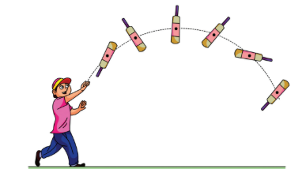

படம் 5.1 நிறை மையத்தின் பரவளையப் பாதை

  
பரவளையப் பாதையை மேற்கொள்ளும் அக்குறிப்பிட்ட புள்ளியே பொருளின் நிறை மையம் என்றழைக்கப்படுகிறது. இவ்வியக்கமானது தனித்து எறியப்பட்ட புள்ளிப்பொருளின் இயக்கத்தை ஒத்திருக்கும். பொருளொன்றின் ஒட்டு மொத்த நிறையும் செறிந்திருப்பதாகத் தோன்றும் புள்ளியானது பொருளின் நிறை மையம் என வரையறுக்கப்படுகிறது. ஆகவே இப்புள்ளியானது ஒட்டு மொத்தப் பொருளையும் குறிக்கிறது.

ஒழுங்கான வடிவம் மற்றும் சீரான நிறையைப் பெற்றிருக்கும் பொருட்களில் நிறைமையமானது பொருளின் வடிவியல் மையத்தில் (Geometric centre) அமைந்திருக்கும். எடுத்துக்காட்டாக வட்டம் மற்றும் கோளப் பொருட்களுக்கு நிறை மையமானது அதன் மையத்திலும், சதுரம் மற்றும் செவ்வக வடிவப் பொருட்கள், கனசதுரம் மற்றும் கனசெவ்வகப் பொருட்களுக்கு அவற்றின் மூலைவிட்டங்கள் சந்திக்கும் புள்ளியிலும் நிறைமையம் அமைந்திருக்கும். மற்ற பொருட்களுக்குச் சிலமுறைகளைப் பயன்படுத்திக் காணலாம். நிறை மையமானது பொருட்களின் உள்ளேயோ அல்லது வெளியேயோ அமையலாம்.

### 5.1.3 பரவலாக அமைந்த புள்ளி நிறைகளின் நிறைமையம்

ஒரு புள்ளி நிறை என்பது எவ்வித வடிவமும் அளவும் இல்லாமல் சுழியற்ற நிறையைக் கொண்டதாக அனுமானிக்கப்பட்ட ஒரு புள்ளியாகும். $m_1$, $m_2$, $m_3$ . . . $m_n$ என்ற n புள்ளி நிறைகளைக் கொண்ட தொகுப்பின் நிறை மையத்தைக் கண்டறிய, முதலில் நாம் ஆதிப்புள்ளியையும் தகுந்த ஆய அச்சு அமைப்பையும் தெரிவு செய்ய வேண்டும். படம் 5.2 இல் காட்டியுள்ள படி $x_1$,$x_2$,$x_3$…$x_n$ ஆகியவை x அச்சில் புள்ளி நிறைகளின் ஆய அச்சு நிலைகளாகக் கருதுவோம்.

$x_{cm}$ என்பது எல்லா புள்ளி நிறைகளின் நிறை மைய நிலையின் x ஆயத் தொலைவு எனில், அதன் சமன்பாடு

\[ x_{CM} = \frac{\sum m_i x_i}{\sum m_i} \]

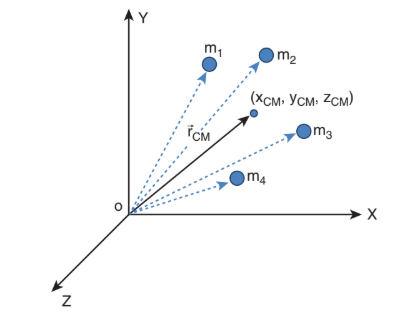

 படம் 5.2 பரவலாக அமைந்த புள்ளி நிறைகளின் நிறைமையம்

இங்கு, \(\sum m_i\) என்பது எல்லாத் துகள்களின் மொத்த நிறை. அதாவது, \(M = \sum m_i\) ஆகும்.

\[ x_{CM} = \frac{\sum m_i x_i}{M} \tag{5.1} \]

இதைப்போன்றே (படம் 5.2 இல் காட்டியுள்ளபடி) பரவலாய் அமைந்துள்ள புள்ளி நிறைகளின் நிறை மையத்திற்கான y, z ஆயத்தொலைவுகளையும் நாம் கண்டறியலாம்.

\[ y_{CM} = \frac{\sum m_i y_i}{M} \tag{5.2} \]

\[ z_{CM} = \frac{\sum m_i z_i}{M} \tag{5.3} \]

ஆகவே, கார்ட்டீசியன் ஆய அச்சு அமைப்பில் இப்புள்ளி நிறைகளின் நிறை மையத்தின் நிலை ($x_{CM}$, $y_{CM}$, $z_{CM}$) ஆகும். பொதுவாக, நிறைமையத்தின் நிலையை வெக்டர் வடிவிலேயே எழுதுகிறோம்.

\[ \vec{r}_{CM} = \frac{\sum m_i \vec{r}_i}{M} \tag{5.4} \]

இங்கு, \(\vec{r}_{CM} = x_{CM}\hat{i} + y_{CM}\hat{j} + z_{CM}\hat{k}\) என்பது நிறை மையத்தின் நிலை வெக்டர் ஆகும். மேலும், \(\vec{r}_i = x_i\hat{i} + y_i\hat{j} + z_i\hat{k}\) என்பது ஒரு குறிப்பிட்ட புள்ளி நிறையின் நிலை வெக்டர் ஆகும். இங்கு \(\hat{i}, \hat{j}, \hat{k}\) என்பவை முறையே X, Y மற்றும் Z அச்சுகளின் திசையில் அமைந்த ஓரலகு வெக்டர்கள் ஆகும்.

### 5.1.4 இருபுள்ளி நிறைகளின் நிறை மையம்

நிறை மையத்திற்கான மேற்கண்ட சமன்பாட்டின் மூலம், X அச்சில் முறையே $x_1$ மற்றும் $x_2$ தொலைவில் அமைந்துள்ள $m_1$, $m_2$ என்ற இரண்டு புள்ளி நிறைகளின் நிறை மையத்தைக் கண்டறிவோம். இந்நேர்வில், ஆய அச்சு அமைப்பைப் பொருத்து நிறை மையத்தின் நிலையைக் கீழ்க்கண்ட மூன்று வழிகளில் காணலாம்.

**(i) நிறைகள் நேர் X அச்சில் உள்ளபோது**

படம் 5.3 (a) இல் காட்டப்பட்டுள்ளதைப் போல $m_1$, $m_2$ என்ற நிறைகள் தன்னிச்சையாக எடுக்கப்பட்ட ஆதிப்புள்ளியைப் பொருத்து நேர் X அச்சில் முறையே $x_1$, மற்றும் $x_2$ நிலைகளில் உள்ளதாக எடுத்துக் கொள்வோம். நேர் X அச்சிலேயே $x_cm$ என்ற தொலைவில் அமைந்த நிறை மையத்தின் சமன்பாடானது

\[ x_{CM} = \frac{m_1 x_1 + m_2 x_2}{m_1 + m_2} \]

**(ii) நிறைகளில் ஏதேனும் ஒன்று ஆதியுடன் ஒன்றியுள்ளபோது**

படம் 5.3 (b) இல் காட்டப்பட்டுள்ளவாறு ஏதேனும் ஒரு நிறை ஆய அச்சின் ஆதிப்புள்ளியோடு ஒன்றியுள்ள போது கணக்கீடானது இன்னும் எளிதாக்கப்படுகிறது. புள்ளி நிறை $m_1$ ஆதிப்புள்ளியோடு ஒன்றும்போது, அதன் நிலை $x_1$ சுழியாகிறது அதாவது, $x_1$ = 0 எனவே,

\[ x_{CM} = \frac{m_1(0) + m_2 x_2}{m_1 + m_2} = \frac{m_2 x_2}{m_1 + m_2} \]

**(iii) நிறைமையமானது ஆதியுடன் ஒன்றியுள்ளபோது**

ஆய அச்சு அமைப்பின் ஆதிப்புள்ளியானது நிறை மையத்தோடு ஒன்றியுள்ள போது $x_{CM}$ = 0 மேலும் படம் 5.3 (c) இல் காட்டியுள்ளபடி நிறை $m_1$ ன் நிலையானது எதிர்குறி X அச்சில் அமையும். எனவே இதன் நிலை எதிர்குறியாக இருக்கும்.

\[ 0 = \frac{m_1(-x_1) + m_2 x_2}{m_1 + m_2} \]

\[ 0 = -m_1 x_1 + m_2 x_2 \]

\[ m_1 x_1 = m_2 x_2 \]

மேலே கொடுக்கப்பட்டுள்ள சமன்பாடு திருப்புதிறன்களின் தத்துவம் எனப்படுகிறது. இதைப்பற்றி பிரிவு 5.3.3 இல் விரிவாகப் பயிலலாம்.
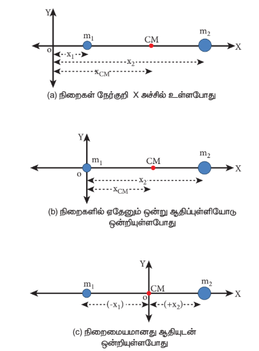
படம் 5.3 ஆதிப்புள்ளியை நகர்த்துவதன் மூலம் இரண்டு புள்ளிநிறைகளின் நிறைமையம் கணக்கிடப்படுகிறது

**எடுத்துக்காட்டு 5.1**

3 kg, 5 kg என்ற இரு புள்ளி நிறைகள் X அச்சில் ஆதிப்புள்ளியிலிருந்து முறையே 4 m, 8 m என்ற தொலைவில் உள்ளன. இரு புள்ளி நிறைகளின் நிறை மையத்தின் நிலைகளை,
(i) ஆதிப்புள்ளியிலிருந்தும்
(ii) 3 kg நிறையிலிருந்தும் காண்க.

**தீர்வு**

$m_1$ = 3 kg, $m_2$ = 5 kg என எடுத்துக் கொள்வோம்.

**(i) ஆதிப்புள்ளியிலிருந்து நிறை மையத்தைக் கண்டறிதல்**

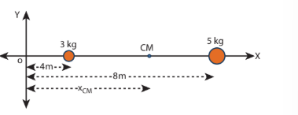

புள்ளி நிறைகள் X அச்சில் ஆதிப்புள்ளியிலிருந்து $x_1$ = 4m, $x_2$ = 8m என்ற தொலைவில் உள்ளன. எனவே நிறை மையம்.

\[ x_{CM} = \frac{m_1 x_1 + m_2 x_2}{m_1 + m_2} \]

\[ x_{CM} = \frac{3 \times 4 + 5 \times 8}{3 + 5} \]

\[ x_{CM} = \frac{12 + 40}{8} = \frac{52}{8} = 6.5 \, \text{m} \]

ஆதிப்புள்ளியிலிருந்து நிறை மையம் 6.5 m தொலைவில் அமைந்திருக்கும்.

**(ii) 3 kg நிறையிலிருந்து நிறை மையத்தைக் கண்டறிதல்**

3 kg நிறையை ஆதிப்புள்ளிக்கு X அச்சில் இடமாற்றம் செய்வதாக கொள்வோம். ஆதிப்புள்ளியானது X அச்சில் 3 kg நிறையுள்ள இடத்தில் எடுத்துக் கொள்ளப்படுகிறது. எனவே 3 kg புள்ளி நிறையின் நிலை சுழியாகும் ($x_1$ = 0) மாற்றப்பட்ட ஆதிப் புள்ளியிலிருந்து 5 kg நிறை 4 m தொலைவில் உள்ளது. ($x_2$ = 4m)

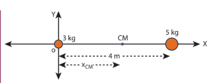

\[ x_{CM} = \frac{3 \times 0 + 5 \times 4}{3 + 5} \]

\[ x_{CM} = \frac{0 + 20}{8} = 2.5 \, \text{m} \]

3 kg புள்ளி நிறையிலிருந்து 2.5 m தொலைவில் (5 kg புள்ளி நிறையிலிருந்து 1.5 m தொலைவிலும்) நிறை மையம் அமைந்துள்ளது.

* இம்முடிவானது, நிறை மையம் அதிக நிறைக்கு அருகில் உள்ளதைக் காட்டுகிறது.

* ஆதிப்புள்ளி நிறைமையத்தில் அமையுமாறு கருதும்போது, திருப்புத் திறன்களின் தத்துவத்தை ஒத்து அமைகிறது. $m_1$ $x_1$ = $m_2$ $x_2$; 3 × 2.5 = 5 × 1.5; 7.5 = 7.5

நிகழ்வு (i) யை (ii) உடன் ஒப்பிடும் போது $3\text{ kg}$ நிறையின் நிறைமையத்தினை $6.5\text{ m}$ லிருந்து $4\text{ m}$ ஐக் கழிக்க $x_{\text{cm}} = 2.5\text{ m}$ எனவும் கண்டறியலாம் இது நிகழ்வு (i) இன் நிறைமையத்தின் நிலையிலேயே உள்ளது

**எடுத்துக்காட்டு 5.2**

R ஆரமுடைய சீரான பரப்பு நிறை அடர்த்தி கொண்ட வட்டத்தட்டிலிருந்து R/2 ஆரமுடைய ஒரு சிறு தட்டு வடிவப் பகுதி படத்தில் காட்டியுள்ளவாறு வெட்டி எடுக்கப்படுகிறது. மீதமுள்ள பகுதியின் நிறை மையத்தைக் கணக்கிடுக.

**தீர்வு**

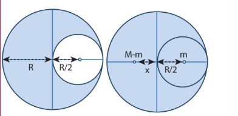
வெட்டப்படாத வட்டத்தட்டின் நிறையானது M என எடுத்துக் கொள்க. இதனுடைய நிறை மையமானது வட்டத்தட்டின் வடிவியல் மையத்தில் அமையும். இப்புள்ளியிலேயே ஆதிப்புள்ளியும் ஒருங்கமைகிறது.

வெட்டி எடுக்கப்பட்ட சிறு வட்டத்தட்டின் நிறை m என்க. (அதன் நிறை மையம் ஆதிப்புள்ளிக்கு) வலது புறத்தில் R/2 என்ற தொலைவில் படத்தில் காட்டியுள்ளவாறு அமைந்திருக்கும்.

எனவே வட்டத்தட்டின் மீதமுள்ள பகுதியின் நிறை மையம் ஆதிப்புள்ளிக்கு இடது புறத்தில் X தொலைவில் உள்ளதாக எடுத்துக் கொள்வோம். திருப்புத்திறன்களின் தத்துவத்திலிருந்து, கீழ்கண்டவாறு எழுத முடியும்.

\[ (M - m)x = m \left(\frac{R}{2}\right) \]

\[ x = \frac{m}{M - m} \left(\frac{R}{2}\right) \]

பரப்பு நிறை அடர்த்தி \(\sigma = \frac{M}{\pi R^2}\) (σ என்பது ஓரலகு பரப்பின் நிறை) எனில், சிறிய வட்டத் தட்டின் நிறை (m) என்பது

\[ m = \text{பரப்பு நிறை அடர்த்தி} \times \text{பரப்பு} \]

\[ m = \sigma \times \pi \left(\frac{R}{2}\right)^2 = \frac{M}{\pi R^2} \times \frac{\pi R^2}{4} = \frac{M}{4} \]

x-ன் சமன்பாட்டில் m-ன் மதிப்பைப் பிரதியிட

\[ x = \frac{M/4}{M - M/4} \times \frac{R}{2} = \frac{1/4}{3/4} \times \frac{R}{2} = \frac{R}{6} \]

மீதமுள்ள வட்டத் தட்டின் நிறைமையமானது வட்டத் தட்டின் மையத்திற்கு இடப்புறம் R/6 என்ற தொலைவில் இருக்கும்.

* பெரிய வட்டத்தட்டிலிருந்து பொதுவான மையத்தை (common centre) பொருத்து சிறிய பகுதி வெட்டியெடுக்கப்பட்டால் மீதமுள்ள வட்டத்தட்டின் நிறை மையம்
எங்கு அமையும்?

**எடுத்துக்காட்டு 5.3**

10 kg, 5 kg நிறையுடைய இரு புள்ளி நிறைகளின் நிலை வெக்டர்கள் முறையே 
\((-3\hat{i} + 2\hat{j} + 4\hat{k})\) m, \((3\hat{i} + 6\hat{j} - 5\hat{k})\) m ஆகும். நிறை மையத்தின் நிலையைக் கண்டறியவும்.

**தீர்வு:**

$m_1 = 10\text{ kg}$

$m_2 = 5\text{ kg}$

$\vec{r}_1 = (-3\hat{i} + 2\hat{j} + 4\hat{k})\text{ m}$

$\vec{r}_2 = (3\hat{i} + 6\hat{j} + 5\hat{k})\text{ m}$

$$\vec{r} = \frac{m_1\vec{r}_1 + m_2\vec{r}_2}{m_1 + m_2}$$

$$\therefore \vec{r} = \frac{10(-3\hat{i} + 2\hat{j} + 4\hat{k}) + 5(3\hat{i} + 6\hat{j} + 5\hat{k})}{10 + 5}$$

$$= \frac{-30\hat{i} + 20\hat{j} + 40\hat{k} + 15\hat{i} + 30\hat{j} + 25\hat{k}}{15}$$$$= \frac{-15\hat{i} + 50\hat{j} + 65\hat{k}}{15}$$

$$\vec{r} = \left(-\hat{i} + \frac{10}{3}\hat{j} + \frac{13}{3}\hat{k}\right)\text{ m}$$

$\vec{r}$ என்பது நிறைமையத்தின் நிலை வெக்டரைக் குறிக்கும்.

### 5.1.5 சீராகப் பரவியுள்ள நிறையின் நிறை மையம்

ஒரு பெரிய பொருளில் நிறையானது சீராக பரவியுள்ளது எனில் அதில் ஒரு சிறிய நிறை (\(\Delta m\)) ஆனது புள்ளி நிறையாக எடுத்துக் கொள்ளப்படுகிறது. மேலும் அச்சிறிய துகள்களுடைய நிறைகளின் கூட்டுத்தொகையினைக் கொண்டு நிறைமையத்தின் ஆயத்தொலைவுகளுக்கான சமன்பாட்டினைப் பெறலாம்.

\[ x_{CM} = \frac{\sum (\Delta m_i)x_i}{\sum \Delta m_i}, 
\quad y_{CM} = \frac{\sum (\Delta m_i)y_i}{\sum \Delta m_i}, 
\quad z_{CM} = \frac{\sum (\Delta m_i)z_i}{\sum \Delta m_i}
\]
 $${(5.5)}$$

மற்றொரு வகையில் அந்தச் சிறிய துகள்களின் நிறையை மீநுண் (infinitesimally small) மதிப்பாக (மிகச்சிறியது) (dm) கருதும்பொழுது கூட்டுத்தொகையை கீழ்க்கண்டவாறு தொகையீடாகக் கூறலாம்.

\[ x_{cm} = \frac{\int xdm}{\int dm}, \quad y_{cm} = \frac{\int ydm}{\int dm}, \quad z_{cm} = \frac{\int zdm}{\int dm} \tag{5.6} \]

>மீநுண் மதிப்பளவு என்பது சுழியை நோக்கிச் செல்லக்கூடிய மிக மிகச் சிறிய அளவாகும்.

**எடுத்துக்காட்டு 5.4**

M நிறையும் l நீளமும் கொண்ட சீரான நீள் அடர்த்தி கொண்ட (uniform rod) தண்டின் நிறை மையத்தைக் கண்க.

**தீர்வு**

M நிறையும் l நீளமும் உடைய ஒரு சீரான நீள் அடர்த்தி கொண்ட தண்டினைக் (uniform rod) கருதுக. அதன் ஒரு முனை படத்தில் காட்டியுள்ளபடி ஆதிப்புள்ளியுடன் ஒன்றியிருப்பதாக எடுத்துக்கொள்வோம். தண்டானது X அச்சில் வைக்கப்பட்டுள்ளது. தண்டினுடைய நிறை மையத்தைக் கண்டறிய, ஆதிப்புள்ளியிலிருந்து x தொலைவில் dx நீளமும் dm என்ற மீநுண் நிறையும் கொண்ட சிறுபகுதியை எடுத்துக் கொள்வோம்.

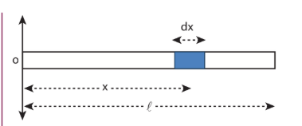

தண்டின் நீள் அடர்த்தி (ஓரலகு நீளத்திற்கான நிறை) \(\lambda = \frac{M}{l}\)

சிறிய பகுதியின் நிறை \(dm = \lambda \, dx = \frac{M}{l} dx\)

தண்டின் நிறை மையத்திற்கான சமன்பாட்டை கீழ்க்கண்டவாறு எழுதலாம்.

\[ x_{CM} = \frac{\int xdm}{\int dm} = \frac{\int_0^l x \frac{M}{l} dx}{M} = \frac{1}{l} \int_0^l xdx \]

\[ = \frac{1}{l} \left[\frac{x^2}{2}\right]_0^l = \frac{1}{l} \left(\frac{l^2}{2}\right) = \frac{l}{2} \]

நிலை l/2 என்பது தண்டின் வடிவியல் மையமாகும். இதிலிருந்து சீரான தண்டினைப் பொறுத்தவரை அதன் வடிவியல் மையத்திலேயே (Geometric centre) நிறை மையம் அமையும் என்ற முடிவிற்கு வரலாம்.

### 5.1.6 நிறை மையத்தின் இயக்கம்

ஒரு திண்மப் பொருள் இயங்கும் போது, அதன் நிறை மையமும் பொருளோடு சேர்ந்தே இயங்கும். நிறை மையத்தின் திசை வேகம் \({v}_{CM}\) முடுக்கம் \({a}_{CM}\) போன்ற இயக்கவியல் அளவுகளைப் பெற, நிறை மையத்தின் நிலையை தொடர் வகையீடு செய்வதன்மூலம் பெறலாம். எளிமையாகக் கணக்கிட, பொருள் X – அச்சில் மட்டும் இயங்குவதாகக் கருதுவோம்.

சமன்பாடு 5.5 லிருந்து

\[ \vec{v}_{CM} = \frac{d\vec{x}_{CM}}{dt} = \frac{\sum m_i \frac{d\vec{x}_i}{dt}}{\sum m_i} = \frac{\sum m_i \vec{v}_i}{\sum m_i} \]

\[ \vec{v}_{CM} = \frac{\sum m_i \vec{v}_i}{M} \tag{5.7} \]

\[ \vec{a}_{CM} = \frac{d}{dt}\left(\frac{d\vec{x}_{CM}}{dt}\right) = \frac{d\vec{v}_{CM}}{dt} = \frac{\sum m_i \frac{d\vec{v}_i}{dt}}{\sum m_i} = \frac{\sum m_i \vec{a}_i}{M} \]

\[ \vec{a}_{CM} = \frac{\sum m_i \vec{a}_i}{M} \tag{5.8} \]

புறவிசைகள் இல்லாத போது, \(\vec{F}_{ext} = 0\), அமைப்பின் தனித்தனியான துகள்கள் அகவிசையினால் மட்டுமே இயக்கமோ அல்லது இடப்பெயர்வோ அடையும். இது நிறைமையத்தின் நிலையை பாதிக்காது. அதாவது புறவிசை இல்லாதபோது நிறை மையம் ஓய்வு நிலையிலோ அல்லது சீரான இயக்கநிலையிலோ இருக்கும். எனவே நிறை மையம் ஓய்வு நிலையில் இருக்கும் போது \(\vec{v}_{CM}\) சுழியாகும். சீரான இயக்கத்தில் உள்ளபோது நிறைமையத்தின் திசைவேகம் மாறிலியாக இருக்கும். (\(\vec{v}_{CM} = 0\) or \(\vec{v}_{CM}\) மாறிலி). இங்கே நிறை மையமானது முடுக்கத்தினைக் கொண்டிருக்காது \(\vec{a}_{CM} = 0\).

சமன்பாடு 5.7 மற்றும் 5.8 லிருந்து,

\[ \vec{v}_{CM} = \frac{\sum m_i \vec{v}_i}{\sum m_i} = 0 \text{ அல்லது மாறிலி} \]

\[ \vec{a}_{CM} = \frac{\sum m_i \vec{a}_i}{\sum m_i} = 0 \]

இங்கு ஒவ்வொரு துகளும் அகவிசையின் காரணமாக அவற்றின் திசைவேகம் மற்றும் முடுக்கத்துடன் இயங்குகின்றன.

புறவிசைகள் செயல்படும்போது (i.e. \(\vec{F}_{ext} \neq 0\)), நிறைமையத்தின் முடுக்கத்திற்கான சமன்பாட்டை கீழ்க்கண்டவாறு பெறலாம்.

$$\vec{F}_{\text{ext}} = \left(\sum m_i\right)\vec{a}_{\text{CM}} \;; \quad \vec{F}_{\text{ext}} = M\vec{a}_{\text{CM}} \;; \quad \vec{a}_{\text{CM}} = \frac{\vec{F}_{\text{ext}}}{M}$$
**எடுத்துக்காட்டு 5.5**

50 kg நிறையுள்ள ஒரு மனிதர் நிலையான நீரின் பரப்பில் மிதந்து கொண்டிருக்கும் 300 kg நிறையுடைய படகில் ஒரு முனையில் நின்று கொண்டிருக்கிறார். அவர் தரையில் நிலையாக உள்ள ஒருவரை பொருத்து படகின் மறுமுனையை நோக்கி 2 m s-1 என்ற மாறா திசைவேகத்தில் நடந்து செல்கிறார். (a) நிலையான உற்றுநோக்குபவரை பொருத்தும் (b) படகில் நடந்து கொண்டிருக்கும் மனிதரைப் பொருத்தும் படகின் திசைவேகம் என்ன?

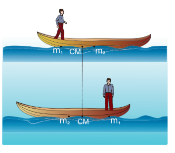

[தகவல்: படகுக்கும் மனிதருக்கும் இடையே உராய்வு உள்ளது. ஆனால் படகுக்கும் நீருக்கும் இடையே உராய்வு கிடையாது.]

**தீர்வு**

மனிதரின் நிறை m1 = 50 kg

படகின் நிறை m2 = 300 kg

நிலையான உற்றுநோக்குபவரைப் பொருத்து:

மனிதர் நகரும் திசைவேகம் v1 = 2 m s-1 மேலும் படகு நகரும் திசைவேகம் v2 (கண்டறியப்பட வேண்டியது) என்க.

**(i) தரையில் நிலையாக உள்ள உற்றுநோக்குபவரைப் பொருத்து படகின் திசைவேகத்தைக் கணக்கிடுதல்**

அமைப்பின் மீது புறவிசைகள் செயல்படாதபோது, படகு – மனித அமைப்பின் அகவிசையாக செயல்படும் உராய்வின் காரணமாக மனிதன் - படகு அமைப்பு (boat – man system) இயங்குகிறது. ஆகவே நிறை மையத்தின் திசைவேகம் சுழியாகும் (vCM = 0).

நிறைமையத்தின் சமன்பாடு (5.7) லிருந்து,

\[ 0 = \frac{\sum m_i v_i}{\sum m_i} = \frac{m_1 v_1 + m_2 v_2}{m_1 + m_2} \]

\[ 0 = m_1 v_1 + m_2 v_2 \]

\[ -m_2 v_2 = m_1 v_1 \]

\[ v_2 = -\frac{m_1}{m_2} v_1 \]

\[ v_2 = -\frac{50}{300} \times 2 = -\frac{100}{300} = -0.33 \, \text{m s}^{-1} \]

இங்கே, நிலையாக உள்ள உற்றுநோக்குபவருக்கு எதிர் திசையில் படகு செல்வதை எதிர்குறி காட்டுகிறது.

**(ii) நடக்கும் மனிதரைப் பொருத்து படகின் திசைவேகத்தைக் கண்டறிதல்**

படகின் சார்புத் திசைவேகத்தை பின்வருமாறு கணக்கிடலாம்.

\[ {v}_{21} = {v}_2 - {v}_1 \]

இங்கே, $v_{21}$ என்பது நடக்கும் மனிதரைப் பொருத்து படகின் சார்புத் திசைவேகமாகும்

\[ v_{21} = -0.33 - 2 = -2.33 \, \text{m s}^{-1} \]

மனிதர் தன்னுடைய வலப்புறம் நகரும்போது படகு அவரின் இடதுபுறமாக நகர்வதை விடையில் உள்ள எதிர்குறி காட்டுகிறது.

> * நடக்கும் மனிதனைப்பொருத்து படகின் சார்புத் திசைவேகத்தின் எண்மதிப்பானது, நிலையாக உற்றுநோக்குபவரைப் பொருத்து படகின் சார்புத் திசைவேகத்தின் எண்மதிப்பை விட அதிகம்.
> * நிலையாக உற்றுநோக்குபவருக்கும் படகில் நடந்து செல்பவருக்கும் எதிர்திசையில் படகு இயங்குவதால் இரு விடைகளும் எதிர்குறியில் உள்ளன.

**வெடித்தலின் நிறை மையம்**
ஓய்வு நிலையிலோ அல்லது சீரான இயக்கத்திலோ உள்ள பொருளின் அகவிசைகளினால் (internal forces) வெடித்தல் நடைபெறுமாயின், அதன் நிறை மையத்தின் நிலை பாதிக்கப்படுவதில்லை. அது அதே ஓய்வு நிலையிலோ அல்லது சீரான திசைவேகத்திலோ இருக்கும். ஆனால் வெடித்த பகுதிகளின் இயக்கவியல் அளவுகள் (kinematics quantities) பாதிக்கப்படும். வெடித்தலானது புறவிசைகளின் காரணமாக நிகழுமாயின் நிறைமையம், மற்றும் வெடித்த பகுதிகள் ஆகியவற்றின் இயக்கவியல் அளவுகள் பாதிக்கப்படும்.

**எடுத்துக்காட்டு 5.6**
$5\text{ kg}$ நிறையுள்ள எறியானதி, (projectile) அது இயக்கத்தில் உள்ளபோதே தானாக வெடித்து இரு கூறுகளாகப் பிரிகிறது. அதில் $3\text{ kg}$ நிறையுடைய ஒரு கூறானது, வீச்சின் நான்கில் மூன்று பங்கு $\left(\frac{3}{4}R\right)$ தொலைவில் விழுகிறது. மற்றொரு கூறு எங்கு விழும்?

**தீர்வு**

புறவிசைகளின் துணையின்றி தானாக வெடிப்பதால் எறியத்தின் நிறைமையம் பாதிக்கப்படாது. மேலும் நிறைமையமானது தொடர்ந்து பரவளையப் பாதையிலேயே செல்லும். ஆனால் அதன் கூறுகளானது பரவளையப் பாதையை மேற்கொள்ளாது. கூறுகள் அனைத்தும் தரையில் விழும்போது நிறைமையம் எறியப்பட்ட புள்ளியிலிருந்து படத்தில் காட்டப்பட்டது போல் $R$ தொலைவை (நெடுக்கம்) அடைகிறது. ஆகவே  

இறுதியில், படத்தில் காட்டியுள்ளபடி நிறை மையமானது எறி புள்ளியிலிருந்து R தொலைவில் (நெடுக்கம்) அமைந்திருக்கும்.

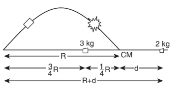

நிறைமையத்தின் இறுதி நிலையை ஆதி புள்ளியாக எடுத்துக் கொண்டால், திருப்புத்திறன்களின் தத்துவத்தின் படி

$$m_1 x_1 = m_2 x_2$$

இங்கு, $m_1 = 3\text{ kg}$, $m_2 = 2\text{ kg}$, $x_1 = \frac{1}{4}R$ மற்றும் $x_2 = d$ என எடுத்துக் கொள்க.

$$3 \times \frac{1}{4}R = 2 \times d \;; \quad d = \frac{3}{8}R$$

எறி புள்ளிக் கும் $2\text{ kg}$ நிறை விழுந்துள்ள புள்ளிக்கும் இடையேயுள்ள தொலைவு $R + d$.

$$R + d = R + \frac{3}{8}R = \frac{11}{8}R = 1.375R$$

எனவே $2\text{ kg}$ நிறையுடைய மற்றொரு கூறானது எறிபுள்ளியிலிருந்து $1.375R$ என்ற தொலைவில் விழுகிறது. (இங்கு $R$ என்பது எறிபொருளின் கிடைத்தள நெடுக்கமாகும்)

## 5.2 திருப்பு விசை மற்றும் கோண உந்தம் (Torque and Angular Momentum)

ஒரு பொருளின் மீது நிகர விசை செயல்படும்போது, அவ்விசையானது நேர்கோட்டு இயக்கத்தை விசையின் திசையில் ஏற்படுத்தும். பொருளானது ஒரு புள்ளியிலோ அல்லது அச்சிலோ பொருத்தப்பட்டுள்ளது எனில், அவ்விசையானது பொருளை சுழலச் செய்கிறது. சுழற்சியானது விசை செயல்படும் புள்ளியைப் பொறுத்து அமையும். இவ்வாறு விசை ஏற்படுத்தும் சுழற்சி விளைவை விசையின் திருப்புத்திறன் என்கிறோம். இது திருப்புவிசை எனவும் அழைக்கப்படுகிறது. இவ்வகை இயக்கத்திற்கு நடைமுறை வாழ்க்கையில் ஏராளமான எடுத்துக்காட்டுகள் உள்ளன. அவற்றில் சில: கீல்களைப் பொறுத்து கதவுகளை திறந்து மூடுதல் மற்றும் திருகு குறடு (wrench) மூலம் திருகு மறையை (nut) சுழலச்செய்தல்.

சுழற்சியின் அளவானது விசையின் எண்மதிப்பு, அதன் திசை, மற்றும் விசை செயல்படும் புள்ளிக்கும் அச்சுக்கும் இடைப்பட்ட தொலைவு இவற்றை சார்ந்தது. திருப்பு விசையானது சுழற்சி இயக்கத்தை ஏற்படுத்தும்பொழுது அப்பொருளின் கோண உந்தமானது நேரத்தைப் பொருத்து மாறுபடும். இப்பகுதியில் திருப்பு விசை மற்றும் திண்மப்பொருளில் அதன் விளைவு ஆகியவை பற்றி பயில்வோம்.

### 5.2.1 திருப்பு விசையின் வரையறை

ஒரு புள்ளி அல்லது அச்சைப் பொருத்து பொருளின் மீது செயல்படுத்தப்படும் புற விசையின் திருப்புத்திறன் திருப்பு விசை என வரையறுக்கப்படுகிறது. திருப்பு விசையின் சமன்பாடு

\[ \vec{\tau} = \vec{r} \times \vec{F} \tag{5.9} \]

இங்கு, \(\vec{r}\) என்பது படம் 5.4 ல் காட்டியுள்ளவாறு ஆயபுள்ளியிலிருந்து பொருளின் மீது \(\vec{F}\) என்ற விசை செயல்படும் புள்ளியின் நிலை வெக்டராகும்.
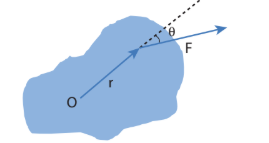

படம் 5.4 ஒரு திண்மப்பொருளின் மீதான திருப்புவிசை

இங்கு \(\vec{r}\) மற்றும் \(\vec{F}\) இன் பெருக்குத் தொகையை வெக்டர் பெருக்கம் அல்லது குறுக்குப் பெருக்கம் எனலாம். இரு வெக்டர்களை, வெக்டர் பெருக்கம் அல்லது குறுக்கு பெருக்கம் செய்யும்போது வரும் வெக்டரானது அவ்விரு வெக்டர்களுக்கு செங்குத்துத் திசையில் இருக்கும். (அலகு 2 பிரிவு 2.5.2 இல் காண்க) எனவே திருப்பு விசை \(\vec{\tau}\) என்பது வெக்டர் அளவாகும்.

திருப்பு விசையானது எண்ணளவில் rF sinθ, என்ற எண்மதிப்பையும், \(\vec{r}\) மற்றும் \(\vec{F}\) க்கு செங்குத்தான திசையும் பெற்றிருக்கிறது. இதன் அலகு N m.

\[ \vec{\tau} = rF\sin\theta \, \hat{n} \tag{5.10} \]

இங்கு θ என்பது \(\vec{r}\) மற்றும் \(\vec{F}\)-க்கு இடைப்பட்ட கோணம் மற்றும் \(\hat{n}\) என்பது \(\vec{\tau}\) இன் திசையில் அமைந்த ஓரலகு வெக்டர். திருப்புவிசை \(\vec{\tau}\) என்பது \(\vec{r}\) மற்றும் \(\vec{F}\) ஆகிய இரு வெக்டர்களில் இருந்து பெறப்படுவதால், இதனை போலி வெக்டர் (pseudo vector) என்றும் அழைக்கலாம்.

திருப்பு விசையின் திசையினை வலக்கை விதியை பயன்படுத்தி காணலாம். இவ்விதியின்படி, வலதுகையின் விரல்கள் நிலைவெக்டரின் திசையிலும் உள்ளங்கை விசையின் திசையைப் பார்த்தவாறும் வைத்துக்கொண்டு விரல்களை மடக்கும்போது நீட்டப்பட்ட கட்டைவிரல் திருப்பு விசையின் திசையைக் குறிக்கும். இது படம் 5.5 இல் காட்டப்பட்டுள்ளது.

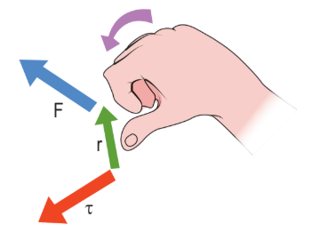

படம் 5.5 வலக்கை விதியின் மூலம் திருப்பு விசையின் திசை

திருப்பு விசையின் திசையைக் கொண்டு, அத்திருப்பு விசை எவ்வகையான சுழற்சியை ஏற்படுத்தும் என்று கண்டறியலாம். உதாரணமாக திருப்பு விசையின் திசையானது தளத்திற்கு வெளியே செயல்படுகிறது எனில் திருப்பு விசையினால் ஏற்படும் சுழற்சி கடிகார முள் சுழலும் (இடஞ்சுழி) திசைக்கு எதிர்த் திசையிலும், மாறாக தளத்தை நோக்கி திருப்பு விசையானது செயல்படுகிறது எனில் சுழற்சியின் திசை கடிகார முள் சுழலும் திசையிலேயே (வலஞ்சுழி) செயல்படுகிறது. இவை படம் 5.6 இல் காட்டப்பட்டுள்ளன.
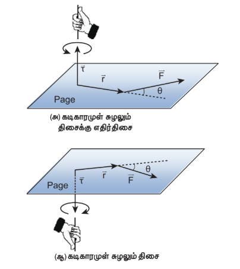

படம் 5.6 திருப்பு விசையின் திசை மற்றும் சுழற்சியின் வகைகள்

  
திருப்பு விசையின் எண்மதிப்பும், திசையும் பல நிகழ்வுகளில் தனித்தனியே பெறப்படுகின்றன. திருப்பு விசையின் திசையைக் கண்டறிய வலக்கைவிதி அல்லது வெக்டர் விதியை பயன்படுத்தியும், எண்மதிப்பை கண்டறிய ஸ்கேலர் வடிவத்தை பயன்படுத்தியும், அதாவது

\[ \tau = rF\sin\theta \tag{5.11} \]

என்ற சமன்பாட்டின் மூலமும் பெறலாம்.

திருப்பு விசையின் எண் மதிப்பை பெற sinθ வை r அல்லது F உடன் சேர்த்து இருவகைகளில் குறிக்கலாம்.

\[ \tau = r(F\sin\theta) = rF_{\perp} \tag{5.12} \]

\[ \tau = (r\sin\theta)F = r_{\perp}F \tag{5.13} \]

இங்கு, \(F\sin\theta\) என்பது \(\vec{r}\) க்கு செங்குத்தான \(\vec{F}\) இன் கூறு. அதே போல் \(r\sin\theta\) என்பது \(\vec{F}\) க்கு செங்குத்தான \(\vec{r}\) ன் கூறு. இவ்விரு நிகழ்வுகளையும் படம் 5.7 இல் காணலாம்.
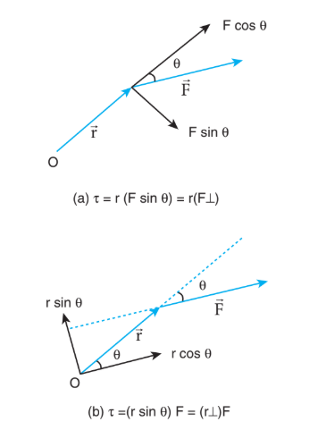

படம் 5.7 திருப்பு விசையைக் கணக்கிடும் இருமுறைகள்

\(\vec{r}\) மற்றும் \(\vec{F}\) க்கு இடைப்பட்ட கோணம் θ வை அடிப்படையாகக் கொண்டு திருப்பு விசையானது வெவ்வேறு மதிப்புகளைப் பெறும்.

\(\vec{r}\) மற்றும் \(\vec{F}\) ஆனது ஒன்றுக்கொன்று செங்குத்தாக உள்ளபோது திருப்பு விசையின் மதிப்பு பெருமமாகும். அதாவது θ = 90° எனும்பொழுது sin 90° = 1, என்பதால் \(\tau_{max} = rF\)

\(\vec{r}\) மற்றும் \(\vec{F}\) இணையாக ஒரே திசையிலோ, எதிரெதிர் திசையிலோ செயல்படும்போது திருப்பு விசையின் மதிப்பு சுழியாகிறது. இரு வெக்டர்களும் இணையாக ஒரே திசையில் உள்ளபோது θ = 0° மற்றும் sin 0° = 0. இரு வெக்டர்களும் இணையாக எதிரெதிர் திசையில் உள்ளபோது θ = 180° மற்றும் sin 180° = 0. எனவே விசையானது ஆதாரப்புள்ளியில் செயல்படுகிறதெனில் \(\vec{r} = 0\) மற்றும் τ = 0 அதாவது திருப்பு விசையின் மதிப்பு சுழியாகும். இதன் வெவ்வேறான நிகழ்வுகளை கீழ்கண்ட அட்டவணை 5.1 காணலாம்.

**அட்டவணை 5.1. வெவ்வேறு நிகழ்வுகளில் τ இன் மதிப்பு**

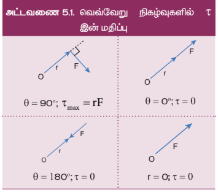

**எடுத்துக்காட்டு 5.7**

ஸ்பேனரின் கைப்பிடிக்கு செங்குத்தாக படத்தில் காட்டியுள்ளவாறு விசை செலுத்தப்படுகிறது. (i) திருகு மறை (Nut) யின் மையத்தைப் பொருத்து விசையின் திருப்பு விசை (ii) திருப்பு விசையின் திசை மற்றும் (iii) திருகு மறையைப் (Nut) பொருத்து திருப்பு விசை ஏற்படுத்தும் சுழற்சியின் வகை ஆகியவற்றைக் காண்க.

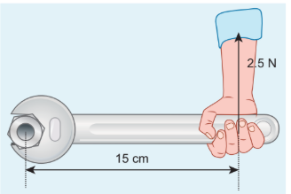

**தீர்வு**

ஸ்பேனரின் கைப்பகுதியின் நீளம், r = 15 cm = 15×10⁻² m
செலுத்தப்பட்ட விசை, F = 2.5 N

r க்கும் F க்கும் இடைப்பட்ட கோணம் θ = 90°
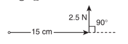
(i) திருப்பு விசை, \(\tau = rF\sin\theta\)

\[ \tau = (15 \times 10^{-2}) \times 2.5 \times \sin 90^\circ \]

\[ \tau = 37.5 \times 10^{-2} \, \text{N m} \]

[இங்கு, sin 90° = 1]

(ii) வலக்கை விதிப்படி, திருப்பு விசையின் திசையானது தாளின் தளத்திலிருந்து வெளிநோக்கி அமைந்துள்ளது.

(iii) திருப்பு விசை ஏற்படுத்திய சுழற்சி கடிகாரத்தின் திசைக்கு எதிர்திசையில் உள்ளது.

**எடுத்துக்காட்டு 5.8**

\(4\hat{i} + 3\hat{j} - 5\hat{k}\) N விசையானது \(7\hat{i} + 4\hat{j} + 2\hat{k}\) m என்ற புள்ளியில் அமைந்த நிலைவெக்டரின் மீது செயல்படுகிறது. ஆதியைப் பொருத்து திருப்பு விசையின் மதிப்பை காண்க.

**தீர்வு**

\[ \vec{r} = 7\hat{i} + 4\hat{j} + 2\hat{k} \]

\[ \vec{F} = 4\hat{i} + 3\hat{j} - 5\hat{k} \]

திருப்பு விசை, \(\vec{\tau} = \vec{r} \times \vec{F}\)

\[ \vec{\tau} = \begin{vmatrix} \hat{i} & \hat{j} & \hat{k} \\ 7 & 4 & 2 \\ 4 & 3 & -5 \end{vmatrix} \]

\[ \vec{\tau} = \hat{i}(20 - 6) - \hat{j}(35 + 8) + \hat{k}(- 21 - 16) \]

\[ \vec{\tau} = 14\hat{i} - 43\hat{j} - 37\hat{k} \, \text{N m} \]

**எடுத்துக்காட்டு 5.9**

பளு தூக்கி ஒன்றின் கரத்தின் நீளம் 20 m அக்கரமானது செங்குத்து அச்சோடு 30° கோணத்தில் நிறுத்தப்பட்டுள்ளது. 2 டன் எடையானது கரத்தால் தூக்கி நிறுத்தப்பட்டுள்ளது. பளுதூக்கியின் கரம் பொருத்தப்பட்ட நிலையான புள்ளியைப் பொருத்து புவியீர்ப்புவிசை ஏற்படுத்திய திருப்பு விசையைக் காண்க.

[தகவல்: 1 டன் = 1000 kg; g = 10 m s⁻², கரத்தின் எடை புறக்கணிக்கத்தக்கது]

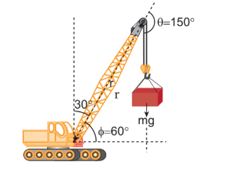

**தீர்வு**

> **குறிப்பு:** பெரும்பான்மையான கணக்குகளில் \(\vec{r}\) மற்றும் \(\vec{F}\) க்கு இடையேயுள்ள கோணம் நேரடியாக கொடுக்கப்படுவதில்லை. எனவே மாணவர்கள் \(\vec{r}\) மற்றும் \(\vec{F}\)க்கு இடையேயுள்ள கோணத்தை θ என எடுத்துக்கொள்ளப் பழகவும். அமைப்பில் உள்ள மற்ற கோணங்களை குறியிடும்போது α, β, φ எனவும் குறிக்கலாம்.

தொங்கவிடப்பட்ட நிறையினால் ஏற்படும் விசை F = mg = 2000 × 10 = 20000 N;
கரத்தின் நீளம் r = 20 m

இந்த கணக்கிற்கு மூன்று வெவ்வேறு முறைகளில் தீர்வு காணலாம்.

**முறை – I**

விசை F க்கும் கரத்தின் நீளம் r க்கும் இடையேயான கோணம் θ = 150°

பொருத்தப்பட்ட நிலை புள்ளியைப் பொருத்து கரத்தின் திருப்பு விசை

\[ \tau = rF\sin\theta \]

\[ \tau = 20 \times 20000 \times \sin 150^\circ \]

\[ \tau = 400000 \times \sin(90^\circ + 60^\circ) \]$$\left[\text{இங்கு, } \sin(90^\circ + \theta) = \cos \theta\right]$$

\[ \tau = 400000 \times \cos 60^\circ \]

$$= 400000 \times \frac{1}{2} \quad \left[\cos 60^\circ = \frac{1}{2}\right]$$

\[ \tau = 200000 \, \text{N m} \]

\[ \tau = 2 \times 10^5 \, \text{N m} \]

**முறை – II**

விசையையும், பளுதூக்கியில் கரம் பொருத்தப்பட்ட புள்ளியிலிருந்து செங்குத்து தொலைவையும் கருதுவோம்.

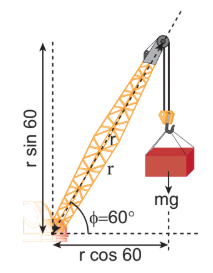

\[ \tau = r_{\perp}F \]
$$\tau = r \cos\phi \,\, mg$$

\[ \tau = (r\cos 60^\circ)(mg) \]

\[ \tau = 20 \times \frac{1}{2} \times 20000 \]

\[ \tau = 200000 \, \text{N m} \]

\[ \tau = 2 \times 10^5 \, \text{N m} \]

**முறை – III**

பளு தூக்கியின் கரம் பொருத்தப்பட்ட புள்ளியையும் செங்குத்து விசையையும் கருதுவோம்.

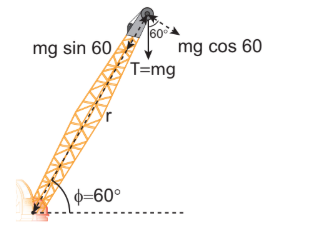

\[ \tau = rF_{\perp} \]
$$\tau = r \, mg \cos\phi$$

\[ \tau = r(mg \cos 60^\circ) \]

\[ \tau = 20 \times 20000 \times \frac{1}{2} \]

\[ \tau = 200000 \, \text{N m} \]

\[ \tau = 2 \times 10^5 \, \text{N m} \]

மூன்று முறைகளும் ஒரே தீர்வினை தருகிறது.

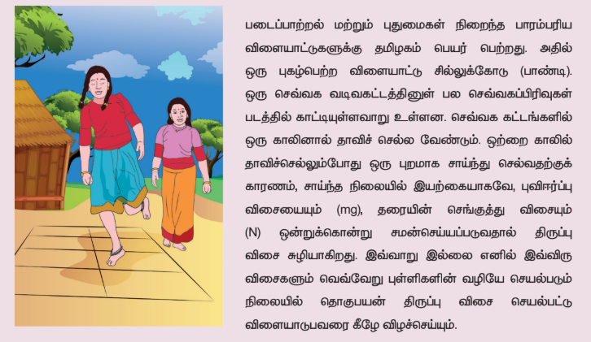

### 5.2.2 அச்சைப் பொருத்து திருப்பு விசை (Torque about an axis)

இதுவரை ஒரு புள்ளியைப் பொருத்து திருப்பு விசையைப் பற்றி பயின்றோம். இப்பகுதியில் அச்சைப் பொருத்து திருப்பு விசையைப் பற்றி பயிலலாம். திண்மப்பொருள் ஒன்று AB யைப் பொருத்து சுழல்வது படம் 5.8 இல் காட்டப்பட்டுள்ளது. திண்மப்பொருளில் P என்ற புள்ளியில் F விசை செயல்படுகிறது என கொள்க. விசை F ஆனது தளம் ABP ல் அமையாமலும் இருக்கலாம். அச்சு AB யில் ஏதேனும் ஒரு புள்ளியை ஆதிப்புள்ளி O என எடுத்துக்கொள்வோம்.
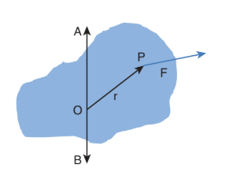

படம் 5.8 அச்சைப் பொருத்து திருப்பு விசை

  

புள்ளி O வைப்பொருத்து \(\vec{F}\) ன் திருப்புவிசை, \(\vec{\tau} = \vec{r} \times \vec{F}\). மேலும், அச்சின் திசையில் இத்திருப்பு விசையின் கூறானது அச்சைப்பொறுத்த திருப்பு விசையாகும். இதனை கண்டறிய நாம் முதலில் திருப்பு விசை \(\vec{\tau} = \vec{r} \times \vec{F}\) மற்றும் திருப்புவிசை வெக்டர் \(\vec{\tau}\) க்கும் அச்சு AB க்கும் இடையேயான கோணம் φ யை காண வேண்டும். (விசையின் தளம் ABP யில் இல்லை என்பதை நினைவில் கொள்க). அச்சு AB யை பொருத்து உள்ள திருப்புவிசை என்பது திருப்புவிசையின் கிடைத்தளக்கூறு \(\tau \cos φ\) ஆகும். அதைப்போல அச்சு AB க்கு செங்குத்தான திருப்புவிசை என்பது திருப்புவிசையின் செங்குத்துக்கூறு \(\tau \sin φ\) ஆகும். அச்சைப்பொருத்த திருப்புவிசை ஒரு திண்மப்பொருளை அச்சைப்பொருத்து சுழலச் செய்கிறது. மேலும், அச்சுக்கு செங்குத்தாக உள்ள திருப்புவிசை அச்சைச் சுழற்றுகிறது அல்லது சாய்க்கிறது. இவ்விரண்டு கூறுகளுமே ஒரே நேரத்தில் திண்மப்பொருளின் மீது செயல்படும் போது பொருளானது அச்சுச் சுழற்சியை (precession) மேற்கொள்ளும். சுழலும் பம்பரம் ஒன்று ஓய்வு நிலையை நெருங்கும் போது அச்சு சுழற்சியை மேற்கொள்ளும் என்பதை படம் 5.9 லிருந்து அறியலாம்.

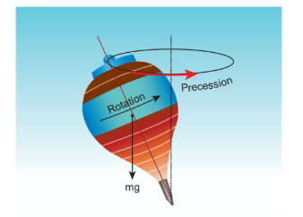

படம் 5.9 சுழலும் பம்பரத்தின் அச்சுச் சுழற்சி

  
அச்சுச் சுழற்சியை விளக்குவது என்பது இப் பாடப்பகுதிக்கு அப்பாற்பட்டது. எனவே, திருப்பு விசைகளின் செங்குத்து கூறுகளின் விளைவை நீக்குவதற்கு சிலவரம்புகளைக் கருதினால் சுழல் அச்சு சுழற்சி அடையாமல் நிலையான அச்சைப்பொருத்து சுழற்சியை ஏற்படுத்தலாம். எனவே, திருப்புவிசையின் செங்குத்து கூறுகளை கருத வேண்டிய அவசியம் இல்லை. இதன் பின்னர் உள்ள பாடப்பகுதியில் திண்மப்பொருட்களின் சுழற்சியை நிலையான அச்சைப்பொருத்தே கருதலாம். அதற்கு,

(1) அச்சிற்கு, செங்குத்தான தளத்தில் அமைந்த மற்றும் அச்சினை வெட்டிச்செல்லாத விசைகளை மட்டுமே கருத வேண்டும்.

(2) அச்சிற்கு செங்குத்தாக உள்ள நிலை வெக்டரை மட்டுமே கருத வேண்டும்.

> **குறிப்பு:** அச்சுக்கு இணையான விசை, அச்சுக்கு செங்குத்தான திசையில் திருப்பு விசையை கொடுக்கிறது. மேலும் இதனை கருத வேண்டிய அவசியமும் இல்லை. அச்சை வெட்டிச் செல்லும் விசைகள், r = 0 என்பதால் திருப்பு விசையை உருவாக்காது. அச்சின் வழியேயான நிலை வெக்டர் அச்சிற்கு செங்குத்தாக திருப்பு விசையை விளைவிக்கும் எனவே இதனைக் கருத வேண்டிய அவசியம் இல்லை.

**எடுத்துக்காட்டு 5.10**

AB, CD என்ற இரு ஒன்றுக்கொன்று செங்குத்தான O வில் இணைக்கப்பட்ட சட்டங்கள் படத்தில் காட்டியுள்ளவாறு தரையில் நிலையாக பொருத்தப்பட்டுள்ளது. ஒரு கம்பி D என்ற புள்ளியில் கட்டப்பட்டுள்ளது. கம்பியின் தனித்த முனை E யானது விசை \(\vec{F}\) இனால் இழுக்கப்படுகிறது. விசை உருவாக்கிய திருப்பு விசையின் எண் மதிப்பையும், திசையையும், 

(i) E, D, O மற்றும் B புள்ளிக்களைப் பொருத்து

(ii) DE, CD, AB மற்றும் BG அச்சுகளைப் பொறுத்து காண்க.
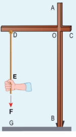

**தீர்வு**

(i) புள்ளி E யைப் பொருத்து திருப்புவிசை சுழி. (E வழியாக \(\vec{F}\) செயல்படுவதால்).

புள்ளி D யைப் பொருத்து திருப்புவிசை சுழி. (D வழியாக \(\vec{F}\) செயல்படுவதால்).

புள்ளி O யைப் பொருத்து திருப்புவிசை \(\vec{OE} \times \vec{F}\) அச்சுகள் AB மற்றும் CD க்கு செங்குத்தாக அமையும்.

புள்ளி B யைப் பொருத்து திருப்புவிசை \(\vec{BE} \times \vec{F}\) அச்சுகள் AB மற்றும் CD க்கு செங்குத்தாக அமையும்.

(ii) அச்சு DE யைப் பொருத்து திருப்புவிசை சுழி (\(\vec{F}\) ஆனது DE க்கு இணையாக உள்ளதால்).

அச்சு CD யைப் பொருத்து திருப்புவிசை சுழி (\(\vec{F}\) ஆனது CD யை வெட்டிச் செல்வதால்).

அச்சு AB யைப் பொருத்து திருப்புவிசை சுழி (\(\vec{F}\) ஆனது AB க்கு இணையாக உள்ளதால்).

அச்சு BG யைப் பொருத்து திருப்புவிசை சுழி (\(\vec{F}\) ஆனது BG யை வெட்டிச் செல்வதால்).

ஓர் அச்சைப் பற்றிய விசையின் திருப்புவிசை ஆதிப்புள்ளியை அந்த அச்சிலேயே தேர்ந்தெடுத்தால் ஆதியை தேர்ந்தெடுப்பதை சார்ந்திராமல், அமையும். இதனை கீழ்க்கண்டவாறு காணலாம்.

திண்மப் பொருளொன்றில் உள்ள AB என்ற சுழற்சி அச்சில் உள்ள O என்ற ஆதிப்புள்ளியை எடுத்துக்கொள்வோம். புள்ளி P யின் மீது விசை \(\vec{F}\) செயல்படுவதை படத்தில் காட்டியுள்ளவாறு கருதுவோம். இப்போது அச்சில் ஏதேனும் ஒரு இடத்தில் மற்றொரு புள்ளி O' ஐ படத்தில் காட்டியுள்ளவாறு, தேர்வு செய்து கொள்ளலாம்.
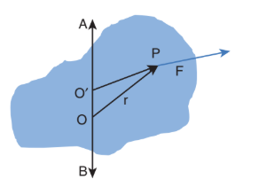

படம் 5.10 ஆதிப் புள்ளியைச் சார்ந்திராத சுழலும் பொருளின் அச்சைப்பொருத்து திருப்புவிசை

  
O’ யைப் பொருத்த விசையின் திருப்புவிசை,

\[ \vec{\tau}_{O'} = \vec{OP} \times \vec{F} = (\vec{OO'} + \vec{O'P}) \times \vec{F} = \vec{OO'} \times \vec{F} + \vec{O'P} \times \vec{F} \]

\(\vec{OO'} \times \vec{F}\) என்பது \(\vec{OO'}\) க்கு செங்குத்தாக இருப்பதால், இப்பகுதியானது AB வழியாக எந்த கூறையும் பெற்றிருப்பதில்லை. எனவே, \(\vec{OP} \times \vec{F}\) மற்றும் \(\vec{O'P} \times \vec{F}\) யின் சம கூறினைப் பெற்றிருக்கும்.

### 5.2.3 திருப்பு விசை மற்றும் கோண முடுக்கம் (Torque and Angular Acceleration)

நிலையான அச்சைப் பொருத்து சுழலும் திண்மப் பொருளைக் கருதுக. ஒரு புள்ளி நிறை m ஆனது படத்தில் காட்டியுள்ளவாறு நிலையான அச்சைப் பொருத்து வட்ட இயக்கத்தை மேற்கொள்கிறது. தொடுவியல் விசை \(\vec{F}\) ஆனது புள்ளி நிறையை சுழலச் செய்ய தேவையான திருப்பு விசையை அளிக்கிறது. இந்த தொடுவிசை \(\vec{F}\) ஆனது புள்ளி நிறையின் நிலை வெக்டருக்கு செங்குத்தாக செயல்படுகிறது.

இது புள்ளி நிறை m இன் மீது உருவாக்கும் திருப்பு விசையானது
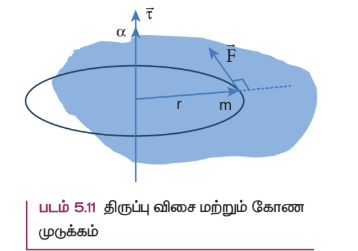
\[ \tau = rF\sin 90^\circ = rF \quad (\because \sin 90^\circ = 1) \]

\[ \tau = rma \quad (\because F = ma) \]

\[ \tau = rm(r\alpha) \quad (\because a = r\alpha) \]

\[ \tau = mr^2\alpha \tag{5.14} \]

இவ்விசையானது நிலை வெக்டர் \(\vec{r}\) க்கு செங்குத்தாக புள்ளி நிறையின் மீது செயல்படுகிறது. அச்சைப்பொருத்து புள்ளி நிறையின் மீது செயல்படும் திருப்பு விசையானது அந்த அச்சைப்பொருத்து புள்ளிநிறையின் மீது கோண முடுக்கம், α வை உருவாக்குகிறது.

வெக்டர் வடிவில்

\[ \vec{\tau} = mr^2\vec{\alpha} \tag{5.15} \]

τ மற்றும் α இவற்றின் திசையானது சுழலும் அச்சின் வழியாகவே அமையும். τ இன் திசையில் α அமைந்தால், இது கோண முடுக்கத்தை ஏற்படுத்தும். மாறாக, τ ன் திசை α வுக்கு எதிராக அமைந்தால் கோண எதிர்முடுக்கத்தை உருவாக்கும். சமன்பாடுகள் 5.14 மற்றும் 5.15 இல் உள்ள கோவை "mr²" புள்ளி நிறையின் நிலைமத்திருப்புத் திறன் என்று அழைக்கப்படுகிறது. திண்மப் பொருளானது புள்ளி நிறையைப் போன்ற பல துகள்களால் ஆக்கப்பட்டுள்ளது. எனவே, அப்பொருளின் நிலைமத் திருப்புத்திறன் என்பது அப்பொருள் உள்ளடக்கிய தனித்தனியான எல்லா புள்ளி நிறைகளின் நிலைமத் திருப்புத் திறன்களின் கூடுதல் \(I = \sum (m_i r_i^2)\) ஆகும். எனவே, திருப்பு விசையின் சமன்பாடு

\[ \vec{\tau} = \sum m_i r_i^2 \vec{\alpha} \tag{5.16} \]

\[ \vec{\tau} = I\vec{\alpha} \tag{5.17} \]

வெவ்வேறான வடிவம் கொண்ட பொருட்களின் நிலைமத்திருப்புதிறன் மற்றும் அதன் முக்கியத்துவத்தை மேலும் பிரிவு 5.4 இல் பயிலலாம்.

### 5.2.4 கோணஉந்தம்

சுழற்சி இயக்கத்தில் கோணஉந்தம் என்பது இடம்பெயர்வு இயக்கத்தில் உள்ள நேர்கோட்டு உந்தத்திற்கு இணையான ஒரு இயற்பியல் அளவு. நேர்கோட்டு உந்தத்தின் திருப்புத்திறனாது புள்ளிநிறையின் கோணஉந்தம் என வரையறுக்கப்படுகிறது. மாறாக, ஒரு புள்ளி அல்லது அச்சிலிருந்து \(\vec{r}\) நிலையில் உள்ள ஒரு புள்ளி நிறையின் நேர்கோட்டு உந்தம் \(\vec{p}\) எனில்,

அதன் கோண உந்தம் \(\vec{L}\) –ஐ கணிதவியலின்படி பின்வருமாறு எழுதலாம்.

\[ \vec{L} = \vec{r} \times \vec{p} \tag{5.18} \]

கோண உந்தத்தின் எண்மதிப்பு

\[ L = rp\sin\theta \tag{5.19} \]

இங்கு θ என்பது \(\vec{r}\) க்கும் \(\vec{p}\) க்கும், இடைப்பட்ட கோணம். கோண உந்தம் \(\vec{L}\) ஆனது \(\vec{r}\) மற்றும் \(\vec{p}\) இருக்கும் தளத்திற்கு செங்குத்தான தளத்தில் அமையும். திருப்பு விசையை முந்தைய நிகழ்வுகளில் எழுதியது போன்றே இங்கும் sinθ வை \(\vec{r}\) அல்லது \(\vec{p}\) யோடு சேர்ந்து எழுத முடியும்.

\[ L = r(p\sin\theta) = rp_{\perp} \tag{5.20} \]

\[ L = (r\sin\theta)p = r_{\perp}p \tag{5.21} \]

இங்கு, p⊥ என்பது r க்கு செங்குத்தான நேர்கோட்டு உந்தத்தின் கூறு, அதைப்போன்ற r⊥ என்பது p க்கு செங்குத்தான நிலைவெக்டரின் கூறு.

நேர்க்கோட்டு உந்தம் சுழியாகும் போதோ (\(\vec{p} = 0\)) அல்லது துகளானது ஆதிப்புள்ளியில் \(\vec{r} = 0\) உள்ளபோதோ அல்லது \(\vec{r}\) மற்றும் \(\vec{p}\) இணையான திசையிலோ, எதிரெதிரான திசையிலோ அமைந்திருக்கும் (θ = 0° or 180°) போதோ கோண உந்தம் சுழி (L = 0) ஆகும்.

கோண உந்தம் சுழற்சி இயக்கத்திற்கு மட்டும் தொடர்புடையது என தவறுதலாக புரிந்து கொள்ளக் கூடாது. இது உண்மையல்ல. கோண உந்தமானது நேர்கோட்டு இயக்கத்திற்கும் தொடர்புடையது. இதனை கீழ்க்கண்ட எடுத்துக்காட்டிலிருந்து அறிந்து கொள்ளலாம்.

**எடுத்துக்காட்டு 5.11**

m நிறை கொண்ட துகளானது v என்ற மாறாத திசை வேகத்துடன் இயங்குகிறது. ஏதேனும் ஒரு புள்ளியைப் பொருத்து இயக்கம் முழுவதிலும் இதன் கோண உந்தம் மாறாதது எனக் காட்டுக.

**தீர்வு**

m நிறை கொண்ட Q துகளானது மாறா திசைவேகம் \(\vec{v}\) யுடன் செல்வதாக கொள்வோம். 
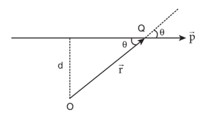
மாறா திசைவேகம் என்பதால் துகளின் பாதை நேர்க்கோட்டு பாதையாக அமையும். அதன் உந்தமும் (\(\vec{p} = m\vec{v}\)) அதே பாதையில் நேர்கோட்டில் அமையும். அப்பாதையிலிருந்து செங்குத்து தொலைவில் (d) ஆதிப்புள்ளி O வை எடுத்துக் கொள்வோம். ஒரு குறிப்பிட்ட கணத்தில் Q என்ற புள்ளியில் அமைந்த துகளின் நிலை வெக்டர் \(\vec{OQ} = \vec{r}\) என்க. ஒரு குறிப்பிட்ட கணத்தில் \(\vec{r}\) க்கும் \(\vec{p}\) க்கும் இடைப்பட்ட கோணம் θ என்க எனவே அக்கணத்தில் கோண உந்தத்தின் எண்மதிப்பு

\[ L = OQ \cdot p \sin\theta = OQ \cdot mv \sin\theta = mv (OQ \sin\theta) \]

இங்கு \(OQ \sin\theta\) என்பது ஆதிப்புள்ளிக்கும் பொருள் செல்லும் திசைக்கும் உள்ள செங்குத்துத் தொலைவு ஆகும். எனவே, துகள் Q வின் ஆதியைப்பொறுத்த கோண உந்தம்

\[ L = mvd \]

மேற்கண்ட கோண உந்தத்தின் சமன்பாடு கோணம் θ வை பெற்றிருப்பதில்லை. நேர்கோட்டு உந்தம் p (p = m v) மற்றும் செங்குத்து தொலைவு d இரண்டும் மாறிலிகள். ஆதலால், துகளின் கோண உந்தமும் மாறாது. எனவே கோண உந்தமானது நேர்கோட்டு இயக்கத்தில் உள்ள பொருட்களோடும் தொடர்புடையது. பொருள் செல்லும் நேர்க்கோட்டு திசை, ஒருவேளை ஆதிப்புள்ளி வழியாகச் சென்றால் கோண உந்தம் சுழியாகவும், அது மாறாததாகவும் இருக்கும்.

### 5.2.5 கோணஉந்தம் மற்றும் கோணத்திசைவேகம்

திண்மப் பொருள் ஒன்று நிலையான அச்சைப் பற்றி சுழல்கிறது. ஒரு புள்ளி நிறை m ஆனது படம் 5.12 இல் காட்டியுள்ளவாறு வட்ட இயக்கத்தை மேற்கொள்கிறது.
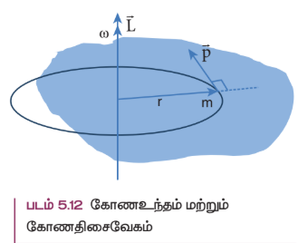

சுழலும் அச்சிலிருந்து r தொலைவில் புள்ளிநிறை m அமைந்துள்ளது. வட்டப்பாதையில் எந்தவொரு கணத்திலும் நேர்கோட்டு உந்தமானது வட்டப்பாதையின் தொடுகோட்டு திசையில் இருக்கும். கோண உந்தம் \(\vec{L}\) ஆனது \(\vec{r}\) மற்றும் \(\vec{p}\)-க்கு வட்டப்பாதையின் செங்குத்தாக இருக்கும். எனவே கோண உந்தம் சுழலும் அச்சின் திசையில் அமையும். இந்நிகழ்வில் θ என்பது \(\vec{r}\) கும் \(\vec{p}\) க்கும் இடைப்பட்ட கோணம். கோண உந்தம் (L) இன் எண் மதிப்பு θ = 90° எனும்போது

\[ L = rmv \sin 90^\circ = rmv \]

இங்கு, v என்பது நேர்கோட்டு திசைவேகம். வட்ட இயக்கத்தில் கோண திசை வேகத்திற்கும் ω, நேர்க்கோடு திசை வேகத்திற்குமான தொடர்பு \(v = r\omega\).

\[ L = rm(r\omega) = mr^2\omega \tag{5.22} \]

L மற்றும் ω ஆகியவற்றின் திசை சுழலும் அச்சின் திசையிலேயே இருக்கும். மேற்கண்ட சமன்பாட்டின் வெக்டர் வடிவம்,

\[ \vec{L} = mr^2\vec{\omega} \tag{5.23} \]

முன்னர் விவாதித்தது போல சமன்பாடு 5.22 மற்றும் 5.23 இல் கோவை உறுப்பு mr² ஆனது புள்ளி நிறையின் நிலைமத் திருப்புத்திறன் ஆகும். திண்மப் பொருளானது புள்ளி நிறைப்போன்ற பல துகள்களினால் உருவாக்கப்பட்டுள்ளது. எனவே திண்மப் பொருளின் நிலைம திருப்புத்திறன் என்பது அப்புள்ளி நிறைகளின் நிலைமத் திருப்புதிறனின் கூட்டுத் தொகை \(I = \sum m_i r_i^2\) ஆகும். எனவே, பொருளின் கோணஉந்தமானது,

\[ \vec{L} = \sum m_i r_i^2 \vec{\omega} \tag{5.24} \]

\[ \vec{L} = I\vec{\omega} \tag{5.25} \]

பிரிவு 5.4 ல் நிலைமத் திருப்புதிறன் பற்றி தெளிவாக பயிலலாம்.

### 5.2.6 திருப்பு விசை மற்றும் கோண உந்தம்

திண்மப் பொருளின் கோண உந்தம் எண்ணளவில் \(L = I\omega\) மற்றும் திண்மப் பொருளின் திருப்பு விசை \(\tau = I\alpha\). மேலும் திருப்புவிசையின் சமன்பாட்டை பின்வருமாறு எழுதலாம்.

\[ \tau = I\alpha = I\frac{d\omega}{dt} \tag{5.26} \]

இங்கு ω என்பது கோணத் திசைவேகம்.

\[ \tau = \frac{d(I\omega)}{dt} = \frac{dL}{dt} \tag{5.27} \]

மேற்கண்ட சமன்பாட்டின் மூலம் நாம் காண்பது புற திருப்பு விசையானது திண்மப்பொருள்களின் மீது நிலையான அச்சைப்பொருத்து கோண உந்த மாறுபட்டு வீதத்தை அதனுள் ஏற்படுத்தும். இது சுழற்சி பற்றிய நியூட்டனின் இரண்டாவது விதியாகும். மேலும் இச்சமன்பாடானது நேர்க்கோட்டு இயக்கத்தின் சமன்பாடான \(F = \frac{dp}{dt}\) வடிவத்தை ஒத்துள்ளது.

**கோண உந்த மாறா விதி (Conservation of angular momentum)**

சமன்பாடு 5.27 லிருந்து, புறத்திருப்புவிசையானது திண்மப் பொருட்களின் மீது செயல்படும் போது கோண உந்த மாறுபாட்டை ஏற்படுத்தும் என்பதை அறிகிறோம்.

\(\tau = 0\) எனில் \(\frac{dL}{dt} = 0; L =\) மாறிலி.

மேற்கண்ட சமன்பாடு கோணஉந்த மாறாவிதியைக் குறிக்கிறது. இதனைப் பற்றி பகுதி 5.5 இல் மேலும் பயிலலாம்.

## 5.3 திண்மப் பொருட்களின் சமநிலை (equilibrium of rigid bodies)

ஒரு பொருளானது மேசையின் மீது இயக்கமின்றி ஓய்வு நிலையில் உள்ளபோது பொருளின் மீது எந்த விசையும் செயல்படவில்லை என்கிறோம். உண்மையில் புவியீர்ப்பு விசையானது பொருளின் மீது கீழ்நோக்கியும் மேசையானது பொருளின் மீது ஏற்படுத்தும் எதிர்விசையானது மேல் நோக்கியும் அமைந்திருக்கும். இவ்விரு விசைகள் ஒன்றை ஒன்று சமன் செய்து கொள்கின்றன. எனவே, பொருளின் மீது நிகர விசை செயல்படவில்லை. பொருளின் மீது விசை செயல்படவில்லை என்பதற்கும், நிகர விசை செயல்பட வில்லை என்பதற்கும் அதிக வேறுபாடு உள்ளது. மேற்கூறிய விவாதமானது திருப்புத்திறன் அல்லது திருப்பு விசையின் அடிப்படையில் அமைந்த சுழற்சி இயங்கத்திற்கும் பொருந்தும்.

திண்மப் பொருளின் நேர்கோட்டு உந்தம் மற்றும் கோண உந்தம் மாறிலியாக இருந்தால் அப்பொருளானது எந்திரவியல் சமநிலையில் உள்ளது எனலாம்.

ஒரு பொருளின் நேர்க்கோட்டு உந்தம் மாறிலி எனில், அப்பொருளின் மீது செயல்படும் நிகரவிசை சுழியாகும்.

\[ \vec{F}_{net} = 0 \tag{5.28} \]

இந்நிபந்தனையின் படி பொருளானது இடப்பெயர்வில் சமநிலையில் உள்ளது. இதன்படி, பொருளின் மீது வெவ்வெறான திசைகளில் செயல்படும் \(\vec{F}_1, \vec{F}_2, \vec{F}_3, \dots\) என்ற விசைகளின் வெக்டர் கூடுதல் சுழியாகிறது.

\[ \vec{F}_1 + \vec{F}_2 + \vec{F}_3 + \dots + \vec{F}_n = 0 \tag{5.29} \]

பொருளின் மீது \(\vec{F}_1, \vec{F}_2, \vec{F}_3, \dots\) என்ற விசைகள் வெவ்வேறான திசைகளில் செயல்படுகின்றன எனில் அவற்றின் விளைவை முறையே கிடைத்தள மற்றும் செங்குத்து கூறுகளின் மூலம் தீர்வு காணலாம். இந்நிகழ்வில் கிடைத்தளச் சமநிலைக்கோ செங்குத்துச் சமநிலைக்கோ சாத்தியம் உள்ளது.

இதேபோல் கோண உந்தம் மாறிலியாக உள்ள போது பொருளின் மீதான நிகர திருப்பு விசை சுழியாகும்.

\[ \vec{\tau}_{net} = 0 \tag{5.30} \]

இந்நிபந்தனையின் படி பொருளானது சுழற்சி சமநிலையில் உள்ளது. சுழற்சிச் சமநிலையில் வெவ்வேறான சுழற்சியை உருவாக்கும் திருப்பு விசைகள் \(\vec{\tau}_1, \vec{\tau}_2, \vec{\tau}_3, \dots\) ஆகியவற்றின் வெக்டர் கூடுதல் சுழியாகிறது.

\[ \vec{\tau}_1 + \vec{\tau}_2 + \vec{\tau}_3 + \dots + \vec{\tau}_n = 0 \tag{5.31} \]

மேலும் ஒரு திண்மப்பொருளின் மீது நிகர விசையும், நிகர திருப்பு விசையும் சுழியாக இருந்தால் அத்திண்மப் பொருள் எந்திரவியல் சமநிலையில் உள்ளது என கூறலாம்.

\[ \vec{F}_{net} = 0 \text{ மற்றும் } \vec{\tau}_{net} = 0 \tag{5.32} \]

விசைகளும், திருப்பு விசைகளும் வெக்டர் அளவு என்பதால் இதன் திசைகளை தக்க குறியீடுகளுடன் பயன்படுத்த வேண்டும்.

### 5.3.1 சமநிலையின் வகைகள்

மேற்கண்ட விவாதத்தின்படி, வெவ்வேறான நிபந்தனைகளின் அடிப்படையில் வெவ்வேறு வகையான சமநிலைகளுக்கு வாய்ப்புள்ளது என்ற முடிவுக்கு வரலாம். இவை அட்டவணை 5.2 இல் தொகுக்கப்பட்டுள்ளன.

**அட்டவணை 5.2 பல்வேறு வகையான சமநிலைகளும் அதற்கான நிபந்தனைகளும்**

| சமநிலையின் வகைகள் | நிபந்தனைகள் |
|---|---|
| **இடப்பெயர்வு சமநிலை** | • நேர்கோட்டு உந்தம் மாறிலியாகும். • நிகர விசை சுழி |
| **சுழற்சி சமநிலை** | • கோண உந்தம் மாறிலி • நிகர திருப்பு விசை சுழி |
| **ஓய்வுச் சமநிலை** | • நேர்கோட்டு மற்றும் கோண உந்தங்களின் மதிப்பு சுழி • நிகரவிசை மற்றும் நிகரத் திருப்புவிசை சுழி |
| **இயக்கச் சமநிலை** | • நேர்கோட்டு மற்றும் கோண உந்தங்கள் மாறிலி • நிகர விசை மற்றும் நிகரத் திருப்பு விசைகள் சுழி. |
| **உறுதிச் சமநிலை** | • நேர்கோட்டு மற்றும் கோண உந்தங்களின் மதிப்பு சுழி • பொருளானது அதன் நிலையில் சிறிய மாற்றம் செய்யும் போது மீண்டும் சமநிலைக்கு வர முயற்சிக்கும். • சமநிலையில் ஏற்படும் மாற்றத்தினால் பொருளின் நிறைமையத்தின் நிலையானது சற்றே உயரும். • பொருள் சமநிலையில் இருக்கும்போது, அதன் நிலை ஆற்றல் சிறுமமாக இருக்கும். சமநிலையில் இருந்து மாறும்போது அதன் நிலை ஆற்றல் சற்றே உயரும். |
| **உறுதியற்றச் சமநிலை** | • நேர்கோட்டு மற்றும் கோண உந்தங்கள் சுழி. • பொருளானது சமநிலையிலிருந்து சற்றே மாற்றம் செய்து விடப்படும் போது மீண்டும் சமநிலைக்குத் திரும்ப வராது. • பொருளின் நிலையில் சிறிய மாற்றம் செய்யும்போது நிறைமையமானது சமநிலையிலிருந்து சற்று கீழ்புறமாக நகர்ந்து அமையும். • நிலை ஆற்றலானது சிறுமமாக இருக்காது. மேலும் சமநிலையில் மாற்றம் அடையும்போது, நிலை ஆற்றல் குறைகிறது. |
| **நடுநிலை சமநிலை** | • நேர்கோட்டு உந்தமும் மற்றும் கோண உந்தமும் சுழி. • பொருளின் நிலையில் மாற்றம் செய்து விடப்படும் போதும் சமநிலையிலேயே இருக்கும். • பொருளின் நிலையில் சிறிய மாற்றம் செய்யும்போது நிறை மையத்தின் நிலை உயரவோ தாழவோ செய்யாது. • பொருளின் நிலையில் சிறிய மாறுபாடு ஏற்படும் போதும் நிலை ஆற்றல் மாற்றம் அடையாது. |

**எடுத்துக்காட்டு 5.12**

28 kg நிறையும் 10 m நீளமும் கொண்ட சீரான மரத்துண்டை அருண் மற்றும் பாபு சுமந்து செல்கின்றனர். மரத்துண்டின் முனைகளிலிருந்து இவர்கள் முறையே 1 m மற்றும் 2 m தொலைவில் பிடித்துள்ளனர். இவர்களில் யார் மரத்துண்டின் எடையை அதிகம் தாங்கிச் செல்கின்றார் [g = 10 m s⁻²]

**தீர்வு**

மரத்துண்டானது இயந்திரவியல் சமநிலையில் உள்ளது எனக் கொள்க. அதன்படி மரத்துண்டின் மீது நிகர விசை மற்றும் நிகர திருப்பு விசையின் மதிப்பு சுழி. புவி ஈர்ப்பு விசையானது மரத்துண்டின் நிறைமையத்தில் கீழ் நோக்கி செயல்படும். அருண் மற்றும் பாபு முறையே A மற்றும் B புள்ளிகளில் செலுத்தும் $R_A$, $R_B$ என்ற செங்குத்து விசைகள் கீழ்நோக்கிய புவியீர்ப்பு விசையை சமன் செய்கிறது.

மரத்துண்டின் மொத்த எடை, W = mg = 28 × 10 = 280 N, ஆனது இருவராலும் தாங்கப்படுகிறது. மீள் செயல் விசையை இருவரும் தனித்தனியே அளிக்கின்றனர். மரத்துண்டின் மீது செயல்படும் அனைத்து விசைகளையும் தனித்த பொருளின் விசைப்படம் மூலம் காணலாம்.

இடப்பெயர்வு சமநிலையின் படி:
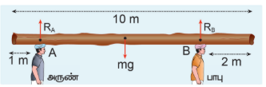
மரத்துண்டின் மீது செயல்படும் நிகர விசை சுழியாகிறது

\[ R_A + (- mg) + R_B = 0 \]

இங்கு, $R_A$ மற்றும் $R_B$ விசைகள் மேல்நோக்கிய நேர் குறியிலும். ஈர்ப்பியல் ஈர்ப்பு விசை (அல்லது எடை) கீழ்நோக்கி எதிர்குறியிலும் செயல்படுகிறது.

\[ R_A + R_B = mg \]

சுழற்சி சமநிலையின் படி:
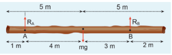
மரத்துண்டின் மீது செயல்படும் நிகர திருப்பு விசையின் மதிப்பு சுழியாகிறது. விசைகள் தொலைவிற்கு செங்குத்து என்பதால்,

\[ R_A(0) - mg(4) + R_B(7) = 0\]

இங்கு, எதிர்வினை $R_A$ ஆனது தாங்கும் புள்ளி A யிலேயே செயல்படுவதால் A யைப் பொருத்து $R_A$ யின் திருப்புவிசை சுழியாகும். ஆனால் எடை mg யானது A யைப் பொருத்து கடிகார திசையிலும், எதிர்வினை $R_B$ ஆனது A யைப் பொருத்து எதிர் கடிகார திசையிலும் திருப்பு விசைகளை ஏற்படுத்தும்.

\[ 7R_B = 4mg \]

\[ R_B = \frac{4}{7}mg \]

\[ R_B = \frac{4}{7} \times 28 \times 10 = 160 \, \text{N} \]

$R_B$ யின் மதிப்பை பிரதியிட,

\[ R_A = mg - R_B = 280 - 160 = 120 \, \text{N} \]

$R_B$ ஆனது $R_A$ ஐ விட அதிகமாக இருப்பதால், பாபு அருணைவிட அதிக எடையை சுமக்கிறார்.

### 5.3.2 இரட்டை (Couple)

AB என்ற சீரான மெல்லியக் கம்பியை கருதுக, இதன் நிறைமையம் மையப்புள்ளி C யில் அமைந்து உள்ளது. கம்பியின் இரு முனைகள் A, B யில் சமமான எதிரெதிரான விசைகள் முறையே கம்பிக்கு செங்குத்தாக 2r இடைவெளியில் செயல்படுகிறது. படம் 5.13 இல் காட்டியுள்ளவாறு இவ்விரு விசைகளும் செயல்படுகிறது.

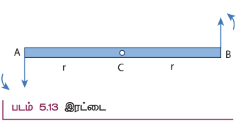
இரு சமமான விசைகள் எதிரெதிர் திசையில் செயல்பட்டு ஒன்றை ஒன்று சமன் செய்வதால் கம்பியின் மீதான நிகர விசை சுழியாகும். இப்பொழுது கம்பியானது இடப்பெயர்வு சமநிலையில் உள்ளது ஆனால் சுழற்சி சமநிலையில் இல்லை. எப்படி சுழற்சி சமநிலையில் இல்லை என்பதைக் காண்போம். கம்பியின் முனை A யில் செயல்படும் விசையின் திருப்புத்திறன் மையப்புள்ளி C யைப் பொருத்து எதிர் கடிகாரச் சுற்று (இடஞ்சுழி) திசையில் சுழற்சியை ஏற்படுத்தும். இதே போன்று கம்பியின் மறுமுனை B-ல் செயல்படும் விசையின் திருப்புத் திறனானது எதிர் கடிகாரச் சுற்று (இடஞ்சுழி) திசையிலே சுழற்சியை உருவாக்குகிறது. இவ்விரு விசையின் திருப்புத்திறன்களானது கம்பியின் மீது ஒரே மாதிரியான சுழற்சியை உணரச் செய்கிறது. எனவே, கம்பியானது இடப்பெயர்வு சமநிலையில் உள்ள போதும், சுழற்சி இயக்கத்திற்கு அல்லது திருப்பு விளைவிற்கு உள்ளாகிறது.

ஒரே நேர்கோட்டில் அமையாத, செங்குத்துத் தொலைவில் பிரிக்கப்பட்டுள்ள இரு சமமான எதிரெதிர் விசைகள் ஏற்படுத்தும் திருப்பு விளைவு இரட்டையின் திருப்புத்திறன் எனப்படும். அன்றாட வாழ்வில் நாம் காணும் பல செயல்களில் இரட்டையின் திருப்புத்திறனை படம் 5.14 இல் காணலாம்.

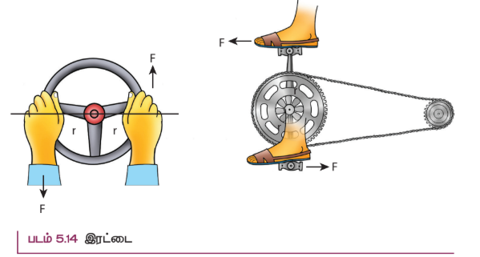

> **குறிப்பு:** சில நிகழ்வுகளில் இவ்விரு விசைகள் ஒன்றையொன்று சமன் செய்யாது. இரு விசைகள் ஒத்த விசைகளாக இல்லாமல் எதிரெதிர் திசையில் இல்லாமலும் இருப்பின், பொருளானது நேர்கோட்டு இயக்கம் மற்றும் சுழற்சி இயக்கம் இரண்டையும் பெற்றிருக்கும்.

### 5.3.3 திருப்புத் திறன்களின் தத்துவம்

மெல்லிய, புறக்கணிக்கத்தக்க (negligible) நிறையுள்ள கம்பித் துண்டு, நீளத்தின் வழியாக சுழலியக்க மையத்தில் பொருத்தப்பட்டுள்ளது. F1 மற்றும் F2 என்னும் இரு விசைகளானது d1 மற்றும் d2 தொலைவுகளில் கம்பியின் முனைகளில் செயல்படுவது படம் 5.15 இல் காட்டப்பட்டுள்ளது. F1 மற்றும் F2 என்ற இரு விசைகள் தாங்கு மையத்திலிருந்து d1 மற்றும் d2 தொலைவுகளில் செயல்படுவதனால் படத்தில் காட்டியுள்ளவாறு செங்குத்து எதிர்வினை N நிறை சுழலியக்க மையத்தில் செயல்படுகிறது. கம்பியானது கிடைத்தள நிலையில் ஓய்வாக இருப்பதற்கு அது நேர்கோட்டு மற்றும் சுழற்சி சமநிலையில் இருக்க வேண்டும். எனவே, நிகர விசை மற்றும் நிகர திருப்பு விசை இரண்டும் சுழியாகும்.

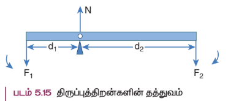
நேர்கோட்டு சமநிலையில்,

சுழலியக்க மையத்தை பற்றிய நிகர விசை சுழியாகும், \[- F_1 + N - F_2 = 0 \]

\[ N = F_1 + F_2 \]

சுழற்சி சமநிலையில்,

சுழலியக்க மையத்தை பற்றிய நிகர திருப்புவிசை சுழியாகும், \(d_1F_1 - d_2F_2 = 0\)

\[ d_1F_1 = d_2F_2 \tag{5.33} \]

இத்தத்துவத்தைக் கொண்டு கோல் தராசானது, \(d_1 = d_2; F_1 = F_2\) என்ற நிபந்தனையின் படி பொருட்களின் நிறையை அளவிடுகிறது. சமன்பாடு 5.33 யை மாற்றி அமைக்க

\[ \frac{F_1}{F_2} = \frac{d_2}{d_1} \tag{5.34} \]

$F_1$ பளு எனவும், $F_2$ வை நமது முயற்சி எனவும் கருதினால், $d_1$ < $d_2$ என்ற நிபந்தனையில் நமக்கு அனுகூலமாக அமையும். இது $F_1$ > $F_2$ என்பதைக் குறிக்கிறது. எனவே, பெரிய பளுவைக் கூட சிறிய முயற்சியினால் உயர்த்த முடியும். தகவு \(\frac{d_2}{d_1}\) எளிய நெம்புகோலின் இயந்திரலாபம் எனப்படும். சுழலியக்க மையப்புள்ளியை ஆதாரப்புள்ளி என்றும் அழைக்கலாம்.

\[ \text{இயந்திர லாபம் (MA)} = \frac{d_2}{d_1} \tag{5.35} \]

மேற்காணும் தத்துவத்தின் படி பல எளிய இயந்திரங்கள் இயங்குகின்றன.

### 5.3.4 ஈர்ப்பு மையம்

திண்மப் பொருட்கள் அனைத்தும் பல புள்ளி நிறைகளால் ஆக்கப்பட்டுள்ளது. புள்ளி நிறைகள் அனைத்தும் புவியின் மையத்தை நோக்கிய ஈர்ப்பியல் விசையினை உணர்கிறது. நடைமுறை வாழ்வில் எந்தவொரு திண்மப் பொருளின் அளவை விட புவி மிக பெரியதாக இருப்பதால் இவ்விசைகள் அனைத்தும் கீழ்நோக்கி இணையாக செயல்படுவதாக நாம் கருதலாம். இது படம் 5.16 இல் காட்டப்பட்டுள்ளது.

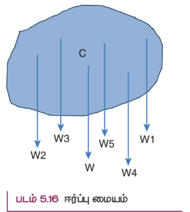
இந்த இணையான விசைகளின் தொகுபயன் விசை எப்பொழுதும் ஒரு புள்ளி வழியே செயல்படுகிறது. அப்புள்ளியே பொருளின் ஈர்ப்பு மையம் என்றழைக்கப்படுகிறது (புவியைப் பொருத்து). ஒரு பொருளின் நிலை மற்றும் திசையைக் கருதாத போது, அப்பொருளின் மொத்த எடையும் செயல்படுவதாகத் தோன்றும் புள்ளி அப்பொருளின் ஈர்ப்பு மையம் எனப்படும்.
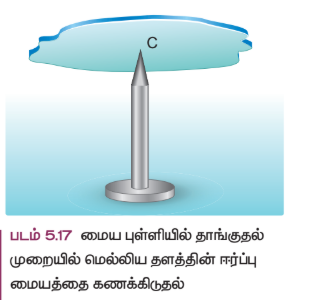

சீரான புவியீர்ப்பு புலத்தில் ஒரு திண்மப்பொருளின் நிறைமையமும், ஈர்ப்பு மையமும் ஒரே புள்ளியில் அமையும். புவியீர்ப்பு புலத்தைப் பற்றி அலகு 6 இல் விளக்கப்பட்டுள்ளது.

நாம் சீரான ஒழுங்கற்ற வடிவமுள்ள மெல்லிய தகட்டின் ஈர்ப்பு மையத்தைக் கூட வெவ்வேறான சுழலியக்க புள்ளிகளில் பொருத்திப்பார்த்து கண்டறியலாம். மெல்லிய பொருளானது கிடைக்கை நிலையில் இருக்கும்பொழுது, பொருளின் மொத்த எடையானது செயல்படும் புள்ளியான ஈர்ப்பு மையத்தில் சுழலியக்க புள்ளி அமைந்திருப்பதை படம் 5.17 இல் காணலாம். படம் 5.17ல் காட்டியுள்ளபடி நிகர ஈர்ப்பு விசைகள் செயல்படும் புள்ளியான ஈர்ப்பு மையத்தில், மெல்லிய பொருளானது நிலைநிறுத்தப்படும் போது கிடக்கையாகவே உள்ளது.

பொருளானது ஈர்ப்பு மையத்தில் நிறுத்தப்பட்டுள்ளபோது திண்மப் பொருளில் உள்ள எல்லா புள்ளி நிறைகளின் மீது செயல்படும் திருப்புவிசைகளின் தொகுபயன் சுழியாகும். மேலும் பொருளின் எடையானது சுழலியக்க புள்ளியில் செயல்படும் செங்குத்து விசையினால் சமன்செய்யப்படுகிறது. பொருளானது உறுதிச் சமநிலையில் கிடைக்கை நிலையிலேயே அமைந்திருக்கும்.

ஒழுங்கற்ற மெல்லிய பொருட்களின் ஈர்ப்பு மையத்தினை மற்றொரு முறையின் மூலமும் கண்டறியலாம். பொருளானது P, Q, R என்ற வெவ்வேறான புள்ளிகளில் படம் 5.18 இல் காட்டியுள்ளவாறு தொங்கவிடப்படுகிறது எனில், PP', QQ', RR' ஆகிய குத்துக் கோடுகள் அனைத்தும் ஈர்ப்பு மையம் வழியாக செல்கிறது. இங்கு பொருள் தொங்கவிடப்பட்ட புள்ளியில் செயல்படும் எதிர் விசையும் நிறைமையத்தின் மீது செயல்படும் புவியீர்ப்பு விசையும் ஒன்றை ஒன்று சமன் செய்கிறது. மேலும் இவற்றால் ஏற்படும் திருப்பு விசைகளும் குத்து கோடுகளின் மீது உள்ளபோது ஒன்றை ஒன்று சமன் செய்கிறது.
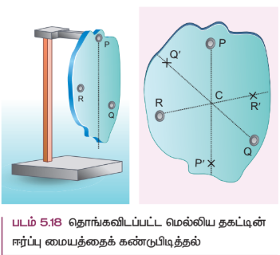

### 5.3.5 வட்டப்பாதையில் மிதிவண்டி ஒட்டுபவரின் சாய்வு இயக்கம்

மிதிவண்டி ஓட்டுபவர் சமநிலையில் r ஆரம் உள்ள வட்டப்பாதையில் (உயர்த்தப்படாத பாதையில்) v வேகத்துடன் செல்ல முயற்சிப்பதாகக் கருதுவோம். மிதிவண்டி மற்றும் ஒட்டுபவரையும் சேர்த்து m நிறை கொண்ட ஒரே அமைப்பாகக் (simple system) கருதுவோம். இவ்வமைப்பின் நிறைமையம் C மற்றும் இது O வை மையமாக கொண்டு r ஆரம் கொண்ட வட்டப் பாதையில் செல்கிறது. படம் 5.19 இல் காட்டியுள்ளவாறு OC யை X அச்சாகவும், O- வழியே செல்லும் செங்குத்துக் கோடு OZ-ஐ Z-அச்சாகவும் கொள்வோம்.

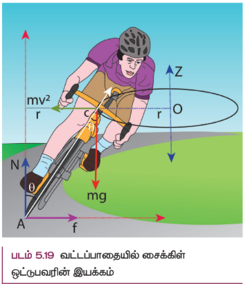

இவ்வமைப்பு (system) Z –அச்சை சுழல் அச்சாகக் கொண்டு \(\omega = v/r\) என்ற கோணத் திசைவேகத்தில் Z அச்சைப் பொறுத்து சுழல்கிறது. இவ்வமைப்பானது சுழலும் குறிப்பாயத்தில் ஓய்வு நிலையில் உள்ளது. சுழலும் குறிப்பாயத்தைக் கொண்டு நாம் தீர்வுகளை காணும்போது அமைப்பின் மீது மையவிலக்கு விசை (போலி விசை) \(\frac{mv^2}{r}\) செயல்படுவதாகக் கருதவேண்டும். இவ்விசையானது ஈர்ப்பு மையம் வழியாக செயல்படுகிறது. இவ்வமைப்பின் மீது செயல்படும் விசைகளாவன (i) புவியீர்ப்பு விசை mg (ii) செங்குத்து விசை N (iii) உராய்வு விசை f மற்றும் (iv) மைய விலக்கு விசை \(\frac{mv^2}{r}\). சுழற்சி குறிப்பாயத்தில் அவ்வமைப்பானது சமநிலையில் இருக்க வேண்டுமானால் அதன் மீது செயல்படும் நிகர விசை மற்றும் நிகர திருப்பு விசையின் மதிப்பு சுழியாக வேண்டும். A என்ற புள்ளியைப் பொருத்து அனைத்து திருப்பு விசைகளும் செயல்படுவதாகக் கருதுவோம். அனைத்து திருப்பு விசைகளும் படம் 5.20 இல் காட்டப்பட்டுள்ளது எனக் கருதுக.
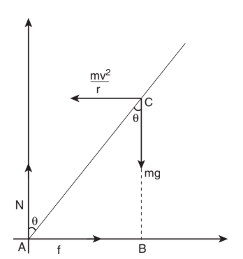

படம் 5.20 மிதிவண்டி ஒட்டுபவரின் மீது வளைவுப் பாதையில் செயல்படும் விசைகள்

  
சுழற்சி சமநிலையில்

\[ \vec{\tau}_{net} = 0 \]

புள்ளி A வைப் பொருத்து, புவிஈர்ப்பு விசை mg ஆல் ஏற்படும் திருப்பு விசை = mg (AB) (கடிகார திசையில்)

மையநோக்கு விசையின் திருப்பு விசை = \(\frac{mv^2}{r}\) (BC) (எதிர் கடிகார திசையில்)

எதிர் கடிகார திசையை நேர்க்குறியாகவும், கடிகார திசையை எதிர்க்குறியாகவும் கொள்வது மரபு.

எனவே,

\[ - mg(AB) + \frac{mv^2}{r}(BC) = 0 \]

\[ mg(AB) = \frac{mv^2}{r}(BC) \]

ΔABC ல், AB = AC sinθ மற்றும் BC = AC cosθ

\[ mg(AC\sin\theta) = \frac{mv^2}{r}(AC\cos\theta) \]

\[ \tan\theta = \frac{v^2}{rg}\]

$$\theta = \tan^{-1}\left(\frac{v^2}{rg}\right) \qquad (5.36)$$

r ஆரம் கொண்ட சமமான வட்டப் பாதையில் v திசைவேகத்துடன் மிதிவண்டி ஒட்டுபவர் கடக்க முயற்சிக்கும்போது கீழே விழாமல் சமநிலையில் இருக்க θ கோணம் சாய்ந்த நிலையில் கடக்க வேண்டும்.

**எடுத்துக்காட்டு 5.13**

20 m s⁻¹ என்ற திசை வேகத்துடன் வட்டப்பாதையில் மிதிவண்டி ஒட்டுபவர் செங்குத்து தளத்துடன் 30° கோணம் சாய்ந்த நிலையில் கடக்கிறார். வட்டப்பாதையின் ஆரம் என்ன? (g = 10 m s⁻² எனக் கொள்க)

**தீர்வு:**

மிதிவண்டி ஒட்டுபவரின் திசை வேகம், v = 20 m s⁻¹
குத்தச்சுடன் கோணம் θ = 30°

வட்டப்பாதையைக் கடக்க நிபந்தனை \(\tan\theta = \frac{v^2}{rg}\)

மேற்கண்ட சமன்பாட்டை மாற்றி அமைக்க ஆரம் \(r = \frac{v^2}{g\tan\theta}\) ஐ பிரதியிட,

\[ r = \frac{20^2}{10 \times \tan 30^\circ} \]

\[ r = \frac{400}{10 \times \frac{1}{\sqrt{3}}} = \frac{400\sqrt{3}}{10} = 40\sqrt{3} \]

\[ r = 40 \times 1.732 = 69.28 \, \text{m} \]

## 5.4 நிலைமத் திருப்புத்திறன் (MOMENT OF INERTIA)

திண்மப்பொருட்களின் இது பருப்பொருட்களாக கருதப்படுகிறது (Bulk object). திருப்புவிசை மற்றும் கோண உந்தத்தின் சமன்பாடுகளில் \(\sum m_i r_i^2\) என்ற கோவையை (term) நாம் அறிந்துள்ளோம். இது பருப்பொருளின் நிலைமத்திருப்புத்திறன் என்று அழைக்கப்படுகிறது. \(m_i\) புள்ளி நிறையானது அச்சிலிருந்து \(r_i\) தொலைவில் உள்ள போது அதன் நிலைமத்திருப்புத்திறன் \(m_i r_i^2\)

**புள்ளி நிறையின் நிலைமத்திருப்புத்திறன்**

\[ I = m_i r_i^2 \tag{5.37} \]

**பருப்பொருளின் நிலைமத்திருப்புத்திறன்**

\[ I = \sum m_i r_i^2 \tag{5.38} \]

இடப்பெயர்வு இயக்கத்தில் நிறையை நிலைமத்தின் அளவாகவும், அதேபோல் சுழற்சி இயக்கத்தில் நிலைமதிருப்புத்திறனை சுழற்சியில் நிலைமமாகவும் நாம் கருதலாம். நிலைமத்திருப்புத்திறனின் அலகு kg m². இதன் பரிமாண வாய்ப்பாடு ML². பொதுவாக, பருப்பொருளின் நிறையானது மாறாதது (கிட்டத்தட்ட ஒளியின் திசைவேகத்தில் பயணிக்கும் பொருட்களைத் தவிர்த்து) ஆனால், நிலைமத்திருப்புத்திறன் மதிப்பானது மாறக்கூடியதாகும். இது பொருளின் நிறையை மட்டுமல்லாது சுழலும் அச்சைப் பொருத்து நிறை பரவி இருக்கும் தன்மையையும் சார்ந்துள்ளது. ஒரு பொருளில் சீராக பரவியுள்ள நிறையின் நிலைமைத்திருப்புத்திறனைக் கண்டறிய முதலில், நாம் பருப்பொருளின் மீநுண்நிறை (dm) யை ஒரு புள்ளி நிறையாகவும், அச்சைப்பொருத்து அதன் நிலையை (r) என்றும் கருதுவோம். அப்புள்ளி நிறையின் நிலைமத்திருப்புத்திறன்

\[ dI = dm \cdot r^2 \tag{5.39} \]

எனக் குறிக்கலாம். பருப்பொருளின் மொத்த நிலைமத்திருப்புத்திறனை மேற்கண்ட சமன்பாட்டை தொகையீடு செய்ய,

\[ I = \int dI = \int dm \cdot r^2 \]

\[ I = \int r^2 dm \tag{5.40} \]

மேற்காணும் சமன்பாட்டை பயன்படுத்தி பொதுவான வடிவங்களான உலோகத்தண்டு, வளையம், வட்டத்தட்டு போன்ற பருப்பொருட்களின் நிலைமத்திருப்புத்திறனை கண்டறியலாம்.

### 5.4.1 சீரான நிறை அடர்த்தி கொண்ட திண்மத் தண்டின் (uniform rod) நிலைமத்திருப்புத்திறன்

(M) நிறையும் (l) நீளமும் கொண்ட சீரான நிறை அடர்த்தி கொண்ட திண்மத் தண்டு படம் 5.21 இல் காட்டப்பட்டுள்ளது. அத்திண்மதண்டின் நிறைமையத்தின் வழியாகவும் அதன் நீளத்திற்கு செங்குத்தாகவும் செல்லும் அச்சைப் பொருத்து நிலைமத் திருப்புதிறனிற்கான சமன்பாட்டைப் பெறலாம். முதலில் ஆதிப்புள்ளியை ஆய அச்சு அமைப்பைத் திண்மத்தண்டின் வடிவியல் மையத்தில் அமைந்துள்ள நிறைமையத்துடன் பொருத்த வேண்டும். இப்பொழுது திண்மத்தண்டானது x அச்சில் அமைந்துள்ளதாகக் கருதுவோம். ஆதியிலிருந்து x தொலைவில் ஒரு மீநுண் நிறை (dm) ஐக் கருதுவோம்.
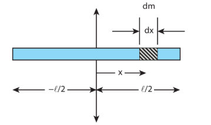

படம் 5.21 சீரான நிறை அடர்த்தி கொண்ட திண்மத் தண்டின் நிலைமத் திருப்புத்திறன்

  
அச்சைப்பொருத்து, பொருளின் மீநுண் நிறையிற்கான (dm) நிலைமத்திருப்புத் திறன் (dI) எனில்,

\[ dI = dm \cdot x^2 \]

நிறையானது சீராக பரவியுள்ள போது, ஒரலகு நீளமுள்ள தண்டின் நிறை \(\lambda = \frac{M}{l}\)

மிகச்சிறிய நீளமுள்ள தண்டின் நிறை \(dm = \lambda dx = \frac{M}{l} dx\)

திண்மத்தண்டின் நீளம் முழுவதற்கும் நிலைமத்திருப்புத்திறனைக் காண dI யை தொகையீடு செய்ய,

\[ I = \int dI = \int dm \cdot x^2 = \int \frac{M}{l} x^2 dx \]

ஆதிப்புள்ளியின் இரு புறமும் நிறையானது பரவி இருப்பதால் தொகையீடு காண அதன் எல்லையை −l /2 முதல் l /2 வரை கருதுவோம்.

\[ I = \frac{M}{l} \int_{-l/2}^{l/2} x^2 dx \]

\[ I = \frac{M}{l} \left[\frac{x^3}{3}\right]_{-l/2}^{l/2} \]

\[ I = \frac{M}{l} \left(\frac{l^3}{24} + \frac{l^3}{24}\right) = \frac{M}{l} \left(\frac{2l^3}{24}\right) \]

\[ I = \frac{M}{l} \left(\frac{l^3}{12}\right) = \frac{1}{12}Ml^2 \tag{5.41} \]

**எடுத்துக்காட்டு 5.14**

சீரான நிறை அடர்த்தி கொண்ட திண்மத்தண்டின் நிலைமத் திருப்புத்திறனை அதற்கு செங்குத்தாகவும் ஏதேனும் ஒரு முனையின் வழியே செல்லும் அச்சைப்பொருத்து காண்க.

**தீர்வு**

நிலைமத் திருப்புத்திறனிற்கான கருத்துருவானது முந்தைய வருவித்தலின்படி தொகையீடு செய்து சமன்பாட்டைப் பெறலாம். இப்பொழுது திண்மத்தண்டின் இடது முனையினை ஆதியாகக் கொண்டு தொகையீடு காண எல்லையை 0 முதல் l எனக் கருதினால்,
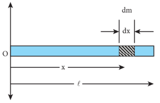

\[ I = \frac{M}{l} \int_0^l x^2 dx = \frac{M}{l} \left[\frac{x^3}{3}\right]_0^l \]

\[ I = \frac{M}{l} \cdot \frac{l^3}{3} = \frac{1}{3}Ml^2 \]

>**குறிப்பு** வெவ்வேறான அச்சின் நிலைகளைப் பொருத்து சீரான நிறை அடர்த்தி கொண்ட திண்மத்தண்டின் நிலைமத் திருப்புத்திறன் வேறுபடுகிறது. பொருளின் வெளிப்புறத்திலேயே அச்சின் நிலை கருதப்படுகிறது. வெவ்வேறான அச்சுகளைக் கொண்டு நிலைமத் திருப்புத்திறனைக் காண இரண்டு தேற்றங்களை நாம் காண உள்ளோம். இதனைப் பற்றி 5.4.5 என்ற பகுதியில் பயிலலாம்.

### 5.4.2 சீரான நிறை அடர்த்தி கொண்ட வட்ட வளையத்தின் (uniform ring) நிலைமத் திருப்புத்திறன்

m நிறையும் R ஆரமும் கொண்ட சீரான நிறை அடர்த்தி கொண்ட வட்ட வளையத்தைக் கருதுக. வட்ட வளையத்தின் தளத்திற்கு செங்குத்தாகவும், அதன் மையம் வழிச்செல்லும் அச்சைப் பொருத்து நிலைமத் திருப்புத்திறனைக் காண அவ்வளையத்திலிருந்து மீநுண்நிறை dm ஆனது மிகச் சிறிய நீளம் dx தொலைவில் இருப்பதாக கொள்வோம். இதில் dm ஆனது R தொலைவில் உள்ளது எனக்கொண்டால், அத்தொலைவு படம் 5.22 இல் காட்டப்பட்டது போல் அச்சிலிருந்து வளையத்தின் ஆரத்தைக் குறிக்கிறது.

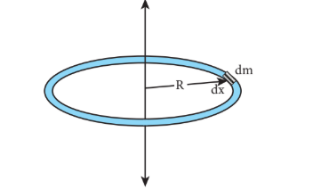

படம் 5.22 சீரான வட்ட வளையத்தின் நிலைமத் திருப்புத்திறன்

  
மீநுண்நிறை (dm) இன் நிலைமத் திருப்புத் திறன்,

\[ dI = dm \cdot R^2 \]

வட்டவளையத்தின் நீளமானது அதன் சுற்றளவுக்கு (2πR) சமமானது. நிறையானது சீராக பரவியுள்ள போது, ஓரலகு நீளமுள்ள நிறையின் மதிப்பு

நீளடர்த்தி \(\lambda = \frac{\text{நிறை}}{\text{நீளம்}} = \frac{M}{2\pi R}\)

மிகச்சிறிய நீளம் கொண்ட துண்டின் நிறை \(dm = \lambda dx = \frac{M}{2\pi R} dx\)

வட்ட வளையம் முழுவதற்கான நிலைமத் திருப்புத்திறன்

\[ I = \int dI = \int dm \cdot R^2 = \int \frac{M}{2\pi R} dx \cdot R^2 \]

வட்ட வளையத்தின் மொத்த நீளத்தையும் கணக்கிட, தொகையிடலுக்கான எல்லையை 0 முதல் 2πR என எடுத்துக் கொள்ள வேண்டும். 

நிலைமத்திருப்புத்திறன்

\[ I = \frac{MR}{2\pi} \int_0^{2\pi R} dx \]

\[ I = \frac{MR}{2\pi} [x]_0^{2\pi R} = \frac{MR}{2\pi} \times 2\pi R \]

\[ I = MR^2 \tag{5.42} \]

### 5.4.3 சீரான நிறை அடர்த்தி கொண்ட வட்டத்தட்டின் (uniform disk) நிலைமத் திருப்புத்திறன்

M நிறையும் R ஆரமும் கொண்ட வட்டத்தட்டைக் கருதுக. படத்தில் காட்டப்பட்டது போல வட்டத்தட்டானது மிகச்சிறிய வளையங்களால் ஆக்கப்பட்டுள்ளது. இதில் ஒரு வளையத்தின் மீநுண் நிறை dm மிகச்சிறிய தடிமன் dr, மற்றும் ஆரம் r எனக் கொள்க. மிகச்சிறிய வட்ட வளையத்தின் நிலைமத் திருப்புத்திறன் dI ஆனது,

\[ dI = dm \cdot r^2 \]

நிறையானது சீராக இருப்பதால்

\(\sigma = \frac{\text{நிறை}}{\text{பரப்பு}} = \frac{M}{\pi R^2}\) (σ - பரப்பு அடர்த்தி)

\[ dm = \sigma \times 2\pi r \times dr = \frac{M}{\pi R^2} \times 2\pi r \times dr = \frac{2M}{R^2} r dr \]

இங்கு 2πr dr என்பது மிகச் சிறிய வளையத்தின் பரப்பு, (2πr என்பது அதன் நீளம் மற்றும் dr என்பது அதன் தடிமன்) என்றால்

\[ dm = \frac{2M}{R^2} r dr \]

\[ dI = \frac{2M}{R^2} r^3 dr \]
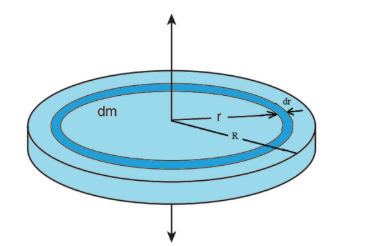

படம் 5.23 சீரான நிறை அடர்த்தி கொண்ட வட்டத்தட்டின் நிலைமத் திருப்புத்திறன்

  
வட்டத்தட்டு முழுவதற்குமான நிலைமத் திருப்புத்திறன் (I) கீழ்க்கண்ட தொடர்பின் படி,

\[ I = \int dI = \int_0^R \frac{2M}{R^2} r^3 dr \]

\[ I = \frac{2M}{R^2} \left[\frac{r^4}{4}\right]_0^R = \frac{2M}{R^2} \left(\frac{R^4}{4}\right) \]

\[ I = \frac{1}{2}MR^2 \tag{5.43} \]

### 5.4.4 சுழற்சி ஆரம் (Radius of Gyration)

ஒழுங்கான உருவ அமைப்பு கொண்ட பருப்பொருட்களின் நிறையானது சீராக பரவி உள்ளது எனக் கருதினால், அச்சைப் பொருத்த நிலைமத் திருப்புத்திறனிற்கான சமன்பாடு என்பது அதன் மொத்த நிறை மற்றும் வடிவியல் அம்சங்களான ஆரம், நீளம், அகலம் போன்றவற்றையும், பொருளின் அளவு மற்றும் வடிவம் ஆகியவற்றையும் உள்ளடக்கியது என்பதை கவனத்தில் கொள்ள வேண்டும். ஆனால் நமக்குத் தேவையான நிலைமத் திருப்புத்திறனிற்கான கோவை என்பது பொருளின் நிறை, வடிவம், அளவு மட்டுமல்லாமல் சுழலும் அச்சைப் பொருத்து அதன் நிலையையும் சேர்த்ததாக இருக்க வேண்டும். இது போன்ற சமன்பாடானது சீரற்ற வடிவம் மற்றும் சீரற்ற நிறை பரவல் கொண்ட பொருட்களுக்கும் பொருந்தக்கூடிய பொதுவான சமன்பாடு ஆகும். நிலைமத் திருப்புத்திறனின் பொதுவான சமன்பாடு

\[ I = MK^2 \tag{5.44} \]

இங்கு, M என்பது பொருளின் மொத்த நிறை மற்றும் K என்பது சுழற்சி ஆரம் என்று அழைக்கப்படுகிறது. ஒரு பொருளின் சுழற்சி ஆரம் என்பது சுழலும் அச்சிலிருந்து சமான புள்ளி நிறை துகளின் செங்குத்துத் தொலைவு ஆகும். இந்த சமான புள்ளி நிறையானது பொருளின் ஒத்த நிறையையும், நிலைமத் திருப்புத்திறனையும் அவசியம் பெற்றிருக்க வேண்டும்.

சுழற்சி ஆரத்தின் அலகு, தொலைவைப் போன்றே மீட்டர் (m) ஆகும். அதன் பரிமாணம் [L] ஆகும்.

சுழற்சி இயக்கத்தில் இருக்கும் திண்மப் பொருளானது \(m_1, m_2, m_3, . . . m_n\) என்ற புள்ளி நிறைகளால் ஆனதாகக் கருதுவோம். இந்த நிறைகள் சுழற்சி அச்சிலிருந்து முறையே \(r_1, r_2, r_3 . . . r_n\) தொலைவில் உள்ளன என்க படம் 5.24 இல் காட்டப்பட்டுள்ளது.
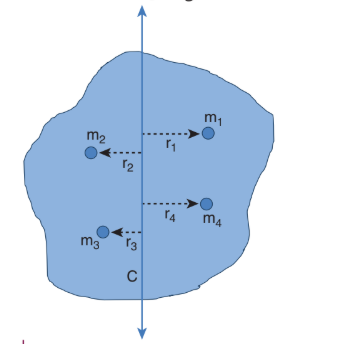

படம் 5.24 சுழற்சி ஆரம்
  
அந்தப் பொருளின் நிலைமத்திருப்புத்திறன் பின்வருமாறு எழுதப்படுகிறது

\[ I = \sum_{i=1}^n m_i r_i^2 = m_1r_1^2 + m_2r_2^2 + m_3r_3^2 + \dots + m_nr_n^2 \]

“n” எண்ணிக்கை கொண்ட அனைத்து புள்ளி நிறைகளின் நிறையை சமம் எனக் கொண்டால்

\[ m = m_1 = m_2 = m_3 = \dots = m_n \]

பிறகு,

\[ I = mr_1^2 + mr_2^2 + mr_3^2 + \dots + mr_n^2 \]

\[ = m(r_1^2 + r_2^2 + r_3^2 + \dots + r_n^2) \]

\[ = nm \left(\frac{r_1^2 + r_2^2 + r_3^2 + \dots + r_n^2}{n}\right) \]

\[ I = MK^2 \]

இங்கு, nm என்பது பொருளின் மொத்த நிறை M மற்றும் K என்பது சுழற்சி ஆரம் ஆகும்.

\[ K^2 = \frac{r_1^2 + r_2^2 + r_3^2 + \dots + r_n^2}{n} \]

\[ K = \sqrt{\frac{r_1^2 + r_2^2 + r_3^2 + \dots + r_n^2}{n}} \tag{5.45} \]

மேலே உள்ள சமன்பாட்டில் சுழற்சி ஆரம் K என்பது, சுழலும் அச்சைப் பொருத்து புள்ளி நிறைகளின் செங்குத்து தொலைவின் இருமடி மூலத்தின் சராசரியின் வர்க்கத்திற்கு சமமாகும். எனவே, எந்தவொரு பொருளின் நிலைமத் திருப்புத்திறனையும் I = MK² என்ற சமன்பாட்டின் படி கூற இயலும்.

உதாரணமாக, M நிறையும் மற்றும் l நீளமும் கொண்ட ஒரு சீரான நிறை அடர்த்தி கொண்ட திண்மத்தண்டின் நிலைமத்திருப்புத்திறனை எடுத்துக் கொள்க. நிறைமையத்திற்கு செங்குத்தாகச் செல்லும் அச்சிலிருந்து நிலைமத் திருப்புத்திறன் \(I = \frac{1}{12}Ml^2\). சுழற்சி ஆரத்தின் வாயிலாக, \(I = MK^2\) என்பதால்,

\[ MK^2 = \frac{1}{12}Ml^2 \]

\[ K^2 = \frac{l^2}{12} \]

\[ K = \frac{l}{\sqrt{12}} \text{ அல்லது } K = \frac{l}{2\sqrt{3}} \text{ அல்லது } K \approx 0.289l \]

**எடுத்துக்காட்டு 5.15**

M நிறையும், R ஆரமும் கொண்ட வட்டத்தட்டு ஒன்றின் நிறை மையத்தின் வழியாகவும் அதன் தளத்திற்கு செங்குத்தாகவும் செல்லும் அச்சைப் பற்றிய சுழற்சி ஆரத்தைக் காண்க.

**தீர்வு**

வட்டத்தட்டிற்கு செங்குத்தாகவும், நிறை மையம் வழியாகவும் செல்லும் அச்சைப் பற்றிய நிலைமத் திருப்புத்திறன் \(I = \frac{1}{2}MR^2\)

சுழற்சி ஆரத்திற்கான தொடர்பிலிருந்து, \(I = MK^2\) என்பதனால்,

\[ MK^2 = \frac{1}{2}MR^2 \]

\[ K^2 = \frac{R^2}{2} \]

\[ K = \frac{R}{\sqrt{2}} \text{ அல்லது } K = \frac{R}{1.414} \text{ அல்லது } K \approx 0.707R \]

இதனால் சுழற்சி ஆரம் என்பது பருப்பொருளின் வடிவியல் அம்சங்களான நீளம்,அகலம்,
ஆரம் இவைகளோடு ஒன்றிணைந்து ஒரு நேர்க்குறி எண்ணின் பெருக்கல் பலனாக இருக்கும்.

### 5.4.5 நிலைமத் திருப்புத்திறனின் தேற்றங்கள்

ஒரு பொருளின் நிலைமத் திருப்புத்திறனானது சுழலும் அச்சை சார்ந்திருப்பது மட்டுமல்லாமல், அச்சிலிருந்து சுழலும் திசையமைப்பைப் பொருத்தும், வெவ்வேறான அச்சுகளைப் பொருத்தும் மாறுபடும். சுழலும் அச்சுக்களை இடப்பெயர்வு செய்து நிலைமத் திருப்புதிறனைக் காண்பதற்குத் தேவையான இரு முக்கியமான தேற்றங்களைப் பயிலவுள்ளோம்.

**(i) இணையச்சுத் தேற்றம்**

பொருளின் எந்தவொரு அச்சைப்பற்றிய நிலைமத் திருப்புத்திறனானது நிறை மையத்தின் வழியே செல்லும் இணை அச்சைப் பற்றிய நிலைமத் திருப்புத் திறன் மற்றும் பொருளின் நிறையையும் இரு அச்சுகளுக்கு இடைப்பட்ட தொலைவின் இருமடியையும் பெருக்கி வரும் பெருக்கற்பலன் ஆகியவற்றின் கூடுதலுக்குச் சமமாகும்.

M நிறை கொண்ட பொருளின் நிறை மையத்தின் வழியாகச் செல்லும் அச்சைப் பொருத்த நிலைமத் திருப்புத்திறன் $I_C$ எனில் d தொலைவில் இவ்வச்சிற்கு இணையான அச்சைப் பற்றிய நிலைமத்திருப்புத் திறன்,

\[ I = I_C + Md^2 \tag{5.46} \]

திண்மப்பொருள் ஒன்றினை படம் 5.25 இல் உள்ளது போல் கருதுக. நிறை மையம் C யின் வழிச் செல்லும் அச்சு AB க்கு இணையாகவும், AB யிலிருந்து d செங்குத்துத் தொலைவில் மற்றொரு அச்சு DE யைப் பொருத்து பொருளின் நிலைமத்திருப்புத்திறன் I என்க. திருப்புத்திறன் I இன் சமன்பாட்டை $I_C$ யை கொண்டு தருவிக்க முயற்சிக்கலாம். இதற்கு பொருளின் நிறை மையத்திலிருந்து x தொலைவில் அமைந்துள்ள புள்ளி நிறை m ஐ எடுத்துக் கொள்வோம். DE அச்சைப் பொருத்து புள்ளி நிறையின் நிலைமத் திருப்புத் திறன் \(m(x+d)^2\).
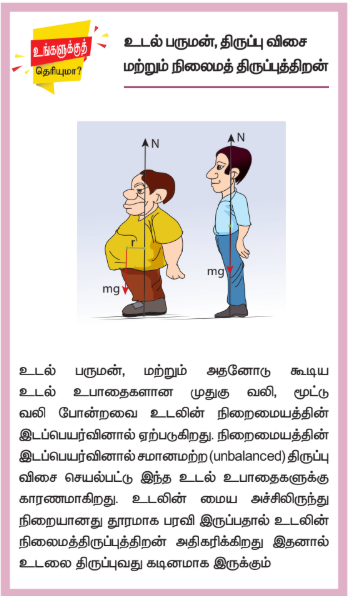
\[ I = \sum m(x+d)^2 \]
மேலும் இச்சமன்பாட்டை தீர்க்க
\[ I = \sum m(x^2 + 2xd + d^2) \]

\[ I = \sum mx^2 + \sum m(2xd) + \sum md^2 \]

\[ I = \sum mx^2 + 2d\sum mx + d^2\sum m \]

இங்கு, \(\sum mx^2\) என்பது நிறை மையம் வழிச் செல்லும் அச்சைப் பற்றிய நிலைமத் திருப்புத்திறனாகும்.\(I_C= \sum mx^2\) 

மேலும், \(\sum mx = 0\), ஏனென்றால் x என்பது AB ஐயைப் பொருத்து நேர் மற்றும் எதிர்க்குறி மதிப்புகளைப் பெற்றிருக்கும். இவற்றின் கூடுதல் \(\sum mx\) சுழியாகும்.
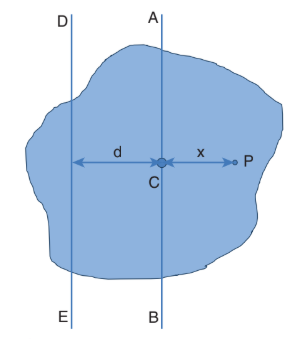

படம் 5.25 இணை அச்சுத் தேற்றம்

  
எனவே, \(I = I_C + d^2\sum m\)

இங்கு, \(\sum m\) என்பது பொருளின் மொத்த நிறையைக் குறிக்கும் \(\sum m = M\)

\[ I = I_C + Md^2 \]

இணை அச்சுத் தேற்றம் நிரூபிக்கப்பட்டது.

**(ii) செங்குத்து அச்சுத் தேற்றம்**

இந்தத் தேற்றமானது மெல்லிய பொருட்களுக்கு மிகவும் பொருத்தமானது. மெல்லிய சமதளப் பரப்பிற்கு செங்குத்தான அச்சைப் பற்றிய நிலைமத் திருப்புத்திறனானது அந்த தளத்திலேயே அமைந்த ஒன்றுக்கொன்று செங்குத்தான இரு அச்சுகளைப் பற்றிய நிலைமத்திருப்புத்திறன்களின் கூடுதலுக்கு சமம். இந்த மூன்று அச்சுகளும் ஒன்றுக்கொன்று செங்குத்தகவும் ஒரு பொதுப் புள்ளியில் சந்திக்குமாறு அமைந்திருக்கும்.

X மற்றும் Y அச்சுகளினால் ஆன தளத்தில் Z அச்சுக்கு செங்குத்தான மெல்லிய பொருளின் தளம் எனது Z அச்சிற்கு செங்குத்தாக அமைந்துள்ளது எனக் கொள்க. X மற்றும் Y அச்சுகளைப் பொருத்த நிலைமத் திருப்புத் திறன்கள் முறையே IX மற்றும் IY எனில் Z அச்சைப் பொருத்த நிலைமத் திருப்புத்திறன் IZ ஆகும். எனவே, செங்குத்து அச்சுத் தேற்றத்தின் சமன்பாடு,

\[ I_Z = I_X + I_Y \tag{5.47} \]

இதனை நிரூபிக்க புறக்கணிக்கத்தக்க (negligible) தடிமன் கொண்ட மெல்லிய பொருளின் மீது ஆதிப்புள்ளி O வைக் கருதுக. படம் 5.26 இல் காட்டப்பட்டது போல் Z அச்சுக்கு செங்குத்தாக X, Y அச்சுகளால் ஆன தளம் உள்ளது. இம்மெல்லிய பொருளானது m நிறை கொண்ட பல துகள்களால் ஆனது எனக் கொள்க O விலிருந்து ஆய புள்ளிகள் (x, y) உடைய P என்ற புள்ளியை எடுத்துக் கொள்வோம்.
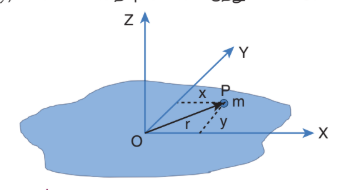

படம் 5.26 செங்குத்து அச்சுத் தேற்றம்

  
Z அச்சைப் பொருத்து துகளின் நிலைமத் திருப்புத் திறன் \(mr^2\)

Z அச்சைப் பொருத்து மெல்லிய பொருளின் முழுவதற்குமான நிலைமத்திருப்புத் திறன்

\[ I_Z = \sum mr^2 \]

இங்கு, \(r^2 = x^2 + y^2\)

எனவே, \(I_Z = \sum m(x^2 + y^2)\)

\[ I_Z = \sum mx^2 + \sum my^2 \]

இதில் \(\sum mx^2\) என்பது Y அச்சைப் பொருத்து நிலைமத் திருப்புத்திறனாகவும், அதேபோல் \(\sum my^2\) என்பது X அச்சைப் பொருத்த நிலைமத்திருப்புத் திறன் எனப்படும். எனவே,

\[ I_X = \sum my^2 \text{ மற்றும் } I_Y = \sum mx^2 \]

$I_Z$ சமன்பாட்டில் பிரதியிட

\[ I_Z = I_X + I_Y \]

செங்குத்து அச்சுத் தேற்றம் நிரூபிக்கப்பட்டது.

**எடுத்துக்காட்டு 5.16**

3 kg நிறையும் 50 cm ஆரமும் கொண்ட வட்டத்தட்டு ஒன்றின் நிலைமத்திருப்புத்திறனை பின்வரும் அச்சுகளைப் பொருத்து காண்க.

(i) வட்டத்தட்டின் மையத்தில் தளத்திற்கு செங்குத்தாக செல்லும் அச்சு.

(ii) வட்டத்தட்டின் பரிதியின் ஏதேனும் ஒரு புள்ளியின் வழிச்செல்வதும் தளத்திற்கு செங்குத்தானதுமான அச்சு.

(iii) வட்டத்தட்டின் மையம் வழியாகவும் அதே தளத்திலேயே செல்வதுமான அச்சு.

**தீர்வு**

நிறை, M = 3 kg, ஆரம் R = 50 cm = 50×10⁻² m = 0.5 m

(i) வட்ட தட்டின் மையத்தில் தளத்திற்கு செங்குத்தாக செல்லும் அச்சைப் பற்றிய நிலைமத்திருப்புத் திறன் (I) ஆனது.
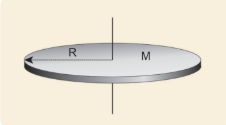
\[ I = \frac{1}{2}MR^2 = \frac{1}{2} \times 3 \times (0.5)^2 = 0.375 \, \text{kg m}^2 \]

(ii) வட்டத்தட்டின் பரிதியில் ஏதேனும் ஒரு புள்ளி வழிச் செல்வதும் தளத்திற்கு செங்குத்தானதுமான அச்சைப் பற்றிய நிலைமத்திருப்புத்திறன் (I) யை இணையச்சு தேற்றத்தின் படி
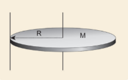
\[ I = I_C + Md^2 \]

இங்கு, \(I_C = \frac{1}{2}MR^2\) மற்றும் d = R

\[ I = \frac{1}{2}MR^2 + MR^2 = \frac{3}{2}MR^2 \]

\[ I = \frac{3}{2} \times 3 \times (0.5)^2 = 1.125 \, \text{kg m}^2 \]

(iii) வட்டத்தட்டின் மையம் வழியாகவும் அதே தளத்திலேயே செல்வதுமான அச்சைப் பற்றிய நிலைமத்திருப்புத் திறனை, செங்குத்து அச்சு தேற்றத்தின் படி (I),
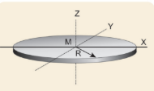
\[ I_Z = I_X + I_Y \]

இங்கு \(I_X = I_Y = I\), மற்றும் \(I_Z = \frac{1}{2}MR^2\)

\[ I_Z = 2I \quad \Rightarrow \quad I = \frac{1}{2}I_Z \]

\[ I = \frac{1}{2} \times \frac{1}{2}MR^2 = \frac{1}{4}MR^2 \]

\[ I = \frac{1}{4} \times 3 \times (0.5)^2 = 0.1875 \, \text{kg m}^2 \]

>நிலைமத்திருப்புத்திறன் மதிப்பு எந்த அச்சைப் பொருத்து சுழற்றும் போது சிறுமமாக உள்ளதோ அந்த அச்சைப் பொருத்து சுழற்றுவது எளிமையானது. இந்த எடுத்துக்காட்டில் மூன்றாவதாக சொல்லப்பட்டிருக்கும் அச்சைப்பொறுத்து சுழற்றுவது எளிதானது.

### 5.4.6 வெவ்வேறு வடிவமுடைய திண்மப் பொருட்களின் நிலைமத்திருப்புத்திறன்

வெவ்வேறு வடிவமுடைய வெவ்வேறு அச்சுகளை பொருத்த நிலைமத்திருப்புத்திறன்கள் அட்டவணை 5.3 இல் கொடுக்கப்பட்டுள்ளது.

**அட்டவணை 5.3 பல்வேறு திண்மப்பொருளின் நிலைமத்திருப்புத்திறன்கள்**

| வ. எண் | பொருள் | அச்சைப்பொருத்து | படம் | நிலைமத் திருப்புத்திறன் (I) kg m² | சுழற்சி ஆரம் (k) m | விகிதம் K²/R² |
|---|---|---|---|---|---|---|
| 1. | மெல்லிய சீரான தண்டு, நிறை = M, நீளம் = l | நீளத்திற்குச் செங்குத்தாகவும் மையம் வழியாகவும் செல்வதுமான அச்சு | | \(\frac{1}{12}Ml^2\) | \(\frac{l}{\sqrt{12}}\) | - |
| | | தண்டின் ஒரு முனை வழியாகவும் நீளத்திற்கு செங்குத்தாக செல்வதுமான அச்சு | | \(\frac{1}{3}Ml^2\) | \(\frac{l}{\sqrt{3}}\) | - |
| 2. | சீரான செவ்வகத் தகடு, நிறை = M, நீளம் = l, அகலம் = b | தளத்திற்குக் செங்குத்தான மையத்தின் வழிச் செல்வதுமான அச்சு. | | \(\frac{1}{12}M(l^2+b^2)\) | \(\sqrt{\frac{l^2+b^2}{12}}\) | - |
| 3. | மெல்லிய சீரான வட்ட வளையம், நிறை = M, ஆரம் = R | வட்ட வளையத்தின் தளத்திற்கு செங்குத்தாகவும் அதன் மையம் வழிச் செல்வதுமான அச்சு. || \(MR^2\) | R | 1 |
| | | வட்ட வளையத்தின் தளத்திற்கு செங்குத்தாகவும் விளிம்பு வழிச் செல்வதுமான அச்சு. | | \(2MR^2\) | \(\sqrt{2}R\) | 2 |
| | | வட்ட வளையத்தின் தளத்திற்கு இணையாகவும் மையம் வழிச் செல்வதுமான அச்சு. | | \(\frac{1}{2}MR^2\) | \(\frac{1}{\sqrt{2}}R\) | 1/2 |
| | | வட்ட வளையத்தின் தளத்திற்கு இணையானதும் விளிம்பு வழி செல்வதுமான அச்சு | | \(\frac{3}{2}MR^2\) | \(\sqrt{\frac{3}{2}}R\) | 3/2 |
| 4. | மெல்லிய சீரான வட்ட தட்டு, நிறை = M, ஆரம் = R | வட்டத்தட்டின் தளத்திற்கு செங்குத்தாகவும், மையத்தின் வழிச் செல்வதுமான அச்சு. | | \(\frac{1}{2}MR^2\) | \(\frac{1}{\sqrt{2}}R\) | 1/2 |
| | | வட்டத்தளத்திற்கு செங்குத்தாகவும் விளிம்பின் வழியே ஏதேனும் ஒரு புள்ளி வழிச் செல்வதுமான அச்சு. | | \(\frac{3}{2}MR^2\) | \(\sqrt{\frac{3}{2}}R\) | 3/2 |
| | | வட்டத்தட்டின் தளத்திற்கு இணையாகவும் மையம்வழிச் செல்வதுமான அச்சு | | \(\frac{1}{4}MR^2\) | \(\frac{1}{2}R\) | 1/4 |
| | | வட்டத்தட்டின் தளத்திற்கு இணையாகவும் விளிம்பின் வழியே ஏதேனும் ஒரு புள்ளி வழிச் செல்வதுமான அச்சு. | | \(\frac{5}{4}MR^2\) | \(\sqrt{\frac{5}{4}}R\) | 5/4 |
| 5. | மெல்லிய சீரான உள்ளீடற்ற உருளை, நிறை = M, நீளம் = l, ஆரம் = R | உருளையின் மையம் வழியாக அதன் அச்சின் வழிச் செல்வதுமான அச்சு | | \(MR^2\) | R | 1 |
| | | உருளையின் மையம் வழியாக அதன் அச்சிற்கு செங்குத்தாக செல்வதுமான அச்சு | 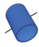| \(M\left(\frac{1}{2}R^2 + \frac{1}{12}l^2\right)\) | \(\sqrt{\frac{R^2}{2} + \frac{l^2}{12}}\) | - |
| 6. | சீரான திண்ம உருளை, நிறை = M, நீளம் = l, ஆரம் = R | உருளையின் மையம் வழியாக அதன் அச்சின் வழிச் செல்வதுமான அச்சு |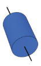 | \(\frac{1}{2}MR^2\) | \(\frac{1}{\sqrt{2}}R\) | 1/2 |
| | | உருளையின் மையம் வழியாக அதன் அச்சிற்கு செங்குத்தாக செல்வதுமான அச்சு | | \(M\left(\frac{R^2}{4} + \frac{l^2}{12}\right)\) | \(\sqrt{\frac{R^2}{4} + \frac{l^2}{12}}\) | - |
| 7. | சீரான மெல்லிய கோளகக் கூடு, நிறை = M, ஆரம் = R | கோளகத்தின் விட்டத்தின் வழியாகவும் மையம் வழி செல்வதுமான அச்சு | | \(\frac{2}{3}MR^2\) | \(\sqrt{\frac{2}{3}}R\) | 2/3 |
| | | கோளகத்தின் விளிம்புவழிச் செல்வதுமான அச்சு | | \(\frac{5}{3}MR^2\) | \(\sqrt{\frac{5}{3}}R\) | 5/3 |
| 8. | சீரான திண்மக் கோளம், நிறை = M, ஆரம் = R | கோளகத்தின் விட்டத்தின் வழியாகவும் மையம் வழி செல்வதுமான அச்சு | | \(\frac{2}{5}MR^2\) | \(\sqrt{\frac{2}{5}}R\) | 2/5 |
| | | கோளகத்தின் விளிம்புவழிச் செல்வதுமான அச்சு | | \(\frac{7}{5}MR^2\) | \(\sqrt{\frac{7}{5}}R\) | 7/5 |

**எடுத்துக்காட்டு 5.17**

கீழே படத்தில் காட்டப்பட்டுள்ள மெல்லிய தண்டினால் இணைக்கப்பட்டுள்ள இரு திண்மக் கோளங்களைக் கொண்ட அமைப்பின் நிலைமத் திருப்புத்திறனை அதன் வடிவியல் மையத்தை (Geometric centre) பொறுத்துக் காண்க.

**தீர்வு**

மேலே காட்டப்பட்டிருக்கும் அமைப்பானது மூன்று பொருள்களால் ஆக்கப்பட்டிருக்கிறது. (ஒரு மெல்லிய தண்டு மற்றும் இரண்டு திண்மக் கோளம்)

தண்டின் நிறை, M = 3 kg மற்றும் தண்டின் நீளம், l = 80 cm = 0.8 m

நிறைமையத்தைப் பொருத்து தண்டின் நிலைமத்திருப்புத் திறன்,

\[ I_{rod} = \frac{1}{12}Ml^2 , I_{rod}= \frac{1}{12} \times 3 \times (0.8)^2 = \frac{1}{4} \times 0.64 = 0.16 \, \text{kg m}^2 \]

கோளத்தின் நிறை, M = 5 kg மற்றும் ஆரம், R = 10 cm = 0.1 m

நிறை மையத்தைப் பொருத்து கோளத்தின் நிலைமத்திருப்புத்திறன், \(I_C = \frac{2}{5}MR^2\)

அமைப்பின் வடிவியல் மையத்தைப் பொருத்து கோளத்தின் நிலைமத் திருப்புத்திறன்

\[ I_{sph} = I_C + Md^2 \]

இங்கு, d = 40 cm + 10 cm = 50 cm = 0.5 m

\[ I_{sph} = \frac{2}{5}MR^2 + Md^2 \]

\[ I_{sph} = \frac{2}{5} \times 5 \times (0.1)^2 + 5 \times (0.5)^2 \]

\[ I_{sph} = 0.02 + 1.25 = 1.27 \, \text{kg m}^2 \]

இவ்வமைப்பானது இரு கோளங்களையும் தண்டினையும் பெற்றிருப்பதால் வடிவியல் மையத்தைப் பொருத்த நிலைமத்திருப்பத்திறன் (I) ஆனது,

\[ I = I_{rod} + (2 \times I_{sph}) = 0.16 + (2 \times 1.27) = 0.16 + 2.54 = 2.7 \, \text{kg m}^2 \]

## 5.5 சுழல் இயக்கவியல் (ROTATIONAL DYNAMICS)

திருப்பு விசை, கோண முடுக்கம், கோண உந்தம், கோணத் திசைவேகம் மற்றும் நிலைமத்திருப்புத் திறன் இவைகளுக்கு இடையேயான தொடர்புகளைப் பகுதி 5.2 இல் பயின்றோம். இதன் தொடர்ச்சியாக இப்பகுதியில் திண்மப்பொருள் ஒன்றின் மீது திருப்பு விசையினால் செய்யப்பட்ட வேலை, இயக்க ஆற்றல் போன்ற இயக்கவியல் அளவுகளுக்கு இடையேயான தொடர்புகளைப் பயிலலாம். இறுதியாக இடப்பெயர்வு இயக்கத்திற்கும், சுழற்சி இயக்கத்திற்கும் தொடர்புடைய அளவீடுகளை ஒப்பிடலாம்.

### 5.5.1 திண்மப் பொருட்களின் மீது திருப்பு விசையின் விளைவு

திண்மப் பொருள் ஒன்றின் மீது சுழலும் அச்சைப் பொருத்து புற திருப்பு விசை செயல்படும்போது சுழலும் பொருளானது அச்சைப் பொறுத்து கோண முடுக்கத்தைப் பெறுகிறது. திருப்பு விசைக்கும் கோண முடுக்கத்திற்கும் இடையேயான தொடர்பு எண்மதிப்பில்

\[ \tau = I\alpha \tag{5.48} \]

இங்கு, I என்பது திண்மப்பொருளின் நிலைமத்திருப்புத்திறன் ஆகும். சுழற்சி இயக்கத்தில் திருப்பு விசை என்பது நேர்கோட்டு இயக்கத்தில் விசைக்குச் சமானமானது.

**எடுத்துக்காட்டு 5.18**

500 g நிறையும் 10 cm ஆரமும் கொண்ட வட்டத்தட்டு ஒன்று தன்னிச்சையாக படத்தில் காட்டப்பட்டது போல நிலையான அச்சைப் பொருத்துச் சுழல்கிறது. எடையற்ற மற்றும் மீட்சித் தன்மையற்ற கம்பியானது வட்டத்தின் விளம்பில் சுற்றுகள் சுற்றப்பட்டு மற்றொரு முனையானது 100 g நிறையுடன் இணைக்கப்பட்டுள்ளது. 100 g நிறையின் முடுக்கத்தை காண்க. [தகவல்: கம்பியானது வட்டத்தட்டின் விளிம்பில் நழுவவில்லை. மாறாக வட்டத்தட்டுடன் சுழல்கிறது g = 10 m s⁻²]

**தீர்வு**

வட்டத்தட்டின் நிறையை $m_1$ எனவும் அதன் ஆரத்தை R எனவும் கொள்க. தொங்கவிடப்பட்ட பொருளின் நிறை $m_2$.

\(m_1 = 500 g = 500×10⁻³ kg = 0.5 kg\)

$m_2$ = 100 g = 100×10⁻³ kg = 0.1 kg

R = 10 cm = 10×10⁻² m = 0.1 m

வட்டத்தட்டின் விளம்பில் பல முறை சுற்றப்பட்டுள்ள மிகக் குறைந்த நிறையுள்ள மற்றும் மீட்சியற்ற கம்பியானது நழுவுதல் இல்லாமல் வட்டத் தட்டுடன் சுழல்கிறது. நிறை $m_2$ வின் தொடுகோட்டு முடுக்கமும் நிறை $m_1$ இன் இடம்பெயர்வு முடுக்கமும் சமம். $m_1$ மற்றும் $m_2$ விற்கு தனித்தனியே தனித்த பொருளின் விசை (FBD) (Free Body Diagram) படத்தை வரைக.

**வட்டத்தட்டிற்கான தனித்த பொருளின் விசைப்படம் (FBD)**

வட்டத்தட்டின் மீது செயல்படும் புவியீர்ப்பு விசை ($m_1$g) ஆனது கீழ்நோக்கியும்

வட்டத்தட்டானது மையத்தில் பொருத்தப்பட்டுள்ள மையப் புள்ளியின் வழியாக செங்குத்து விசை (N) யும் செயல்படுகிறது. வட்டத்தட்டின் பரிதியில் சுழலும் அச்சிற்குச் செங்குத்தாகக் கீழ்நோக்கி இழுவிசை T செயல்படுகிறது. மேலும் புவியீர்ப்பு விசையும் ($m_1$g) யும் செங்குத்து விசை N ம் ஒன்றை ஒன்று சமன்செய்கிறது. $m_1$g = N

இழுவிசை T ஆனது திருப்பு விசையை (R T) அளிப்பதால் வட்டத்தட்டானது கோண முடுக்கம் \(\alpha = a/R\) வுடன் சுழற்சி இயக்கத்திற்கு உட்படுகிறது. இங்கு a என்பது வட்டத்தட்டின் விட்டத்தில் உள்ள புள்ளி தொடுவியல் திசையில் உணரும் நேர்கோட்டு முடுக்கமாகும். இவ்வட்டத்தட்டின் நிலைமத்திருப்புத்திறன் I மற்றும் இதன் சுழற்சி ஆரம் K எனில்

\[ RT = I\alpha = m_1K^2 \left(\frac{a}{R}\right) \]

\[ T = \frac{m_1K^2 a}{R^2} \]

**கம்பியின் ஒரு முனையில் கட்டப்பட்ட நிறையின் தனித்த பொருளின் விசைப்படம் (FBD)**

இதன் புவியீர்ப்பு விசை ($m_2$g) கீழ்நோக்கிச் செயல்படுகிறது மற்றும் இழுவிசை T மேல்நோக்கி செயல்படுகிறது. இவற்றின் தொகு பயன் விசை நிறையின் மீது கீழ்நோக்கிச் செயல்படுகிறது.(T < $m_2$g)

\[ m_2g - T = m_2a \]

வட்டத்தட்டினால் செயல்படும் இழுவிசை T யை பிரதியிட

\[ m_2g - \frac{m_1K^2 a}{R^2} = m_2a \]

\[ m_2g = a\left(m_2 + \frac{m_1K^2}{R^2}\right) \]

\[ a = \frac{m_2g}{m_2 + \frac{m_1K^2}{R^2}} \]

K²/R² என்ற சமன்பாடு வட்டத்தட்டின் தளத்திற்கு செங்குத்தாகவும் மையம் வழிச் செல்லும் அச்சைப் பற்றி சுழல்வதால் பிரதியிட்டு சுருக்க, \(K^2/R^2 = 1/2\). முடுக்கத்திற்கான சமன்பாடு கீழ்க்கண்டவாறு கிடைக்கும்.

$$a = \frac{m_2}{\left[\left(\frac{m_1}{2}\right) + m_2\right]} g \quad ; \quad a = \frac{2m_2}{[m_1 + 2m_2]} g$$

மதிப்புகளைப் பிரதியிட,

$$a = \frac{2 \times 0.1}{[0.5 + 0.2]} \times 10 = \frac{0.2}{0.7} \times 10$$

$$a = 2.857 \text{ m s}^{-2}$$

### 5.5.2 கோணஉந்த மாறா விதி

வெளிப்புற திருப்புவிசை செயல்படாத வரை, சுழலும் திண்மப் பொருளின் மொத்தக் கோணஉந்தம் மாறாது. இதுவே கோண உந்த மாறா விதி

$$\tau = \frac{dL}{dt}$$

$$\tau = 0 \text{ எனில், } L = \text{மாறிலி}  \qquad (5.49)$$

கோண உந்தம் \(L = I\omega\), எனும் போது கோணஉந்த மாறா விதியின்படி

தொடக்க கோணஉந்தம் = இறுதி கோணஉந்தம்.

\[ I_i \omega_i = I_f \omega_f \text{ (அல்லது) } I\omega = \text{ மாறிலி} \tag{5.50} \]

இச்சமன்பாட்டின் மூலம், கோண உந்தம் மாறாமல் இருக்க I அதிகரிக்கும் போது ω குறையவும், அல்லது ω அதிகரிக்கும் போது I குறையவும் செய்யும் என அறியலாம்.

கோண உந்த மாறா விதியின் தத்துவமானது பல சூழ்நிலைகளில் பயன்பாட்டில் உள்ளது. மிகச் சிறந்த உதாரணமான ஐஸ் நடனக் கலைஞரின் சுழற்சி விளையாட்டு படம் 5.27 இல் காட்டப்பட்டுள்ளது. நடனக் கலைஞர் தன்னைத் தானே சுழற்றும் போது அவரது கைகளை வெளிப்புறமாக நீட்டினால் சுழலும் வேகம் குறைகிறது. ஏனென்றால் கைகளை உடலுக்கு வெளிப்புறமாக நீட்டும் போது நிலைமத்திருப்புத்திறன் அதிகரிப்பதால் கோணத்திசைவேகம் குறைந்து சுழலும் வேகம் குறைகிறது. கைகளை உடலை நோக்கி உட்புறமாக மடக்கும் போது நிலைமத்திருப்புத்திறன் குறைவதால் சுழலும் வேகம் அதிகரிக்கிறது.

படம் 5.27 ஐஸ் நடனக் கலைஞரின் கோண உந்த மாறாவிதியை நிரூபித்தல்

படம் 5.28 நீச்சல் குளத்தில் உயரத்திலிருந்து குதிக்கும் நீச்சல் வீரர் தனது உடலை உட்புறமாக சுருக்கி கொள்வதன் மூலம் நிலைமத்திருப்புத் திறனை குறைப்பது சுழற்சி வேகத்தை அதிகரிக்க உதவுவதால், காற்றில் பறந்து வரும்போது பல குட்டிகர்ணங்களைக் காற்றில் மேற்கொள்கிறார்.

  

**எடுத்துக்காட்டு 5.19**

ω கோணத் திசைவேகத்துடன் சுழலும் வட்ட மேசையின் மீது சர்க்கஸ் வீரர் ஒருவர் கைகளை நீட்டிய நிலையில் உள்ளார். அவர் கைகளைத் தன்னை நோக்கி உட்புறமாக மடக்கும் போது நிலைமத்திருப்புத் திறனானது ஆரம்ப மதிப்பிலிருந்து மூன்றில் ஒரு பங்காகக் குறைகிறது. அவரது புதிய நிலையில் கோண திசை வேகத்தை காண்க. (தகவல் – புறத்திருப்பு விசை செயல்படாத நிலையில்)

**தீர்வு**

கைகள் நீட்டப்பட்ட நிலையில் சர்க்கஸ் வீரரின் நிலைமத்திருப்புத்திறன் I என்க. சர்க்கஸ் வீரரின் மீதும் சுழல்மேசை மீதும் திருப்பு விசை எதுவும் செயல்படாத நிலையில் கோண உந்தம் மாறாது எனவே கோண உந்தத்தின் சமன்பாடானது.

\[ I_i \omega_i = I_f \omega_f \]

\[ I_i \omega_i = \frac{I_i}{3} \omega_f \]

\[ \omega_f = 3\omega_i \]

மேற்கண்ட முடிவிலிருந்து ஆரம்பக் கோணத் திசைவேகமானது மூன்று மடங்கு அதிகரித்துள்ளது என்பது தெளிவாகிறது.

### 5.5.3 திருப்பு விசையினால் செய்யப்பட்ட வேலை

திண்மப்பொருளொன்று நிலையான அச்சைப் பற்றி சுழல்கிறது எனக் கொள்க. இந்தப்பாடப் புத்தகத் தாளின் தளத்திற்குச் செங்குத்தான அச்சைப் பொறுத்துச் சுழலக் கூடிய பொருள் ஒன்றின் குறுக்கு வெட்டுத் தோற்றத்தைப் படம் 5.29 இல் காணலாம். F என்ற தொடுகோட்டு விசை பொருளின் மீது P என்ற புள்ளியில் செயல்படுகிறது.

படம் 5.29 திருப்பு விசையினால் செய்யப்பட்ட வேலை

  
இந்தத் தொடுகோட்டு விசை F ஆனது பொருளைச் சிறிய அளவில் இடப்பெயர்ச்சி (ds) செய்கிறது. விசையினால் செய்யப்பட்ட வேலை (dW)

\[ dW = Fds \]

இடப்பெயர்ச்சி ds க்கும் சுழற்சிக் கோணம் dθ க்கும் இடையேயான தொடர்பு

\[ ds = rd\theta \]

விசையினால் செய்யப்பட்ட வேலைக்கான சமன்பாடு

\[ dW = F(rd\theta) = Fr d\theta \]

இதில் Fr ஆனது விசையினால் பொருளின் மீது உருவாக்கப்பட்ட திருப்பு விசை τ என்பதால்,

\[ dW = \tau d\theta \tag{5.51} \]

ஒரு நிலையான அச்சைப் பொருத்து சுழலும் பொருளின் மீது வெளிப்புறத் திருப்பு விசையினால் (τ) செய்யப்பட்ட வேலை மேற்கண்ட சமன்பாட்டினால் பெறப்படுகிறது.

இடப்பெயர்வு இயக்கத்திற்குத் தொடர்புடைய விசையினால் செய்யப்பட்ட வேலையின் சமன்பாடு.

\[ dW = Fds \]

### 5.5.4 சுழற்சி இயக்கத்தின் இயக்க ஆற்றல்

திண்மப் பொருள் ஒன்று அச்சைப் பொருத்துக் கோணத் திசைவேகம் ω வுடன் சுழல்வதைப் படம் 5.30 இல் காணலாம். பொருளில் உள்ள ஒவ்வொரு துகளும் அச்சைப் பொறுத்து ஒரே கோண திசைவேகத்தையும் (ω) ஆனால் வெவ்வேறான தொடுகோட்டுத் திசைவேகங்களையும், பெற்றிருக்கும்.

சுழலும் அச்சிலிருந்து $m_i$ நிறையுடன் $r_i$ தொலைவில் உள்ள துகளைக் கருதுக. இந்தத் துகள் கீழ்க்கண்ட சமன்பாட்டின் \(v_i = r_i\omega\) தொடுகோட்டுத் திசைவேகம் கொண்டிருந்தால் அத்துகளின் இயக்க ஆற்றல்,

\[ KE_i = \frac{1}{2}m_i v_i^2 \]

இச்சமன்பாட்டை கோண திசைவேகத்தைப் பயன்படுத்தி எழுத

\[ KE_i = \frac{1}{2}m_i (r_i\omega)^2 = \frac{1}{2}m_i r_i^2 \omega^2 \]

இதே போன்ற துகள்களால் ஆக்கப்பட்டுள்ள மொத்த பொருளின் இயக்க ஆற்றல்

\[ KE = \sum \frac{1}{2}m_i r_i^2 \omega^2 = \frac{1}{2}\omega^2 \sum m_i r_i^2 \]

இங்கு \(\sum m_i r_i^2\) என்பது பொருளின் நிலைமத்திருப்புத்திறனாகும் \(I = \sum m_i r_i^2\)

திண்மப் பொருளின் சுழற்சி இயக்கத்தில் இயக்க ஆற்றலுக்கான சமன்பாடு

\[ KE = \frac{1}{2}I\omega^2 \tag{5.52} \]

இந்த சமன்பாட்டுக்கு இணையான இடப்பெயர்ச்சி இயக்க ஆற்றல் சமன்பாடு,

\[ KE = \frac{1}{2}Mv^2 \]

**சுழல் இயக்க ஆற்றலுக்கும் கோண உந்தத்திற்கும் இடையேயான தொடர்பு**

நிலைமத் திருப்புத்திறன் I கொண்ட திண்மப்பொருளொன்று ω கோணத்திசை வேகத்துடன் சுழல்கிறது எனக் கொள்க.

பொருளின் கோண உந்தம், \(L = I\omega\)
பொருளின் சுழல் இயக்க ஆற்றல், \(KE = \frac{1}{2}I\omega^2\)

இச்சமன்பாட்டின் பகுதியையும் தொகுதியையும் I ஆல் பெருக்க, I மற்றும் இயக்க ஆற்றல் (KE) இடையேயான தொடர்பைப் பெறலாம்,

\[ KE = \frac{1}{2}I\omega^2 = \frac{1}{2}I\omega^2 \times \frac{I}{I} = \frac{1}{2}\frac{(I\omega)^2}{I} \]

\[ KE = \frac{L^2}{2I} \tag{5.53} \]

**எடுத்துக்காட்டு 5.20**

9 kg நிறையும் 3 m ஆரமும் கொண்ட வளையமானது, அந்த வளையத்தின் தளத்திற்கு செங்குத்தாகவும், மையம் வழிச் செல்லும் அச்சைக் பற்றி 240 rpm வேகத்தில் சுழலும்போது அது பெற்றுள்ள சுழல் இயக்க ஆற்றலை கணக்கிடுக.

**தீர்வு**

பொருளின் சுழல் இயக்க ஆற்றல், \(KE = \frac{1}{2}I\omega^2\)

வளையத்தின் நிலைமத்திருப்புத்திறன் \(I = MR^2\)

\[ I = 9 \times 3^2 = 9 \times 9 = 81 \, \text{kg m}^2 \]

வளையத்தின் கோண வேகம்,

\[ \omega = 240 \, \text{rpm} = \frac{240 \times 2\pi}{60} = 8\pi \, \text{rad s}^{-1} \]

\[ KE = \frac{1}{2} \times 81 \times (8\pi)^2 = \frac{1}{2} \times 81 \times 64\pi^2 = 2592\pi^2 \, \text{J} \]

\[ KE \approx 25920 \, \text{J} \quad (\because \pi^2 \approx 10) \]

\[ KE = 25.920 \, \text{kJ} \]

### 5.5.5 திருப்பு விசையின் திறன் (Power Delivered by Torque)

திறன் என்பது ஒரலகு நேரத்தில் செய்யப்பட்ட வேலையாகும். செய்யப்பட்ட வேலையை வேலை செய்யப்பட்ட சிறிய நேரத்தால் வகுக்க கிடைப்பது. உடனடித்திறன் (P) எனப்படும்.
$$P = \frac{dw}{dt} = \tau \frac{d\theta}{dt} \qquad \because (dw = \tau d\theta)$$

\[ P = \tau\omega \tag{5.54} \]

இந்தச் சமன்பாட்டிற்கு இணையான இடப்பெயர்ச்சி இயக்கத்தின் உடனடித் திறனிற்கான சமன்பாடு

\[ P = Fv \]

### 5.5.6 இடப்பெயர்ச்சி மற்றும் சுழற்சி இயக்க அளவுகளுக்கான ஒப்பீடு

சுழற்சி இயக்கத்திலுள்ள பெரும்பான்மையான சமன்பாடுகள் இடப்பெயர்ச்சி இயக்கத்தினைப் போன்றே இருப்பதால் சுழற்சி இயக்கத்தில் உள்ள அளவுகளை இடப்பெயர்ச்சி இயக்கத்தில் உள்ள அளவுகளோடு அட்டவணை 5.4 இல் ஒப்பிடப்பட்டுள்ளது.

**அட்டவணை 5.4 சுழல் மற்றும் இடப்பெயர்ச்சி இயக்கங்களின் ஒப்பீடு**

| வ.எண் | இடப்பெயர்ச்சி இயக்கம் | சுழற்சி இயக்கம் |
|---|---|---|
| 1 | இடப்பெயர்ச்சி, x | கோண இடப்பெயர்ச்சி, θ |
| 2 | நேரம், t | நேரம், t |
| 3 | திசைவேகம், \(v = \frac{dx}{dt}\) | கோண திசைவேகம், \(\omega = \frac{d\theta}{dt}\) |
| 4 | முடுக்கம், \(a = \frac{dv}{dt}\) | கோண முடுக்கம், \(\alpha = \frac{d\omega}{dt}\) |
| 5 | நிறை, m | நிலைமத்திருப்புத்திறன், I |
| 6 | விசை, F = ma | திருப்பு விசை, τ = Iα |
| 7 | உந்தம், p = mv | கோண உந்தம், L = Iω |
| 8 | கணத்தாக்கு, FΔt = Δp | கோணகணத்தாக்கு, τΔt = ΔL |
| 9 | விசையினால் செய்யப்பட்ட வேலை, W = Fs | திருப்புவிசையினால் செய்யப்பட்ட வேலை, W = τθ |
| 10 | இயக்க ஆற்றல், \(KE = \frac{1}{2}mv^2\) | இயக்க ஆற்றல், \(KE = \frac{1}{2}I\omega^2\) |
| 11 | திறன், P = Fv | திறன், P = τω |

## 5.6 உருளும் இயக்கம் (ROLLING MOTION)

உருளும் இயக்கத்தை பெரும்பாலான தினசரி வாழ்வியல் செயல்களில், காண இயலும். சக்கரத்தின் இயக்கம் உருளும் இயக்கத்திற்கு சிறந்த எடுத்துக்காட்டு. வட்ட வடிவ பொருட்களான வளையம், வட்டத்தட்டு, கோளம் போன்றவற்றின் இயக்கம் உருளும் இயக்கத்திற்கு சிறந்த எடுத்துக்காட்டுகளாகும்.

கிடைத்தளப்பரப்பில் வட்டத்தட்டு ஒன்றின் உருளும் இயக்கத்தினைப்பற்றி நாம் இப்போது கற்கலாம். வட்டத்தட்டின் விளிம்பில் P என்ற புள்ளியை கருதுக. உருளும் போது அப்புள்ளியானது நிறை மையத்தினை பொறுத்து சுழற்சி இயக்கத்தினையும். மேலும், நிறைமையத்தோடு சேர்ந்து இடப்பெயர்ச்சி இயக்கத்திற்கும் உள்ளாகிறது.

### 5.6.1 இடப்பெயர்ச்சியும் சுழற்சியும் சேர்ந்த இயக்கம்

உருளும் இயக்கத்தில் இடப்பெயர்ச்சி மற்றும் சுழற்சி இயக்கங்கள் எவ்வாறு தொடர்புடையது என்பதை இப்பகுதியில் பயிலலாம். சுழலும் தட்டின் ஆரம் R எனில் ஒரு முழு சுழற்சியின் போது அதன் நிறைமையமானது அடையும் இடப்பெயர்ச்சி 2πR. ஒரு முழு சுழற்சியின் போது நிறைமையம் மட்டுமல்லாமல் வட்டத்தட்டில் உள்ள அனைத்து துகள்களும் அதே அளவான 2πR, இடப்பெயர்ச்சியை அடைந்துள்ளது. இந்நிகழ்வில் நிறைமையமானது நேர்கோட்டுப் பாதையில் இயங்குகின்றது. ஆனால் மற்ற புள்ளிகள் அனைத்தும் இடப்பெயர்ச்சி மற்றும் சுழற்சி ஆகிய இரண்டு இயக்கங்களையும் பெற்றுள்ளன. வட்டத்தட்டின் விளிம்பில் உள்ள புள்ளி மேற்கொள்ளும் பாதையை படம் 5.31 தெளிவாக விளக்குகிறது. இது மேற்கொள்ளும் சிறப்புப் பாதைக்கு சைக்ளாய்டு (cycloid) என்று பெயர்.

படம் 5.31 இடப்பெயர்ச்சியும் சுழற்சியும் சேர்ந்த இயக்கம்

  
நிறை மையத்தின் திசைவேகம் $V_{CM}$ என்பது இடப்பெயர்ச்சி திசைவேகம் $V_{TRANS}$ \(V_CM = V_TRANS\) க்குச் சமம். மற்ற அனைத்து புள்ளிகளும் இரு திசைவேகங்களை பெற்றுள்ளன. முதலாவதாக இடப்பெயர்ச்சித் திசைவேகம் ($V_{TRANS}$) [நிறைமையத்தின் திசைவேகத்தை போன்றே] மற்றும் இரண்டாவதாக சுழற்சித் திசைவேகம் $V_{ROT}$ ($V_{ROT}$ = rω இங்கு r என்பது நிறை மையத்திலிருந்து புள்ளியின் தொலைவு மற்றும் ω கோணத்திசை வேகம்). ஒரு குறிப்பிட்ட கணத்தில் நாம் கருதிய புள்ளியின் திசைவேகம் $V_{ROT}$ ஆனது நிலைவெக்டருக்கு செங்குத்தாக படம் 5.32 (a) இல் அமையும். இவ்விரு திசைவேகங்களின் தொகுபயன் திசைவேகம் V எனப்படும். பொருளானது உருளும் நிலையில் கிடைப்பரப்பை தொடும் புள்ளியிலிருந்து பெறப்படும் நிலை வெக்டருக்கு செங்குத்தாக தொகுபயன் திசைவேகம் V அமைந்திருப்பதை படம் 5.32(b) இல் காணலாம்.

படம் 5.32 ஏதேனும் ஒரு புள்ளியில் தொகுபயன் திசைவேகம்

உருளும் இயக்கத்தின் போது தொடுபுள்ளியின் முக்கியத்துவத்தைக் கருதுவோம் நழுவலற்ற உருளுதலின் (pure rolling) போது, தரைப்பரப்பைத் தொடும் புள்ளி கணநேரத்திற்கு அமைதி நிலையில் இருக்கும். பொருளின் விளிம்பில் உள்ள அனைத்துப் புள்ளிகளுக்கும் இதே நிகழ்வானது பொருந்தும்.

உருளுதலின் போது, விளிம்பில் உள்ள அனைத்து புள்ளிகளும் ஒன்றன் பின் ஒன்றாக கிடைப்பரப்புடன் தொடர்பு கொள்ளும்போது கணநேரத்திற்கு அமைதி நிலையை அடைந்து, முன்பே கூறியது போல் சைக்ளாய்டு பாதையை மேற்கொள்கிறது. எனவே நழுவலற்ற உருளுதல் இயக்கத்தை இரு வகைகளாகக் கருதலாம்.

(i) நிறை மையத்தைப் பொறுத்து இடப்பெயர்ச்சி மற்றும் சுழற்சி இயக்கங்கள்.
(அல்லது)

(ii) உருளும் இயக்கத்தின் போது கிடைப்பரப்பைத் தொடும் புள்ளியின் கண நேர சுழற்சி இயக்கம்.

நழுவுதலற்ற உருளுதலின் போது கிடைப்பரப்பை தொடும் புள்ளியிலிருந்து அமைதி நிலையை அடைவதால் விளைவுத் திசைவேகம் V சுழியாகிறது (V = 0). உதாரணமாக, படம் 5.33, லிருந்து $V_{TRANS}$ முன்னோக்கியும் மற்றும் $V_{ROT}$ பின்னோக்கியும் எண்ணளவில் சமமாகவும் ஒன்றுக் கொன்று எதிர் திசையிலும் இருப்பதை $V_{TRANS}$ – $V_{ROT}$ = 0 குறிக்கிறது. $V_{TRANS}$ மற்றும் $V_{ROT}$ ஆகியவை நழுவுதலற்ற உருளுதலின் போது பொருளின் விளிம்பில் உள்ள அனைத்து புள்ளிகளும் கிடைப்பரப்பைத் தொடும் போது $V_{TRANS}$ மற்றும் $V_{ROT}$ எண்ணளவில் சமமாகவும் உள்ளது ($V_{TRANS}$ = $V_{ROT}$) எனக் கூற இயலும். எனவே $V_{TRANS}$ = $V_{CM}$ மற்றும் $V_{ROT}$ = Rω, எனும் போது நழுவுதலற்ற உருளுதல் பின்வருமாறு எழுதப்படுகிறது.

படம் 5.33 நழுவுதலற்ற உருளுதலில் பரப்பை தொடும்புள்ளியிடத்து ஒய்வு நிலை

\[ v_{CM} = R\omega \tag{5.55} \]

சமன்பாடு 5.55 ஆனது சிறப்பு அம்சங்களைக் கொண்டுள்ளது என்பதை நாம் நினைவில் கொள்ள வேண்டும். சுழற்சி இயக்கத்தின போது, V = rω என்ற தொடர்பின் படி, வட்டத்தட்டின் மையத்தில் r சுழியாவதால் மையப்புள்ளி திசைவேகத்தை பெற்றிருக்காது. ஆனால் உருள் இயக்கத்தின் போது சமன்பாடு 5.55 இன் படி வட்டத்தட்டின் மையமானது $V_{CM}$ என்ற திசை வேகத்தை பெற்றிருப்பதை சுட்டிக்காட்டுகிறது.

படம் 5.34 நழுவுதலற்ற உருளுதலின் போது வெவ்வேறான புள்ளிகளில் திசைவேகம்

நழுவுதலற்ற உருளுதலின் போது பெரும உயரப் புள்ளியானது $V_{TRANS}$ மற்றும் $V_{ROT}$ என்ற இரு திசைவேகங்களையும் ஒரே எண்மதிப்பையும், ஒரே திசையையும் (வலப்பக்கமாக) பெற்றிருக்கும். எனவே, தொகுபயன் திசைவேகம், V = $V_{TRANS}$ + $V_{ROT}$. இன்னொரு வடிவில் படம் 5.34 இல் காட்டப்பட்டுள்ளது போல் திசைவேகம், V = 2$V_{CM}$

### 5.6.2 நழுவுதலும் சறுக்குதலும் (Slipping and Sliding)

கோளவடிவப் பொருட்கள் இயங்கும் பொழுது எந்த வகை கிடைப்பரப்பிலும் உராய்வுக் குணகம் (µ > 0) சுழியை விட அதிகமாக உள்ளபோது உருள ஆரம்பிக்கும். ஒரு பொருள் உருள தேவைப்படும் உராய்வு விசையை உருளுதலின் உராய்வு என்கிறோம். நழுவுதலற்ற உருளுதலின் போது கிடைப்பரப்பைத் தொடும் புள்ளியானது சார்புத்திசைவேகத்தைப் பெற்றிருக்காது. உருளுதலின்போது பொருளின் வேகத்தை அதிகரிக்கவோ அல்லது குறைக்கவோ முறையே முடுக்கத்தை அதிகமாக்குவதாலோ அல்லது குறைப்பதாலோ ஏற்படுகிறது. இது திடீரென்று நடக்கும்போது, உருளும் பொருள் நழுவவோ அல்லது சறுக்கவோ செய்கிறது.

**சறுக்குதல்**

சறுக்குதல் என்பது \(V_{CM} > Rω (V_{TRANS} > V_{ROT})\) எனும் நிபந்தனையின்போது நிகழ்கிறது. அதாவது இங்கு சுழற்சி இயக்கத்தைவிட இடப்பெயர்ச்சி இயக்கம் அதிகம். இவ்வகையானது, ஒரு இயங்கும் வாகனம் திடீரென தடையை (brake) உணரும்போதோ அல்லது வாகனம் வழுவழுப்பான பரப்பில் இயங்க ஆரம்பிக்கும் போதோ ஏற்படுகிறது. இந்நிகழ்வின் போது கிடைப்பரப்பை தொடும் புள்ளியில் $V_{ROT}$ விட $V_{TRANS}$ அதிகமாக இருக்கும். இதன் தொகுபயன் திசைவேகமானது முன்னோக்கிய திசையில் படம் 5.35 இல் காட்டப்பட்டது போல் அமையும். இயக்க உராய்வு விசையானது ($f_k$) சார்பு இயக்கத்தை எதிர்க்கும். எனவே இவ்விசை சார்புத் திசைவேகத்திற்கு எதிர் திசையில் செயல்படும். உராய்வு விசையானது இடம்பெயர்வு திசை வேகத்தை குறைய செய்து பொருளானது நழுவுதலற்ற உருளுதலை ஏற்படுத்தும் வரை கோண திசைவேகத்தை அதிகரிக்க செய்யும். சறுக்குதல் என்பதை முன்னோக்கு நழுவுதல் என்றும் கூறலாம்.

படம் 5.35 சறுக்குதல்

**நழுவுதல்**

நழுவுதல் என்பது \(V_{CM} < Rω (V_{TRANS} < V_{ROT})\) எனும் நிபந்தனையின்போது நிகழ்கிறது. நழுவுதலின்போது இடப்பெயர்ச்சி இயக்கத்தை விட சுழற்சி இயக்கம் அதிகம். இவ்வகையானது இயங்கும் வாகனம் ஓய்வு நிலையிலிருந்து திடீரென வேகமாக இயங்க ஆரம்பிக்கும்போதோ அல்லது சேற்றில் மாட்டிய வாகனம் இயங்கும் போதோ ஏற்படுகிறது. இந்நிகழ்வின் போது கிடைப்பரப்பை தொடும் புள்ளியில் $v_{TRANS}$ வை விட $v_{ROT}$ அதிகமாக இருக்கும். இதன் தொகுபயன் திசைவேகமானது பின்னோக்கிய திசையில் படம் 5.36 இல் காட்டப்பட்டுள்ளது போல் இருக்கும். இயக்க உராய்வு விசையானது ($f_k$) சார்பு இயக்கத்தை எதிர்க்கும். எனவே இவ்விசை சார்புத் திசைவேகத்திற்கு எதிர் திசையில் திசை வேகத்தை குறையச் செய்து பொருளானது நழுவுதலற்ற உருளுதலை ஏற்படுத்தும் வரை இடம்பெயர்வுக்கு திசைவேகத்தை அதிகரிக்கும். இவ்வகை சறுக்குதலை பின்னோக்கி நழுவுதல் என்றும் கூறலாம்.

**எடுத்துக்காட்டு 5.21**

உருளும் சக்கரம் ஒன்றின் நிறை மையமானது 5 m s⁻¹ திசைவேகத்துடன் இயங்குகிறது. இதன் ஆரம் 1.5 m மற்றும் கோண திசைவேகம் 3 rad s⁻¹, இச்சக்கரம் நழுவுதலற்ற உருளுதலில் உள்ளதா என சோதிக்க?

**தீர்வு**

இடம்பெயர்வு திசைவேகம் ($v_{TRANS}$) அல்லது நிறை மையத்தின் திசைவேகம் $v_{CM}$ = 5 m s⁻¹

ஆரம், R = 1.5 m மற்றும் கோண திசைவேகம் ω = 3 rad s⁻¹
சுழற்சி திசைவேகம், $v_{ROT}$ = Rω

$v_{ROT}$ = 1.5 × 3 = 4.5 m s⁻¹

எனவே \(V_{CM} > Rω. அல்லது V_{TRANS} > Rω\). இந்த இயக்கமானது நழுவுதலற்ற உருளுதல் இல்லை மாறாக சறுக்குதல் இயக்கத்தில் உள்ளது.

### 5.6.3 நழுவுதலற்ற உருளுதலின் இயக்க ஆற்றல்

நழுவுதலற்ற உருளுதல் இயக்கமானது இடப்பெயர்ச்சி மற்றும் சுழற்சி இயக்கம் இணைந்த இயக்கமாகையால், மொத்த இயக்க ஆற்றலை இடப்பெயர்ச்சி இயக்க ஆற்றல் 
${KE}_{TRANS}$ மற்றும் சுழற்சி இயக்க ஆற்றல் \({KE}_{ROT}\) ஆகியவற்றின் கூடுதல் எனலாம்.

$$\text{KE} = \text{KE}_{\text{TRANS}} + \text{KE}_{\text{ROT}} \quad \text{(5.56)}$$

உருளும் பொருளின் நிறை $\text{M}$, நிறைமையத்தின் திசைவேகம் $V_{CM}$, அதன் நிலைமத்திருப்புத்திறன் நிறைமையத்தைப் பொறுத்து $I_{CM}$ மற்றும் கோண திசைவேகம் $\omega$ என்றால்,

$$\text{KE} = \frac{1}{2}\text{Mv}_{\text{CM}}^2 + \frac{1}{2}\text{I}_{\text{CM}}\omega^2 \quad \text{(5.57)}$$

**நிறை மையத்தை ஆதாரமாகப் பொருத்து**

நிறை மையத்தைப் பொருத்து உருளும் பொருளின் நிலைமத்திருப்புத்திறன் ($I_{CM}$ = MK²), மற்றும் $v_{CM}$ = R. இங்கு, K என்பது சுழற்சி ஆரம்.

\[ KE = \frac{1}{2}Mv_{CM}^2 + \frac{1}{2}MK^2 \left(\frac{v_{CM}}{R}\right)^2 \]

\[ KE = \frac{1}{2}Mv_{CM}^2 + \frac{1}{2}M \frac{K^2}{R^2} v_{CM}^2 \tag{5.58} \]

\[ KE = \frac{1}{2}Mv_{CM}^2 \left(1 + \frac{K^2}{R^2}\right) \tag{5.59} \]

**கிடைப்பரப்பை தொடும் புள்ளியைப் பொருத்து**

உருளுதலின் போது கிடைப்பரப்பைத் தொடும் புள்ளியைப் பொருத்து ஏற்படும் கணச் சுழற்சியை எடுத்துக்கொண்டு இயக்க ஆற்றலுக்கான சமன்பாட்டை நாம் பெற இயலும் (உருளுதலுக்கான மற்றொரு முறை). தொடும்புள்ளியை O என எடுத்துக்கொண்டால்,

\[ KE = \frac{1}{2}I_O\omega^2 \]

இங்கு, IO தொடும் புள்ளியைப் பொறுத்து நிலைமத் திருப்புத்திறன். இணையச்சு தேற்றத்தின் படி, \(I_O = I_{CM} + MR^2 = M(K^2 + R^2)\). மேலும் vcm = Rω (அ) \(\omega = \frac{v_{CM}}{R}\)

\[ KE = \frac{1}{2}M(K^2 + R^2) \frac{v_{CM}^2}{R^2} \]

\[ KE = \frac{1}{2}Mv_{CM}^2 \left(1 + \frac{K^2}{R^2}\right) \tag{5.60} \]

சமன்பாடுகள் (5.59), (5.60) இரண்டும் சமம், ஆதலால் நழுவுதலற்ற உருளுதலுக்கான கணக்குகளுக்கான தீர்வுகளை கீழ்க்கண்ட ஏதேனும் ஒரு நிகழ்வின் மூலம் தீர்மானிக்கலாம்.
(i) நிறைமையத்தைப் பொருத்து இடம்பெயர்வு மற்றும் சுழல் இயக்கம் இரண்டும் இணைந்த நிகழ்வு
(அ)
(ii) தொடும்புள்ளியில் கணச் சுழற்சியைப் பொருத்த நிகழ்வு.

**எடுத்துக்காட்டு 5.22**

திண்மக் கோளம் ஒன்று நழுவுதலற்ற உருளுதலில் உள்ளது. அதன் இடப்பெயர்ச்சி இயக்க ஆற்றலுக்கும், சுழற்சி இயக்க ஆற்றலுக்கும் இடையேயான விகிதம் என்ன?

**தீர்வு**

நழுவுதலற்ற உருளுதலின் மொத்த ஆற்றலுக்கான சமன்பாடு,

\[ KE = KE_{TRANS} + KE_{ROT} \]

மொத்த இயக்க ஆற்றலுக்கான சமன்பாடுகளிலிருந்து (5.58) மற்றும் (5.59),

\[ KE = \frac{1}{2}Mv_{CM}^2 + \frac{1}{2}M\frac{K^2}{R^2}v_{CM}^2 \]

\[ KE = \frac{1}{2}Mv_{CM}^2 \left(1 + \frac{K^2}{R^2}\right) \]

என்பதால்,

$$\frac{1}{2}\text{Mv}_{CM}^2 \left(1 + \frac{\text{K}^2}{\text{R}^2}\right) = \frac{1}{2}\text{Mv}_{CM}^2 + \frac{1}{2}\text{Mv}_{CM}^2 \left(\frac{\text{K}^2}{R^2}\right)$$

மேற்கண்ட சமன்பாட்டிலிருந்து நழுவுதலற்ற உருளுதலின் மொத்த இயக்க ஆற்றலிற்கும் இடப்பெயர்ச்சி மற்றும் சுழற்சி இயக்க ஆற்றலிற்கும் இடையேயான தகவு

$$\text{KE} : \text{KE}_{\text{TRANS}} : \text{KE}_{\text{ROT}} :: \left(1 + \frac{\text{K}^2}{\text{R}^2}\right) : 1 : \left(\frac{\text{K}^2}{\text{R}^2}\right)$$

இப்பொழுது, $$\text{KE}_{\text{TRANS}} : \text{KE}_{\text{ROT}} :: 1 : \left(\frac{\text{K}^2}{R^2}\right)$$

திண்ம கோளகத்திற்கு, $\frac{\text{K}^2}{R^2} = \frac{2}{5}$

எனவே, \(KE_{TRANS} : KE_{ROT} = 1 : \frac{2}{5}\) or \(KE_{TRANS} : KE_{ROT} = 5 : 2\)

### 5.6.4 சாய்தளத்தில் உருளுதல்

சாய்தளத்தில் நிறை m, ஆரம் R கொண்ட உருளை வடிவப்பொருள் நழுவாமல் கீழ் நோக்கி உருள்வதை படம் (5.34) காட்டுவது போல் கருதுக. சாய்தளத்தில் பொருளின் மீது இரு விசைகள் செயல்படுகின்றன. அதில் ஒன்று புவி ஈர்ப்பு விசையின் கூறு (mg sin θ), மற்றொன்று நிலை உராய்வு (f). புவியீர்ப்பு விசையின் மற்றொரு கூறு (mg cosθ) ஆனது தளத்திற்குச் செங்குத்தாக செயல்படும் செங்குத்து விசையினால் சமன் செய்யப்படுகிறது. ஆகவே சாய்தளத்தின் மீது ஏற்படும், இவ்வியக்கத்திற்கான சமன்பாட்டை தனித்த பொருளின் விசைப்படம் மூலம் பெறலாம்.

mg sinθ வானது இடப்பெயர்ச்சி இயக்கத்தை ஏற்படுத்தும் விசையாகவும், உராய்வு விசை இடப்பெயர்ச்சி இயக்கத்தை எதிர்க்கும் விசையாகவும் இருக்கிறது.

\[ mg\sin\theta - f = ma \tag{5.61} \]

சுழற்சி இயக்கத்தின் போது, பொருளின் மையத்தை பொருத்து திருப்பு விசையை கருதுக. mg sinθ வின் கூறு திருப்பு விசையை ஏற்படுத்தாது, ஆனால் உராய்வு விசை f திருப்பு விசை Rf யை ஏற்படுத்தும்.

\[ Rf = I\alpha \]

\(a = r\alpha\), \(I = mK^2\), என்ற தொடர்புகளின் படி.

\[ Rf = mK^2 \left(\frac{a}{R}\right) \]

\[ f = \frac{maK^2}{R^2} \]

(5.61) சமன்பாடானது,

\[ mg\sin\theta - \frac{maK^2}{R^2} = ma \]

\[ mg\sin\theta = ma \left(1 + \frac{K^2}{R^2}\right) \]

\[ a = \frac{g\sin\theta}{1 + \frac{K^2}{R^2}} \tag{5.62} \]

சாய்தளத்தில் உருளும் பொருளின் இறுதி திசைவேகத்தை இயக்கச் சமன்பாடுகளின் மூன்றாவது சமன்பாடான \(v^2 = u^2 + 2as\) மூலமும் காணலாம். பொருளானது. அமைதி நிலையிலிருந்து உருள ஆரம்பிக்கும் போது ஆரம்ப திசை வேகம் சுழி, (u = 0). சாய்தளத்தின் குத்துயரம் h எனும் போது, சாய்தளத்தின் நீளம் s ஆனது, \(s = \frac{h}{\sin\theta}\)

\[ v^2 = 2 \left(\frac{g\sin\theta}{1 + K^2/R^2}\right) \left(\frac{h}{\sin\theta}\right) = \frac{2gh}{1 + K^2/R^2} \]

இருபுறமும் வர்க்க மூலம் காண,

\[ v = \sqrt{\frac{2gh}{1 + K^2/R^2}} \tag{5.63} \]

உருளும் பொருள் சாய்தளத்தில் கீழ்நோக்கி இயங்க (அடிப்பகுதியை அடைய) எடுத்துக்கொள்ளும் காலத்தை இயக்கச் சமன்பாட்டில் முதலாவது சமன்பாடான, \(v = u + at\) மூலம் பெறலாம். பொருளானது அமைதி நிலையிலிருந்து உருள ஆரம்பிக்கும் போது (u = 0),

\[ t = \frac{v}{a} \]

\[ t = \sqrt{\frac{2gh}{1 + K^2/R^2}} \left(\frac{g\sin\theta}{1 + K^2/R^2}\right) \]

\[ t = \sqrt{\frac{2h}{g\sin^2\theta} \left(1 + \frac{K^2}{R^2}\right)} \tag{5.64} \]

இச்சமன்பாட்டின் மூலம் நாம் அறிவது, கொடுக்கப்பட்ட ஒரு சாய்தளத்தில், மிகக்குறைந்த சுழற்சி ஆரம் கொண்ட உருளும் பொருள் முதலாவதாக வந்தடையும்.

**எடுத்துக்காட்டு 5.23**

நான்கு உருளை வடிவ பொருட்களான வளையம், வட்டத்தட்டு, உள்ளீடற்ற கோளம் மற்றும் திண்மக் கோளம் ஆகியவை ஒத்த ஆரம் R உடன் ஒரே நேரத்தில் சாய்தளத்தில் உருள ஆரம்பிக்கிறது. எந்த பொருள் சாய்தளத்தின் அடிப்பகுதியை முதலில் வந்தடையும் என்பதைக் காண்க.

**தீர்வு**

வளையம், வட்டத்தட்டு, உள்ளீடற்றக் கோளம் மற்றும் திண்ம கோளம் ஆகிய நான்கின் சுழற்சி ஆரங்கள் K ஆனது R, \(\frac{1}{\sqrt{2}}R\), \(\sqrt{\frac{2}{3}}R\), \(\sqrt{\frac{2}{5}}R\)

(அட்டவணை (5.3) இன்படி இதன் எண்வடிவு முறையே 1 R, 0.707 R, 0.816 R, 0.632 R ஆகும். நேரத்திற்கான சமன்பாடு

\[ t = \sqrt{\frac{2h}{g\sin^2\theta} \left(1 + \frac{K^2}{R^2}\right)} \]

சுழற்சி ஆரம் குறைவாகப் பெற்றுள்ள பொருள் அடிப்பகுதியை அடைய குறைந்த நேரத்தை எடுத்துக் கொள்ளும். சாய்தளத்தில் பொருட்கள் வந்தடையும் வரிசை: முதலில் திண்மக்கோளம், இரண்டாவது வட்டத்தட்டு, மூன்றாவது உள்ளீடற்ற கோளம், நான்காவது வளையம் என அமையும்.

## பாடச்சுருக்கம்

- துகள்களுக்கிடையேயான தொலைவு மாறாமல் இருந்தால் அது திண்மப்பொருள் என்று கருதப்படுகிறது.

- ஒழுங்கான வடிவமுடைய பொருட்களில் நிறையானது சீராக பரவியிருந்தால் நிறை மையமானது வடிவியல் மையத்திலேயே அமையும்.

- நிகர திருப்புவிசையானது எந்தவொரு பொருளையும் சுழற்சி இயக்கத்திற்கு உட்படுத்தும்.

- ஒரு திண்மப்பொருளானது இடம்பெயர்வு சமநிலையில் உள்ளது எனில் அதன் மீதான மொத்த புறவிசையின் மதிப்பு சுழியாகும். அதேபோல் சுழற்சி சமநிலையில் உள்ளது எனில் அதன் மீதான மொத்த திருப்பு விசையின் மதிப்பு சுழியாகும்.

- ஒழுங்கற்ற அல்லது நீட்டிக்கப்பட்ட பொருட்களின் ஈர்ப்பு மையமானது, ஈர்ப்பியல் திருப்பு விசையின் மதிப்பு சுழியாகும் புள்ளியில் அமையும்.

- பொருளின் மீது செயல்படும் புறத்திருப்பு விசை சுழி எனில் சுழலும் அச்சைப் பொருத்த கோண உந்தம் மாறிலியாக இருக்கும்.

- எல்லா இடம்பெயர்வு இயக்க அளவுகளுக்கும் சமமான சுழற்சி இயக்க அளவுகள் உள்ளது.

- உருளுதல் என்பது இடப்பெயர்வு மற்றும் சுழற்சி சேர்ந்த இயக்கமாகும்.

- உருளுதல் என்பதை கிடைப்பரப்பை தொடும் புள்ளியிடத்து கணச் சுழற்சியாகவும் கருதலாம்.

- நழுவுதலற்ற உருளுதலின் போது மொத்த இயக்க ஆற்றல் என்பது இடப்பெயர்வு இயக்க ஆற்றல் மற்றும் சுழற்சி இயக்க ஆற்றல் ஆகியவற்றின் கூடுதல் ஆகும்.

- சறுக்குதலின் போது சுழற்சி இயக்கத்தை விட இடம்பெயர்வு இயக்கம் அதிகமாக இருக்கும்.

- நழுவுதலின் போது இடம்பெயர்வு இயக்கத்தை விட சுழற்சி இயக்கம் அதிகமாக இருக்கும்.

## மதிப்பீடு
I. சரியான விடை தேர்ந்தெடுக்க:

1. துகள்களால் ஆன அமைப்பின் நிறை மையம் சாராதிருப்பது

(a) துகள்களின் நிலை
(b) துகள்களுக்கிடையே உள்ள தொலைவு
(c) துகள்களின் நிறை
(d) துகளின் மீது செயல்படும் விசை

2. இரட்டை உருவாக்குவது[AIPMT 1997]

(a) சுழற்சி இயக்கம்
(b) இடப்பெயர்ச்சி இயக்கம்
(c) சுழற்சி மற்றும் இடப்பெயர்ச்சி
(d) இயக்க மின்மை

3. துகள் ஒன்று மாறாத திசைவேகத்துடன் X அச்சுக்கு இணையான நேர்கோட்டின் வழியே இயங்கி கொண்டிருக்கிறது. ஆதியைப் பொருத்து எண்ணளவில் அதன் கோண உந்தம்.[IIT 2002]

(a) சுழி
(b) x ஐப் பொருத்து அதிகரிக்கிறது
(c) x ஐப் பொருத்து குறைகிறது.
(d) மாறாதது

4. 3 kg நிறையும் 40 cm ஆரமும் கொண்ட உள்ளீடற்ற உருளையின் மீது கயிறு ஒன்று
சுற்றப்பட்டுள்ளது. கயிற்றை 30 N விசையை கொண்டு இழுக்கப்படும் போது
உருளையின் கோண முடுக்கத்தை காண்க. [NEET 2017]

(a) $0.25\text{ rad s}^{-2}$(b) $25\text{ rad s}^{-2}$(c) $5\text{ m s}^{-2}$(d) $25\text{ m s}^{-2}$

5. உருளை வடிவக் கலனில் பகுதியாக நீர் நிரப்பபட்டு மூடி வைக்கப்பட்டுள்ளது.கலனிற்கு செங்குத்து இரு சம வெட்டியின் வழிச்செல்லும் அச்சைப்பற்றி
கிடைத்தளத்தில் சுழலும் போது அதன் நிலைமத் திருப்புத்திறன்.[IIT 1998]

(a) அதிகரிக்கும்
(b) குறையும்
(c) மாறாது
(d) சுழலும் திசையைச் சார்ந்தது.

6. திண்பொருள் ஒன்று கோண உந்தம் L உடன் சுழல்கிறது இதன் இயக்க ஆற்றல் பாதியானால் கோண உந்தமானது [AFMC 1998, AIPMT 2015]

(a) L (b) $L/2$
(c) 2L (d) $L/\sqrt{2}$.

7. துகள் ஒன்று சீரான வட்ட இயக்கத்திற்கு உட்படுகிறது. கோண உந்தம் எதைப் பொருத்து மாறாது [IIT 2003]

(a) வட்டத்தின் மையத்தை
(b) வட்டப்பரிதியில் ஏதேனும் ஒரு புள்ளியை
(c) வட்டத்தின் உள்ளே ஏதேனும் ஒரு
புள்ளியை
(d) வட்டத்தின் வெளியே ஏதேனும் ஒரு
புள்ளியை

8. ஒரு நிறையானது நிலையான புள்ளியைப் பொருத்து ஒரு தளத்தில் சுழலும்போது, அதன் கோண உந்தத்தின் திசையானது [AIPMT 2012]

(a) சுழலும் தளத்திற்கு செங்குத்துத் திசையில்
செல்லும் கோட்டின் வழியாக இருக்கும்
(b) சுழலும் தளத்திற்கு 450 கோணத்தில்
செல்லும் கோட்டின் வழியாக இருக்கும்
(c) ஆரத்தின் வழியாக இருக்கும்
(d) பாதையின் தொடுகோட்டு திசையின்
வழியாக இருக்கும்.

9. சமமான நிலைமத் திருப்புத்திறன் கொண்ட வட்டத்தட்டுகள், மையம் வழியே
வட்டத்தட்டுகளின் தளத்திற்கு செங்குத்தாக செல்லும். அச்சைப் பற்றி ω1 மற்றும் ω2 என்ற க�ோண திசைவேகங்களுடன் சுழல்கின்றன. இவ்விரு வட்டத்தட்டுகளின் அச்சுகளை ஒன்றிணைக்குமாறு அவை ஒன்றுடன் ஒன்று பொருத்தப்படுகின்றன எனில், இந்நிகழ்வின்போது ஆற்றல் இழப்பிற்கான கோவையானது[NEET 2017]

(a) $\frac{1}{4} I(\omega_1 - \omega_2)^2$(b) $I(\omega_1 - \omega_2)^2$(c) $\frac{1}{8} I(\omega_1 - \omega_2)^2$(d) $\frac{1}{2} I(\omega_1 - \omega_2)^2$

10. $I_a$ நிலைமத் திருப்புத்திறன் கொண்ட வட்டத்தட்டு மாறாத கோண திசைவேகம் $\omega$ வுடன் கிடைத்தளத்தில் சமச்சீரான அச்சைப் பற்றி சுழல்கிறது. ஓய்வு நிலையிலுள்ள மற்றொரு வட்டத்தட்டின் $I_b$ என்ற நிலைமத்திருப்புத்திறனுடன் சுழலும் வட்டத்தட்டின் மீது அச்சுழலும் அச்சிலேயே விடப்படுகிறது. இதனால் இரு வட்டத்தட்டுகளும் மாறா கோண வேகத்தில் சுழல்கிறது. இந்நிகழ்வில் உராய்வினால் ஏற்படும் ஆற்றல் இழப்பு:  

(a) $\frac{1}{2} \frac{I_b^2}{(I_a + I_b)} \omega^2$(b) $\frac{I_b^2}{(I_a + I_b)} \omega^2$(c) $\frac{(I_b - I_a)^2}{(I_a + I_b)} \omega^2$(d) $\frac{1}{2} \frac{I_a I_b}{(I_a + I_b)} \omega^2$

11. $M$ நிறையும் $R$ ஆரமும் கொண்ட திண்மக் கோணமாவது (திண்மக் கோளம்) $\theta$ கோணம் உள்ள சாய்தளத்தில் கீழ்நோக்கி நழுவாமல் உருளுதலின் போதும் உருளாமல் சறுக்குதலின் போதும் பெற்றிருக்கும் முடுக்கங்களின் விகிதம்:

(a) $5:7$(b) $2:3$(c) $2:5$(d) $7:5$

12. மையத்தை தொட்டுச் செல்லும் R விட்டமுடைய வட்டத்தட்டு வெட்டி எடுக்கப்படுகிறது. மீதமுள்ள பகுதியின் தளத்திற்கு செங்குத்தான அச்சைப் பொருத்து நிலைமத்திருப்புத் திறனானது

(a) $15MR^2/32$(b) $13MR^2/32$(c) $11MR^2/32$(d) $9MR^2/32$

13. திண்மக்கோளம் ஒன்று சறுக்காமல் உச்சியிலிருந்து கீழ்நோக்கி அமைதிநிலையிலிருந்து $h$ குத்துயரம் கொண்ட சாய்தளத்தை கடக்கும்போது அதன் வேகம்.

(a) $\sqrt{\frac{4}{3}gh}$(b) $\sqrt{\frac{10}{7}gh}$(c) $\sqrt{2gh}$(d) $\sqrt{\frac{1}{2}gh}$

14. கிடைத்தளத்தில் உருளும் சக்கரம் ஒன்றின் மையத்தின் வேகம் $v_o$. சக்கரத்தின் பகுதியில் மையப் புள்ளிக்கு இணையான உயரத்தில் உள்ள புள்ளி இயக்கத்தின் போது பெற்றிருக்கும் வேகம்.

(a) சுழி(b) $v_o$(c) $\sqrt{2}v_o$(d) $2v_o$

15. சாய்தளத்தில் $M$ நிறையும் $R$ ஆரமும் கொண்ட உருளை வடிவப்பொருள் நழுவாமல் கீழ்நோக்கி உருள்கிறது. அது உருளும் உராய்வு விசையானது.

(a) இயக்க ஆற்றலை வெப்ப ஆற்றலாக மாற்றும்
(b) சுழற்சி இயக்கத்தை குறைக்கும்
(c) சுழற்சி மற்றும் இடப்பெயர்ச்சி இயக்கங்களை குறைக்கும்
(d) இடப்பெயர்ச்சி ஆற்றலை சுழற்சி ஆற்றலாக மாற்றும்

### விடைகள்

|  |  |  |  |  |
| --- | --- | --- | --- | --- |
| **1)** d | **2)** a | **3)** d | **4)** b | **5)** a |
| **6)** d | **7)** a | **8)** a | **9)** a | **10)** d |
| **11)** a | **12)** b | **13)** b | **14)** c | **15)** d |

## II. குறுவினாக்கள்

1. நிறைமையம் வரையறு.

2. கீழ்கண்ட வடிவியல் அமைப்புகளின் நிறைமையத்தைக் காண்க.
(அ) சமபக்க முக்கோணம்
(ஆ) உருளை
(இ) சதுரம்

3. திருப்புவிசை வரையறு. அதன் அலகு யாது?

4. திருப்பு விசையை உருவாக்காத விசைகளுக்கான நிபந்தனை யாது?

5. நடைமுறை வாழ்வில் திருப்பு விசை பயன்படுத்தப்படும் எடுத்துக் காட்டுகள் ஏதேனும் இரண்டு கூறு.

6. திருப்பு விசைக்கும் கோண உந்தத்திற்கும் இடையேயான தொடர்பு யாது?

7. சமநிலை என்றால் என்ன?

8. உறுதி மற்றும் உறுதியற்ற சமநிலையை எவ்வாறு வேறுபடுத்துவாய்?

9. இரட்டையின் திருப்புத்திறனை வரையறு.

10. திருப்புத்திறனின் தத்துவத்தை கூறுக.

11. ஈர்ப்பு மையத்தை வரையறு.

12. நிலைமத்திருப்புத்திறனின் சிறப்பு அம்சங்கள் ஏதேனும் இரண்டைக் கூறு?

13. சுழற்சி ஆரம் என்றால் என்ன?

14. கோண உந்த மாறா விதியைக் கூறு.

15. (அ) நிறை
(ஆ) விசை என்ற இயற்பியல் அளவுகளுக்குச் சமமான சுழற்சி இயக்க அளவுகள் யாவை?

16. தூய உருளுதலுக்கான நிபந்தனை என்ன?

17. சறுக்குதலுக்கும் நழுவுதலுக்கும் உள்ள வேறுபாடுகள் யாவை?

## III. நெடுவினாக்கள்

1. சமநிலையின் வகைகளை தக்க உதாரணங்களுடன் விளக்குக.

2. ஒழுங்கற்ற வடிவமுடைய பொருட்களின் நிறை மையம் காணும் முறையை விளக்குக.

3. சைக்கிள் ஓட்டுபவர் வளைவுப்பாதையைக் கடக்க முயலும் போது சாய்வதற்கான காரணம் என்ன? கொடுக்கப்பட்ட திசை வேகத்திற்கு சைக்கிள் ஓட்டுபவர் சாயும் கோணத்திற்கான சமன்பாட்டை பெறுக.

4. தண்டு ஒன்றின் நிலைமத்திருப்புத்திறனை அதன் மையம் வழியாகவும், தண்டிற்கு செங்குத்தாகவும் செல்லும் அச்சைப் பொருத்தத்துமான சமன்பாட்டை விவரி.

5. சீரான வளையத்தின் மையம் வழிச் செல்வதும், தளத்திற்கு செங்குத்தானதுமான அச்சைப் பற்றிய நிலைமத்திருப்புத்திறனிற்கான சமன்பாட்டை வருவி.

6. சீரான வட்டத்தட்டின் மையம் வழிச் செல்வதும், தளத்திற்கு செங்குத்தானதுமான அச்சைப் பற்றிய நிலைமத்திருப்புத்திறனைக் காண்க.

7. கோண உந்த மாறா விதியை தக்க உதாரணங்களுடன் விவரி.

8. இணையச்சு தேற்றத்தைக் கூறி நிரூபிக்க.

9. செங்குத்து அச்சுத் தேற்றத்தைக் கூறி நிரூபிக்க.

10. சாய்தளத்தில் உருளுதலை விவரி மற்றும் அதன் முடுக்கத்திற்கான சமன்பாட்டை பெறுக.

## IV. பயிற்சிக் கணக்குகள்

1. $100\text{ g}$ நிறையுள்ள சீரான வட்டத் தட்டின் விட்டம் $10\text{ cm}$ கிடைத்தள மேசையின் மீது $20\text{ cm s}^{-1}$ திசை வேகத்துடன் உருளும் போது அதன் மொத்த ஆற்றலை கணக்கிடுக.விடை: $0.005\text{ J}$

2. $5\text{ அலகுகள்}$ நிறை கொண்ட ஒரு துகள் $v = 3\sqrt{2}\text{ அலகுகள்}$ சீரான வேகத்துடன் $XOY$ தளத்தில் $y = x + 4$ என்ற சமன்பாட்டின் படி இயங்குகிறது. அத்துகளின் கோண உந்தத்தைக் காண்க.விடை: $60\text{ அலகுகள்}$

3. சுழலும் சக்கரம் ஒன்று சீரான கோண முடுக்கத்துடன் சுழல்கிறது. இதன் கோணத்திசைவேகம் $20\pi\text{ rad s}^{-1}$ லிருந்து $40\pi\text{ rad s}^{-1}$ க்கு $10\text{ விநாடிகளில்}$ அதிகரிக்கப்படுகிறது எனில் சுழற்சிகளின் எண்ணிக்கையை காண்க.விடை: $150\text{ சுழற்சி}$

4. $m$ நிறையும் $l$ நீளமும் கொண்ட தண்டு அதன் ஒரு முனையின் வழிச்செல்லும் அச்சைப் பொருத்து $\theta$ கோணத்தை ஏற்படுத்துகிறது. அந்த அச்சைப் பற்றிய நிலைமத்திருப்புத்திறனைக் காண்க.விடை: $\frac{1}{3}Ml^2\sin^2\theta$

5. இரு துகள்கள் $P$ மற்றும் $Q$ என்பனவற்றின் நிறைகள் முறையே $1\text{ kg}$ மற்றும் $3\text{ kg}$ அவற்றிற்கு இடையேயான கவர்ச்சி விசையினால் $30\text{ m s}^{-1}$ மற்றும் $6\text{ m s}^{-1}$ என்ற திசைவேகங்களுடன் ஒன்றை ஒன்று நோக்கி நகர்கின்றன. அவற்றின் நிறைமையங்களின் திசைவேகங்கள் என்ன?விடை: சுழி

6. ஹைட்ரஜன் மூலக் கூறு ஒன்றின் நிலைமத்திருப்புத்திறனை அதன் நிறைமையத்தின் வழியாகவும், அணுக்களுக்கிடையேயான அச்சிற்கு செங்குத்தாகவும் செல்லும் அச்சைப் பொருத்து காண்க. ஹைட்ரஜன் அணுவின் நிறை = $1.7 \times 10^{-27}\text{ kg}$ மற்றும் அணுவிடைத் தொலைவு = $4 \times 10^{-10}\text{ m}$ என கொள்க. (குறிப்பு- ஒரு அணுவிற்கான நிலைமத்திருப்புத்திறனை கண்டறிந்து இருமடங்காக கணக்கிடுக)விடை: $1.36 \times 10^{-46}\text{ kg m}^2$

