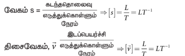
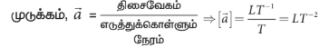
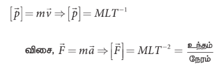
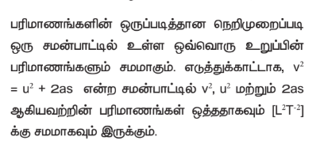
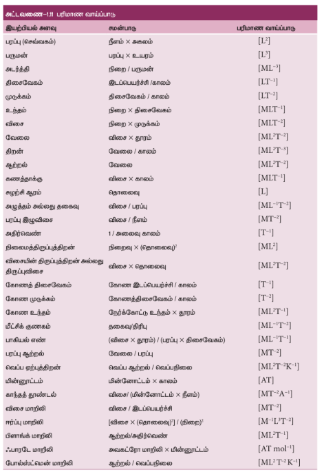
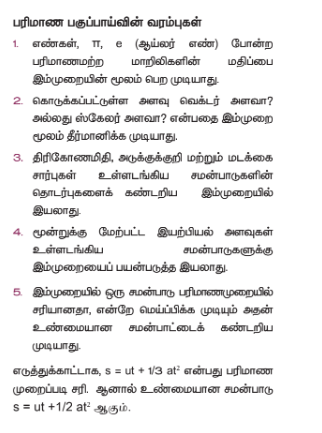

### 1.8 பரிமாணங்களின் பகுப்பாய்வு

#### 1.8.1 இயற்பியல் அளவுகளின் பரிமாணங்கள்

இயந்திரவியலில் நிறை, காலம், நீளம், திசைவேகம், முடுக்கம் போன்ற பல இயற்பியல் அளவுகளைப் பற்றி நாம் படித்துள்ளோம். இந்த இயற்பியல் அளவுகளின் பரிமாணங்கள் அடிப்படை அளவுகளின் பரிமாணங்களான M, L மற்றும் T ஐப் பயன்படுத்தி எழுதப்படுகிறது. ஒரு இயற்பியல் அளவின் பரிமாணம் பின்வருமாறு வரையறை செய்யப்படுகிறது.

**ஒரு இயற்பியல் அளவை எழுதப் பயன்படும் சார்பற்ற அடிப்படை அளவுகளின் பரிமாணங்களின் அடுக்குக் குறியீடுகளின் மதிப்பே அந்த இயற்பியல் அளவின் பரிமாணம் ஆகும். இது கீழ்க்கண்டவாறு குறிக்கப்படுகிறது [இயற்பியல் அளவு].**

எடுத்துக்காட்டாக, [நீளம்] என்பது நீளத்தின் பரிமாணமாகும். [பரப்பு] என்பது பரப்பின் பரிமாணத்தைக் குறிக்கும். அடிப்படை அளவுகளைப் பயன்படுத்தி நீளத்தின் பரிமாணத்தை பின்வருமாறு குறிப்பிடலாம்.

$[\text{நீளம்}] = M^0 L^1 T^0 = L$

இதேபோன்று, $[\text{பரப்பு}] = M^0 L^2 T^0 = L^2$

இவ்வாறே $[\text{பருமன்}] = M^0 L^3 T^0 = L^3$

இங்குகுறிப்பிட்டுள்ளஅனைத்துஉதாரணங்களிலும் அடிப்படை அளவு L ஒன்றுதான். ஆனால் அதன் அடுக்கு வெவ்வேறானவை. அதாவது பரிமாணங்கள் வெவ்வேறானவை இங்குகுறிப்பிட்டுள்ளஅனைத்துஉதாரணங்களிலும் சுழியாகும்.

$[2] = M^0 L^0 T^0$ (பரிமாணமற்றது)

மேலும் சில இயற்பியல் அளவுகளின் பரிமாணத்தை இங்கு காணலாம்.

வேகம் என்பது ஸ்கேலர் அளவு மற்றும் திசைவேகம் என்பது வெக்டர் அளவு என்பதை இங்கு நினைவு கூறவும். (ஸ்கேலர் மற்றும் வெக்டர் போன்றவற்றைப்பற்றி அலகு 2 – இல் படிக்கலாம்)

ஆனால் இவ்விரண்டு பரிமாண வாய்ப்பாடும் ஒன்றே.

ஓரலகு நேரத்திற்கான திசைவேகம்,முடுக்கமாகும்.
நேர்க்கோட்டு உந்தம் அல்லது உந்தம்,

இந்த சமன்பாடு எல்லாவிதமான விசைக்கும் பொருந்தும். இயற்கையில் நான்கு வகையான விசைகளே  நீக்கமற நிறைந்துள்ளன அவை,
வலிமையான விசை, மின்காந்த விசை,  வலிமை குறைந்த விசை மற்றும் ஈர்ப்பு விசை ஆகும்.

மேலும் உராய்வு விசை, மையநோக்கு விசை, மையவிலக்கு விசை போன்ற அனைத்து விசைகளுக்கும் பரிமாண வாய்ப்பாடு $MLT^{-2}$ ஆகும்.

நேரியக்கோட்டு உந்தத்தின் திருப்புத்திறன் கோண உந்தமாகும் (அலகு 5 இல் விளக்கப்பட்டுள்ளது),

கோண உந்தம், $\vec{L} = \vec{r} \times \vec{p} \Rightarrow [\vec{L}] = ML^2T^{-1}$

செய்யப்பட்ட வேலை, $W = \vec{F} \cdot \vec{d} \Rightarrow [W] = ML^2T^{-2}$

இயக்க ஆற்றல் $KE = \frac{1}{2} mv^2 \Rightarrow [KE] = [\frac{1}{2}] m [v]^2$

இங்கு, $\frac{1}{2}$ என்பது பரிமாணமற்ற ஒரு எண்ணாகும். எனவே இயக்க ஆற்றலின் பரிமாணவாய்ப்பாடு

$[KE] = [m][v]^2 \Rightarrow ML^2T^{-2}$

இதேபோன்று நிலையாற்றலின் பரிமாணவாய்ப்பாட்டை பின்வருமாறு கண்டறியலாம்.

எடுத்துக்காட்டாக ஈர்ப்பழுத்த ஆற்றலைக் கருதுக

$[PE] = [m][g][h] = ML^2T^{-2}$

இங்கு $m$ என்பது பொருளின் நிறையாகும், $g$ என்பது புவியீர்ப்பு முடுக்கமாகும். மேலும் $h$ என்பது புவிப்பரப்பிலிருந்து பொருளின் உயரமாகும். எனவே

$[PE] = [m][g][h] = ML^2T^{-2}$

எந்தவகையான  ஆற்றலாக இருப்பினும் (அக ஆற்றல், மொத்த ஆற்றல் மற்றும் மேலும் பல வகையான ஆற்றல்கள்) அதன் பரிமாணம் $ML^2T^{-2}$ ஆகும்.

$[\text{ஆற்றல்}] = ML^2T^{-2}$

விசையின் திருப்புத்திறன், திருப்புவிசை என அழைக்கப்படும்,

$\vec{\tau} = \vec{r} \times \vec{F} \implies [\vec{\tau}] = ML^2T^{-2}$

(τஎன்ற கிரேக்க உயிரெழுத்தை “ட்டவ்” என வாசிக்கவும்) திருப்புவிசை மற்றும் ஆற்றல் இவ்விரண்டின் பரிமாணமும் ஒன்றே. ஆனால் அவை வெவ்வேறான இயற்பியல் அளவுகளாகும். மேலும் இவ்விரண்டு அளவுகளில் ஒன்று (ஆற்றல்) ஸ்கேலர் அளவாகும் மற்றொன்று (திருப்புவிசை) வெக்டர் அளவாகும். இயற்பியல் அளவுகள் ஒரே பரிமாண வாய்ப்பாடு பெற்றிருந்தாலும் அவை ஒரே  இயற்பியல் அளவாக இருக்க வேண்டிய அவசியமில்லை.

> **குறிப்பு:**
>
> 1. இயற்பியலில் நாம் வெவ்வேறு இடங்களில் பரிமாணம் என்ற சொல்லை பயன்படுத்துகிறோம். எனவே அடிக்கடி நமக்கு பரிமாணம் என்பதைப் பற்றி ஐயம் ஏற்படும். உதாரணமாக ஆற்றலின் பரிமாணம், ஒரு பரிமாண இயக்கம் மற்றும் அணுஒன்றின் பரிமாணம் போன்ற சொற்றொடர்களைப் பயன்படுத்துவோம். இயற்பியல் அளவு ஒன்றின் பரிமாணம் என்பது அதனை விவரிக்கும் அடிப்படை அளவின் அடுக்குறியே என்பதை நினைவில் கொள்ளவேண்டும். ஒரு பரிமாண இயக்கம், இருபரிமாண இயக்கம் மற்றும் முப்பரிமாண இயக்கம் போன்றவை அந்த பொருள் இயங்கும் வெளியின் (space) பரிமாணத்தைக் குறிக்கின்றன. அணுவின் பரிமாணம் என்பது அணுவின் அளவைக் குறிக்கின்றது. எனவே வெறுமனே பரிமாணம் என்பது அர்த்தமற்றதாகும். இடத்திற்கு ஏற்ப பரிமாணம் என்பதன் பொருளை புரிந்து கொள்ள வேண்டும்.
>
> 2. $\sin\theta$, $\cos\theta$ போன்ற அனைத்து முக்கோணவியல் சார்புகளும் பரிமாணமற்றவைகளாகும் ($\theta$ பரிமாணமற்றது), அடுக்குக்குறி சார்புகள் $e^x$ மற்றும் மடக்கை சார்புகள் $\ln x$ போன்றவைகளும் பரிமாணமற்றவைகளாகும் ($x$ க்கு பரிமாணம் இருக்கக்கூடாது). தொடர் விரிவாக்கம் (முடிவுறு அல்லது முடிவற்ற) செய்யப்பட்ட சார்பின் விரிவில் $x^0, x^1, x^2, \dots$ என்ற உறுப்புகள் காணப்பட்டால் $x$ என்பது நிச்சயமாக பரிமாணமற்ற அளவாகும்.

#### 1.8.2 பரிமாணமுள்ள அளவுகள், பரிமாணமற்ற அளவுகள், பரிமாணத்தின் ஒருபடித்தான நெறிமுறை

பரிமாணங்களைப் பொறுத்து, இயற்பியல் அளவுகளை நான்கு வகைகளாக வகைப்படுத்த முடியும்.

**(1) பரிமாணமுள்ள மாறிகள்**

எந்த ஒரு இயற்பியல் அளவு பரிமாணத்தையும் மாறுபட்ட மதிப்புகளைப் பெற்றுள்ளதோ அவை பரிமாணமுள்ள மாறிகள் என அழைக்கப்படுகின்றன.

எ.கா: பரப்பு, கன அளவு, திசைவேகம் மற்றும் பல.

**(2) பரிமாணமற்ற மாறிகள்**

எந்த இயற்பியல் அளவுகள் பரிமாணம் அற்று ஆனால் மாறுபட்ட மதிப்புகளைக் கொண்டுள்ளதோ அவை பரிமாணமற்ற மாறிகள் என அழைக்கப்படுகின்றன.

எ.கா: ஒப்படர்த்தி, திரிபு, ஒளிவிலகல் எண் மற்றும் பல.

**(3) பரிமாணமுள்ள மாறிலிகள்**

எந்த இயற்பியல் அளவுகள் பரிமாணத்துடன் நிலையான மதிப்பைப் பெற்றுள்ளதோ அவை பரிமாணமுள்ள மாறிலிகள் என அழைக்கப்படுகின்றன.

எ.கா: ஈர்ப்பியல் மாறிலி, பிளாங்க் மாறிலி மற்றும் பல.

**(4) பரிமாணமற்ற மாறிலிகள்**

ஒரு மாறிலி பரிமாணமற்று இருப்பின் அவை பரிமாணமற்ற மாறிலிகள் எனப்படுகின்றன. எ.கா: $\pi$, $e$ (ஆய்லர் எண்) போன்ற எண்கள் மற்றும் பல.

**பரிமாணங்களின் ஒருபடித்தான நெறிமுறை**

#### 1.8.3 பரிமாணப் பகுப்பாய்வின் பயன்பாடுகளும் வரம்புகளும்

இம்முறையானது,

(i) இயற்பியல் அளவு ஒன்றை ஒரு அலகிடும்
முறையிலிருந்து மற்றொரு அலகிடும்
முறைக்கு மாற்றப் பயன்படுகிறது.

(ii) கொடுக்கப்பட்ட சமன்பாடு பரிமாண முறைப்படி சரியானதா என சோதிக்கப் பயன்படுகிறது.

(iii) வெவ்வேறு இயற்பியல் அளவுகளுக்கிடையே உள்ள தொடர்பினைப் பெற பயன்படுகிறது.

**(i) இயற்பியல் அளவு ஒன்றை ஒரு அலகுமுறையில் இருந்து மற்றொரு அலகுமுறைக்கு மாற்றுதல்**

இந்த முறையானது ஒரு அளவின் எண் மதிப்பை அதன் அலகையும் (u) பெருக்கக் கிடைப்பது ஒரு மாறிலி என்ற தத்துவத்தின் அடிப்படையிலானது.

அதாவது $n[u] = \text{மாறிலி}$

அல்லது $n_1[u_1] = n_2[u_2]$

ஓர் இயற்பியல் அளவானது நிறையின் 'a' பரிமாணத்தையும், நீளத்தின் 'b' பரிமாணத்தையும், காலத்தின் 'c' பரிமாணத்தையும் பெற்றுள்ளதாக கொள்ளவும்.

ஓர் அலகிடும் முறையின்  அடிப்படை அலகுகள் $M_1, L_1$ மற்றும் $T_1$ எனவும் மற்றொரு அலகிடும் முறையின் அடிப்படை அலகுகள் $M_2, L_2$ மற்றும் $T_2$ எனவும் கொண்டால்,

$n_1 [M_1^a L_1^b T_1^c] = n_2 [M_2^a L_2^b T_2^c]$

இதிலிருந்து ஒரு இயற்பியல் அளவின் எண் மதிப்பினை ஓர் அலகிடும் முறையில்  இருந்து மற்றொரு முறைக்கு மாற்ற முடியும்.

**எடுத்துக்காட்டு 1.12**

பரிமாணங்கள் முறையில் 76 cm பாதரச அழுத்தத்தை N m$^{-2}$ என்ற அலகிற்கு மாற்றுக.

**தீர்வு**

CGS முறையில் 76 cm பாதரச அழுத்தம் ($P_1$) = $76 \times 13.6 \times 980$ dyne cm$^{-2}$

SI முறையில் P – மதிப்பு ($P_2$) = ?

அழுத்தத்தின் பரிமாண வாய்ப்பாடு $[ML^{-1}T^{-2}]$

$P_1[M_1^a L_1^b T_1^c] = P_2[M_2^a L_2^b T_2^c]$

$\therefore P_2 = P_1 \left[ \frac{M_1}{M_2} \right]^a \left[ \frac{L_1}{L_2} \right]^b \left[ \frac{T_1}{T_2} \right]^c$

$M_1 = 1 \, g, \, M_2 = 1 \, kg$

$L_1 = 1 \, cm, \, L_2 = 1 \, m$

$T_1 = 1 \, s, \, T_2 = 1 \, s$

எனவே $a = 1, \, b = -1$ மற்றும் $c = -2$ என்பதால்

$\therefore P_2 = 76 \times 13.6 \times 980 \left[ \frac{1g}{1kg} \right]^1 \left[ \frac{1cm}{1m} \right]^{-1} \left[ \frac{1s}{1s} \right]^{-2}$

$= 76 \times 13.6 \times 980 \left[ \frac{10^{-3}kg}{1kg} \right]^1 \left[ \frac{10^{-2}m}{1m} \right]^{-1} \left[ \frac{1s}{1s} \right]^{-2}$

$= 76 \times 13.6 \times 980 \times [10^{-3}] \times 10^2$

$= 1.01 \times 10^5 \, N \, m^{-2}$

**எடுத்துக்காட்டு 1.13**

SI முறையில் ஈர்ப்பியல் மாறிலியின் மதிப்பு $G_{SI} = 6.6 \times 10^{-11} \, Nm^2 \, kg^{-2}$, எனில் CGS முறையில் அதன் மதிப்பைக் கணக்கிடுக?

**தீர்வு**

SI முறையில் ஈர்ப்பியல் மாறிலி $G_{SI}$ எனவும் cgs முறையில் $G_{CGS}$ எனவும் கொள்க.

$G_{SI} = 6.6 \times 10^{-11} \, N \, m^2 \, kg^{-2}$

$G_{CGS} = ?$

ஈர்ப்பியல் மாறிலியின் பரிமாண வாய்ப்பாடு $= [M^{-1}L^3T^{-2}]$

$n_2 = n_1 \left[ \frac{M_1}{M_2} \right]^a \left[ \frac{L_1}{L_2} \right]^b \left[ \frac{T_1}{T_2} \right]^c$

$G_{CGS} = G_{SI} \left[ \frac{M_1}{M_2} \right]^a \left[ \frac{L_1}{L_2} \right]^b \left[ \frac{T_1}{T_2} \right]^c$

$M_1 = 1 \, kg, \, L_1 = 1 \, m, \, T_1 = 1 \, s$

$M_2 = 1 \, g, \, L_2 = 1 \, cm, \, T_2 = 1 \, s$

எனவே $a = -1, \, b = 3$ மற்றும் $c = -2$

$G_{CGS} = 6.6 \times 10^{-11} \left[ \frac{1 \, kg}{1 \, g} \right]^{-1} \left[ \frac{1 \, m}{1 \, cm} \right]^3 \left[ \frac{1 \, s}{1 \, s} \right]^{-2}$

$= 6.6 \times 10^{-11} \left[ \frac{10^3g}{1g} \right]^{-1} \left[ \frac{100cm}{1cm} \right]^3 \times 1$

$= 6.6 \times 10^{-11} \times 10^{-3} \times 10^6$

$= 6.6 \times 10^{-8} \, dyne \, cm^2 \, g^{-2}$

**(ii) பரிமாண முறையில் கொடுக்கப்பட்ட இயற்பியல் சமன்பாட்டை சரிபார்த்தல்**

$v = u + at$ என்ற இயக்கச் சமன்பாட்டை எடுத்துக்கொள்ளவும்.

$[LT^{-1}] = [LT^{-1}] + [LT^{-2}] \, [T]$

$[LT^{-1}] = [LT^{-1}] + [LT^{-1}]$

(ஒரு மாதிரியான பரிமாணங்களை பெற்றுள்ள அளவுகளை மட்டுமே கூட்ட முடியும்)

இருபுறமும் உள்ள பரிமாணங்கள் சமம் என்பதை நாம் காண்கிறோம். எனவே இந்த சமன்பாடு பரிமாண முறையில் சரியானது.

**எடுத்துக்காட்டு 1.14**

$\frac{1}{2} mv^2 = mgh$ என்ற சமன்பாடு பரிமாண முறைப்படி சரியானது என கண்டறிக.

**தீர்வு**

$\frac{1}{2} mv^2$ இன் பரிமாண வாய்ப்பாடு

$= [M][LT^{-1}]^2 = [ML^2T^{-2}]$

$mgh$ இன் பரிமாண வாய்ப்பாடு

$= [M][LT^{-2}][L] = [ML^2T^{-2}]$

$\therefore [ML^2T^{-2}] = [ML^2T^{-2}]$

இருபுறங்களிலும் பரிமாணங்கள் சமம். எனவே $\frac{1}{2} mv^2 = mgh$ என்ற சமன்பாடு பரிமாண முறையில் சரி.

**(iii) வெவ்வேறு இயற்பியல் அளவுகளுக்கிடையே உள்ள தொடர்பினைத் தரும் சமன்பாட்டினைப் பெறுதல்**

$Q$ என்ற இயற்பியல் அளவு $Q_1, Q_2$ மற்றும் $Q_3$ ஆகியவற்றைப் பொறுத்தது எனில்

$Q \propto Q_1^a Q_2^b Q_3^c$

$Q = k Q_1^a Q_2^b Q_3^c$

இங்கு $k$ – பரிமாணமற்ற மாறிலி. $Q_1, Q_2$ மற்றும் $Q_3$ ஆகியவற்றின் பரிமாண வாய்ப்பாட்டை பிரதியிடு, பரிமாணத்தின் ஒரு படித்தான நெறிமுறைப்படி $M, L, T$ அடுக்குகள் இருபுறமும் சமன்படுத்தப்படுகிறது.

இதன் மூலம் $a, b, c$ – இன் மதிப்புகளைப் பெற்று சமன்பாட்டைப் பெறலாம்.

**எடுத்துக்காட்டு 1.15**

தனி ஊசலின் அலைவு நேரத்திற்கான கோவையை பரிமாண முறையில் பெறுக. அலைவு நேரமானது (i) ஊசல் குண்டின் நிறை 'm' (ii) ஊசலின் நீளம் 'l' (iii) அவ்விடத்தில் புவியீர்ப்பு முடுக்கம் $g$ ஆகியவற்றைச் சார்ந்தது. (மாறிலி $k = 2\pi$)

**தீர்வு**

$T \propto m^a l^b g^c$

$T = k m^a l^b g^c$

$k$ என்பது பரிமாணமற்ற மாறிலி. மேற்கண்ட சமன்பாட்டில் பரிமாணங்களை பிரதியிட

$[T] = [M]^a [L]^b [LT^{-2}]^c$

$[T] = [M^a L^{b+c} T^{-2c}]$

சமன்பாட்டின் இருபுறமும் உள்ள $M, L, T$–ன் படிகளை சமன் செய்ய

$a = 0, \, b + c = 0, \, -2c = 1$

சமன்பாடுகளைத் தீர்க்க

$a = 0, \, b = \frac{1}{2}, \,$ மற்றும் $\, c = -\frac{1}{2}$

$a, b$ மற்றும் $c$ மதிப்புகளை சமன்பாடு (1) இல் |---|---|---|
பிரதியிட

$T = k m^0 l^{1/2} g^{-1/2}$

$T = k \left( \frac{l}{g} \right)^{1/2} = k \sqrt{\frac{l}{g}}$

சோதனை மூலம் பெறப்பட்ட $k$ யின் மதிப்பு $k = 2\pi$,

எனவே $T = 2\pi \sqrt{\frac{l}{g}}$

