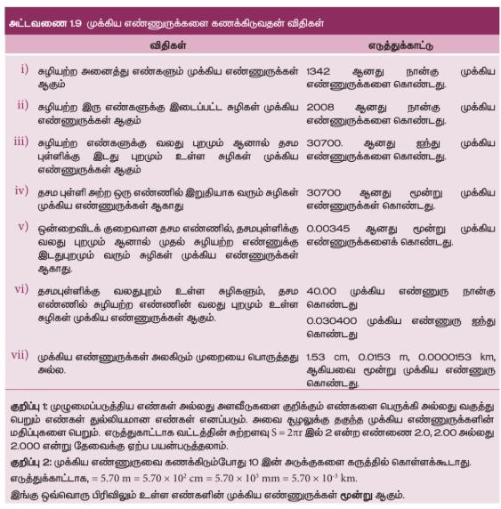
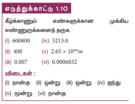
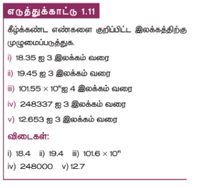
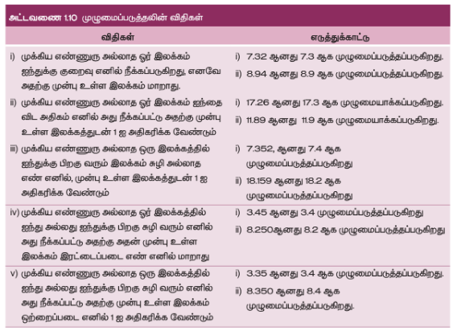

### 1.7 முக்கிய எண்ணுருக்கள்

#### 1.7.1 முக்கிய எண்ணுருவின் வரையறையும், விதிகளும்

மூன்று மாணவர்களிடம் ஒரு குச்சி அல்லது பென்சில் ஒன்றின் நீளத்தை மீட்டர் அளவுகோல் கொண்டு அளவிடும்படி கேட்கும்போது(மீட்டர் அளவுகோளின் மீச்சிற்றளவு 1 mm அல்லது 0.1 cm). ஒவ்வொரு மாணவரின் முடிவும் பின்வரும் ஏதேனும் ஒரு மதிப்பினைக் கொண்டிருக்கும் 7.20 cm அல்லது 7.22 cm அல்லது 7.23 cm. அனைத்து மாணவர்களின் அளவீட்டிலும் முதல் இரண்டு இடமதிப்புகள் ஒன்றுபோல காணப்படும் (நம்பகத்தன்மையுடன்) ஆனால் இறுதி இடமதிப்பு ஒவ்வொருவரையும் பொறுத்து மாறுபடுகிறது. எனவே பொருளுள்ள இடமதிப்புகளின் (meaningful digits) எண்ணிக்கை 3 ஆகும். இது அளவீடு (எண்ணளவு) மற்றும் அளவிடும் கருவியின் துல்லியத்தன்மை இரண்டையும் நமக்கு தெளிவாக உணர்த்தும். எனவே இந்த அளவீட்டின் முக்கிய எண்ணுரு அல்லது முக்கிய இடமதிப்பு 3 ஆகும். இதனை பின்வருமாறு வரையறை செய்யலாம்.

நம்பகமான எண்களும், நிச்சயத்தன்மை அற்ற முதல் எண்ணும் கொண்ட பொருளுள்ள இடமதிப்புகள் முக்கிய எண்ணுறுக்களாகும்.

எடுத்துக்காட்டு: 121.23 என்ற எண்ணின் முக்கிய எண்ணுறு 5 ஆகும். 1.2 என்ற எண்ணின் முக்கிய எண்ணுறு 2 ஆகும். 0.123 இன் முக்கிய எண்ணுறு 3, 0.1230 இன் முக்கிய எண்ணுறு 4, 0.0123 இன் முக்கிய எண்ணுறு 3, 1230 இன் முக்கிய எண்ணுறு 3, 1230 (தசமப்புள்ளியுடன்) இன் முக்கிய எண்ணுறு 4 மேலும் 20000000 இன் முக்கிய எண்ணுறு 1 (ஏனெனில் $20000000 = 2 \times 10^7$ இது ஒரு முக்கிய எண்ணுறு மட்டுமே கொண்டுள்ளது).

இயற்பியல் அளவீடு ஒன்றில் பொருளின் நீளம் $l = 1230 m,  எனில் இதன் முக்கிய எண்ணுரு 4 ஆகும். முக்கிய எண்ணுருக்களை கணக்கிடுவதின் விதிகள் அட்டவணை 1.9 இல் கொடுக்கப்பட்டுள்ளன.

#### 1.7.2 முழுமைப்படுத்துதல் (Rounding off)

தற்காலத்தில் கணக்கீடு செய்ய கணிப்பான்கள் (Calculator) பெரும்பாலும் பயன்படுத்தப்படுகின்றன. அவற்றின் முடிவுகள் பல இலக்கங்களைக் கொண்டதாக உள்ளன. கணக்கீட்டில் உள்ளடங்கும் தகவல்களின் (data) முக்கிய எண்ணுருவை விட முடிவின் முக்கிய எண்ணுரு அதிகமாக இருக்கக்கூடாது. கணக்கீட்டின் முடிவில் நிலையில்லாத (uncertain) இலக்கங்கள் ஒன்றுக்கு மேற்பட்டவை இருப்பின், அந்த எண்ணை முழுமைப்படுத்த வேண்டும். முழுமைப்படுத்துதலில் உள்ள விதிகள் அட்டவணை  1.10 யில் காட்சிப்படுத்தப்பட்டுள்ளது.

#### 1.7.3 முக்கிய எண்ணுருக்களுடன் கணிதச் செயல்பாடுகள்

**(i) கூட்டல் மற்றும் கழித்தல்**

கூட்டல் மற்றும் கழித்தலின்போது, இறுதி முடிவில் அதிக இலக்கங்கள் வரும் பொழுது அந்த எண்களில் மிகக்குறைந்த தசம இலக்கம் உள்ள எண்களின் இலக்கத்திற்கு முழுமைப்படுத்த வேண்டும்.

**எடுத்துக்காட்டு**

1. $3.1 + 1.780 + 2.046 = 6.926$

இங்கு முக்கிய எண்ணுருவின் தசம புள்ளிக்கு பின்வரும் குறைந்த இலக்க எண்ணிக்கை 1. எனவே முடிவானது 6.9 ஆக முழுமைப்படுத்தப்படுகிறது.

2. $12.637 - 2.42 = 10.217$

இங்கு முக்கிய எண்ணுருவின் தசம புள்ளிக்கு பின்வரும் குறைந்த இலக்க எண்ணிக்கை 2. எனவே முடிவானது 10.22 ஆக முழுமைப்படுத்தப்படுகிறது.

**(ii) பெருக்கல் மற்றும் வகுத்தல்**

எண்களின் பெருக்கல் அல்லது வகுத்தலின் போது இறுதி முடிவின் முக்கிய எண்ணுருக்கள், அந்த எண்களில் குறைந்த எண்ணிக்கையில் உள்ள எண்களின் முக்கிய எண்ணுருவிற்கு முழுமைப்படுத்த வேண்டும்.

**எடுத்துக்காட்டு**

1. $1.21 \times 36.72 = 44.4312 = 44.4$

அளவிட்ட அளவின் மிகக்குறைந்த முக்கிய எண்ணுரு மதிப்பு 3. எனவே முடிவானது 44.4 என்ற மூன்று முக்கிய எண்ணுருக்களாக முழுமைப்படுத்தப்பட்டுள்ளது.

2. $36.72 \div 1.2 = 30.6 = 31$

அளவிடப்பட்ட அளவின் மிகக்குறைந்த முக்கிய எண்ணுரு மதிப்பு 2. எனவே முடிவானது 31 என்ற இரண்டு முக்கிய எண்ணுருக்களாக முழுமைப்படுத்தப்படுகிறது.
