**கற்றலின் நோக்கங்கள்:**

இந்த அலகில் மாணவர்கள் அறிந்து கொள்ள இருப்பது

- வியப்படைய வைக்கும் இயற்பியல் கண்டுபிடிப்புகள்
- இயற்பியல் அளவுகளின் முக்கியத்துவம்
- பல்வேறு அளவீடு முறைகள்
- இயற்பியல் அளவீடுகளில் ஏற்படும் பிழைகள் மற்றும் அவற்றை திருத்தம் செய்தல்
- முக்கிய எண்ணுருக்களும் அதன் முக்கியத்துவமும்
- பரிமாணங்களைப் பயன்படுத்தி இயற்பியல் அளவுகளின் ஒருபடித்தான தன்மையைச் சோதித்தல்

## 1.1 அறிவியல் – ஓர் அறிமுகம்

'Science' என்ற சொல் அறிந்து கொள்ளுதல் என்றும் பொருளுடைய சைன்சியா (Scientia) எனும் இலத்தின் மூலச் சொல்லிலிருந்து உருவானதாகும். தமிழ்மொழியில் Science என்பது அறிவியல் எனும் பொருள் கொள்ளப்படுகிறது. உண்மைகளை அறிந்து ஆராய்வதே அறிவியலாகும். மனித மனம் எப்போதும் இயற்கையின் பல்வேறு நிகழ்வுகளான கிரகங்கள், ஒளிரும் நட்சத்திரங்களின் இயக்கங்கள், பருவகாலச் சுழற்சி மாற்றம் மற்றும் வானவில் உருவாதல் போன்றவற்றை அறிந்து கொள்ளவும், புரிந்து கொள்ளவும் ஆர்வமுடன் இருந்து வந்திருக்கிறது. அவை உருவாகும் விதத்தையும் அவற்றின் இடையேயான தொடர்புகளையும் அறிய ஆராய்ச்சி நோக்குள்ள மனம் முனைகிறது. இயற்கையைப் புரிந்து கொள்ளும் இந்த முயற்சிகள் இன்றைய நவீன அறிவியலுக்கும், தொழில் நுட்பத்திற்கும் வழிவகுத்தது. இயற்கை நிகழ்வுகளை உற்றுநோக்கி, ஆய்வு செய்து மற்றும் பகுத்தறிந்து பெறப்பட்ட முறையான அறிவே அறிவியலாகும்.

உயிரற்ற பொருட்களைப் பற்றிப் பயிலும் அறிவியல், இயல் அறிவியல் (இயற்பியல், வேதியியல்) என்றும், உயிருள்ள பொருட்களைப் பற்றிப் பயிலும் அறிவியல் உயிர் அறிவியல் (தாவரவியல், விலங்கியல் மற்றும் பல) என்றும் அழைக்கப்படுகிறது.

இயற்கை நிகழ்வுகளை ஆர்வமாக உற்று நோக்குதல், அறிந்து கொள்ளுதலும் அறிவியலின் ஆரம்பமாகும். அறிவியல் எனும் சொல் 19 ஆம் நூற்றாண்டிலேயே பயன்படுத்தப்பட்டது. முற்காலத்தில் இயற்கை தத்துவவியலே (natural philosophy) அறிவியல் என அழைக்கப்பட்டது. பண்டைய நாகரிக காலத்தில் வானியல், வேதியியல், மனித உடற்கூறியல் மற்றும் வேளாண்மை போன்றவற்றைப் பற்றி அறிந்து சிறந்த முறையில் பயன்படுத்தினார்கள். எழுத்துமுறை வளர்ச்சி பெறுவதற்கு முன்பு வாய்வழி மூலமே அறிவு பரிமாறிக் கொள்ளப்பட்டது. பண்டைய காலத்தில் வானியல் முதல் மருத்துவம் வரை அறிவியல் முன்னேற்றங்கள் அனைத்திலும் எகிப்தியர்களே முன்னோடிகளாகச் சிறந்து விளங்கினார்கள். சிந்து சமவெளி நாகரிக காலந்தொட்டே (3300 – 1300 கி.மு (பொ.ஆ.மு)), இந்தியர்கள் அறிவியல் மற்றும் கணிதப் பயன்பாட்டில் சிறந்து விளங்கினார்கள்.

> இந்திய அரசியலமைப்புச் சட்டம் 51A(h) அடிப்படைக் கடமைகள் பிரிவு IV இல் " அறிவியல் மனப்பான்மையையும், மனித நேயத்தையும், சீர்திருத்தத்தையும், ஆய்வு மனப்பான்மையையும் போற்றி வளர்ப்பது ஒவ்வொரு இந்தியக் குடிமகனின் கடமையாகும்" என்று கூறப்பட்டுள்ளது. இதுவே நமது அறிவியல் கல்வியின் நோக்கமாகும்.

### 1.1.1 அறிவியல் முறை

அறிவியல் முறை என்பது இயற்கை நிகழ்வுகளைப் புரிந்துகொள்வதற்கும் மற்றும் இயற்கை நிகழ்வுகள் தோன்ற காரணமாக உள்ள விதிகளை உருவாக்குவதற்குமான ஒரு படிப்படியான அணுகுமுறையாகும்.

எந்த ஒரு அறிவியல் முறையும் கீழ்க்கண்ட பொதுவான அம்சங்களை உள்ளடக்கியது.

(i) முறைப்படுத்தப்பட்ட உற்று நோக்கல்  
(ii) கட்டுப்படுத்தப்பட்ட பரிசோதனை  
(iii) தரமான மற்றும் அளந்தறியும் பகுப்பாய்வு  
(iv) கணிதவியல் மாதிரிகள்  
(v) கணித்தல் மற்றும் சரிபார்த்தல் அல்லது தவறான கோப்பாக்களை அறிவியல் முறை மூலம் கண்டறிந்து தவிர்த்தல்.

**எடுத்துக்காட்டு**

ஒரு உலோகத் தண்டின் ஒரு முனையை வெப்பப்படுத்தும் போது மறு முனையில் வெப்பம் உணரப்படுகிறது. இந்நிகழ்வை உற்று நோக்கி கீழ்க்காணும் விளக்கங்களை எழுப்பலாம்.

(a) வெப்பப்படுத்தும்பொழுது அந்த தண்டின் உள்ளே நிகழ்வது என்ன?

(b) வெப்பம் மறுமுனைக்கு எவ்வாறு பரவியது?

(c) எல்லா பொருட்களிலும் இந்த விளைவு நிகழுமா?

(d) பொருட்களின் வழியே வெப்பம் பரவுகிறது எனில் வெப்பத்தைக் காண முடியுமா?

மேற்காணும் வினாக்களுக்கான விடைகளைக் கண்டறியும் வழிமுறையே அறிவியல் ஆய்வு முறையாகும்.

வெப்ப இயக்கவியலின் அடிப்படைக் கருத்துக்கள் அலகு 8 இல் விளக்கப்பட்டுள்ளன.

> **உங்களுக்குத் தெரியுமா?**
>
> பொ.ஆ.மு* (BCE) 350இல் இயற்பியல் (Physics) என்ற பெயர் அரிஸ்டாட்டில் (Aristotle) என்பவரால் அறிமுகப்படுத்தப்பட்டது. (*பொது ஆண்டுக்கு முன்)

### 1.2 இயற்பியல் – அறிமுகம்

Physics (இயற்பியல்) என்ற சொல்லானது, இயற்கை என்ற பொருளுடைய **ஃபியுசிஸ்** (Fusis) என்ற கிரேக்கச் சொல்லில் இருந்து தருவிக்கப்பட்டது. இயற்பியல் என்பது இயற்கை மற்றும் இயற்கையின் நிகழ்வுகளைப் பற்றி பயிலுவதாகும், எனவே இயற்பியலே அறிவியலின் அனைத்துப் பிரிவுகளுக்கும் அடிப்படையானதாகக் கருதப்படுகிறது.

இயற்பியல் பயிலுவதில் ஒன்றினைத்துப் பார்த்தல் (Unification) மற்றும் பகுத்துப்பார்த்தல் (Reductionism) ஆகிய இரு அணுகுமுறைகள் உள்ளன. ஒன்றினைத்துப் பார்த்தல் என்பது வேறுபட்ட இயற்பியல் நிகழ்வுகளை ஒரு சில தத்துவங்கள் மற்றும் விதிகளைப் பயன்படுத்தி விளக்க முயற்சித்தலாகும். எடுத்துக்காட்டாக, புவியை நோக்கித் தடையின்றி தானே விழும் பொருட்களின் இயக்கம், சூரியனைச் சுற்றி வரும் கோள்களின் இயக்கம், புவியைச் சுற்றிவரும் சந்திரனின் இயக்கம் ஆகியவற்றிற்கு காரணமான இயற்கையின் விசைகளை நியூட்டனின் ஈர்ப்பியல் விதி ஒன்றினைக்கின்றது (அலகு 6 இல் விளக்கப்படுகிறது).

ஓர் பெரிய அமைப்பினை அல்லது பொருளை (Macroscopic) அதனுள் அடங்கிய நுண்ணிய துகள்களின் (Microscopic) மூலம் விளக்க முயற்சிப்பது பகுத்துப்பார்த்தலாகும். எடுத்துக்காட்டாக, பெரிய அமைப்பின் பண்புகளான வெப்பநிலை, என்ட்ரோபி (Entropy) போன்றவற்றை விளக்க வெப்ப இயக்கவியல் (Thermodynamics) உருவாக்கப்பட்டது. (அலகு - 8).

மூலக்கூறுகளின் இயக்கவியல் கொள்கை (Kinetic Theory) (அலகு 9) மற்றும் புள்ளியியல் எந்திரவியல் (Statistical Mechanics) ஆகியவை மேற்கூறிய ஒரு பெரிய அமைப்பின் (பொருளின்) பண்புகளை அந்த பெரிய அமைப்பின் (பொருளின்) நுண் துகள்களான மூலக்கூறுகள் வழியே விளக்குகிறது.

> **குறிப்பு**
>
> இயற்பியலில் ஒரு பெரிய அமைப்பு (macroscopic system) என்பது நம் கண்ணால் காணக்கூடிய ஒரு கல்லிலிருந்து, வானில் இருக்கும் விண்மீன்கள் வரை அனைத்தையும் குறிக்கும். நுண்ணமைப்பு (microscopic system) என்பது நம் கண்ணிற்கு புலப்படாத சிறிய அளவிலான மூலக்கூறுகளைக் குறிக்கும். சிறிய அளவிலான மூலக்கூறுகள் ஒருங்கிணையும் போது பெரிய அளவிலான பொருள் உருவாகிறது.

### 1.2.1 இயற்பியலின் பிரிவுகள்

இயற்கையின் விதிகளை வெளிக்கொணர்வதில் துணைபூர்ந்த அடிப்படை அறிவியல் இயற்பியலாகும். இந்த இயற்பியலின் மொழி கணிதவியலாகும். பழங்காலத்தில் மனிதர்கள் இயற்கையோடு இணைந்து வாழ்ந்தனர். அவர்கள் வாழ்க்கையானது இயற்கையோடு இணைக்கப்பட்டிருந்தது. வான்பொருட்கள் மற்றும் விண்மீன்களின் இயக்கங்களை அடிப்படையாக்கொண்டு பருவ காலங்களை கணித்தனர். விதைக்கும் மற்றும் அறுவடை செய்யும் காலங்களை வான்வெளியை

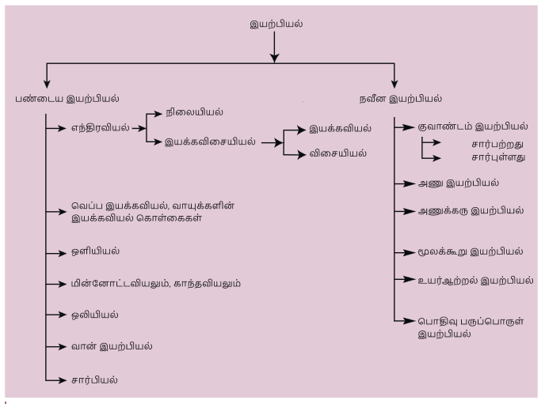

**அட்டவணை 11.1 இயற்பியலின் பிரிவுகள்**
| மரபு இயற்பியல் (Classical Physics) | 20 – ஆம் நூற்றாண்டின் தொடக்கத்திற்கு முன் வளர்ச்சியடைந்த மற்றும் ஏற்றுக்கொள்ளப்பட்ட அடிப்படை இயற்பியல் பற்றியது |
|---|---|
| **பிரிவு (Branch)** | **கவனம் செலுத்தப்பட்ட பகுதி (Major Focus)** |
| 1. மரபு எந்திரவியல் (Classical Mechanics) | ஓய்வு அல்லது இயக்கநிலையில் உள்ள பொருட்களின் மீது செயல்படும் விசைகளைப் பற்றிய விளக்கம் |
| 2. வெப்ப இயக்கவியல் (Thermodynamics) | வெப்பம் மற்றும் பல்வேறு ஆற்றல்களுக்கிடையேயான தொடர்பைப் பற்றிய விளக்கம் |
| 3. ஒளியியல் (Optics) | ஒளியைப் பற்றிய விளக்கம் |
| 4. மின்னோட்டவியலும் காந்தவியலும் (Electricity & Magnetism) | மின்னோட்டம், காந்தவியல் மற்றும் அவற்றின் தொடர்புகளைப் பற்றிய விளக்கம் |
| 5. ஒலியியல் (Acoustics) | ஒலி அலைகள் உருவாதல் மற்றும் பரவுதல் பற்றிய விளக்கம் |
| 6. வான் இயற்பியல் (Astrophysics) | வானியல் பொருட்களைப் பற்றிய விளக்கம் |
| 7. சார்பியல் (Relativity) | கோட்பாட்டு இயற்பியலின் ஒரு பிரிவாகும். வெவ்வேறு முறைகளில் இயங்கும் பொருட்களைப் பொருத்து வெளி, நேரம் மற்றும் ஆற்றல் இவற்றிற்கு இடையேயான தொடர்பிற்கான விளக்கம். |
| நவீன இயற்பியல் (Modern Physics) | 20 – ஆம் நூற்றாண்டின் தொடக்கத்தில் உள்ள இயற்பியல் கருத்துக்கள். |
|---|---|
| 1. *குவாண்டம் எந்திரவியல் (Quantum Mechanics) | அணு மற்றும் அணு உட்துகள் மட்டங்களில் நடைபெறும் நிகழ்வுகளைப் பற்றியது. |
| 2. அணு இயற்பியல் (Atomic Physics) | அணுவின் பண்புகள் மற்றும் அதன் அமைப்புகளைப் பற்றிய இயற்பியல் விளக்கம் |
| 3. அணுக்கரு இயற்பியல் (Nuclear Physics) | அணுக்கரு அமைப்பு, பண்புகள் அதன் இடைவினைகள் பற்றிய இயற்பியல் விளக்கம் |
| 4. பொதிவு பருப்பொருள்கள் இயற்பியல் (Condensed Matter Physics) | பொதிவு பருப்பொருள்களின் (திண்மம், திரவம், இவ்விரு நிலைகளுக்கு இடைப்பட்ட நிலையிலுள்ள பொருட்கள் மற்றும் அடர்வாயுக்கள்) பண்புகளைப்பற்றியது. இது நானோ அறிவியல் (Nano Science), ஒளிச்சிப்ப அறிவியல் (Photonics) போன்ற நன்கு வளர்ந்து வரும் இயற்பியலின் பல்வேறு உட்பிரிவுகளைக் கொண்டுள்ளது. மேலும் இது பொருள் வகை அறிவியலின் (Material Science) அடிப்படைகளை உள்ளடக்கியுள்ளது. இதன் நோக்கம் சிறந்த நம்பகத் தன்மையுடன் பயன்படுத்தக்கூடிய பருப்பொருட்களை உருவாக்குவதைப் பற்றியது. |
| 5. உயர் ஆற்றல் இயற்பியல் (High Energy Physics) | துகள்களின் இயல்புகளைப் பற்றிய விளக்கம் |

> *குவாண்டம் இயற்பியல் என்பது விரிவான அணுகுமுறையாகும், மரபு எந்திரவியலின் முடிவுகளை குவாண்டம் எந்திரவியலில் மூலமும் பெறலாம். இதன் விரிவான விளக்கம் இப்பாடப்புத்தகத்தின் நோக்கத்திற்கு அப்பாற்பட்டது.

நோக்குவதன் மூலம் அனுமானித்து வந்தனர். எனவே, முதன்முதலில் வளர்ச்சியடைந்த அறிவியல் பிரிவு வானியலும் கணிதவியலுமேயாகும். இயற்பியலின் பல்வேறு பிரிவுகளின் காலமுறை வளர்ச்சி பின் இணைப்பு 2 (A.1.1) இல் தொகுத்து வழங்கப்பட்டுள்ளது. படம் 1.1 இல் இயற்பியலின் வெவ்வேறு பிரிவுகள் மற்றும் அவற்றின் தொடர்புகள் சுட்டிப்படமாக காட்டப்பட்டுள்ளது. மேலும், அட்டவணை 1.1 இல் இயற்பியல் பிரிவுகளின் அடிப்படை சட்டிக்காட்டப்பட்டுள்ளன.

மேல்நிலை முதலாமாண்டு இயற்பியல் பாடப்புத்தகத்தின் தொகுதி 1 மற்றும் 2 இல் இயற்பியலின் அடிப்படை பிரிவுகளின் முக்கியக்கருத்துக்கள் விவரிக்கப்பட்டுள்ளன. குறிப்பாக எந்திரவியல் (Mechanics) 1 முதல் 6 வரையிலான அலகுகளாக தொகுத்து வழங்கப்பட்டுள்ளது. அலகு 1 இல் இயற்பியலின் வளர்ச்சி அதன் அடிப்படைக் கருத்துக்களான அளவீட்டியல், அலகுகள் போன்றவற்றுடன் விவரிக்கப்பட்டுள்ளன. இயற்பியல் தத்துவங்கள் மற்றும் அவற்றுக்குக் காரணமான இயற்பியல் விதிகளை விவரிப்பதற்குத் தேவையான அடிப்படை கணிதவியல், அலகு 2 இல் விவரிக்கப்பட்டுள்ளது.

பொருட்களின் மீது செயல்படும் விசையின் தாக்கம் நியூட்டனின் இயக்கவியல் விதிகளின் அடிப்படையில் அலகு 3 இல் முறையாக விவரிக்கப்பட்டுள்ளது. எந்திரவியல் உலகில் ஆய்வு செய்வதற்குத் தேவையப்படும் முக்கிய அளவுருக்களான வேலை மற்றும் ஆற்றல் பற்றிய கருத்துக்கள் அலகு 4 இல் வழங்கப்பட்டுள்ளன.

அலகு 3 மற்றும் 4 இல் பொருட்களை புள்ளிப்பொருட்களாக (Point objects) கருத்தப்பட்டதற்கு மாறாக அலகு 5 இல் திண்மப்பொருட்களின் (Rigid bodies) இயந்திரவியல் பற்றிய கருத்துக்கள் விவரிக்கப்பட்டுள்ளன. அலகு 6 இல் ஈர்ப்புவிசை மற்றும் அதன் விளைவுகள் விளக்கப்பட்டுள்ளன. அலகு 7 இல் இயற்பியலின் பழம்பிரிவான பல்வேறு பருப்பொருட்களின் பண்புகள் விளக்கப்பட்டுள்ளன. வெப்பத்தின் தாக்கம் மற்றும் அதன் விளைவுகளை ஆய்வு செய்வது குறித்து அலகு 8 மற்றும் 9 இல் விளக்கப்பட்டுள்ளது. அலகுகள் மற்றும் அலை இயக்கத்தின் முக்கியக் கூறுகள் அலகு 10 மற்றும் 11 இல் விவரிக்கப்பட்டுள்ளன.

### 1.2.2 இயற்பியல் கற்றலின் இனிமையும், வாய்ப்புகளும்

இயற்பியல் கண்டுபிடிப்புகள் இருமையானவை. அவை தற்போதைய கண்டுபிடிப்புகள் மற்றும் உள்ளுணர்வு மூலம் கணித்தவற்றை ஆய்வகங்கள் மூலம் நன்கு பகுப்பாய்வு செய்து கண்டறிதல் என்பன ஆகும். எடுத்துக்காட்டாக, காந்தத் தன்மை தற்போதாக உணரப்பட்டது. ஆனால் காந்தவியலின் விசேஷப் பண்புகள் கோட்பாட்டினில் (Theoretically) பின்னர் பகுப்பாய்வு செய்யப்பட்டன. இந்தப் பகுப்பாய்வு காந்தப்பொருட்களின் அடிப்படை பண்புகளை வெளிப்படுத்தியது. இதன் மூலம் செயற்கைக் காந்தங்கள் ஆய்வகத்தில் உருவாக்கப்பட்டன. இயற்பியல் கோட்பாடுகளை பயன்படுத்தி முன்னறியும் முறையானது (Prediction) தொழில் நுட்பம் மற்றும் மருத்துவத் துறையின் வளர்ச்சியில் முக்கிய பங்கு வகிக்கிறது. எடுத்துக்காட்டாக, 1905 இல் ஆல்பர்ட் ஐன்ஸ்டீனால் கருத்தியல் ரீதியாக கண்டறியப்பட்ட $E = mc^2$ மிகவும் பிரபலமான சமன்பாடு ஆகும். 1932 இல் காக்ராஃப் மற்றும் வால்டன் அவர்களால் சோதனை மூலம் இக்கருத்து நிரூபிக்கப்பட்டது. கோட்பாடு ரீதியான கணிப்புகளும் (Theoretical Predictions), கணக்கீட்டு நடைமுறைகளும் (Computation Procedures), முக்கியமான பயன்பாடுகளுக்குத் தேவைப்படும் பொருந்தமான மூலப்பொருட்களைத் தேர்ந்தெடுக்கப் பயன்படுகின்றன. மருந்து தயாரிப்பு நிறுவனங்கள் புதிய மருந்து பொருட்களைத் தயாரிக்க இந்த அணுகுமுறையையே பயன்படுத்துகின்றன.

மனித உடலுக்கு ஊறு விளைவிக்காத பொருட்களைக் கொண்டு மாற்று உறுப்புகள் தயாரிப்பதற்கு குவாண்டம் இயற்பியல் (Quantum Physics) பயன்படுத்தப்படுகிறது. இதன் மூலம் ஆய்வுக் கூட ஆராய்ச்சி செயல்முறையில் ஆராயும் முன், குவாண்டம் இயற்பியல் கோட்பாடுகளைப் பயன்படுத்தி பொருந்தமான பொருட்களை முன்னறியும் முறை நவீன சிகிச்சை முறையில் பயன்படுத்தப்படுகிறது. இவ்வாறு கோட்பாடுகளும் (Theoretical) ஆய்வகச் செயல்முறைகளும் (Experimental) பயன்பாட்டில் ஒன்றிணைந்து இணைந்து செயல்படுகின்றன.

மிகப்பெரிய மதிப்புகள் உடைய பல்வேறு இயற்பியல் அளவுகளை (நீளம், நிறை, காலம், ஆற்றல் போன்றவை) உள்ளடக்கியது என்பதால் இயற்பியலின் வாய்ப்புகள் பரந்து விரிந்து காணப்படுகின்றன.

எலக்ட்ரான் மற்றும் புரோட்டான்களை உள்ளடக்கிய மீச்சிறு அளவுகள் முதல் வானியல் நிகழ்வுகள் போன்ற மிகப்பெரிய அளவுகள் வரை இயற்பியல் எடுத்துரைக்கிறது.

- **கால அளவின் வீச்சு (Range):** வானியல் அளவு முதல் நுண்ணிய அளவு வரை ($10^{18}$ s to $10^{-22}$ s).
- **நிறைக்களின் வீச்சு (Range):** மீப்பெரு வான் பொருட்களிலிருந்து எலக்ட்ரான் வரை, $10^{55}$ kg (அளவிடக்கூடிய பிரபஞ்சத்தின் நிறை) முதல் $10^{-31}$ kg (எலக்ட்ரானின் நிறை = $9.11 \times 10^{-31}$ kg) வரை.

இயற்பியலைக் கற்றல் என்பது ஒரு கல்வி சார்ந்த நிகழ்வு மட்டுமின்றி, பல்வேறு வழிகளில் வியப்பூட்டும் வகையிலும் அமைந்துள்ளது.

- சில அடிப்படைக் கருத்துகள் மற்றும் விதிகள் (Concepts and laws) வேறுபட்ட பல இயற்பியல் நிகழ்வுகளை (Physical Phenomena) விளக்குவதாக உள்ளன.
- இயற்பியல் விதிகளை அடிப்படையாகக் கொண்டு பலவகை பயன்பாட்டுக் கருவிகள் வடிவமைக்கப்படுகின்றன.

**எடுத்துக்காட்டாக,** i) ரோபோக்களின் பயன் ii) நிலவு மற்றும் அருகில் உள்ள கோள்களுக்கான பயன்படுத்த முடியாத கட்டுப்படுத்துவது. iii) உடல்நல அறிவியலில் (Health Sciences) பயன்படும் தொழில் நுட்ப முன்னேற்றங்கள் போன்றவை.

- இயற்கையின் உண்மையான இரகசியங்களை வெளிப்படுத்தக்கூடிய புதிய சவால் விடும் செய்முறைகளை பயன்படுத்துதல் மற்றும் ஏற்கனவே உள்ள அறிவியல் கோட்பாடுகளின் உண்மை நிலையை உறுதிப்படுத்துதல்.
- கிரகணம் எவ்வாறு உருவாகிறது? நெருப்பின் அருகில் உள்ள ஒருவர் வெப்பத்தை உணருவது ஏன்? காற்று ஏன் வீசுகின்றது? போன்ற இயற்பியல் நிகழ்வுகளுக்குப் பின் உள்ள அறிவியலை நன்கு ஆய்வு செய்து புரிந்து கொள்ளுதல்.

தொழில்நுட்பத்தில் முன்னேறிக் கொண்டிருக்கும் இன்றைய உலகில் அனைத்து வகையான பொறியியல் மற்றும் தொழில்நுட்பப் பாடப் பிரிவுகளுக்கு அடிப்படையாக இயற்பியல் விளங்குகிறது.

### 1.3 தொழில் நுட்பம் மற்றும் சமுதாயத்துடன் இயற்பியலின் தொடர்பு

இயற்பியலின் கோட்பாடுகளை நடைமுறையில் பயன்படுத்துவதே தொழில் நுட்பமாகும். பல்வேறு துறைகளில் பயனுள்ள பொருட்களை கண்டுபிடிக்கவும் அவற்றைத் தயாரிக்கவும் மற்றும் நடைமுறைப் பிரச்சனைகளைத் தீர்க்கவும் அறிவுத் திறனைப் பயன்படுத்துவதுமே தொழில் நுட்பவியலாகும் (technology).

எனவே நம் சமுதாயத்துடன் நேரடியாகவோ, அல்லது மறைமுகமாகவோ இயற்பியலும் தொழில் நுட்பவியலும் இணைந்து தாக்கத்தை ஏற்படுத்துகின்றன.

**எடுத்துக்காட்டாக,**

i. மின்னோட்டவியல் மற்றும் காந்தவியலின் அடிப்படை விதிகளின் கீழ் கண்டுபிடிக்கப்பட்ட கம்பியிலை தொலைத் தொடர்புமுறை உலகத்தைச் சுருக்கி மிக நீண்ட தொலைவிற்கான மிகச்சிறந்த தொடர்பை ஏற்படுத்துகிறது.

ii. விண்ணவளியில் (space) நிலை நிறுத்தப்பட்ட செயற்கைக்கோள்கள் கோள்கள் தொலைத்தொடர்பில் மிகப்பெரிய புரட்சியை உருவாக்குகின்றன.

iii. நுண் எலக்ட்ரானியல் (Microelectronics), லேசர் (Laser), கணினி (Computer), மீக்கடத்தி (Super Conductor) மற்றும் அணுக்கு ஆற்றல் ஆகியவை மனிதனின் சிந்தனையையும் வாழ்க்கை முறையையும் முழுமையாக மாற்றியுள்ளன.

அனைத்து அறிவியலின் வளர்ச்சிக்கும், அடிப்படை அறிவியலான இயற்பியல் முக்கியப் பங்காற்றுகிறது.

**எடுத்துக்காட்டாக,**

1. **வேதியியலுடன் இயற்பியலின் தொடர்பு:**  
இயற்பியலில் அணு அமைப்பு, கதிரியக்கம், X – கதிர் விளிம்பு விளைவு முதலியவற்றை நாம் பயிக்கின்றோம். அமைப்பைப் பயன்படுத்தி வேதியியல் ஆய்வாளர்கள் தனிம வரிசை அட்டவணையில் அணு எண் அடிப்படையில் அணுக்களை வரிசைப் படுத்துகின்றனர். இது மேலும் அணுக்களின் இணைதிறனின் இயல்புகள், வேதியியல் பிணைப்பு பற்றி அறியவும், சிக்கலான வேதியியல் அமைப்புகளை புரிந்து கொள்ளவும் உதவுகிறது. இங்கு இயல் வேதியியல் (Physical Chemistry), மற்றும் குவாண்டம் வேதியியல் (Quantum Chemistry) போன்ற வேதியியலின் உட்பிரிவுகள் முக்கிய பங்காற்றுகின்றன.
2. **உயிரியலுடன் இயற்பியலின் தொடர்பு:**  
இயற்பியல் தத்துவங்களின் அடிப்படையில் உருவாக்கப்படும் நுண்ணோக்கி (microscope) இல்லாமல் உயிரியல் ஆய்வுகளை நிகழ்த்த முடியாது. எலக்ட்ரான் நுண்ணோக்கி கண்டுபிடிப்பு ஒரு செல்கின் கட்டமைப்பைக்கூட பார்க்க உதவுகிறது. X – கதிர் மற்றும் நியூட்ரான் விளிம்பு விளைவு நுணுக்கங்கள் நியூக்ளியின் அமைப்புகளைப் புரிந்து கொள்ளவும் அதன்மூலம் அடிப்படையான வாழ்க்கை செயல்முறைகளைக் கட்டுப்படுத்தவும் உதவுகிறது. X – கதிர்கள் உடலைப் பகுப்பாய்வு செய்ய உதவுகிறது. ரேடியோ ஐசோடோப்புகள், புற்றுநோய் மற்றும் இதர நோய்களைக் குணப்படுத்த ரேடியோ சிகிச்சை முறையில் பயன்படுத்தப்படுகிறது. தற்பொழுது உயிரியல் செயல்முறைகள் இயற்பியலின் கண்ணோட்டத்தில் கற்பிக்கப்படுகின்றன.
3. **கணிதவியலில் இயற்பியல் தொடர்பு:**  
இயற்பியல் என்பது அளவிடக்கூடிய ஒரு அறிவியல் ஆகும். இயற்பியலின் வளர்ச்சிக்கு கணிதவியல் முக்கியக் கருவியாக உள்ளதால் இயற்பியல் கணிதத்துடன் மிக நெருங்கிய தொடர்பு கொண்டுள்ளது.
4. **வானியலுடன் இயற்பியலின் தொடர்பு:**  
கோள்களின் இயக்கம் மற்றும் வான் பொருட்கள் பற்றி அறிய வானியல் தொலைநோக்கிகள் பயன்படுகின்றன. வானியலாளர்கள் அண்டத்தின் தொலைதூரத்தை உற்றுநோக்க ரேடியோ தொலைநோக்கியைப் பயன்படுத்துகின்றனர். இயற்பியல் தத்துவங்களைப் பயன்படுத்தி அண்டத்தினைப் பற்றி கற்றுக்கொள்ள முடிகின்றது.
5. **புவிநிலை அமைப்பியலுடன் இயற்பியலின் தொடர்பு:**  
வேறுபட்ட பாறைகளின் படிக கட்டமைப்பைப் பற்றி அறிய விளிம்பு விளைவின் நுட்பங்கள் உதவுகின்றன. பாறைகளின் வயது, படிமங்களின் வயது மற்றும் புவியின் வயது ஆகியவற்றைக் கணிக்க கதிரியக்க முறை பயன்படுகிறது.
6. **கடலியலுடன் இயற்பியலின் தொடர்பு:**  
கடலில் நடைபெறும் இயற்பியல் மற்றும் வேதியியல் மாற்றங்களைக் கடலியலாளர்கள் புரிந்து கொள்ள விரும்புகின்றனர். அவர்கள் வெப்பநிலை, உப்புத்தன்மை, நீரோட்டத்தின் வேகம், வாயுக்களின் பாய ஓட்டம், வேதியியல் கூறுகள் போன்ற அளவுகளை அளவீடு செய்கின்றனர்.
7. **உளவியலுடன் இயற்பியலின் தொடர்பு:**  
அனைத்து உளவியல் இடைவிடைகளும் உடலியக்க செயல்முறைகள் மூலமே பெறப்படுகின்றன. நடைபெறும் மனை கடத்திகள் இயக்கங்கள் இயற்பியலின் பண்புகளான விரவல் மற்றும் மூலக்கூறுகளின் இயக்கம் ஆகியவற்றின் அடிப்படையிலேயே அமைக்கின்றன. அலை, துகள் இயக்க இருமைகளின் அடிப்படையிலேயே மூளையின் செயல்பாடும் அமைந்துள்ளது.

இயற்பியலை மிகச்சிறந்த கருவியாகக் கொண்டு உண்மையான அறிவியலை இயற்கை விளக்குகிறது. அறிவியலையும், தொழில்நுட்பவியலையும் சம நிலையில் பயன்படுத்த வேண்டும். இல்லையெனில் அறிவியலை நமக்கு கற்பித்த இயற்கையை அழிக்கும் கருவிகளாக அவை மாறிவிடும்.

உலக வெப்பமயமாதல் மற்றும் தொழில் நுட்பத்தின் எதிர்மறைத் தாக்கம் ஆகியவை தடுக்கப்பட வேண்டும். தொழில்நுட்ப உதவியுடன் தேவையான மற்றும் பொருந்தக் கூடிய பாதுகாப்பான அறிவியலை இந்த நூற்றாண்டின் தேவை ஆகும்.

உயர்கல்வியில் இயற்பியலின் நோக்கமும், வாய்ப்புகளும் மற்றும் பல்வேறு ஆய்வு உதவித்தொகை பற்றிய விவரங்களும் பாடத்தின் ஆரம்பத்திலேயே தொகுக்கப்பட்டுள்ளன.

### 1.4 அளவீட்டியல்

"நீங்கள் எதைப் பற்றி பேசுகிறீர்களோ, அதனை அளவீடு செய்து பின்பு அதனை எண்ணாக வெளிப்படுத்த முடியும் என்றால் மட்டுமே உங்களுக்கு அதனைப் பற்றி ஓரளவாவது தெரிந்துள்ளது எனலாம். ஆனால் எண்ணாக மட்டுமே அளவிட முடியாது மற்றும் போதுமற்றதான அளவே அதனைப் பற்றிய அறிவு உள்ளது" – லார்டு கெல்வின்.

அளவீட்டியல் என்பது எந்த ஒரு இயற்பியல் அளவையும் அதன் படித்தர அளவுடன் ஒப்பிடுவது ஆகும். அதுவே அறிவியல் ஆராய்ச்சிகளுக்கும், சோதனைகளுக்கும் அடிப்படை அளவீட்டியலாகும். இது நம் அன்றாட வாழ்வில் முக்கியப் பங்கு வகிக்கின்றது. இயற்பியல் என்பது அளந்தறியும் அறிவியலாகும். இயற்பியல் அளவீடுகளை குறிப்பிடக்கூடிய எண்களையே இயற்பியலாளர்கள் எப்பொழுதும் கையாள்கின்றனர்.

#### 1.4.1 இயற்பியல் அளவின் வரையறை

அளவிடப்படக்கூடியது, அதன் மூலம் இயற்பியல் விதிகளை விவரிக்கத் தக்கதுமான அளவுகள் இயற்பியல் அளவுகள் எனப்படுகின்றன. எடுத்துக்காட்டு நீளம், நிறை, காலம், விசை, ஆற்றல் மற்றும் பல.

#### 1.4.2 இயற்பியல் அளவுகளின் வகைகள்

இயற்பியல் அளவுகள் இரு வகைப்படும். ஒன்று அடிப்படை அளவுகள், மற்றொன்று வழி அளவுகள்.

வேறு எந்த இயற்பியல் அளவுகளாலும் குறிப்பிடப்பட இயலாத அளவுகள் அடிப்படை அளவுகள் எனப்படும். அவை நீளம், நிறை, காலம், மின்னோட்டம், வெப்பநிலை, ஒளிச்செறிவு மற்றும் பொருளின் அளவு (amount of a substance) ஆகும்.

அடிப்படை அளவுகளால் குறிப்பிடக்கூடிய அளவுகள், வழி அளவுகள் எனப்படும். எடுத்துக்காட்டு, பரப்பு, கனஅளவு, திசைவேகம், முடுக்கம், விசை மற்றும் பல.

#### 1.4.3 அலகின் வரையறை மற்றும் அதன் வகைகள்

அளவீட்டு முறை என்பது அடிப்படையில் ஒரு ஒப்பீட்டு முறையே ஆகும். அளவு ஒன்றை அளந்தறிய, நாம் எப்பொழுதும் அதனை ஒரு படித்தர அளவுடன் ஒப்பிடுகிறோம்.

எடுத்துக்காட்டாக, கயிறு ஒன்றின் நீளம் 10 மீட்டர் என்பது, 1 மீட்டர் நீளம் என வரையறுக்கப்பட்ட ஒரு பொருளின் நீளத்தைப் போல் 10 மடங்கு நீளமுள்ளது என்பதாகும். இங்கு மீட்டர் என்பதே நீளத்தின் படித்தர அளவாகும். இந்த படித்தர அளவே அலகு என்றழைக்கப்படுகிறது.

உலகளவில் ஏற்றுக்கொள்ளப்பட்ட, தனித்துவமிக்க தெரிவு செய்யப்பட்ட ஒரு அளவின் படித்தர அளவே அலகு என வரையறுக்கப்படுகிறது.

அடிப்படை அளவுகளை அளந்தறியும் அலகுகள் அடிப்படை அலகுகள் எனவும், மற்ற இயற்பியல் அளவுகளை அளவிடுவதற்காக அடிப்படை அலகுகளைப் பெருக்கல் அல்லது வகுத்தல்களின் மூலம் பெறப்படும் அலகுகள், வழி அலகுகள் எனவும் அழைக்கப்படுகின்றன.

#### 1.4.4 பல்வேறு அளவிடும் முறைகள்

அனைத்து விதமான அடிப்படை மற்றும் வழி அளவுகளை அளக்கப் பயன்படும் அலகுகளின் ஒரு முழுமையான தொகுப்பே அளவிடும் முறையாகும்.

எந்திரவியலில் பயன்படும் பொதுவான அலகு முறைகள் கீழே தரப்பட்டுள்ளன.

**(அ) f.p.s அலகு முறை**

f.p.s அலகு முறை ஓர் பிரிட்டிஷ் அலகு முறையாகும். இம்முறையில் நீளம், நிறை மற்றும் காலத்தை அளக்க முறையே அடி (Foot), பவுண்ட் (Pound), வினாடி (Second) ஆகிய மூன்று அடிப்படை அலகுகள் பயன்படுத்தப்படுகின்றன.

**(ஆ) c.g.s அலகு முறை**

இது ஓர் காஸ்ஸியன் (Gaussian) முறையாகும். இம்முறையில் நீளம், நிறை மற்றும் காலத்தை அளக்க முறையே சென்டிமீட்டர், கிராம் மற்றும் வினாடி ஆகிய மூன்று அடிப்படை அலகுகள் பயன்படுத்தப்படுகின்றன.

**(இ) m.k.s முறை**

இம்முறையில் நீளம், நிறை மற்றும் காலத்தை அளக்க முறையே மீட்டர், கிலோகிராம் மற்றும் வினாடி ஆகிய மூன்று அடிப்படை அலகுகள் பயன்படுத்தப்படுகின்றன.

> **உங்களுக்கு தெரியுமா?**
>
> cgs, mks மற்றும் SI அலகு முறைகள் மெட்ரிக் அல்லது தசம அலகு முறையாகும். ஆனால் fps அலகு முறை மெட்ரிக் அலகு முறை அல்ல.

#### 1.4.5 SI அலகு முறை

அறிவியல் அறிஞர்கள் மற்றும் பொறியியல் வல்லுனர்களால் உலகம் முழுவதும் பயன்படுத்தப்பட்ட அலகு முறை மெட்ரிக் முறை (Metric System) என அழைக்கப்பட்டது. 1960 க்கு பின்னர் இது பன்னாட்டு அலகு முறை அல்லது SI அலகு முறையாக (Systeme International – French name) அனைவராலும் ஏற்றுக்கொள்ளப்பட்டது. உலகளாவிய அறிவியல், தொழில்நுட்பம், தொழில் துறை மற்றும் வணிகப் பயன்பாட்டிற்காக, 1971 இல் நடைபெற்ற எடைகள் மற்றும் அளவீடுகள் பொதுமாநாட்டில் SI அலகு முறையின் நிலையான திட்டக் குறியீடுகள், அலகுகள் மற்றும் சுருக்கக்குறியீடுகள் உருவாக்கப்பட்டு அனைவராலும் ஏற்றுக்கொள்ளப்பட்டன.

**SI அலகு முறையின் சிறப்பியல்புகளைக் காண்போம்.**

i. இம்முறையில் ஒரு இயற்பியல் அளவிற்கு ஒரு அலகு மட்டுமே பயன்படுத்தப்படுகிறது. அதாவது இம்முறை ஒரு பங்கீட்டு, பகுத்தறிவுக்கினைச் (rational method) முறையாகும்.

ii. இம்முறையில் அனைத்து வழி அலகுகளும், அடிப்படை அலகுகளில் இருந்து எளிதாக தருவிக்கப்படுகின்றன. எனவே, இது ஒரு ஒருங்கமை (coherent) அலகு முறையாகும்.

iii. இது ஒரு மெட்ரிக் அலகு முறையாகும். பெருக்கல் மற்றும் வகுத்தல் மூலம் இது அலகு மாற்றங்களை எளிதாக்குகிறது.

SI அலகு முறையின் ஏழு அடிப்படை அளவுகளும்
அட்டவணை 1.2 இல் தொகுக்கப்பட்டுள்ளன.

**அட்டவணை 11.1 இயற்பியலின் பிரிவுகள்**
| அளவிடை அளவுகள் | SI அலகுகள் |||
|:---|:---:|:---:|:---|
|  | **அலகு** | **குறியீடு** | **வரையறை** |
| **நீளம்** | மீட்டர் | *m* | வெற்றிடத்தில் $\dfrac{1}{299,792,458}$ நொடியில் ஒளியானது கடக்கும் பாதையின் நீளம் 1 மீட்டர் ஆகும் (1983). |
| **நிறை** | கிலோகிராம் | *kg* | பிரான்சில், பாரிசுக்கு அருகில் செர்வ்ஸ் என்ற இடத்தில் உள்ள பன்னாட்டு எடைகள் மற்றும் அளவைகள் நிறுவனத்தில் வைக்கப்பட்டுள்ள பிளாட்டினம்–இரிடியம் உலோகக் கலவையினால் உருவான (இதன் விட்டம் அதன் உயரத்திற்கு சமம்) நிறையே ஒரு கிலோகிராம் ஆகும் (1901). |

**அட்டவணை 1.2 அடிப்படை அளவுகளும் அவற்றின் SI அலகுகளும்.**
| அளவிடை அளவுகள் | SI அலகுகள் |||
|:---|:---:|:---:|:---|
|  | **அலகு** | **குறியீடு** | **வரையறை** |
| **காலம்** | வினாடி | *s* | சீசியம் 133– அணுவின் இரு ஆற்றல் நிலைகளின் மீநுண்ணிய மட்டங்களுக்கிடையே பரிமாறும் நிகழ்தலால் ஏற்படும் கதிர்வீச்சின் அலைவு காலத்தின் 9,192,631,770 மடங்கு ஒரு நொடியாகும் (1967). |
| **மின்னோட்டம்** | ஆம்பியர் | *A* | வெற்றிடத்தில், ஒரு மீட்டர் இடைவெளியில் வைக்கப்பட்ட புறக்கணிக்கத்தக்க குறுக்குவெட்டுப்பரப்பு உடைய இருமுடிவிலா நீளங்கள் உடைய நேரான இணைக்கடத்திகள் வழியே, பாயும் சீரான மின்னோட்டம் அவற்றிடையே ஒரு மீட்டர் நீளத்திற்கு $2\times10^{-7}\ N\,m^{-1}$ விசையை ஏற்படுத்தினால், அம்மின்னோட்டம் ஒரு ஆம்பியர் ஆகும் (1948). |
| **வெப்பநிலை** | கெல்வின் | *K* | நீரின் முப்புள்ளியின்* (Triple point) வெப்பநிலையல் $\dfrac{1}{273.16}$ பின்னத்திற்கு ஒரு கெல்வின் ஆகும் (1967). |
| **பொருளின் அளவு** | மோல் | *mol* | 0.012 கிலோகிராம் தூய கார்பன்–12 இல் உள்ள அணுக்களின் எண்ணிக்கைக்குச் சமமான பல துகள்களை உள்ளடக்கிய பொருளின் அளவு ஒரு மோல் எனப்படும் (1971). |
| **ஒளிச்செறிவு** | கேண்டெலா | *cd* | $5.4\times10^{14}\ Hz$ அதிர்வெண் உடைய ஒளிமூலம், ஒரு திசையில் உமிழும் ஒற்றை நிறக் கதிர்வீச்சின் செறிவு, குறிப்பிட்ட திசையில் $\dfrac{1}{683}$ வாட்/ஸ்டெரேடியன் எனில், அத்தகைய ஒளிச்செறிவு ஒரு கேண்டெலா ஆகும் (1979). |

> *நீரின் முப்புள்ளி என்பது திண்மம், திரவம் மற்றும் உறக்கப் பணிக்கப்பட்ட ஆவி மூன்றும் சமநிலையில் உள்ளபோது உள்ள வெப்பநிலை ஆகும். நீரின் முப்புள்ளி வெப்பநிலை 273.16 K.

**அட்டவணை 1.3 வழி அளவுகளும் அவற்றின் அலகுகளும்**
| இயற்பியல் அளவு | சமன்பாடு | அலகு |
|---|---|---|
| தளக்கோணம் | வட்டவில் / ஆரம் | rad |
| திண்மக்கோணம் | மேற்பரப்பு / ஆரம்$^2$ | sr |
| பரப்பு (செவ்வகம்) | நீளம் × அகலம் | m$^2$ |
| கனஅளவு அல்லது பருமன் | பரப்பு × உயரம் | m$^3$ |
| திசைவேகம் | இடப்பெயர்ச்சி / காலம் | m s$^{-1}$ |
| முடுக்கம் | திசைவேகம் / காலம் | m s$^{-2}$ |
| கோணத் திசைவேகம் | கோணஇடப்பெயர்ச்சி / காலம் | rad s$^{-1}$ |
| கோணமுடுக்கம் | கோணத் திசைவேகம் / காலம் | rad s$^{-2}$ |
| அடர்த்தி | நிறை / பருமன் | kg m$^{-3}$ |
| நீர் நெருக்கம் | நிறை × திசைவேகம் | kg m s$^{-1}$ |
| நிலைமத் திருப்புத்திறன் | நிறை × (தொலைவு)$^2$ | kg m$^2$ |
| விசை | நிறை × முடுக்கம் | kg m s$^{-2}$ அல்லது N |
| அழுத்தம் | விசை / பரப்பு | N m$^{-2}$ அல்லது Pa |
| ஆற்றல் (வேலை) | விசை × தொலைவு | N m அல்லது J |
| திறன் | வேலை / காலம் | J s$^{-1}$ அல்லது வாட் (W) |
| காந்தத்தூண்டல் விசை | விசை × காலம் | N s |
| பரப்பு இழுவிசை | விசை / நீளம் | N m$^{-1}$ |
| விசையின் திருப்புத்திறன் (திருப்பு விசை) | விசை × தொலைவு | N m |
| மின்னூட்டம் | மின்னோட்டம் × காலம் | A s அல்லது C |
| மின்னோட்ட அடர்த்தி | மின்னோட்டம் / பரப்பு | A m$^{-2}$ |
| காந்தத் தூண்டல் | விசை / (மின்னோட்டம் × நீளம்) | N A$^{-1}$ m$^{-1}$ அல்லது tesla |
| விசை மாறிலி | விசை / இடப்பெயர்ச்சி | N m$^{-1}$ |
| பிளாங்க் மாறிலி | போட்டானின் ஆற்றல் / அதிர்வெண் | J s |
| தகைவெப்பம் (S) | வெப்ப ஆற்றல் / (நிறை × வெப்பநிலை) | J kg$^{-1}$ K$^{-1}$ |
| போல்ட்ஸ்மேன் மாறிலி (k) | ஆற்றல் / வெப்பநிலை | J K$^{-1}$ |

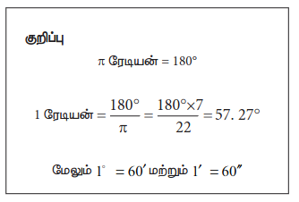

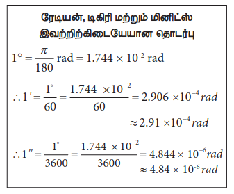

### 1.5 அடிப்படை அளவுகளின் அளவீட்டியல்

#### 1.5.1 நீளத்தை அளந்தறிதல்

இயற்பியலில் நீளத்தைப் பற்றிய கருத்து என்பது, அன்றாட வாழ்வில் தொலைவைப் பற்றிய கருத்தாகும். வெளியில் (Space) இரு புள்ளிகளுக்கு இடையே உள்ள தொலைவே நீளம் என வரையறுக்கப்படுகின்றது. நீளத்தின் SI அலகு மீட்டர் ஆகும்.

பொருட்களின் அளவுகள் நாம் வியக்கும் அளவிற்கு வேறுபடுகின்றன. எடுத்துக்காட்டாக, மிகப்பெரிய தொலைவுகளில் அமைந்த மிகப்பெரிய பொருட்களான விண்மீன் திரள்கள், விண்மீன்கள், சூரியன், புவி, சந்திரன் போன்றவை, பேரண்டத்தை (Macrocosm) உருவாக்குகின்றன. இது மிகப்பெரிய பொருட்களையும் நீண்ட தொலைவுகளையும் உடைய பெரிய உலகத்தைக் குறிக்கிறது.

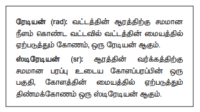

இதற்கு மாறாக மூலக்கூறுகள், அணுக்கள், புரோட்டான்கள், நியூட்ரான்கள், எலக்ட்ரான்கள், பாக்டீரியா போன்ற பொருட்களும் அவற்றின் இடையேயான தொலைவுகளும் நுண் உலகத்தை (Microcosm) உருவாக்குகின்றன. இது மீச்சிறு பொருட்களும், மிகச்சிறிய தொலைவுகளும் உடைய நுண் உலகத்தைக் குறிக்கிறது.

$10^{-5}$ m முதல் $10^{2}$ m வரையிலான தொலைவுகளை நேரடி முறையில் அளக்க முடியும். எடுத்துக்காட்டாக, ஒரு மீட்டர் அளவுகோலைக்கொண்டு $10^{-3}$ m முதல் 1 m வரையிலான தொலைவை அளக்க முடியும், வெர்னியர் அளவி (vernier caliper) கொண்டு $10^{-4}$ m வரையிலான தொலைவையும், திருகு அளவி (screw gauge) கொண்டு $10^{-5}$ m வரையிலான தொலைவையும் அளக்க முடியும்.

அணு மற்றும் வானியல் தொலைவுகளை மேற்கூறிய எந்த ஒரு நேரடியான முறையிலும் அளக்க இயலாது. எனவே, மிகச் சிறிய மற்றும் நீண்ட தொலைவுகளை அளக்க சில மாற்று முறைகள் உருவாக்கப்பட்டு பயன்படுத்தப்படுகின்றன. அட்டவணை 1.4 இல் 10 இன் அடுக்குகள் (நேர்மறை மற்றும் எதிர்மறை) அட்டவணைப்படுத்தப்பட்டுள்ளன.

**அட்டவணை 1.4 பதின் அடுக்குகளின் முன்னொட்டு**
| 10 – இன் அடுக்கு | முன்னொட்டு | குறியீடு | 10 – இன் துணைமடக்குகள் | முன்னொட்டு | குறியீடு |
|---:|---|:---:|---:|---|:---:|
| $10^{1}$ | டெகா (deca) | da | $10^{-1}$ | டெசி (deci) | d |
| $10^{2}$ | ஹெக்டோ (hecto) | h | $10^{-2}$ | சென்டி (centi) | c |
| $10^{3}$ | கிலோ (kilo) | k | $10^{-3}$ | மில்லி (milli) | m |
| $10^{6}$ | மெகா (mega) | M | $10^{-6}$ | மைக்ரோ (micro) | μ |
| $10^{9}$ | கிகா (giga) | G | $10^{-9}$ | நானோ (nano) | n |
| $10^{12}$ | டெரா (tera) | T | $10^{-12}$ | பிக்கோ (pico) | p |
| $10^{15}$ | பெட்டா (peta) | P | $10^{-15}$ | ஃபெம்டோ (femto) | f |
| $10^{18}$ | எக்ஸா (exa) | E | $10^{-18}$ | ஆட்டோ (atto) | a |
| $10^{21}$ | ஜீட்டா (zetta) | Z | $10^{-21}$ | செப்டோ (zepto) | z |
| $10^{24}$ | யோட்டா (yotta) | Y | $10^{-24}$ | யோக்டோ (yocto) | y |

> **உங்களுக்கு தெரியுமா?**
>
> துணை அளவுகளான தளக்கோணம் மற்றும் திண்மக்கோணம் ஆகியவை வழிமுறை அளவுகளாக 1995 ஆம் ஆண்டு (GCWM) மாற்றப்பட்டது.

**(i) சிறிய தொலைவுகளை அளக்கும் (திருகு அளவி மற்றும் வெர்னியர் அளவி)**

**திருகு அளவி**

திருகு அளவியானது 50 mm வரையிலான பொருட்களின் பரிமாணங்களை மிகத் துல்லியமாக அளவிடப் பயன்படும் கருவியாகும். இக்கருவியின் தத்துவம் திருகின் வட்ட இயக்கத்தைப் பயன்படுத்தி பெரிதாக்கப்பட்ட நேர்க்கோட்டு இயக்கமாகும். திருகு அளவியின் மீச்சிற்றளவு 0.01 mm ஆகும்.

**வெர்னியர் அளவி**

துளையின் ஆழம் அல்லது துளையின் விட்டம் போன்ற அளவீடுகளை அளக்கப் பயன்படும் பன்முகத்தன்மை (Versatile) கொண்ட கருவி வெர்னியர் அளவி ஆகும். வெர்னியர் அளவியின் மீச்சிற்றளவு 0.01 cm (பொதுவாக) ஆகும்.

**(ii) நீண்ட தொலைவுகளை அளக்கும்**

மரத்தின் உயரம், புவியிலிருந்து சந்திரன் அல்லது கோள்களின் தூரம் போன்ற நீண்ட தொலைவுகளை அளக்க சில சிறப்பு முறைகளைப் பயன்படுத்துகின்றோம். முக்கோண முறை (Triangulation method), இடமாறு தோற்றமுறை (Parallax method) மற்றும் ரேடார் துடிப்பு முறை (Radar method) ஆகிய முறைகளைப் பயன்படுத்தி மிக நீண்ட தொலைவுகளை அளவிடலாம்.

**முக்கோண முறையின் மூலம் ஒரு பொருளின் உயரத்தை அளவிடும்**

AB = h என்பது அளக்க வேண்டிய மரத்தின் உயரம் அல்லது கோபுரத்தின் உயரம் என்க. B யிலிருந்து x தொலைவில் உள்ள C என்ற இடத்தில் உற்றுநோக்குபவர் இருப்பதாகக் கொள்ளவும். C-லிருந்து வீசும் அளப்பவர் (Range finder) A-வுடன் ஏற்படுத்தும் ஏற்றக்கோணம் ∠ACB = θ (படம் 1.3) என்க. செங்கோண முக்கோணம் ABC விலிருந்து

$\tan \theta = \frac{AB}{BC} = \frac{h}{x}$

அல்லது உயரம் $h = x \tan \theta$

தொலைவு $x$ ஐ அறிந்திருந்தால், உயரம் $h$ ஐப் பெறலாம்.

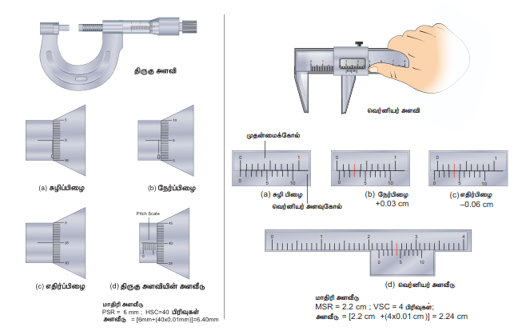

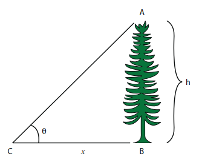
**எடுத்துக்காட்டு 1.1**

தரையில் ஒரு புள்ளியிலிருந்து ஒரு மரத்தின் உச்சியானது 60° ஏற்றக் கோணத்தில் தோன்றுகிறது. மரத்திற்கும் அப்புள்ளிக்கும் இடைப்பட்ட தூரம் 50 m எனில் மரத்தின் உயரத்தைக் காண்க.

**தீர்வு**

கோணம் $\theta = 60^\circ$

மரத்திற்கும் புள்ளிக்கும் இடையேயான தொலைவு $x = 50 \, m$

மரத்தின் உயரம் $h = ?$

முக்கோண முறைப்படி $\tan \theta = \frac{h}{x}$

$h = x \tan \theta$

$h = 50 \times \tan 60^\circ$

$= 50 \times 1.732$

$\therefore$ மரத்தின் உயரம் $h = 86.6 \, m$

**இடமாறு தோற்ற முறை**

மிக நீண்ட தொலைவுகளை அதாவது புவியிலிருந்து மற்றொரு கோளுக்கும் அல்லது விண்மீனுக்கும் இடையேயான தொலைவை இடமாறு தோற்ற முறையின் மூலம் அளவிடலாம்.

இருவேறு இடத்திலிருந்து ஒரு பொருளை பார்க்கும் பொழுது, பொருளின் பின்புலத்தைப் பொறுத்து அதன் நிலையில் (position) மாற்றம் ஏற்படும் அடிப்படையில் அளக்கப்படுவதால் இது இடமாறு தோற்றமுறை என வழங்கப்பட்டது.

இரு இடத்திற்கு (அதாவது உற்று நோக்கும் இடங்கள்) பொருளின் இடையேயான தொலைவு அடிப்படையில் (basis) அளக்கப்படுகிறது.

படம் 1.4 இல் காட்டியுள்ளவாறு, O என்ற புள்ளியிலுள்ள ஏதேனும் ஒரு பொருளைக் கருதுக. அப்பொருளை உற்று நோக்குபவரின் இடது மற்றும் வலது கண்களின் நிலையை முறையே L மற்றும் R என்க. O புள்ளியிலுள்ள பொருளை தனது வலது கண்ணை மூடிய நிலையில் இடது கண்ணால் மட்டும் பார்க்கும் நிலையில் அவரின் இடது கண்ணையும், பொருளையும் இணைக்கும் நேர்க்கோடு LO என்க. இதேபோன்று இடது கண்ணை மூடிக்கொண்டு வலது கண்ணால் பொருளை பார்க்கும்போது, வலது கண்ணையும் பொருளையும் இணைக்கும் நேர்க்கோடு RO என்க. இவ்விரண்டு நேர்க்கோடுகளும் O புள்ளியோடு ஏற்படுத்தும் கோணம் θ விற்கு, இடமாறு தோற்றக்கோணம் என்று பெயர்.

OL, OR இவ்விரண்டையும் x ஆரமுடைய ஒரு வட்டத்தின் ஆரமாகவும், LR = b அவ்வட்டத்தின் வில்லின் நீளம் (அடிப்படை) எனவும் கருதுக.

$OL = OR = x$

$LR = b$ எனும் போது $\theta = \frac{b}{x}$

$b$ மற்றும் $\theta$ வின் மதிப்புகள் தெரிந்தால், $x$ இன் மதிப்பைக் கண்டறியலாம். இம்மதிப்பு நோக்குபவர் உள்ள இடத்திலிருந்து பொருள் இருக்கும் இடம்வரை உள்ள தொலைவின் தோராய மதிப்பினைக் கொடுக்கும்.

நிலை அல்லது அருகில் உள்ள ஒரு விண்மீனை நோக்குபவர் பார்க்கும்போது, நோக்குபவரில் இருந்து வான்பொருளின் தூரத்தை ஒப்பிடும்போது θ வின் மதிப்பு மிகமிகச் சிறியதாக இருக்கும். இத்தகைய நேரங்களில் புவிப்பரப்பிலிருந்து வான்பொருளை பார்க்கும் இரண்டு புள்ளிகளுக்கு இடையே உள்ள தொலைவு போதுமான அளவில் இருக்க வேண்டும்.

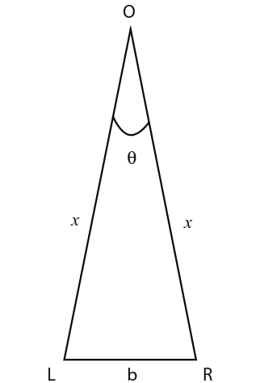

**புவியிலிருந்து நிலவின் தொலைவைக் கணக்கிடுதல் (இடமாறு தோற்றமுறை):**

படம் 1.5 இல் C என்பது புவியின் மையம். A மற்றும் B என்பது புவி மேற்பரப்பில் நேரெதிரான பகுதிகள்.

வானியல் தொலைநோக்கியின் உதவியால் A மற்றும் B விலிருந்து அருகில் உள்ள விண்மீனுக்கும் சந்திரனுக்கும் (M) இடையேயான இடமாறு தோற்றக்கோணம் முறையே $\theta_1$ மற்றும் $\theta_2$ கண்டுபிடிக்கப்படுகிறது. எனவே, புவியிலிருந்து நிலவின் மொத்த இடமாறு தோற்ற கோணம்

$\angle AMB = \theta_1 + \theta_2 = \theta$

$\theta = \frac{AB}{AM}$ ; $AM \approx MC$

$\theta = \frac{AB}{MC}$ $\Rightarrow$ $MC = \frac{AB}{\theta}$ ; $AB$ மற்றும் $\theta$ மதிப்பு அறிந்திருந்தால் புவிக்கும் சந்திரனுக்கும் இடையேயான தொலைவை (MC) கணக்கிடலாம்.

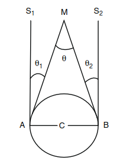

**எடுத்துக்காட்டு 1.2**

புவியின் விட்டத்திற்கு சமமான அடிக்கோட்டுடன் 1°55' கோணத்தை சந்திரன் உருவாக்குகிறது எனில், புவியிலிருந்து சந்திரனின் தொலைவு என்ன? (புவியின் ஆரம் $6.4 \times 10^6$ m)

**தீர்வு**

கோணம் $\theta = 1^\circ 55' = 115'$

$= (115 \times 60)'' \times (4.85 \times 10^{-6}) \, \text{rad}$

$= 3.34 \times 10^{-2} \, \text{rad}$

$(1'' = 4.85 \times 10^{-6} \, \text{rad})$

புவியின் ஆரம் $= 6.4 \times 10^6 \, \text{m}$

புவியிலிருந்து சந்திரனின் தொலைவு $x = ?$

படம் 1.5 இலிருந்து புவியின் விட்டம் AB அதாவது

$b = 2 \times 6.4 \times 10^6 \, \text{m}$

$x = \frac{b}{\theta} = \frac{2 \times 6.4 \times 10^6}{3.34 \times 10^{-2}}$

$x = 3.83 \times 10^8 \, \text{m}$

**ரேடார் துடிப்பு முறை**

ரேடார் (RADAR) என்பது Radio Detection and Ranging என்பதன் சுருக்கமாகும்.

ரேடாரைக் கொண்டு செவ்வாய் போன்ற புவிக்கு அருகில் உள்ள கோளின் தொலைவை துல்லியமாக அளவிட முடியும்.

இம்முறையில் புவிப்பரப்பிலிருந்து ரேடியோ பரப்பி (Transmitter) மூலம் ரேடியோ அலைத்துடிப்புகள் பரப்பப்பட்டு, கோளிலிருந்து எதிரொளிக்கப்பட்ட துடிப்புகள் ஏற்பி (Receiver) மூலம் உணரப்படுகிறது.

ரேடியோ அலைப்பரப்பியிலிருந்து அனுப்பப்பட்டதற்கும் ஏற்பியில் பெறப்பட்டதற்கும் இடையேயான நேர இடைவெளி $t$ எனில் கோளின் தொலைவினை கீழ்க்கண்ட தொடர்பு மூலம் பெற முடியும்.

வேகம் = $\frac{கடந்த தொலைவு}{எடுத்துக்கொண்ட நேரம்}$

தொலைவு $(d) =$ ரேடியோ அலைகளின் வேகம் × எடுத்துக்கொண்ட நேரம்.

எனவே கோளின் தொலைவு

$d = \frac{\nu \times t}{2}$

இங்கு $\nu$ என்பது ரேடியோ அலைகளின் வேகம். ரேடியோ அலைகள் சென்று வர எடுத்துக்கொண்ட நேரம் $t$. $t$ என்பது ரேடியோ அலை முன்னோக்கிச் சென்று திரும்ப எடுத்துக்கொண்ட நேரம் என்பதால், 2-ல் வகுத்து, பொருளின் தொலைவு பெறப்படுகிறது.

இம்முறை மூலம் புவிப்பரப்பிலிருந்து ஓர் விமானம் எவ்வளவு உயரத்தில் பறந்து கொண்டிருக்கிறது என்பதையும் கண்டறியலாம்.

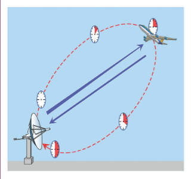

| பொருள்களின் தோராயமான நிறை | நிறை (m) |
|---|---:|
| அண்டத்தின் எல்லையின் மீதுள்ள தொலைவு | $10^{26}$ |
| பூமிக்கும், ஆண்ட்ரோமோடா விண்மீன் திரளுக்கும் இடையே உள்ள தொலைவு | $10^{22}$ |
| நமது விண்மீன்திரளின் அளவு | $10^{21}$ |
| பூமி சூரியனில் இருந்து விலகியிருக்கும் இடையேயான தொலைவு (சூரியவட்டத் தூரம்) | $10^{16}$ |
| புளூட்டோவின் சூரிய சுற்றுப் பாதையின் ஆரம் | $10^{12}$ |
| பூமியில் இருந்து தூரியனின் தொலைவு | $10^{11}$ |
| பூமியில் இருந்து சந்திரனின் தொலைவு | $10^{8}$ |
| பூமியின் ஆரம் | $10^{7}$ |
| கடல் மட்டத்திலிருந்து எவரெஸ்ட் சிகரத்தின் உயரம் | $10^{4}$ |
| காஸ்பரா மலையுச்சியின் நீளம் | $10^{2}$ |
| தாளின் தடிமன் | $10^{-4}$ |
| இரத்த சிவப்பணுக்களின் விட்டம் | $10^{-5}$ |
| ஒளியின் அலைநீளம் | $10^{-7}$ |
| வைரசின் நீளம் | $10^{-8}$ |
| ஹைட்ரஜன் அணுவின் விட்டம் | $10^{-10}$ |
| அணுக்கருவின் அளவு | $10^{-14}$ |
| புரோட்டானின் விட்டம் (தோராயம்) | $10^{-15}$ |

**எடுத்துக்காட்டு 1.3**

ஒரு கோளின் மீது ரேடார் துடிப்பினை செலுத்தி 7 நிமிடங்களுக்குப் பின் அதன் எதிரொளிக்கப்பட்ட துடிப்பு பெறப்படுகிறது. கோளுக்கும் பூமிக்கும் இடையேயான தொலைவு $6.3 \times 10^{10}$ m எனில் ரேடார் துடிப்பின் திசைவேகத்தைக் கணக்கிடுக.

**தீர்வு**

தொலைவு $d = 6.3 \times 10^{10}$ m

நேரம் $t = 7$ நிமிடம் $= 7 \times 60$ s

துடிப்பின் திசைவேகம் $v = ?$

துடிப்பின் திசைவேகம்

$v = \frac{2d}{t} = \frac{2 \times 6.3 \times 10^{10}}{7 \times 60} = 3 \times 10^8 \, \text{m s}^{-1}$

நீளத்தின் பெருக்கங்களும் அதன் வரிசை முறைகளும் அட்டவணை 1.5 இல் காட்டப்பட்டுள்ளது.

> **சில பொதுவான நடைமுறை அலகுகள்**
>
> (i) ஃபெர்மி = 1 fm = $10^{-15}$ m
>
> (ii) 1 ஆங்க்ஸ்ட்ராம் = 1 A$^\circ$ = $10^{-10}$ m
>
> (iii) 1 நானோமீட்டர் = 1 nm = $10^{-9}$ m
>
> (iv) 1 மைக்கிரான் = 1 $\mu$m = $10^{-6}$ m
>
> (v) ஒளியாண்டு (வெற்றிடத்தில், ஒளியானது ஒரு ஆண்டில் செல்லக்கூடிய தொலைவு)
>
> 1 ஒளியாண்டு = $9.467 \times 10^{15}$ m
>
> (vi) வானியல் அலகு - புவியிலிருந்து சூரியனின் சராசரி தொலைவு (1 AU = 1 Astronomical Unit)
>
> 1 AU = $1.496 \times 10^{11}$ m
>
> (vii) 1 பார்செக் (பாராலாக்ஸ் வினாடி) (வில்லின் நீளம் ஒரு வானியல் அலகும் (1 AU), மையக் கோணம் ஒரு (one second) வினாடி வில்லும் கொண்ட வட்டவில்லின் ஆரமே 1 பார்செக் (Parsec) ஆகும்).
>
> 1 பார்செக் = $3.08 \times 10^{16}$ m = 3.26 ஒளியாண்டு.

### 1.5.2 நிறையை அளந்தறிதல்

நிறை என்பது பருப்பொருட்களின் அடிப்படைப் பண்பாகும். இது வெப்பநிலை, அழுத்தம், வெளியில் பொருளின் இருப்பிடம் ஆகியவற்றைச் சார்ந்திராது. ஒரு பொருளில் உள்ள பருப்பொருளின் அளவே, அப்பொருளின் நிறை என வரையறுக்கப்படுகிறது. இதன் SI அலகு கிலோ கிராம் (kg).

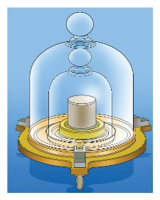

> **உங்களுக்குத் தெரியுமா?**
>
> நிறையை அளவிடப் பயன்படும் உருளை பிளாட்டினம் – இரிடிய உலோகக்கலவையால் உருவாக்கப்படுவதேன்?
>
> சுற்றுச்சூழலாலும், காலத்தின் மாற்றத்தினாலும் பிளாட்டினம் – இரிடியம் உருளை மிகக் குறைந்த அளவே பாதிக்கப்படும்.

நம் பாடப்பகுதியில் பயிலும் பொருட்களின் நிறைகளின் மதிப்பு பரந்த நெடுக்கம் உடையது. இது எலக்ட்ரானின் மிகச்சிறிய நிறை ($9.11 \times 10^{-31}$ kg) யிலிருந்து அண்டத்தின் மிகப்பெரிய நிறை ($10^{55}$ kg) வரை விரிந்துள்ளது.

நிறையின் மிகப்பெரிய செயல்முறை அலகு சந்திரசேகர எல்லை (CSL) யாகும்

1 CSL = சூரியனின் நிறையைப் போன்று 1.4 மடங்கு

காலத்தின் மிகக்குறைந்த நடைமுறை அலகு ஷேக் (Shake)

1 ஸேக் = $10^{-8}$ s

வேறுபட்ட பொருட்களின் நிறைகளின் வகைகள் அட்டவணை 1.6 இல் காட்டப்பட்டுள்ளது.

சாதாரணமாக ஒரு பொருளின் நிறையானது மனிதக்கையில் பயன்படுத்தப்படும் சாதாரண தராசு மூலம் கண்டறியப்படுகிறது.

கோள்கள், விண்மீன்கள் போன்ற பெரிய பொருள்களின் நிறைகளை சில ஈர்ப்பியல் முறையின் மூலம் நாம் அளவிடலாம். அணுக்கள் மற்றும் அணுத்துகள்கள் போன்ற சிறிய துகள்களின் நிறைகளை நாம் நிறை நிறமாலைவரைவியை (mass spectrograph) பயன்படுத்திக் கணக்கிடலாம்.

சாதாரண தராசு, சுருள் தராசு, எலக்ட்ரானியல் தராசு போன்ற சில தராசுகள் பொதுவாக நிறையினைக் கண்டறியப் பயன்படும் தராசுகள் ஆகும்.

**அட்டவணை 1.6 நிறையின் நெடுத்தகம்**
| பொருள் | நிறையின் வரிசை முறுக்கள் (kg) |
|---|---:|
| எலக்ட்ரான் | $10^{-30}$ |
| புரோட்டான் அல்லது நியூட்ரான் | $10^{-27}$ |
| புரோட்டீயம் அணு | $10^{-25}$ |
| இரத்தச்சிவப்பு அணுக்கள் | $10^{-14}$ |
| எலி | $10^{-10}$ |
| தூசுத்துகள் | $10^{-9}$ |
| மழைத்துளி | $10^{-6}$ |
| கொசு | $10^{-5}$ |
| திராட்சைப்பழம் | $10^{-3}$ |
| தவளை | $10^{-1}$ |
| மனிதன் | $10^{2}$ |
| மடிமிந்து | $10^{3}$ |
| கப்பல் | $10^{5}$ |
| சூரியன் | $10^{23}$ |
| பூமி | $10^{25}$ |
| சூரியன் | $10^{30}$ |
| பால்வெளித்திரள் | $10^{41}$ |
| காணக்கூடிய அண்டம் | $10^{55}$ |

### 1.5.3 காலத்தை அளந்தறிதல்

"காலம் சீராக முன்னோக்கி செல்கின்றது" – சர் ஐசக் நியூட்டன்

"கடிகாரம் காட்டுவதே காலம்" – ஆல்பர்ட் ஐன்ஸ்டீன்

கால இடைவெளியை அளக்க கடிகாரம் பயன்படுகின்றது. அணுவியல் கால படித்தரம் சீசியம் அணு உருவாக்கும் சீரான அதிர்வுகளின் அடிப்படையில் அமைந்தது.

மின் அமையியற்றி, மின்னணு அமையியற்றி, குவார்ட்ஸ் படிக கடிகாரம், அணுக்கடிகாரம், அடிப்படைத் துகள்களின் சிதைவுறு காலம், கதிரியக்க வயதுக் கணிப்பு போன்றவை தற்பொழுது உருவாக்கப்பட்ட சில கடிகாரங்களாகும்.

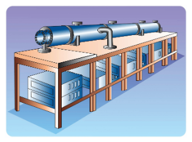

> **உங்களுக்குத் தெரியுமா?**
>
> இந்தியாவில் உள்ள தேசிய இயற்பியல் ஆய்வகம் (NPL) (புதுதில்லி) நீளம், நிறை, காலம் போன்ற இயற்பியல் படித்தரங்களை, பராமரித்தல் மற்றும் தரம் உயர்த்துதல் ஆகிய பணிகளை மேற்கொள்கிறது.

கால இடைவெளியின் வரிசை (order) முறைகள் அட்டவணை 1.7 இல் பட்டியலிடப்பட்டுள்ளன.

**அட்டவணை 1.7 SIன் இடைடெவெளியின் சிக்கல்கள்**
| நிகழ்வுகள் | கால இடைவெளியின் வரிசை முறுக்கள் (s) |
|---|---:|
| நிலநடுக்கத்தை ஏற்படுத்தும் ஆற்றல்காலம் | $10^{-24}$ |
| அணுக்கரு வினையின் வெவ்வேறு கட்ட நிகழ்ந்து கொள்ளும் நேரம் | $10^{-22}$ |
| X–கதிரின் அலைவு நேரம் | $10^{-19}$ |
| ஹைட்ரஜன் அணுவில் உள்ள எலக்ட்ரானின் சுற்றுக்காலம் | $10^{-15}$ |
| காணுறு ஒளியின் (visible light) அலைவு நேரம் | $10^{-15}$ |
| ஒளியின் அலைவு வெவ்வேறு கட்ட நிகழ்ந்து கொள்ளும் நேரம் | $10^{-8}$ |
| அணுவின் சீரற்ற நிலையில் ஆயுட்காலம் | $10^{-8}$ |
| ரேடியோ அலைகளின் அலைவு நேரம் | $10^{-6}$ |
| வெளீ மணி ஒலியின் அலைவு நேரம் | $10^{-3}$ |
| கண் சிமிட்டும் நேரம் | $10^{-1}$ |
| இரு அடுத்தடுத்த இதய துடிப்புகளுக்கிடையேயான நேர இடைவெளி | $10^{0}$ |
| நிலவில் இருந்து ஒளியானது பூமியை அடைய எடுத்துக்கொள்ளும் நேரம் | $10^{0}$ |
| சூரியனில் இருந்து ஒளியானது பூமியை அடைய எடுத்துக்கொள்ளும் நேரம் | $10^{2}$ |
| நியூட்ரானின் சராசரி ஆயுட்காலம் | $10^{3}$ |
| செயற்கைக் கோளின் சுற்றுக் காலம் | $10^{4}$ |
| புவி தன் அச்சை பொறுத்து சுழல் எடுத்துக் கொள்ளும் காலம் (ஒரு நாள்) | $10^{5}$ |
| புவி சூரியனைச் சுற்றும் காலம் (ஒரு வருடம்) | $10^{7}$ |
| மனிதனின் சராசரி ஆயுட்காலம் | $10^{9}$ |
| எகிப்து பிரமிடுகளின் வயது | $10^{11}$ |
| அண்டத்தின் வயது | $10^{17}$ |

### 1.6 பிழைகள்

அனைத்து வகைச் செய்முறை அறிவியலுக்கும், தொழில்நுட்பவியலுக்கும் அடித்தளம் அளவீடுதல் ஆகும். எந்த ஒரு அளவீட்டின் முடிவுகளும் சில துல்லியமற்ற தன்மையை உள்ளடக்கியிருக்கும். இந்த துல்லியமற்ற தன்மையை பிழைகள் எனப்படும். இவ்வாறு அளவிடப்பட்ட மதிப்புகளைப் பயன்படுத்தி செய்யப்படும் கணக்கீடுகள் பிழையாகவே அமையும். எந்த ஒரு ஆய்விலும் மிகச்சரியான அளவீடுகளை பெற முடியாது. அளவீடுதலில் துல்லியத்தன்மை (Accuracy) மற்றும் நுட்பம் (Precision) ஆகிய இரு வேறுபட்ட கூறுகள் பயன்படுத்தப்படுகின்றன. மேலும் இவற்றை வேறுபடுத்தி அறிய வேண்டியுள்ளது. துல்லியத்தன்மை என்பது உண்மையான மதிப்பிற்கு எவ்வளவு அருகில் அளவீடு செய்தோம் என்பதையும், நுட்பம் என்பது இரண்டு அல்லது அதற்கு மேற்பட்ட அளவுகள் ஒன்றுக்கொன்று எவ்வளவு நெருக்கமாக உள்ளது என்பதையும் குறிக்கும்.

#### 1.6.1 துல்லியத்தன்மையும் நுட்பமும்

உங்களின் உண்மையான உயரம் மிகச்சரியாக 5'9" எனக் கொள்வோம். முதலில் நீங்கள் உங்கள் உயரத்தை ஒரு அளவுகோலை மூலம் அளவிடும் போது 5'0" என்ற மதிப்பைப் பெறுகிறீர்கள் என்றால், உங்களுடைய அளவீடு துல்லியத்தன்மை அற்றது. இப்பொழுது உங்கள் உயரத்தை லேசர் அளவுகோலை (laser yardstick) மூலம் அளவிடும் போது உயரம் 5'9" என்ற மதிப்பு கிடைக்கிறது. தற்போது உங்கள் அளவீடு துல்லியத்தன்மை கொண்டது. ஒரு அளவின் உண்மையான மதிப்பைக் கோட்பாடு மதிப்பு என்றும் அழைக்கலாம். ஒவ்வொரு பயன்பாட்டிற்கும் தேவையான துல்லியத்தன்மையின் அளவு மிகவும் மாறுபடுகிறது. அளவீடுகளை மிகவும் துல்லியத்தன்மையுடன் பெறுவதும், தொகுப்பதும் மிகவும் கடினமாகும். எடுத்துக்காட்டாக, அளவுகோல் கொண்டு உங்கள் உயரத்தை பலமுறை அளவீடு செய்யும் பொழுது உயரம் 5'0" என தொடர்ந்து பெற்றால் உங்கள் அளவீடு நுட்பமானது. வெவ்வேறு பயன்பாட்டிற்கும் தேவையும் நுட்பத்தின் அளவு பெரிய அளவில் வேறுபாடு உடையது. சாலை மற்றும் பயன்பாடு கட்டுமானம் போன்ற பொறியியல் செயல்திட்டங்களுக்கான அளவீடுகள் மிகவும் நுட்பமான மில்லி மீட்டர் அல்லது அங்குலத்தில் பத்தில் ஒரு பங்கு அளவிற்குத் தேவைப்படுகிறது.

ஒரு அளவீடு நுட்பமானது எனில் அது துல்லியத்தன்மை கொண்டது என்பது பொருள் அல்ல. எனினும் ஒரு அளவீடு தொடர்ச்சியாகத் துல்லியத்தன்மை கொண்டது எனில் அது நுட்பமான அளவீடு ஆகும்.

ஒரு கட்டிடத்தின் வெளியில் உண்மையான வெப்பநிலை 40 °C என்க. ஒரு வெப்பநிலை மானி அந்த வெப்பநிலை 40 °C என அளவிட்டால், அந்த வெப்பநிலை மானி துல்லியத்தன்மை வாய்ந்தது எனலாம். அந்த வெப்பநிலை மானியால் தொடர்ச்சியாக சரியான வெப்பநிலையை அளவிட முடிகின்றது எனில் அது நுட்பமானது எனக் கூறலாம்.

மற்றொரு எடுத்துக்காட்டினைக் கருதுவோம். ஒரு குளிர்ப்பதனி (refrigerator) யின் வெப்பநிலை மானி ஒரு வெப்பநிலை மானியைக் கொண்டு அளவிடும் போது அது 10.4 °C, 10.2 °C, 10.3 °C, 10.1 °C, 10.2 °C, 10.1 °C, 10.1 °C ஆகிய அளவுகளைத் தருகின்றது. குளிர்ப்பதனியின் உண்மையான வெப்பநிலை 9 °C எனில், அந்த வெப்பநிலை மானி துல்லியத்தன்மை அற்றது (உண்மையான மதிப்பிற்கு 1 °C குறைவாக உள்ளது) ஆனால் அனைத்து அளவிடப்பட்ட அளவுகளும் 10 °C க்கு அருகில் உள்ளதால் அந்த வெப்பநிலை மானி நுட்பமானது.

**ஒரு காட்சி உதாரணம்**

இலக்கு நோக்கி அம்பு எய்தும் எடுத்துக்காட்டு துல்லியத்தன்மை மற்றும் நுட்பத்தின் வேறுபாடினை விளக்க உதவுகிறது. படம் 1.9 (அ), இலக்கின் மையப்புள்ளியை நோக்கிக் குறிவைத்து அம்புகள் எய்யப்படுகின்றன. ஆனால் அம்புகள் அந்தப் புள்ளியைச் சுற்றிய வெவ்வேறு பகுதிகளை அடைகிறது. எனவே அம்பு எய்தல் துல்லியத்தன்மையும், நுட்பமும் அற்றது.

படம் 1.9 (ஆ), அனைத்து அம்புகளும் ஒரே இடத்திற்கு அருகில் பாய்ந்துள்ளன. ஆனால் மையப்புள்ளியை அடையவில்லை. எனவே அவை நுட்பமானவை ஆனால் துல்லியத்தன்மை அற்றவை. படம் 1.9 (இ), அனைத்து அம்புகளும் மையப்புள்ளிக்கு அருகில் பாய்ந்துள்ளன. எனவே அவை துல்லியத்தன்மையும் நுட்பமும் கொண்டவை.

**எண் மதிப்பினை எடுத்துக்காட்டு**

ஒரு குறிப்பிட்ட நீளத்தின் உண்மையான மதிப்பு 5.678 cm. சோதனையில் 0.1 cm பகுதிறன் கொண்ட கருவியைக் கொண்டு அளவிடும் போது 5.5 cm என அளவிடப்படுகிறது. மற்றொரு சோதனையில் 0.01 cm பகுதிறன் கொண்ட கருவியைக் கொண்டு 5.38 cm என அளவிடப்படுகிறது. முதல் அளவீட்டின் போது கண்டறியப்பட்ட அளவு உண்மை அளவிற்கு அருகில் உள்ளது. எனவே அது அதிக துல்லியத்தன்மை வாய்ந்தது. ஆனால், குறைந்த நுட்பம் கொண்டது. இதற்கு மாறாக இரண்டாவது அளவீட்டின் போது கண்டறியப்பட்ட அளவு குறைந்த துல்லியத்தன்மையும் அதிக நுட்பமும் கொண்டது.

#### 1.6.2 அளவீடு செய்தலில் பிழைகள்

இயற்பியல் அளவு ஒன்றை அளவீடு செய்யும் போது ஏற்படும் துல்லியமற்றதன்மை பிழை எனப்படும். அளவிடும்போது முறையான பிழைகள், ஒழுங்கற்ற பிழைகள், மற்றும் மொத்தப்பிழைகள் ஆகிய மூன்று வகையான பிழைகள் ஏற்படலாம்.

**(i) முறையான பிழைகள் (Systematic errors)**

முறையான பிழைகள் என்பது தொடர்ச்சியாக மீண்டும் மீண்டும் ஒரே மாதிரி உருவாகும் பிழைகள் ஆகும். இப்பிழைகள் ஆய்வின் ஆரம்பம் முதல் முடிவு வரை தொடர்ந்து நிகழும் பிரச்சனையால் ஏற்படுகின்றன. முறையான பிழைகள் கீழ்க்கண்டவாறு வகைப்படுத்தப்படுகின்றன.

**1) கருவிப் பிழைகள் (Instrumental errors)**

ஒரு கருவியானது தயாரிக்கப்படும்போது முறையாக அளவீடு (calibration) செய்யப்படவில்லை எனில் கருவிப் பிழைகள் தோன்றலாம். முனை தேய்ந்த மீட்டர் அளவுகோலைக் கொண்டு ஒரு அளவை அளவீடு செய்யும்பொழுது பெறப்பட்ட முடிவுகள் பிழையாக இருக்கும். இந்த வகையான பிழைகள் கருவிகளை கவனமாகத் தேர்ந்தெடுப்பதன் மூலம் சரிசெய்ய முடியும்.

**2) பரிசோதனையின் குறைபாடுகள் அல்லது செய்யுமுறையின் குறைபாடுகள் (Imperfection in experimental technique or procedure)**

சோதனை செய்யும் கருவிகளை அமைக்கும் போது, ஆய்வுகள் சூழலில் ஏற்படும் சில தவறுகளால் இப்பிழைகள் தோன்றுகின்றன. எடுத்துக்காட்டாக, கலோரிமானி கொண்டு சோதனை நிகழ்த்தும் போது வெப்பக் காப்பீடு சரியாக செய்யப்படவில்லை எனில் கதிர்வீச்சு முறையில் வெப்ப இழப்பு ஏற்படும். இதனால் பெறப்படும் முடிவுகள் பிழையாக அமையும். அதனைத் தவிர்க்கத் தேவையான திருத்தங்களை மேற்கொள்ள வேண்டும்.

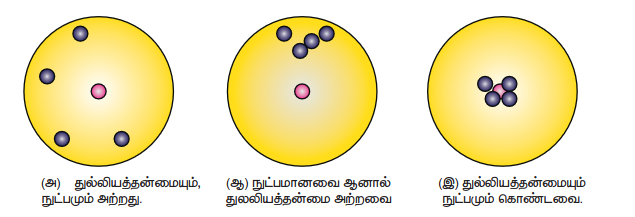

**3) தனிப்பட்டப் பிழைகள் (Personal errors)**

இப்பிழைகள் சோதனையின் போது அளவிடுபவரின் செயல்பாட்டால் உருவாகிறது. கருவியின் தவறான ஆரம்பச் சீரமைவுகள் அல்லது முறையற்ற முன்னெச்சரிக்கை நடவடிக்கையால் அல்லது கவனக்குறைவாக உற்று நோக்கலினால் அளவிடுபவரால் ஏற்படுகிறது.

**4) புறக்காரணிகளால் ஏற்படும் பிழைகள் (Errors due to external causes)**

சோதனையின் போது புறச்சூழலில் ஏற்படும் மாறுபாட்டால் அளவிடுதலில் பிழைகள் ஏற்படும். எடுத்துக்காட்டாக, வெப்பநிலை மாறுபாடு, ஈரப்பதம் அல்லது அழுத்தத்தால் ஏற்படும் மாற்றம் போன்றவை அளவீட்டின் முடிவுகளைப் பாதிக்கும்.

**5) மீச்சிற்றளவு பிழைகள் (Least Count Errors)**

ஒரு அளவுகோலால் அளக்கக்கூடிய மிகச்சிறிய அளவு மீச்சிற்றளவு எனப்படும். மேலும் அதனால் ஏற்படும் பிழைகள் மீச்சிற்றளவு பிழைகள் எனப்படும். அளவிடும் கருவியின் பகுதியின் மதிப்பைச் சார்ந்து இப்பிழைகள் ஏற்படுகின்றன. இவ்வகைப் பிழைகளை உயர்ந்த படம் கொண்ட கருவிகளைப் பயன்படுத்துவதால் குறைக்க முடியும்.

**(ii) ஒழுங்கற்ற பிழைகள் (Random Errors)**

அழுத்தம், வெப்பநிலை, அளிக்கப்படும் மின்னழுத்தம் போன்றவற்றால் சோதனையில் ஏற்படும் தொடர்பற்ற மாறுபாடுகளால், சமயப்பட பிழைகள் ஏற்படுகின்றன. சோதனையை உற்று நோக்குபவரின் கவனக்குறைவால் ஏற்படும் பிழைகள், அளவிடுவர் செய்யும் பிழையினாலும் இவ்வகை பிழைகள் ஏற்படலாம். ஒழுங்கற்ற பிழைகள், வாய்ப்பு பிழைகள் (Chance Errors) எனவும் அழைக்கப்படுகின்றன.

எடுத்துக்காட்டாக, திருகு அளவியைக் கொண்டு ஒரு கம்பியின் தடிமனை அளக்கும் சோதனையைக் கருதுவோம். ஒவ்வொரு முறையும் வேறுபட்ட அளவீடுகள் பெறப்படுகின்றது. எனவே, அதிக எண்ணிக்கையில் அளவீடுகள் செய்யப்பட்டு அதன் கூட்டுச் சராசரி எடுத்துக் கொள்ளப்படுகிறது.

ஒரு சோதனையில் $n$ எண்ணிக்கையில் எடுக்கப்பட்ட அளவீடுகள் $a_1, a_2, a_3, \ldots, a_n$ எனில்,

கூட்டுச் சராசரி

$a_m = \frac{a_1 + a_2 + a_3 + \ldots + a_n}{n}$....(1.1)

அல்லது

$a_m = \frac{1}{n} \sum_{i=1}^{n} a_i$ .....(1.2)

அளவீடுகளின் கூட்டுச் சராசரி மதிப்பு என்பது சிறந்த சாத்தியமான நிகழக்கூடிய உண்மை மதிப்பு ஆகும்.

அட்டவணை 1.8 இல் சோதனை முறை பிழைகளைக் குறைப்பதற்குப் பயன்படும் முறைகள், எடுத்துக்காட்டின் விளக்கப்படுகின்றது.

**(iii) மொத்தப் பிழைகள் (Gross Errors)**

உற்று நோக்குபவரின் கவனக் குறைவின் காரணமாக ஏற்படும் பிழைகள் மொத்தப் பிழைகள் எனப்படும்.

i. கருவியை முறையாகப் பொருத்தாமல் அளவீடு எடுத்தல்.

ii. பிழையின் மூலத்தினையும், முன்னெச்சரிக்கை நடவடிக்கைகளையும் கவனத்தில் கொள்ளாமல் தவறாக அளவீடு எடுத்தல்.

iii. தவறாக உற்றுநோக்கியத்தைப் பதிவிடுதல்.

iv. கணக்கீட்டின் போது தவறான மதிப்பீடுகளைப் பயன்படுத்துதல்.

சோதனை செய்வர் கவனமாகவும், விழிப்புடனும் செயல்பட்டால் இப்பிழைகளைக் குறைக்கலாம்.

**அட்டவணை 1.8 சேருணை முறை பிழைகளை குறைத்தல்**
| பழமையான அளவுகள் | எடுத்துக்காட்டு | குறைக்கும் வழிமுறை |
|---|---|---|
| **ஒழுங்கற்ற பழமையான முறைகள்** | ஒரு பொருளின் நீளத்தை மனித உடலின் உறுப்புகளின் மூலம் ஓர் தோராயக் கொண்டு கணக்கிடல். பண்டையியல் பகுதிப்பாவு மற்றும் அளவீடுகள் ஆகியவற்றைக் கொண்டோம். உதாரணமாக முழம், சாண், ஜாண் போன்றவை. | அதிக எண்ணிக்கையில் நிலையான அலகுகள் இல்லாமல் இருப்பதால் மனிதர்களின் உடல் உறுப்பின் சராசரி அளவு குறையாக அமையும். |
| **முறையான பழமையான முறைகள்** | பல ஆண்டுகளாக பயன்படுத்தப்பட்டு நீட்டப்பட்ட துணி அல்லது நாடா மிகும் கட்டம் ஆகியன பண்டையியல் அளவுகோல்களைக் கொண்டு ஒரு முறையாகப் பயன்படுத்தி செய்யப்பட்டது. பொருளின் நீளத்தை அளவிட துணி அளவுகோலைக் கொண்டோம் (அளவுப்பம் என்னும் ஓர் முறையாக இருக்கும்). | முறையான பழமைகளை கண்டறிவது மிகக் கடினம். அதன் பிழைகளை தவிர்க்க நவீன கருவிகளைப் பயன்படுத்த வேண்டும். |

#### 1.6.3 பிழை பகுப்பாய்வு

**(i) தனிப்பிழை (Absolute error)**

ஒரு அளவின் உண்மையான மதிப்பிற்கும் அளவிடப்பட்ட மதிப்பிற்கும் இடையே உள்ள வேறுபாடுகளின் எண்மதிப்பே தனிப்பிழை எனப்படும். $n$ முறை சோதனை நிகழ்த்தப்பட்ட 'a' என்ற ஒரு அளவின் அளவிடப்பட்ட மதிப்புகள் $a_1, a_2, a_3, \ldots, a_n$ எனில் அவற்றின் கூட்டு சராசரி மதிப்பே அந்த அளவின் உண்மையான மதிப்பு ($a_m$) என அழைக்கப்படுகிறது.

$a_m = \frac{a_1 + a_2 + a_3 + \ldots + a_n}{n}$

அல்லது

$a_m = \frac{1}{n} \sum_{i=1}^n a_i$

அளவிடப்பட்ட மதிப்புகளின் தனிப்பிழை காணப்படுகிறது.

$| \Delta a_1 | = | a_m - a_1 |$

$| \Delta a_2 | = | a_m - a_2 |$

$\dots$

$\dots$

$| \Delta a_n | = | a_m - a_n |$

**(ii) சராசரி தனிப்பிழை (Mean Absolute error)**

சராசரி தனிப்பிழை என்பது அனைத்து அளவுகளின் தனிப்பிழைகளின் எண் மதிப்புகளின் கூட்டுச் சராசரி ஆகும்.

$\Delta a_m = \frac{|\Delta a_1| + |\Delta a_2| + |\Delta a_3| + \ldots + |\Delta a_n|}{n}$

அல்லது

$\Delta a_m = \frac{1}{n} \sum_{i=1}^{n} |\Delta a_i|$

$a_m$ என்பது உண்மையான மதிப்பு, $\Delta a_m$ என்பது சராசரி தனிப்பிழை எனில், அளவுகளின் எண் மதிப்புகள் ($a_m + \Delta a_m$) மற்றும் ($a_m - \Delta a_m$) இடையில் இருக்கும்.

**(iii) ஒப்பீட்டுப் பிழை (Relative error)**

சராசரி தனிப்பிழைக்கும், சராசரி மதிப்பிற்கும் (உண்மை மதிப்பிற்கும்) இடையேயான தகவு ஒப்பீட்டுப் பிழை எனப்படும். இது பின்ன பிழை அல்லது சார்புப் பிழை எனவும் அழைக்கப்படுகிறது.

$\text{ஒப்பீட்டுப் பிழை} = \frac{\text{சராசரி தனிப்பிழை}}{\text{சராசரி மதிப்பு}}$

$= \frac{\Delta a_m}{a_m}$

அளவிடப்பட்ட பொருளின் மொத்த பரிமாணத்துடன் ஒப்பிடும்போது தனிப் பிழை எவ்வளவு பெரியது என்பதை விவரிப்பதே ஒப்பீட்டுப் பிழையாகும்.

எடுத்துக்காட்டாக, ஒரு கார் 62 km h⁻¹ வேகத்தில் செல்லும்போது, வேகமானி காட்டும் அளவு 60 km h⁻¹ இங்கு தனிப்பிழை 62−60 = 2 km h⁻¹ ஆகும். ஒப்பீட்டு பிழை = 2/62 = 0.032

**(iv) விழுக்காட்டுப் பிழை (Percentage error)**

ஒப்பீட்டுப் பிழையினை விழுக்காட்டில் குறிப்பிட்டால், அது விழுக்காட்டுப் பிழை எனப்படும்.

விழுக்காட்டுப் பிழை = $\frac{\Delta a_m}{a_m} \times 100\%$

விழுக்காட்டுப் பிழை மிக அருகில் இருந்தால், அந்த அளவீடு உண்மையான அளவிற்கு மிக அருகில் எடுக்கப்பட்ட அளவீடாகும். இது சரியானதும், ஏற்றுக் கொள்ளக்கூடியதும் ஆகும். இப்பிழைகள் துல்லியமற்ற கருவியினால் ஏற்படுகிறது அல்லது தவறான பரிசோதனை முறைகளால் ஏற்படுகிறது என்பதைப் புரிந்துகொள்வது அவசியமாகிறது.

**எடுத்துக்காட்டு 1.4**

ஒரு சோதனையில் அடுத்தடுத்து தொடர்ச்சியாக அளவீடு செய்யும் பொழுது, தனி ஊசலின் அலைவு நேரத்திற்கான பெறப்பட்ட அளவீடுகள் 2.63 s, 2.56 s, 2.42 s, 2.71 s மற்றும் 2.80 s. எனில்:

i. அலைவு நேரத்தின் சராசரி மதிப்பு
ii. ஒவ்வொரு அளவீட்டிற்கும் தனிப் பிழை
iii. சராசரி தனிப் பிழை
iv. ஒப்பீட்டுப் பிழை
v. விழுக்காட்டுப் பிழை

ஆகியவற்றைக் கணக்கிடுக. முடிவுகளை முறையான வடிவில் தருக.

**தீர்வு**

$t_1 = 2.63 s, t_2 = 2.56 s, t_3 = 2.42 s, t_4 = 2.71 s,  t_5 = 2.80 s$

(i) சராசரி

$T_m = \frac{t_1 + t_2 + t_3 + t_4 + t_5}{5}$

$= \frac{2.63 + 2.56 + 2.42 + 2.71 + 2.80}{5}$

$= \frac{13.12}{5} = 2.624 \, s$

$T_m = 2.62 s$ (இரு தசம எண்ணிற்கு முழுமைப்படுத்தப்பட்டது)

(ii) தனிப்பிழை $\Delta T = |T_m - t|$

$\Delta T_1 = |2.62 - 2.63| = +0.01s$

$\Delta T_2 = |2.62 - 2.56| = +0.06s$

$\Delta T_3 = |2.62 - 2.42| = +0.20s$

$\Delta T_4 = |2.62 - 2.71| = +0.09s$

$\Delta T_5 = |2.62 - 2.80| = +0.18s$

(iii) சராசரி தனிப்பிழை = $\frac{\sum \Delta T_i}{n}$

$\Delta T_m = \frac{0.01 + 0.06 + 0.20 + 0.09 + 0.18}{5}$

$\Delta T_m = \frac{0.54}{5} = 0.108s = 0.11s$

(iv) ஒப்பீட்டுப் பிழை

$S_T = \frac{\Delta T_m}{T_m} = \frac{0.11}{2.62} = 0.0419$

$S_T = 0.04$

(v) விழுக்காட்டுப் பிழை = $0.04 \times 100$ = 4% 

(vi) தனி ஊசலின் அலைவுக்காலம் $T = (2.62 \pm 0.11)s$

### 1.6.4 பிழைகளின் பரவுதல்

ஒரு சோதனையில் அதிக அளவுகள் அளக்கப்பட்டு இறுதிக் கணக்கீட்டில் பயன்படுத்தப்படலாம். வெவ்வேறு வகையான கருவிகளைப் பயன்படுத்தி அளவிடலாம். எனவே அளவிடும்போது ஏற்படும் வெவ்வேறு வகையான பிழைகளை மொத்தமாகக் கணக்கில் கொள்ள வேண்டும்.

பிழைகளின் இறுதி முடிவுகள் கீழ்கண்டவற்றைச் சார்ந்துள்ளது.

i. தனித்தனியான அளவீடுகளில் உள்ள பிழைகள்

ii. கணித செயலிகளின் செயற்பாட்டின் இயல்பைச் சார்ந்து இறுதி முடிவு பெறப்படும். எனவே பிழைகளை ஒன்று சேர்த்து கையாள வேண்டிய விதிகளை அறிந்திருக்க வேண்டும்.

வேறுபட்ட கணித செயலிகளால் ஏற்படக்கூடிய பிழைகளை பெருக்கும் அல்லது பிழைகளை ஒன்று சேர்த்தல் ஆகியவற்றின் வெவ்வேறு சாத்தியக் கூறுகளைக் கீழ்க்கண்டவாறு விவாதிக்கலாம்.

**(i) இரு அளவுகளின் கூட்டலில் ஏற்படும் பிழைகள்**

$\Delta A$ மற்றும் $\Delta B$ என்பன முறையே $A, B$ என்ற அளவுகளின் தனிப்பிழைகள் என்க.

$A$ யின் அளவிடப்பட்ட மதிப்பு = $A \pm \Delta A$

$B$ யின் அளவிடப்பட்ட மதிப்பு = $B \pm \Delta B$

கூட்டல், $Z = A + B$

கூட்டல் $Z$ ன் பிழை $\Delta Z$ ஆகும்

$Z \pm \Delta Z = (A \pm \Delta A) + (B \pm \Delta B)$

$= (A + B) \pm (\Delta A + \Delta B)$

$= Z \pm (\Delta A + \Delta B)$ 

(அல்லது)

$\Delta Z = \Delta A + \Delta B$ $......(1.3)$

இரு அளவுகளைக் கூட்டும் பொழுது ஏற்படும் பெரும பிழையானது தனித்தனி அளவுகளின் தனிப்பிழைகளின் கூடுதலுக்குச் சமம்.

**எடுத்துக்காட்டு 1.5**

$R_1 = (100 \pm 3) \, \Omega$; $R_2 = (150 \pm 2) \, \Omega$ ஆகிய இரு மின்தடைகள் தொடரிணைப்பில் இணைக்கப்படுகின்றன. அவற்றின் தொகுப்பின் மின்தடை என்ன?

**தீர்வு**

$R_1 = (100 \pm 3) \, \Omega$; $R_2 = (150 \pm 2) \, \Omega$

தொகுப்பின் மின்தடை $R = ?$

$R = R_1 + R_2$

$= (100 \pm 3) + (150 \pm 2)$

$= (100 + 150) \pm (3 + 2)$

$R = (250 \pm 5) \, \Omega$

**(ii) இரு அளவுகளின் வேறுபாட்டினால் உருவாகும் பிழைகள்**

$\Delta A$ மற்றும் $\Delta B$ என்பன முறையே $A$ மற்றும் $B$ என்ற அளவுகளின் தனிப்பிழைகள் என்க. $A$ -ன் அளவிடப்பட்ட மதிப்பு $= A \pm \Delta A$

$B$ -ன் அளவிடப்பட்ட மதிப்பு $= B \pm \Delta B$

வேறுபாடு, $Z = A - B$

வேறுபாடு $Z$ ன் பிழை $\Delta Z$ ஆகும்

$Z \pm \Delta Z = (A \pm \Delta A) - (B \pm \Delta B)$

$= (A - B) \pm (\Delta A + \Delta B)$

$= Z \pm (\Delta A + \Delta B)$

(அல்லது) $\Delta Z = \Delta A + \Delta B$ $........{1.4}$

இரு அளவுகளின் வேறுபாட்டினால் ஏற்படும் பிழையின் பெரும்பாலானது தனித்தனி அளவுகளின் தனிப்பிழைகளின் கூடுதல் ஆகும்.

**எடுத்துக்காட்டு 1.6**

ஒரு வெப்பநிலைமானி கொண்டு அளவிடப்பட்ட இரு வெப்பநிலைகளின் தனிப்பிழை $t_1 = (20 \pm 0.5)^\circ C$ மற்றும் $t_2 = (50 \pm 0.5)^\circ C$ எனில் அவற்றின் வெப்பநிலை வேறுபாட்டையும், பிழையையும் கணக்கிடுக.

**தீர்வு**

$t_1 = (20 \pm 0.5)^\circ C$

$t_2 = (50 \pm 0.5)^\circ C$

வெப்பநிலை வேறுபாடு $t = ?$

$t = t_2 - t_1 = (A - B) \pm (\Delta A + \Delta B)$

$= (50 \pm 0.5) - (20 \pm 0.5)$

$= (50 - 20) \pm (0.5 + 0.5)$

$= (30 \pm 1)^\circ C$

**(iii) இரு அளவுகளைப் பெருக்குவதால் ஏற்படும் பிழைகள்:**

$\Delta A$ மற்றும் $\Delta B$ என்பன முறையே $A, B$ என்ற அளவுகளின் தனிப்பிழைகள் என்க.

அவற்றின் பெருக்கல் $Z = AB$

$Z$ இன் பிழை $\Delta Z$ ஆகும்

$Z \pm \Delta Z = (A \pm \Delta A)(B \pm \Delta B) = (AB) \pm (A \Delta B) \pm (B \Delta A) \pm (\Delta A \cdot \Delta B)$

இடது புறத்தை $Z$ ஆலும் வலது புறத்தை $AB$ யிலும் வகுக்க நாம் பெறுவது,

$1 \pm \frac{\Delta Z}{Z} = 1 \pm \frac{\Delta B}{B} \pm \frac{\Delta A}{A} \pm \frac{\Delta A}{A} \cdot \frac{\Delta B}{B}$

$\frac{\Delta A}{A}$ மற்றும் $\frac{\Delta B}{B}$ மிகக் குறைந்த அளவு. எனவே அவற்றின் பெருக்கல் $\frac{\Delta A}{A} \cdot \frac{\Delta B}{B}$ புறக்கணிக்கப்படுகிறது. $Z$ இன் பெரும பின்னப் பிழை

$\frac{\Delta Z}{Z} = \pm \left( \frac{\Delta A}{A} + \frac{\Delta B}{B} \right)$ $........{1.5}$

> இரு அளவுகளைப் பெருக்குவதால் ஏற்படும் பெரும பின்னப் பிழையானது தனித்தனி அளவுகளின் பின்னப் பிழைகளின் கூடுதலுக்குச் சமம்.

இதற்கான மாற்றுமுறை பின் இணைப்பு 2 (A 1.2) இல் கொடுக்கப்பட்டுள்ளது.

**எடுத்துக்காட்டு 1.7**

ஒரு செவ்வகத்தின் நீளம் மற்றும் அகலம் முறையே $(5.7 \pm 0.1) \, \text{cm}$ மற்றும் $(3.4 \pm 0.2) \, \text{cm}$ எனில் செவ்வகத்தின் பரப்பை பிழை எல்லையுடன் கணக்கிடுக.

**தீர்வு**

நீளம் $l = (5.7 \pm 0.1) \, \text{cm}$

அகலம் $b = (3.4 \pm 0.2) \, \text{cm}$

பிழை எல்லையுடன் கூடிய பரப்பு $(A \pm \Delta A) = ?$

பரப்பு $A = l \times b = 5.7 \times 3.4 = 19.38 = 19.4 \, \text{cm}^2$

$\frac{\Delta A}{A} = \left( \frac{\Delta l}{l} + \frac{\Delta b}{b} \right)$

$\Delta A = \left( \frac{\Delta l}{l} + \frac{\Delta b}{b} \right) A$

$\Delta A = \left( \frac{0.1}{5.7} + \frac{0.2}{3.4} \right) \times 19.4$

$= (0.0175 + 0.0588) \times 19.4$

$= 1.48 = 1.5$

பிழை எல்லையுடன் கூடிய பரப்பு $A = (19.4 \pm 1.5) \, \text{cm}^2$

**(iv) இரு அளவுகளை வகுப்பதால் ஏற்படும் பிழைகள்**

$\Delta A$ மற்றும் $\Delta B$ என்பன முறையே $A, B$ என்ற அளவுகளின் தனிப்பிழைகள் என்க. அவற்றின் பின்னம், $Z = \frac{A}{B}$

$Z$ இன் பிழை $\Delta Z$ ஆகும்

$Z \pm \Delta Z = \frac{A \pm \Delta A}{B \pm \Delta B} = \frac{A \left( 1 \pm \frac{\Delta A}{A} \right)}{B \left( 1 \pm \frac{\Delta B}{B} \right)}$

$= \frac{A}{B} \left( 1 \pm \frac{\Delta A}{A} \right) \left( 1 \pm \frac{\Delta B}{B} \right)^{-1}$

அல்லது

$Z \pm \Delta Z = Z \left( 1 \pm \frac{\Delta A}{A} \right) \left( 1 \mp \frac{\Delta B}{B} \right)$

$[x \ll 1]$ ஆக இருக்கும்போது, $(1+x)^n \approx 1+nx$

இருபுறமும் $Z$ ஆல் வகுக்க,

$1 \pm \frac{\Delta Z}{Z} = \left( 1 \pm \frac{\Delta A}{A} \right) \left( 1 \mp \frac{\Delta B}{B} \right)$

$= 1 \pm \frac{\Delta A}{A} \mp \frac{\Delta B}{B} \pm \frac{\Delta A}{A} \cdot \frac{\Delta B}{B}$

$\frac{\Delta A}{A}$ மற்றும் $\frac{\Delta B}{B}$ மிகக் குறைவு, எனவே அவற்றின் பெருக்கல்பலன் புறக்கணிக்கத்தக்கது. $Z$ இன் பெரும்பின்னம்,

$\frac{\Delta Z}{Z} = \left( \frac{\Delta A}{A} + \frac{\Delta B}{B} \right)$ $........{1.6}$

> இரு அளவுகளை வகுப்பதால் பெறப்படும் பெரும பின்னப் பிழையானது தனித்தனி அளவுகளின் பின்னப் பிழைகளின் கூடுதலுக்குச் சமம்.

இதற்கான மாற்றுமுறை பின் இணைப்பு 2 (A 1.2) இல் கொடுக்கப்பட்டுள்ளது.

**எடுத்துக்காட்டு 1.8**

ஒரு கம்பிக்கு குறுக்கே உள்ள மின்னழுத்த வேறுபாடு $(100 \pm 5) \, \text{V}$ மற்றும் அதன் வழியே பாயும் மின்னோட்டம் $(10 \pm 0.2) \, \text{A}$ எனில். அக்கம்பியின் மின்தடையைக் காண்க.

**தீர்வு**

மின்னழுத்தம் $V = (100 \pm 5) \, \text{V}$

மின்னோட்டம் $I = (10 \pm 0.2) \, \text{A}$

மின்தடை $R = ?$

ஒமின் விதிப்படி $R = \frac{V}{I}$

$R = \frac{100}{10} = 10 \, \Omega$

$\frac{\Delta R}{R} = \left( \frac{\Delta V}{V} + \frac{\Delta I}{I} \right)$

$\Delta R = \left( \frac{\Delta V}{V} + \frac{\Delta I}{I} \right) R$

$= \left( \frac{5}{100} + \frac{0.2}{10} \right) \times 10$

$= (0.05 + 0.02) \times 10$

$= 0.07 \times 10 = 0.7$

மின்தடை $R = (10 \pm 0.7) \, \Omega$

**(v) அளவின் அடுக்கினால் ஏற்படும் பிழை**

$A$ யின் படை அடுக்கு $Z$ என்க $Z = A^n$

$Z$ யின் பிழை $\Delta Z$ எனில்

$Z \pm \Delta Z = (A \pm \Delta A)^n = A^n \left( 1 \pm \frac{\Delta A}{A} \right)^n$

$= Z \left( 1 \pm n \frac{\Delta A}{A} \right)$

(இங்கு $|x| << 1$, $(1 + x)^n \approx 1 + nx$ என்ற சமன்பாடு பயன்படுத்தப்படுகிறது).

இருபுறமும் $Z$ ஆல் வகுக்க

$1 \pm \frac{\Delta Z}{Z} = 1 \pm n \frac{\Delta A}{A} \implies \frac{\Delta Z}{Z} = n \frac{\Delta A}{A}$ $........{1.7}$

> ஒரு அளவின் $n$ ஆவது அடுக்கின் பெரும பின்னப் பிழையானது, அதன் பின்னப் பிழையை $n$ ஆல் பெருக்குவதற்குச் சமம்.

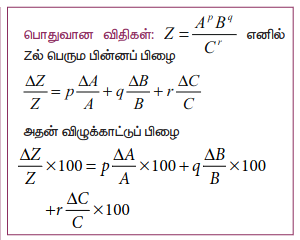

**எடுத்துக்காட்டு 1.9**

ஒரு இயற்பியல் அளவு $x = \frac{a^2b^3}{c\sqrt{d}}$ என்று கொடுக்கப்பட்டுள்ளது. $a, b, c$ மற்றும் $d$ ஆகியவற்றின் விழுக்காட்டுப் பிழை $4\%, 2\%, 3\%$ மற்றும் $1\%$ எனில் $x$ ன் விழுக்காட்டுப் பிழையைக் காண்க. (NEET 2013)

**தீர்வு**

$x = \frac{a^2b^3}{c\sqrt{d}}$

$x$ ன் விழுக்காட்டுப் பிழை

$\frac{\Delta x}{x} \times 100 = 2 \frac{\Delta a}{a} \times 100 + 3 \frac{\Delta b}{b} \times 100$

$+ \frac{\Delta c}{c} \times 100 + \frac{1}{2} \frac{\Delta d}{d} \times 100$

$= (2 \times 4\%) + (3 \times 2\%) + (1 \times 3\%) + \left(\frac{1}{2} \times 1\%\right)$

$= 8\% + 6\% + 3\% + 0.5\%$

$x$ ன் விழுக்காட்டுப் பிழை $= 17.5\%$

### 1.7 முக்கிய எண்ணுருக்கள்

#### 1.7.1 முக்கிய எண்ணுருவின் வரையறையும், விதிகளும்

முன்னு மாணவர்களிடம் ஒரு குச்சி அல்லது பென்சில் ஒன்றின் நீளத்தை மீட்டர் அளவுகோலை மூலமாக அளக்கும் போது (மீட்டர் அளவுகோளின் மீச்சிற்றளவு 1 mm அல்லது 0.1 cm). ஒவ்வொரு மாணவரின் முடிவும் பின்வரும் ஏதேனும் ஒரு மதிப்பினைக் கொண்டிருக்கும் 7.20 cm அல்லது 7.22 cm அல்லது 7.23 cm. அனைத்து மாணவர்களின் அளவீட்டிலும் முதல் இரண்டு இடமதிப்புகள் ஒன்றுபோல் காணப்படும் (நம்பகத்தன்மையுடன்) ஆனால் இறுதி இடமதிப்பு ஒவ்வொருவரையும் பொறுத்து மாறுபடுகிறது. எனவே பொருளுள்ள இடமதிப்புகளின் (meaningful digits) எண்ணிக்கை 3 ஆகும். இது அளவீடு (எண்) மற்றும் அளவிடும் கருவியின் துல்லியத்தன்மை இரண்டையும் நமக்கு தெளிவாக உணர்த்தும். எனவே இந்த அளவீட்டின் முக்கிய எண்ணுரு அல்லது முக்கிய இடமதிப்பு 3 ஆகும். இதனை பின்வருமாறு வரையறை செய்யலாம்.

நம்பகமான எண்களும், நிச்சயத்தன்மை அற்ற முதல் எண்ணும் கொண்ட பொருளுள்ள இடமதிப்புகள் முக்கிய எண்ணுருக்களாகும்.

எடுத்துக்காட்டு: 121.23 என்ற எண்ணின் முக்கிய எண்ணுரு 5 ஆகும். 1.2 என்ற எண்ணின் முக்கிய எண்ணுரு 2 ஆகும். 0.123 இன் முக்கிய எண்ணுரு 3, 0.1230 இன் முக்கிய எண்ணுரு 4, 0.0123 இன் முக்கிய எண்ணுரு 3, 1230 இன் முக்கிய எண்ணுரு 3, 1230 (தசமப்புள்ளியுடன்) இன் முக்கிய எண்ணுரு 4 மேலும் 20000000 இன் முக்கிய எண்ணுரு 1 (ஏனெனில் $20000000 = 2 \times 10^7$ இது ஒரு முக்கிய எண்ணுரு மட்டுமே கொண்டுள்ளது).

இயற்பியல் அளவீடு ஒன்றில் பொருளின் நீளம் $l = 1230 \, \text{m}$ எனில் இதன் முக்கிய எண்ணுரு 4 ஆகும். முக்கிய எண்ணுருக்களை கணக்கிடுவதின் விதிகள் அட்டவணை 1.9 இல் கொடுக்கப்பட்டுள்ளன.

**அட்டவணை 1.9 முக்கிய எண்ணுருக்களின் கணக்கீடுகளின் விதிகள்**
| விதிகள் | எடுத்துக்காட்டு |
|---|---|
| i) சரிபுரற் அளவத்து எண்ணுக்கும் முக்கிய எண்ணுறுக்களுக்கும் ஆகும் | 1342 ஆனது நான்கு முக்கிய எண்ணுறுக்களைக் கொண்டது. |
| ii) சரிபுரற் இரு எண்ணுகளுக்கு இடப்பட்ட சுழிகள் முக்கிய எண்ணுறுக்கள் ஆகும். | 2008 ஆனது நான்கு முக்கிய எண்ணுறுக்களைக் கொண்டது. |
| iii) சரிபுரற் எண்ணுக்கு வலது புறமும் ஆனால் சம புள்ளிக்கு இடது புறமும் உள்ள சுழிகள் முக்கிய எண்ணுறுக்களைக் கொண்டது. | 30700 ஆனது ஐந்து முக்கிய எண்ணுறுக்களைக் கொண்டது. |
| iv) சம புள்ளி அற்ற ஒரு எண்ணின் இறுதியாக வரும் சுழிகள் முக்கிய எண்ணுறுக்கள் ஆகாது. | 30700 ஆனது மூன்று முக்கிய எண்ணுறுக்களைக் கொண்டது. |
| விதிகள் | எடுத்துக்காட்டு |
| v) ஒன்றைவிடக் குறைவான சம எண்ணில், சமப்புள்ளிக்கு வலது புறமும் ஆனால் சரிபுரற் எண்ணுறுக்களுக்கு இடதுபுறமும் வரும் சுழிகள் முக்கிய எண்ணுறுக்கள் ஆகாது. | 0.00345 ஆனது மூன்று முக்கிய எண்ணுறுக்களைக் கொண்டது. |
| vi) சமப்புள்ளிக்கு வலதுபுறம் உள்ள சரிபுரற் எண்ணிலும், சம 40.00 (முக்கிய எண்ணுறு நான்கு எண்ணில்) சரிபுரற் எண்ணின் வலது புறமும் உள்ள கொண்டது. 0.030400 முக்கிய எண்ணுறு ஐந்து கொண்டது. | 40.00 → நான்கு முக்கிய எண்ணுறுக்கள் 0.030400 → ஐந்து முக்கிய எண்ணுறுக்கள் |
| vii) முக்கிய எண்ணுறுக்கள் அலகைப் பொருத்து அமையாது. | 1.53 cm, 0.0153 m, 0.0000153 km, ஆகியவை மூன்று முக்கிய எண்ணுறுக்களைக் கொண்டது. |
> **குறிப்பு 1:** முழுமையாக்கப்பட்ட எண்ணின் அனைத்து இலக்குகளையும் குறிக்கின்ற எண்ணுகளைப் பொதுத் **அலகு வழுத்** வரம்பு எண்ணுகள் துல்லியமான எண்ணாகும். அவை துல்லியத் தன்மை முக்கிய எண்ணுறுக்களின் மதிப்பினைப் பொறுத்து அமையும். எனவே அளவிடப்பட்ட சராசரி 2.17 எனில் அது 2.2 அல்லது 2.0, 2.0 அல்லது 2.000 என்று கூறுவதைத் தவிர்க்கலாம்.

> **குறிப்பு 2:** முக்கிய எண்ணுறுக்களை எடுத்துக்கொள்ளும்போது 10 இன் அடுக்குகளைத் துல்லியமாகக் குறிப்பிட வேண்டும்.  
> எடுத்துக்காட்டாக, **5.70 m = 5.70 × 10² cm = 5.70 × 10³ mm = 5.70 × 10⁻³ km.**
>
> இங்கு ஒவ்வொரு நிலைகளிலும் உள்ள எண்ணின் முக்கிய எண்ணுறுக்கள் மூன்று ஆகும்.

**எடுத்துக்காட்டு 1.10**

கீழ்க்காணும் எண்களுக்கான முக்கிய எண்ணுருக்களைத் தருக.

(i) 600800  
(ii) 400  
(iii) 0.007  
(iv) 5213.0  
(v) $2.65 \times 10^{24} \, m$  
(vi) 0.0006032

**விடைகள் :**

(i) நான்கு  
(ii) ஒன்று  
(iii) ஒன்று  
(iv) ஐந்து  
(v) மூன்று  
(vi) நான்கு

#### 1.7.2 முழுமைப்படுத்துதல் (Rounding off)

தற்காலத்தில் கணக்கீடு செய்ய கணிப்பாளர்கள் (Calculator) பெரும்பாலும் பயன்படுத்தப்படுகின்றன. அவற்றின் முடிவுகள் பல இலக்கங்களைக் கொண்டதாக உள்ளன. கணக்கீட்டில் உள்ளடங்கும் தகவல்களின் (data) முக்கிய எண்ணுருவை விட முடிவின் முக்கிய எண்ணுரு அதிகமாக இருக்கக்கூடாது. கணக்கீட்டின் முடிவில் நிச்சயமற்ற (uncertain) இலக்கங்கள் ஒன்றுக்கு மேற்பட்டவை இருப்பின், அந்த எண்ணை முழுமைப்படுத்த வேண்டும். முழுமைப்படுத்துவதில் உள்ள விதிகள் அட்டவணை 1.10 இல் காட்சிப்படுத்தப்பட்டுள்ளது.

**எடுத்துக்காட்டு 1.11**

கீழ்க்கண்ட எண்களை குறிப்பிட்ட இலக்கத்திற்கு முழுமைப்படுத்துக.

i) 18.35 ஐ 3 இலக்கம் வரை  
ii) 19.45 ஐ 3 இலக்கம் வரை  
iii) $101.55 \times 10^6$ ஐ 4 இலக்கம் வரை  
iv) 248337 ஐ 3 இலக்கம் வரை  
v) 12.653 ஐ 3 இலக்கம் வரை

**விடைகள்:**

i) 18.4  
ii) 19.4  
iii) $101.6 \times 10^6$  
iv) 248000  
v) 12.7

**அட்டவணை 1.10 முழுமையற்றத்தின் விதிகள்**
| விதிகள் | எடுத்துக்காட்டு |
|---|---|
| i) முக்கிய எண்ணுறு அளவை ஓர் இலக்கில் ஈர்த்துக் கொள்ள வேண்டிய கட்டாயமில்லை, எனவே அந்தப் புள்ளி உள்ள இலக்கம் மாறாது. | i) 7.32 ஆனது 7.3 ஆக முழுமையாக்கப்படுகிறது. ii) 8.94 ஆனது 8.9 ஆக முழுமையாக்கப்படுகிறது. |
| ii) முக்கிய எண்ணுறு அளவை ஓர் இலக்கில் ஈர்க்க விட, அடுத்த இலக்கத்தின் எண்ணுறு மதிப்பு 5 – ஐ விட அதிகமாக இருந்தால் 1 ஐ அதிகரிக்க வேண்டும். | i) 17.26 ஆனது 17.3 ஆக முழுமையாக்கப்படுகிறது. ii) 11.89 ஆனது 11.9 ஆக முழுமையாக்கப்படுகிறது. |
| iii) முக்கிய எண்ணுறு அளவை ஓர் இலக்கத்தில் ஈர்க்கும்போது அடுத்த இலக்கம் சரியாக 5 எனவும், அதற்குப் பின் இலக்கங்கள் எதுவும் இல்லாதிருந்தால், அதன் முன் உள்ள இலக்கம் **ஒற்றைப்படை** எனில் 1 ஐ அதிகரிக்க வேண்டும். | i) 7.35$_2$ ஆனது 7.4 ஆக முழுமையாக்கப்படுகிறது. ii) 18.15$_9$ ஆனது 18.2 ஆக முழுமையாக்கப்படுகிறது. |
| iv) முக்கிய எண்ணுறு அளவை ஓர் இலக்கத்தில் ஈர்க்கும்போது அடுத்த இலக்கம் சரியாக 5 எனவும், அதற்குப் பின் அதன் முன் உள்ள இலக்கம் **இரட்டைப்படை** எனில் மாறாது. | i) 3.45 ஆனது 3.4 ஆக முழுமையாக்கப்படுகிறது. ii) 8.250 ஆனது 8.2 ஆக முழுமையாக்கப்படுகிறது. |
| v) முக்கிய எண்ணுறு அளவை ஓர் இலக்கத்தில் ஈர்க்கும்போது அடுத்த இலக்கத்திற்குப் பின் வரும் இலக்கங்கள் ஏதாவது ஒன்றைப்படை எனில் 1 ஐ அதிகரிக்க வேண்டும். | i) 3.35 ஆனது 3.4 ஆக முழுமையாக்கப்படுகிறது. ii) 8.350 ஆனது 8.4 ஆக முழுமையாக்கப்படுகிறது. |

#### 1.7.3 முக்கிய எண்ணுருக்களுடன் கணிதச் செயல்பாடுகள்

**(i) கூட்டல் மற்றும் கழித்தல்**

கூட்டல் மற்றும் கழித்தலின்போது, இறுதி முடிவில் அதிக இலக்கங்கள் வரும் பொழுது அந்த எண்களில் மிகக்குறைந்த தசம இலக்கம் உள்ள எண்களின் இலக்கத்திற்கு முழுமைப்படுத்த வேண்டும்.

**எடுத்துக்காட்டு**

1. $3.1 + 1.780 + 2.046 = 6.926$

இங்கு முக்கிய எண்ணுருவின் தசம புள்ளிக்கு பின்வரும் குறைந்த இலக்க எண்ணிக்கை 1. எனவே முடிவானது 6.9 ஆக முழுமைப்படுத்தப்படுகிறது.

2. $12.637 - 2.42 = 10.217$

இங்கு முக்கிய எண்ணுருவின் தசம புள்ளிக்கு பின்வரும் குறைந்த இலக்க எண்ணிக்கை 2. எனவே முடிவானது 10.22 ஆக முழுமைப்படுத்தப்படுகிறது.

**(ii) பெருக்கல் மற்றும் வகுத்தல்**

எண்களின் பெருக்கல் அல்லது வகுத்தலின் போது இறுதி முடிவின் முக்கிய எண்ணுருக்கள், அந்த எண்களில் குறைந்த எண்ணிக்கையில் உள்ள எண்களின் முக்கிய எண்ணுருவிற்கு முழுமைப்படுத்த வேண்டும்.

**எடுத்துக்காட்டு**

1. $1.21 \times 36.72 = 44.4312 = 44.4$

அளவிடப்பட்ட அளவின் மிகக்குறைந்த முக்கிய எண்ணுரு மதிப்பு 3. எனவே முடிவானது 44.4 என்ற மூன்று முக்கிய எண்ணுருக்களாக முழுமைப்படுத்தப்படுகிறது.

2. $36.72 \div 1.2 = 30.6 = 31$

அளவிடப்பட்ட அளவின் மிகக்குறைந்த முக்கிய எண்ணுரு மதிப்பு 2. எனவே முடிவானது 31 என்ற இரண்டு முக்கிய எண்ணுருக்களாக முழுமைப்படுத்தப்படுகிறது.

### 1.8 பரிமாணங்களின் பகுப்பாய்வு

#### 1.8.1 இயற்பியல் அளவுகளின் பரிமாணங்கள்

இயந்திரவியலில் நிறை, காலம், நீளம், திசைவேகம், முடுக்கம் போன்ற பல இயற்பியல் அளவுகளைப் பற்றி நாம் படித்துள்ளோம். இந்த இயற்பியல் அளவுகளின் பரிமாணங்கள் அடிப்படை அளவுகளின் பரிமாணங்களான M, L மற்றும் T ஐப் பயன்படுத்தி எழுதப்படுகிறது. ஒரு இயற்பியல் அளவின் பரிமாணம் பின்வருமாறு வரையறை செய்யப்படுகிறது.

**ஒரு இயற்பியல் அளவை எழுதப் பயன்படும் அடிப்படை அளவுகளின் பரிமாணங்களின் அடுக்குக் குறியீடுகளின் மதிப்பே அந்த இயற்பியல் அளவின் பரிமாணம் ஆகும். இது கீழ்க்கண்டவாறு குறிக்கப்படுகிறது [இயற்பியல் அளவு].**

எடுத்துக்காட்டாக, [நீளம்] என்பது நீளத்தின் பரிமாணமாகும். [பரப்பு] என்பது பரப்பின் பரிமாணத்தைக் குறிக்கும். அடிப்படை அளவுகளைப் பயன்படுத்தி நீளத்தின் பரிமாணத்தை பின்வருமாறு குறிப்பிடலாம்.

$[\text{நீளம்}] = M^0 L^1 T^0 = L$

இதேபோன்று, $[\text{பரப்பு}] = M^0 L^2 T^0 = L^2$

இவ்வாறே $[\text{பருமன்}] = M^0 L^3 T^0 = L^3$

இங்கு குறிப்பிடுகின்ற அளவுகள் அனைத்திலும் அடிப்படை அளவு L ஒன்றுதான். ஆனால் அதன் அடுக்கு வெவ்வேறானவை. அதாவது பரிமாணங்கள் வெவ்வேறானவை.

$[2] = M^0 L^0 T^0$ (பரிமாணமற்றது)

மேலும் சில இயற்பியல் அளவுகளின் பரிமாணத்தை இங்கு காணலாம்.

திசைவேகம், $v = \frac{\text{கடந்த தொலைவு}}{\text{எடுத்துக்கொள்ளும் நேரம்}} \Rightarrow [v] = \frac{L}{T} = LT^{-1}$

இடப்பெயர்ச்சி, $\vec{v}$ எடுத்துக்கொள்ளும் நேரம் $\Rightarrow [\vec{v}] = \frac{L}{T} = LT^{-1}$

வேகம் என்பது ஸ்கேலர் அளவு மற்றும் திசைவேகம் என்பது வெக்டர் அளவு என்பதை இங்கு நிலையாக கூறவும். (ஸ்கேலர் மற்றும் வெக்டர் போன்றவற்றைப்பற்றி அலகு 2 – இல் படிக்கலாம்)

எனவே இவ்விரண்டு பரிமாண வாய்ப்பாடும் ஒன்றே.

முடுக்கம், $a = \frac{\text{திசைவேகம்}}{\text{எடுத்துக்கொள்ளும் நேரம்}} \Rightarrow [a] = \frac{LT^{-1}}{T} = LT^{-2}$

ஒரு வினாடிக்கான திசைவேக மாற்றம், முடுக்கமாகும்.

நேரியக்கோட்டு உந்தம் அல்லது உந்தம்,

$[p] = mv \Rightarrow [p] = MLT^{-1}$

விசை, $F = ma \Rightarrow [F] = MLT^{-2} = \frac{\text{உந்தம்}}{\text{நேரம்}}$

இந்த சமன்பாடு எல்லாவிதமான விசைக்கும் பொருந்தும். இயற்கையில் நான்கு வகையான விசைகள் உள்ளன: அணுக்கரு விசை, மின்காந்த விசை, வலிமையான விசை மற்றும் ஈர்ப்பு விசை.

மேலும் உராய்வு விசை, மையநோக்கு விசை, மையவிலக்கு விசை போன்ற அனைத்து விசைகளுக்கும் பரிமாண வாய்ப்பாடு $MLT^{-2}$ ஆகும்.

உந்தத் தாக்கம், $\vec{I} = \vec{F}t \Rightarrow [\vec{I}] = MLT^{-1}$ = உந்தத்தின் பரிமாணம்

நேரியக்கோட்டு உந்தத்தின் திருப்புத்திறன் கோண உந்தமாகும் (அலகு 5 இல் விளக்கப்பட்டுள்ளது),

கோண உந்தம், $\vec{L} = \vec{r} \times \vec{p} \Rightarrow [\vec{L}] = ML^2T^{-1}$

செய்யப்பட்ட வேலை, $W = \vec{F} \cdot \vec{d} \Rightarrow [W] = ML^2T^{-2}$

இயக்க ஆற்றல் $KE = \frac{1}{2} mv^2 \Rightarrow [KE] = [\frac{1}{2}] m [v]^2$

இங்கு, $\frac{1}{2}$ என்பது பரிமாணமற்ற ஒரு எண்ணாகும். எனவே இயக்க ஆற்றலின் பரிமாணவாய்ப்பாடு

$[KE] = [m][v]^2 \Rightarrow ML^2T^{-2}$

இதேபோன்று நிலையாற்றலின் பரிமாணவாய்ப்பாட்டை பின்வருமாறு கண்டறியலாம்.

எடுத்துக்காட்டாக ஈர்ப்பு ஆற்றலைக் கருதுக

$[PE] = [m][g][h] = ML^2T^{-2}$

இங்கு $m$ என்பது பொருளின் நிறையாகும், $g$ என்பது புவியீர்ப்பு முடுக்கமாகும். மேலும் $h$ என்பது புவியீர்ப்பிலிருந்து பொருளின் உயரமாகும். எனவே

$[PE] = [m][g][h] = ML^2T^{-2}$

எந்தவொரு ஆற்றலைக் கருதினாலும் (அது ஆற்றல், மொத்த ஆற்றல் மற்றும் மேலும் பல வகையான ஆற்றல்கள்) அதன் பரிமாணம் $ML^2T^{-2}$ ஆகும்.

$[\text{ஆற்றல்}] = ML^2T^{-2}$

விசையின் திருப்புத்திறன், திருப்புவிசை என அழைக்கப்படும்,

$\vec{\tau} = \vec{r} \times \vec{F} \implies [\vec{\tau}] = ML^2T^{-2}$

(என்ற கிரேக்க உயிரெழுத்தை "டௌ" என வாசிக்கவும்) திருப்புவிசை மற்றும் ஆற்றல் இவ்விரண்டின் பரிமாணமும் ஒன்றே. ஆனால் அவை வெவ்வேறான இயற்பியல் அளவுகளாகும். மேலும் இவ்விரண்டு அளவுகளில் ஒன்று (ஆற்றல்) ஸ்கேலர் அளவாகும் மற்றொன்று (திருப்புவிசை) வெக்டர் அளவாகும். இயற்பியல் அளவுகள் ஒரு பரிமாண வாய்ப்பாக பெற்றிருந்தாலும் அது ஒரு இயற்பியல் அளவாக இருக்க வேண்டிய அவசியமில்லை.

> **குறிப்பு:**
>
> 1. இயற்பியலில் நாம் வெவ்வேறு இடங்களில் பரிமாணம் என்ற சொல்லை பயன்படுத்துகிறோம். எனவே அடிக்கடி நமக்கு பரிமாணம் என்பதைப் பற்றி ஐயம் ஏற்படும். உதாரணமாக ஆற்றலின் பரிமாணம், ஒரு பரிமாண இயக்கம் மற்றும் அணுவின் பரிமாணம் போன்ற சொற்றொடர்களைப் பயன்படுத்துவோம். இயற்பியல் அளவு ஒன்றின் பரிமாணம் என்பது அதனை விவரிக்கும் அடிப்படை அளவின் அடுக்குகள் என்பதை நிலையில் கொள்ளவேண்டும். ஒரு பரிமாண இயக்கம், இருபரிமாண இயக்கம் மற்றும் முப்பரிமாண இயக்கம் போன்றவை அந்த பொருள் இயங்கும் வெளியின் (space) பரிமாணத்தைக் குறிக்கின்றன. அணுவின் பரிமாணம் என்பது அணுவின் அளவைக் குறிக்கின்றது. எனவே வெறுமனே பரிமாணம் என்பது அர்த்தமற்றதாகும். இடத்திற்கு ஏற்ப பரிமாணம் என்பதன் பொருளை புரிந்து கொள்ள வேண்டும்.
>
> 2. $\sin\theta$, $\cos\theta$ போன்ற அனைத்து முக்கோணவியல் சார்புகளும் பரிமாணமற்றவைகளாகும் ($\theta$ பரிமாணமற்றது), அடுக்குக்குறி சார்புகள் $e^x$ மற்றும் மடக்கை சார்புகள் $\ln x$ போன்றவைகளும் பரிமாணமற்றவைகளாகும் ($x$ க்கு பரிமாணம் இருக்கக்கூடாது). தொடர் விரிவாக்கம் (முடிவிலா அல்லது முடிவுறு) செய்யப்பட்ட சார்பின் விரிவில் $x^0, x^1, x^2, \dots$ என்ற உறுப்புகள் காணப்பட்டால் $x$ என்பது நிச்சயமாக பரிமாணமற்ற அளவாகும்.

#### 1.8.2 பரிமாணமுள்ள அளவுகள், பரிமாணமற்ற அளவுகள், பரிமாணத்தின் ஒருபடித்தான நெறிமுறை

பரிமாணங்களைப் பொறுத்து, இயற்பியல் அளவுகளை நான்கு வகைகளாக வகைப்படுத்த முடியும்.

**(1) பரிமாணமுள்ள மாறிகள்**

எந்த ஒரு இயற்பியல் அளவு பரிமாணத்தையும் மாறுபட்ட மதிப்புகளைப் பெற்றுள்ளதோ அவை பரிமாணமுள்ள மாறிகள் என அழைக்கப்படுகின்றன.

எ.கா: பரப்பு, கன அளவு, திசைவேகம் மற்றும் பல.

**(2) பரிமாணமற்ற மாறிகள்**

எந்த இயற்பியல் அளவுகள் பரிமாணம் இல்லாமல் ஆனால் மாறுபட்ட மதிப்புகளைக் கொண்டுள்ளதோ அவை பரிமாணமற்ற மாறிகள் என அழைக்கப்படுகின்றன.

எ.கா: ஒப்படர்த்தி, திரிபு, ஒளிவிலைக் எண் மற்றும் பல.

**(3) பரிமாணமுள்ள மாறிலிகள்**

எந்த இயற்பியல் அளவுகள் பரிமாணத்துடன் நிலையான மதிப்பைப் பெற்றுள்ளதோ அவை பரிமாணமுள்ள மாறிலிகள் என அழைக்கப்படுகின்றன.

எ.கா: ஈர்ப்பியல் மாறிலி, பிளாங்க் மாறிலி மற்றும் பல.

**(4) பரிமாணமற்ற மாறிலிகள்**

ஒரு மாறிலி பரிமாணமற்று இருப்பின் அவை பரிமாணமற்ற மாறிலிகள் எனப்படுகின்றன. எ.கா: $\pi$, $e$ (ஆய்லர் எண்) போன்ற எண்கள் மற்றும் பல.

**பரிமாணங்களின் ஒருபடித்தான நெறிமுறை**

பரிமாணங்களின் ஒருபடித்தான நெறிமுறையில் ஒரு சமன்பாட்டில் உள்ள ஒவ்வொரு உறுப்பின் பரிமாணங்களும் சமமாகும். எ.கா: $s = ut + \frac{1}{2}at^2$ என்ற சமன்பாட்டில் $s$, $ut$ மற்றும் $\frac{1}{2}at^2$ ஆகியவற்றின் பரிமாணங்கள் ஒத்ததாகவும் $[L]$ க்கு சமமாகவும் இருக்கும்.

#### 1.8.3 பரிமாணப் பகுப்பாய்வின் பயன்பாடுகளும் வரம்புகளும்

இம்முறையானது,

(i) இயற்பியல் அளவு ஒன்றை ஒரு அலகுமுறையிலிருந்து மற்றொரு அலகுமுறைக்கு மாற்றப் பயன்படுகிறது.

(ii) கொடுக்கப்பட்ட சமன்பாடு பரிமாண முறைப்படி சரியானதா என சோதிக்கப் பயன்படுகிறது.

(iii) வெவ்வேறு இயற்பியல் அளவுகளுக்கிடையே உள்ள தொடர்பினைப் பெற பயன்படுகிறது.

**(i) இயற்பியல் அளவு ஒன்றை ஒரு அலகுமுறையில் இருந்து மற்றொரு அலகுமுறைக்கு மாற்றுதல்**

இந்த முறையானது ஒரு அளவின் எண் மதிப்பை அதன் அலகுடன் (u) பெருக்கக் கிடைப்பது ஒரு மாறிலி என்ற தத்துவத்தின் அடிப்படையிலானது.

அதாவது $n[u] = \text{மாறிலி}$

அல்லது $n_1[u_1] = n_2[u_2]$

ஒரு இயற்பியல் அளவானது நிறையின் 'a' பரிமாணத்தையும், நீளத்தின் 'b' பரிமாணத்தையும், காலத்தின் 'c' பரிமாணத்தையும் பெற்றுள்ளதாக கொள்ளவும்.

ஒரு அலகுமுறையின் அடிப்படை அலகுகள் $M_1, L_1$ மற்றும் $T_1$ எனவும் மற்றொரு அலகுமுறையின் அடிப்படை அலகுகள் $M_2, L_2$ மற்றும் $T_2$ எனவும் கொண்டால்,

$n_1 [M_1^a L_1^b T_1^c] = n_2 [M_2^a L_2^b T_2^c]$

இதிலிருந்து ஒரு இயற்பியல் அளவின் எண் மதிப்பினை ஒரு அலகுமுறையில் இருந்து மற்றொரு முறைக்கு மாற்ற முடியும்.

**அட்டவணை–1.11 பரிமாண வாய்ப்பாடு**
| இயற்பியல் அளவு | சமன்பாடு | பரிமாண வாய்ப்பாடு |
|---|---|---|
| பரப்பு (செவ்வகம்) | நீளம் × அகலம் | $[L^2]$ |
| பருமன் | பரப்பு × உயரம் | $[L^3]$ |
| அடர்த்தி | நிறை / பருமன் | $[ML^{-3}]$ |
| திசைவேகம் | இடப்பெயர்ச்சி / காலம் | $[LT^{-1}]$ |
| முடுக்கம் | திசைவேகம் / காலம் | $[LT^{-2}]$ |
| உந்தம் | நிறை × திசைவேகம் | $[MLT^{-1}]$ |
| விசை | நிறை × முடுக்கம் | $[MLT^{-2}]$ |
| வேலை | விசை × தூரம் | $[ML^{2}T^{-2}]$ |
| திறன் | வேலை / காலம் | $[ML^{2}T^{-3}]$ |
| ஆற்றல் | வேலை | $[ML^{2}T^{-2}]$ |
| காந்தத்தாக்கு | விசை × காலம் | $[MLT^{-1}]$ |
| சுற்று ஆரம் | தொலைவு | $[L]$ |
| அழுத்தம் அல்லது தகைவு | விசை / பரப்பு | $[ML^{-1}T^{-2}]$ |
| இயற்பியல் அளவு | சமன்பாடு | பரிமாண வாய்ப்பாடு |
| பரப்பு இழுவிசை | விசை / நீளம் | $[MT^{-2}]$ |
| அதிர்வெண் | $1$ / அலைவு காலம் | $[T^{-1}]$ |
| நிலைமத் திருப்புத்திறன் | நிறைவு × (தொலைவு)$^2$ | $[ML^{2}]$ |
| விசையின் திருப்புத்திறன் அல்லது திருப்புவிசை | விசை × தொலைவு | $[ML^{2}T^{-2}]$ |
| கோணத் திசைவேகம் | கோண இடப்பெயர்ச்சி / காலம் | $[T^{-1}]$ |
| கோண முடுக்கம் | கோணத் திசைவேகம் / காலம் | $[T^{-2}]$ |
| கோண உந்தம் | நேர்க்கோட்டு உந்தம் × ஆரம் | $[ML^{2}T^{-1}]$ |
| மீட்சி குணகம் | தகைவு / திரிபு | $[ML^{-1}T^{-2}]$ |
| பாயியல் எண் | (விசை × தூரம்) / (பரப்பு × திசைவேகம்) | $[ML^{-1}T^{-1}]$ |
| பரப்பு ஆற்றல் | வேலை / பரப்பு | $[MT^{-2}]$ |
| வெப்ப ஏற்புத்திறன் | வெப்ப ஆற்றல் / வெப்பநிலை | $[ML^{2}T^{-2}K^{-1}]$ |
| மின்னூட்டம் | மின்னோட்டம் × காலம் | $[AT]$ |
| காந்தத் தூண்டல் | விசை / (மின்னோட்டம் × நீளம்) | $[MT^{-2}A^{-1}]$ |
| இயற்பியல் அளவு | சமன்பாடு | பரிமாண வாய்ப்பாடு |
|---|---|---|
| விசை மாறிலி | விசை / இடப்பெயர்ச்சி | $[MT^{-2}]$ |
| ஈர்ப்பு மாறிலி | $\dfrac{[\text{விசை}\times(\text{தொலைவு})^2]}{(\text{நிறை})^2}$ | $[M^{-1}L^{3}T^{-2}]$ |
| பிளாங்க் மாறிலி | ஆற்றல் / அதிர்வெண் | $[ML^{2}T^{-1}]$ |
| ஃபாரடே மாறிலி | அவகட்ரோ மாறிலி × மின்னூட்டம் | $[AT\ \mathrm{mol}^{-1}]$ |
| போல்ட்ஸ்மேன் மாறிலி | ஆற்றல் / வெப்பநிலை | $[ML^{2}T^{-2}K^{-1}]$ |

**எடுத்துக்காட்டு 1.12**

பரிமாணங்கள் முறையில் 76 cm பாதரச அழுத்தத்தை N m$^{-2}$ என்ற அலகிற்கு மாற்றுக.

**தீர்வு**

CGS முறையில் 76 cm பாதரச அழுத்தம் ($P_1$) = $76 \times 13.6 \times 980$ dyne cm$^{-2}$

SI முறையில் P – மதிப்பு ($P_2$) = ?

அழுத்தத்தின் பரிமாண வாய்ப்பாடு $[ML^{-1}T^{-2}]$

$P_1[M_1^a L_1^b T_1^c] = P_2[M_2^a L_2^b T_2^c]$

$\therefore P_2 = P_1 \left[ \frac{M_1}{M_2} \right]^a \left[ \frac{L_1}{L_2} \right]^b \left[ \frac{T_1}{T_2} \right]^c$

$M_1 = 1 \, g, \, M_2 = 1 \, kg$

$L_1 = 1 \, cm, \, L_2 = 1 \, m$

$T_1 = 1 \, s, \, T_2 = 1 \, s$

எனவே $a = 1, \, b = -1$ மற்றும் $c = -2$ என்பதால்

$\therefore P_2 = 76 \times 13.6 \times 980 \left[ \frac{1g}{1kg} \right]^1 \left[ \frac{1cm}{1m} \right]^{-1} \left[ \frac{1s}{1s} \right]^{-2}$

$= 76 \times 13.6 \times 980 \left[ \frac{10^{-3}kg}{1kg} \right]^1 \left[ \frac{10^{-2}m}{1m} \right]^{-1} \left[ \frac{1s}{1s} \right]^{-2}$

$= 76 \times 13.6 \times 980 \times [10^{-3}] \times 10^2$

$= 1.01 \times 10^5 \, N \, m^{-2}$

**எடுத்துக்காட்டு 1.13**

SI முறையில் ஈர்ப்பியல் மாறிலியின் மதிப்பு $G_{SI} = 6.6 \times 10^{-11} \, Nm^2 \, kg^{-2}$, எனில் CGS முறையில் அதன் மதிப்பைக் கணக்கிடுக?

**தீர்வு**

SI முறையில் ஈர்ப்பியல் மாறிலி $G_{SI}$ எனவும் cgs முறையில் $G_{CGS}$ எனவும் கொள்க.

$G_{SI} = 6.6 \times 10^{-11} \, N \, m^2 \, kg^{-2}$

$G_{CGS} = ?$

ஈர்ப்பியல் மாறிலியின் பரிமாண வாய்ப்பாடு $= [M^{-1}L^3T^{-2}]$

$n_2 = n_1 \left[ \frac{M_1}{M_2} \right]^a \left[ \frac{L_1}{L_2} \right]^b \left[ \frac{T_1}{T_2} \right]^c$

$G_{CGS} = G_{SI} \left[ \frac{M_1}{M_2} \right]^a \left[ \frac{L_1}{L_2} \right]^b \left[ \frac{T_1}{T_2} \right]^c$

$M_1 = 1 \, kg, \, L_1 = 1 \, m, \, T_1 = 1 \, s$

$M_2 = 1 \, g, \, L_2 = 1 \, cm, \, T_2 = 1 \, s$

எனவே $a = -1, \, b = 3$ மற்றும் $c = -2$

$G_{CGS} = 6.6 \times 10^{-11} \left[ \frac{1 \, kg}{1 \, g} \right]^{-1} \left[ \frac{1 \, m}{1 \, cm} \right]^3 \left[ \frac{1 \, s}{1 \, s} \right]^{-2}$

$= 6.6 \times 10^{-11} \left[ \frac{10^3g}{1g} \right]^{-1} \left[ \frac{100cm}{1cm} \right]^3 \times 1$

$= 6.6 \times 10^{-11} \times 10^{-3} \times 10^6$

$= 6.6 \times 10^{-8} \, dyne \, cm^2 \, g^{-2}$

**(ii) பரிமாண முறையில் கொடுக்கப்பட்ட இயற்பியல் சமன்பாட்டை சரிபார்த்தல்**

$v = u + at$ என்ற இயக்கச் சமன்பாட்டை எடுத்துக்கொள்ளவும்.

$[LT^{-1}] = [LT^{-1}] + [LT^{-2}] \, [T]$

$[LT^{-1}] = [LT^{-1}] + [LT^{-1}]$

(ஒரு மாதிரியான பரிமாணங்களை பெற்றுள்ள அளவுகளை மட்டுமே கூட்ட முடியும்)

இருபுறமும் உள்ள பரிமாணங்கள் சமம் என்பதை நாம் காண்கிறோம். எனவே இந்த சமன்பாடு பரிமாண முறையில் சரியானது.

**எடுத்துக்காட்டு 1.14**

$\frac{1}{2} mv^2 = mgh$ என்ற சமன்பாடு பரிமாண முறைப்படி சரியானது என கண்டறிக.

**தீர்வு**

$\frac{1}{2} mv^2$ இன் பரிமாண வாய்ப்பாடு

$= [M][LT^{-1}]^2 = [ML^2T^{-2}]$

$mgh$ இன் பரிமாண வாய்ப்பாடு

$= [M][LT^{-2}][L] = [ML^2T^{-2}]$

$\therefore [ML^2T^{-2}] = [ML^2T^{-2}]$

இருபுறங்களிலும் பரிமாணங்கள் சமம். எனவே $\frac{1}{2} mv^2 = mgh$ என்ற சமன்பாடு பரிமாண முறையில் சரி.

**(iii) வெவ்வேறு இயற்பியல் அளவுகளுக்கிடையே உள்ள தொடர்பினைத் தரும் சமன்பாட்டினைப் பெறுதல்**

$Q$ என்ற இயற்பியல் அளவு $Q_1, Q_2$ மற்றும் $Q_3$ ஆகியவற்றைப் பொறுத்தது எனில்

$Q \propto Q_1^a Q_2^b Q_3^c$

$Q = k Q_1^a Q_2^b Q_3^c$

இங்கு $k$ – பரிமாணமற்ற மாறிலி. $Q_1, Q_2$ மற்றும் $Q_3$ ஆகியவற்றின் பரிமாண வாய்ப்பாட்டை பிரதியிடு, பரிமாணத்தின் ஒரு படித்தான நெறிமுறைப்படி $M, L, T$ அடுக்குகள் இருபுறமும் சமன்படுத்தப்படுகிறது.

இதன் மூலம் $a, b, c$ – இன் மதிப்புகளைப் பெற்று சமன்பாட்டைப் பெறலாம்.

**எடுத்துக்காட்டு 1.15**

தனி ஊசலின் அலைவு நேரத்திற்கான கோவையை பரிமாண முறையில் பெறுக. அலைவு நேரமானது (i) ஊசல் குண்டின் நிறை 'm' (ii) ஊசலின் நீளம் 'l' (iii) அவ்விடத்தில் புவியீர்ப்பு முடுக்கம் $g$ ஆகியவற்றைச் சார்ந்தது. (மாறிலி $k = 2\pi$)

**தீர்வு**

$T \propto m^a l^b g^c$

$T = k m^a l^b g^c$

$k$ என்பது பரிமாணமற்ற மாறிலி. மேற்கண்ட சமன்பாட்டில் பரிமாணங்களை பிரதியிட

$[T] = [M]^a [L]^b [LT^{-2}]^c$

$[T] = [M^a L^{b+c} T^{-2c}]$

சமன்பாட்டின் இருபுறமும் உள்ள $M, L, T$–ன் படிகளை சமன் செய்ய

$a = 0, \, b + c = 0, \, -2c = 1$

சமன்பாடுகளைத் தீர்க்க

$a = 0, \, b = \frac{1}{2}, \,$ மற்றும் $\, c = -\frac{1}{2}$

$a, b$ மற்றும் $c$ மதிப்புகளை சமன்பாடு (1) இல் |---|---|---|
பிரதியிட

$T = k m^0 l^{1/2} g^{-1/2}$

$T = k \left( \frac{l}{g} \right)^{1/2} = k \sqrt{\frac{l}{g}}$

சோதனை மூலம் பெறப்பட்ட $k$ யின் மதிப்பு $k = 2\pi$,

எனவே $T = 2\pi \sqrt{\frac{l}{g}}$

**பரிமாண பகுப்பாய்வின் வரம்புகள்**

1. எண்கள், $\pi$, $e$ (ஆய்லர் எண்) போன்ற பரிமாணமற்ற மாறிலிகளின் மதிப்பை இம்முறையின் மூலம் பெற முடியாது.
2. கொடுக்கப்பட்டுள்ள அளவு வெக்டர் அளவா? அல்லது எண்ணளவு அளவா? என்பதை இம்முறை மூலம் தீர்மானிக்க முடியாது.
3. முக்கோணவியல், அடுக்குக்குறி மற்றும் மடக்கை சார்புகள் உள்ளடங்கிய சமன்பாடுகளின் தொடர்புகளைக் கண்டறிய இம்முறையில் இயலாது.
4. மூன்றுக்கு மேற்பட்ட இயற்பியல் அளவுகள் உள்ளடங்கிய சமன்பாடுகளுக்கு இம்முறையைப் பயன்படுத்த இயலாது.
5. இம்முறையில் ஒரு சமன்பாடு பரிமாண முறையில் சரியானது என்று கூற முடியும் ஆனால் அது உண்மையான சமன்பாடாக இருக்க வேண்டிய அவசியமில்லை.

எடுத்துக்காட்டாக, $s = ut + \frac{1}{3} at^2$ என்பது பரிமாண முறைப்படி சரி. ஆனால் உண்மையான சமன்பாடு $s = ut + \frac{1}{2} at^2$ ஆகும்.

## பாடச்சுருக்கம்

■ இயற்பியல் என்பது செய்முறை அறிவியல். அதன் அளவுகள் அலகுகளால் விவரிக்கப்படுகின்றன.

■ அனைத்து இயற்பியல் அளவுகளும் எண்மதிப்பையும் அலகையும் பெற்றிருக்கும்.

■ நீளம், நிறை, காலம், வெப்பநிலை, மின்னோட்டம், பொருட்களின் அளவு மற்றும் ஒளிச்செறிவின் SI அலகுகள் முறையே மீட்டர், கிலோகிராம், வினாடி, கெல்வின், ஆம்பியர், மோல் மற்றும் கேண்டிலா ஆகும்.

■ எந்திரவியல், மின்னியல், காந்தவியல் மற்றும் வெப்பவியல் அளவுகளின் அலகுகள் அடிப்படை அலகுகளிலிருந்து தருவிக்கப்படுகின்றன.

■ மிகக்குறைந்த நீளங்களை, திருகு அளவி, வெர்னியர் அளவி ஆகியவற்றைக் கொண்டு அளவிடலாம்.

■ நீண்ட தொலைவுகளை இடமாறு தோற்றமுறை, ரேடார் துடிப்புமுறைகள் மூலம் அளவிடலாம்.

■ ஒரு அளவீட்டில் ஏற்படும் துல்லியமற்றத் தன்மை பிழைகளாகும். அளவீட்டின் துல்லியத்தன்மை என்பது உண்மையான அளவிற்கு எவ்வளவு அருகில் நாம் அளவிடுகிறோம் என்பதாகும். ஒவ்வொரு துல்லிய அளவீடும் நுட்பமானது. ஆனால் ஒவ்வொரு நுட்ப அளவீடும் துல்லியத்தன்மையாக இருக்க வேண்டியத் தேவையில்லை.

■ இரண்டுக்கும் மேற்பட்ட அளவுகளை கூட்டும்பொழுதோ கழிக்கும்பொழுதோ கிடைக்கப்படும் அளவின் துல்லியத்தன்மை தனித்தனி துல்லியங்களின் மிகச் சிறு மதிப்பே ஆகும். ஒன்றுக்கும் மேற்பட்ட அளவுகளை பெருக்கும்பொழுதோ அல்லது வகுக்கும்பொழுதோ கிடைக்கப்படும் அளவின் முக்கிய எண்ணுருக்களின் எண்ணிக்கை எடுத்துக்கொண்ட அளவுகளின் முக்கிய எண்ணுருக்களின் குறைந்த மதிப்பைப் பெற்றிருக்க வேண்டும்.

■ பரிமாண பகுப்பாய்வு என்பது ஒரு சமன்பாட்டின் உண்மைத்தன்மையை விரைவாக பரிசோதிக்க பயன்படுகிறது. ஒரே பரிமாணம் கொண்ட அளவுகளையே கூட்ட, கழிக்க அல்லது சமன்படுத்த முடியும். பரிமாண முறையில் சரியான சமன்பாடு உண்மையான சமன்பாடாக இல்லாமல் இருக்கலாம். ஆனால் உண்மையான சமன்பாடு பரிமாண முறையில் சரியாக இருக்கும்.
