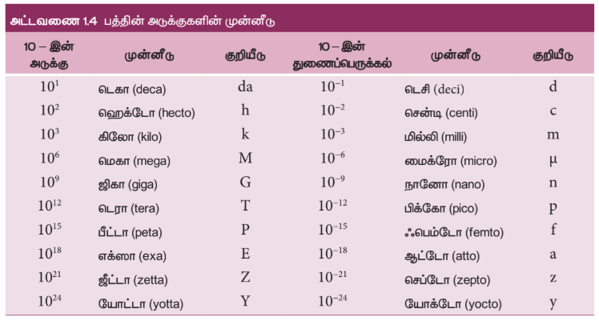
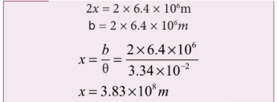
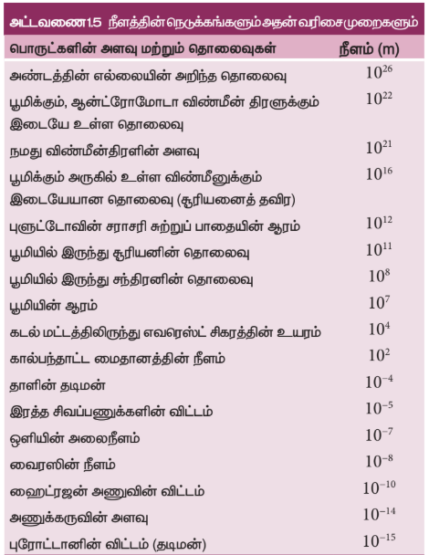
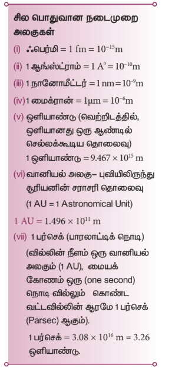
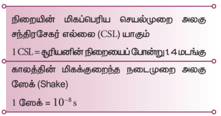
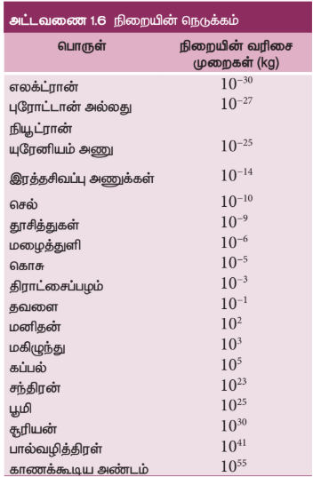
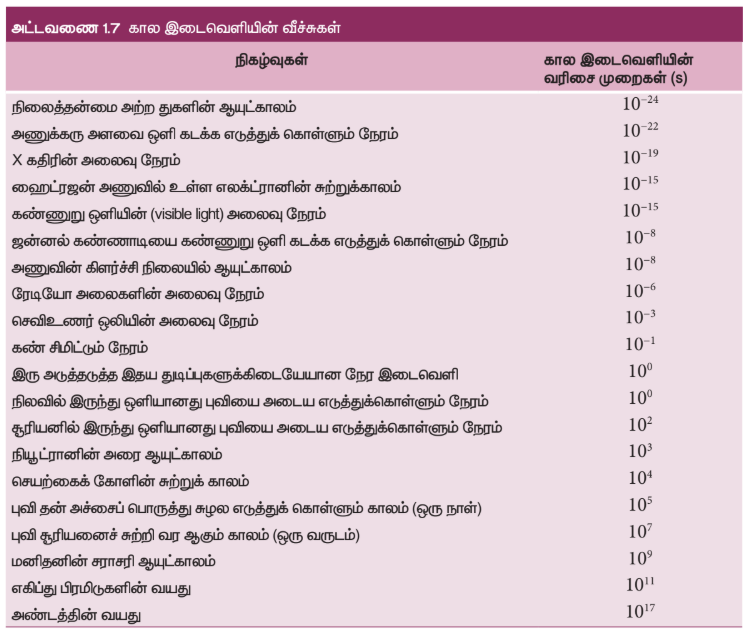
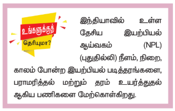

### 1.5 அடிப்படை அளவுகளின் அளவீட்டியல்

#### 1.5.1 நீளத்தை அளந்தறிதல்

இயற்பியலில் நீளத்தைப்பற்றிய கருத்து என்பது, அன்றாட வாழ்வில் தொலைவைப் பற்றிய கருத்தாகும். வெளியில் (Space) இரு புள்ளிகளுக்கு இடையே உள்ள தொலைவே நீளம் என வரையறுக்கப்படுகின்றது. நீளத்தின் SI அலகு மீட்டர் ஆகும்.

பொருட்களின் அளவுகள் நாம் வியக்கும் அளவிற்கு வேறுபடுகின்றன. எடுத்துக்காட்டாக, மிகப்பெரிய தொலைவுகளில் அமைந்த மிகப்பெரிய பொருட்களான விண்மீன் திரள்கள், விண்மீன்கள், சூரியன், புவி, சந்திரன் போன்றவை, பேரண்டத்தை (Macrocosm) உருவாக்குகின்றன. இது மிகப்பெரிய பொருட்களையும் நீண்ட தொலைவுகளையும் உடைய பெரிய உலகத்தைக் குறிக்கிறது.

இதற்கு மாறாக மூலக்கூறுகள், அணுக்கள், புரோட்டான்கள், நியூட்ரான்கள், எலக்ட்ரான்கள், பாக்டீரியா போன்ற பொருட்களும் அவற்றின் இடையேயான தொலைவுகளும் நுண் உலகத்தை (Microcosm) உருவாக்குகின்றன. இது மீச்சிறு பொருட்களும், மிகச்சிறிய தொலைவுகளும் உடைய நுண் உலகத்தைக் குறிக்கிறது.

$10^{-5}$ m முதல் $10^{2}$ m வரையிலான தொலைவுகளை நேரடி முறையில் அளக்க முடியும். எடுத்துக்காட்டாக, ஒரு மீட்டர் அளவுகோலைக்கொண்டு $10^{-3}$ m முதல் 1 m வரையிலான தொலைவை அளக்க முடியும், வெர்னியர் அளவி (vernier caliper) கொண்டு $10^{-4}$ m வரையிலான தொலைவையும், திருகு அளவி (screw gauge) கொண்டு $10^{-5}$ m வரையிலான தொலைவையும் அளக்க முடியும்.

அணு மற்றும் வானியல் தொலைவுகளை மேற்கூறிய எந்த ஒரு நேரடியான முறையிலும் அளக்க இயலாது. எனவே, மிகச் சிறிய மற்றும் நீண்ட தொலைவுகளை அளக்க சில மாற்று முறைகள் உருவாக்கப்பட்டு பயன்படுத்தப்படுகின்றன. அட்டவணை 1.4 இல் 10 இன் அடுக்குகள் (நேர்மறை மற்றும் எதிர்மறை) அட்டவணைப்படுத்தப்பட்டுள்ளன.

> **உங்களுக்கு தெரியுமா?**
>
> துணை அளவுகளான தளக்கோணம் மற்றும் திண்மக்கோணம் ஆகியவை வழிமுறை அளவுகளாக 1995 ஆம் ஆண்டு (GCWM) மாற்றப்பட்டது.

**(i) சிறிய தொலைவுகளை அளவிடுதல் (திருகு அளவி மற்றும் வெர்னியர் அளவி)**

**திருகு அளவி**

திருகு அளவியானது 50 mm வரையிலான பொருட்களின் பரிமாணங்களை மிகத் துல்லியமாக அளவிடப் பயன்படும் கருவியாகும். இக்கருவியின் தத்துவம் திருகின் வட்ட இயக்கத்தைப் பயன்படுத்தி பெரிதாக்கப்பட்ட நேர்க்கோட்டு இயக்கமாகும். திருகு அளவியின் மீச்சிற்றளவு 0.01 mm ஆகும்.

**வெர்னியர் அளவி**

துளையின் ஆழம் அல்லது துளையின் விட்டம் போன்ற அளவீடுகளை அளக்கப் பயன்படும் பன்முகத்தன்மை (Versatile) கொண்ட கருவி வெர்னியர் அளவி ஆகும். வெர்னியர் அளவியின் மீச்சிற்றளவு 0.01 cm (பொதுவாக) ஆகும்.

**(ii) நீண்ட தொலைவுகளை அளக்கும்**

மரத்தின் உயரம், புவியிலிருந்து சந்திரன் அல்லது கோள்களின் தூரம் போன்ற நீண்ட தொலைவுகளை அளக்க சில சிறப்பு முறைகளைப் பயன்படுத்துகின்றோம். முக்கோண முறை (Triangulation method), இடமாறு தோற்றமுறை (Parallax method) மற்றும் ரேடார் துடிப்பு முறை (Radar method) ஆகிய முறைகளைப் பயன்படுத்தி மிக நீண்ட தொலைவுகளை அளவிடலாம்.

**முக்கோண முறையின் மூலம் ஒரு பொருளின் உயரத்தை அளவிடுதல்**

AB = h என்பது அளக்க வேண்டிய மரத்தின் உயரம் அல்லது கோபுரத்தின் உயரம் என்க. B யிலிருந்து x தொலைவில் உள்ள C என்ற இடத்தில் உற்றுநோக்குபவர் இருப்பதாகக் கொள்ளவும். C-லிருந்து வீசும் அளப்பவர் (Range finder) A-வுடன் ஏற்படுத்தும் ஏற்றக்கோணம் ∠ACB = θ (படம் 1.3) என்க. செங்கோண முக்கோணம் ABC –யிலிருந்து

$\tan \theta = \frac{AB}{BC} = \frac{h}{x}$

அல்லது உயரம் $h = x \tan \theta$

தொலைவு $x$ ஐ அறிந்திருந்தால், உயரம் $h$ ஐப் பெறலாம்.

**எடுத்துக்காட்டு 1.1**

தரையில் ஒரு புள்ளியிலிருந்து ஒரு மரத்தின் உச்சியானது 60° ஏற்றக் கோணத்தில் தோன்றுகிறது. மரத்திற்கும் அப்புள்ளிக்கும் இடைப்பட்ட தூரம் 50 m எனில் மரத்தின் உயரத்தைக் காண்க.

**தீர்வு**

கோணம் $\theta = 60^\circ$

மரத்திற்கும் புள்ளிக்கும் இடையேயான தொலைவு $x = 50 \, m$

மரத்தின் உயரம் $h = ?$

முக்கோண முறைப்படி $\tan \theta = \frac{h}{x}$

$h = x \tan \theta$

$h = 50 \times \tan 60^\circ$

$= 50 \times 1.732$

$\therefore$ மரத்தின் உயரம் $h = 86.6 \, m$

**இடமாறு தோற்ற முறை**

மிக நீண்ட தொலைவுகளை அதாவது புவியிலிருந்து மற்றொரு கோளுக்கும் அல்லது விண்மீனுக்கும் இடையேயான தொலைவை இடமாறு தோற்ற முறையின் மூலம் அளவிடலாம்.

இரு வெவ்வெறு இடத்திலிருந்து ஒரு பொருளை பார்க்கும் பொழுது, பொருளின் பின்புலத்தைப் பொறுத்து அதன் நிலையில் (position) மாற்றம் ஏற்படுவதன் அடிப்படையில் அளக்கப்படுவதால் இது இடமாறு தோற்றமுறை என வழங்கப்பட்டது.

இரு இடத்திற்கு (அதாவது உற்றுநோக்கிடும் புள்ளிகள்) இடையேயான தொலைவு அடிப்பகுதி
(basis) ஆகும்.

படம் 1.4 இல் காட்டியுள்ளவாறு, O என்ற புள்ளியிலுள்ள ஏதேனும் ஒரு பொருளைக் கருதுக. அப்பொருளை உற்று நோக்குபவரின் இடது மற்றும் வலது கண்களின் நிலையை முறையே L மற்றும் R என்க. O புள்ளியிலுள்ள பொருளை தனது வலது கண்ணை மூடிய நிலையில் இடது கண்ணையும், பொருளையும் இணைத்தும் நேர்க்கோடு LO என்க.இதேபோன்று இடது கண்ணை மூடிக்கொண்டு வலது கண்ணால் பொருளை பார்க்கும்போது, வலதுகண்ணையும் பொருளையும் இணைக்கும் நேர்க்கோடு RO என்க. இவ்விரண்டு நேர்க்கோடுகளும் O புள்ளியோடு ஏற்படுத்தும் கோணம் θ விற்கு, இடமாறு தோற்றக்கோணம் என்று பெயர்.

OL, OR இவ்விரண்டையும் x ஆரமுடைய ஒரு வட்டத்தின் ஆரமாகவும், LR = b அவ்வட்டத்தின் வில்லின் நீளம் (அடிப்பரப்பு) எனவும் கருதுக.

$OL = OR = x$

$LR = b$ எனும் போது $\theta = \frac{b}{x}$

$b$ மற்றும் $\theta$ வின் மதிப்புகள் தெரிந்தால், $x$ இன் மதிப்பைக் கண்டறியலாம். இம்மதிப்பு நோக்குபவர் உள்ள இடத்திலிருந்து பொருள் இருக்கும் இடம்வரை உள்ள தொலைவின் தோராய மதிப்பினைக் கொடுக்கும்.

நிலவு அல்லது அருகில் உள்ள ஓர் விண்மீனை நோக்குபவர் பார்க்கும்போது, நோக்குபவரில் இருந்து வான்பொருளின் தூரத்தை ஒப்பிடும்போது θ வின் மதிப்பு மிகமிகச் சிறியதாக இருக்கும். இத்தகைய நேர்வுகளில் புவிப்பரப்பிலிருந்து வான்பொருளை பார்க்கும் இரண்டு புள்ளிகளுக்கு இடையே உள்ள தொலைவு போதுமான அளவில் இருக்க வேண்டும்.

**புவியிலிருந்து நிலவின் தொலைவைக் கணக்கிடுதல் (இடமாறு தோற்றமுறை):**

படம் 1.5 இல் C என்பது புவியின் மையம். A மற்றும் B என்பது புவி மேற்பரப்பில் நேர் எதிரெதிரான பகுதிகள்.

வானியல் தொலைநோக்கியின் உதவியால் A மற்றும் B விலிருந்து அருகில் உள்ள விண்மீனுக்கும் சந்திரனுக்கும் (M) இடையேயான இடமாறு தோற்றக்கோணம் முறையே $\theta_1$ மற்றும் $\theta_2$ கண்டறியப்படுகிறது. எனவே, புவியிலிருந்து நிலவின் மொத்த இடமாறு தோற்ற கோணம்

$\angle AMB = \theta_1 + \theta_2 = \theta$

$\theta = \frac{AB}{AM}$ ; $AM \approx MC$

$\theta = \frac{AB}{MC}$ $\Rightarrow$ $MC = \frac{AB}{\theta}$ ; $AB$ மற்றும் $\theta$ மதிப்பு அறிந்திருந்தால் புவிக்கும் சந்திரனுக்கும் இடையேயான தொலைவை (MC) கணக்கிடலாம்.

**எடுத்துக்காட்டு 1.2**

புவியின் விட்டத்திற்கு சமமான அடிக்கோட்டுடன் 1°55' கோணத்தை சந்திரன் உருவாக்குகிறது எனில், புவியிலிருந்து சந்திரனின் தொலைவு என்ன? (புவியின் ஆரம் $6.4 \times 10^6$ m)

**தீர்வு**

கோணம் $\theta = 1^\circ 55' = 115'$

$= (115 \times 60)'' \times (4.85 \times 10^{-6}) \ \text{rad}$

$= 3.34 \times 10^{-2} \ \text{rad}$

$(1'' = 4.85 \times 10^{-6} \ \text{rad})$

புவியின் ஆரம் $= 6.4 \times 10^6 \ \text{m}$

புவியிலிருந்து சந்திரனின் தொலைவு $x = ?$

படம் 1.5 இலிருந்து புவியின் விட்டம் AB அதாவது

**ரேடார் துடிப்பு முறை**

ரேடார் (RADAR) என்பது Radio Detection and Ranging என்பதன் சுருக்கமாகும்.

ரேடாரைக் கொண்டு செவ்வாய் போன்ற புவிக்கு அருகில் உள்ள கோளின் தொலைவை துல்லியமாக அளவிட முடியும்.

இம்முறையில் புவிப்பரப்பிலிருந்து ரேடியோ பரப்பி (Transmitter) மூலம் ரேடியோ அலைத்துடிப்புகள் பரப்பப்பட்டு, கோளிலிருந்து எதிரொளிக்கப்பட்ட துடிப்புகள் ஏற்பி (Receiver) மூலம் உணரப்படுகிறது.

ரேடியோ அலைப்பரப்பியிலிருந்து அனுப்பப்பட்டதற்கும் ஏற்பியில் பெறப்பட்டதற்கும் இடையேயான நேர இடைவெளி $t$ எனில் கோளின் தொலைவினை கீழ்க்கண்ட தொடர்பு மூலம் பெற முடியும்.

வேகம் = $\frac{கடந்த தொலைவு}{எடுத்துக்கொண்ட நேரம்}$

தொலைவு $(d) =$ ரேடியோ அலைகளின் வேகம் × எடுத்துக்கொண்ட நேரம்.

எனவே கோளின் தொலைவு

$d = \frac{\nu \times t}{2}$

இங்கு $\nu$ என்பது ரேடியோ அலைகளின் வேகம். ரேடியோ அலைகள் சென்று வந்தடைய ஆகும் . நேரம் t. t என்பது ரேடியோ அலை முன்னோக்கிச் சென்று திரும்ப எடுத்துக்கொண்ட நேரம் என்பதால், 2-ல் வகுத்து, பொருளின் தொலைவு பெறப்படுகிறது.

இம்முறை மூலம் புவிப்பரப்பிலிருந்து ஓர் விமானம் எவ்வளவு உயரத்தில் பறந்து கொண்டிருக்கிறது என்பதையும் கண்டறியலாம்.

**எடுத்துக்காட்டு 1.3**

ஒரு கோளின் மீது ரேடார் துடிப்பினை செலுத்தி 7 நிமிடங்களுக்குப் பின் அதன் எதிரொளிக்கப்பட்ட துடிப்பு பெறப்படுகிறது. கோளுக்கும் பூமிக்கும் இடையேயான தொலைவு $6.3 \times 10^{10}$ m எனில் ரேடார் துடிப்பின் திசைவேகத்தைக் கணக்கிடுக.

**தீர்வு**

தொலைவு $d = 6.3 \times 10^{10}$ m

நேரம் $t = 7$ நிமிடம் $= 7 \times 60$ s

துடிப்பின் திசைவேகம் $v = ?$

துடிப்பின் திசைவேகம்

$v = \frac{2d}{t} = \frac{2 \times 6.3 \times 10^{10}}{7 \times 60} = 3 \times 10^8 \ \text{m s}^{-1}$

நீளத்தின்  நெடுக்கங்களும் அதன்  வரிசை முறைகளும் அட்டவணை 1.5 இல் காட்டப்பட்டுள்ளது.

### 1.5.2 நிறையை அளவிடுதல் 

நிறை என்பது பருப்பொருட்களின் அடிப்படைப் பண்பாகும். இது வெப்பநிலை, அழுத்தம், வெளியில் பொருளின் இருப்பிடம் ஆகியவற்றைச் சார்ந்திராது. ஒரு பொருளில் உள்ள பருப்பொருளின் அளவே, அப்பொருளின் நிறை என வரையறுக்கப்படுகிறது. இதன் SI அலகு கிலோ கிராம் (kg).

> **உங்களுக்குத் தெரியுமா?**
>
> நிறையை அளவிடப் பயன்படும் உருளை பிளாட்டினம் – இரிடிய உலோகக்கலவையால் உருவாக்கப்படுவதேன்?
>
> சுற்றுச்சூழலாலும், காலத்தின் மாற்றத்தினாலும் பிளாட்டினம் – இரிடியம் உருளை மிகக் குறைந்த அளவே பாதிக்கப்படும்.

நம் பாடப்பகுதியில் பயிலும் பொருட்களின் நிறைகளின் மதிப்பு பரந்த நெடுக்கம் உடையது. இது எலக்ட்ரானின் மிகச்சிறிய நிறை ($9.11 \times 10^{-31}$ kg) யிலிருந்து அண்டத்தின் மிகப்பெரிய நிறை ($10^{55}$ kg) வரை விரிந்துள்ளது.

வேறுபட்ட பொருட்களின் நிறைகளின் வகைகள் அட்டவணை 1.6 இல் காட்டப்பட்டுள்ளது.

சாதாரணமாக ஒரு பொருளின் நிறையானது மளிகைக்கடையில் பயன்படுத்தப்படும் சாதாரண தராசு மூலம் கிலோகிராமில்  கண்டறியப்படுகிறது.

கோள்கள், விண்மீன்கள் போன்ற பெரிய பொருள்களின் நிறைகளை சில ஈர்ப்பியல் முறையின் மூலம் நாம் அளவிடலாம். அணு மற்றும் அணுக்கருத் துகள் போன்ற சிறிய துகள்களின் நிறைகளை நாம் நிறை நிறமாலைவரைவியைப் (mass spectrograph) பயன்படுத்திக் கணக்கிடலாம்.

சாதாரண தராசு, சுருள்வில் தராசு, எலக்ட்ரானியல் தராசு போன்ற சில தராசுகள் பொதுவாக நிறையினைக் கண்டறியப் பயன்படும் தராசுகள் ஆகும்.

### 1.5.3 காலத்தை அளவிடுதல்

"காலம் சீராக முன்னோக்கி செல்கின்றது" – சர் ஐசக் நியூட்டன்

"கடிகாரம் காட்டுவதே காலம்" – ஆல்பர்ட் ஐன்ஸ்டீன்

கால இடைவெளியை அளக்க கடிகாரம் பயன்படுகின்றது. அணுவியல் கால படித்தரம் , சீசியம் அணு உருவாக்கும் சீரான அதிர்வுகளின் அடிப்படையிலானது.

மின் அலையியற்றி, மின்னணு அலையியற்றி,சூரியமின்கலக் கடிகாரம், குவார்ட்ஸ் படிக கடிகாரம், அணுக்கடிகாரம், அடிப்படைத் துகள்களின் சிதைவுறு காலம், கதிரியக்க வயதுக் கணிப்பு போன்றவை தற்பொழுது உருவாக்கப்பட்ட சில கடிகாரங்களாகும்.

கால இடைவெளியின் வரிசை (order) முறைகள் அட்டவணை 1.7 இல் பட்டியலிடப்பட்டுள்ளன.

