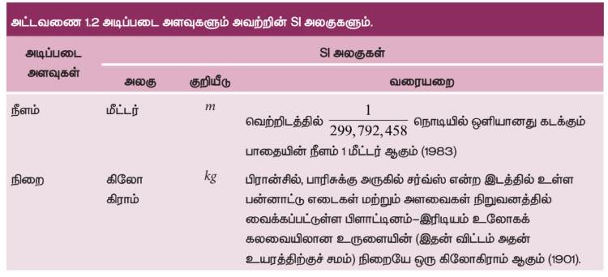
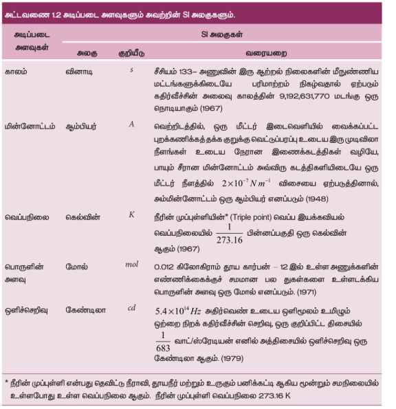
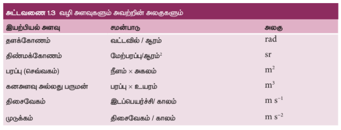
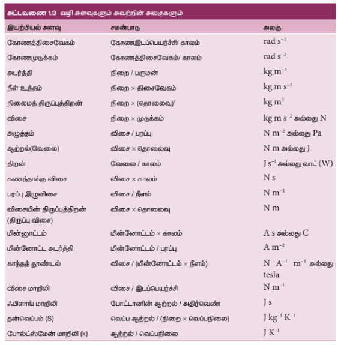
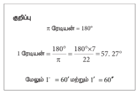
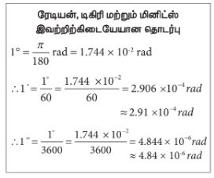

### 1.4 அளவீட்டியல்

"நீங்கள் எதைப்பற்றி பேசுகிறீர்களோ, அதனை அளவீடு செய்து பின்பு அதனை எண்களால் வெளிப்படுத்த முடியும் என்றால் மட்டுமே உங்களுக்கு அதனைப் பற்றி ஓரளவாவது தெரிந்துள்ளது எனலாம். ஆனால் எண்கள் மூலம்  அதனை விளக்க முடியாது எனில், உங்களுக்கு
மிகக்குறைவான மற்றும் போதுமற்றதான அளவே அதனைப் பற்றிய அறிவு உள்ளது " – லார்டு கெல்வின்.

அளவீட்டியல் என்பது எந்த ஒரு இயற்பியல் அளவையும் அதன் படித்தர அளவுடன் ஒப்பிடுவது ஆகும். அனைத்து அறிவியல் ஆராய்ச்சிகளுக்கும், சோதனைகளுக்கும் அடிப்படை அளவீட்டியலாகும். இது நம் அன்றாட வாழ்வில் முக்கியப் பங்கு வகிக்கின்றது. இயற்பியல் என்பது அளந்தறியும் அறிவியலாகும். இயற்பியல் அளவீடுகளை குறிப்பிடக்கூடிய எண்களையே இயற்பியலாளர்கள் எப்பொழுதும் கையாள்கின்றனர்.

#### 1.4.1 இயற்பியல் அளவின் வரையறை

அளவிடப்படக்கூடியது, அதன் மூலம் இயற்பியல் விதிகளை விவரிக்கத் தக்கதுமான அளவுகள் இயற்பியல் அளவுகள் எனப்படுகின்றன. எடுத்துக்காட்டு நீளம், நிறை, காலம், விசை, ஆற்றல் மற்றும் பல.

#### 1.4.2 இயற்பியல் அளவுகளின் வகைகள்

இயற்பியல் அளவுகள் இரு வகைப்படும். ஒன்று அடிப்படை அளவுகள், மற்றொன்று வழி அளவுகள்.

வேறு எந்த இயற்பியல் அளவுகளாலும் குறிப்பிடப்பட இயலாத அளவுகள் அடிப்படை அளவுகள் எனப்படும். அவை நீளம், நிறை, காலம், மின்னோட்டம், வெப்பநிலை, ஒளிச்செறிவு மற்றும் பொருளின் அளவு (amount of a substance) ஆகும்.

அடிப்படை அளவுகளால் குறிப்பிடக்கூடிய அளவுகள், வழி அளவுகள் எனப்படும். எடுத்துக்காட்டு, பரப்பு, கனஅளவு, திசை வேகம், முடுக்கம், விசை மற்றும் பல.

#### 1.4.3 அலகின் வரையறை மற்றும் அதன் வகைகள்

அளவீட்டு முறை என்பது அடிப்படையில் ஓர் ஒப்பீட்டு முறையே ஆகும். அளவு ஒன்றை அளந்தறிய, நாம் எப்பொழுதும் அதனை ஒரு படித்தர அளவுடன் ஒப்பிடுகிறோம்.

எடுத்துக்காட்டாக, கயிறு ஒன்றின் நீளம் 10 மீட்டர் என்பது, 1 மீட்டர் நீளம் என வரையறுக்கப்பட்ட ஒரு பொருளின் நீளத்தைப் போல் 10 மடங்கு நீளமுள்ளது என்பதாகும். இங்கு மீட்டர் என்பதே நீளத்தின் படித்தர அளவாகும். இந்த படித்தர அளவே அலகு என்றழைக்கப்படுகிறது.

உலகளவில் ஏற்றுக்கொள்ளப்பட்ட, தனித்துவமிக்க தெரிவு செய்யப்பட்ட ஓர் அளவின் படித்தர அளவே அலகு என வரையறுக்கப்படுகிறது.

அடிப்படை அளவுகளை அளந்தறியும் அலகுகள் அடிப்படை அலகுகள் எனவும், மற்ற இயற்பியல் அளவுகளை அளவிடுவதற்காக அடிப்படை அலகுகளின் அடுக்குகளின் தகுந்த,பெருக்கல் அல்லது வகுத்தல்களின் மூலம் பெறப்படும் அலகுகள், வழி அலகுகள் எனவும் அழைக்கப்படுகின்றன.

#### 1.4.4 பல்வேறு அளவிடும் முறைகள்

அனைத்து விதமான அடிப்படை மற்றும் வழி அளவுகளை அளக்கப் பயன்படும் அலகுகளின் ஒரு முழுமையான தொகுப்பே அலகிடும் முறையாகும்.

எந்திரவியலில் பயன்படும் பொதுவான அலகு முறைகள் கீழே தரப்பட்டுள்ளன.

**(அ) f.p.s அலகு முறை**

f.p.s அலகு முறை ஓர் பிரிட்டிஷ் அலகு முறையாகும். இம்முறையில் நீளம், நிறை மற்றும் காலத்தை அளக்க முறையே அடி (Foot), பவுண்ட் (Pound), வினாடி (Second) ஆகிய மூன்று அடிப்படை அலகுகள் பயன்படுத்தப்படுகின்றன.

**(ஆ) c.g.s அலகு முறை**

இது ஓர் காஸ்ஸியன் (Gaussian) முறையாகும். இம்முறையில் நீளம், நிறை மற்றும் காலத்தை அளக்க முறையே சென்டிமீட்டர், கிராம் மற்றும் வினாடி ஆகிய மூன்று அடிப்படை அலகுகள் பயன்படுத்தப்படுகின்றன.

**(இ) m.k.s முறை**

இம்முறையில் நீளம், நிறை மற்றும் காலத்தை அளக்க முறையே மீட்டர், கிலோகிராம் மற்றும் வினாடி ஆகிய மூன்று அடிப்படை அலகுகள் பயன்படுத்தப்படுகின்றன.

> **உங்களுக்கு தெரியுமா?**
>
> cgs, mks மற்றும் SI அலகு முறைகள் மெட்ரிக் அல்லது தசம அலகு முறையாகும். ஆனால் fps அலகு முறை மெட்ரிக் அலகு முறை அல்ல.

#### 1.4.5 SI அலகு முறை

அறிவியல் அறிஞர்கள் மற்றும் பொறியியல் வல்லுனர்களால் உலகம் முழுவதும் பயன்படுத்தப்பட்ட அலகு முறை மெட்ரிக் முறை (Metric System) என அழைக்கப்பட்டது. 1960 க்கு பிறகு இது பன்னாட்டு அலகு முறை அல்லது SI அலகு முறையாக (Systeme International – French name) அனைவராலும் ஏற்றுக்கொள்ளப்பட்டது. உலகளாவிய அறிவியல், தொழில்நுட்பம், தொழில் துறை மற்றும் வணிகப் பயன்பாட்டிற்காக, 1971 இல் நடைபெற்ற எடைகள் மற்றும் அளவீடுகள் பொதுமாநாட்டில் SI அலகு முறையின் நிலையான திட்டக் குறியீடுகள், அலகுகள் மற்றும் சுருக்கக்குறியீடுகள் உருவாக்கப்பட்டு அனைவராலும் ஏற்றுக்கொள்ளப்பட்டன.

**SI அலகு முறையின் சிறப்பியல்புகளைக் காண்போம்.**

i. இம்முறையில் ஒரு இயற்பியல் அளவிற்கு ஒரே ஒரு அலகு மட்டுமே பயன்படுத்தப்படுகிறது. அதாவது இம்முறை ஒரு பங்கீட்டு, பகுத்தறிவுக்கிசைந்த (rational method) முறையாகும்.

ii. இம்முறையில் அனைத்து வழி அலகுகளும், அடிப்படை அலகுகளில் இருந்து எளிதாக தருவிக்கப்படுகின்றன. எனவே, இது ஓர் ஓரியல் (coherent) அலகு முறையாகும்.

iii. இது ஒரு மெட்ரிக் அலகு முறையாதலால் பெருக்கல் மற்றும் துணைப்பெருக்கல் ஆகியன 10 இன்
மடங்குகளாக நேரடியாக தரப்படுகின்றன.

SI அலகு முறையின் ஏழு அடிப்படை அளவுகளும்
அட்டவணை 1.2 இல் தொகுக்கப்பட்டுள்ளன.

