---
நாம் ஒலி மற்றும் ஒளி அலைகளால் மெதுவாக்கப்படுகிறோம், அண்டத்துடன் இசைக்கப்படும் அதிர்வெண்களின் ஒரு நடை மூட்டை. நாம் புனிதமான உயிர்வேதியியல் ஆடைகளை அணிந்த ஆன்மாக்கள், மேலும் நம் உடல்கள் நம் ஆன்மாக்கள் தங்கள் இசையை வாசிக்கும் கருவிகள் – ஆல்பர்ட் ஐன்ஸ்டீன்

---

---
#### கற்றல் நோக்கங்கள்

இந்த அலகில், மாணவர் பின்வரும் கருத்துகளை அறிந்துகொள்வார்

- அலைகள் மற்றும் அவற்றின் வகைகள் (குறுக்கு அலைகள் மற்றும் நெட்டாங்கு அலைகள்)
- அலைநீளம், அதிர்வெண், கால அளவு போன்ற அடிப்படைச் சொற்கள்
- குறுக்கு அலைகள் மற்றும் நெட்டாங்கு அலைகளின் திசைவேகம்
- ஒலி அலைகளின் திசைவேகம்
- தள மற்றும் வளைந்த மேற்பரப்புகளிலிருந்து ஒலி அலைகளின் எதிரொளிப்பு
- முற்போக்கு அலைகள் மற்றும் அவற்றின் வரைகலை விளக்கங்கள்
- மேற்பொருட்கோள் கொள்கை, அலைகளின் குறுக்கீடு
- நிலையான அலைகளின் பண்புகள், சோனோமீட்டர்
- அடிப்படை அதிர்வெண், இசைவங்கள் மற்றும் மேலிசைகள்
- செறிவு மற்றும் உரத்தன்மை
- காற்றுத் தூணின் அதிர்வு - மூடிய உறுப்புக்குழாய், திறந்த உறுப்புக்குழாய்
- டாப்ளர் விளைவு மற்றும் அதன் பயன்பாடுகள்
---

## அறிமுகம்

முந்தைய அத்தியாயத்தில், ஒரு துகளின் அலைவு பற்றி விவாதித்தோம். துகள்களின் தொகுப்பைக் கொண்ட ஒரு ஊடகத்தைக் கவனியுங்கள். ஒரு முனையில் கிளர்ச்சி உருவாக்கப்பட்டால், அது பரவி மறுமுனையை அடைகிறது. அதாவது, முதல் நிறைப் புள்ளியில் உருவாக்கப்படும் கிளர்ச்சி, அடுத்த அண்டை நிறைப் புள்ளிக்கு அனுப்பப்படுகிறது, மற்றும் பல. இங்கு, கிளர்ச்சி மட்டுமே அனுப்பப்படுகிறது, நிறைப் புள்ளிகள் அல்ல என்பதைக் கவனியுங்கள். இதேபோல், நாம் பேசும் பேச்சு நம் தொண்டைக்குள் உள்ள குரல் நாண்களின் அதிர்வின் காரணமாகும். இது சுற்றியுள்ள காற்று மூலக்கூறுகளின் அதிர்வுக்கு வழிவகுக்கிறது, எனவே பேச்சின் விளைவு (தகவல்) விண்வெளியில் ஒரு புள்ளியிலிருந்து மற்றொரு புள்ளிக்கு, ஊடகம் துகள்களைக் கொண்டு செல்லாமல் அனுப்பப்படுகிறது. எனவே, ஊடகத்தின் பரிமாற்றம் இல்லாமல், விண்வெளியில் ஒரு புள்ளியிலிருந்து மற்றொரு புள்ளிக்கு ஆற்றலையும் உந்தத்தையும் கொண்டு செல்லும் கிளர்ச்சி ஒரு அலை என அழைக்கப்படுகிறது.

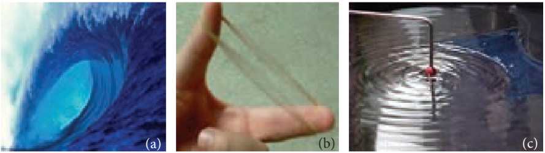

கடற்கரையில் நிற்கும் போது, கடலில் உள்ள அலைகள் ஒரே மாதிரியான அலைவடிவத்துடன் கடற்கரையை அடைவதை ஒருவர் அவதானிக்கலாம்; எனவே அவை கடல் அலைகள் என்று அழைக்கப்படுகின்றன. ஒரு ரப்பர் பேண்டைப் பறிக்கும்போது, அது ஒரு அலையைப் போல அதிர்கிறது, இது ஒரு நிலையான அலைக்கு ஒரு எடுத்துக்காட்டு. இவை படம் 11.2 இல் காட்டப்பட்டுள்ளன. அலைகளின் பிற எடுத்துக்காட்டுகள் ஒளி அலைகள் (மின்காந்த அலைகள்), இதன் மூலம் நாம் இயற்கையின் அழகைக் கண்டு ரசிக்கிறோம், மற்றும் ஒலி அலைகள், இதன் மூலம் நாம் இனிமையான மெல்லிசைப் பாடல்களைக் கேட்டு மகிழ்கிறோம். அலைகளின் அன்றாடப் பயன்பாடுகள் ஏராளமானவை, எடுத்துக்காட்டாக, கைப்பேசித் தொடர்பு, லேசர் அறுவை சிகிச்சை போன்றவை.

### நீர் மேற்பரப்பில் அலைத்துளிகள் மற்றும் அலை உருவாக்கம்


ஒரு தொட்டியில் நிலையான நீரில் ஒரு கல்லை வீசினால், கல் நீர் மேற்பரப்பில் மோதும் இடத்தில் ஒரு கிளர்ச்சி உருவாகுவதைக் காணலாம், படம் 11.3 இல் காட்டப்பட்டுள்ளது. இந்த கிளர்ச்சி எப்போதும் அதிகரிக்கும் ஆரங்களின் செறிவூட்டப்பட்ட வட்டங்களின் வடிவத்தில் பரவி (விரிந்து) தொட்டியின் எல்லையைத் தாக்குவதைக் காண்கிறோம். ஏனெனில் கல்லின் இயக்க ஆற்றலில் சில மேற்பரப்பில் உள்ள நீர் மூலக்கூறுகளுக்கு அனுப்பப்படுகின்றன. உண்மையில், நீரின் (ஊடகத்தின்) துகள்கள் கிளர்ச்சியுடன் வெளிப்புறமாக நகருவதில்லை. நீர் மேற்பரப்பில் ஒரு காகிதத் துண்டை வைத்திருப்பதன் மூலம் இதை அவதானிக்கலாம். நீர் மேற்பரப்பில் கிளர்ச்சி (அலை) செல்லும்போது துண்டு மேலும் கீழும் நகரும். நீர் மூலக்கூறுகள் அவற்றின் சராசரி நிலைகளைப் பற்றி மட்டுமே அதிர்வு இயக்கத்திற்கு உட்படுகின்றன என்பதை இது காட்டுகிறது.

### நீட்டப்பட்ட சரத்தில் அலைகள் உருவாக்கம்

ஒரு நீண்ட கயிற்றை எடுத்து, அதன் ஒரு முனையை சுவரில் கட்டுவோம், படம் 11.4 (a) இல் காட்டப்பட்டுள்ளது. விரைவான இழுப்பைக் கொடுத்தால், கயிற்றில் ஒரு முட்டு (துடிப்பு போன்றது) உருவாகிறது, படம் 11.4 (b) இல் காட்டப்பட்டுள்ளது. இத்தகைய கிளர்ச்சி திடீரென்று ஏற்படுகிறது, மேலும் இது ஒரு குறுகிய காலத்திற்கு நீடிக்கும், எனவே இது ஒரு அலைத் துடிப்பு என அழைக்கப்படுகிறது. தொடர்ந்து இழுப்புகள் கொடுக்கப்பட்டால், உருவாக்கப்படும் அலைகள் நிலையான அலைகளாகும். கிட்டாரில் ஒரு சரத்தைப் பறிப்பதன் மூலம் இதே போன்ற அலைகள் உருவாக்கப்படுகின்றன.

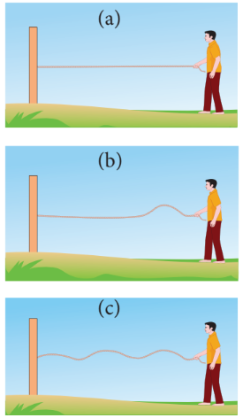

### ஒரு இசைக் கவரில் அலைகள் உருவாக்கம்

ஒரு இசைக் கவரை ரப்பர் பட்டையில் அடிக்கும்போது, இசைக் கவரின் முட்கள் அவற்றின் சராசரி நிலைகளைப் பற்றி அதிர்கின்றன. சராசரி நிலையில் இருந்து அதிரும் முள் வெளிப்புறமாகவும் உள்நோக்கியும் நகர்வதைக் குறிக்கிறது, படம் 11.5 இல் காட்டப்பட்டுள்ளது. ஒரு முள் வெளிப்புறமாக நகரும்போது, அது அதன் அண்டைப் பகுதியில் உள்ள காற்றின் அடுக்கைத் தள்ளுகிறது, அதாவது இந்தப் பகுதியில் காற்று மூலக்கூறுகள் அதிகமாகக் குவிந்துள்ளன. எனவே, அடர்த்தியும், அழுத்தமும் அதிகரிக்கின்றன. இந்தப் பகுதிகள் அமுக்கப் பகுதிகள் அல்லது அமுக்கங்கள் என அழைக்கப்படுகின்றன. இந்த அமுக்கப்பட்ட காற்று அடுக்கு முன்னோக்கி நகர்ந்து, அடுத்த அண்டை அடுக்கை இதே முறையில் அழுத்துகிறது. இவ்வாறு, ஒரு அமுக்க அலை காற்றில் முன்னேறுகிறது அல்லது கடந்து செல்கிறது. முள் உள்நோக்கி நகரும்போது, ஊடகத்தின் துகள்கள் வலப்புறம் நகர்த்தப்படுகின்றன. இந்தப் பகுதியில் அடர்த்தியும் அழுத்தமும் குறைவாக இருக்கும். இது ஒரு பகுதி விரிவு அல்லது நீட்சி என அழைக்கப்படுகிறது.


### அலை இயக்கத்தின் பண்புகள்

- அலைகள் பரவுவதற்கு, ஊடகம் நிலைமத்தையும் மீள்சக்தியையும் கொண்டிருக்க வேண்டும், இவை அந்த ஊடகத்தில் அலையின் திசைவேகத்தைத் தீர்மானிக்கின்றன.
- ஒரு குறிப்பிட்ட ஊடகத்தில், அலையின் திசைவேகம் ஒரு மாறிலியாகும், அதேசமயம் அந்த ஊடகத்தில் உள்ள உட்பொருள் துகள்கள் வெவ்வேறு நிலைகளில் வெவ்வேறு திசைவேகங்களுடன் நகரும். திசைவேகம் அவற்றின் சராசரி நிலையில் அதிகபட்சமாகவும், உச்ச நிலைகளில் பூஜ்ஜியமாகவும் இருக்கும்.
- அலைகள் எதிரொளிப்பு, ஒளிவிலகல், குறுக்கீடு, விளிம்பு விலகல் மற்றும் முனைவாக்கம் ஆகியவற்றிற்கு உட்படுகின்றன.

| சிந்திக்க வேண்டிய புள்ளி |
|------|
| அலைகள் பரவுவதற்கு ஊடகம் நிலைமத்தையும் மீள்சக்தியையும் கொண்டிருக்கிறது. |
| ஒளி ஒரு மின்காந்த அலை. அதன் பரவலுக்கான ஊடகம் எது? |

### இயந்திர அலை இயக்கம் மற்றும் அதன் வகைகள்

அலை இயக்கத்தை இரண்டு வகைகளாகப் பிரிக்கலாம்

a. **இயந்திர அலை** – பரவுவதற்கு ஒரு ஊடகம் தேவைப்படும் அலைகள் இயந்திர அலைகள் என அழைக்கப்படுகின்றன.

**எடுத்துக்காட்டுகள்:** ஒலி அலைகள், நீர் மேற்பரப்பில் உருவாக்கப்படும் அலைத்துளிகள், போன்றவை.

b. **இயந்திரமற்ற அலை** – பரவுவதற்கு எந்த ஊடகமும் தேவைப்படாத அலைகள் இயந்திரமற்ற அலைகள் என அழைக்கப்படுகின்றன.

**எடுத்துக்காட்டு:** ஒளி அலைகள், அகச்சிவப்பு கதிர்கள் போன்றவை.

மேலும், அலைகளை இரண்டு வகைகளாகப் பிரிக்கலாம்

a. குறுக்கு அலைகள்
b. நெட்டாங்கு அலைகள்

### குறுக்கு அலை இயக்கம்

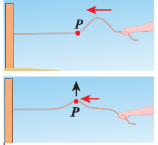

குறுக்கு அலை இயக்கத்தில், ஊடகத்தின் உட்பொருள்கள் அவற்றின் சராசரி நிலைகளைப் பற்றி, அலைகளின் பரவல் திசைக்கு (ஆற்றல் பரிமாற்றத்தின் திசை) செங்குத்தாக ஒரு திசையில் அலைவுறுகின்றன அல்லது அதிர்கின்றன, படம் 11.6 இல் காட்டப்பட்டுள்ளது.

**எடுத்துக்காட்டு:** ஒளி (மின்காந்த அலைகள்)

### நெட்டாங்கு அலை இயக்கம்

நெட்டாங்கு அலை இயக்கத்தில், ஊடகத்தின் உட்பொருள்கள் அவற்றின் சராசரி நிலைகளைப் பற்றி, அலைகளின் பரவல் திசைக்கு (ஆற்றல் பரிமாற்றத்தின் திசை) இணையான ஒரு திசையில் அலைவுறுகின்றன அல்லது அதிர்கின்றன, படம் 11.7 இல் காட்டப்பட்டுள்ளது.

**எடுத்துக்காட்டு:** காற்றில் பயணிக்கும் ஒலி அலைகள்.

---
**உங்கள் ஆசிரியருடன் விவாதிக்கவும்**
- சுனாமி (ஜப்பானிய மொழியில் soo-nah-mee என உச்சரிக்கப்படுகிறது) என்றால் துறைமுக அலைகள் என்று அர்த்தம்.
- சுனாமி என்பது மிகுந்த வேகத்திலும் மிகப்பெரிய விசையுடனும் வரும் ஒரு தொடர் பெரும் அலைகளாகும். டிசம்பர் 26, 2004 அன்று இந்தியாவின் தென் பகுதியில் என்ன நடந்தது? - விவாதிக்கவும்.
- ஈர்ப்பு அலைகள் மற்றும் LIGO (லேசர் இன்டர்ஃபெரோமீட்டர் ஈர்ப்பு அலை ஆய்வகம்) சோதனை.
- இயற்பியலுக்கான 2017 நோபல் பரிசு வென்றவர்கள் பேராசிரியர் ரெய்னர் வெய்ஸ், பேராசிரியர் பாரி சி. பாரிஷ் மற்றும் பேராசிரியர் கிப் எஸ். தோர்ன் ஆகியோருக்கு LIGO கண்டறிவான் மற்றும் ஈர்ப்பு அலைகளைக் கண்டறிவதற்கான தீர்க்கமான பங்களிப்புகளுக்காக வழங்கப்பட்டது.

---


**அட்டவணை 11.1: குறுக்கு மற்றும் நெட்டாங்கு அலைகளின் ஒப்பீடு**
|S. No|குறுக்கு அலைகள்|நெட்டாங்கு அலைகள்|
|---|---|---|
|1.|ஊடகத்தின் துகள்களின் அதிர்வின் திசையானது அலைகளின் பரவல் திசைக்கு செங்குத்தாகும்.|ஊடகத்தின் துகள்களின் அதிர்வின் திசையானது அலைகளின் பரவல் திசைக்கு இணையாகும்.|
|2.|கிளர்ச்சிகள் முகடுகள் மற்றும் அகழிகளின் வடிவத்தில் உள்ளன.|கிளர்ச்சிகள் அமுக்கங்கள் மற்றும் பகுதி விரிவுகளின் வடிவத்தில் உள்ளன.|
|3.|குறுக்கு அலைகள் மீள் ஊடகத்தில் சாத்தியமாகும்.|நெட்டாங்கு அலைகள் அனைத்து வகையான ஊடகங்களிலும் (திட, திரவ மற்றும் வாயு) சாத்தியமாகும்.|

**குறிப்பு:**

1. ஊடகம் இல்லாதது வெற்றிடம் என்றும் அழைக்கப்படுகிறது. மின்காந்த அலைகள் மட்டுமே வெற்றிடத்தின் வழியாகப் பயணிக்க முடியும்.
2. ரேலே அலைகள் குறுக்கு மற்றும் நெட்டாங்கு ஆகியவற்றின் கலவையாகக் கருதப்படுகின்றன.

## அலை இயக்கத்தில் பயன்படுத்தப்படும் சொற்கள் மற்றும் வரையறைகள்

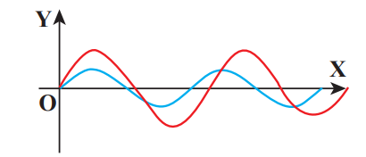

படம் 11.8 இல் காட்டப்பட்டுள்ளபடி நமக்கு இரண்டு அலைகள் உள்ளன என்று வைத்துக்கொள்வோம். இந்த இரண்டு அலைகளும் ஒரே மாதிரியானவையா? இல்லை. இந்த இரண்டு அலைகளும் சைனூசாய்டல் வடிவில் இருந்தாலும், அவற்றுக்கிடையே பல வேறுபாடுகள் உள்ளன. எனவே, ஒரு அலையை மற்றொன்றிலிருந்து வேறுபடுத்துவதற்கு சில அடிப்படை சொற்களை வரையறுக்க வேண்டும்.

படம் 11.9 இல் காட்டப்பட்டுள்ளபடி, நீட்டப்பட்ட சரத்தில் உருவாக்கப்பட்ட அலையைக் கவனியுங்கள்.


உருவாக்கப்பட்ட அலைகளின் எண்ணிக்கையை எண்ணுவதில் நாம் ஆர்வமாக இருந்தால், படம் 11.9 இல் காட்டப்பட்டுள்ளபடி ஒரு குறிப்பு மட்டத்தை (சராசரி நிலை) வைப்போம். இங்கு, காட்டப்பட்டுள்ள கிடைமட்ட கோடே சராசரி நிலை. நிழலிடப்பட்ட பகுதியில் உள்ள மிக உயர்ந்த புள்ளி _முகடு_ எனப்படும். குறிப்பு மட்டத்தைப் பொறுத்து, நிழலிடப்படாத பகுதியில் உள்ள மிகக் குறைந்த புள்ளி அகழி எனப்படும். இந்த அலையில் O முதல் B வரையிலான ஒரு பகுதியின் திரும்பத் திரும்ப வருதல் உள்ளது, எனவே திரும்பத் திரும்ப இல்லாத மிகச்சிறிய பகுதியின் நீளத்தை ஒரு _அலைநீளம்_ என வரையறுக்கிறோம், படம் 11.10 இல் காட்டப்பட்டுள்ளது. படம் 11.10 இல் OB நீளம் அல்லது BD நீளம் ஒரு அலைநீளம் ஆகும். ஒரு கிரேக்க எழுத்து லாம்ப்டா λ ஒரு அலைநீளத்தைக் குறிக்கப் பயன்படுகிறது.

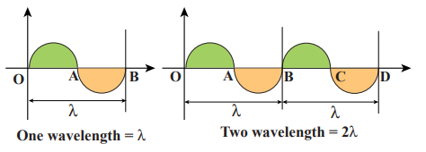

குறுக்கு அலைகளுக்கு (படம் 11.11 இல் காட்டப்பட்டுள்ளபடி), இரண்டு அண்டை முகடுகள் அல்லது அகழிகளுக்கு இடையிலான தூரம் _அலைநீளம்_ என அழைக்கப்படுகிறது. நெட்டாங்கு அலைகளுக்கு, (படம் 11.12 இல் காட்டப்பட்டுள்ளபடி) இரண்டு அண்டை அமுக்கங்கள் அல்லது பகுதி விரிவுகளுக்கு இடையிலான தூரம் அலைநீளம் என அழைக்கப்படுகிறது. அலைநீளத்தின் SI அலகு _மீட்டர்_ ஆகும்.


**எடுத்துக்காட்டு 11.1**

பின்வருவனவற்றில் எது அதிக அலைநீளத்தைக் கொண்டுள்ளது?

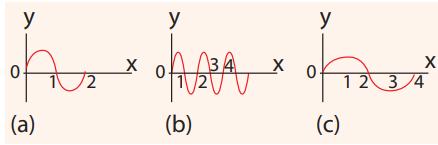

**பதில்** (c)

அதிர்வெண் மற்றும் கால அளவைப் புரிந்துகொள்ள, படம் 11.13 (a) இல் காட்டப்பட்டுள்ளபடி அலைகளைக் கருத்தில் கொள்வோம் (மூன்று அலைநீளங்களால் ஆனது). \(t = 0\) s நேரத்தில், அலை இடதுபுறத்தில் இருந்து A புள்ளியை அடைகிறது. \(t = 1\) s நேரத்திற்குப் பிறகு (படம் 11.13(b) இல் காட்டப்பட்டுள்ளது), A புள்ளியைக் கடந்த அலைகளின் எண்ணிக்கை இரண்டு ஆகும். எனவே, அதிர்வெண் என்பது ஒரு வினாடிக்கு ஒரு புள்ளியைக் கடக்கும் அலைகளின் எண்ணிக்கை என வரையறுக்கப்படுகிறது. இது _ஹெர்ட்ஸ்_ இல் அளவிடப்படுகிறது, இதன் குறியீடு _Hz_ ஆகும். இந்த எடுத்துக்காட்டில்,

\[
f = 2 \, \text{Hz} \tag{11.1}
\]

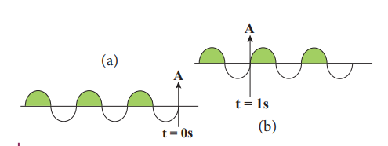

இரண்டு அலைகள் A புள்ளியைக் கடக்க ஒரு வினாடி (நேரம்) எடுத்துக் கொண்டால், ஒரு அலை A புள்ளியைக் கடக்க எடுத்துக் கொள்ளும் நேரம் அரை வினாடி ஆகும். இது கால அளவு \(T\) ஐ வரையறுக்கிறது

\[
T = \frac{1}{2} = 0.5 \, \text{s} \tag{11.2}
\]

சமன்பாடு (11.1) மற்றும் சமன்பாடு (11.2) இலிருந்து, _அதிர்வெண் மற்றும் கால அளவு நேர்மாறாக தொடர்புடையவை_ i.e.,

\[
T = \frac{1}{f} \tag{11.3}
\]

_கால அளவு என்பது ஒரு அலை ஒரு புள்ளியைக் கடக்க எடுத்துக் கொள்ளும் நேரம் என வரையறுக்கப்படுகிறது._

---
**எடுத்துக்காட்டு 11.2**

மூன்று அலைகள் கீழே உள்ள படத்தில் காட்டப்பட்டுள்ளன.


(a) அதிர்வெண்ணை ஏறுவரிசையிலும், (b) அலைநீளத்தை ஏறுவரிசையிலும் எழுதுங்கள்.

**_தீர்வு_**

(a) \(f_c < f_a < f_b\)

(b) \(\lambda_b < \lambda_a < \lambda_c\)

எடுத்துக்காட்டு 11.2 இலிருந்து, அதிர்வெண் அலைநீளத்துடன் நேர்மாறாக தொடர்புடையது என்பதை நாம் கவனிக்கிறோம், \(f \propto \frac{1}{\lambda}\)

பின்னர், \(f \lambda\) எதற்கு சமம்? (அதாவது) \(f \lambda = ?\)

இந்த அறியப்படாத இயற்பியல் அளவைத் தீர்மானிக்க ஒரு எளிய பரிமாண வாதம் நமக்கு உதவும்.

அலைநீளத்தின் பரிமாணம், \([\lambda] = L\)

அதிர்வெண் \(f = \frac{1}{\text{Time period}}\), எனவே அதிர்வெண்ணின் பரிமாணம்,
\[
[f] = \frac{1}{[T]} = T^{-1}
\]
\[
\Rightarrow [\lambda f] = [\lambda][f] = L T^{-1} = [\text{திசைவேகம்}]
\]

எனவே,
\[
\text{திசைவேகம், } \lambda f = v \tag{11.4}
\]

இங்கு \(v\) என்பது _அலை திசைவேகம்_ அல்லது _கட்டத் திசைவேகம்_ என அழைக்கப்படுகிறது. இதுவே அலை பரவும் திசைவேகம் ஆகும். _அலை திசைவேகம்_ என்பது ஒரு வினாடியில் அலை கடக்கும் தூரமாகும்.

---

**குறிப்பு:**

1. ஓரலகு நேரத்திற்கான சுழற்சிகளின் (அல்லது புரட்சிகளின்) எண்ணிக்கை _கோண அதிர்வெண்_ எனப்படும். _கோண அதிர்வெண்,_ \(\omega = \frac{2\pi}{T} = 2\pi f\) (அலகு ரேடியன்கள்/வினாடி)

2. ஓரலகு தூரத்திற்கான சுழற்சிகளின் எண்ணிக்கை அல்லது ஓரலகு தூரத்திற்கான அலைகளின் எண்ணிக்கை _அலை எண்_ எனப்படும்.

_அலை எண், \(k = \frac{2\pi}{\lambda}\)_ (அலகு ரேடியன்கள்/ மீட்டர்)

திசைவேகம் \(v\), கோண அதிர்வெண் \(\omega\) மற்றும் அலை எண் \(k\) ஆகியவை பின்வருமாறு தொடர்புடையவை:

\[
\text{திசைவேகம், } v = \lambda f = \frac{\lambda}{2\pi} \cdot 2\pi f = \frac{\omega}{k}
\]

---

**எடுத்துக்காட்டு 11.3**

மனிதர்கள் ஒலி அலைகளைக் கேட்கக்கூடிய சராசரி அதிர்வெண் வரம்பு 20 ஹெர்ட்ஸ் முதல் 20 கிலோ ஹெர்ட்ஸ் வரை மாறுபடும். இந்த வரம்புகளில் ஒலி அலையின் அலைநீளத்தைக் கணக்கிடுங்கள். (ஒலியின் வேகம் 340 மீ வி\(^{-1}\) எனக் கொள்க.)

**_தீர்வு_**

\[
\lambda_1 = \frac{v}{f_1} = \frac{340}{20} = 17 \, \text{மீ}
\]
\[
\lambda_2 = \frac{v}{f_2} = \frac{340}{20 \times 10^3} = 0.017 \, \text{மீ}
\]

எனவே, அந்தப் பகுதியில் ஒலியின் வேகம் 340 மீ வி\(^{-1}\) ஆக இருக்கும்போது கேட்கக்கூடிய அலைநீளப் பகுதி 0.017 மீ முதல் 17 மீ வரை ஆகும்.

---

**எடுத்துக்காட்டு 11.4**

ஒரு மனிதர் ஒரு கடலில் உள்ள அலையில் ஒரு பொம்மை வாத்தைப் பார்த்தார். அந்த வாத்து நிமிடத்திற்கு 15 முறை மேலும் கீழும் நகர்வதை அவர் கவனித்தார். கடல் அலையின் அலைநீளத்தை தோராயமாக 1.2 மீ என அளந்தார். பொம்மை வாத்து ஒருமுறை மேலும் கீழும் செல்ல எடுத்துக்கொள்ளும் நேரத்தையும், கடல் அலையின் திசைவேகத்தையும் கணக்கிடுங்கள்.

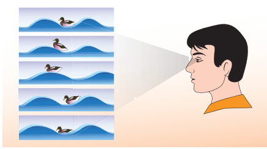

**_தீர்வு_**

பொம்மை வாத்து நிமிடத்திற்கு 15 முறை மேலும் கீழும் நகர்கிறது என்று கொடுக்கப்பட்டுள்ளது. இந்தத் தகவல் நமக்கு அதிர்வெண்ணைத் தருகிறது (பொம்மை வாத்து மேலும் கீழும் நகரும் எண்ணிக்கை)

\[
f = \frac{15 \text{ முறை}}{1 \text{ நிமிடம்}}
\]

ஆனால் ஒரு நிமிடம் என்பது 60 வினாடி, எனவே, நேரத்தை வினாடியில் வெளிப்படுத்துதல்

\[
f = \frac{15}{60} = \frac{1}{4} = 0.25 \, \text{Hz}
\]

பொம்மை வாத்து ஒருமுறை மேலும் கீழும் செல்ல எடுத்துக்கொள்ளும் நேரம் கால அளவு ஆகும், இது அதிர்வெண்ணின் தலைகீழ் ஆகும்

\[
T = \frac{1}{f} = \frac{1}{0.25} = 4 \, \text{s}
\]

கடல் அலையின் திசைவேகம்

\[
v = \lambda f = 1.2 \times 0.25 = 0.3 \, \text{மீ வி}^{-1}
\]

---

## அலையின் வீச்சு


படம் 11.14 இல் காட்டப்பட்டுள்ள அலைகள் ஒரே அலைநீளம், ஒரே அதிர்வெண் மற்றும் ஒரே கால அளவு கொண்டவை, மேலும் ஒரே திசைவேகத்துடன் நகரும். இரண்டு அலைகளுக்கு இடையிலான ஒரே வேறுபாடு முகடு அல்லது அகழியின் உயரம். அதாவது, முகடு அல்லது அகழியின் உயரம் ஒரு அலைப் பண்பையும் குறிக்கிறது. எனவே, ஒரு குறிப்பு அச்சைப் (உதாரணமாக இந்த வழக்கில் x-அச்சு) பொறுத்து ஊடகத்தின் அதிகபட்ச இடப்பெயர்ச்சியாக, அலையின் வீச்சு எனப்படும் ஒரு அளவை வரையறுக்கிறோம். இங்கு அது A ஆல் குறிக்கப்படுகிறது.

---

**எடுத்துக்காட்டு 11.5**

ஒரு முனை சுவருடன் இணைக்கப்பட்ட ஒரு சரத்தைக் கவனியுங்கள். பின்னர் படத்தில் கொடுக்கப்பட்டுள்ள இரண்டு சூழ்நிலைகளிலும் பின்வருவனவற்றைக் கணக்கிடுங்கள் (அலைகள் ஒரு வினாடியில் தூரத்தைக் கடக்கின்றன என்று வைத்துக்கொள்வோம்)

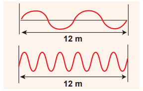

(a) அலைநீளம், (b) அதிர்வெண் மற்றும் (c) திசைவேகம்

**தீர்வு**

| |முதல் வழக்கு|இரண்டாவது வழக்கு|
|---|---|---|
|**(a)** அலைநீளம்|\(\lambda = 6\) மீ|\(\lambda = 2\) மீ|
|**(b)** அதிர்வெண்|\(f = 2\) Hz|\(f = 6\) Hz|
|**(c)** திசைவேகம்|\(v = 6 \times 2 = 12\) மீ வி\(^{-1}\)|\(v = 2 \times 6 = 12\) மீ வி\(^{-1}\)|

சரத்தின் வழியாக அலையின் வேகம் ஒரு மாறிலி என்பதை இது குறிக்கிறது. அதிக அதிர்வெண், குறுகிய அலைநீளம் மற்றும் நேர்மாறாகவும், மற்றும் அவற்றின் பெருக்கல் வேகத்தைக் கொடுக்கிறது, இது அப்படியே இருக்கும்.

---

## வெவ்வேறு ஊடகங்களில் அலைகளின் திசைவேகம்

ஒரு தூரத்தில் நீண்ட தண்டவாளங்களின் மீது சுத்தியல் அடிக்கப்படுகிறது என்று வைத்துக்கொள்வோம், மறுமுனையில் ஒரு நபர் தனது காதை தண்டவாளத்திற்கு அருகில் வைத்திருக்கும்போது அவர்/அவள் வெவ்வேறு நேரங்களில் இரண்டு ஒலிகளைக் கேட்பார். தண்டவாளங்கள் வழியாக (திட ஊடகம்) கேட்கப்படும் ஒலி, காற்று வழியாக (வாயு ஊடகம்) நாம் கேட்கும் ஒலியை விட வேகமானது. வெவ்வேறு ஊடகங்களில் ஒலியின் திசைவேகம் வேறுபட்டது என்பதை இது குறிக்கிறது.

இந்தப் பகுதியில், இரண்டு வெவ்வேறு நிகழ்வுகளில் அலைகளின் திசைவேகத்தைப் பெறுவோம்:

1. நீட்டப்பட்ட சரத்தின் வழியாக ஒரு குறுக்கு அலையின் திசைவேகம்.

2. ஒரு மீள் ஊடகத்தில் ஒரு நெட்டாங்கு அலையின் திசைவேகம்.

### நீட்டப்பட்ட சரத்தில் குறுக்கு அலைகளின் திசைவேகம்

ஒரு சரத்தின் மீது குறுக்கு பயண அலைகளின் திசைவேகத்தைக் கணக்கிடுவோம். கயிற்றின் ஒரு முனையில் (இடது முனை) ஒரு இழுப்பு கொடுக்கப்படும்போது, அலைத் துடிப்புகள் ஒரு நிலையான கட்டமைப்பில் இருக்கும் ஒரு பார்வையாளரைப் பொறுத்து \(v\) திசைவேகத்துடன் வலது முனையை நோக்கி நகரும்.

சரத்தில் உள்ள ஒரு அடிப்படைத் துண்டத்தைப் படம் 11.15 இல் காட்டப்பட்டுள்ளது. A மற்றும் B ஆகியவை ஒரு கணத்தில் சரத்தின் இரண்டு புள்ளிகளாக இருக்கட்டும். \(dl\) மற்றும் \(dm\) ஆகியவை அடிப்படைச் சரத்தின் நீளம் மற்றும் நிறை என்க. வரையறையின்படி, நேரியல் நிறை அடர்த்தி \(\mu\)


\[
\mu = \frac{dm}{dl} \tag{11.5}
\]
\[
dm = \mu \, dl \tag{11.6}
\]

அடிப்படைச் சரம் AB ஆனது, O மையம், R ஆரம் மற்றும் ஆரத்தில் O இல் θ கோணத்தைத் தாங்கும் ஒரு வட்டத்தின் வில்லைப் போன்ற ஒரு வளைவைக் கொண்டுள்ளது, படம் 11.15(b) இல் காட்டப்பட்டுள்ளது. θ கோணத்தை வில் நீளம் மற்றும் ஆரத்தின் அடிப்படையில் \(\theta = \frac{dl}{R}\) என எழுதலாம். சரத்தில் உள்ள இழுவிசையால் வழங்கப்படும் மையநோக்கு முடுக்கம்

\[
a_{cp} = \frac{v^{2}}{R} \tag{11.7}
\]

பின்னர், மையநோக்கு விசை

\[
F_{cp} = (dm) \frac{v^{2}}{R} \tag{11.8}
\]

சமன் 11.6 இலிருந்து,

\[
(dm) \frac{v^{2}}{R} = \mu v^{2} \frac{dl}{R} \tag{11.9}
\]

இழுவிசை T ஆனது A மற்றும் B இல் உள்ள சரத்தின் அடிப்படைத் துண்டத்தின் தொடுகோட்டுடன் செயல்படுகிறது. வில் நீளம் மிகச் சிறியது என்பதால், இழுவிசை விசையில் உள்ள மாறுபாட்டைப் புறக்கணிக்கலாம். T ஐ கிடைமட்டக் கூறு \(T \cos \frac{\theta}{2}\) எனப் பிரிக்கலாம்.

A மற்றும் B இல் உள்ள கிடைமட்டக் கூறுகள் அளவில் சமமானவை, ஆனால் திசையில் எதிரெதிரானவை; எனவே, அவை ஒன்றையொன்று ரத்து செய்கின்றன. அடிப்படை வில் நீளம் AB மிகச் சிறியதாக எடுத்துக்கொள்ளப்படுவதால், A மற்றும் B இல் உள்ள செங்குத்துக் கூறுகள் வில்லின் மையத்தை நோக்கிச் செங்குத்தாகச் செயல்படுவதாகத் தோன்றுகிறது, எனவே அவை கூடுகின்றன. நிகர ஆர விசை \(F_r\)

\[
F_r = 2T \sin\left(\frac{\theta}{2}\right) \tag{11.10}
\]

அலையின் வீச்சு சரத்தின் நீளத்துடன் ஒப்பிடும்போது மிகச் சிறியது என்பதால், \(\sin(\theta/2) \approx \theta/2\). எனவே,

\[
F_r = 2T \times \frac{\theta}{2} = T\theta \tag{11.11}
\]

ஆனால் \(\theta = \frac{dl}{R}\), எனவே

\[
F_r = \frac{T dl}{R} \tag{11.12}
\]

ஆர திசையில் உள்ள அடிப்படைச் சரத்திற்கு நியூட்டனின் இரண்டாவது விதியைப் பயன்படுத்தும்போது, சமநிலையின் கீழ், விசையின் ஆரக் கூறு மையநோக்கு விசைக்குச் சமம். எனவே சமன்பாடு (11.9) மற்றும் சமன்பாடு (11.12) ஐ சமன் செய்ய,

\[
\frac{T dl}{R} = \mu v^{2} \frac{dl}{R}
\]
\[
v = \sqrt{\frac{T}{\mu}} \tag{11.13}
\]

**அவதானிப்புகள்:**

- சரத்தின் திசைவேகம்
  a. இழுவிசை விசையின் வர்க்க மூலத்திற்கு நேரடியாக விகிதாசாரமாகும்
  b. நேரியல் நிறை அடர்த்தியின் வர்க்க மூலத்திற்கு எதிர் விகிதாசாரமாகும்
  c. அலைகளின் வடிவத்திலிருந்து சுயாதீனமானது.

---

**எடுத்துக்காட்டு 11.6**

கீழே உள்ள படத்தில் காட்டப்பட்டுள்ள பயணத் துடிப்பின் திசைவேகத்தைக் கணக்கிடுங்கள். துடிப்பின் நேரியல் நிறை அடர்த்தி 0.25 கிகி மீ\(^{-1}\) ஆகும். மேலும், சரத்தின் மீது 30 செ.மீ தூரத்தைக் கடக்க பயணத் துடிப்பு எடுத்துக்கொள்ளும் நேரத்தைக் கணக்கிடுங்கள்.

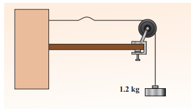

**தீர்வு**

சரத்தில் உள்ள இழுவிசை \(T = m g = 1.2 \times 9.8 = 11.76\) N
ஓரலகு நீளத்திற்கான நிறை \(\mu = 0.25\) கிகி மீ\(^{-1}\)

எனவே, அலைத் துடிப்பின் திசைவேகம்

\[
v = \sqrt{\frac{T}{\mu}} = \sqrt{\frac{11.76}{0.25}} = 6.858 \, \text{மீ வி}^{-1} \approx 6.8 \, \text{மீ வி}^{-1}
\]

துடிப்பு 30 செ.மீ தூரத்தைக் கடக்க எடுத்துக்கொள்ளும் நேரம்

\[
t = \frac{d}{v} = \frac{30 \times 10^{-2}}{6.8} = 0.044 \, \text{s} = 44 \, \text{ms}
\]

இங்கு, ms = மில்லி வினாடி.

---

### ஒரு மீள் ஊடகத்தில் நெட்டாங்கு அலைகளின் திசைவேகம்

ஒரு நீண்ட குழாயில் (உருளை) அடைக்கப்பட்ட நிலையான நிறையைக் கொண்ட ஒரு மீள் ஊடகத்தை (இங்கு நாம் காற்றைக் கருதுகிறோம்) கருத்தில் கொள்வோம், இதன் குறுக்கு வெட்டுப் பரப்பு \(A\) மற்றும் \(P\) அழுத்தத்தில் பராமரிக்கப்படுகிறது. ஒரு பிஸ்டனைப் பயன்படுத்தி பாய்மத்தை இடம்பெயரச் செய்வதன் மூலமோ அல்லது குழாயின் ஒரு முனையில் அதிரும் இசைக் கவரை வைப்பதன் மூலமோ பாய்மத்தில் நெட்டாங்கு அலைகளை உருவாக்கலாம். அலைகளின் பரவலின் திசையானது உருளையின் அச்சுடன் ஒத்துப்போகிறது என்று வைத்துக்கொள்வோம். \(\rho\) ஆரம்பத்தில் ஓய்வில் இருக்கும் பாய்மத்தின் அடர்த்தியாக இருக்கட்டும். \(t = 0\) இல், குழாயின் இடது முனையில் உள்ள பிஸ்டன் \(u\) வேகத்துடன் வலப்புறம் நோக்கி இயக்கத்தில் அமைக்கப்படுகிறது.

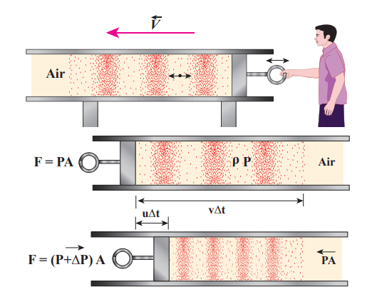

\(u\) பிஸ்டனின் திசைவேகமாகவும், \(v\) மீள் அலையின் திசைவேகமாகவும் இருக்கட்டும். \(\Delta t\) நேர இடைவெளியில், பிஸ்டன் நகர்ந்த தூரம் \(\Delta d = u \Delta t\). இப்போது, மீள் கிளர்ச்சி நகர்ந்த தூரம் \(\Delta x = v \Delta t\). \(\Delta m\) என்பது \(\Delta t\) நேரத்தில் \(v\) திசைவேகத்தைப் பெற்ற காற்றின் நிறையாக இருக்கட்டும். எனவே,

\[
\Delta m = \rho A \Delta x = \rho A (v \Delta t)
\]

பின்னர், \(u\) திசைவேகத்துடன் பிஸ்டனின் இயக்கம் காரணமாக வழங்கப்பட்ட உந்தம்

\[
\Delta p = [\rho A (v \Delta t)] u
\]

ஆனால் உந்தத்தில் ஏற்படும் மாற்றமே உந்தக் கூறு (impulse) ஆகும். நிகர உந்தக் கூறு

\[
I = (\Delta P A) \Delta t
\]

அல்லது

\[
(\Delta P A) \Delta t = [\rho A (v \Delta t)] u
\]
\[
\Delta P = \rho v u \tag{11.14}
\]

ஒலி அலை காற்றின் வழியாகச் செல்லும்போது, காற்றின் சிறிய கன அளவு உறுப்பு \((\Delta V)\) வழக்கமான அமுக்கங்களுக்கும் பகுதி விரிவுகளுக்கும் உட்படுகிறது. எனவே, அழுத்தத்தில் ஏற்படும் மாற்றத்தை பின்வருமாறும் எழுதலாம்

\[
\Delta P = K \frac{\Delta V}{V}
\]

இங்கு, \(V\) அசல் கன அளவு மற்றும் \(K\) மீள் ஊடகத்தின் பருமப் பண்பு மாடுலஸ் என அழைக்கப்படுகிறது.

ஆனால் \(V = A \Delta x = A v \Delta t\) மற்றும்

\(\Delta V = A \Delta d = A u \Delta t\)

எனவே,

\[
\Delta P = K \frac{A u \Delta t}{A v \Delta t} = K \frac{u}{v} \tag{11.15}
\]

சமன்பாடு (11.14) மற்றும் சமன்பாடு (11.15) ஐ ஒப்பிடும்போது,

\[
\rho v u = K \frac{u}{v} \quad \text{or} \quad v^{2} = \frac{K}{\rho}
\]
\[
\Rightarrow v = \sqrt{\frac{K}{\rho}} \tag{11.16}
\]

பொதுவாக, ஒரு மீள் ஊடகத்தில் ஒரு நெட்டாங்கு அலையின் திசைவேகம் \(v = \sqrt{\frac{E}{\rho}}\) ஆகும், இங்கு \(E\) என்பது ஊடகத்தின் மீள்சக்தி மாடுலஸ் ஆகும்.

**வழக்குகள்: ஒரு திடப்பொருளுக்கு:**

**(i) ஒரு பரிமாணக் கம்பி (1D)**

\[
v = \sqrt{\frac{Y}{\rho}} \tag{11.17}
\]

இங்கு \(Y\) என்பது கம்பியின் பொருளின் யங்கின் மாடுலஸ் மற்றும் \(\rho\) கம்பியின் அடர்த்தி. 1D கம்பியில் யங்கின் மாடுலஸ் மட்டுமே இருக்கும்.

**(ii) முப்பரிமாணக் கம்பி (3D) ஒரு திடப்பொருளில் நெட்டாங்கு அலையின் வேகம்**

\[
v = \sqrt{\frac{K + \frac{4}{3}\eta}{\rho}} \tag{11.18}
\]

இங்கு \(\eta\) உறுதி மாடுலஸ், \(K\) பருமப் பண்பு மாடுலஸ் மற்றும் \(\rho\) கம்பியின் அடர்த்தி.

**வழக்குகள்:** **திரவங்களுக்கு:**

\[
v = \sqrt{\frac{K}{\rho}} \tag{11.19}
\]

இங்கு, \(K\) (அல்லது) \(B\) என்பது பருமப் பண்பு மாடுலஸ் மற்றும் \(\rho\) கம்பியின் அடர்த்தி.

---

**எடுத்துக்காட்டு 11.7**

ஒரு எஃகுக் கம்பியில் ஒலியின் வேகத்தைக் கணக்கிடுங்கள், இதில் யங்கின் மாடுலஸ் \(Y = 2 \times 10^{11}\) நியூட்டன் மீ\(^{-2}\) மற்றும் \(\rho = 7800\) கிகி மீ\(^{-3}\).

**தீர்வு**

\[
v = \sqrt{\frac{Y}{\rho}} = \sqrt{\frac{2 \times 10^{11}}{7800}} = \sqrt{2.564 \times 10^{7}} \approx 5064 \, \text{மீ வி}^{-1}
\]

எனவே, ஒரு திரவம் அல்லது வாயுவை விட ஒரு திடப்பொருளில் நெட்டாங்கு அலைகள் வேகமாகப் பயணிக்கின்றன. ஒரு மேய்ப்பர் தனது கால்நடைகளைப் பாதுகாக்க தண்டவாளங்களில் காதை வைத்து ரயில் பாதையைக் கடப்பதற்கு முன் ஏன் சரிபார்க்கிறார் என்பதை இப்போது நீங்கள் புரிந்து கொள்ளலாம்.

---

**எடுத்துக்காட்டு 11.8**

100 kPa அழுத்தத்தின் அதிகரிப்பு ஒரு குறிப்பிட்ட அளவு நீரின் கன அளவை அதன் அசல் கன அளவில் 0.005% குறைக்கிறது.

(a) நீரின் பருமப் பண்பு மாடுலஸைக் கணக்கிடவும்?

(b) நீரில் ஒலியின் வேகத்தை (அமுக்க அலைகள்) கணக்கிடவும்?

**_தீர்வு_**

(a) பருமப் பண்பு மாடுலஸ்

\[
K = \frac{\Delta P}{\left( \frac{-\Delta V}{V} \right)} = \frac{100 \times 10^{3}}{0.005 \times 10^{-2}} = \frac{10^{5}}{5 \times 10^{-5}} = 2 \times 10^{9} \, \text{Pa}
\]

(MPa என்பது மெகா பாஸ்கல்)

(b) நீரில் ஒலியின் வேகம்

\[
v = \sqrt{\frac{K}{\rho}} = \sqrt{\frac{2 \times 10^{9}}{10^{3}}} = \sqrt{2 \times 10^{6}} = 1.414 \times 10^{3} \, \text{மீ வி}^{-1}
\]

---

**குறிப்பு**

குறுக்கு அலைகள் மற்றும் நெட்டாங்கு அலைகள் இரண்டின் திசைவேகங்களும் மீள் பண்பு (சரத்தின் இழுவிசை T அல்லது பருமப் பண்பு மாடுலஸ் K போன்றவை) மற்றும் நிலைமப் பண்பு (அடர்த்தி அல்லது ஒரு அலகு நீளத்திற்கான நிறை போன்றவை) ஆகியவற்றைச் சார்ந்தது i.e., \(v = \sqrt{\frac{\text{மீள் பண்பு}}{\text{நிலைமப் பண்பு}}}\).

---

**அட்டவணை 11.2: பல்வேறு ஊடகங்களில் ஒலியின் வேகம்**

|S.No. | **ஊடகம்** | **வேகம் மீ வி\(^{-1}\)**| 
|---|---|---|
|திடப்பொருள்கள்: 1.| ரப்பர் | 600 |  
|2.| தங்கம் | 3240 |
|3.| பித்தளை | 4700|
|4.| தாமிரம் | 5010|
|5.| இரும்பு |5950|
|6.| அலுமினியம் |6420| 
|திரவங்கள் 25°C இல்: 1.| மண்ணெண்ணெய் |1324| 
|2.| பாதரசம் |1450|
|3.| நீர் |1493|
|4.| கடல் நீர் |1533|
|வாயு (0°C இல்) 1.| ஆக்ஸிஜன் |317 |
|2.| காற்று |331|
|3.| ஹீலியம் |972|
|4.| ஹைட்ரஜன் |1286|
|வாயு (20°C இல்): 1.| காற்று |343 |

## ஒலி அலைகளின் பரவல்

ஒலி அலைகள் நெட்டாங்கு அலைகள் என்பதை நாம் அறிவோம், மேலும் அவை பரவும்போது அமுக்கங்களும் பகுதி விரிவுகளும் உருவாகின்றன. பின்வரும் பகுதியில், நியூட்டனின் முறையால் காற்றில் ஒலியின் வேகத்தைக் கணக்கிடுகிறோம், மேலும் லாப்லேஸின் திருத்தம் மற்றும் காற்றில் ஒலியைப் பாதிக்கும் காரணிகள் பற்றியும் விவாதிக்கிறோம்.

### காற்றில் ஒலி அலைகளின் வேகத்திற்கான நியூட்டனின் வாய்பாடு

சர் ஐசக் நியூட்டன், ஒலி காற்றில் பரவும்போது, அமுக்கம் மற்றும் பகுதி விரிவு உருவாவது மிக மெதுவான முறையில் நிகழ்கிறது என்று கருதினார், இதனால் செயல்முறை இயற்கையில் சமவெப்பமானது. அதாவது, அமுக்கத்தின் போது உற்பத்தி செய்யப்படும் வெப்பம் (அழுத்தம் அதிகரிக்கிறது, கன அளவு குறைகிறது), மற்றும் பகுதி விரிவின் போது இழக்கப்படும் வெப்பம் (அழுத்தம் குறைகிறது, கன அளவு அதிகரிக்கிறது) ஆகியவை ஊடகத்தின் வெப்பநிலை மாறாமல் இருக்கும் வகையில் ஒரு காலத்திற்கு நிகழ்கின்றன. எனவே, காற்று மூலக்கூறுகளை ஒரு சிறந்த வாயுவாகக் கருதுவதன் மூலம், அழுத்தம் மற்றும் கன அளவில் ஏற்படும் மாற்றங்கள் பாயிலின் விதிக்குக் கீழ்ப்படிகின்றன. கணித ரீதியாக

\[
PV = \text{மாறிலி} \tag{11.20}
\]

சமன்பாடு (11.20) ஐ வகையிட,

\[
P \, dV + V \, dP = 0
\]

அல்லது,

\[
P = -\frac{V \, dP}{dV} = K_I \tag{11.21}
\]

இங்கு, \(K_I\) என்பது காற்றின் சமவெப்ப பருமப் பண்பு மாடுலஸ் ஆகும். சமன்பாடு (11.21) ஐ சமன்பாட்டில் (11.16) பிரதியிட, காற்றில் ஒலியின் வேகம்

\[
v = \sqrt{\frac{K_I}{\rho}} = \sqrt{\frac{P}{\rho}} \tag{11.22}
\]

\(P\) என்பது காற்றின் அழுத்தம், NTP (இயல்பான வெப்பநிலை மற்றும் அழுத்தம்) இல் அதன் மதிப்பு 76 செ.மீ பாதரசம், நாம் \(P = h \rho g\):

\[
P = (0.76 \times 13.6 \times 10^{3} \times 9.8) \, \text{நியூட்டன் மீ}^{-2}
\]
\[
\rho = 1.293 \, \text{கிகி மீ}^{-3}
\]

பின்னர் NTP இல் காற்றில் ஒலியின் வேகம்

\[
v = \sqrt{\frac{0.76 \times 13.6 \times 10^{3} \times 9.8}{1.293}} = 279.80 \, \text{மீ வி}^{-1} \approx 280 \, \text{மீ வி}^{-1} \text{ (கோட்பாட்டு மதிப்பு)}
\]

ஆனால் 0°C இல் காற்றில் ஒலியின் வேகம் சோதனை முறையில் 332 மீ வி\(^{-1}\) ஆகக் காணப்படுகிறது, இது கோட்பாட்டு மதிப்பை விட 16% வரை அதிகமாகும் (சதவீதப் பிழை \(\frac{332-280}{280} \times 100 \approx 18.6\%\)). இந்தப் பிழை சிறியதல்ல.

### லாப்லேஸின் திருத்தம்

1816 இல், ஒலி ஒரு ஊடகத்தின் வழியாகப் பரவும்போது, துகள்கள் மிக விரைவாக அலைவுறுவதால், அமுக்கமும் பகுதி விரிவும் மிக விரைவாக நிகழ்கின்றன என்று கருதி, லாப்லேஸ் இந்த முரண்பாட்டைத் திருப்திகரமாகத் திருத்தினார். எனவே, அமுக்கத்தால் உற்பத்தி செய்யப்படும் வெப்பம் மற்றும் பகுதி விரிவால் ஏற்படும் குளிர்விப்பு விளைவு ஆகியவற்றின் பரிமாற்றம் நடைபெறாது, ஏனெனில் காற்று (ஊடகம்) வெப்பத்தின் கடத்தும் திறன் குறைந்தது. இங்கு வெப்பநிலை இனி ஒரு மாறிலியாகக் கருதப்படுவதில்லை என்பதால், ஒலிப் பரவல் ஒரு வெப்பஞ்செல்லா செயல்முறையாகும். வெப்பஞ்செல்லாக் கருத்தின்படி, வாயு பாய்சனின் விதிக்குக் (நியூட்டன் கருதிய பாயிலின் விதி அல்ல) கீழ்ப்படிகிறது, இது

\[
P V^{\gamma} = \text{மாறிலி} \tag{11.23}
\]

இங்கு \(\gamma = \frac{C_p}{C_v}\), இது நிலையான அழுத்தத்தில் தன்வெப்பத் திறனுக்கும் நிலையான கன அளவில் தன்வெப்பத் திறனுக்கும் உள்ள விகிதமாகும். சமன்பாடு (11.23) ஐ இருபுறமும் வகையிட,

\[
\gamma P V^{\gamma-1} dV + V^{\gamma} dP = 0
\]

அல்லது,

\[
\gamma P = -\frac{V dP}{dV} = K_A \tag{11.24}
\]

இங்கு, \(K_A\) என்பது காற்றின் வெப்பஞ்செல்லா பருமப் பண்பு மாடுலஸ் ஆகும். இப்போது, சமன்பாடு (11.24) ஐ சமன்பாட்டில் (11.16) பிரதியிட, காற்றில் ஒலியின் வேகம்

\[
v = \sqrt{\frac{K_A}{\rho}} = \sqrt{\frac{\gamma P}{\rho}} \tag{11.25}
\]

காற்றில் முக்கியமாக நைட்ரஜன், ஆக்ஸிஜன், ஹைட்ரஜன் போன்றவை (இரு அணு வாயு) இருப்பதால், \(\gamma = 1.4\) ஐ எடுத்துக்கொள்கிறோம். எனவே, காற்றில் ஒலியின் வேகம் \(v_A = \sqrt{1.4} (280 \, \text{மீ வி}^{-1}) = 331.30 \, \text{மீ வி}^{-1}\) ஆகும், இது சோதனைத் தரவுகளுக்கு மிக மிக நெருக்கமானது.

### வாயுக்களில் ஒலியின் வேகத்தைப் பாதிக்கும் காரணிகள்

நிலைச் சமன்பாடு \(PV = \mu R T\) கொண்ட ஒரு சிறந்த வாயுவைக் கருத்தில் கொள்வோம்

\[
PV = \mu R T \tag{11.26}
\]

இங்கு, \(P\) அழுத்தம், \(V\) கன அளவு, \(T\) வெப்பநிலை, \(\mu\) மோல்களின் எண்ணிக்கை மற்றும் \(R\) உலகளாவிய வாயு மாறிலி. ஒரு மூலக்கூறின் கொடுக்கப்பட்ட நிறைக்கு, சமன்பாடு (11.26) ஐ இவ்வாறு எழுதலாம்

\[
\frac{PV}{T} = \text{மாறிலி} \tag{11.27}
\]

நிலையான நிறை \(m\) க்கு, வாயுவின் அடர்த்தி கன அளவுடன் நேர்மாறாக மாறுபடும். i.e.,

\[
\rho = \frac{m}{V} \quad \Rightarrow \quad V = \frac{m}{\rho} \tag{11.28}
\]

சமன்பாடு (11.28) ஐ சமன்பாட்டில் (11.27) பிரதியிட,

\[
\frac{P}{\rho T} = \text{மாறிலி} \quad \Rightarrow \quad \frac{P}{\rho} = c T \tag{11.29}
\]

இங்கு \(c\) மாறிலி.

சமன்பாட்டில் (11.25) கொடுக்கப்பட்ட காற்றில் ஒலியின் வேகத்தை இவ்வாறு எழுதலாம்

\[
v = \sqrt{\gamma \frac{P}{\rho}} = \sqrt{\gamma c T} \tag{11.30}
\]

மேலே உள்ள தொடர்பிலிருந்து பின்வருவனவற்றை நாம் கவனிக்கிறோம்

**(a) அழுத்தத்தின் விளைவு :**

நிலையான வெப்பநிலைக்கு, \(\frac{P}{\rho}\) மாறிலியாகிறது. ஒரு நிலையான வெப்பநிலைக்கு ஒலியின் வேகம் அழுத்தத்திலிருந்து சுயாதீனமானது என்பதை இது குறிக்கிறது. ஒரு மலையின் உச்சியிலும் அடிவாரத்திலும் வெப்பநிலை ஒரே மாதிரியாக இருந்தால், இந்த இரண்டு இடங்களிலும் ஒலியின் வேகம் ஒரே மாதிரியாக இருக்கும். ஆனால், நடைமுறையில், ஒரு மலையின் உச்சியிலும் அடிவாரத்திலும் வெப்பநிலைகள் ஒரே மாதிரியாக இருப்பதில்லை; எனவே, வெவ்வேறு இடங்களில் ஒலியின் வேகம் வேறுபட்டது.

**(b) வெப்பநிலையின் விளைவு :**

\(v \propto \sqrt{T}\) என்பதால், ஒலியின் வேகம் கெல்வினில் உள்ள வெப்பநிலையின் வர்க்க மூலத்திற்கு நேரடியாக மாறுபடுகிறது.

0°C அல்லது 273 K வெப்பநிலையில் ஒலியின் வேகம் \(v_0\) ஆகவும், எந்த ஒரு தன்னிச்சையான வெப்பநிலை \(T\) (கெல்வினில்) இல் ஒலியின் வேகம் \(v\) ஆகவும் இருக்கட்டும், பின்னர்

\[
\frac{v}{v_0} = \sqrt{\frac{T}{273}} = \sqrt{1 + \frac{t}{273}} = 1 + \frac{1}{2} \frac{t}{273} \quad (\text{இருபடி விரிவாக்கத்தைப் பயன்படுத்தி})
\]

0°C இல் \(v_0 = 331 \, \text{மீ வி}^{-1}\) என்பதால், \(t\)°C இல் உள்ள எந்த வெப்பநிலையிலும் \(v\)

\[
v = (331 + 0.61 t) \, \text{மீ வி}^{-1}
\]

இவ்வாறு, ஒலியின் வேகம் ஒரு டிகிரி செல்சியஸ் வெப்பநிலை உயர்விற்கு 0.61 மீ வி\(^{-1}\) அதிகரிக்கிறது. வெப்பநிலை அதிகரிக்கப்படும் போது, மூலக்கூறுகள் வெப்ப ஆற்றலைப் பெறுவதால் வேகமாக அதிரும், எனவே ஒலியின் வேகம் அதிகரிக்கிறது என்பதைக் கவனத்தில் கொள்ளவும்.

**(c) அடர்த்தியின் விளைவு :** ஒரே வெப்பநிலை மற்றும் அழுத்தத்தைக் கொண்ட வெவ்வேறு அடர்த்திகள் கொண்ட இரண்டு வாயுக்களைக் கருத்தில் கொள்வோம். பின்னர் இரண்டு வாயுக்களிலும் ஒலியின் வேகம்

\[
v_1 = \sqrt{\frac{\gamma_1 P}{\rho_1}} \tag{11.31}
\]
மற்றும்
\[
v_2 = \sqrt{\frac{\gamma_2 P}{\rho_2}} \tag{11.32}
\]

சமன்பாடு (11.31) மற்றும் சமன்பாட்டின் (11.32) விகிதத்தை எடுத்துக்கொள்ள,

\[
\frac{v_1}{v_2} = \sqrt{\frac{\gamma_1 \rho_2}{\gamma_2 \rho_1}}
\]

\(\gamma\) இன் மதிப்பு ஒரே மாதிரியாக இருக்கும் வாயுக்களுக்கு,

\[
\frac{v_1}{v_2} = \sqrt{\frac{\rho_2}{\rho_1}} \tag{11.33}
\]

எனவே ஒரு வாயுவில் ஒலியின் திசைவேகம் வாயுவின் அடர்த்தியின் வர்க்க மூலத்திற்கு எதிர் விகிதாசாரமாகும்.

**(d) ஈரப்பதத்தின் விளைவு:**

ஈரமான காற்றின் அடர்த்தி உலர்ந்த காற்றின் 0.625 மடங்கு ஆகும் என்பதை நாம் அறிவோம், அதாவது காற்றில் ஈரப்பதம் இருப்பது (ஈரப்பதம் அதிகரிப்பு) அதன் அடர்த்தியைக் குறைக்கிறது. எனவே, ஒலியின் வேகம் ஈரப்பதம் அதிகரிக்கும் போது அதிகரிக்கிறது. சமன்பாட்டிலிருந்து (11.30)

\[
\frac{v_1}{v_2} = \sqrt{\frac{\rho_2}{\rho_1}}
\]

\(\rho_1, v_1\) மற்றும் \(\rho_2, v_2\) ஆகியவை முறையே உலர்ந்த காற்று மற்றும் ஈரமான காற்றின் அடர்த்தி மற்றும் ஒலியின் வேகங்களாக இருக்கட்டும். \(\gamma_1 = \gamma_2\) எனில் \(\rho_2 < \rho_1\). \(P\) என்பது மொத்த வளிமண்டல அழுத்தம் என்பதால், டால்டனின் பகுதி அழுத்த விதியின்படி, அதைக் காட்ட முடியும்

\[
\frac{\rho_2}{\rho_1} = \frac{P}{p_1 + p_2 \frac{M_v}{M_d}} = \frac{P}{p_1 + \left(\frac{5}{8}\right) p_2}
\]

இங்கு \(p_1\) மற்றும் \(p_2\) ஆகியவை முறையே உலர்ந்த காற்று மற்றும் நீராவியின் பகுதி அழுத்தங்களாகும், மேலும் \(M_v\) மற்றும் \(M_d\) ஆகியவை நீராவி மற்றும் உலர்ந்த காற்றின் மூலக்கூறு நிறைகளாகும். பின்னர்

\[
\frac{v_2}{v_1} = \sqrt{\frac{\rho_1}{\rho_2}} = \sqrt{1 + \left(\frac{3}{8}\right) \frac{p_2}{p_1}} \tag{11.34}
\]

**(e) காற்றின் விளைவு:**

காற்று வீசுவதால் ஒலியின் வேகமும் பாதிக்கப்படுகிறது. காற்று வீசும் திசையில், ஒலியின் வேகம் அதிகரிக்கிறது, அதேசமயம் காற்று வீசுவதற்கு எதிர் திசையில், ஒலியின் வேகம் குறைகிறது.

---

**எடுத்துக்காட்டு 11.9**

ஆக்ஸிஜன் மற்றும் நைட்ரஜனின் அடர்த்திகளின் விகிதம் 16:14 ஆகும். 17°C இல் நைட்ரஜன் வாயுவில் ஒலியின் வேகம், ஆக்ஸிஜன் வாயுவில் ஒலியின் வேகத்திற்குச் சமமாக இருக்கும் வெப்பநிலையைக் கணக்கிடுங்கள்.

**_தீர்வு_**

சமன்பாடு (11.25) இலிருந்து, நாம் பெறுவது

\[
v = \sqrt{\frac{\gamma P}{\rho}}
\]

ஆனால் \(\rho = \frac{M}{V}\). எனவே,

\[
v = \sqrt{\frac{\gamma R T}{M}} \quad ( \text{since } P = \frac{\rho R T}{M} )
\]

சமன்பாடு (11.26) ஐப் பயன்படுத்தி,

\[
P = \frac{\rho R T}{M} \quad \Rightarrow \quad \frac{P}{\rho} = \frac{R T}{M}
\]

இங்கு, \(R\) என்பது உலகளாவிய வாயு மாறிலி மற்றும் \(M\) என்பது வாயுவின் மூலக்கூறு நிறை. 17°C இல் நைட்ரஜன் வாயுவில் ஒலியின் வேகம்

\[
v_{N_2} = \sqrt{\frac{\gamma R (273 + 17)}{M_{N_2}}} \tag{1}
\]

இதேபோல், \(t\) வெப்பநிலையில் ஆக்ஸிஜன் வாயுவில் ஒலியின் வேகம்

\[
v_{O_2} = \sqrt{\frac{\gamma R (273 + t)}{M_{O_2}}} \tag{2}
\]

\(\gamma\) இன் மதிப்பு இரண்டு வாயுக்களுக்கும் ஒரே மாதிரியாக இருப்பதால், இரண்டு வேகங்களும் சமமாக இருக்க வேண்டும். எனவே, சமன்பாடு (1) மற்றும் (2) ஐ சமன் செய்ய,

\[
\frac{M_{O_2}}{M_{N_2}} = \frac{273 + t}{273 + 17} \tag{3}
\]

இருபுறமும் வர்க்கப்படுத்தி, \(\gamma R\) காரணியை ரத்து செய்து மறுசீரமைக்க,

\[
t = (273 + 17) \frac{M_{O_2}}{M_{N_2}} - 273 \tag{4}
\]

ஆக்ஸிஜன் மற்றும் நைட்ரஜனின் அடர்த்திகள் 16:14 என்பதால்,

\[
\frac{M_{O_2}}{M_{N_2}} = \frac{16}{14} = \frac{8}{7} \tag{5}
\]

சமன்பாடு (5) ஐ (3) இல் பிரதியிட,

\[
t = 290 \times \frac{8}{7} - 273 = 331.43 - 273 = 58.43°C \quad \Rightarrow \quad t \approx 58.4 \, \text{°C}
\]

## ஒலி அலைகளின் எதிரொளிப்பு

ஒலி அலை ஒரு ஊடகத்திலிருந்து மற்றொரு ஊடகத்திற்குச் செல்லும் போது, பின்வரும் விஷயங்கள் நிகழலாம்

(a) **ஒலியின் எதிரொளிப்பு:** ஊடகம் மிகவும் அடர்த்தியாக (மிகவும் விறைப்பாக) இருந்தால், ஒலி முழுமையாக (திரும்பி எறியப்பட்டு) அசல் ஊடகத்திற்கு எதிரொளிக்கப்படலாம்.

(b) **ஒலியின் ஒளிவிலகல்:** ஒலி அலைகள் ஒரு ஊடகத்திலிருந்து மற்றொரு ஊடகத்திற்குப் பரவும்போது, இரண்டாவது ஊடகத்தால் உறிஞ்சப்படுவதால் சில ஆற்றல் இழப்பு ஏற்படலாம்.

இந்தப் பகுதியில், ஒலி அலைகள் ஒரு கடினமான மேற்பரப்பைச் சந்திக்கும் போது ஊடகத்தில் அவற்றின் எதிரொளிப்பை மட்டுமே கருத்தில் கொள்வோம். ஒலியும் எதிரொளிப்பு விதிகளுக்குக் கீழ்ப்படிகிறது, அவை கூறுகின்றன


(i) ஒலியின் படுகோணம், எதிரொளிப்புக் கோணத்திற்குச் சமம்.

(ii) ஒலி அலை ஒரு மேற்பரப்பால் எதிரொளிக்கப்படும் போது, படு அலை, எதிரொளிப்பு அலை மற்றும் படு புள்ளியில் உள்ள செங்குத்து கோடு ஆகிய அனைத்தும் ஒரே தளத்தில் அமையும்.

ஒரு கண்ணாடியிலிருந்து ஒளியின் எதிரொளிப்பைப் போலவே, ஒலியும் ஒரு கடினமான தட்டையான மேற்பரப்பில் இருந்து எதிரொளிக்கிறது. இது ஊடுருவு எதிரொளிப்பு (specular reflection) எனப்படும்.

ஆதாரத்தின் அலைநீளம் எதிரொளிக்கும் மேற்பரப்பின் பரிமாணங்களை விட சிறியதாகவும், மேற்பரப்பு ஒழுங்கின்மைகளை விட சிறியதாகவும் இருக்கும்போது மட்டுமே ஊடுருவு எதிரொளிப்பு காணப்படுகிறது.

### தள மேற்பரப்பின் வழியாக ஒலியின் எதிரொளிப்பு


ஒலி அலைகள் தளச் சுவரில் மோதும் போது, அவை ஒளியைப் போன்றே துள்ளி விழுகின்றன. ஒரு சுவரைப் (தள மேற்பரப்பு) பொறுத்து ஒரு ஒலிபெருக்கி ஒரு கோணத்தில் வைக்கப்பட்டுள்ளது என்று வைத்துக்கொள்வோம், பின்னர் மூலத்திலிருந்து வரும் அலைகள் (ஒரு புள்ளி மூலமாகக் கருதப்படுகிறது) கோள அலை முகடுகளாகக் (சொல்லப்போனால், ஒரு கோள அலை முகடு போல நகரும் அமுக்கங்கள்) கருதப்படலாம். எனவே, தள மேற்பரப்பில் இருந்து எதிரொளிக்கப்பட்ட அலை முகடும் கோளமானது, அதன் வளைவின் மையம் (தள மேற்பரப்பின் மறுபுறத்தில் உள்ளது) ஒலி மூலத்தின் (மெய்நிகர் அல்லது கற்பனை ஒலிபெருக்கி) பிம்பமாகக் கருதப்படலாம். இவை படங்கள் 11.18, 11.19 இல் காட்டப்பட்டுள்ளன.

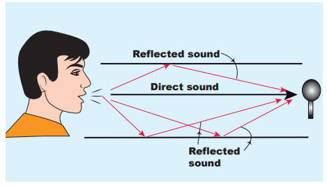

### வளைந்த மேற்பரப்பின் வழியாக ஒலியின் எதிரொளிப்பு

குவிவு அல்லது குழிவு அல்லது தளம் போன்ற வெவ்வேறு மேற்பரப்புகளில் இருந்து எதிரொளிக்கப்படும் போது ஒலியின் நடத்தை வேறுபட்டது. ஒரு குவிவு மேற்பரப்பில் இருந்து எதிரொளிக்கப்படும் ஒலி பரவுகிறது, எனவே அது எளிதில் மங்கி விடும். அதேசமயம், குழிவு மேற்பரப்பில் இருந்து எதிரொளிக்கப்பட்டால் அது ஒரு புள்ளியில் குவியும், மேலும் இது எளிதில் மிகைப்படுத்தப்படலாம். ஒலியைத் துல்லியமாக ஒரு புள்ளியில் குவிய வைக்கப் பயன்படும் பரவளைய எதிரொளிப்பான் (வளைந்த எதிரொளிப்பான்) அதிக திசைத்திறன் மைக்ரோஃபோன்கள் என அழைக்கப்படும் பரவளைய மைக்ரோஃபோன்களை வடிவமைப்பதில் பயன்படுத்தப்படுகிறது.

எந்த மேற்பரப்பும் (மென்மையானது அல்லது கரடுமுரடானது) ஒலியை உறிஞ்சும் என்பதை நாம் அறிவோம். எடுத்துக்காட்டாக, ஒரு பெரிய மண்டபம் அல்லது கேட்போர் கூடம் அல்லது அரங்கத்தில் உருவாகும் ஒலி, சுவர்கள், கூரைகள், தரை, இருக்கைகள் போன்றவற்றால் உறிஞ்சப்படுகிறது. இத்தகைய இழப்புகளைத் தவிர்க்க, ஒரு வளைந்த ஒலிப்பலகை (குழிவான பலகை) பேச்சாளரின் முன்னால் வைக்கப்படுகிறது, இதனால் அந்தப் பலகை பேச்சாளரின் ஒலி அலைகளை பார்வையாளர்களை நோக்கி எதிரொளிக்கிறது. இந்த முறை அந்த மண்டபத்தில் சாத்தியமான எல்லாத் திசைகளிலும் ஒலி அலைகள் பரவுவதைக் குறைக்கிறது, மேலும் மண்டபம் முழுவதும் ஒலியின் சீரான விநியோகத்தை மேம்படுத்துகிறது. அதனால்தான் அந்த மண்டபத்தில் எந்த நிலையில் அமர்ந்திருக்கும் ஒரு நபரும் எந்த இடையூறும் இல்லாமல் ஒலியைக் கேட்க முடியும்.


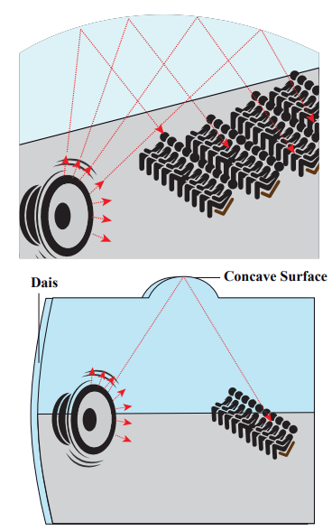

### ஒலி அலைகளின் எதிரொளிப்பின் பயன்பாடுகள்

**(a) ஸ்டெத்தாஸ்கோப்:** இது பல எதிரொளிப்புகளின் கொள்கையில் செயல்படுகிறது.


இது மூன்று முக்கிய பகுதிகளைக் கொண்டுள்ளது: (i) மார்புத் துண்டு (ii) காதுத் துண்டு (iii) ரப்பர் குழாய்

**(i) மார்புத் துண்டு:** இது ஒலிக்கு மிகவும் உணர்திறன் மிக்க ஒரு சிறிய வட்டு வடிவ அலைவி (உதரவிதானம்) கொண்டுள்ளது, மேலும் அது கண்டறியும் ஒலியைப் பெருக்குகிறது.

**(ii) காதுத் துண்டு:** இது மார்புத் துண்டால் கண்டறியப்பட்ட ஒலிகளைக் கேட்கப் பயன்படும் உலோகக் குழாய்களால் ஆனது.

**(iii) ரப்பர் குழாய்:** இந்தக் குழாய் மார்புத் துண்டு மற்றும் காதுத் துண்டு இரண்டையும் இணைக்கிறது. உதரவிதானத்தால் கண்டறியப்பட்ட ஒலி சமிக்ஞையை, காதுத் துண்டுக்கு அனுப்ப இது பயன்படுகிறது. இதயத் துடிப்புகள் (அல்லது நுரையீரல்) அல்லது உள் உறுப்புகளால் உருவாகும் எந்த ஒலியையும் கண்டறிய முடியும், மேலும் அது இந்தக் குழாய் வழியாக பல எதிரொளிப்புகளால் காதுத் துண்டை அடைகிறது.

விஞ்ஞானிகள் மதிப்பிட்டுள்ளனர், _ஒவ்வொரு ஒலிக்கும் இடையிலான நேர இடைவெளி \(\frac{1}{10}\) வினாடி (0.1 வி) எனில், நாம் இரண்டு ஒலிகளையும் சரியாகக் கேட்க முடியும். பின்னர்,_

\[
\text{திசைவேகம்} = \frac{\text{கடந்த தூரம்}}{\text{எடுத்துக்கொண்ட நேரம்}} = \frac{2d}{t}
\]
\[
2d = 344 \times 0.1 = 34.4 \, \text{மீ}
\]
\[
d = 17.2 \, \text{மீ}
\]

20°C இல் எதிரொலியைக் கேட்க, ஒலியை எதிரொளிக்கும் சுவரிலிருந்து குறைந்தபட்சம் 17.2 மீட்டர் தூரம் இருக்க வேண்டும்.

**குறிப்பு**

**(b) எதிரொலி (Echo):** ஒரு எதிரொலி என்பது ஒரு சுவர், மலை அல்லது பிற தடுப்பு மேற்பரப்புகளிலிருந்து ஒலி அலைகள் எதிரொளிப்பதால் உருவாகும் ஒலியின் திரும்பத் திரும்பக் கேட்கப்படும் நிகழ்வாகும். 20°C இல் காற்றில் ஒலியின் வேகம் 344 மீ வி\(^{-1}\) ஆகும். 344 மீட்டர் தொலைவில் உள்ள ஒரு சுவரை நோக்கி நாம் கத்தினால், சுவரை அடைய ஒலி 1 வினாடி எடுக்கும். எதிரொளிப்பிற்குப் பிறகு, நம்மை அடைய ஒலி மேலும் ஒரு வினாடி எடுக்கும். எனவே, இரண்டு வினாடிகளுக்குப் பிறகு எதிரொலியைக் கேட்கிறோம்.

**(c) சோனார்:** **SO**_und_ **NA**_vigation_ and **R**_anging_. சோனார் அமைப்புகள், ஒரு பொருளின் நிலை அல்லது இயக்கத்தைக் கண்டறிய நீரில் ஒலி அலைகளின் எதிரொளிப்புகளைப் பயன்படுத்துகின்றன. இதேபோல், டால்பின்கள் மற்றும் வௌவால்கள் இருட்டில் தங்கள் வழியைக் கண்டுபிடிக்க சோனார் கொள்கையைப் பயன்படுத்துகின்றன.

**(d) எதிரொலிப்பு:** ஒரு மூடிய அறையில், ஒலி சுவர்களில் இருந்து மீண்டும் மீண்டும் எதிரொளிக்கப்படுகிறது, மேலும் ஒலி மூலம் செயல்படுவதை நிறுத்திய நீண்ட நேரத்திற்குப் பிறகும் அது கேட்கப்படுகிறது. ஒரு மூடிய இடத்தில் எஞ்சியிருக்கும் ஒலியும், ஒலியின் பல எதிரொளிப்புகளின் நிகழ்வும் எதிரொலிப்பு எனப்படும். ஒலி நிலைத்திருக்கும் காலம் எதிரொலிப்பு நேரம் எனப்படும். ஒரு மண்டபத்தில் கேட்கப்படும் ஒலியின் தரத்தை எதிரொலிப்பு நேரம் பெரிதும் பாதிக்கிறது என்பதைக் கவனத்தில் கொள்ள வேண்டும். எனவே, மண்டபங்கள் சில உகந்த எதிரொலிப்பு நேரத்துடன் கட்டப்பட்டுள்ளன.

---

**எடுத்துக்காட்டு 11.10**

ஒரு மனிதர் ஒரு பாறையிலிருந்து ஒரு தூரத்தில் நின்று கைதட்டுகிறார். 4 வினாடிகளுக்குப் பிறகு அவர் பாறையிலிருந்து எதிரொலியைப் பெறுகிறார். மனிதனுக்கும் பாறைக்கும் இடையிலான தூரத்தைக் கணக்கிடுங்கள். ஒலியின் வேகம் 343 மீ வி\(^{-1}\) எனக் கொள்க.

**_தீர்வு_** எதிரொலியாகத் திரும்பி வர ஒலி எடுத்துக்கொண்ட நேரம் \(2t = 4 \Rightarrow t = 2\) வி. எனவே, தூரம் \(d = v t = (343 \, \text{மீ வி}^{-1})(2 \, \text{வி}) = 686 \, \text{மீ}\).

---

**குறிப்பு: ஒலி அலைகளின் வகைப்பாடு:** ஒலி அலைகளை அவற்றின் அதிர்வெண் வரம்பிற்கு ஏற்ப மூன்று குழுக்களாக வகைப்படுத்தலாம்:

**(1) _கேள்விக்குட்படா அலைகள்:_** 20 ஹெர்ட்ஸ்க்குக் குறைவான அதிர்வெண்களைக் கொண்ட ஒலி அலைகள், கேள்விக்குட்படா அலைகள் என அழைக்கப்படுகின்றன. இந்த அலைகள் பூகம்பங்களின் போது உருவாகின்றன. மனிதர்களால் இந்த அதிர்வெண்களைக் கேட்க முடியாது. பாம்புகள் இந்த அதிர்வெண்களைக் கேட்க முடியும்.

**(2) _கேட்கக்கூடிய அலைகள்:_** 20 ஹெர்ட்ஸ் முதல் 20,000 ஹெர்ட்ஸ் (20 கிலோ ஹெர்ட்ஸ்) வரையிலான அதிர்வெண்களைக் கொண்ட ஒலி அலைகள், கேட்கக்கூடிய அலைகள் எனப்படும். மனிதர்கள் இந்த அதிர்வெண்களைக் கேட்க முடியும்.

**(3) _கேள்விக்குட்படா அலைகள்:_** 20 கிலோ ஹெர்ட்ஸ்க்கும் அதிகமான அதிர்வெண்களைக் கொண்ட ஒலி அலைகள், கேள்விக்குட்படா அலைகள் என அழைக்கப்படுகின்றன. மனிதர்கள் இந்த அதிர்வெண்களைக் கேட்க முடியாது. வௌவால்கள் இந்த அதிர்வெண்களை உருவாக்கவும் கேட்கவும் முடியும்.

(1) கேள்விக்குட்படா வேகம் (Supersonic speed): ஒலியின் வேகத்தை விட அதிக வேகத்தில் நகரும் ஒரு பொருள், கேள்விக்குட்படா வேகத்தில் நகர்கிறது என்று கூறப்படுகிறது.

(2) மாக் எண்: இது மூலத்தின் திசைவேகத்திற்கும் ஒலியின் திசைவேகத்திற்கும் உள்ள விகிதமாகும்.

## முற்போக்கு அலைகள் (அல்லது) பயண அலைகள்

ஒரு ஊடகத்தில் பரவும் அலை தொடர்ச்சியாக இருந்தால், அது முற்போக்கு அலை அல்லது பயண அலை என அழைக்கப்படுகிறது.

### முற்போக்கு அலைகளின் பண்புகள்

1. ஊடகத்தில் உள்ள துகள்கள் அவற்றின் சராசரி நிலைகளைப் பற்றி ஒரே வீச்சுடன் அதிர்கின்றன.
2. ஒவ்வொரு துகளின் கட்டமும் 0 முதல் \(2\pi\) வரை இருக்கும்.
3. எந்த துகளும் நிரந்தரமாக நிலையாக இருக்காது. அலை பரவும் போது, துகள்கள் உச்ச புள்ளிகளில் மட்டுமே இரண்டு முறை நிலையான நிலைக்கு வருகின்றன.
4. குறுக்கு முற்போக்கு அலைகள் முகடுகள் மற்றும் அகழிகளால் வகைப்படுத்தப்படுகின்றன, அதேசமயம் நெட்டாங்கு முற்போக்கு அலைகள் அமுக்கங்கள் மற்றும் பகுதி விரிவுகளால் வகைப்படுத்தப்படுகின்றன.
5. துகள்கள் சராசரி நிலையைக் கடக்கும்போது, அவை எப்போதும் ஒரே அதிகபட்ச திசைவேகத்துடன் நகரும்.
6. ஒன்றிலிருந்து மற்றொன்று \(n\lambda\) தூரத்தில் பிரிக்கப்பட்ட துகள்களின் இடப்பெயர்ச்சி, திசைவேகம் மற்றும் முடுக்கம் ஆகியவை ஒரே மாதிரியாக இருக்கும், இங்கு \(n\) ஒரு முழு எண், மற்றும் \(\lambda\) அலைநீளம்.

### ஒரு தள முற்போக்கு அலையின் சமன்பாடு

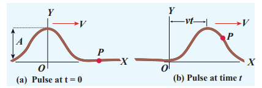

\(t = 0\) வி நேரத்தில் நீட்டப்பட்ட சரத்தில் ஒரு இழுப்பைக் கொடுக்கிறோம் என்று வைத்துக்கொள்வோம். இந்த கிளர்ச்சியின் போது உருவாக்கப்பட்ட அலைத் துடிப்பு படம் 11.23 (a) இல் காட்டப்பட்டுள்ளபடி நிலையான வேகம் \(v\) உடன் நேர்மறை \(x\) திசையில் நகர்கிறது என்று வைத்துக்கொள்வோம்.

\(t = 0\) வி நேரத்தில் அலைத் துடிப்பின் வடிவத்தை கணித ரீதியாக \(y = y(x, 0) = f(x)\) எனக் குறிப்பிடலாம். பரவலின் போது அலைத் துடிப்பின் வடிவம் அப்படியே இருக்கும் என்று வைத்துக்கொள்வோம். சிறிது நேரம் \(t\) கழித்து, வலது பக்கம் நகரும் துடிப்பு மற்றும் அதன் மீதுள்ள எந்த ஒரு புள்ளியும் படம் 11.23 (b) இல் காட்டப்பட்டுள்ளபடி \(x'\) ஆல் குறிக்கப்படலாம். பின்னர்,

\[
y(x, t) = f(x') = f(x - vt) \tag{11.35}
\]

இதேபோல், அலைத் துடிப்பு நிலையான வேகத்தில் இடது பக்கம் நகர்ந்தால், \(y = f(x + vt)\). \(y = f(x + vt)\) மற்றும் \(y = f(x - vt)\) ஆகிய இரண்டு அலைகளும் அலைச் சமன்பாடு எனப்படும் பின்வரும் ஒரு பரிமாண வகையீட்டுச் சமன்பாட்டைப் பூர்த்தி செய்யும்

\[
\frac{\partial^{2} y}{\partial x^{2}} = \frac{1}{v^{2}} \frac{\partial^{2} y}{\partial t^{2}} \tag{11.36}
\]

இங்கு \(\partial\) குறியீடு பகுதி வகைக்கெழுவைக் குறிக்கிறது ( \(\partial y / \partial x\) என்பதை x ஆல் பகுதி y எனப் படிக்கவும்). இந்த வகையீட்டுச் சமன்பாட்டை பூர்த்தி செய்யும் அனைத்து தீர்வுகளும் அலைகளைக் குறிக்க முடியாது, ஏனெனில் இயற்பியல் ரீதியாக ஏற்கத்தக்க எந்த அலையும் \(x\) மற்றும் \(t\) இன் அனைத்து மதிப்புகளுக்கும் வரையறுக்கப்பட்ட மதிப்புகளை எடுக்க வேண்டும். ஆனால் செயல்பாடு ஒரு அலையைக் குறித்தால், அது வகையீட்டுச் சமன்பாட்டைப் பூர்த்தி செய்ய வேண்டும். ஒரு பரிமாணத்தில் (ஒரு சார்பற்ற மாறி), \(x\) ஐப் பொறுத்த பகுதி வகைக்கெழு, \(x\) ஆயத்தில் உள்ள மொத்த வகைக்கெழுவிற்குச் சமம் என்பதால், நாம் எழுதுகிறோம்

\[
\frac{d^{2} y}{d x^{2}} = \frac{1}{v^{2}} \frac{d^{2} y}{d t^{2}} \tag{11.37}
\]

இது ஒன்றுக்கும் மேற்பட்ட பரிமாணங்களுக்கு (இரண்டு, மூன்று, போன்றவை) நீட்டிக்கப்படலாம். இங்கு, எளிமைக்காக, நாம் ஒரு பரிமாண அலை சமன்பாட்டில் மட்டுமே கவனம் செலுத்துகிறோம்.

---

**எடுத்துக்காட்டு 11.11**

\(a\) இன் வெவ்வேறு மதிப்புகளுக்கு \(y = x - a\) ஐ வரைக.

**_தீர்வு_**

\(a\) இன் மதிப்பை அதிகரிக்கும் போது, கோடு வலது பக்கம் நகர்கிறது என்பதை இது குறிக்கிறது. \(a = vt\) க்கு, \(y = x - vt\) வகையீட்டுச் சமன்பாட்டைப் பூர்த்தி செய்கிறது. இந்தச் செயல்பாடு வகையீட்டுச் சமன்பாட்டைப் பூர்த்தி செய்தாலும், அது \(x\) மற்றும் \(t\) இன் அனைத்து மதிப்புகளுக்கும் வரையறுக்கப்பட்டதாக இல்லை. எனவே, இது ஒரு அலையைக் குறிக்காது.

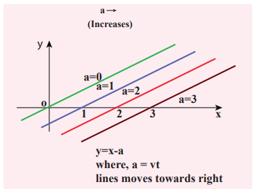

---

**எடுத்துக்காட்டு 11.12**

\(a = 0\), \(a = \frac{\pi}{2}\), \(a = \frac{3\pi}{2}\) மற்றும் \(a = \pi\) ஆகியவற்றிற்கு \(y = \sin(x - a)\) என்ற அலை எப்படி இருக்கும்? இந்த அலையை வரைக.

**_தீர்வு_**

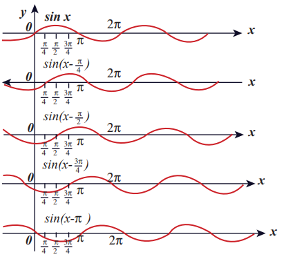

மேலே உள்ள படத்தில் இருந்து, \(a = 0\), \(a = \frac{\pi}{2}\), \(a = \frac{3\pi}{2}\) மற்றும் \(a = \pi\) க்கு \(y = \sin(x - a)\) செயல்பாடு வலது பக்கம் நகர்கிறது என்பதை நாம் அவதானிக்கிறோம். மேலும், \(a = vt\) மற்றும் \(v = \frac{\pi}{4}\) என எடுத்துக்கொண்டு, வெவ்வேறு நேரங்களுக்கு \(t = 0\) வி, \(t = 1\) வி, \(t = 2\) வி, முதலியவற்றுக்கு வரைந்தால், \(y = \sin(x - vt)\) வலது பக்கம் நகர்கிறது என்பதை மீண்டும் அவதானிக்கிறோம். எனவே, \(y = \sin(x - vt)\) என்பது வலது பக்கம் நகரும் ஒரு பயண (அல்லது முற்போக்கு) அலையாகும். \(y = \sin(x + vt)\) என்றால், பயண (அல்லது முற்போக்கு) அலை இடது பக்கம் நகரும். இவ்வாறு, \(y = f(x - vt)\) வகையின் எந்தத் தன்னிச்சையான செயல்பாடும் அலையைக் குறித்தால், அது வலது பக்கம் நகர வேண்டும், இதேபோல், \(y = f(x + vt)\) வகையின் எந்தத் தன்னிச்சையான செயல்பாடும் அலையைக் குறித்தால், அது இடது பக்கம் நகர வேண்டும்.

---

**எடுத்துக்காட்டு 11.13**

\(y = \sin(x - vt)\) அலையின் பரிமாணத்தைச் சரிபார்க்கவும். இது பரிமாண ரீதியாக தவறானதாக இருந்தால், மேலே உள்ள சமன்பாட்டை சரியான வடிவத்தில் எழுதுங்கள்.

**_தீர்வு_** பரிமாண ரீதியாக இது சரியானதல்ல. \(y = \sin(x - vt)\) என்பது ஒரு பரிமாணமற்ற அளவாக இருக்க வேண்டும் என்பதை நாம் அறிவோம், ஆனால் \(x - vt\) பரிமாணத்தைக் கொண்டுள்ளது. சரியான சமன்பாடு \(y = \sin(kx - \omega t)\), இங்கு \(k\) மற்றும் \(\omega\) ஆகியவை முறையே நீளத்தின் தலைகீழ் மற்றும் நேரத்தின் தலைகீழ் பரிமாணங்களைக் கொண்டுள்ளன. சைன் சார்புகள் மற்றும் கொசைன் சார்புகள் \(2\pi\) கால அளவைக் கொண்ட காலச் சார்புகளாகும். எனவே, சரியான கோவை

\[
y = \sin\left( \frac{2\pi}{\lambda} x - \frac{2\pi}{T} t \right)
\]

இங்கு \(\lambda\) மற்றும் \(T\) ஆகியவை முறையே அலைநீளம் மற்றும் கால அளவு. பொதுவாக,

\[
y(x, t) = A \sin(kx - \omega t)
\]


---

### அலையின் வரைகலை விளக்கம்

அலை மாறுபாட்டின் இரண்டு வடிவங்களை வரைகலை முறையில் குறிப்பிடுவோம்

**(a)** வெளி (அல்லது வெளியீட்டு) மாறுபாட்டு வரைபடம் **(b)** நேர (அல்லது கால) மாறுபாட்டு வரைபடம்

**(a) வெளி மாறுபாட்டு வரைபடம்**

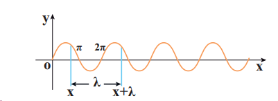

நேரத்தை நிலையாக வைத்துக்கொண்டு, \(x\) ஐப் பொறுத்து இடப்பெயர்ச்சியில் ஏற்படும் மாற்றம் வரையப்படுகிறது. படம் 11.24 இல் காட்டப்பட்டுள்ளபடி, \(y = A \sin(kx)\) என்ற சைனூசாய்டல் வரைபடத்தைக் கருத்தில் கொள்வோம், இங்கு \(k\) என்பது ஒரு மாறிலி. \(\lambda\) அலைநீளம், ஒரே இயக்க நிலையில் உள்ள எந்த இரண்டு புள்ளிகளுக்கும் இடையிலான தூரத்தைக் குறிப்பதால், \(y = x\) மற்றும் \(y = x + \lambda\) ஆகிய இரண்டு முனைகளிலும் இடப்பெயர்ச்சி \(y\) ஒன்றுதான், அதாவது,

\[
y = A \sin(kx) = A \sin(k(x + \lambda)) = A \sin(kx + k\lambda) \tag{11.38}
\]

சைன் சார்பு \(2\pi\) கால அளவைக் கொண்ட ஒரு காலச் சார்பாகும். எனவே,

\[
y = A \sin(kx + 2\pi) = A \sin(kx) \tag{11.39}
\]

சமன்பாடு (11.38) மற்றும் சமன்பாடு (11.39) ஐ ஒப்பிடும்போது, நாம் பெறுவது

\[
kx + k\lambda = kx + 2\pi
\]

இது குறிக்கிறது

\[
k = \frac{2\pi}{\lambda} \, \text{ரேட் மீ}^{-1} \tag{11.40}
\]

இங்கு \(k\) அலை எண் எனப்படும். \(2\pi\) ரேடியன்களில் எத்தனை அலைநீளங்கள் உள்ளன என்பதை இது அளவிடுகிறது.

அலையின் வெளி கால முறைமை \(\lambda\) மீ. பின்னர், \(t = 0\) வி இல், \(y(x, 0) = y(x + \lambda, 0)\) மற்றும் எந்த நேரத்திலும் \(t\), \(y(x, t) = y(x + \lambda, t)\).

---

**எடுத்துக்காட்டு 11.14**

இரண்டு சைன் அலைகளின் அலைநீளங்கள் \(\lambda_1 = 1\) மீ மற்றும் \(\lambda_2 = 6\) மீ. தொடர்புடைய அலை எண்களைக் கணக்கிடுங்கள்.

**_தீர்வு_**

\[
k_1 = \frac{2\pi}{1} = 6.28 \, \text{ரேட் மீ}^{-1}
\]
\[
k_2 = \frac{2\pi}{6} = 1.05 \, \text{ரேட் மீ}^{-1}
\]

---

**(b) நேர மாறுபாட்டு வரைபடம்**

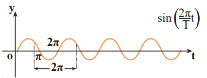

நிலையை நிலையாக வைத்துக்கொண்டு, நேரத்தைப் பொறுத்து இடப்பெயர்ச்சியில் ஏற்படும் மாற்றம் வரையப்படுகிறது. படம் 11.25 இல் காட்டப்பட்டுள்ளபடி, \(y = A \sin(\omega t)\) என்ற சைனூசாய்டல் வரைபடத்தைக் கருத்தில் கொள்வோம், இங்கு \(\omega\) என்பது அலையின் கோண அதிர்வெண் ஆகும், இது அலை எவ்வளவு விரைவாக நேரத்தில் அலைவுறுகிறது அல்லது ஒரு விநாடிக்கு எத்தனை சுழற்சிகள் என்பதை அளவிடுகிறது.

தற்காலிக கால முறைமை அல்லது கால அளவு \(T = \frac{2\pi}{\omega}\) வினாடிகள்.

கோண அதிர்வெண் \(\omega = 2\pi f\) என்ற கோவை மூலம் அதிர்வெண் \(f\) உடன் தொடர்புடையது, இங்கு \(f\) என்பது ஊடகத் துகள் ஒரு வினாடியில் செய்யும் அலைவுகளின் எண்ணிக்கை என வரையறுக்கப்படுகிறது. அதிர்வெண்ணின் தலைகீழ் கால அளவு என்பதால்,

\[
T = \frac{1}{f} \, \text{வினாடிகளில்}
\]

இது ஒரு ஊடகத் துகள் ஒரு முழு அலைவை முடிக்க எடுத்துக்கொள்ளும் நேரமாகும். எனவே, ஒரு அலையின் வேகத்தை (அலை வேகம், \(v\)) ஒரு வினாடிக்கு அலை கடக்கும் தூரம் என வரையறுக்கலாம், இது நாம் சமன்பாட்டில் (11.4) பெற்ற அதே உறவாகும்.

### துகள் திசைவேகம் மற்றும் அலை திசைவேகம்

ஒரு தள முற்போக்கு இசை அலையில், ஊடகத்தில் உள்ள உட்பொருள் துகள்கள் அவற்றின் சமநிலை நிலைகளைப் பற்றி தனி இசை முறையில் அலைவுறுகின்றன. ஒரு துகள் இயக்கத்தில் இருக்கும்போது, எந்த ஒரு கணத்திலும் இடப்பெயர்ச்சியின் மாற்ற விகிதம் அந்த கணத்தில் துகளின் திசைவேகம் என வரையறுக்கப்படுகிறது. இது துகள் திசைவேகம் என அழைக்கப்படுகிறது.

\[
v_P = \frac{dy}{dt} \, \text{மீ வி}^{-1} \tag{11.41}
\]

ஆனால்

\[
y(x, t) = A \sin(kx - \omega t) \tag{11.42}
\]

எனவே,

\[
\frac{dy}{dt} = -\omega A \cos(kx - \omega t) \tag{11.43}
\]

இதேபோல், பயண அலைக்கு (அல்லது முற்போக்கு அலைக்கு) திசைவேகத்தை (இங்கு வேகத்தை) வரையறுக்கலாம். ஒரு முற்போக்கு அலையின் திசைவேகத்தைத் தீர்மானிக்க, வலது பக்கம் நகரும் ஒரு முற்போக்கு அலையைக் (படம் 11.23 இல் காட்டப்பட்டுள்ளது) கருத்தில் கொள்வோம். இது ஒரு சைனூசாய்டல் அலையாகக் கணித ரீதியில் குறிப்பிடப்படலாம். அலையின் கட்டத்தில் \(P\) ஒரு புள்ளியாகவும், அதன் சராசரி நிலையைப் பொறுத்து இடப்பெயர்ச்சி \(y_P\) ஆகவும் இருக்கட்டும். ஒரு கணம் \(t\) இல் அலையின் இடப்பெயர்ச்சி

\[
y = y(x, t) = A \sin(kx - \omega t)
\]

அடுத்த கணம் \(t' = t + \Delta t\) இல், \(P\) புள்ளியின் நிலை \(x' = x + \Delta x\) ஆகும். எனவே, இந்தக் கணத்தில் அலையின் இடப்பெயர்ச்சி

\[
y = y(x', t') = y(x + \Delta x, t + \Delta t) = A \sin[k(x + \Delta x) - \omega(t + \Delta t)] \tag{11.44}
\]

அலையின் வடிவம் அப்படியே இருப்பதால், அலையின் கட்டம் மாறிலியாக இருப்பதைக் (அதாவது, புள்ளியின் \(y\)-இடப்பெயர்ச்சி ஒரு மாறிலி) குறிக்கிறது. எனவே, சமன்பாடு (11.42) மற்றும் சமன்பாடு (11.44) ஐ சமன் செய்தால், \(y(x', t') = y(x, t)\) கிடைக்கும், இது குறிக்கிறது

\[
A \sin[k(x + \Delta x) - \omega(t + \Delta t)] = A \sin(kx - \omega t)
\]

அல்லது

\[
k(x + \Delta x) - \omega(t + \Delta t) = kx - \omega t = \text{மாறிலி} \tag{11.45}
\]

சமன்பாடு (11.45) ஐ எளிமைப்படுத்தும்போது,

\[
v = \frac{\Delta x}{\Delta t} = \frac{\omega}{k} = v_p \tag{11.46}
\]

இங்கு \(v_p\) அலை திசைவேகம் அல்லது கட்டத் திசைவேகம் எனப்படும்.

கோண அதிர்வெண் மற்றும் அலை எண்ணை அதிர்வெண் மற்றும் அலைநீளத்தின் அடிப்படையில் வெளிப்படுத்துவதன் மூலம், \(v = f\lambda\) ஐப் பெறுகிறோம்.

---

**எடுத்துக்காட்டு 11.15**

ஒரு கைப்பேசி கோபுரம் 900 மெகா ஹெர்ட்ஸ் அதிர்வெண் கொண்ட அலை சமிக்ஞையை அனுப்புகிறது. கைப்பேசி கோபுரத்திலிருந்து அனுப்பப்படும் அலைகளின் நீளத்தைக் கணக்கிடுங்கள்.

**_தீர்வு_**

அதிர்வெண், \(f = 900 \, \text{MHz} = 900 \times 10^{6} \, \text{Hz}\)

அலையின் வேகம் \(c = 3 \times 10^{8} \, \text{மீ வி}^{-1}\)

\[
\lambda = \frac{c}{f} = \frac{3 \times 10^{8}}{900 \times 10^{6}} = \frac{1}{3} \, \text{மீ} = 0.33 \, \text{மீ}
\]

---

## மேற்பொருட்கோள் கொள்கை

ஒரு முனையில் கட்டப்பட்ட நீட்டப்பட்ட சரத்திற்கு ஒரு இழுப்பு கொடுக்கப்படும்போது, ஒரு அலைத் துடிப்பு உருவாகிறது, மேலும் துடிப்பு சரத்தின் வழியாகப் பயணிக்கிறது. சரத்தை இருபுறமும் பிடித்திருக்கும் இரண்டு நபர்கள் ஒரே நேரத்தில் ஒரு இழுப்பைக் கொடுக்கிறார்கள் என்று வைத்துக்கொள்வோம், பின்னர் இந்த இரண்டு அலைத் துடிப்புகளும் ஒன்றையொன்று நோக்கி நகர்ந்து, சில புள்ளிகளில் சந்தித்து, அவற்றின் அசல் அடையாளத்துடன் ஒன்றையொன்று விட்டு விலகிச் செல்கின்றன. அவற்றின் நடத்தை கடக்கும்/சந்திக்கும் புள்ளிகளில் மட்டுமே மிகவும் வித்தியாசமாக இருக்கும்; இந்த நடத்தை இரண்டு துடிப்புகளும் ஒரே வடிவத்தைக் கொண்டுள்ளதா அல்லது வேறுபட்ட வடிவத்தைக் கொண்டுள்ளதா என்பதைப் பொறுத்தது, படம் 11.26 இல் காட்டப்பட்டுள்ளது.


துடிப்புகள் ஒரே வடிவத்தைக் கொண்டிருக்கும்போது, கடக்கும் இடத்தில், மொத்த இடப்பெயர்ச்சி என்பது அவற்றின் தனிப்பட்ட இடப்பெயர்ச்சிகளின் இயற்கணிதத் தொகையாகும், எனவே அதன் நிகர வீச்சு தனிப்பட்ட துடிப்புகளின் வீச்சுகளை விட அதிகமாகும். அதேசமயம், இரண்டு துடிப்புகளும் ஒரே வீச்சைக் கொண்டிருந்தாலும், கடக்கும் புள்ளியில் வடிவங்கள் 180° கட்டத்திற்கு வெளியே இருந்தால், நிகர வீச்சு அந்த புள்ளியில் மறைந்துவிடும், மேலும் துடிப்புகள் கடந்த பிறகு அவற்றின் அடையாளங்களை மீண்டும் பெறும். அலைகள் மட்டுமே இத்தகைய விசித்திரமான பண்பைக் கொண்டிருக்க முடியும், மேலும் இது அலைகளின் மேற்பொருட்கோள் என்று அழைக்கப்படுகிறது. அதாவது, அலைகள் ஒன்றுடன் ஒன்று ஒன்றுபடும் போது அவற்றின் நிகர நடத்தையை மேற்பொருட்கோள் கொள்கை விளக்குகிறது.

எத்தனை அலைகளுக்கும் பொதுமைப்படுத்துதல், அதாவது, ஒரு ஊடகத்தில் இரண்டு அல்லது அதற்கு மேற்பட்ட அலைகள் ஒரே நேரத்தில் நகர்ந்தால், அவை ஒன்றுபடும் போது, அவற்றின் மொத்த இடப்பெயர்ச்சி என்பது தனிப்பட்ட இடப்பெயர்ச்சிகளின் திசையன் கூட்டுத்தொகையாகும். அலைகள் அலை சமன்பாட்டைப் பூர்த்தி செய்கின்றன என்பதை நாம் அறிவோம், இது வெளி ஆயங்கள் மற்றும் நேரம் இரண்டிலும் ஒரு நேரியல் இரண்டாம் வரிசை சமபடித்தான பகுதி வகையீட்டுச் சமன்பாடாகும். எனவே, அவற்றின் நேரியல் சேர்க்கை (பெரும்பாலும் அலைகளின் நேரியல் மேற்பொருட்கோள் என்று அழைக்கப்படுகிறது) அதே வகையீட்டுச் சமன்பாட்டையும் பூர்த்தி செய்யும்.

கணித ரீதியாகப் புரிந்துகொள்ள, அலைகளின் இடப்பெயர்ச்சியைக் குறிக்கும் இரண்டு சார்புகளைக் கருத்தில் கொள்வோம், எடுத்துக்காட்டாக,

\[
y_1 = A_1 \sin(kx - \omega t)
\]
மற்றும்
\[
y_2 = A_2 \cos(kx - \omega t)
\]

\(y_1\) மற்றும் \(y_2\) இரண்டும் அலை சமன்பாட்டைப் பூர்த்தி செய்வதால் (அலை சமன்பாட்டின் தீர்வுகள்), பின்னர் அவற்றின் இயற்கணிதத் தொகை

\[
y = y_1 + y_2
\]

மேலும் அலை சமன்பாட்டைப் பூர்த்தி செய்யும். அதாவது, இடப்பெயர்ச்சிகள் கூட்டத்தக்கவை. நாம் \(y_1\) மற்றும் \(y_2\) ஐ சில மாறிலிகளால் பெருக்கினால், அவற்றின் வீச்சு அந்த மாறிலியால் அளவிடப்படுகிறது. மேலும், \(C_1\) மற்றும் \(C_2\) ஆகியவை முறையே \(y_1\) மற்றும் \(y_2\) இடப்பெயர்ச்சிகளைப் பெருக்கப் பயன்படுத்தப்பட்டால், அவற்றின் நிகர இடப்பெயர்ச்சி \(y\) என்பது \(y = C_1 y_1 + C_2 y_2\) ஆகும்.

இது எத்தனை அலைகளுக்கும் பொதுமைப்படுத்தப்படலாம். ஒன்றுக்கும் மேற்பட்ட பரிமாணங்களில் இத்தகைய \(n\) அலைகள் இருந்தால், திசையன் குறியீட்டைப் பயன்படுத்தி இடப்பெயர்ச்சிகள் எழுதப்படுகின்றன.

இங்கு, நிகர இடப்பெயர்ச்சி \(y\) என்பது

\[
\vec{y} = \sum_{i=1}^{n} \vec{y}_i
\]

மேற்பொருட்கோள் கொள்கை பின்வருவனவற்றை விளக்க முடியும்:

(a) வெளி (அல்லது வெளியீட்டு) குறுக்கீடு (குறுக்கீடு என்றும் அழைக்கப்படுகிறது)

(b) நேர (அல்லது கால) குறுக்கீடு (துடிப்புகள் என்றும் அழைக்கப்படுகிறது)

(c) நிலையான அலைகளின் கருத்து

மேற்பொருட்கோள் கொள்கைக்குக் கீழ்ப்படியும் அலைகள் நேரியல் அலைகள் எனப்படும் (வீச்சு அவற்றின் அலைநீளங்களை விட மிகச் சிறியது). பொதுவாக, அலையின் வீச்சு சிறியதாக இல்லாவிட்டால், அவை நேரியல் அல்லாத அலைகள் எனப்படும். இவை நேரியல் மேற்பொருட்கோள் கொள்கையை மீறுகின்றன, எ.கா., லேசர். இந்த அத்தியாயத்தில், நாம் நேரியல் அலைகளில் மட்டுமே நமது கவனத்தைச் செலுத்துவோம்.

பின்வரும் விஷயங்களை வெவ்வேறு உட்பிரிவுகளில் விவாதிப்போம்:

### அலைகளின் குறுக்கீடு


**குறுக்கீடு** என்பது ஒரு நிகழ்வாகும், இதில் இரண்டு அலைகள் ஒன்றுசேர்ந்து, அதிக, குறைவான அல்லது அதே வீச்சினைக் கொண்ட ஒரு விளைவு அலையை உருவாக்குகின்றன.

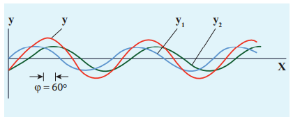

ஒரே மாதிரியான அதிர்வெண்கள், மாறிலியான கட்ட வேறுபாடு \(\phi\) மற்றும் ஒரே அலை வடிவம் (ஒருங்கிணைந்த மூலமாகக் கருதப்படும்) கொண்ட இரண்டு இசை அலைகளைக் கருத்தில் கொள்வோம், ஆனால் \(A_1\) மற்றும் \(A_2\) வீச்சுகளைக் கொண்டவை, பின்னர்

\[
y_1 = A_1 \sin(kx - \omega t) \tag{11.47}
\]
\[
y_2 = A_2 \sin(kx - \omega t + \phi) \tag{11.48}
\]

அவை ஒரு குறிப்பிட்ட திசையில் ஒரே நேரத்தில் நகர்கின்றன என்று வைத்துக்கொள்வோம், பின்னர் குறுக்கீடு ஏற்படுகிறது (அதாவது, இந்த இரண்டு அலைகளின் ஒன்றுசேர்தல்). கணித ரீதியாக

\[
y = y_1 + y_2 \tag{11.49}
\]

எனவே, சமன்பாடு (11.47) மற்றும் சமன்பாடு (11.48) ஐ சமன்பாட்டில் (11.49) பிரதியிட, நாம் பெறுவது

\[
y = A_1 \sin(kx - \omega t) + A_2 \sin(kx - \omega t + \phi)
\]

முக்கோணவியல் முற்றொருமை \(\sin(\alpha + \beta) = \sin\alpha \cos\beta + \cos\alpha \sin\beta\) ஐப் பயன்படுத்தி, நாம் பெறுவது

\[
y = A_1 \sin(kx - \omega t) + A_2 [\sin(kx - \omega t) \cos\phi + \cos(kx - \omega t) \sin\phi]
\]
\[
y = \sin(kx - \omega t)(A_1 + A_2 \cos\phi) + A_2 \sin\phi \cos(kx - \omega t) \tag{11.50}
\]

மறுவரையறை செய்வோம்

\[
A \cos\theta = (A_1 + A_2 \cos\phi) \tag{11.51}
\]
மற்றும்
\[
A \sin\theta = A_2 \sin\phi \tag{11.52}
\]

பின்னர் சமன்பாடு (11.50) ஐ இவ்வாறு மாற்றி எழுதலாம்

\[
y = A \sin(kx - \omega t) \cos\theta + A \cos(kx - \omega t) \sin\theta
\]
\[
y = A (\sin(kx - \omega t) \cos\theta + \sin\theta \cos(kx - \omega t))
\]
\[
y = A \sin(kx - \omega t + \theta) \tag{11.53}
\]

சமன்பாடு (11.51) மற்றும் சமன்பாடு (11.52) ஐ வர்க்கப்படுத்தி கூட்டுவதன் மூலம், நாம் பெறுவது

\[
A^2 = A_1^2 + A_2^2 + 2A_1 A_2 \cos\phi \tag{11.54}
\]

செறிவு என்பது வீச்சின் வர்க்கம் (\(I = A^2\)) என்பதால், நாம் பெறுவது

\[
I = I_1 + I_2 + 2\sqrt{I_1 I_2} \cos\phi \tag{11.55}
\]

எந்த ஒரு புள்ளியிலும் விளைவு செறிவு, அந்த புள்ளியில் உள்ள கட்ட வேறுபாட்டைப் பொறுத்தது என்பதை இது குறிக்கிறது.

**(a) ஆக்கபூர்வமான குறுக்கீட்டிற்கு:**

ஒரு அலையின் முகடுகள் மற்றொரு அலையின் முகடுகளுடன் ஒன்றுபடும்போது, அவற்றின் வீச்சுகள் கூடும், மேலும் நாம் ஆக்கபூர்வமான குறுக்கீட்டைப் பெறுகிறோம். விளைவு அலையானது தனிப்பட்ட அலைகளை விட பெரிய வீச்சினைக் கொண்டுள்ளது, படம் 11.29 (a) இல் காட்டப்பட்டுள்ளது. ஒரு புள்ளியில் அதிகபட்ச செறிவு இருந்தால், அந்த புள்ளியில் ஆக்கபூர்வமான குறுக்கீடு ஏற்படுகிறது, அதாவது

\[
\cos\phi = +1 \Rightarrow \phi = 0, 2\pi, 4\pi, \ldots = 2n\pi, \text{ இங்கு } n = 0, 1, 2, \ldots
\]

இது இரண்டு அலைகள் ஒன்றுசேர்ந்து ஆக்கபூர்வமான குறுக்கீட்டைக் கொடுக்கும் கட்ட வேறுபாடு ஆகும்.

எனவே, இந்த விளைவு அலையில்,

\[
A = A_1 + A_2
\]
\[
I_{\text{max}} = I_1 + I_2 + 2\sqrt{I_1 I_2} = (\sqrt{I_1} + \sqrt{I_2})^2
\]


**(b) அழிவுகரமான குறுக்கீட்டிற்கு:** ஒரு அலையின் அகழி மற்றொரு அலையின் முகட்டுடன் ஒன்றுபடும்போது, அவற்றின் வீச்சுகள் ஒன்றையொன்று “ரத்து” செய்கின்றன, மேலும் படம் 11.29 (b) இல் காட்டப்பட்டுள்ளபடி அழிவுகரமான குறுக்கீட்டைப் பெறுகிறோம். விளைவு வீச்சு கிட்டத்தட்ட பூஜ்ஜியமாகும். ஒரு புள்ளியில் குறைந்தபட்ச செறிவு இருந்தால், அந்த புள்ளியில் அழிவுகரமான குறுக்கீடு ஏற்படுகிறது, அதாவது

\[
\cos\phi = -1 \Rightarrow \phi = \pi, 3\pi, 5\pi, \ldots = (2n-1)\pi, \text{ இங்கு } n = 0, 1, 2, \ldots
\]

இது இரண்டு அலைகள் ஒன்றுசேர்ந்து அழிவுகரமான குறுக்கீட்டைக் கொடுக்கும் கட்ட வேறுபாடு ஆகும். எனவே,

\[
A = |A_1 - A_2|
\]
\[
I_{\text{min}} = I_1 + I_2 - 2\sqrt{I_1 I_2} = (\sqrt{I_1} - \sqrt{I_2})^2
\]

படம் 11.30 இல் காட்டப்பட்டுள்ளபடி, ஒலி அலைகளின் குறுக்கீட்டை வெளிப்படுத்தும் ஒரு எளிய கருவியைக் கருத்தில் கொள்வோம்.


ஒரு ஒலிபெருக்கி S இலிருந்து ஒரு ஒலி அலை குழாய் P வழியாக அனுப்பப்படுகிறது. இது ஒரு T-வடிவ சந்திப்பு போல் தெரிகிறது. இந்த வழக்கில், ஒலி ஆற்றலில் பாதி ஒரு திசையிலும், மீதமுள்ள பாதி எதிர் திசையிலும் அனுப்பப்படுகிறது. எனவே, பெறுநர் R ஐ அடையும் ஒலி அலைகள் இரண்டு பாதைகளில் ஒன்றின் வழியாகப் பயணிக்கலாம். பேச்சாளரிடமிருந்து பெறுநருக்கு எந்தப் பாதையிலும் ஒலி அலை கடக்கும் தூரம் பாதை நீளம் எனப்படும். படம் 11.30 இலிருந்து, கீழ் பாதை நீளம் நிலையானது, ஆனால் மேல் குழாயை நழுவச் செய்வதன் மூலம் மேல் பாதை நீளம் மாறுபடும், அதாவது \(r_2\) மாறுபடும். பாதை நீளத்தில் உள்ள வேறுபாடு பாதை வேறுபாடு என அழைக்கப்படுகிறது,

\[
\Delta r = |r_2 - r_1|
\]

பாதை வேறுபாடு பூஜ்ஜியமாகவோ அல்லது அலைநீளம் \(\lambda\) இன் முழு எண் மடங்காகவோ இருக்க அனுமதிக்கப்படுகிறது என்று வைத்துக்கொள்வோம். கணித ரீதியாக,

\[
\Delta r = n\lambda \quad \text{இங்கு, } n = 0, 1, 2, 3, \ldots
\]

பின்னர் \(r_1\) மற்றும் \(r_2\) பாதைகளில் இருந்து வரும் இரண்டு அலைகளும், எந்த ஒரு கணத்திலும் பெறுநரை ஒரே கட்டத்தில் (கட்ட வேறுபாடு 0° அல்லது \(2\pi\)) அடைந்து, ஆக்கபூர்வமாக குறுக்கிடுகின்றன, படம் 11.31 இல் காட்டப்பட்டுள்ளது.


எனவே, இந்த வழக்கில், அதிகபட்ச ஒலி செறிவு பெறுநரால் கண்டறியப்படுகிறது. பாதை வேறுபாடு \(\lambda\) அலைநீளத்தின் ஒற்றைப்படை-முழு எண் (அல்லது அரை-முழு எண்) மடங்காக இருந்தால்,

கணித ரீதியாக,
\[
\Delta r = n \frac{\lambda}{2}, \text{ இங்கு } n = 1, 3, 5, \ldots \text{ (\(n\) ஒற்றைப்படை)}
\]

பின்னர் \(r_1\) மற்றும் \(r_2\) பாதைகளில் இருந்து வந்து, எந்த ஒரு கணத்திலும் பெறுநரை அடையும் இரண்டு அலைகளும், எதிர் கட்டத்தில் (π அல்லது 180° கட்ட வேறுபாடு) இருக்கும். அவை படம் 11.32 இல் காட்டப்பட்டுள்ளபடி அழிவுகரமாக குறுக்கிடுகின்றன. அவை ஒன்றையொன்று ரத்து செய்யும்.

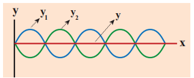

எனவே, வீச்சு குறைந்தபட்சம் அல்லது பூஜ்ஜிய வீச்சு, அதாவது ஒலி இல்லை. இந்த வழக்கில் பெறுநரால் எந்த ஒலி செறிவும் கண்டறியப்படவில்லை. பாதை வேறுபாட்டிற்கும் கட்ட வேறுபாட்டிற்கும் இடையிலான தொடர்பு

\[
\text{கட்ட வேறுபாடு} = \frac{2\pi}{\lambda} (\text{பாதை வேறுபாடு}) \tag{11.56}
\]

i.e.,
\[
\Delta\phi = \frac{2\pi}{\lambda} \Delta r
\]

---

**எடுத்துக்காட்டு 11.16**

கீழே உள்ள படத்தில் காட்டப்பட்டுள்ளபடி A மற்றும் B என்ற இரண்டு மூலங்களைக் கவனியுங்கள். இரண்டு மூலங்களும் ஒரே அதிர்வெண் கொண்ட ஆனால் வெவ்வேறு வீச்சுகள் கொண்ட தனி இசை அலைகளை வெளிப்படுத்துகின்றன, மேலும் இரண்டும் ஒரே கட்டத்தில் (ஒரே கட்டம்) உள்ளன. படத்தில் காட்டப்பட்டுள்ளபடி A மற்றும் B இலிருந்து சம தூரத்தில் O எந்த ஒரு புள்ளியாக இருக்கட்டும். O, Y மற்றும் X புள்ளிகளில் உள்ள செறிவைக் கணக்கிடுங்கள். (X மற்றும் Y ஆகியவை A & B இலிருந்து சம தூரத்தில் இல்லை)

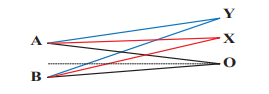

**_தீர்வு_**

OA மற்றும் OB இடையே உள்ள தூரம் ஒன்றுதான், எனவே A மற்றும் B இலிருந்து தொடங்கும் அலைகள் சம தூரங்களைக் கடந்த பிறகு (சம பாதை நீளங்கள்) O வை அடைகின்றன. எனவே, O இல் இரண்டு அலைகளுக்கு இடையிலான பாதை வேறுபாடு பூஜ்ஜியமாகும்.

\(OA - OB = 0\)

அலைகள் ஒரே கட்டத்தில் இருப்பதால், O புள்ளியில், இரண்டு அலைகளுக்கு இடையிலான கட்ட வேறுபாடும் பூஜ்ஜியமாகும். எனவே, O புள்ளியில் விளைவு செறிவு அதிகபட்சமாகும். Y என்ற ஒரு புள்ளியைக் கருதுவோம், இதில் இரண்டு அலைகளுக்கு இடையிலான பாதை வேறுபாடு \(\lambda\) ஆகும். பின்னர் Y இல் உள்ள கட்ட வேறுபாடு

\[
\Delta\phi = \frac{2\pi}{\lambda} \times \lambda = 2\pi
\]

எனவே, Y புள்ளியில், A மற்றும் B இலிருந்து வரும் இரண்டு அலைகளும் ஒரே கட்டத்தில் உள்ளன, எனவே, செறிவு அதிகபட்சமாக இருக்கும். X என்ற ஒரு புள்ளியைக் கருதுவோம், இரண்டு அலைகளுக்கு இடையிலான பாதை வேறுபாடு \(\frac{\lambda}{2}\) ஆக இருக்கட்டும். பின்னர் X இல் உள்ள கட்ட வேறுபாடு

\[
\Delta\phi = \frac{2\pi}{\lambda} \times \frac{\lambda}{2} = \pi
\]

எனவே, X புள்ளியில், அலைகள் சந்தித்து எதிர் கட்டத்தில் உள்ளன. எனவே, அழிவுகரமான குறுக்கீடு காரணமாக, செறிவு குறைந்தபட்சமாக இருக்கும்.

---

**எடுத்துக்காட்டு 11.17**

C மற்றும் E என்ற இரண்டு ஒலிபெருக்கிகள் 5 மீ இடைவெளியில் வைக்கப்பட்டு, ஒரே மூலத்தால் இயக்கப்படுகின்றன. C மற்றும் E இன் நடுப்புள்ளி O இலிருந்து 10 மீ தொலைவில் A இல் ஒரு மனிதன் நிற்கிறான். படத்தில் காட்டப்பட்டுள்ளபடி, மனிதன் O புள்ளியை நோக்கி 1 மீ (OC க்கு இணையாக) நடக்கிறான். அவன் B இல் ஒலி செறிவில் முதல் குறைந்தபட்சத்தைப் பெறுகிறான். பின்னர் மூலத்தின் அதிர்வெண்ணைக் கணக்கிடுங்கள். (ஒலியின் வேகம் = 343 மீ வி\(^{-1}\) எனக் கொள்க)

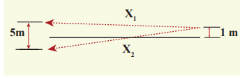

**_தீர்வு_**

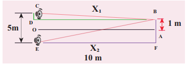

B புள்ளியை அடையும் இரண்டு அலைகளும் 180° கட்டத்திற்கு வெளியே இருக்கும்போது (எதிர்கட்டம்) முதல் குறைந்தபட்சம் ஏற்படுகிறது. பாதை வேறுபாடு \(\Delta x = \frac{\lambda}{2}\).

பாதை வேறுபாட்டைக் கணக்கிட, \(x_1\) மற்றும் \(x_2\) பாதை நீளங்களைக் கண்டுபிடிக்க வேண்டும். செங்கோண முக்கோணம் BDC இல்,

\(DB = 10\) மீ மற்றும் \(OC = \frac{1}{2}(5) = 2.5\) மீ

\(CD = OC - 1 = (2.5 \, \text{மீ}) - 1 \, \text{மீ} = 1.5\) மீ

செங்கோண முக்கோணம் BEC இல்,

\(BE = 10\) மீ மற்றும் \(OE = \frac{1}{2}(5) = 2.5\) மீ = FA

\(FB = FA + AB = (2.5 \, \text{மீ}) + 1 \, \text{மீ} = 3.5\) மீ

இப்போது,
\[
x_2 = \sqrt{(10)^2 + (1.5)^2} = \sqrt{100 + 2.25} = 10.1 \, \text{மீ}
\]
\[
x_1 = \sqrt{(10)^2 + (3.5)^2} = \sqrt{100 + 12.25} = 10.6 \, \text{மீ}
\]

பாதை வேறுபாடு \(\Delta x = x_2 - x_1 = 10.6 \, \text{மீ} - 10.1 \, \text{மீ} = 0.5 \, \text{மீ}\). இந்த பாதை வேறுபாடு \(= \frac{\lambda}{2} = 0.5 \Rightarrow \lambda = 1.0\) மீ எனத் தேவைப்படுகிறது.

மூலத்தின் அதிர்வெண்ணைப் பெற, நாம் பயன்படுத்துகிறோம்

\[
v = \lambda f \Rightarrow f = \frac{v}{\lambda} = \frac{343}{1} = 343 \, \text{Hz} = 0.3 \, \text{kHz}
\]

---

**குறிப்பு**  

ஏற்கனவே பாதை வேறுபாடு \(\frac{\lambda}{2}\) இருக்கும் வகையில் ஒலிபெருக்கிகள் இணைக்கப்பட்டிருந்தால். இப்போது பாதை வேறுபாடு \(\frac{\lambda}{2}\) உடன் இணைகிறது. இது \(\lambda\) இன் மொத்த பாதை வேறுபாட்டைக் கொடுக்கிறது, அதாவது அலைகள் ஒரே கட்டத்தில் உள்ளன, மேலும் B புள்ளியில் அதிகபட்ச செறிவு உள்ளது.

---

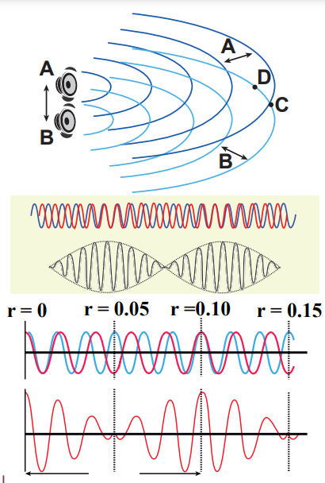

### துடிப்புகள் உருவாகுதல்

இரண்டு அல்லது அதற்கு மேற்பட்ட அலைகள் சற்று மாறுபட்ட அதிர்வெண்களுடன் ஒன்றுசேரும்போது, ஒரு புள்ளியில் காலப்போக்கில் மாறுபடும் வீச்சின் ஒலி கவனிக்கப்படுகிறது. இந்த நிகழ்வு துடிப்புகள் என அழைக்கப்படுகிறது. ஒரு விநாடிக்கு வீச்சு உச்சங்களின் எண்ணிக்கை துடிப்பு அதிர்வெண் எனப்படும். நம்மிடம் இரண்டு மூலங்கள் இருந்தால், அவற்றின் அதிர்வெண்களின் வேறுபாடு துடிப்பு அதிர்வெண்ணைக் கொடுக்கிறது. ஒரு விநாடிக்கு துடிப்புகளின் எண்ணிக்கை
\[
n = |f_1 - f_2|
\]

---

**எடுத்துக்காட்டு 11.18**

5 மீ மற்றும் 6 மீ அலைநீளங்களைக் கொண்ட இரண்டு ஒலி அலைகளைக் கவனியுங்கள். இந்த இரண்டு அலைகளும் 330 மீ வி\(^{-1}\) திசைவேகத்துடன் ஒரு வாயுவில் பரவினால், ஒரு விநாடிக்கு துடிப்புகளின் எண்ணிக்கையைக் கணக்கிடுங்கள்.

**_தீர்வு_**

\(\lambda_1 = 5\) மீ மற்றும் \(\lambda_2 = 6\) மீ எனக் கொடுக்கப்பட்டுள்ளது. ஒரு வாயுவில் ஒலி அலைகளின் திசைவேகம் \(v = 330\) மீ வி\(^{-1}\).

அலைநீளத்திற்கும் திசைவேகத்திற்கும் இடையிலான தொடர்பு \(v = \lambda f \Rightarrow f = \frac{v}{\lambda}\).

\(\lambda_1\) அலைநீளத்திற்கு ஒத்த அதிர்வெண்
\[
f_1 = \frac{v}{\lambda_1} = \frac{330}{5} = 66 \, \text{Hz}
\]

\(\lambda_2\) அலைநீளத்திற்கு ஒத்த அதிர்வெண்
\[
f_2 = \frac{v}{\lambda_2} = \frac{330}{6} = 55 \, \text{Hz}
\]

ஒரு விநாடிக்கு துடிப்புகளின் எண்ணிக்கை
\[
|f_1 - f_2| = |66 - 55| = 11
\]

---

**எடுத்துக்காட்டு 11.19**

இரு அதிரும் இசைக் கவர்கள், \(y_1 = 5 \sin(240\pi t)\) மற்றும் \(y_2 = 4 \sin(244\pi t)\) என்று சமன்பாடு கொண்ட அலைகளை உருவாக்குகின்றன. ஒரு விநாடிக்கு துடிப்புகளின் எண்ணிக்கையைக் கணக்கிடுங்கள்.

**_தீர்வு_**

\(y_1 = 5 \sin(240\pi t)\) மற்றும் \(y_2 = 4 \sin(244\pi t)\) எனக் கொடுக்கப்பட்டுள்ளது.

\(y = A \sin(2\pi f_1 t)\) உடன் ஒப்பிட, நாம் பெறுவது

\(2\pi f_1 = 240\pi \Rightarrow f_1 = 120\) Hz

\(2\pi f_2 = 244\pi \Rightarrow f_2 = 122\) Hz

உற்பத்தி செய்யப்படும் துடிப்புகளின் எண்ணிக்கை \(|f_1 - f_2| = |120 - 122| = |-2| = 2\) துடிப்புகள்/வினாடி.

---

## நிலையான அலைகள்

### நிலையான அலைகளின் விளக்கம்

அலை கடினமான எல்லையைத் தாக்கும் போது, அது அசல் ஊடகத்திற்குத் திரும்பி, அசல் அலைகளுடன் குறுக்கிட முடியும். ஒரு அமைப்பு உருவாகிறது, இது நிலையான அலைகள் அல்லது அசையா அலைகள் என அழைக்கப்படுகிறது. ஒரே வீச்சு மற்றும் ஒரே திசைவேகம் கொண்ட ஆனால் எதிரெதிர் திசைகளில் நகரும் இரண்டு இசை முற்போக்கு அலைகளைக் (சரங்களால் உருவாக்கப்பட்டவை) கருத்தில் கொள்வோம். பின்னர் முதல் அலையின் (படு அலை) இடப்பெயர்ச்சி

\[
y_1 = A \sin(kx - \omega t) \tag{11.59}
\]

(அலை வலது பக்கம் நகரும்)

மற்றும் இரண்டாவது அலையின் (எதிரொளிப்பு அலை) இடப்பெயர்ச்சி

\[
y_2 = A \sin(kx + \omega t) \tag{11.60}
\]

(அலை இடது பக்கம் நகரும்)

இரண்டும் மேற்பொருட்கோள் கொள்கையால் ஒன்றுடன் ஒன்று குறுக்கிடும், நிகர இடப்பெயர்ச்சி

\[
y = y_1 + y_2 \tag{11.61}
\]

சமன்பாடு (11.59) மற்றும் சமன்பாடு (11.60) ஐ சமன்பாட்டில் (11.61) பிரதியிட, நாம் பெறுவது

\[
y = A \sin(kx - \omega t) + A \sin(kx + \omega t) \tag{11.62}
\]

முக்கோணவியல் முற்றொருமையைப் பயன்படுத்தி, சமன்பாடு (11.62) ஐ இவ்வாறு மாற்றி எழுதுகிறோம்

\[
y(x, t) = 2A \cos(\omega t) \sin(kx) \tag{11.63}
\]

இது ஒரு நிலையான அலையைக் குறிக்கிறது, அதாவது இந்த அலை முன்னோக்கி அல்லது பின்னோக்கி நகராது, அதேசமயம் முற்போக்கு அல்லது பயண அலைகள் முன்னோக்கி அல்லது பின்னோக்கி நகரும். மேலும், சமன்பாடு (11.63) இல் உள்ள துகளின் இடப்பெயர்ச்சியை மிகவும் சுருக்கமான வடிவத்தில் எழுதலாம்,

\[
y(x, t) = A' \cos(\omega t)
\]

இங்கு \(A' = 2A \sin(kx)\), இது சரத்தின் குறிப்பிட்ட உறுப்பு, \(A'\) க்கு சமமான வீச்சுடன் தனி இசை இயக்கத்தைச் செய்கிறது என்பதைக் குறிக்கிறது. இந்த வீச்சின் அதிகபட்சம் பின்வரும் நிலைகளில் ஏற்படுகிறது

\[
\sin(kx) = 1 \Rightarrow kx = \frac{\pi}{2}, \frac{3\pi}{2}, \frac{5\pi}{2}, \ldots = (2m+1)\frac{\pi}{2}
\]

இங்கு \(m\) அரை முழு எண் அல்லது அரை-முழு எண் மதிப்புகளை எடுக்கும். அதிகபட்ச வீச்சின் நிலை _எதிர்முனை_ என அழைக்கப்படுகிறது. அலை எண்ணை அலைநீளத்தின் அடிப்படையில் வெளிப்படுத்துவதன் மூலம், எதிர்முனை நிலைகளை இவ்வாறு குறிப்பிடலாம்

\[
x = (2m+1)\frac{\lambda}{4}, \text{ இங்கு } m = 0, 1, 2, \ldots \tag{11.64}
\]

\(m = 0\) க்கு \(x_0 = \frac{\lambda}{4}\) இல் அதிகபட்சம் உள்ளது.

\(m = 1\) க்கு \(x_1 = \frac{3\lambda}{4}\) இல் அதிகபட்சம் உள்ளது.

\(m = 2\) க்கு \(x_2 = \frac{5\lambda}{4}\) இல் அதிகபட்சம் உள்ளது.

மற்றும் பல.

இரண்டு அடுத்தடுத்த எதிர்முனைகளுக்கு இடையிலான தூரத்தைக் கணக்கிடலாம்
\[
x_{m+1} - x_m = \frac{(2(m+1)+1)\lambda}{4} - \frac{(2m+1)\lambda}{4} = \frac{(2m+3)\lambda}{4} - \frac{(2m+1)\lambda}{4} = \frac{\lambda}{2}
\]

இதேபோல், வீச்சின் \(A'\) குறைந்தபட்சமும் வெளியில் சில புள்ளிகளில் ஏற்படுகிறது, மேலும் இந்த புள்ளிகளை அமைப்பதன் மூலம் தீர்மானிக்க முடியும்

\[
\sin(kx) = 0 \Rightarrow kx = 0, \pi, 2\pi, 3\pi, \ldots = n\pi
\]

இங்கு \(n\) முழு எண் அல்லது முழுமையான மதிப்புகளை எடுக்கும். இந்த புள்ளிகளில் உள்ள உறுப்புகள் அதிர்வுறவில்லை என்பதைக் கவனத்தில் கொள்ளவும் (நகரவில்லை), மேலும் புள்ளிகள் _கணுக்கள்_ எனப்படும். \(n\)வது கணு நிலை பின்வருமாறு வழங்கப்படுகிறது

\[
x = n\frac{\lambda}{2}, \text{ இங்கு } n = 0, 1, 2, \ldots \tag{11.65}
\]

\(n = 0\) க்கு \(x_0 = 0\) இல் குறைந்தபட்சம் உள்ளது.

\(n = 1\) க்கு \(x_1 = \frac{\lambda}{2}\) இல் குறைந்தபட்சம் உள்ளது. \(n = 2\) க்கு \(x_2 = \lambda\) இல் அதிகபட்சம் மற்றும் பல.

எந்த இரண்டு அடுத்தடுத்த கணுக்களுக்கும் இடையிலான தூரத்தைக் கணக்கிடலாம்
\[
x_n - x_{n-1} = n\frac{\lambda}{2} - (n-1)\frac{\lambda}{2} = \frac{\lambda}{2}
\]

---

**எடுத்துக்காட்டு 11.20**

எதிர்முனைக்கும் அதன் அண்டைக் கணுவிற்கும் இடையிலான தூரத்தைக் கணக்கிடுங்கள்.

**_தீர்வு_**

\(n\)வது முறையில், எதிர்முனைக்கும் அண்டைக் கணுவிற்கும் இடையிலான தூரம்
\[
\Delta x_n = \frac{(2n+1)\lambda}{4} - n\frac{\lambda}{2} = \frac{(2n+1)\lambda - 2n\lambda}{4} = \frac{\lambda}{4}
\]

---

### நிலையான அலைகளின் பண்புகள்

**(1)** நிலையான அலைகள் இரண்டு கடினமான எல்லைகளுக்கு இடையில் ஒரு அலைக் கிளர்ச்சியை அடைத்து வைப்பதன் மூலம் வகைப்படுத்தப்படுகின்றன. இதன் பொருள், அலை ஒரு ஊடகத்தில் முன்னோக்கி அல்லது பின்னோக்கி நகராது, அது அதன் இடத்தில் நிலையாக இருக்கும். எனவே, அவை “நிலையான அலைகள்” என அழைக்கப்படுகின்றன.

**(2)** அலை இருக்கும் பகுதியில் குறிப்பிட்ட புள்ளிகள் _அதிகபட்ச வீச்சைக் கொண்டிருக்கும், அவை எதிர்முனைகள் எனப்படும்_, மற்றும் குறிப்பிட்ட புள்ளிகளில் _வீச்சு குறைந்தபட்சம் அல்லது பூஜ்ஜியமாகும், அவை கணுக்கள் எனப்படும்_.

**(3)** இரண்டு அடுத்தடுத்த கணுக்கள் (அல்லது) எதிர்முனைகளுக்கு இடையிலான தூரம் \(\frac{\lambda}{2}\) ஆகும்.

**(4)** ஒரு கணுவிற்கும் அதன் அண்டை எதிர்முனைக்கும் இடையிலான தூரம் \(\frac{\lambda}{4}\) ஆகும்.

**(5)** நிலையான அலையின் வழியாக ஆற்றலின் பரிமாற்றம் பூஜ்ஜியமாகும்.

**அட்டவணை 11.3:** முற்போக்கு மற்றும் நிலையான அலைகளுக்கு இடையிலான ஒப்பீடு

| S.No. | முற்போக்கு அலைகள் | நிலையான அலைகள் |
|---|---|---|
| 1. | குறுக்கு முற்போக்கு அலைகளில் முகடுகளும் அகழிகளும் உருவாகின்றன, மற்றும் நெட்டாங்கு முற்போக்கு அலைகளில் அமுக்கமும் பகுதி விரிவும் உருவாகின்றன. இந்த அலைகள் ஒரு ஊடகத்தில் முன்னோக்கி அல்லது பின்னோக்கி நகரும், அதாவது அவை ஒரு குறிப்பிட்ட திசைவேகத்துடன் ஊடகத்தில் முன்னேறும். | குறுக்கு நிலையான அலைகளில் முகடுகளும் அகழிகளும் உருவாகின்றன, மற்றும் நெட்டாங்கு நிலையான அலைகளில் அமுக்கமும் பகுதி விரிவும் உருவாகின்றன. இந்த அலைகள் ஒரு ஊடகத்தில் முன்னோக்கி அல்லது பின்னோக்கி நகராது, அதாவது அவை ஒரு ஊடகத்தில் முன்னேறாது. |
| 2. | ஊடகத்தில் உள்ள அனைத்து துகள்களும், அனைத்து துகள்களுக்கும் அதிர்வின் வீச்சு ஒரே மாதிரியாக இருக்குமாறு அதிர்கின்றன. | கணுக்களைத் தவிர, ஊடகத்தில் உள்ள மற்ற அனைத்து துகள்களும், அதிர்வின் வீச்சு வெவ்வேறு துகள்களுக்கு வெவ்வேறாக இருக்குமாறு அதிர்கின்றன. கணுக்களில் வீச்சு குறைந்தபட்சம் அல்லது பூஜ்ஜியமாகவும், எதிர்முனைகளில் அதிகபட்சமாகவும் இருக்கும். |
| 3. | இந்த அலைகள் பரவும்போது ஆற்றலைக் கொண்டு செல்கின்றன. | இந்த அலைகள் ஆற்றலைக் கொண்டு செல்வதில்லை. |

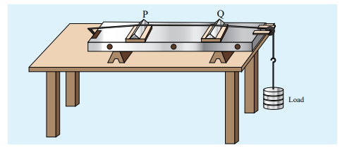

### சோனோமீட்டரில் நிலையான அலைகள்

**சோனோ** என்பது _ஒலி_ தொடர்பானது, மற்றும் சோனோமீட்டர் என்பது ஒலி தொடர்பான அளவீடுகளைக் குறிக்கிறது. இது ஒரு சரத்தில் உள்ள குறுக்கு நிலையான அலையில் உற்பத்தி செய்யப்படும் ஒலியின் அதிர்வெண்ணுக்கும், சரத்தின் இழுவிசை, நீளம் மற்றும் ஒரு அலகு நீளத்திற்கான நிறை ஆகியவற்றுக்கும் இடையிலான தொடர்பை நிரூபிக்கும் ஒரு சாதனமாகும். எனவே, இந்த சாதனத்தைப் பயன்படுத்தி, பின்வரும் அளவுகளைத் தீர்மானிக்க முடியும்:

(a) இசைக் கவரின் _அதிர்வெண்_ அல்லது மாற்று மின்னோட்டத்தின் அதிர்வெண்

(b) சரத்தின் _இழுவிசை_

(c) தெரியாத தொங்கும் _நிறை_

**அமைப்பு:**

சோனோமீட்டர் என்பது ஒரு மீட்டர் நீளமுள்ள வெற்றுப் பெட்டியால் ஆனது, அதில் ஒரு சீரான உலோக மெல்லிய சரம் இணைக்கப்பட்டுள்ளது. சரத்தின் ஒரு முனை ஒரு கொக்கியுடனும், மறுமுனை ஒரு கப்பி வழியாக ஒரு எடைத் தொங்கவிடும் கருவியுடனும் இணைக்கப்பட்டுள்ளது, படம் 11.34 இல் காட்டப்பட்டுள்ளது. ஒரே ஒரு சரம் மட்டுமே பயன்படுத்தப்படுவதால், இது மோனோகார்ட் என்றும் அழைக்கப்படுகிறது. கம்பியின் கட்டற்ற முனையில் எடைகள் சேர்க்கப்பட்டு, கம்பியின் இழுவிசை அதிகரிக்கப்படுகிறது. இரண்டு சரிசெய்யக்கூடிய மரக் கத்திகள் பலகையின் மீது வைக்கப்படுகின்றன, மேலும் அவற்றின் நிலைகள் நீட்டப்பட்ட கம்பியின் அதிரும் நீளத்தை மாற்றுவதற்காக சரிசெய்யப்படுகின்றன.

**இயங்கும் முறை :**

ஒரு குறுக்கு நிலையான அல்லது நிற்கும் அலை உருவாக்கப்படுகிறது, எனவே, கத்தி விளிம்புகள் P மற்றும் Q இல், கணுக்கள் உருவாகின்றன. கத்தி விளிம்புகளுக்கு இடையில், எதிர்முனைகள் உருவாகின்றன.

அதிரும் உறுப்பின் நீளம் \(l\) எனில்
\[
\lambda = 2l
\]

\(f\) அதிரும் உறுப்பின் அதிர்வெண், \(T\) சரத்தின் இழுவிசை மற்றும் \(\mu\) சரத்தின் ஒரு அலகு நீளத்திற்கான நிறை என்க. பின்னர் சமன்பாட்டைப் (11.13) பயன்படுத்தி, நாம் பெறுவது
\[
v = \sqrt{\frac{T}{\mu}}
\]
ஆனால் \(v = f\lambda = f(2l)\)
\[
f = \frac{1}{2l} \sqrt{\frac{T}{\mu}} \tag{11.66}
\]

\(\rho\) என்பது சரத்தின் பொருளின் அடர்த்தி மற்றும் \(d\) என்பது சரத்தின் விட்டம் என்க. பின்னர் ஒரு அலகு நீளத்திற்கான நிறை \(\mu\),
\[
\mu = \text{Area} \times \text{அடர்த்தி} = \pi r^2 \rho = \frac{\pi \rho d^2}{4}
\]
\[
\text{அதிர்வெண் } f = \frac{1}{2l} \sqrt{\frac{4T}{\pi \rho d^2}} = \frac{1}{ld} \sqrt{\frac{T}{\pi \rho}} \tag{11.67}
\]

---

**எடுத்துக்காட்டு 11.21**

\(f\) சரத்தின் அடிப்படை அதிர்வெண் ஆக இருக்கட்டும். சரம் \(l_1, l_2\) மற்றும் \(l_3\) என மூன்று பிரிவுகளாகப் பிரிக்கப்பட்டு, ஒவ்வொரு பிரிவின் அடிப்படை அதிர்வெண்கள் முறையே \(f_1, f_2\) மற்றும் \(f_3\) எனில்,
\[
\frac{1}{f} = \frac{1}{f_1} + \frac{1}{f_2} + \frac{1}{f_3}
\]

**_தீர்வு_**

நிலையான இழுவிசை \(T\) மற்றும் நிறை அடர்த்தி \(\mu\) க்கு, அதிர்வெண் சரத்தின் நீளத்திற்கு எதிர் விகிதாசாரமாகும் i.e.,
\[
f \propto \frac{1}{l}
\]
\[
\Rightarrow f l = \text{மாறிலி}
\]

முதல் நீளப் பிரிவிற்கு,
\[
f_1 l_1 = \text{மாறிலி} = k \Rightarrow l_1 = \frac{k}{f_1}
\]

இரண்டாவது நீளப் பிரிவிற்கு,
\[
f_2 l_2 = k \Rightarrow l_2 = \frac{k}{f_2}
\]

மூன்றாவது நீளப் பிரிவிற்கு,
\[
f_3 l_3 = k \Rightarrow l_3 = \frac{k}{f_3}
\]

எனவே, மொத்த நீளம்
\[
l = l_1 + l_2 + l_3 = k \left( \frac{1}{f_1} + \frac{1}{f_2} + \frac{1}{f_3} \right)
\]
ஆனால் \(f l = k\) மற்றும் \(l = k/f\), எனவே
\[
\frac{k}{f} = k \left( \frac{1}{f_1} + \frac{1}{f_2} + \frac{1}{f_3} \right)
\]
\[
\frac{1}{f} = \frac{1}{f_1} + \frac{1}{f_2} + \frac{1}{f_3}
\]

---

### அடிப்படை அதிர்வெண் மற்றும் மேலிசைகள்

இப்போது கடினமான எல்லைகளை \(x = 0\) மற்றும் \(x = L\) இல் வைத்து, சரத்தை அசைத்து (கிட்டாரில் சரங்களைப் பறிப்பது போன்று) ஒரு நிலையான அலையை உருவாக்குவோம். ஒரு குறிப்பிட்ட அலைநீளம் கொண்ட நிலையான அலைகள் உருவாக்கப்படுகின்றன. வீச்சு எல்லைகளில் மறைய வேண்டும் என்பதால், எல்லையில் உள்ள இடப்பெயர்ச்சி பின்வரும் நிபந்தனைகளைப் பூர்த்தி செய்ய வேண்டும்

\[
y(x = 0, t) = 0 \quad \text{மற்றும்} \quad y(x = L, t) = 0 \tag{11.68}
\]

உருவாகும் கணுக்கள் \(\frac{\lambda_n}{2}\) இடைவெளியில் இருப்பதால், \(n \frac{\lambda_n}{2} = L\), இங்கு \(n\) ஒரு முழு எண், \(L\) என்பது இரண்டு எல்லைகளுக்கும் இடையிலான நீளம் மற்றும் \(\lambda_n\) என்பது குறிப்பிடப்பட்ட எல்லை நிபந்தனைகளைப் பூர்த்தி செய்யும் குறிப்பிட்ட அலைநீளம். எனவே,

\[
\lambda_n = \frac{2L}{n} \tag{11.69}
\]

_\(n\) பூஜ்ஜியமாக எடுத்துக் கொண்டால் அலைநீளத்திற்கு என்ன நடக்கும்? இது ஏன் அனுமதிக்கப்படவில்லை?_

எனவே, அனைத்து அலைநீளங்களும் அனுமதிக்கப்படுவதில்லை. (அனுமதிக்கப்பட்ட) அலைநீளங்கள் குறிப்பிடப்பட்ட எல்லை நிபந்தனைகளுடன் பொருந்த வேண்டும், அதாவது \(n = 1\) க்கு, முதல் முறை அதிர்வு \(\lambda_1 = 2L\) என்ற குறிப்பிட்ட அலைநீளத்தைக் கொண்டுள்ளது. இதேபோல் \(n = 2\) க்கு, இரண்டாவது முறை அதிர்வு \(\lambda_2 = L\) என்ற குறிப்பிட்ட அலைநீளத்தைக் கொண்டுள்ளது. \(n = 3\) க்கு, மூன்றாவது முறை அதிர்வு \(\lambda_3 = \frac{2L}{3}\) என்ற குறிப்பிட்ட அலைநீளத்தைக் கொண்டுள்ளது, மற்றும் பல. ஒவ்வொரு முறை அதிர்வின் அதிர்வெண் (இயற்கை அதிர்வெண் எனப்படும்) கணக்கிடப்படலாம்.

நாம் பெறுவது,
\[
f_n = \frac{v}{\lambda_n} = \frac{v}{2L} n = n \frac{v}{2L} \tag{11.70}
\]

மிகக் குறைந்த இயற்கை அதிர்வெண் _அடிப்படை அதிர்வெண்_ எனப்படும்.
\[
f_1 = \frac{v}{2L} \tag{11.71}
\]

இரண்டாவது இயற்கை அதிர்வெண் _முதல் மேலிசை_ எனப்படும்.
\[
f_2 = \frac{v}{L} = 2f_1
\]

மூன்றாவது இயற்கை அதிர்வெண் _இரண்டாவது மேலிசை_ எனப்படும்.
\[
f_3 = \frac{3v}{2L} = 3f_1
\]

மற்றும் பல. எனவே, \(n\)வது இயற்கை அதிர்வெண்ணை அடிப்படை அதிர்வெண்ணின் முழு எண் மடங்காகக் கணக்கிட முடியும், i.e.,
\[
f_n = n f_1, \text{ இங்கு } n \text{ ஒரு முழு எண்} \tag{11.72}
\]

_இயற்கை அதிர்வெண்கள் அடிப்படை அதிர்வெண்களின் முழு எண் மடங்குகளாக எழுதப்பட்டால், அந்த அதிர்வெண்கள் இசைவங்கள் எனப்படும். இவ்வாறு,_ முதல் இசைவு \(f_1 = f_1\) (அடிப்படை அதிர்வெண் முதல் இசைவு எனப்படும்), இரண்டாவது இசைவு \(f_2 = 2f_1\), மூன்றாவது இசைவு \(f_3 = 3f_1\) போன்றவை.

---

**எடுத்துக்காட்டு 11.22**

ஒரு கிட்டாரில் உள்ள 80 செ.மீ நீளமும், 0.32 கிராம் நிறையும், 80 N இழுவிசையும் கொண்ட ஒரு சரத்தைப் பறிக்கிறார்கள். அது பறிக்கப்படும் போது உருவாகும் முதல் நான்கு குறைந்த அதிர்வெண்களைக் கணக்கிடுங்கள்.

**_தீர்வு_**

அலையின் திசைவேகம்
\[
v = \sqrt{\frac{T}{\mu}}
\]

சரத்தின் நீளம், \(L = 80\) செ.மீ = 0.8 மீ. சரத்தின் நிறை, \(m = 0.32\) கிராம் = \(0.32 \times 10^{-3}\) கிகி. எனவே, நேரியல் நிறை அடர்த்தி,
\[
\mu = \frac{m}{L} = \frac{0.32 \times 10^{-3}}{0.8} = 0.4 \times 10^{-3} \, \text{கிகி மீ}^{-1}
\]

சரத்தில் உள்ள இழுவிசை, \(T = 80\) N

\[
v = \sqrt{\frac{80}{0.4 \times 10^{-3}}} = \sqrt{2 \times 10^{5}} = 447.2 \, \text{மீ வி}^{-1}
\]

அடிப்படை அதிர்வெண் \(f_1\) உடன் தொடர்புடைய அலைநீளம் \(\lambda_1 = 2L = 2 \times 0.8 = 1.6\) மீ. \(\lambda_1\) அலைநீளத்துடன் தொடர்புடைய அடிப்படை அதிர்வெண் \(f_1\)

\[
f_1 = \frac{v}{\lambda_1} = \frac{447.2}{1.6} = 279.5 \, \text{Hz}
\]

இதேபோல், இரண்டாவது இசைவு, மூன்றாவது இசைவு மற்றும் நான்காவது இசைவுடன் தொடர்புடைய அதிர்வெண்கள்

\(f_2 = 2f_1 = 559\) Hz

\(f_3 = 3f_1 = 838.5\) Hz

\(f_4 = 4f_1 = 1118\) Hz

---

### நீட்டப்பட்ட சரங்களில் குறுக்கு அதிர்வுகளின் விதிகள்

நீட்டப்பட்ட சரங்களின் குறுக்கு அதிர்வுகளில் மூன்று விதிகள் உள்ளன, அவை பின்வருமாறு:

**(i) நீளத்தின் விதி:**

இழுவிசை \(T\) (நிலையானது) மற்றும் ஒரு அலகு நீளத்திற்கான நிறை \(\mu\) (நிலையானது) கொண்ட கொடுக்கப்பட்ட கம்பிக்கு, அதிர்வெண் அதிரும் நீளத்திற்கு எதிர் விகிதாசாரமாகும். எனவே,
\[
f \propto \frac{1}{l} \Rightarrow \frac{1}{l} = \frac{1}{l} \Rightarrow l \times f = C, \text{ இங்கு } C \text{ ஒரு மாறிலி}
\]

**(ii) இழுவிசையின் விதி:**

கொடுக்கப்பட்ட அதிரும் நீளம் \(l\) (நிலையானது) மற்றும் ஒரு அலகு நீளத்திற்கான நிறை \(\mu\) (நிலையானது) க்கு, அதிர்வெண் இழுவிசையின் \(T\) வர்க்க மூலத்துடன் நேரடியாக மாறுபடும்,
\[
f \propto \sqrt{T} \Rightarrow f = A \sqrt{T}, \text{ இங்கு } A \text{ ஒரு மாறிலி}
\]

**(iii) நிறையின் விதி:**

கொடுக்கப்பட்ட அதிரும் நீளம் \(l\) (நிலையானது) மற்றும் இழுவிசை \(T\) (நிலையானது) க்கு, அதிர்வெண் ஒரு அலகு நீளத்திற்கான நிறை \(\mu\) இன் வர்க்க மூலத்துடன் எதிர் விகிதாசாரமாகும்,
\[
f \propto \frac{1}{\sqrt{\mu}} \Rightarrow f = \frac{B}{\sqrt{\mu}}, \text{ இங்கு } B \text{ ஒரு மாறிலி}
\]

## செறிவு மற்றும் உரத்தன்மை

ஒரு மூலத்தையும் இரண்டு பார்வையாளர்களையும் (கேட்பவர்களையும்) கவனியுங்கள். மூலமானது ஒலி அலைகளை வெளிப்படுத்துகிறது, அவை ஆற்றலைக் கொண்டு செல்கின்றன. மூலத்தால் வெளிப்படும் ஒலி ஆற்றல், அதை யார் அளந்தாலும் சமமாக இருக்கும், அதாவது, அந்தப் பகுதியில் நிற்கும் எந்தப் பார்வையாளரிடமிருந்தும் இது சுயாதீனமானது. ஆனால் இரண்டு பார்வையாளர்களால் பெறப்படும் ஒலி வேறுபட்டிருக்கலாம்; இது காதுகளின் உணர்திறன் போன்ற சில காரணிகளால் ஏற்படுகிறது. இதை அளவிட, ஒலியின் செறிவு மற்றும் உரத்தன்மை என்ற இரண்டு வெவ்வேறு அளவுகளை வரையறுக்கிறோம்.

### ஒலியின் செறிவு

ஒரு மூலத்தால் ஒலி அலை வெளிப்படுத்தப்படும்போது, ஆற்றல் சாத்தியமான அனைத்து சுற்றியுள்ள புள்ளிகளுக்கும் கொண்டு செல்லப்படுகிறது. ஒரு அலகு நேரத்தில் அல்லது ஒரு வினாடியில் வெளிப்படும் அல்லது அனுப்பப்படும் சராசரி ஒலி ஆற்றல் ஒலி திறன் எனப்படும். எனவே, ஒலியின் செறிவு _ஒலி அலையின் பரவலுக்குச் செங்குத்தாக எடுக்கப்பட்ட ஒரு அலகு பரப்பில் அனுப்பப்படும் ஒலி திறன் என வரையறுக்கப்படுகிறது_.

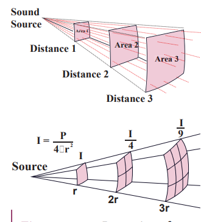

ஒரு குறிப்பிட்ட மூலத்திற்கு (நிலையான மூலம்), ஒலி செறிவு மூலத்திலிருந்து உள்ள தூரத்தின் வர்க்கத்திற்கு எதிர் விகிதாசாரமாகும்.

\[
I \propto \frac{1}{r^{2}}
\]

இது ஒலி செறிவின் எதிர் வர்க்க விதி எனப்படும்.

---

**எடுத்துக்காட்டு 11.23**

ஒரு குழந்தை ஒரு நாயைப் பார்த்து அழுகிறது, மேலும் அழுகை 3.0 மீ தூரத்தில் கண்டறியப்படுகிறது, இந்தத் தூரத்தில் ஒலியின் செறிவு \(10^{-2}\) W m\(^{-2}\) ஆகும். 6.0 மீ தூரத்தில் குழந்தையின் அழுகையின் செறிவைக் கணக்கிடுங்கள்.

**_தீர்வு_** \(I_1\) என்பது 3.0 மீ தூரத்தில் கண்டறியப்பட்ட ஒலியின் செறிவு, மேலும் அது \(10^{-2}\) W m\(^{-2}\) எனக் கொடுக்கப்பட்டுள்ளது.

\(I_2\) என்பது 6.0 மீ தூரத்தில் கண்டறியப்பட்ட ஒலியின் செறிவாக இருக்கட்டும். பின்னர், \(r_1 = 3.0\) மீ, \(r_2 = 6.0\) மீ, மற்றும் \(I \propto \frac{1}{r^2}\) (திறன் வெளியீடு பார்வையாளரைச் சார்ந்தது இல்லை, குழந்தையை மட்டுமே சார்ந்துள்ளது),

\[
\frac{I_2}{I_1} = \frac{r_1^2}{r_2^2}
\]
\[
I_2 = I_1 \frac{r_1^2}{r_2^2} = 10^{-2} \times \left( \frac{3}{6} \right)^{2} = 10^{-2} \times \frac{1}{4} = 0.25 \times 10^{-2} \, \text{W m}^{-2}
\]

---

### ஒலியின் உரத்தன்மை

ஒரே செறிவு கொண்ட இரண்டு ஒலிகள் ஒரே உரத்தன்மையைக் கொண்டிருக்க வேண்டிய அவசியமில்லை. எடுத்துக்காட்டாக, ஒரு அமைதியான மூடிய அறையில் பலூன்கள் வெடிப்பதால் கேட்கப்படும் ஒலி, அதே வெடிப்பு ஒரு சத்தமான சந்தையில் நிகழும்போது கேட்கப்படும் ஒலியுடன் ஒப்பிடும்போது மிகவும் சத்தமாக இருக்கும். ஒலியின் செறிவு ஒரே மாதிரியாக இருந்தாலும், உரத்தன்மை ஒரே மாதிரியாக இல்லை. ஒலியின் செறிவு அதிகரிக்கப்பட்டால், உரத்தன்மையும் அதிகரிக்கிறது. ஆனால் கூடுதலாக, செறிவு மட்டுமல்ல, “ஒரு ஒலி எவ்வளவு சத்தமாக உள்ளது” என்பதற்கான உள் மற்றும் அக அனுபவம், அதாவது கேட்பவரின் உணர்திறனும் இங்கு முக்கியமானது. இது பெரும்பாலும் உரத்தன்மை என அழைக்கப்படுகிறது. அதாவது, உரத்தன்மை ஒலி அலையின் செறிவு மற்றும் காதின் உணர்திறன் (இது ஒரு நபருக்கு நபர் மாறுபடும் தூய பார்வையாளர் சார்ந்த அளவு) ஆகிய இரண்டையும் சார்ந்துள்ளது, அதேசமயம் ஒலியின் செறிவு பார்வையாளரைச் சார்ந்தது இல்லை. ஒலியின் உரத்தன்மை என்பது _“காதில் உருவாகும் ஒலியின் உணர்வின் அளவு அல்லது கேட்பவரால் ஒலியை உணர்தல்” என வரையறுக்கப்படுகிறது_.

### ஒலியின் செறிவு மற்றும் உரத்தன்மை

நமது காது \(10^{-12}\) W m\(^{-2}\) முதல் \(10^2\) W m\(^{-2}\) வரையிலான செறிவு மட்டங்களில் ஒலியைக் கண்டறிய முடியும். வெபர்-ஃபெக்னர் விதியின்படி, “உரத்தன்மை (L) என்பது ஒரு துல்லியமான மனிதரல்லாத கருவி மூலம் அளவிடப்படும் உண்மையான செறிவு (I) இன் மடக்கைக்கு விகிதாசாரமாகும்”. அதாவது

\[
L = k \ln I
\]

இங்கு \(k\) ஒரு மாறிலி, இது அளவீட்டு அலகைப் பொறுத்தது. \(L_1\) மற்றும் \(L_0\) என்ற இரண்டு உரத்தன்மைகளுக்கு இடையிலான வேறுபாடு, இரண்டு துல்லியமாக அளவிடப்பட்ட செறிவுகளுக்கு இடையிலான சார்பு உரத்தன்மையை அளவிடுகிறது, மேலும் இது ஒலி செறிவு மட்டம் என அழைக்கப்படுகிறது. கணித ரீதியாக, ஒலி செறிவு மட்டம்

\[
\Delta L = L_1 - L_0 = k \ln I_1 - k \ln I_0 = k \ln \frac{I_1}{I_0}
\]

\(k = 1\) பெல் எனில், \(k = 10\) டெசிபல், பின்னர் ஒலி செறிவு மட்டம் பெல் இல் அளவிடப்படுகிறது, இது அலெக்சாண்டர் கிரஹாம் பெல்லின் நினைவாகும். எனவே,

\[
\Delta L = \log_{10} \frac{I_1}{I_0} \, \text{bel}
\]

இருப்பினும், இது நடைமுறையில் பெரிய அலகு, எனவே நாம் டெசிபல் என்ற வசதியான சிறிய அலகைப் பயன்படுத்துகிறோம். இவ்வாறு, \(1\) டெசிபல் \(= \frac{1}{10}\) பெல். எனவே, 10 ஆல் பெருக்கி வகுப்பதன் மூலம், \(k = 10\) உடன் டெசிபலில் \(\ln\) ஐப் பெறுகிறோம். நடைமுறை நோக்கங்களுக்காக, இயற்கை மடக்கைக்குப் பதிலாக 10 ஐ அடிப்படையாகக் கொண்ட மடக்கையைப் பயன்படுத்துகிறோம்,

\[
\Delta L = 10 \log_{10} \frac{I}{I_0} \, \text{டெசிபல்} \tag{11.73}
\]

---

**எடுத்துக்காட்டு 11.24** இசைக்கருவி ஒன்று வாசிக்கப்படும்போது ஒலி மட்டம் 50 dB ஆகும். மூன்று ஒத்த இசைக்கருவிகள் ஒன்றாக வாசிக்கப்பட்டால், மொத்த செறிவைக் கணக்கிடுங்கள். கேட்புத்திறன் ஆரம்பம் \(10^{-12}\) W m\(^{-2}\) எனக் கொண்டு, ஒவ்வொரு கருவியிலிருந்தும் வரும் ஒலியின் செறிவைக் கணக்கிடுங்கள்.

**_தீர்வு_**

\[
\Delta L = 10 \log_{10} \frac{I_1}{I_0} = 50
\]
\[
\log_{10} \frac{I_1}{I_0} = 5 \Rightarrow \frac{I_1}{I_0} = 10^{5} \Rightarrow I_1 = 10^{5} I_0 = 10^{5} \times 10^{-12} \, \text{W m}^{-2}
\]
\[
I_1 = 10^{-7} \, \text{W m}^{-2}
\]

மூன்று இசைக்கருவிகள் ஒன்றாக வாசிக்கப்படுவதால், \(I_{\text{மொத்தம்}} = 3I_1 = 3 \times 10^{-7} \, \text{W m}^{-2}\).

---

## காற்றுத் தூணின் அதிர்வுகள்

புல்லாங்குழல், கிளாரினெட், நாதஸ்வரம் போன்ற இசைக்கருவிகள் காற்றுக் கருவிகள் என அழைக்கப்படுகின்றன. அவை காற்றுத் தூண்களின் அதிர்வுகளின் கொள்கையில் செயல்படுகின்றன. ஒரு காற்றுக் கருவியின் எளிய வடிவம் உறுப்புக் குழாய் ஆகும். இது மரம் அல்லது உலோகக் குழாயால் ஆனது, இது இசை ஒலியை உருவாக்குகிறது. எடுத்துக்காட்டாக, புல்லாங்குழல், கிளாரினெட் மற்றும் நாதஸ்வரம் ஆகியவை உறுப்புக் குழாய் இசைக்கருவிகள். உறுப்புக் குழாய் இசைக்கருவிகள் இரண்டு வகைகளாக வகைப்படுத்தப்படுகின்றன:

**(a) மூடிய உறுப்புக் குழாய்கள்:**


படம் 11.36 இல் காட்டப்பட்டுள்ள ஒரு கிளாரினெட்டின் படத்தைப் பாருங்கள். இது ஒரு முனை மூடப்பட்டும், மறுமுனை திறந்தும் இருக்கும் ஒரு குழாய். ஒரு குழாயின் ஒரு முனை மூடப்பட்டிருந்தால், இந்த மூடிய முனையில் எதிரொளிக்கப்படும் அலை, உள்வரும் அலையுடன் 180° எதிர்கட்டத்தில் இருக்கும். இவ்வாறு மூடிய முனையில் துகள்களின் இடப்பெயர்ச்சி இல்லை. எனவே, மூடிய முனையில் கணுக்களும், திறந்த முனையில் எதிர்முனைகளும் உருவாகின்றன.

காற்றுத் தூணின் எளிய முறை அதிர்வைக் கருத்தில் கொள்வோம், இது அடிப்படை முறை எனப்படும். திறந்த முனையில் எதிர்முனையும், மூடிய முனையில் கணுவும் உருவாகின்றன. படம் 11.37 இலிருந்து, குழாயின் நீளம் \(L\) ஆகவும், உருவாக்கப்பட்ட அலையின் அலைநீளம் \(\lambda\) ஆகவும் இருக்கட்டும். அடிப்படை முறை அதிர்வுக்கு,

\[
L = \frac{\lambda}{4} \Rightarrow \lambda = 4L \tag{11.74}
\]

வெளிப்படும் ஸ்வரத்தின் அதிர்வெண்

\[
f = \frac{v}{\lambda} = \frac{v}{4L} \tag{11.75}
\]

இது அடிப்படை ஸ்வரம் எனப்படும்.

_அடிப்படை அதிர்வெண்ணை விட அதிக அதிர்வெண்களை, திறந்த முனையில் வலுவாகக் காற்றை ஊதுவதன் மூலம் உருவாக்க முடியும். இத்தகைய அதிர்வெண்கள் மேலிசைகள் எனப்படும்._

படம் 11.38 இரண்டு கணுக்களையும் இரண்டு எதிர்முனைகளையும் கொண்ட இரண்டாவது முறை அதிர்வைக் காட்டுகிறது.


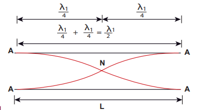

இதற்கான அதிர்வெண்
\[
L = \frac{3\lambda}{4} \Rightarrow \lambda = \frac{4L}{3}
\]
\[
f_2 = \frac{v}{\lambda} = \frac{3v}{4L} = 3f_1
\]

இது முதல் மேலிசை எனப்படும், இங்கு அதிர்வெண் அடிப்படை அதிர்வெண்ணை விட மூன்று மடங்கு என்பதால், இது _மூன்றாவது இசைவு_ எனப்படும். படம் 11.39 மூன்று கணுக்களையும் மூன்று எதிர்முனைகளையும் கொண்ட மூன்றாவது முறை அதிர்வைக் காட்டுகிறது.

\[
L = \frac{5\lambda}{4} \Rightarrow \lambda = \frac{4L}{5}
\]
\[
f_3 = \frac{v}{\lambda} = \frac{5v}{4L} = 5f_1
\]

இது _இரண்டாவது மேலிசை_ எனப்படும், மேலும் இங்கு \(n = 5\) என்பதால், இது ஐந்தாவது இசைவு எனப்படும். எனவே, _மூடிய உறுப்புக் குழாயில் ஒற்றைப்படை இசைவுகள் மட்டுமே உள்ளன, மேலும் \(n\)வது இசைவின் அதிர்வெண் \(f_n = (2n+1)f_1\) ஆகும். எனவே, இசைவுகளின் அதிர்வெண்கள் விகிதத்தில் உள்ளன_

\[
f_1 : f_2 : f_3 : f_4 : \ldots = 1 : 3 : 5 : 7 : \ldots \tag{11.76}
\]

**(b) திறந்த உறுப்புக் குழாய்கள்:**


படம் 11.40 இல் காட்டப்பட்டுள்ள ஒரு புல்லாங்குழலின் படத்தைக் கவனியுங்கள். இது இருமுனைகளும் திறந்திருக்கும் ஒரு குழாய். இரண்டு திறந்த முனைகளிலும், எதிர்முனைகள் உருவாகின்றன. காற்றுத் தூணின் எளிய முறை அதிர்வைக் கருத்தில் கொள்வோம், இது அடிப்படை முறை எனப்படும். திறந்த முனையில் எதிர்முனைகள் உருவாவதால், குழாயின் நடுப் புள்ளியில் ஒரு கணு உருவாகிறது.

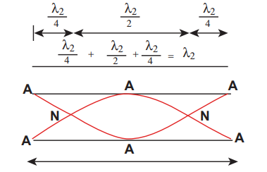

படம் 11.41 இலிருந்து, குழாயின் நீளம் \(L\) எனில், உருவாக்கப்பட்ட அலையின் அலைநீளம் பின்வருமாறு வழங்கப்படுகிறது
\[
L = \frac{\lambda}{2} \Rightarrow \lambda = 2L \tag{11.77}
\]

வெளிப்படும் ஸ்வரத்தின் அதிர்வெண்
\[
f = \frac{v}{\lambda} = \frac{v}{2L} \tag{11.78}
\]

இது _அடிப்படை ஸ்வரம்_ எனப்படும்.

அடிப்படை அதிர்வெண்ணை விட அதிக அதிர்வெண்களை, திறந்த முனைகளில் ஒன்றில் வலுவாகக் காற்றை ஊதுவதன் மூலம் உருவாக்க முடியும். இத்தகைய அதிர்வெண்கள் மேலிசைகள் எனப்படும்.


படம் 11.42 திறந்த குழாய்களில் இரண்டாவது முறை அதிர்வைக் காட்டுகிறது. இது இரண்டு கணுக்களையும் மூன்று எதிர்முனைகளையும் கொண்டுள்ளது, எனவே,
\[
L = \lambda \Rightarrow \lambda = L
\]
\[
f_2 = \frac{v}{L} = 2f_1
\]

இது முதல் மேலிசை எனப்படும். இங்கு \(n = 2\) என்பதால், இது **_இரண்டாவது இசைவு_** எனப்படும்.

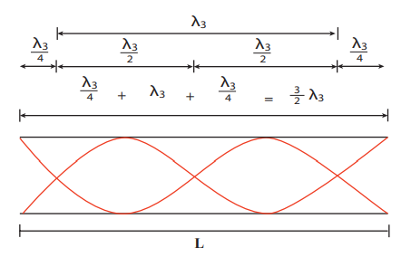

மேலே உள்ள படம் 11.43 மூன்று கணுக்களையும் நான்கு எதிர்முனைகளையும் கொண்ட மூன்றாவது முறை அதிர்வைக் காட்டுகிறது.
\[
L = \frac{3\lambda}{2} \Rightarrow \lambda = \frac{2L}{3}
\]
\[
f_3 = \frac{v}{\lambda} = \frac{3v}{2L} = 3f_1
\]

இது _இரண்டாவது மேலிசை_ எனப்படும். இங்கு \(n = 3\) என்பதால், இது _மூன்றாவது இசைவு_ எனப்படும்.

எனவே, திறந்த உறுப்புக் குழாயில் அனைத்து இசைவுகளும் உள்ளன, மேலும் \(n\)வது இசைவின் அதிர்வெண் \(f_n = n f_1\) ஆகும். எனவே, இசைவுகளின் அதிர்வெண்கள் விகிதத்தில் உள்ளன
\[
f_1 : f_2 : f_3 : f_4 : \ldots = 1 : 2 : 3 : 4 : \ldots \tag{11.79}
\]

---

**எடுத்துக்காட்டு 11.25**

ஒரு புல்லாங்குழல் 450 ஹெர்ட்ஸ் ஸ்வரத்தை ஒலிக்கச் செய்தால், இந்த சுருதியின் இரண்டாவது, மூன்றாவது மற்றும் நான்காவது இசைவுகளின் அதிர்வெண்கள் என்ன? ஒரு கிளாரினெட் 450 ஹெர்ட்ஸ் என்ற அதே ஸ்வரத்தை ஒலிக்கச் செய்தால், உருவாக்கப்படும் மிகக் குறைந்த மூன்று இசைவுகளின் அதிர்வெண்கள் என்ன?

**_தீர்வு_**

புல்லாங்குழலுக்கு, இது ஒரு திறந்த குழாய், நாம் பெறுவது
இரண்டாவது இசைவு \(f_2 = 2f_1 = 900\) Hz
மூன்றாவது இசைவு \(f_3 = 3f_1 = 1350\) Hz
நான்காவது இசைவு \(f_4 = 4f_1 = 1800\) Hz

கிளாரினெட்டுக்கு, இது ஒரு மூடிய குழாய், நாம் பெறுவது
இரண்டாவது இசைவு \(f_2 = 3f_1 = 1350\) Hz
மூன்றாவது இசைவு \(f_3 = 5f_1 = 2250\) Hz
நான்காவது இசைவு \(f_4 = 7f_1 = 3150\) Hz

---

**எடுத்துக்காட்டு 11.26**

ஒரு மூடிய உறுப்புக் குழாயின் மூன்றாவது இசைவு, ஒரு திறந்த உறுப்புக் குழாயின் அடிப்படை அதிர்வெண்ணிற்குச் சமமாக இருந்தால், மூடிய உறுப்புக் குழாயின் நீளம் 30 செ.மீ எனில், திறந்த உறுப்புக் குழாயின் நீளத்தைக் கணக்கிடுங்கள்.

**_தீர்வு_**

\(l_2\) திறந்த உறுப்புக் குழாயின் நீளமாக இருக்கட்டும், மூடிய உறுப்புக் குழாயின் நீளம் \(l_1 = 30\) செ.மீ. மூடிய உறுப்புக் குழாயின் மூன்றாவது இசைவு, திறந்த உறுப்புக் குழாயின் அடிப்படை அதிர்வெண்ணிற்குச் சமம் என்று கொடுக்கப்பட்டுள்ளது. மூடிய உறுப்புக் குழாயின் மூன்றாவது இசைவு
\[
f_3 = \frac{3v}{4l_1}
\]

திறந்த உறுப்புக் குழாயின் அடிப்படை அதிர்வெண்
\[
f_1 = \frac{v}{2l_2}
\]

எனவே,
\[
\frac{3v}{4l_1} = \frac{v}{2l_2} \Rightarrow \frac{3}{4l_1} = \frac{1}{2l_2} \Rightarrow l_2 = \frac{2l_1}{3} = \frac{2 \times 30}{3} = 20 \, \text{செ.மீ}
\]

---

### 11.10.1 ஒத்திசைவுக் காற்றுத் தூண் கருவி

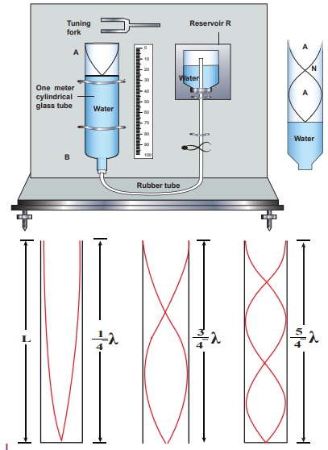

ஒத்திசைவுக் காற்றுத் தூண் கருவி, அறை வெப்பநிலையில் காற்றில் ஒலியின் வேகத்தை அளவிடும் எளிய நுட்பங்களில் ஒன்றாகும். இது ஒரு மீட்டர் நீளமுள்ள ஒரு உருளைக் கண்ணாடிக் குழாயைக் கொண்டுள்ளது, அதன் ஒரு முனை A திறந்தும், மறுமுனை B ஒரு ரப்பர் குழாய் வழியாக நீர்த்தேக்கத்துடன் இணைக்கப்பட்டும் உள்ளது, படம் 11.44 இல் காட்டப்பட்டுள்ளது. இந்த உருளைக் கண்ணாடிக் குழாய் ஒரு செங்குத்து நிலைப்பாட்டில் பொருத்தப்பட்டுள்ளது, அதில் ஒரு அளவுகோல் இணைக்கப்பட்டுள்ளது. குழாய் பகுதியளவு தண்ணீரால் நிரப்பப்பட்டுள்ளது, மேலும் நீர்த்தேக்கத்தில் உள்ள நீரை உயர்த்துவதன் மூலமோ அல்லது தாழ்த்துவதன் மூலமோ நீர் மட்டத்தை சரிசெய்ய முடியும். நீரின் மேற்பரப்பு ஒரு மூடிய முனையாகவும், மற்றொன்று திறந்த முனையாகவும் செயல்படும். எனவே, இது ஒரு மூடிய உறுப்புக் குழாயைப் போல நடந்துகொண்டு, நீரின் மேற்பரப்பில் கணுக்களையும், திறந்த முனையில் எதிர்முனைகளையும் உருவாக்குகிறது. ஒரு அதிரும் இசைக் கவர் குழாயின் திறந்த முனைக்கு அருகில் கொண்டு வரப்படும்போது, காற்றுத் தூணின் உள்ளே நெட்டாங்கு அலைகள் உருவாகின்றன. இந்த அலைகள் படம் 11.44 இல் காட்டப்பட்டுள்ளபடி கீழ்நோக்கி நகர்ந்து, நீரின் மேற்பரப்பை அடைந்து எதிரொளிக்கப்பட்டு, நிலையான அலைகளை உருவாக்குகின்றன. காற்றுத் தூணின் நீளம், காற்றுத் தூணில் ஒரு சத்தமான ஒலி உருவாகும் வரை நீர் மட்டத்தை மாற்றுவதன் மூலம் மாறுபடுத்தப்படுகிறது. இந்த குறிப்பிட்ட நீளத்தில், காற்றுத் தூணில் உள்ள அலைகளின் அதிர்வெண் இசைக் கவரின் அதிர்வெண்ணுடன் (இசைக் கவரின் இயற்கை அதிர்வெண்) ஒத்திசைவு அடைகிறது. ஒத்திசைவில், உருவாக்கப்படும் ஒலி அலைகளின் அதிர்வெண், இசைக் கவரின் அதிர்வெண்ணிற்குச் சமம். உருவாக்கப்படும் ஒலி அலைகளின் அலைநீளத்தின் \(\frac{1}{4}\) க்கு காற்றுத் தூணின் நீளம் விகிதாசாரமாக இருக்கும்போது மட்டுமே இது நிகழும். முதல் ஒத்திசைவு \(L_1\) நீளத்தில் நிகழ்கிறது என்று வைத்துக்கொள்வோம், பின்னர்

\[
\frac{\lambda}{4} = L_1 \tag{11.80}
\]

ஆனால் எதிர்முனைகள் திறந்த முனையில் சரியாக உருவாகாததால், திறந்த முனைக்கு மேலே சிறிது தூரத்தில் எதிர்முனை உருவாகிறது என்று கருதி, முனைத் திருத்தம் \(e\) எனப்படும் ஒரு திருத்தத்தைச் சேர்க்க வேண்டும். இந்த முனைத் திருத்தத்தைச் சேர்ப்பதன் மூலம், முதல் ஒத்திசைவு

\[
\frac{\lambda}{4} = L_1 + e \tag{11.81}
\]

இப்போது இரண்டாவது ஒத்திசைவைப் பெறுவதற்காக காற்றுத் தூணின் நீளம் அதிகரிக்கப்படுகிறது. \(L_2\) இரண்டாவது ஒத்திசைவு நிகழும் நீளமாக இருக்கட்டும். மீண்டும் முனைத் திருத்தத்தை கணக்கில் எடுத்துக்கொண்டால்,

\[
\frac{3\lambda}{4} = L_2 + e \tag{11.82}
\]

அறை வெப்பநிலையில் காற்றில் ஒலியின் வேகத்தை \(v = f\lambda = 2f \Delta L\) என்ற சூத்திரத்தைப் பயன்படுத்தி கணக்கிடலாம். மேலும், முனைத் திருத்தத்தைக் கணக்கிட, நாம் சமன்பாடு (11.81) மற்றும் சமன்பாடு (11.82) ஐப் பயன்படுத்துகிறோம், நாம் பெறுவது

\[
e = \frac{L_2 - 3L_1}{2}
\]

---

**எடுத்துக்காட்டு 11.27**

343 ஹெர்ட்ஸ் நிலையான அதிர்வெண் கொண்ட ஒரு அதிர்வெண் ஜெனரேட்டர், 1.0 மீ உயரமுள்ள குழாயின் மேலே அதிர அனுமதிக்கப்படுகிறது. ஒரு பம்ப் குழாயில் மெதுவாக தண்ணீரை நிரப்ப இயக்கப்படுகிறது. ஒத்திசைவைப் பெறுவதற்கு, நீரின் குறைந்தபட்ச உயரம் என்னவாக இருக்க வேண்டும்? (காற்றில் ஒலியின் வேகம் 343 மீ வி\(^{-1}\))

**_தீர்வு_**

அலைநீளம், \(\lambda = \frac{c}{f} = \frac{343}{343} = 1.0\) மீ.

ஒத்திசைவுத் தூண்களின் நீளங்கள் \(L_1, L_2\) மற்றும் \(L_3\) என்க. முதல் ஒத்திசைவு \(L_1 = \frac{\lambda}{4} = 0.25\) மீ நீளத்தில் நிகழ்கிறது.

இரண்டாவது ஒத்திசைவு \(L_2 = \frac{3\lambda}{4} = 0.75\) மீ நீளத்தில் நிகழ்கிறது.

மூன்றாவது ஒத்திசைவு \(L_3 = \frac{5\lambda}{4} = 1.25\) மீ நீளத்தில் நிகழ்கிறது.

மற்றும் பல. குழாயின் மொத்த நீளம் 1.0 மீ என்பதால், மூன்றாவது மற்றும் பிற உயர் ஒத்திசைவுகள் ஏற்படாது. எனவே, ஒத்திசைவுக்கான நீரின் குறைந்தபட்ச உயரம் \(H_{\text{min}}\),

\(H_{\text{min}} = 1.0 \, \text{மீ} - 0.75 \, \text{மீ} = 0.25 \, \text{மீ}\)

---

**எடுத்துக்காட்டு 11.28**

ஒரு மாணவர் ஒத்திசைவுத் தூண் முறையைப் பயன்படுத்தி காற்றில் ஒலியின் வேகத்தைத் தீர்மானிக்க ஒரு சோதனையைச் செய்தார். ஒரு இசைக் கவருடன் அடிப்படை முறையில் ஒத்திசைவு அடையும் காற்றுத் தூணின் நீளம் 0.2 மீ ஆகும். அதே இசைக் கவர் 0.7 மீ நீளத்தில் முதல் மேலிசையுடன் ஒத்திசைவு அடையும் வகையில் நீளம் மாறுபடுத்தப்பட்டால், முனைத் திருத்தத்தைக் கணக்கிடுங்கள்.

**_தீர்வு_**

முனைத் திருத்தம்
\[
e = \frac{L_2 - 3L_1}{2} = \frac{0.7 - 3 \times 0.2}{2} = \frac{0.7 - 0.6}{2} = \frac{0.1}{2} = 0.05 \, \text{மீ}
\]

---

**எடுத்துக்காட்டு 11.29**

ஒரு காற்றுத் தூணில் ஒத்திசைவை உருவாக்கப் பயன்படும் ஒரு இசைக் கவரைக் கவனியுங்கள். ஒரு ஒத்திசைவுக் காற்றுத் தூண் என்பது ஒரு கண்ணாடிக் குழாய் ஆகும், இதன் நீளத்தை ஒரு மாறி பிஸ்டனால் சரிசெய்ய முடியும். அறை வெப்பநிலையில், குழாய் நீளத்தில் 20 செ.மீ மற்றும் 85 செ.மீ இல் இரண்டு அடுத்தடுத்த ஒத்திசைவுகள் காணப்படுகின்றன. இசைக் கவரின் அதிர்வெண் 256 ஹெர்ட்ஸ் என்றால், அறை வெப்பநிலையில் காற்றில் ஒலியின் திசைவேகத்தைக் கணக்கிடுங்கள்.

**_தீர்வு_**

கொடுக்கப்பட்ட இரண்டு அடுத்தடுத்த நீளங்கள் (ஒத்திசைவு) \(L_1 = 20\) செ.மீ மற்றும் \(L_2 = 85\) செ.மீ.

அதிர்வெண் \(f = 256\) Hz

\[
v = f\lambda = 2f \Delta L = 2f (L_2 - L_1) = 2 \times 256 \times (85 - 20) \times 10^{-2} \, \text{மீ வி}^{-1}
\]
\[
v = 332.8 \, \text{மீ வி}^{-1}
\]

---

## டாப்ளர் விளைவு

நீங்கள் ஒரு ரயில் நடைமேடையில் நின்று, உங்களைக் கடந்து செல்லும் ஒரு ரயிலின் விசில் ஒலியைக் கேட்கிறீர்கள் என்று கற்பனை செய்து பாருங்கள், ரயில் உங்களை நெருங்கும்போது நீங்கள் கேட்கும் ஒலியின் சுருதி (அல்லது அதிர்வெண்) அது உங்களை விட்டு விலகிச் செல்லும்போது நீங்கள் கேட்கும் சுருதியை விட அதிகமாக உள்ளது. இது டாப்ளர் விளைவுக்கு ஒரு எடுத்துக்காட்டு.

இந்த விளைவு ஒலி மூலத்திற்கும் அதன் கேட்பவருக்கும் இடையிலான சார்பு இயக்கம் காரணமாக ஏற்படுகிறது. இந்த இயக்கம் தொடர்பான அதிர்வெண் மாற்றத்தை முதன்முதலில் அவதானித்து ஆய்வு செய்தவர் ஆஸ்திரிய கணிதவியலாளர் மற்றும் இயற்பியலாளர் ஜோஹான் கிறிஸ்டியன் டாப்ளர் (1803–1853) ஆவார்.

**ஒலி மூலத்திற்கும் கேட்பவருக்கும் இடையில் ஒரு சார்பு இயக்கம் இருக்கும் போதெல்லாம், கேட்பவரால் கவனிக்கப்படும் ஒலியின் அதிர்வெண், மூலத்தால் உருவாக்கப்படும் அதிர்வெண்ணிலிருந்து வேறுபட்டது. இது டாப்ளர் விளைவு என அழைக்கப்படுகிறது.**

டாப்ளர் விளைவு ஒரு அலை நிகழ்வாகும். எனவே, இது ஒலி அலைகளுக்கு மட்டுமல்ல, ஒளி மற்றும் பிற மின்காந்த அலைகள் போன்ற எந்த அலைக்கும் ஏற்படுகிறது. இங்கு, ஒலிக்கான டாப்ளர் விளைவின் வெவ்வேறு நிகழ்வுகளை விவாதித்து, கேட்பவரால் கவனிக்கப்படும் அதிர்வெண்ணிற்கான வெளிப்பாட்டைப் பெறுவோம்.

**i) கவனிக்கப்பட்ட அதிர்வெண்: நிலையான மூலம் மற்றும் நகரும் கேட்பவர்**

ஒலியின் ஒரு புள்ளி மூலத்தை (S) அது வைக்கப்பட்டுள்ள ஊடகத்துடன் (காற்று) ஒப்பிடும்போது நிலையில் கருதுங்கள். ஊடகம் சீரானது மற்றும் நிலையானது என்று கருதப்படுகிறது. மூலமானது \(f\) அதிர்வெண் மற்றும் \(\lambda\) அலைநீளம் கொண்ட ஒலி அலைகளை வெளிப்படுத்துகிறது.


ஒலி அலைகள் ஒரே வேகத்தில் \(v\) அனைத்து திசைகளிலும் மூலத்திலிருந்து ஆரையாக கோள அலைகளின் வடிவத்தில் பயணிக்கின்றன. ஒலி அலைகளின் அமுக்கங்கள் (அல்லது அலைமுகடுகள்) படம் 11.45 இல் செறிவூட்டப்பட்ட வட்டங்களால் குறிப்பிடப்படுகின்றன. இரண்டு அடுத்தடுத்த அமுக்கங்களுக்கு இடையிலான தூரம் அதன் அலைநீளம் \(\lambda\) க்கு சமம், மேலும் அலையின் அதிர்வெண் பின்வருமாறு வழங்கப்படுகிறது

\[
f = \frac{v}{\lambda} \tag{11.83}
\]

கேட்பவர் L நிலையாக இருக்கும்போது, மூலத்திற்கும் கேட்பவருக்கும் இடையில் எந்த சார்பு இயக்கமும் இல்லை. \(v\) மற்றும் \(\lambda\) மாறாமல் இருப்பதால், கேட்பவரால் கவனிக்கப்படும் ஒலியின் அதிர்வெண், மூல அதிர்வெண் \(f\) க்கு சமமாகும்.

**_நிலையான பார்வையாளர்_ மற்றும் _நிலையான மூலம்_ என்றால், பார்வையாளரும் மூலமும் முறையே ஊடகத்துடன் ஒப்பிடும்போது நிலையில் இருப்பதாகும்.**

இப்போது கேட்பவர் நிலையான மூலத்தை நோக்கி நேரடியாக நகர்கிறார் (படம் 11.45). \(v_L\) கேட்பவரின் வேகம் எனில், கேட்பவரைப் பொறுத்து ஒலியின் சார்பு வேகம் \(v' = v + v_L\) ஆகும். அலைநீளம் மாறாமல் இருப்பதால் (மூலம் நிலையாக இருப்பதால்), கேட்பவரால் கவனிக்கப்படும் ஒலியின் அதிர்வெண் மாறுகிறது, மேலும் கவனிக்கப்பட்ட அதிர்வெண் \(f'\) பின்வருமாறு வழங்கப்படுகிறது

\[
f' = \frac{v'}{\lambda} = \frac{v + v_L}{\lambda} = f \left( \frac{v + v_L}{v} \right)
\]

சமன்பாடு (11.83) ஐப் பயன்படுத்தி,

\[
f' = f \left( 1 + \frac{v_L}{v} \right) \tag{11.84}
\]

(கேட்பவர் மூலத்தை நோக்கி நகர்தல்) இவ்வாறு, கேட்பவர் நிலையான மூலத்தை நோக்கி நகரும் போது, கவனிக்கப்பட்ட அதிர்வெண் மூல அதிர்வெண்ணை விட அதிகமாக இருக்கும். கேட்பவர் நிலையான மூலத்தை விட்டு விலகிச் சென்றால், \(v_L\) க்கு எதிர்மறை மதிப்பை எடுத்துக்கொண்டு சமன்பாடு (11.84) இலிருந்து கவனிக்கப்பட்ட அதிர்வெண்ணைப் பெறலாம். இது பின்வருமாறு வழங்கப்படுகிறது

\[
f' = f \left( 1 - \frac{v_L}{v} \right) \tag{11.85}
\]

(கேட்பவர் மூலத்தை விட்டு விலகிச் செல்லுதல்) இவ்வாறு, கேட்பவர் நிலையான மூலத்தை விட்டு விலகிச் செல்லும் போது, கவனிக்கப்பட்ட அதிர்வெண் மூல அதிர்வெண்ணை விட குறைவாக இருக்கும்.

**ii) கவனிக்கப்பட்ட அதிர்வெண்: நகரும் மூலம் மற்றும் நிலையான கேட்பவர்**

மூலம் S மற்றும் கேட்பவர் L இரண்டும் ஓய்வில் இருப்பதாகக் கருதுங்கள், படம் 11.46a இல் காட்டப்பட்டுள்ளது. இரண்டு அடுத்தடுத்த அமுக்கங்களும் காட்டப்பட்டுள்ளன, மேலும் அவை இரண்டு செறிவூட்டப்பட்ட வட்டங்களால் குறிப்பிடப்படுகின்றன. இரண்டாவது அமுக்கம் இப்போதே வெளிப்படுத்தப்பட்டுள்ளது, மேலும் அது இன்னும் மூலத்திற்கு அருகில் உள்ளது. இரண்டு அடுத்தடுத்த அமுக்கங்களுக்கு இடையிலான தூரம் ஒலியின் அலைநீளம் \(\lambda\) ஆகும். \(f\) மூலத்தின் அதிர்வெண் என்பதால், அமுக்கங்கள் வெளிப்படுவதற்கு இடையிலான நேரம் \(T = \frac{1}{f}\) ஆகும்.

(a) Source at rest

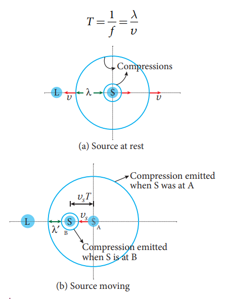

(b) Source moving

இப்போது கேட்பவர் நிலையாகவும், மூலம் கேட்பவரை நோக்கி நேரடியாக நகர்வதுமாக உள்ளது (படம் 11.46(b)). மூலத்தின் வேகம் \(v_S\) ஆக இருக்கட்டும், இது ஒலியின் வேகம் \(v\) ஐ விட குறைவு.

\(T\) நேரத்தில், முதல் அமுக்கம் \(vT = \lambda\) தூரம் பயணிக்கிறது, மற்றும் மூலம் \(v_S T\) தூரம் நகர்கிறது. இதன் விளைவாக, இரண்டு அடுத்தடுத்த அமுக்கங்களுக்கு இடையிலான தூரம் \(\lambda\) இலிருந்து \(\lambda' = \lambda - v_S T\) ஆக குறைகிறது. எனவே, கேட்பவரால் கவனிக்கப்பட்ட அலைநீளம் பின்வருமாறு வழங்கப்படுகிறது

\[
\lambda' = \lambda - v_S T = \lambda - \frac{v_S}{f} = \frac{v}{f} - \frac{v_S}{f} = \frac{v - v_S}{f}
\]

கவனிக்கப்பட்ட அதிர்வெண் பின்னர் பின்வருமாறு வழங்கப்படுகிறது

\[
f' = \frac{v}{\lambda'} = \frac{v}{\frac{v - v_S}{f}} = f \left( \frac{v}{v - v_S} \right) \tag{11.86}
\]

(மூலம் கேட்பவரை நோக்கி நகர்தல்) இவ்வாறு, மூலம் நிலையான கேட்பவரை நோக்கி நகரும் போதெல்லாம், கவனிக்கப்பட்ட அதிர்வெண் மூல அதிர்வெண்ணை விட அதிகமாகும்.

மூலம் நிலையான கேட்பவரை விட்டு விலகிச் சென்றால், \(v_S\) க்கு எதிர்மறை மதிப்பை எடுத்துக்கொண்டு சமன்பாடு (11.86) இலிருந்து கவனிக்கப்பட்ட அதிர்வெண்ணைப் பெறலாம். இது பின்வருமாறு வழங்கப்படுகிறது

\[
f' = f \left( \frac{v}{v + v_S} \right) \tag{11.87}
\]

(மூலம் கேட்பவரை விட்டு விலகிச் செல்லுதல்) இவ்வாறு, மூலம் நிலையான கேட்பவரை விட்டு விலகிச் செல்லும் போது, கவனிக்கப்பட்ட அதிர்வெண் மூல அதிர்வெண்ணை விட குறைவாகும்.

**iii) கவனிக்கப்பட்ட அதிர்வெண்: மூலமும் கேட்பவரும் நகருதல்**

மூலமும் கேட்பவரும் நகரும் போது, கவனிக்கப்பட்ட அதிர்வெண் சமன்பாடுகள் (11.84) மற்றும் (11.86) ஆகியவற்றை இணைப்பதன் மூலம் பெறப்படுகிறது.

\[
f' = f \left( \frac{v + v_L}{v - v_S} \right) \tag{11.88}
\]

நாம் இங்கு பயன்படுத்திய குறியீட்டு மரபு என்னவென்றால், மூலம் அல்லது கேட்பவர் மற்றவரை நோக்கி நகர்ந்தால், \(v_S\) மற்றும் \(v_L\) இரண்டும் நேர்மறை மதிப்புகளை எடுக்கும். அதேபோல், மூலம் அல்லது கேட்பவர் மற்றவரை விட்டு விலகிச் சென்றால், அவை எதிர்மறையாக இருக்கும்.

மூலத்திற்கும் கேட்பவருக்கும் இடையிலான சார்பு இயக்கத்தின் வெவ்வேறு சூழ்நிலைகளுக்கான கவனிக்கப்பட்ட அதிர்வெண் அட்டவணை 11.4 இல் தொகுக்கப்பட்டுள்ளது.

அதிர்வெண்ணில் ஏற்படும் மாற்றம், ஒலியின் வேகத்தில் ஏற்படும் மாற்றம் (கேட்பவர் நகரும் போதும் மூலம் நிலையாக இருக்கும் போது) அல்லது ஒலியின் அலைநீளத்தில் ஏற்படும் மாற்றம் (மூலம் நகரும் போதும் பார்வையாளர் நிலையாக இருக்கும் போது) ஆகியவற்றின் காரணமாக நிகழ்கிறது என்பதைக் கவனிப்பது முக்கியம்.

மூலமும் கேட்பவரும் நகர்ந்தால், அதிர்வெண்ணில் ஏற்படும் மாற்றம் என்பது ஒலியின் வேகத்தில் ஏற்படும் மாற்றம் மற்றும் ஒலி அலையின் அலைநீளத்தில் ஏற்படும் மாற்றம் ஆகிய இரண்டின் காரணமாகவும் நிகழ்கிறது.

**குறிப்பு**

மூலம் ஒலியை விட வேகமாக நகர்ந்தால் (அதாவது, மூலம் கேள்விக்குட்படா வேகத்தில் இருந்தால்), கவனிக்கப்பட்ட அதிர்வெண்ணிற்கான (11.84) மற்றும் (11.86) சமன்பாடுகள் செல்லுபடியாகாது, மேலும் மூலத்தின் முன்னால் உள்ள ஒரு நிலையான கேட்பவர் எந்த ஒலியையும் கேட்க மாட்டார், ஏனெனில் ஒலி அலைகள் மூலத்தின் பின்புறத்தில் இருக்கும். இத்தகைய வேகங்களில், புதிதாக உருவாக்கப்பட்ட அலைகளும் பழைய அலைகளும் ஆக்கபூர்வமாக குறுக்கிடுகின்றன, இது மிகப் பெரிய வீச்சின் ஒலிக்கு வழிவகுக்கிறது, இது ‘சோனிக் பூம்’ அல்லது ‘அதிர்ச்சி அலை’ என அழைக்கப்படுகிறது.

**ஒலியில் டாப்ளர் விளைவு சமச்சீரற்றது, அதேசமயம் ஒளியில் அது சமச்சீரானது.**

மூலம் நிலையான கேட்பவரை நோக்கி நகரும் போதும், கேட்பவர் நிலையான மூலத்தை நோக்கி ஒரே வேகத்தில் நகரும் போதும் கவனிக்கப்படும் ஒலியின் அதிர்வெண் சமமாக இல்லை. இரண்டு நிகழ்வுகளிலும் சார்பு வேகம் ஒரே மாதிரியாக இருந்தாலும், கவனிக்கப்பட்ட அதிர்வெண் வேறுபட்டது. எனவே, ஒலியில் டாப்ளர் விளைவு சமச்சீரற்றது என்று கூறுகிறோம். காரணம், ஒலி அலை அதன் பரவலுக்கு ஒரு ஊடகம் தேவைப்படுகிறது, மேலும் அது அந்த ஊடகத்தைப் பொறுத்து அதன் வேகத்தைக் கொண்டுள்ளது.

ஆனால் ஒளி மற்றும் பிற மின்காந்த கதிர்வீச்சுகளைப் பொறுத்தவரை, மேற்கூறிய இரண்டு நிகழ்வுகளிலும் கவனிக்கப்பட்ட அதிர்வெண் ஒரே மாதிரியாக இருக்கும். எனவே, ஒளி மற்றும் பிற மின்காந்த அலைகளில் டாப்ளர் விளைவு சமச்சீரானது, ஏனெனில் ஒளியின் பரவல் ஊடகத்திலிருந்து சுயாதீனமானது.

---

**எடுத்துக்காட்டு 11.30**

1500 ஹெர்ட்ஸ் அதிர்வெண் கொண்ட ஒரு ஒலி, ஒரு மூலத்தால் வெளிப்படுத்தப்படுகிறது, இது ஒரு பார்வையாளரை விட்டு விலகிச் செல்கிறது, மேலும் 6 மீ வி\(^{-1}\) வேகத்தில் ஒரு பாறையை நோக்கி நகர்கிறது.

(a) மூலத்திலிருந்து நேரடியாக வரும் ஒலியின் அதிர்வெண்ணைக் கணக்கிடுங்கள்.

(b) பாறையில் இருந்து எதிரொளித்து பார்வையாளரால் கேட்கப்படும் ஒலியின் அதிர்வெண்ணைக் கணக்கிடுங்கள். காற்றில் ஒலியின் வேகம் 330 மீ வி\(^{-1}\) எனக் கொள்க.

**_தீர்வு_**

(a) மூலம் விலகிச் செல்கிறது, பார்வையாளர் நிலையாக இருக்கிறார், எனவே, மூலத்திலிருந்து நேரடியாகக் கேட்கப்படும் ஒலியின் அதிர்வெண்

\[
f' = f \left( \frac{v}{v + v_S} \right) = 1500 \times \frac{330}{330 + 6} = 1500 \times \frac{330}{336} = 1473 \, \text{Hz}
\]

(b) ஒலி பாறையில் இருந்து எதிரொளித்து பார்வையாளரை அடைகிறது, எனவே,

\[
f'' = f \left( \frac{v}{v - v_S} \right) = 1500 \times \frac{330}{330 - 6} = 1500 \times \frac{330}{324} = 1527.8 \, \text{Hz}
\]

---

**எடுத்துக்காட்டு 11.31**

ஒரு பார்வையாளர் இரண்டு நகரும் ரயில்களை அவதானிக்கிறார், ஒன்று நிலையத்தை அடைகிறது, மற்றொன்று நிலையத்தை விட்டு வெளியேறுகிறது, இரண்டும் 8 மீ வி\(^{-1}\) சம வேகத்தில் உள்ளன. ஒவ்வொரு ரயிலும் அதன் விசில்களை 240 ஹெர்ட்ஸ் அதிர்வெண்ணுடன் ஒலிக்கச் செய்தால், பார்வையாளரால் கேட்கப்படும் துடிப்புகளின் எண்ணிக்கையைக் கணக்கிடுங்கள்.

**_தீர்வு:_**

பார்வையாளர் நிலையாக இருக்கிறார்.

(i) மூலம் (ரயில்) பார்வையாளரை நோக்கி நகர்கிறது: நிலையத்தை அடையும் ரயில் காரணமாக கவனிக்கப்பட்ட அதிர்வெண்

\[
f_{\text{in}} = f \left( \frac{v}{v - v_S} \right) = 240 \times \frac{330}{330 - 8} = 240 \times \frac{330}{322} = 246 \, \text{Hz}
\]

(ii) மூலம் (ரயில்) பார்வையாளரை விட்டு விலகிச் செல்கிறது: நிலையத்தை விட்டு வெளியேறும் ரயில் காரணமாக கவனிக்கப்பட்ட அதிர்வெண்

\[
f_{\text{out}} = f \left( \frac{v}{v + v_S} \right) = 240 \times \frac{330}{330 + 8} = 240 \times \frac{330}{338} = 234 \, \text{Hz}
\]

எனவே, துடிப்புகளின் எண்ணிக்கை = \(|f_{\text{in}} - f_{\text{out}}| = |246 - 234| = 12\) துடிப்புகள்/வினாடி
```